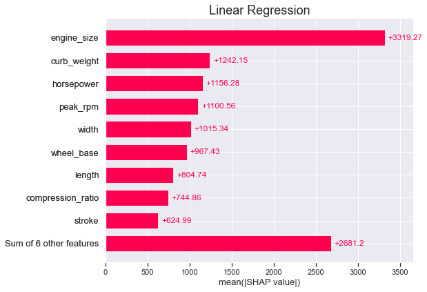
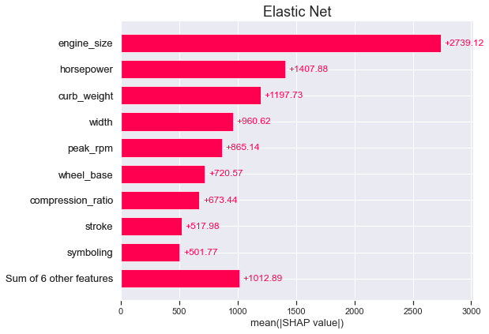
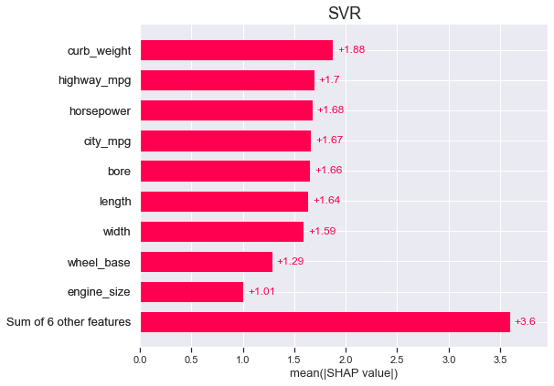
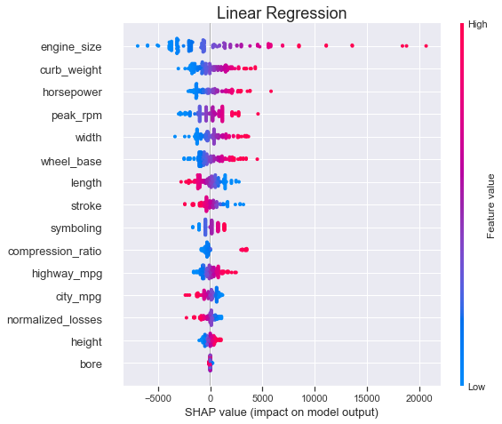
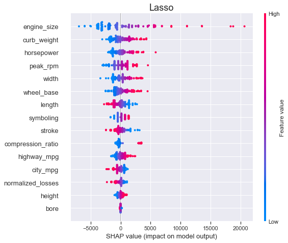
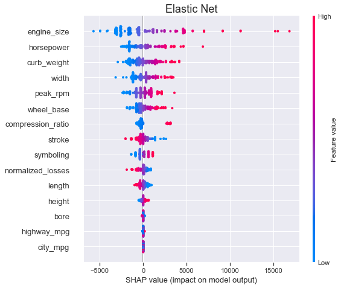
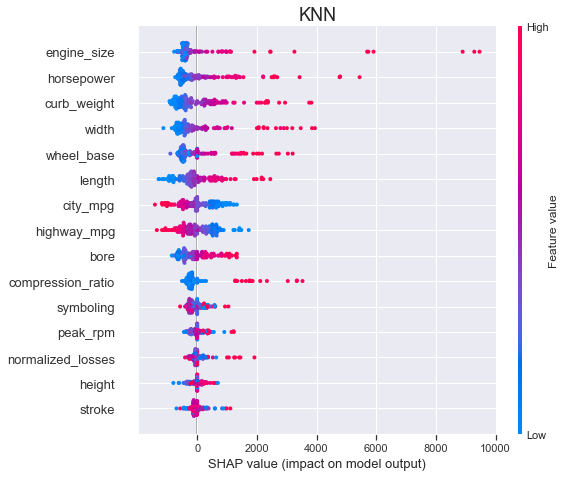
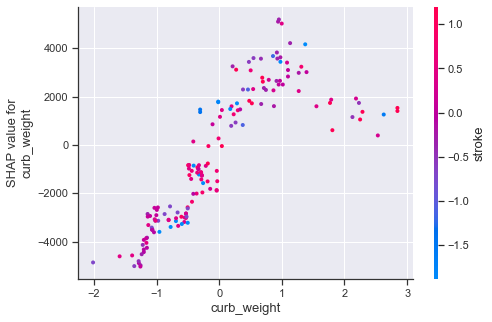

# Interpreting the ML models used to analyze the 'Automobile Data Set' from the UC Irvine Machine Learning repository

This notebook is used to analyze the 'Automobile Data Set' from the UC Irvine Machine Learning repository. The dataset is available [here](https://archive.ics.uci.edu/ml/datasets/Automobile). This notebook is based on a previous project we did, which can be accessed [here](https://github.com/gabrielleuzinger/Automobile_price). 

**Therefore, we do not make many considerations about the regression models used. The focus is on the interpretation of what the ML models used to predict the cars price are doing**.

Interpretability of ML models is important because it is used to assess many other characterisitcs of the models, such as [(DOSHI-VELEZ; KIM, 2017)](https://arxiv.org/abs/1702.08608):

1. Fairness or unbiasedness
2. Privacy
3. Reliability or robustness
4. Causality
5. Trust

The notebook is divided as follows:
    
1. Data exploration
2. Training the ML models
3. Interpreting the ML models
4. Conclusion

----------

## 1. Data exploration


```python
import pandas as pd
import numpy as np
import matplotlib.pyplot as plt
```

----------

### Getting the data


```python
attributes = ['symboling','normalized_losses','make','fuel_type','aspiration','num_of_doors','body_style',
           'drive_wheels','engine_location','wheel_base','length','width','height','curb_weight','engine_type',
           'num_of_cylinders','engine_size','fuel_system','bore','stroke','compression_ratio','horsepower',
           'peak_rpm','city_mpg','highway_mpg','price']
df_data = pd.read_csv('/Users/leuzinger/Dropbox/Data Science/Awari/SHAP/Automobile Data Set/imports-85(1).data',names=attributes)
df_data.reset_index(inplace=False)
pd.set_option('display.max_columns', None)
pd.set_option('display.max_rows', None)
df_data.head()
```


<div>
<style scoped>
    .dataframe tbody tr th:only-of-type {
        vertical-align: middle;
    }

    .dataframe tbody tr th {
        vertical-align: top;
    }

    .dataframe thead th {
        text-align: right;
    }
</style>
<table border="1" class="dataframe">
  <thead>
    <tr style="text-align: right;">
      <th></th>
      <th>symboling</th>
      <th>normalized_losses</th>
      <th>make</th>
      <th>fuel_type</th>
      <th>aspiration</th>
      <th>num_of_doors</th>
      <th>body_style</th>
      <th>drive_wheels</th>
      <th>engine_location</th>
      <th>wheel_base</th>
      <th>length</th>
      <th>width</th>
      <th>height</th>
      <th>curb_weight</th>
      <th>engine_type</th>
      <th>num_of_cylinders</th>
      <th>engine_size</th>
      <th>fuel_system</th>
      <th>bore</th>
      <th>stroke</th>
      <th>compression_ratio</th>
      <th>horsepower</th>
      <th>peak_rpm</th>
      <th>city_mpg</th>
      <th>highway_mpg</th>
      <th>price</th>
    </tr>
  </thead>
  <tbody>
    <tr>
      <th>0</th>
      <td>3</td>
      <td>?</td>
      <td>alfa-romero</td>
      <td>gas</td>
      <td>std</td>
      <td>two</td>
      <td>convertible</td>
      <td>rwd</td>
      <td>front</td>
      <td>88.6</td>
      <td>168.8</td>
      <td>64.1</td>
      <td>48.8</td>
      <td>2548</td>
      <td>dohc</td>
      <td>four</td>
      <td>130</td>
      <td>mpfi</td>
      <td>3.47</td>
      <td>2.68</td>
      <td>9.0</td>
      <td>111</td>
      <td>5000</td>
      <td>21</td>
      <td>27</td>
      <td>13495</td>
    </tr>
    <tr>
      <th>1</th>
      <td>3</td>
      <td>?</td>
      <td>alfa-romero</td>
      <td>gas</td>
      <td>std</td>
      <td>two</td>
      <td>convertible</td>
      <td>rwd</td>
      <td>front</td>
      <td>88.6</td>
      <td>168.8</td>
      <td>64.1</td>
      <td>48.8</td>
      <td>2548</td>
      <td>dohc</td>
      <td>four</td>
      <td>130</td>
      <td>mpfi</td>
      <td>3.47</td>
      <td>2.68</td>
      <td>9.0</td>
      <td>111</td>
      <td>5000</td>
      <td>21</td>
      <td>27</td>
      <td>16500</td>
    </tr>
    <tr>
      <th>2</th>
      <td>1</td>
      <td>?</td>
      <td>alfa-romero</td>
      <td>gas</td>
      <td>std</td>
      <td>two</td>
      <td>hatchback</td>
      <td>rwd</td>
      <td>front</td>
      <td>94.5</td>
      <td>171.2</td>
      <td>65.5</td>
      <td>52.4</td>
      <td>2823</td>
      <td>ohcv</td>
      <td>six</td>
      <td>152</td>
      <td>mpfi</td>
      <td>2.68</td>
      <td>3.47</td>
      <td>9.0</td>
      <td>154</td>
      <td>5000</td>
      <td>19</td>
      <td>26</td>
      <td>16500</td>
    </tr>
    <tr>
      <th>3</th>
      <td>2</td>
      <td>164</td>
      <td>audi</td>
      <td>gas</td>
      <td>std</td>
      <td>four</td>
      <td>sedan</td>
      <td>fwd</td>
      <td>front</td>
      <td>99.8</td>
      <td>176.6</td>
      <td>66.2</td>
      <td>54.3</td>
      <td>2337</td>
      <td>ohc</td>
      <td>four</td>
      <td>109</td>
      <td>mpfi</td>
      <td>3.19</td>
      <td>3.40</td>
      <td>10.0</td>
      <td>102</td>
      <td>5500</td>
      <td>24</td>
      <td>30</td>
      <td>13950</td>
    </tr>
    <tr>
      <th>4</th>
      <td>2</td>
      <td>164</td>
      <td>audi</td>
      <td>gas</td>
      <td>std</td>
      <td>four</td>
      <td>sedan</td>
      <td>4wd</td>
      <td>front</td>
      <td>99.4</td>
      <td>176.6</td>
      <td>66.4</td>
      <td>54.3</td>
      <td>2824</td>
      <td>ohc</td>
      <td>five</td>
      <td>136</td>
      <td>mpfi</td>
      <td>3.19</td>
      <td>3.40</td>
      <td>8.0</td>
      <td>115</td>
      <td>5500</td>
      <td>18</td>
      <td>22</td>
      <td>17450</td>
    </tr>
  </tbody>
</table>
</div>


----------

### Data Cleaning

After importing the data, we need to do some data cleaning. For now, we just substitute the "?" values by NaN. We also transform some numerical columns that were objects to float. Finally, we drop all the rows without a price for the car, as they do not help us train our model. Finally, as we will only consider the numerical variables in this notebook, we will drop all the columns with categorical values.


```python
df_data['num_of_doors'].replace("?","four",inplace=True)
df_data.replace("?",np.nan,inplace=True)
df_data.dropna(subset = ["price"], inplace=True)
num_cols = ['symboling', 'normalized_losses', 'wheel_base', 'length', 'width',
       'height', 'curb_weight', 'engine_size', 'bore', 'stroke',
       'compression_ratio', 'horsepower', 'peak_rpm', 'city_mpg',
       'highway_mpg', 'price']
df_data[num_cols] = df_data[num_cols].apply(pd.to_numeric, errors='coerce')

cat_cols = df_data.select_dtypes(include=['object', 'bool']).columns

df_data.drop(columns=cat_cols, inplace=True)

df_data.reset_index(drop=True,inplace=True)
df_data.info()
```

    <class 'pandas.core.frame.DataFrame'>
    RangeIndex: 201 entries, 0 to 200
    Data columns (total 16 columns):
     #   Column             Non-Null Count  Dtype  
    ---  ------             --------------  -----  
     0   symboling          201 non-null    int64  
     1   normalized_losses  164 non-null    float64
     2   wheel_base         201 non-null    float64
     3   length             201 non-null    float64
     4   width              201 non-null    float64
     5   height             201 non-null    float64
     6   curb_weight        201 non-null    int64  
     7   engine_size        201 non-null    int64  
     8   bore               197 non-null    float64
     9   stroke             197 non-null    float64
     10  compression_ratio  201 non-null    float64
     11  horsepower         199 non-null    float64
     12  peak_rpm           199 non-null    float64
     13  city_mpg           201 non-null    int64  
     14  highway_mpg        201 non-null    int64  
     15  price              201 non-null    int64  
    dtypes: float64(10), int64(6)
    memory usage: 25.2 KB


### Data visualization

A "quick way to get a feel of the type of data you are dealing with is to plot a histogram for each numerical attribute" (GÉRON, 2019).

We start our anlysis having a look at the correlation matrix of the features in the dataset. Correlation is important to understand the ML model because "interpretation remains difficult when features are strongly correlated. Because if they have a very strong correlation, it only makes sense to analyze the effect of changing both features together and not in isolation" [(MOLNAR, 2021)](https://christophm.github.io/interpretable-ml-book/).

**We verify that city mpg and highway mpg have the highest correlation between the features. Wheel base, lenght, width, and curb weight are also highly correlated, as expected**. 


```python
import seaborn as sns

corr_matrix = df_data.corr()

plt.figure(figsize=(20, 30))
sns.set_theme()
sns.set_context("notebook", font_scale=1.5)
sns.heatmap(corr_matrix,annot=True)
plt.show()
```


    

    


----------

### Creating the Train and Test sets

Creating a test set at the beginning of the project avoid *data snooping* bias, i.e., "when you estimate the generalization error using the test set, your estimate will be too optimistic, and you will launch a system that will not perform as well as expected" (GÉRON, 2019). To avoid this problem, we divide our data into a train and a test set. 

Besides, "the key to a fair comparison of machine learning algorithms is ensuring that each algorithm is evaluated in the same way on the same data. You can achieve this by forcing each algorithm to be evaluated on a consistent test harness" (BROWNLEE, 2016). In this project, we do this by using the same split in the cross validation. We use the KFold function from the sklearn library with a random value rs as the random_state parameter. Although the rs value change everytime the notebook is run, once it is set, the same rs value is used in all the models. This guarantees that all the models are evaluated on the same data.


```python
from sklearn.model_selection import train_test_split
from random import randrange

car_X = df_data.drop(['price'],axis=1)
car_y = df_data['price']

rs = randrange(10000)

X_train, X_test, y_train, y_test = train_test_split(car_X, car_y, test_size=0.2, random_state=rs)
```


```python
car_X_train = X_train.copy()
car_y_train = y_train.copy()
car_X_test = X_test.copy()
car_y_test = y_test.copy()
```

----------

## 2. Training the ML models

Before creating the ML models, we need to prepare the data so that the ML algorithms will work properly.

First, we need to clean missing values from the dataset. We have three option to deal with it [(GÉRON, 2019)](https://www.amazon.com.br/Hands-Machine-Learning-Scikit-Learn-TensorFlow/dp/1492032646):

1. Get ride of the rows with missing values
2. Get ride of the whole attirbute that have missing values
3. Set the values to some value (the median, the mean, zero, etc)

We use the median value. We create a pipeline to be used with the models we will test next. Second, we need to put all the attributes in the same scale because "Machine Learning algorithms don’t perform well when the input numerical attributes have very different scales" (GÉRON, 2019). To do this we standardized all the numerical variables.

After preparing the data set, we are ready to select and train our ML model to predict the car price.

We use the following models:

1. Linear Regression
2. Ridge regression
3. Lasso regression 
4. Elastic Net
5. Decision Tree (CART)
6. k-Nearest Neighbors (KNN)
7. Support Vector Regression (SVR)

The models are evaluated using the mean absolute error (MAE), root square mean error (RMSE), and R².


```python
from sklearn.impute import SimpleImputer
from sklearn.pipeline import Pipeline
from sklearn.preprocessing import StandardScaler

def estimator_scaler(estimator):
    imputer = SimpleImputer(strategy='median')
    pipeline = Pipeline(steps=[('i', imputer), ('scaler',StandardScaler()),('model', estimator)])
    return pipeline  
```


```python
from sklearn.metrics import mean_squared_error
from sklearn.model_selection import cross_validate
from sklearn.model_selection import KFold

def estimator_cross_val (model,estimator,pipe,matriz,rs):
    pipe_ = pipe(estimator)
    scoring = ['neg_mean_absolute_error', 'neg_root_mean_squared_error','r2']
    kfold = KFold(n_splits=10, random_state=rs,shuffle=True)
    scores = cross_validate(pipe_,car_X_train,car_y_train,cv=kfold,scoring=scoring)
    
    mae_scores = -scores.get('test_neg_mean_absolute_error')
    mae_mean = mae_scores.mean()
    mae_std = mae_scores.std()
    
    rmse_scores = -scores.get('test_neg_root_mean_squared_error')
    rmse_mean = rmse_scores.mean()
    rmse_std = rmse_scores.std()
    
    r2_scores = scores.get('test_r2')
    r2_mean = r2_scores.mean()
    r2_std = r2_scores.std()
    
    results_ = [model,mae_mean,mae_std,rmse_mean,rmse_std,r2_mean,r2_std]
    results_ = pd.Series(results_, index = matriz.columns)
    results = matriz.append(results_,ignore_index=True)
    return results
```


```python
from sklearn.linear_model import LinearRegression
from sklearn.linear_model import Ridge
from sklearn.linear_model import Lasso
from sklearn.linear_model import ElasticNet
from sklearn.tree import DecisionTreeRegressor
from sklearn.neighbors import KNeighborsRegressor
from sklearn.svm import SVR
import warnings

matriz = pd.DataFrame(columns=['model','MAE_mean','MAE_std','RMSE_mean','RMSE_std','R2_mean','R2_std'])

matriz = estimator_cross_val('Linear Regression',LinearRegression(),estimator_scaler,matriz,rs)
matriz = estimator_cross_val('Ridge Regression',Ridge(),estimator_scaler,matriz,rs)
matriz = estimator_cross_val('Lasso',Lasso(alpha=0.1),estimator_scaler,matriz,rs)
matriz = estimator_cross_val('Elastic Net',ElasticNet(alpha=0.1, l1_ratio=0.5),estimator_scaler,matriz,rs)
matriz = estimator_cross_val('KNN',KNeighborsRegressor(),estimator_scaler,matriz,rs)
matriz = estimator_cross_val('Decision Tree',DecisionTreeRegressor(random_state = rs),estimator_scaler,matriz,rs)
matriz = estimator_cross_val('SVR',SVR(),estimator_scaler,matriz,rs)
matriz
```


<div>
<style scoped>
    .dataframe tbody tr th:only-of-type {
        vertical-align: middle;
    }

    .dataframe tbody tr th {
        vertical-align: top;
    }

    .dataframe thead th {
        text-align: right;
    }
</style>
<table border="1" class="dataframe">
  <thead>
    <tr style="text-align: right;">
      <th></th>
      <th>model</th>
      <th>MAE_mean</th>
      <th>MAE_std</th>
      <th>RMSE_mean</th>
      <th>RMSE_std</th>
      <th>R2_mean</th>
      <th>R2_std</th>
    </tr>
  </thead>
  <tbody>
    <tr>
      <th>0</th>
      <td>Linear Regression</td>
      <td>2410.555761</td>
      <td>531.039003</td>
      <td>3168.832953</td>
      <td>793.719445</td>
      <td>0.823778</td>
      <td>0.075476</td>
    </tr>
    <tr>
      <th>1</th>
      <td>Ridge Regression</td>
      <td>2386.646138</td>
      <td>528.477794</td>
      <td>3147.422361</td>
      <td>806.547462</td>
      <td>0.826403</td>
      <td>0.073121</td>
    </tr>
    <tr>
      <th>2</th>
      <td>Lasso</td>
      <td>2410.379293</td>
      <td>530.977155</td>
      <td>3168.702310</td>
      <td>793.821451</td>
      <td>0.823794</td>
      <td>0.075455</td>
    </tr>
    <tr>
      <th>3</th>
      <td>Elastic Net</td>
      <td>2356.305576</td>
      <td>517.785445</td>
      <td>3152.945697</td>
      <td>824.971017</td>
      <td>0.827433</td>
      <td>0.067986</td>
    </tr>
    <tr>
      <th>4</th>
      <td>KNN</td>
      <td>2254.262500</td>
      <td>520.298486</td>
      <td>3503.140341</td>
      <td>1094.721227</td>
      <td>0.787751</td>
      <td>0.099704</td>
    </tr>
    <tr>
      <th>5</th>
      <td>Decision Tree</td>
      <td>1858.078125</td>
      <td>349.179667</td>
      <td>2618.238932</td>
      <td>500.396299</td>
      <td>0.872135</td>
      <td>0.068589</td>
    </tr>
    <tr>
      <th>6</th>
      <td>SVR</td>
      <td>5616.923040</td>
      <td>1096.988775</td>
      <td>8426.667761</td>
      <td>1569.642069</td>
      <td>-0.168911</td>
      <td>0.151919</td>
    </tr>
  </tbody>
</table>
</div>


---------

# 3. Interpreting the ML models

"There  is  little  consensus  on  what  interpretability  in  machine  learning is and how to evaluate it for benchmarking" (DOSHI-VELEZ; KIM, 2017). One option is to use use Shapley Values, a method from coalitional game theory that tells us how to fairly distribute the "payout" among the features (MOLNAR, 2021). **We use this explanation method because it is the only method with a solid theory because it satisfies the properties Efficiency, Symmetry, Dummy and Additivity** (MOLNAR, 2021).

First we plot fature importance plots, in which features with large absolute Shapley values are considered important. 

Second, we plot summary plots, that combines feature importance with feature effects. "Each point on the summary plot is a Shapley value for a feature and an instance. The position on the y-axis is determined by the feature and on the x-axis by the Shapley value. The color represents the value of the feature from low to high. Overlapping points are jittered in y-axis direction, so we get a sense of the distribution of the Shapley values per feature. The features are ordered according to their importance" (MOLNAR, 2021).

Running the models enough times, we see that the most important features significantly vary, although horsepower, curb weight, engine size, and city mpg are usually considered highly important features. Besides we also see that the models perform better when engine size and curb weight are the main features. 

Moreover, in all trials there is an interesting aspect in the regression models (Linear, Ridge, Lasso, and Elastic Net): the city mpg and the highway mpg have the opposite impact on the model, although being highly correlated. These pattern is also seen in the higly correlated features curb weight and lenght. However, there is no obvious explanation for this behavior of the models. In the KNN, Decision Tree and SVR models, these two features have similar impacts in the output. **Besides in these models the better the city mpg the lower the price, which is counterintuitive. We could expect that better mpg should result in higher prices because the car performs better**. One possible explanation is that the cars with better mpg are small and simpler cars, which have lower price, while bigger cars, such as SUV and Heavy Duty vehicles, are more expansive and have lower city mpg.


```python
import shap

#First, we prepare the data to be used in the shap method

pipeline = Pipeline(steps=[('i', SimpleImputer(strategy='median')), ('scaler',StandardScaler())])
pipeline.fit(car_X_train)

car_X_train_tf = pipeline.transform(car_X_train)
car_X_test_tf = pipeline.transform(car_X_test)

car_X_train_tf = pd.DataFrame(car_X_train_tf,index = car_X_train.index, columns=car_X_train.columns)
car_X_test_tf = pd.DataFrame(car_X_test_tf,index = car_X_test.index, columns=car_X_test.columns)

car_X_train_tf_summary = shap.kmeans(car_X_train_tf, 10)
```


```python
models = [LinearRegression(),Ridge(),Lasso(alpha=0.1),ElasticNet(alpha=0.1, l1_ratio=0.5),KNeighborsRegressor(),DecisionTreeRegressor(random_state=rs),SVR()]
models_str = ['Linear Regression','Ridge Regression','Lasso','Elastic Net','KNN','Decision Tree','SVR']

for k in range(len(models)):
    model = models[k]
    model.fit(car_X_train_tf,car_y_train)
    explainer = shap.Explainer(model.predict, car_X_train_tf)
    shap_values = explainer(car_X_train_tf)
    plt.title(models_str[k])
    shap.plots.bar(shap_values)
```


    

    


    

    


    

    


    

    


    Permutation explainer: 161it [00:21,  3.56it/s]                         


    

    


    

    


    Permutation explainer: 161it [01:22,  1.72it/s]                         


    

    


```python
for k in range(len(models)):
    model = models[k]
    model.fit(car_X_train_tf,car_y_train)
    ex = shap.KernelExplainer(model.predict, car_X_train_tf_summary)
    shap_values = ex.shap_values(car_X_train_tf)
    plt.title(models_str[k])
    shap.summary_plot(shap_values, car_X_train_tf)
```


    HBox(children=(HTML(value=''), FloatProgress(value=0.0, max=160.0), HTML(value='')))


    


    

    


    HBox(children=(HTML(value=''), FloatProgress(value=0.0, max=160.0), HTML(value='')))


    


    

    


    HBox(children=(HTML(value=''), FloatProgress(value=0.0, max=160.0), HTML(value='')))


    


    

    


    HBox(children=(HTML(value=''), FloatProgress(value=0.0, max=160.0), HTML(value='')))


    


    

    


    HBox(children=(HTML(value=''), FloatProgress(value=0.0, max=160.0), HTML(value='')))


    


    

    


    HBox(children=(HTML(value=''), FloatProgress(value=0.0, max=160.0), HTML(value='')))


    


    

    


    HBox(children=(HTML(value=''), FloatProgress(value=0.0, max=160.0), HTML(value='')))


    


    

    


--------

We can explore a little further the two best performing models: Elastic Net and Decision Tree.

We can cluster the Shapley values to find groups of similar instances. Although this can be more helpfull when interpreting classification models, the clustering may reveal interesting patterns in regression models too.

**For the Elastic Net model, we can distinguish two groups**. In the first, engine size and curb weight are driving the price forecast below average. In the second group, engine size and engine horsepower are causing the price forecast to be above the average value, resulting in higher predictions.

**For the Decision Tree, we have three different groups**. The first is characterized by below-average prices, driven by the curb weight feature. In the second, the opposite occurs, that is, the curb weight is pushing prices above the average. The third group is the one with the highest price predictions, which are determined mainly by the engine size. 

Then, we can have a look at dependence plots for the main features of each model. For the Elastic Net model, there is not much information in these plots. 

In the case of the Decision Tree model, we see that increasing the curb weight result in an increase Shapley value until a certain point, where we see four ramifications of and increasing the curb weight have different impact in the Shapley values. For the engine size, we verify that until a certain point, it has almost no influence in the Shapley value. However, when this threshold is passed, increasing the engine size has a relevant impact in the increase of the Shapley values. These two patterns are consistent with the Decision Tree model.

Finally, we can plot force graphs to see how the features are impacting individual observations. We select the same three observations for each model, to see the differences between them. In these force plots, it is possible to see the patterns of each of the groups we detailed above.


```python
shap.initjs()
model = ElasticNet(alpha=0.1, l1_ratio=0.5)
model.fit(car_X_train_tf,car_y_train)
ex1 = shap.KernelExplainer(model.predict, car_X_train_tf_summary)
shap_values1 = ex1.shap_values(car_X_train_tf)
shap.force_plot(ex1.expected_value, shap_values1, car_X_train_tf)
```


<div align='center'></div><script charset='utf-8'>!function(t){function e(r){if(n[r])return n[r].exports;var i=n[r]={i:r,l:!1,exports:{}};return t[r].call(i.exports,i,i.exports,e),i.l=!0,i.exports}var n={};return e.m=t,e.c=n,e.i=function(t){return t},e.d=function(t,n,r){e.o(t,n)||Object.defineProperty(t,n,{configurable:!1,enumerable:!0,get:r})},e.n=function(t){var n=t&&t.__esModule?function(){return t.default}:function(){return t};return e.d(n,"a",n),n},e.o=function(t,e){return Object.prototype.hasOwnProperty.call(t,e)},e.p="",e(e.s=410)}([function(t,e,n){"use strict";function r(t,e,n,r,o,a,u,c){if(i(e),!t){var s;if(void 0===e)s=new Error("Minified exception occurred; use the non-minified dev environment for the full error message and additional helpful warnings.");else{var l=[n,r,o,a,u,c],f=0;s=new Error(e.replace(/%s/g,function(){return l[f++]})),s.name="Invariant Violation"}throw s.framesToPop=1,s}}var i=function(t){};t.exports=r},function(t,e,n){"use strict";var r=n(8),i=r;t.exports=i},function(t,e,n){"use strict";function r(t){for(var e=arguments.length-1,n="Minified React error #"+t+"; visit http://facebook.github.io/react/docs/error-decoder.html?invariant="+t,r=0;r<e;r++)n+="&args[]="+encodeURIComponent(arguments[r+1]);n+=" for the full message or use the non-minified dev environment for full errors and additional helpful warnings.";var i=new Error(n);throw i.name="Invariant Violation",i.framesToPop=1,i}t.exports=r},function(t,e,n){"use strict";function r(t){if(null===t||void 0===t)throw new TypeError("Object.assign cannot be called with null or undefined");return Object(t)}function i(){try{if(!Object.assign)return!1;var t=new String("abc");if(t[5]="de","5"===Object.getOwnPropertyNames(t)[0])return!1;for(var e={},n=0;n<10;n++)e["_"+String.fromCharCode(n)]=n;var r=Object.getOwnPropertyNames(e).map(function(t){return e[t]});if("0123456789"!==r.join(""))return!1;var i={};return"abcdefghijklmnopqrst".split("").forEach(function(t){i[t]=t}),"abcdefghijklmnopqrst"===Object.keys(Object.assign({},i)).join("")}catch(t){return!1}}/*
object-assign
(c) Sindre Sorhus
@license MIT
*/
var o=Object.getOwnPropertySymbols,a=Object.prototype.hasOwnProperty,u=Object.prototype.propertyIsEnumerable;t.exports=i()?Object.assign:function(t,e){for(var n,i,c=r(t),s=1;s<arguments.length;s++){n=Object(arguments[s]);for(var l in n)a.call(n,l)&&(c[l]=n[l]);if(o){i=o(n);for(var f=0;f<i.length;f++)u.call(n,i[f])&&(c[i[f]]=n[i[f]])}}return c}},function(t,e,n){"use strict";function r(t,e){return 1===t.nodeType&&t.getAttribute(d)===String(e)||8===t.nodeType&&t.nodeValue===" react-text: "+e+" "||8===t.nodeType&&t.nodeValue===" react-empty: "+e+" "}function i(t){for(var e;e=t._renderedComponent;)t=e;return t}function o(t,e){var n=i(t);n._hostNode=e,e[g]=n}function a(t){var e=t._hostNode;e&&(delete e[g],t._hostNode=null)}function u(t,e){if(!(t._flags&v.hasCachedChildNodes)){var n=t._renderedChildren,a=e.firstChild;t:for(var u in n)if(n.hasOwnProperty(u)){var c=n[u],s=i(c)._domID;if(0!==s){for(;null!==a;a=a.nextSibling)if(r(a,s)){o(c,a);continue t}f("32",s)}}t._flags|=v.hasCachedChildNodes}}function c(t){if(t[g])return t[g];for(var e=[];!t[g];){if(e.push(t),!t.parentNode)return null;t=t.parentNode}for(var n,r;t&&(r=t[g]);t=e.pop())n=r,e.length&&u(r,t);return n}function s(t){var e=c(t);return null!=e&&e._hostNode===t?e:null}function l(t){if(void 0===t._hostNode?f("33"):void 0,t._hostNode)return t._hostNode;for(var e=[];!t._hostNode;)e.push(t),t._hostParent?void 0:f("34"),t=t._hostParent;for(;e.length;t=e.pop())u(t,t._hostNode);return t._hostNode}var f=n(2),p=n(21),h=n(157),d=(n(0),p.ID_ATTRIBUTE_NAME),v=h,g="__reactInternalInstance$"+Math.random().toString(36).slice(2),m={getClosestInstanceFromNode:c,getInstanceFromNode:s,getNodeFromInstance:l,precacheChildNodes:u,precacheNode:o,uncacheNode:a};t.exports=m},function(t,e,n){"use strict";function r(t,e,n,a){function u(e){return t(e=new Date(+e)),e}return u.floor=u,u.ceil=function(n){return t(n=new Date(n-1)),e(n,1),t(n),n},u.round=function(t){var e=u(t),n=u.ceil(t);return t-e<n-t?e:n},u.offset=function(t,n){return e(t=new Date(+t),null==n?1:Math.floor(n)),t},u.range=function(n,r,i){var o=[];if(n=u.ceil(n),i=null==i?1:Math.floor(i),!(n<r&&i>0))return o;do o.push(new Date(+n));while(e(n,i),t(n),n<r);return o},u.filter=function(n){return r(function(e){if(e>=e)for(;t(e),!n(e);)e.setTime(e-1)},function(t,r){if(t>=t)for(;--r>=0;)for(;e(t,1),!n(t););})},n&&(u.count=function(e,r){return i.setTime(+e),o.setTime(+r),t(i),t(o),Math.floor(n(i,o))},u.every=function(t){return t=Math.floor(t),isFinite(t)&&t>0?t>1?u.filter(a?function(e){return a(e)%t===0}:function(e){return u.count(0,e)%t===0}):u:null}),u}e.a=r;var i=new Date,o=new Date},function(t,e,n){"use strict";var r=!("undefined"==typeof window||!window.document||!window.document.createElement),i={canUseDOM:r,canUseWorkers:"undefined"!=typeof Worker,canUseEventListeners:r&&!(!window.addEventListener&&!window.attachEvent),canUseViewport:r&&!!window.screen,isInWorker:!r};t.exports=i},function(t,e,n){"use strict";function r(t,e){this._groups=t,this._parents=e}function i(){return new r([[document.documentElement]],D)}var o=n(272),a=n(273),u=n(261),c=n(255),s=n(131),l=n(260),f=n(265),p=n(268),h=n(275),d=n(253),v=n(267),g=n(266),m=n(274),y=n(259),_=n(258),b=n(252),x=n(276),w=n(269),C=n(254),M=n(277),k=n(262),E=n(270),T=n(264),S=n(251),P=n(263),N=n(271),A=n(256),O=n(70),I=n(257);n.d(e,"c",function(){return D}),e.b=r;var D=[null];r.prototype=i.prototype={constructor:r,select:o.a,selectAll:a.a,filter:u.a,data:c.a,enter:s.a,exit:l.a,merge:f.a,order:p.a,sort:h.a,call:d.a,nodes:v.a,node:g.a,size:m.a,empty:y.a,each:_.a,attr:b.a,style:x.a,property:w.a,classed:C.a,text:M.a,html:k.a,raise:E.a,lower:T.a,append:S.a,insert:P.a,remove:N.a,datum:A.a,on:O.c,dispatch:I.a},e.a=i},function(t,e,n){"use strict";function r(t){return function(){return t}}var i=function(){};i.thatReturns=r,i.thatReturnsFalse=r(!1),i.thatReturnsTrue=r(!0),i.thatReturnsNull=r(null),i.thatReturnsThis=function(){return this},i.thatReturnsArgument=function(t){return t},t.exports=i},function(t,e,n){"use strict";var r=null;t.exports={debugTool:r}},function(t,e,n){"use strict";Object.defineProperty(e,"__esModule",{value:!0});var r=n(59);n.d(e,"color",function(){return r.a}),n.d(e,"rgb",function(){return r.b}),n.d(e,"hsl",function(){return r.c});var i=n(210);n.d(e,"lab",function(){return i.a}),n.d(e,"hcl",function(){return i.b});var o=n(209);n.d(e,"cubehelix",function(){return o.a})},function(t,e,n){"use strict";function r(){T.ReactReconcileTransaction&&x?void 0:l("123")}function i(){this.reinitializeTransaction(),this.dirtyComponentsLength=null,this.callbackQueue=p.getPooled(),this.reconcileTransaction=T.ReactReconcileTransaction.getPooled(!0)}function o(t,e,n,i,o,a){return r(),x.batchedUpdates(t,e,n,i,o,a)}function a(t,e){return t._mountOrder-e._mountOrder}function u(t){var e=t.dirtyComponentsLength;e!==m.length?l("124",e,m.length):void 0,m.sort(a),y++;for(var n=0;n<e;n++){var r=m[n],i=r._pendingCallbacks;r._pendingCallbacks=null;var o;if(d.logTopLevelRenders){var u=r;r._currentElement.type.isReactTopLevelWrapper&&(u=r._renderedComponent),o="React update: "+u.getName(),console.time(o)}if(v.performUpdateIfNecessary(r,t.reconcileTransaction,y),o&&console.timeEnd(o),i)for(var c=0;c<i.length;c++)t.callbackQueue.enqueue(i[c],r.getPublicInstance())}}function c(t){return r(),x.isBatchingUpdates?(m.push(t),void(null==t._updateBatchNumber&&(t._updateBatchNumber=y+1))):void x.batchedUpdates(c,t)}function s(t,e){x.isBatchingUpdates?void 0:l("125"),_.enqueue(t,e),b=!0}var l=n(2),f=n(3),p=n(155),h=n(17),d=n(160),v=n(24),g=n(53),m=(n(0),[]),y=0,_=p.getPooled(),b=!1,x=null,w={initialize:function(){this.dirtyComponentsLength=m.length},close:function(){this.dirtyComponentsLength!==m.length?(m.splice(0,this.dirtyComponentsLength),k()):m.length=0}},C={initialize:function(){this.callbackQueue.reset()},close:function(){this.callbackQueue.notifyAll()}},M=[w,C];f(i.prototype,g,{getTransactionWrappers:function(){return M},destructor:function(){this.dirtyComponentsLength=null,p.release(this.callbackQueue),this.callbackQueue=null,T.ReactReconcileTransaction.release(this.reconcileTransaction),this.reconcileTransaction=null},perform:function(t,e,n){return g.perform.call(this,this.reconcileTransaction.perform,this.reconcileTransaction,t,e,n)}}),h.addPoolingTo(i);var k=function(){for(;m.length||b;){if(m.length){var t=i.getPooled();t.perform(u,null,t),i.release(t)}if(b){b=!1;var e=_;_=p.getPooled(),e.notifyAll(),p.release(e)}}},E={injectReconcileTransaction:function(t){t?void 0:l("126"),T.ReactReconcileTransaction=t},injectBatchingStrategy:function(t){t?void 0:l("127"),"function"!=typeof t.batchedUpdates?l("128"):void 0,"boolean"!=typeof t.isBatchingUpdates?l("129"):void 0,x=t}},T={ReactReconcileTransaction:null,batchedUpdates:o,enqueueUpdate:c,flushBatchedUpdates:k,injection:E,asap:s};t.exports=T},function(t,e,n){"use strict";var r=n(102);n.d(e,"c",function(){return r.a});var i=n(18);n.d(e,"f",function(){return i.a});var o=n(103);n.d(e,"d",function(){return o.a});var a=(n(185),n(104),n(105),n(186),n(197),n(198),n(108),n(188),n(189),n(190),n(191),n(106),n(192),n(193),n(57));n.d(e,"e",function(){return a.a});var u=n(107);n.d(e,"g",function(){return u.a});var c=(n(194),n(195),n(196),n(109));n.d(e,"a",function(){return c.a}),n.d(e,"b",function(){return c.b});n(110),n(111),n(199)},function(t,e,n){"use strict";n.d(e,"e",function(){return r}),n.d(e,"d",function(){return i}),n.d(e,"c",function(){return o}),n.d(e,"b",function(){return a}),n.d(e,"a",function(){return u});var r=1e3,i=6e4,o=36e5,a=864e5,u=6048e5},function(t,e,n){"use strict";function r(t,e,n,r){this.dispatchConfig=t,this._targetInst=e,this.nativeEvent=n;var i=this.constructor.Interface;for(var o in i)if(i.hasOwnProperty(o)){var u=i[o];u?this[o]=u(n):"target"===o?this.target=r:this[o]=n[o]}var c=null!=n.defaultPrevented?n.defaultPrevented:n.returnValue===!1;return c?this.isDefaultPrevented=a.thatReturnsTrue:this.isDefaultPrevented=a.thatReturnsFalse,this.isPropagationStopped=a.thatReturnsFalse,this}var i=n(3),o=n(17),a=n(8),u=(n(1),"function"==typeof Proxy,["dispatchConfig","_targetInst","nativeEvent","isDefaultPrevented","isPropagationStopped","_dispatchListeners","_dispatchInstances"]),c={type:null,target:null,currentTarget:a.thatReturnsNull,eventPhase:null,bubbles:null,cancelable:null,timeStamp:function(t){return t.timeStamp||Date.now()},defaultPrevented:null,isTrusted:null};i(r.prototype,{preventDefault:function(){this.defaultPrevented=!0;var t=this.nativeEvent;t&&(t.preventDefault?t.preventDefault():"unknown"!=typeof t.returnValue&&(t.returnValue=!1),this.isDefaultPrevented=a.thatReturnsTrue)},stopPropagation:function(){var t=this.nativeEvent;t&&(t.stopPropagation?t.stopPropagation():"unknown"!=typeof t.cancelBubble&&(t.cancelBubble=!0),this.isPropagationStopped=a.thatReturnsTrue)},persist:function(){this.isPersistent=a.thatReturnsTrue},isPersistent:a.thatReturnsFalse,destructor:function(){var t=this.constructor.Interface;for(var e in t)this[e]=null;for(var n=0;n<u.length;n++)this[u[n]]=null}}),r.Interface=c,r.augmentClass=function(t,e){var n=this,r=function(){};r.prototype=n.prototype;var a=new r;i(a,t.prototype),t.prototype=a,t.prototype.constructor=t,t.Interface=i({},n.Interface,e),t.augmentClass=n.augmentClass,o.addPoolingTo(t,o.fourArgumentPooler)},o.addPoolingTo(r,o.fourArgumentPooler),t.exports=r},function(t,e,n){"use strict";var r={current:null};t.exports=r},function(t,e,n){"use strict";n.d(e,"a",function(){return i}),n.d(e,"b",function(){return o});var r=Array.prototype,i=r.map,o=r.slice},function(t,e,n){"use strict";var r=n(2),i=(n(0),function(t){var e=this;if(e.instancePool.length){var n=e.instancePool.pop();return e.call(n,t),n}return new e(t)}),o=function(t,e){var n=this;if(n.instancePool.length){var r=n.instancePool.pop();return n.call(r,t,e),r}return new n(t,e)},a=function(t,e,n){var r=this;if(r.instancePool.length){var i=r.instancePool.pop();return r.call(i,t,e,n),i}return new r(t,e,n)},u=function(t,e,n,r){var i=this;if(i.instancePool.length){var o=i.instancePool.pop();return i.call(o,t,e,n,r),o}return new i(t,e,n,r)},c=function(t){var e=this;t instanceof e?void 0:r("25"),t.destructor(),e.instancePool.length<e.poolSize&&e.instancePool.push(t)},s=10,l=i,f=function(t,e){var n=t;return n.instancePool=[],n.getPooled=e||l,n.poolSize||(n.poolSize=s),n.release=c,n},p={addPoolingTo:f,oneArgumentPooler:i,twoArgumentPooler:o,threeArgumentPooler:a,fourArgumentPooler:u};t.exports=p},function(t,e,n){"use strict";e.a=function(t,e){return t<e?-1:t>e?1:t>=e?0:NaN}},function(t,e,n){"use strict";e.a=function(t){return function(){return t}}},function(t,e,n){"use strict";function r(t){if(g){var e=t.node,n=t.children;if(n.length)for(var r=0;r<n.length;r++)m(e,n[r],null);else null!=t.html?f(e,t.html):null!=t.text&&h(e,t.text)}}function i(t,e){t.parentNode.replaceChild(e.node,t),r(e)}function o(t,e){g?t.children.push(e):t.node.appendChild(e.node)}function a(t,e){g?t.html=e:f(t.node,e)}function u(t,e){g?t.text=e:h(t.node,e)}function c(){return this.node.nodeName}function s(t){return{node:t,children:[],html:null,text:null,toString:c}}var l=n(82),f=n(55),p=n(90),h=n(171),d=1,v=11,g="undefined"!=typeof document&&"number"==typeof document.documentMode||"undefined"!=typeof navigator&&"string"==typeof navigator.userAgent&&/\bEdge\/\d/.test(navigator.userAgent),m=p(function(t,e,n){e.node.nodeType===v||e.node.nodeType===d&&"object"===e.node.nodeName.toLowerCase()&&(null==e.node.namespaceURI||e.node.namespaceURI===l.html)?(r(e),t.insertBefore(e.node,n)):(t.insertBefore(e.node,n),r(e))});s.insertTreeBefore=m,s.replaceChildWithTree=i,s.queueChild=o,s.queueHTML=a,s.queueText=u,t.exports=s},function(t,e,n){"use strict";function r(t,e){return(t&e)===e}var i=n(2),o=(n(0),{MUST_USE_PROPERTY:1,HAS_BOOLEAN_VALUE:4,HAS_NUMERIC_VALUE:8,HAS_POSITIVE_NUMERIC_VALUE:24,HAS_OVERLOADED_BOOLEAN_VALUE:32,injectDOMPropertyConfig:function(t){var e=o,n=t.Properties||{},a=t.DOMAttributeNamespaces||{},c=t.DOMAttributeNames||{},s=t.DOMPropertyNames||{},l=t.DOMMutationMethods||{};t.isCustomAttribute&&u._isCustomAttributeFunctions.push(t.isCustomAttribute);for(var f in n){u.properties.hasOwnProperty(f)?i("48",f):void 0;var p=f.toLowerCase(),h=n[f],d={attributeName:p,attributeNamespace:null,propertyName:f,mutationMethod:null,mustUseProperty:r(h,e.MUST_USE_PROPERTY),hasBooleanValue:r(h,e.HAS_BOOLEAN_VALUE),hasNumericValue:r(h,e.HAS_NUMERIC_VALUE),hasPositiveNumericValue:r(h,e.HAS_POSITIVE_NUMERIC_VALUE),hasOverloadedBooleanValue:r(h,e.HAS_OVERLOADED_BOOLEAN_VALUE)};if(d.hasBooleanValue+d.hasNumericValue+d.hasOverloadedBooleanValue<=1?void 0:i("50",f),c.hasOwnProperty(f)){var v=c[f];d.attributeName=v}a.hasOwnProperty(f)&&(d.attributeNamespace=a[f]),s.hasOwnProperty(f)&&(d.propertyName=s[f]),l.hasOwnProperty(f)&&(d.mutationMethod=l[f]),u.properties[f]=d}}}),a=":A-Z_a-z\\u00C0-\\u00D6\\u00D8-\\u00F6\\u00F8-\\u02FF\\u0370-\\u037D\\u037F-\\u1FFF\\u200C-\\u200D\\u2070-\\u218F\\u2C00-\\u2FEF\\u3001-\\uD7FF\\uF900-\\uFDCF\\uFDF0-\\uFFFD",u={ID_ATTRIBUTE_NAME:"data-reactid",ROOT_ATTRIBUTE_NAME:"data-reactroot",ATTRIBUTE_NAME_START_CHAR:a,ATTRIBUTE_NAME_CHAR:a+"\\-.0-9\\u00B7\\u0300-\\u036F\\u203F-\\u2040",properties:{},getPossibleStandardName:null,_isCustomAttributeFunctions:[],isCustomAttribute:function(t){for(var e=0;e<u._isCustomAttributeFunctions.length;e++){var n=u._isCustomAttributeFunctions[e];if(n(t))return!0}return!1},injection:o};t.exports=u},function(t,e,n){"use strict";function r(t){return"button"===t||"input"===t||"select"===t||"textarea"===t}function i(t,e,n){switch(t){case"onClick":case"onClickCapture":case"onDoubleClick":case"onDoubleClickCapture":case"onMouseDown":case"onMouseDownCapture":case"onMouseMove":case"onMouseMoveCapture":case"onMouseUp":case"onMouseUpCapture":return!(!n.disabled||!r(e));default:return!1}}var o=n(2),a=n(83),u=n(50),c=n(87),s=n(165),l=n(166),f=(n(0),{}),p=null,h=function(t,e){t&&(u.executeDispatchesInOrder(t,e),t.isPersistent()||t.constructor.release(t))},d=function(t){return h(t,!0)},v=function(t){return h(t,!1)},g=function(t){return"."+t._rootNodeID},m={injection:{injectEventPluginOrder:a.injectEventPluginOrder,injectEventPluginsByName:a.injectEventPluginsByName},putListener:function(t,e,n){"function"!=typeof n?o("94",e,typeof n):void 0;var r=g(t),i=f[e]||(f[e]={});i[r]=n;var u=a.registrationNameModules[e];u&&u.didPutListener&&u.didPutListener(t,e,n)},getListener:function(t,e){var n=f[e];if(i(e,t._currentElement.type,t._currentElement.props))return null;var r=g(t);return n&&n[r]},deleteListener:function(t,e){var n=a.registrationNameModules[e];n&&n.willDeleteListener&&n.willDeleteListener(t,e);var r=f[e];if(r){var i=g(t);delete r[i]}},deleteAllListeners:function(t){var e=g(t);for(var n in f)if(f.hasOwnProperty(n)&&f[n][e]){var r=a.registrationNameModules[n];r&&r.willDeleteListener&&r.willDeleteListener(t,n),delete f[n][e]}},extractEvents:function(t,e,n,r){for(var i,o=a.plugins,u=0;u<o.length;u++){var c=o[u];if(c){var l=c.extractEvents(t,e,n,r);l&&(i=s(i,l))}}return i},enqueueEvents:function(t){t&&(p=s(p,t))},processEventQueue:function(t){var e=p;p=null,t?l(e,d):l(e,v),p?o("95"):void 0,c.rethrowCaughtError()},__purge:function(){f={}},__getListenerBank:function(){return f}};t.exports=m},function(t,e,n){"use strict";function r(t,e,n){var r=e.dispatchConfig.phasedRegistrationNames[n];return m(t,r)}function i(t,e,n){var i=r(t,n,e);i&&(n._dispatchListeners=v(n._dispatchListeners,i),n._dispatchInstances=v(n._dispatchInstances,t))}function o(t){t&&t.dispatchConfig.phasedRegistrationNames&&d.traverseTwoPhase(t._targetInst,i,t)}function a(t){if(t&&t.dispatchConfig.phasedRegistrationNames){var e=t._targetInst,n=e?d.getParentInstance(e):null;d.traverseTwoPhase(n,i,t)}}function u(t,e,n){if(n&&n.dispatchConfig.registrationName){var r=n.dispatchConfig.registrationName,i=m(t,r);i&&(n._dispatchListeners=v(n._dispatchListeners,i),n._dispatchInstances=v(n._dispatchInstances,t))}}function c(t){t&&t.dispatchConfig.registrationName&&u(t._targetInst,null,t)}function s(t){g(t,o)}function l(t){g(t,a)}function f(t,e,n,r){d.traverseEnterLeave(n,r,u,t,e)}function p(t){g(t,c)}var h=n(22),d=n(50),v=n(165),g=n(166),m=(n(1),h.getListener),y={accumulateTwoPhaseDispatches:s,accumulateTwoPhaseDispatchesSkipTarget:l,accumulateDirectDispatches:p,accumulateEnterLeaveDispatches:f};t.exports=y},function(t,e,n){"use strict";function r(){i.attachRefs(this,this._currentElement)}var i=n(368),o=(n(9),n(1),{mountComponent:function(t,e,n,i,o,a){var u=t.mountComponent(e,n,i,o,a);return t._currentElement&&null!=t._currentElement.ref&&e.getReactMountReady().enqueue(r,t),u},getHostNode:function(t){return t.getHostNode()},unmountComponent:function(t,e){i.detachRefs(t,t._currentElement),t.unmountComponent(e)},receiveComponent:function(t,e,n,o){var a=t._currentElement;if(e!==a||o!==t._context){var u=i.shouldUpdateRefs(a,e);u&&i.detachRefs(t,a),t.receiveComponent(e,n,o),u&&t._currentElement&&null!=t._currentElement.ref&&n.getReactMountReady().enqueue(r,t)}},performUpdateIfNecessary:function(t,e,n){t._updateBatchNumber===n&&t.performUpdateIfNecessary(e)}});t.exports=o},function(t,e,n){"use strict";function r(t,e,n,r){return i.call(this,t,e,n,r)}var i=n(14),o=n(93),a={view:function(t){if(t.view)return t.view;var e=o(t);if(e.window===e)return e;var n=e.ownerDocument;return n?n.defaultView||n.parentWindow:window},detail:function(t){return t.detail||0}};i.augmentClass(r,a),t.exports=r},function(t,e,n){"use strict";var r=n(3),i=n(401),o=n(97),a=n(406),u=n(402),c=n(403),s=n(27),l=n(404),f=n(407),p=n(408),h=(n(1),s.createElement),d=s.createFactory,v=s.cloneElement,g=r,m={Children:{map:i.map,forEach:i.forEach,count:i.count,toArray:i.toArray,only:p},Component:o,PureComponent:a,createElement:h,cloneElement:v,isValidElement:s.isValidElement,PropTypes:l,createClass:u.createClass,createFactory:d,createMixin:function(t){return t},DOM:c,version:f,__spread:g};t.exports=m},function(t,e,n){"use strict";function r(t){return void 0!==t.ref}function i(t){return void 0!==t.key}var o=n(3),a=n(15),u=(n(1),n(176),Object.prototype.hasOwnProperty),c=n(174),s={key:!0,ref:!0,__self:!0,__source:!0},l=function(t,e,n,r,i,o,a){var u={$$typeof:c,type:t,key:e,ref:n,props:a,_owner:o};return u};l.createElement=function(t,e,n){var o,c={},f=null,p=null,h=null,d=null;if(null!=e){r(e)&&(p=e.ref),i(e)&&(f=""+e.key),h=void 0===e.__self?null:e.__self,d=void 0===e.__source?null:e.__source;for(o in e)u.call(e,o)&&!s.hasOwnProperty(o)&&(c[o]=e[o])}var v=arguments.length-2;if(1===v)c.children=n;else if(v>1){for(var g=Array(v),m=0;m<v;m++)g[m]=arguments[m+2];c.children=g}if(t&&t.defaultProps){var y=t.defaultProps;for(o in y)void 0===c[o]&&(c[o]=y[o])}return l(t,f,p,h,d,a.current,c)},l.createFactory=function(t){var e=l.createElement.bind(null,t);return e.type=t,e},l.cloneAndReplaceKey=function(t,e){var n=l(t.type,e,t.ref,t._self,t._source,t._owner,t.props);return n},l.cloneElement=function(t,e,n){var c,f=o({},t.props),p=t.key,h=t.ref,d=t._self,v=t._source,g=t._owner;if(null!=e){r(e)&&(h=e.ref,g=a.current),i(e)&&(p=""+e.key);var m;t.type&&t.type.defaultProps&&(m=t.type.defaultProps);for(c in e)u.call(e,c)&&!s.hasOwnProperty(c)&&(void 0===e[c]&&void 0!==m?f[c]=m[c]:f[c]=e[c])}var y=arguments.length-2;if(1===y)f.children=n;else if(y>1){for(var _=Array(y),b=0;b<y;b++)_[b]=arguments[b+2];f.children=_}return l(t.type,p,h,d,v,g,f)},l.isValidElement=function(t){return"object"==typeof t&&null!==t&&t.$$typeof===c},t.exports=l},function(t,e,n){"use strict";function r(t){for(var e=arguments.length-1,n="Minified React error #"+t+"; visit http://facebook.github.io/react/docs/error-decoder.html?invariant="+t,r=0;r<e;r++)n+="&args[]="+encodeURIComponent(arguments[r+1]);n+=" for the full message or use the non-minified dev environment for full errors and additional helpful warnings.";var i=new Error(n);throw i.name="Invariant Violation",i.framesToPop=1,i}t.exports=r},function(t,e,n){"use strict";e.a=function(t){return null===t?NaN:+t}},function(t,e,n){"use strict";Object.defineProperty(e,"__esModule",{value:!0});var r=n(211);n.d(e,"formatDefaultLocale",function(){return r.a}),n.d(e,"format",function(){return r.b}),n.d(e,"formatPrefix",function(){return r.c});var i=n(117);n.d(e,"formatLocale",function(){return i.a});var o=n(115);n.d(e,"formatSpecifier",function(){return o.a});var a=n(215);n.d(e,"precisionFixed",function(){return a.a});var u=n(216);n.d(e,"precisionPrefix",function(){return u.a});var c=n(217);n.d(e,"precisionRound",function(){return c.a})},function(t,e,n){"use strict";var r=n(63);n.d(e,"b",function(){return r.a});var i=(n(118),n(62),n(119),n(121),n(43));n.d(e,"a",function(){return i.a});var o=(n(122),n(223));n.d(e,"c",function(){return o.a});var a=(n(124),n(225),n(227),n(123),n(220),n(221),n(219),n(218));n.d(e,"d",function(){return a.a});n(222)},function(t,e,n){"use strict";function r(t,e){return function(n){return t+n*e}}function i(t,e,n){return t=Math.pow(t,n),e=Math.pow(e,n)-t,n=1/n,function(r){return Math.pow(t+r*e,n)}}function o(t,e){var i=e-t;return i?r(t,i>180||i<-180?i-360*Math.round(i/360):i):n.i(c.a)(isNaN(t)?e:t)}function a(t){return 1===(t=+t)?u:function(e,r){return r-e?i(e,r,t):n.i(c.a)(isNaN(e)?r:e)}}function u(t,e){var i=e-t;return i?r(t,i):n.i(c.a)(isNaN(t)?e:t)}var c=n(120);e.b=o,e.c=a,e.a=u},function(t,e,n){"use strict";e.a=function(t){return t.match(/.{6}/g).map(function(t){return"#"+t})}},function(t,e,n){"use strict";function r(t){var e=t.domain;return t.ticks=function(t){var r=e();return n.i(o.a)(r[0],r[r.length-1],null==t?10:t)},t.tickFormat=function(t,r){return n.i(c.a)(e(),t,r)},t.nice=function(r){var i=e(),a=i.length-1,u=null==r?10:r,c=i[0],s=i[a],l=n.i(o.b)(c,s,u);return l&&(l=n.i(o.b)(Math.floor(c/l)*l,Math.ceil(s/l)*l,u),i[0]=Math.floor(c/l)*l,i[a]=Math.ceil(s/l)*l,e(i)),t},t}function i(){var t=n.i(u.a)(u.b,a.a);return t.copy=function(){return n.i(u.c)(t,i())},r(t)}var o=n(12),a=n(31),u=n(45),c=n(243);e.b=r,e.a=i},function(t,e,n){"use strict";n.d(e,"a",function(){return r}),n.d(e,"b",function(){return i}),n.d(e,"d",function(){return o}),n.d(e,"c",function(){return a});var r=1e-12,i=Math.PI,o=i/2,a=2*i},function(t,e,n){"use strict";e.a=function(t,e){if((r=t.length)>1)for(var n,r,i=1,o=t[e[0]],a=o.length;i<r;++i){n=o,o=t[e[i]];for(var u=0;u<a;++u)o[u][1]+=o[u][0]=isNaN(n[u][1])?n[u][0]:n[u][1]}}},function(t,e,n){"use strict";e.a=function(t){for(var e=t.length,n=new Array(e);--e>=0;)n[e]=e;return n}},function(t,e,n){"use strict";var r={};t.exports=r},function(t,e,n){(function(t,r){var i;(function(){function o(t,e){return t.set(e[0],e[1]),t}function a(t,e){return t.add(e),t}function u(t,e,n){switch(n.length){case 0:return t.call(e);case 1:return t.call(e,n[0]);case 2:return t.call(e,n[0],n[1]);case 3:return t.call(e,n[0],n[1],n[2])}return t.apply(e,n)}function c(t,e,n,r){for(var i=-1,o=null==t?0:t.length;++i<o;){var a=t[i];e(r,a,n(a),t)}return r}function s(t,e){for(var n=-1,r=null==t?0:t.length;++n<r&&e(t[n],n,t)!==!1;);return t}function l(t,e){for(var n=null==t?0:t.length;n--&&e(t[n],n,t)!==!1;);return t}function f(t,e){for(var n=-1,r=null==t?0:t.length;++n<r;)if(!e(t[n],n,t))return!1;return!0}function p(t,e){for(var n=-1,r=null==t?0:t.length,i=0,o=[];++n<r;){var a=t[n];e(a,n,t)&&(o[i++]=a)}return o}function h(t,e){var n=null==t?0:t.length;return!!n&&M(t,e,0)>-1}function d(t,e,n){for(var r=-1,i=null==t?0:t.length;++r<i;)if(n(e,t[r]))return!0;return!1}function v(t,e){for(var n=-1,r=null==t?0:t.length,i=Array(r);++n<r;)i[n]=e(t[n],n,t);return i}function g(t,e){for(var n=-1,r=e.length,i=t.length;++n<r;)t[i+n]=e[n];return t}function m(t,e,n,r){var i=-1,o=null==t?0:t.length;for(r&&o&&(n=t[++i]);++i<o;)n=e(n,t[i],i,t);return n}function y(t,e,n,r){var i=null==t?0:t.length;for(r&&i&&(n=t[--i]);i--;)n=e(n,t[i],i,t);return n}function _(t,e){for(var n=-1,r=null==t?0:t.length;++n<r;)if(e(t[n],n,t))return!0;return!1}function b(t){return t.split("")}function x(t){return t.match(ze)||[]}function w(t,e,n){var r;return n(t,function(t,n,i){if(e(t,n,i))return r=n,!1}),r}function C(t,e,n,r){for(var i=t.length,o=n+(r?1:-1);r?o--:++o<i;)if(e(t[o],o,t))return o;return-1}function M(t,e,n){return e===e?Z(t,e,n):C(t,E,n)}function k(t,e,n,r){for(var i=n-1,o=t.length;++i<o;)if(r(t[i],e))return i;return-1}function E(t){return t!==t}function T(t,e){var n=null==t?0:t.length;return n?O(t,e)/n:Ut}function S(t){return function(e){return null==e?it:e[t]}}function P(t){return function(e){return null==t?it:t[e]}}function N(t,e,n,r,i){return i(t,function(t,i,o){n=r?(r=!1,t):e(n,t,i,o)}),n}function A(t,e){var n=t.length;for(t.sort(e);n--;)t[n]=t[n].value;return t}function O(t,e){for(var n,r=-1,i=t.length;++r<i;){var o=e(t[r]);o!==it&&(n=n===it?o:n+o)}return n}function I(t,e){for(var n=-1,r=Array(t);++n<t;)r[n]=e(n);return r}function D(t,e){return v(e,function(e){return[e,t[e]]})}function R(t){return function(e){return t(e)}}function L(t,e){return v(e,function(e){return t[e]})}function U(t,e){return t.has(e)}function F(t,e){for(var n=-1,r=t.length;++n<r&&M(e,t[n],0)>-1;);return n}function j(t,e){for(var n=t.length;n--&&M(e,t[n],0)>-1;);return n}function B(t,e){for(var n=t.length,r=0;n--;)t[n]===e&&++r;return r}function W(t){return"\\"+nr[t]}function V(t,e){return null==t?it:t[e]}function z(t){return Kn.test(t)}function H(t){return Gn.test(t)}function q(t){for(var e,n=[];!(e=t.next()).done;)n.push(e.value);return n}function Y(t){var e=-1,n=Array(t.size);return t.forEach(function(t,r){n[++e]=[r,t]}),n}function K(t,e){return function(n){return t(e(n))}}function G(t,e){for(var n=-1,r=t.length,i=0,o=[];++n<r;){var a=t[n];a!==e&&a!==ft||(t[n]=ft,o[i++]=n)}return o}function $(t){var e=-1,n=Array(t.size);return t.forEach(function(t){n[++e]=t}),n}function X(t){var e=-1,n=Array(t.size);return t.forEach(function(t){n[++e]=[t,t]}),n}function Z(t,e,n){for(var r=n-1,i=t.length;++r<i;)if(t[r]===e)return r;return-1}function Q(t,e,n){for(var r=n+1;r--;)if(t[r]===e)return r;return r}function J(t){return z(t)?et(t):_r(t)}function tt(t){return z(t)?nt(t):b(t)}function et(t){for(var e=qn.lastIndex=0;qn.test(t);)++e;return e}function nt(t){return t.match(qn)||[]}function rt(t){return t.match(Yn)||[]}var it,ot="4.17.4",at=200,ut="Unsupported core-js use. Try https://npms.io/search?q=ponyfill.",ct="Expected a function",st="__lodash_hash_undefined__",lt=500,ft="__lodash_placeholder__",pt=1,ht=2,dt=4,vt=1,gt=2,mt=1,yt=2,_t=4,bt=8,xt=16,wt=32,Ct=64,Mt=128,kt=256,Et=512,Tt=30,St="...",Pt=800,Nt=16,At=1,Ot=2,It=3,Dt=1/0,Rt=9007199254740991,Lt=1.7976931348623157e308,Ut=NaN,Ft=4294967295,jt=Ft-1,Bt=Ft>>>1,Wt=[["ary",Mt],["bind",mt],["bindKey",yt],["curry",bt],["curryRight",xt],["flip",Et],["partial",wt],["partialRight",Ct],["rearg",kt]],Vt="[object Arguments]",zt="[object Array]",Ht="[object AsyncFunction]",qt="[object Boolean]",Yt="[object Date]",Kt="[object DOMException]",Gt="[object Error]",$t="[object Function]",Xt="[object GeneratorFunction]",Zt="[object Map]",Qt="[object Number]",Jt="[object Null]",te="[object Object]",ee="[object Promise]",ne="[object Proxy]",re="[object RegExp]",ie="[object Set]",oe="[object String]",ae="[object Symbol]",ue="[object Undefined]",ce="[object WeakMap]",se="[object WeakSet]",le="[object ArrayBuffer]",fe="[object DataView]",pe="[object Float32Array]",he="[object Float64Array]",de="[object Int8Array]",ve="[object Int16Array]",ge="[object Int32Array]",me="[object Uint8Array]",ye="[object Uint8ClampedArray]",_e="[object Uint16Array]",be="[object Uint32Array]",xe=/\b__p \+= '';/g,we=/\b(__p \+=) '' \+/g,Ce=/(__e\(.*?\)|\b__t\)) \+\n'';/g,Me=/&(?:amp|lt|gt|quot|#39);/g,ke=/[&<>"']/g,Ee=RegExp(Me.source),Te=RegExp(ke.source),Se=/<%-([\s\S]+?)%>/g,Pe=/<%([\s\S]+?)%>/g,Ne=/<%=([\s\S]+?)%>/g,Ae=/\.|\[(?:[^[\]]*|(["'])(?:(?!\1)[^\\]|\\.)*?\1)\]/,Oe=/^\w*$/,Ie=/^\./,De=/[^.[\]]+|\[(?:(-?\d+(?:\.\d+)?)|(["'])((?:(?!\2)[^\\]|\\.)*?)\2)\]|(?=(?:\.|\[\])(?:\.|\[\]|$))/g,Re=/[\\^$.*+?()[\]{}|]/g,Le=RegExp(Re.source),Ue=/^\s+|\s+$/g,Fe=/^\s+/,je=/\s+$/,Be=/\{(?:\n\/\* \[wrapped with .+\] \*\/)?\n?/,We=/\{\n\/\* \[wrapped with (.+)\] \*/,Ve=/,? & /,ze=/[^\x00-\x2f\x3a-\x40\x5b-\x60\x7b-\x7f]+/g,He=/\\(\\)?/g,qe=/\$\{([^\\}]*(?:\\.[^\\}]*)*)\}/g,Ye=/\w*$/,Ke=/^[-+]0x[0-9a-f]+$/i,Ge=/^0b[01]+$/i,$e=/^\[object .+?Constructor\]$/,Xe=/^0o[0-7]+$/i,Ze=/^(?:0|[1-9]\d*)$/,Qe=/[\xc0-\xd6\xd8-\xf6\xf8-\xff\u0100-\u017f]/g,Je=/($^)/,tn=/['\n\r\u2028\u2029\\]/g,en="\\ud800-\\udfff",nn="\\u0300-\\u036f",rn="\\ufe20-\\ufe2f",on="\\u20d0-\\u20ff",an=nn+rn+on,un="\\u2700-\\u27bf",cn="a-z\\xdf-\\xf6\\xf8-\\xff",sn="\\xac\\xb1\\xd7\\xf7",ln="\\x00-\\x2f\\x3a-\\x40\\x5b-\\x60\\x7b-\\xbf",fn="\\u2000-\\u206f",pn=" \\t\\x0b\\f\\xa0\\ufeff\\n\\r\\u2028\\u2029\\u1680\\u180e\\u2000\\u2001\\u2002\\u2003\\u2004\\u2005\\u2006\\u2007\\u2008\\u2009\\u200a\\u202f\\u205f\\u3000",hn="A-Z\\xc0-\\xd6\\xd8-\\xde",dn="\\ufe0e\\ufe0f",vn=sn+ln+fn+pn,gn="['’]",mn="["+en+"]",yn="["+vn+"]",_n="["+an+"]",bn="\\d+",xn="["+un+"]",wn="["+cn+"]",Cn="[^"+en+vn+bn+un+cn+hn+"]",Mn="\\ud83c[\\udffb-\\udfff]",kn="(?:"+_n+"|"+Mn+")",En="[^"+en+"]",Tn="(?:\\ud83c[\\udde6-\\uddff]){2}",Sn="[\\ud800-\\udbff][\\udc00-\\udfff]",Pn="["+hn+"]",Nn="\\u200d",An="(?:"+wn+"|"+Cn+")",On="(?:"+Pn+"|"+Cn+")",In="(?:"+gn+"(?:d|ll|m|re|s|t|ve))?",Dn="(?:"+gn+"(?:D|LL|M|RE|S|T|VE))?",Rn=kn+"?",Ln="["+dn+"]?",Un="(?:"+Nn+"(?:"+[En,Tn,Sn].join("|")+")"+Ln+Rn+")*",Fn="\\d*(?:(?:1st|2nd|3rd|(?![123])\\dth)\\b)",jn="\\d*(?:(?:1ST|2ND|3RD|(?![123])\\dTH)\\b)",Bn=Ln+Rn+Un,Wn="(?:"+[xn,Tn,Sn].join("|")+")"+Bn,Vn="(?:"+[En+_n+"?",_n,Tn,Sn,mn].join("|")+")",zn=RegExp(gn,"g"),Hn=RegExp(_n,"g"),qn=RegExp(Mn+"(?="+Mn+")|"+Vn+Bn,"g"),Yn=RegExp([Pn+"?"+wn+"+"+In+"(?="+[yn,Pn,"$"].join("|")+")",On+"+"+Dn+"(?="+[yn,Pn+An,"$"].join("|")+")",Pn+"?"+An+"+"+In,Pn+"+"+Dn,jn,Fn,bn,Wn].join("|"),"g"),Kn=RegExp("["+Nn+en+an+dn+"]"),Gn=/[a-z][A-Z]|[A-Z]{2,}[a-z]|[0-9][a-zA-Z]|[a-zA-Z][0-9]|[^a-zA-Z0-9 ]/,$n=["Array","Buffer","DataView","Date","Error","Float32Array","Float64Array","Function","Int8Array","Int16Array","Int32Array","Map","Math","Object","Promise","RegExp","Set","String","Symbol","TypeError","Uint8Array","Uint8ClampedArray","Uint16Array","Uint32Array","WeakMap","_","clearTimeout","isFinite","parseInt","setTimeout"],Xn=-1,Zn={};Zn[pe]=Zn[he]=Zn[de]=Zn[ve]=Zn[ge]=Zn[me]=Zn[ye]=Zn[_e]=Zn[be]=!0,Zn[Vt]=Zn[zt]=Zn[le]=Zn[qt]=Zn[fe]=Zn[Yt]=Zn[Gt]=Zn[$t]=Zn[Zt]=Zn[Qt]=Zn[te]=Zn[re]=Zn[ie]=Zn[oe]=Zn[ce]=!1;var Qn={};Qn[Vt]=Qn[zt]=Qn[le]=Qn[fe]=Qn[qt]=Qn[Yt]=Qn[pe]=Qn[he]=Qn[de]=Qn[ve]=Qn[ge]=Qn[Zt]=Qn[Qt]=Qn[te]=Qn[re]=Qn[ie]=Qn[oe]=Qn[ae]=Qn[me]=Qn[ye]=Qn[_e]=Qn[be]=!0,Qn[Gt]=Qn[$t]=Qn[ce]=!1;var Jn={"À":"A","Á":"A","Â":"A","Ã":"A","Ä":"A","Å":"A","à":"a","á":"a","â":"a","ã":"a","ä":"a","å":"a","Ç":"C","ç":"c","Ð":"D","ð":"d","È":"E","É":"E","Ê":"E","Ë":"E","è":"e","é":"e","ê":"e","ë":"e","Ì":"I","Í":"I","Î":"I","Ï":"I","ì":"i","í":"i","î":"i","ï":"i","Ñ":"N","ñ":"n","Ò":"O","Ó":"O","Ô":"O","Õ":"O","Ö":"O","Ø":"O","ò":"o","ó":"o","ô":"o","õ":"o","ö":"o","ø":"o","Ù":"U","Ú":"U","Û":"U","Ü":"U","ù":"u","ú":"u","û":"u","ü":"u","Ý":"Y","ý":"y","ÿ":"y","Æ":"Ae","æ":"ae","Þ":"Th","þ":"th","ß":"ss","Ā":"A","Ă":"A","Ą":"A","ā":"a","ă":"a","ą":"a","Ć":"C","Ĉ":"C","Ċ":"C","Č":"C","ć":"c","ĉ":"c","ċ":"c","č":"c","Ď":"D","Đ":"D","ď":"d","đ":"d","Ē":"E","Ĕ":"E","Ė":"E","Ę":"E","Ě":"E","ē":"e","ĕ":"e","ė":"e","ę":"e","ě":"e","Ĝ":"G","Ğ":"G","Ġ":"G","Ģ":"G","ĝ":"g","ğ":"g","ġ":"g","ģ":"g","Ĥ":"H","Ħ":"H","ĥ":"h","ħ":"h","Ĩ":"I","Ī":"I","Ĭ":"I","Į":"I","İ":"I","ĩ":"i","ī":"i","ĭ":"i","į":"i","ı":"i","Ĵ":"J","ĵ":"j","Ķ":"K","ķ":"k","ĸ":"k","Ĺ":"L","Ļ":"L","Ľ":"L","Ŀ":"L","Ł":"L","ĺ":"l","ļ":"l","ľ":"l","ŀ":"l","ł":"l","Ń":"N","Ņ":"N","Ň":"N","Ŋ":"N","ń":"n","ņ":"n","ň":"n","ŋ":"n","Ō":"O","Ŏ":"O","Ő":"O","ō":"o","ŏ":"o","ő":"o","Ŕ":"R","Ŗ":"R","Ř":"R","ŕ":"r","ŗ":"r","ř":"r","Ś":"S","Ŝ":"S","Ş":"S","Š":"S","ś":"s","ŝ":"s","ş":"s","š":"s","Ţ":"T","Ť":"T","Ŧ":"T","ţ":"t","ť":"t","ŧ":"t","Ũ":"U","Ū":"U","Ŭ":"U","Ů":"U","Ű":"U","Ų":"U","ũ":"u","ū":"u","ŭ":"u","ů":"u","ű":"u","ų":"u","Ŵ":"W","ŵ":"w","Ŷ":"Y","ŷ":"y","Ÿ":"Y","Ź":"Z","Ż":"Z","Ž":"Z","ź":"z","ż":"z","ž":"z","IJ":"IJ",
"ij":"ij","Œ":"Oe","œ":"oe","ʼn":"'n","ſ":"s"},tr={"&":"&amp;","<":"&lt;",">":"&gt;",'"':"&quot;","'":"&#39;"},er={"&amp;":"&","&lt;":"<","&gt;":">","&quot;":'"',"&#39;":"'"},nr={"\\":"\\","'":"'","\n":"n","\r":"r","\u2028":"u2028","\u2029":"u2029"},rr=parseFloat,ir=parseInt,or="object"==typeof t&&t&&t.Object===Object&&t,ar="object"==typeof self&&self&&self.Object===Object&&self,ur=or||ar||Function("return this")(),cr="object"==typeof e&&e&&!e.nodeType&&e,sr=cr&&"object"==typeof r&&r&&!r.nodeType&&r,lr=sr&&sr.exports===cr,fr=lr&&or.process,pr=function(){try{return fr&&fr.binding&&fr.binding("util")}catch(t){}}(),hr=pr&&pr.isArrayBuffer,dr=pr&&pr.isDate,vr=pr&&pr.isMap,gr=pr&&pr.isRegExp,mr=pr&&pr.isSet,yr=pr&&pr.isTypedArray,_r=S("length"),br=P(Jn),xr=P(tr),wr=P(er),Cr=function t(e){function n(t){if(sc(t)&&!xp(t)&&!(t instanceof b)){if(t instanceof i)return t;if(bl.call(t,"__wrapped__"))return aa(t)}return new i(t)}function r(){}function i(t,e){this.__wrapped__=t,this.__actions__=[],this.__chain__=!!e,this.__index__=0,this.__values__=it}function b(t){this.__wrapped__=t,this.__actions__=[],this.__dir__=1,this.__filtered__=!1,this.__iteratees__=[],this.__takeCount__=Ft,this.__views__=[]}function P(){var t=new b(this.__wrapped__);return t.__actions__=Bi(this.__actions__),t.__dir__=this.__dir__,t.__filtered__=this.__filtered__,t.__iteratees__=Bi(this.__iteratees__),t.__takeCount__=this.__takeCount__,t.__views__=Bi(this.__views__),t}function Z(){if(this.__filtered__){var t=new b(this);t.__dir__=-1,t.__filtered__=!0}else t=this.clone(),t.__dir__*=-1;return t}function et(){var t=this.__wrapped__.value(),e=this.__dir__,n=xp(t),r=e<0,i=n?t.length:0,o=No(0,i,this.__views__),a=o.start,u=o.end,c=u-a,s=r?u:a-1,l=this.__iteratees__,f=l.length,p=0,h=Xl(c,this.__takeCount__);if(!n||!r&&i==c&&h==c)return xi(t,this.__actions__);var d=[];t:for(;c--&&p<h;){s+=e;for(var v=-1,g=t[s];++v<f;){var m=l[v],y=m.iteratee,_=m.type,b=y(g);if(_==Ot)g=b;else if(!b){if(_==At)continue t;break t}}d[p++]=g}return d}function nt(t){var e=-1,n=null==t?0:t.length;for(this.clear();++e<n;){var r=t[e];this.set(r[0],r[1])}}function ze(){this.__data__=uf?uf(null):{},this.size=0}function en(t){var e=this.has(t)&&delete this.__data__[t];return this.size-=e?1:0,e}function nn(t){var e=this.__data__;if(uf){var n=e[t];return n===st?it:n}return bl.call(e,t)?e[t]:it}function rn(t){var e=this.__data__;return uf?e[t]!==it:bl.call(e,t)}function on(t,e){var n=this.__data__;return this.size+=this.has(t)?0:1,n[t]=uf&&e===it?st:e,this}function an(t){var e=-1,n=null==t?0:t.length;for(this.clear();++e<n;){var r=t[e];this.set(r[0],r[1])}}function un(){this.__data__=[],this.size=0}function cn(t){var e=this.__data__,n=In(e,t);if(n<0)return!1;var r=e.length-1;return n==r?e.pop():Dl.call(e,n,1),--this.size,!0}function sn(t){var e=this.__data__,n=In(e,t);return n<0?it:e[n][1]}function ln(t){return In(this.__data__,t)>-1}function fn(t,e){var n=this.__data__,r=In(n,t);return r<0?(++this.size,n.push([t,e])):n[r][1]=e,this}function pn(t){var e=-1,n=null==t?0:t.length;for(this.clear();++e<n;){var r=t[e];this.set(r[0],r[1])}}function hn(){this.size=0,this.__data__={hash:new nt,map:new(nf||an),string:new nt}}function dn(t){var e=Eo(this,t).delete(t);return this.size-=e?1:0,e}function vn(t){return Eo(this,t).get(t)}function gn(t){return Eo(this,t).has(t)}function mn(t,e){var n=Eo(this,t),r=n.size;return n.set(t,e),this.size+=n.size==r?0:1,this}function yn(t){var e=-1,n=null==t?0:t.length;for(this.__data__=new pn;++e<n;)this.add(t[e])}function _n(t){return this.__data__.set(t,st),this}function bn(t){return this.__data__.has(t)}function xn(t){var e=this.__data__=new an(t);this.size=e.size}function wn(){this.__data__=new an,this.size=0}function Cn(t){var e=this.__data__,n=e.delete(t);return this.size=e.size,n}function Mn(t){return this.__data__.get(t)}function kn(t){return this.__data__.has(t)}function En(t,e){var n=this.__data__;if(n instanceof an){var r=n.__data__;if(!nf||r.length<at-1)return r.push([t,e]),this.size=++n.size,this;n=this.__data__=new pn(r)}return n.set(t,e),this.size=n.size,this}function Tn(t,e){var n=xp(t),r=!n&&bp(t),i=!n&&!r&&Cp(t),o=!n&&!r&&!i&&Sp(t),a=n||r||i||o,u=a?I(t.length,hl):[],c=u.length;for(var s in t)!e&&!bl.call(t,s)||a&&("length"==s||i&&("offset"==s||"parent"==s)||o&&("buffer"==s||"byteLength"==s||"byteOffset"==s)||Fo(s,c))||u.push(s);return u}function Sn(t){var e=t.length;return e?t[ni(0,e-1)]:it}function Pn(t,e){return na(Bi(t),jn(e,0,t.length))}function Nn(t){return na(Bi(t))}function An(t,e,n){(n===it||$u(t[e],n))&&(n!==it||e in t)||Un(t,e,n)}function On(t,e,n){var r=t[e];bl.call(t,e)&&$u(r,n)&&(n!==it||e in t)||Un(t,e,n)}function In(t,e){for(var n=t.length;n--;)if($u(t[n][0],e))return n;return-1}function Dn(t,e,n,r){return _f(t,function(t,i,o){e(r,t,n(t),o)}),r}function Rn(t,e){return t&&Wi(e,Hc(e),t)}function Ln(t,e){return t&&Wi(e,qc(e),t)}function Un(t,e,n){"__proto__"==e&&Fl?Fl(t,e,{configurable:!0,enumerable:!0,value:n,writable:!0}):t[e]=n}function Fn(t,e){for(var n=-1,r=e.length,i=al(r),o=null==t;++n<r;)i[n]=o?it:Wc(t,e[n]);return i}function jn(t,e,n){return t===t&&(n!==it&&(t=t<=n?t:n),e!==it&&(t=t>=e?t:e)),t}function Bn(t,e,n,r,i,o){var a,u=e&pt,c=e&ht,l=e&dt;if(n&&(a=i?n(t,r,i,o):n(t)),a!==it)return a;if(!cc(t))return t;var f=xp(t);if(f){if(a=Io(t),!u)return Bi(t,a)}else{var p=Af(t),h=p==$t||p==Xt;if(Cp(t))return Si(t,u);if(p==te||p==Vt||h&&!i){if(a=c||h?{}:Do(t),!u)return c?zi(t,Ln(a,t)):Vi(t,Rn(a,t))}else{if(!Qn[p])return i?t:{};a=Ro(t,p,Bn,u)}}o||(o=new xn);var d=o.get(t);if(d)return d;o.set(t,a);var v=l?c?wo:xo:c?qc:Hc,g=f?it:v(t);return s(g||t,function(r,i){g&&(i=r,r=t[i]),On(a,i,Bn(r,e,n,i,t,o))}),a}function Wn(t){var e=Hc(t);return function(n){return Vn(n,t,e)}}function Vn(t,e,n){var r=n.length;if(null==t)return!r;for(t=fl(t);r--;){var i=n[r],o=e[i],a=t[i];if(a===it&&!(i in t)||!o(a))return!1}return!0}function qn(t,e,n){if("function"!=typeof t)throw new dl(ct);return Df(function(){t.apply(it,n)},e)}function Yn(t,e,n,r){var i=-1,o=h,a=!0,u=t.length,c=[],s=e.length;if(!u)return c;n&&(e=v(e,R(n))),r?(o=d,a=!1):e.length>=at&&(o=U,a=!1,e=new yn(e));t:for(;++i<u;){var l=t[i],f=null==n?l:n(l);if(l=r||0!==l?l:0,a&&f===f){for(var p=s;p--;)if(e[p]===f)continue t;c.push(l)}else o(e,f,r)||c.push(l)}return c}function Kn(t,e){var n=!0;return _f(t,function(t,r,i){return n=!!e(t,r,i)}),n}function Gn(t,e,n){for(var r=-1,i=t.length;++r<i;){var o=t[r],a=e(o);if(null!=a&&(u===it?a===a&&!bc(a):n(a,u)))var u=a,c=o}return c}function Jn(t,e,n,r){var i=t.length;for(n=Ec(n),n<0&&(n=-n>i?0:i+n),r=r===it||r>i?i:Ec(r),r<0&&(r+=i),r=n>r?0:Tc(r);n<r;)t[n++]=e;return t}function tr(t,e){var n=[];return _f(t,function(t,r,i){e(t,r,i)&&n.push(t)}),n}function er(t,e,n,r,i){var o=-1,a=t.length;for(n||(n=Uo),i||(i=[]);++o<a;){var u=t[o];e>0&&n(u)?e>1?er(u,e-1,n,r,i):g(i,u):r||(i[i.length]=u)}return i}function nr(t,e){return t&&xf(t,e,Hc)}function or(t,e){return t&&wf(t,e,Hc)}function ar(t,e){return p(e,function(e){return oc(t[e])})}function cr(t,e){e=Ei(e,t);for(var n=0,r=e.length;null!=t&&n<r;)t=t[ra(e[n++])];return n&&n==r?t:it}function sr(t,e,n){var r=e(t);return xp(t)?r:g(r,n(t))}function fr(t){return null==t?t===it?ue:Jt:Ul&&Ul in fl(t)?Po(t):Xo(t)}function pr(t,e){return t>e}function _r(t,e){return null!=t&&bl.call(t,e)}function Cr(t,e){return null!=t&&e in fl(t)}function kr(t,e,n){return t>=Xl(e,n)&&t<$l(e,n)}function Er(t,e,n){for(var r=n?d:h,i=t[0].length,o=t.length,a=o,u=al(o),c=1/0,s=[];a--;){var l=t[a];a&&e&&(l=v(l,R(e))),c=Xl(l.length,c),u[a]=!n&&(e||i>=120&&l.length>=120)?new yn(a&&l):it}l=t[0];var f=-1,p=u[0];t:for(;++f<i&&s.length<c;){var g=l[f],m=e?e(g):g;if(g=n||0!==g?g:0,!(p?U(p,m):r(s,m,n))){for(a=o;--a;){var y=u[a];if(!(y?U(y,m):r(t[a],m,n)))continue t}p&&p.push(m),s.push(g)}}return s}function Tr(t,e,n,r){return nr(t,function(t,i,o){e(r,n(t),i,o)}),r}function Sr(t,e,n){e=Ei(e,t),t=Qo(t,e);var r=null==t?t:t[ra(ka(e))];return null==r?it:u(r,t,n)}function Pr(t){return sc(t)&&fr(t)==Vt}function Nr(t){return sc(t)&&fr(t)==le}function Ar(t){return sc(t)&&fr(t)==Yt}function Or(t,e,n,r,i){return t===e||(null==t||null==e||!sc(t)&&!sc(e)?t!==t&&e!==e:Ir(t,e,n,r,Or,i))}function Ir(t,e,n,r,i,o){var a=xp(t),u=xp(e),c=a?zt:Af(t),s=u?zt:Af(e);c=c==Vt?te:c,s=s==Vt?te:s;var l=c==te,f=s==te,p=c==s;if(p&&Cp(t)){if(!Cp(e))return!1;a=!0,l=!1}if(p&&!l)return o||(o=new xn),a||Sp(t)?mo(t,e,n,r,i,o):yo(t,e,c,n,r,i,o);if(!(n&vt)){var h=l&&bl.call(t,"__wrapped__"),d=f&&bl.call(e,"__wrapped__");if(h||d){var v=h?t.value():t,g=d?e.value():e;return o||(o=new xn),i(v,g,n,r,o)}}return!!p&&(o||(o=new xn),_o(t,e,n,r,i,o))}function Dr(t){return sc(t)&&Af(t)==Zt}function Rr(t,e,n,r){var i=n.length,o=i,a=!r;if(null==t)return!o;for(t=fl(t);i--;){var u=n[i];if(a&&u[2]?u[1]!==t[u[0]]:!(u[0]in t))return!1}for(;++i<o;){u=n[i];var c=u[0],s=t[c],l=u[1];if(a&&u[2]){if(s===it&&!(c in t))return!1}else{var f=new xn;if(r)var p=r(s,l,c,t,e,f);if(!(p===it?Or(l,s,vt|gt,r,f):p))return!1}}return!0}function Lr(t){if(!cc(t)||zo(t))return!1;var e=oc(t)?El:$e;return e.test(ia(t))}function Ur(t){return sc(t)&&fr(t)==re}function Fr(t){return sc(t)&&Af(t)==ie}function jr(t){return sc(t)&&uc(t.length)&&!!Zn[fr(t)]}function Br(t){return"function"==typeof t?t:null==t?Ds:"object"==typeof t?xp(t)?Yr(t[0],t[1]):qr(t):Vs(t)}function Wr(t){if(!Ho(t))return Gl(t);var e=[];for(var n in fl(t))bl.call(t,n)&&"constructor"!=n&&e.push(n);return e}function Vr(t){if(!cc(t))return $o(t);var e=Ho(t),n=[];for(var r in t)("constructor"!=r||!e&&bl.call(t,r))&&n.push(r);return n}function zr(t,e){return t<e}function Hr(t,e){var n=-1,r=Xu(t)?al(t.length):[];return _f(t,function(t,i,o){r[++n]=e(t,i,o)}),r}function qr(t){var e=To(t);return 1==e.length&&e[0][2]?Yo(e[0][0],e[0][1]):function(n){return n===t||Rr(n,t,e)}}function Yr(t,e){return Bo(t)&&qo(e)?Yo(ra(t),e):function(n){var r=Wc(n,t);return r===it&&r===e?zc(n,t):Or(e,r,vt|gt)}}function Kr(t,e,n,r,i){t!==e&&xf(e,function(o,a){if(cc(o))i||(i=new xn),Gr(t,e,a,n,Kr,r,i);else{var u=r?r(t[a],o,a+"",t,e,i):it;u===it&&(u=o),An(t,a,u)}},qc)}function Gr(t,e,n,r,i,o,a){var u=t[n],c=e[n],s=a.get(c);if(s)return void An(t,n,s);var l=o?o(u,c,n+"",t,e,a):it,f=l===it;if(f){var p=xp(c),h=!p&&Cp(c),d=!p&&!h&&Sp(c);l=c,p||h||d?xp(u)?l=u:Zu(u)?l=Bi(u):h?(f=!1,l=Si(c,!0)):d?(f=!1,l=Ri(c,!0)):l=[]:mc(c)||bp(c)?(l=u,bp(u)?l=Pc(u):(!cc(u)||r&&oc(u))&&(l=Do(c))):f=!1}f&&(a.set(c,l),i(l,c,r,o,a),a.delete(c)),An(t,n,l)}function $r(t,e){var n=t.length;if(n)return e+=e<0?n:0,Fo(e,n)?t[e]:it}function Xr(t,e,n){var r=-1;e=v(e.length?e:[Ds],R(ko()));var i=Hr(t,function(t,n,i){var o=v(e,function(e){return e(t)});return{criteria:o,index:++r,value:t}});return A(i,function(t,e){return Ui(t,e,n)})}function Zr(t,e){return Qr(t,e,function(e,n){return zc(t,n)})}function Qr(t,e,n){for(var r=-1,i=e.length,o={};++r<i;){var a=e[r],u=cr(t,a);n(u,a)&&ci(o,Ei(a,t),u)}return o}function Jr(t){return function(e){return cr(e,t)}}function ti(t,e,n,r){var i=r?k:M,o=-1,a=e.length,u=t;for(t===e&&(e=Bi(e)),n&&(u=v(t,R(n)));++o<a;)for(var c=0,s=e[o],l=n?n(s):s;(c=i(u,l,c,r))>-1;)u!==t&&Dl.call(u,c,1),Dl.call(t,c,1);return t}function ei(t,e){for(var n=t?e.length:0,r=n-1;n--;){var i=e[n];if(n==r||i!==o){var o=i;Fo(i)?Dl.call(t,i,1):yi(t,i)}}return t}function ni(t,e){return t+zl(Jl()*(e-t+1))}function ri(t,e,n,r){for(var i=-1,o=$l(Vl((e-t)/(n||1)),0),a=al(o);o--;)a[r?o:++i]=t,t+=n;return a}function ii(t,e){var n="";if(!t||e<1||e>Rt)return n;do e%2&&(n+=t),e=zl(e/2),e&&(t+=t);while(e);return n}function oi(t,e){return Rf(Zo(t,e,Ds),t+"")}function ai(t){return Sn(rs(t))}function ui(t,e){var n=rs(t);return na(n,jn(e,0,n.length))}function ci(t,e,n,r){if(!cc(t))return t;e=Ei(e,t);for(var i=-1,o=e.length,a=o-1,u=t;null!=u&&++i<o;){var c=ra(e[i]),s=n;if(i!=a){var l=u[c];s=r?r(l,c,u):it,s===it&&(s=cc(l)?l:Fo(e[i+1])?[]:{})}On(u,c,s),u=u[c]}return t}function si(t){return na(rs(t))}function li(t,e,n){var r=-1,i=t.length;e<0&&(e=-e>i?0:i+e),n=n>i?i:n,n<0&&(n+=i),i=e>n?0:n-e>>>0,e>>>=0;for(var o=al(i);++r<i;)o[r]=t[r+e];return o}function fi(t,e){var n;return _f(t,function(t,r,i){return n=e(t,r,i),!n}),!!n}function pi(t,e,n){var r=0,i=null==t?r:t.length;if("number"==typeof e&&e===e&&i<=Bt){for(;r<i;){var o=r+i>>>1,a=t[o];null!==a&&!bc(a)&&(n?a<=e:a<e)?r=o+1:i=o}return i}return hi(t,e,Ds,n)}function hi(t,e,n,r){e=n(e);for(var i=0,o=null==t?0:t.length,a=e!==e,u=null===e,c=bc(e),s=e===it;i<o;){var l=zl((i+o)/2),f=n(t[l]),p=f!==it,h=null===f,d=f===f,v=bc(f);if(a)var g=r||d;else g=s?d&&(r||p):u?d&&p&&(r||!h):c?d&&p&&!h&&(r||!v):!h&&!v&&(r?f<=e:f<e);g?i=l+1:o=l}return Xl(o,jt)}function di(t,e){for(var n=-1,r=t.length,i=0,o=[];++n<r;){var a=t[n],u=e?e(a):a;if(!n||!$u(u,c)){var c=u;o[i++]=0===a?0:a}}return o}function vi(t){return"number"==typeof t?t:bc(t)?Ut:+t}function gi(t){if("string"==typeof t)return t;if(xp(t))return v(t,gi)+"";if(bc(t))return mf?mf.call(t):"";var e=t+"";return"0"==e&&1/t==-Dt?"-0":e}function mi(t,e,n){var r=-1,i=h,o=t.length,a=!0,u=[],c=u;if(n)a=!1,i=d;else if(o>=at){var s=e?null:Tf(t);if(s)return $(s);a=!1,i=U,c=new yn}else c=e?[]:u;t:for(;++r<o;){var l=t[r],f=e?e(l):l;if(l=n||0!==l?l:0,a&&f===f){for(var p=c.length;p--;)if(c[p]===f)continue t;e&&c.push(f),u.push(l)}else i(c,f,n)||(c!==u&&c.push(f),u.push(l))}return u}function yi(t,e){return e=Ei(e,t),t=Qo(t,e),null==t||delete t[ra(ka(e))]}function _i(t,e,n,r){return ci(t,e,n(cr(t,e)),r)}function bi(t,e,n,r){for(var i=t.length,o=r?i:-1;(r?o--:++o<i)&&e(t[o],o,t););return n?li(t,r?0:o,r?o+1:i):li(t,r?o+1:0,r?i:o)}function xi(t,e){var n=t;return n instanceof b&&(n=n.value()),m(e,function(t,e){return e.func.apply(e.thisArg,g([t],e.args))},n)}function wi(t,e,n){var r=t.length;if(r<2)return r?mi(t[0]):[];for(var i=-1,o=al(r);++i<r;)for(var a=t[i],u=-1;++u<r;)u!=i&&(o[i]=Yn(o[i]||a,t[u],e,n));return mi(er(o,1),e,n)}function Ci(t,e,n){for(var r=-1,i=t.length,o=e.length,a={};++r<i;){var u=r<o?e[r]:it;n(a,t[r],u)}return a}function Mi(t){return Zu(t)?t:[]}function ki(t){return"function"==typeof t?t:Ds}function Ei(t,e){return xp(t)?t:Bo(t,e)?[t]:Lf(Ac(t))}function Ti(t,e,n){var r=t.length;return n=n===it?r:n,!e&&n>=r?t:li(t,e,n)}function Si(t,e){if(e)return t.slice();var n=t.length,r=Nl?Nl(n):new t.constructor(n);return t.copy(r),r}function Pi(t){var e=new t.constructor(t.byteLength);return new Pl(e).set(new Pl(t)),e}function Ni(t,e){var n=e?Pi(t.buffer):t.buffer;return new t.constructor(n,t.byteOffset,t.byteLength)}function Ai(t,e,n){var r=e?n(Y(t),pt):Y(t);return m(r,o,new t.constructor)}function Oi(t){var e=new t.constructor(t.source,Ye.exec(t));return e.lastIndex=t.lastIndex,e}function Ii(t,e,n){var r=e?n($(t),pt):$(t);return m(r,a,new t.constructor)}function Di(t){return gf?fl(gf.call(t)):{}}function Ri(t,e){var n=e?Pi(t.buffer):t.buffer;return new t.constructor(n,t.byteOffset,t.length)}function Li(t,e){if(t!==e){var n=t!==it,r=null===t,i=t===t,o=bc(t),a=e!==it,u=null===e,c=e===e,s=bc(e);if(!u&&!s&&!o&&t>e||o&&a&&c&&!u&&!s||r&&a&&c||!n&&c||!i)return 1;if(!r&&!o&&!s&&t<e||s&&n&&i&&!r&&!o||u&&n&&i||!a&&i||!c)return-1}return 0}function Ui(t,e,n){for(var r=-1,i=t.criteria,o=e.criteria,a=i.length,u=n.length;++r<a;){var c=Li(i[r],o[r]);if(c){if(r>=u)return c;var s=n[r];return c*("desc"==s?-1:1)}}return t.index-e.index}function Fi(t,e,n,r){for(var i=-1,o=t.length,a=n.length,u=-1,c=e.length,s=$l(o-a,0),l=al(c+s),f=!r;++u<c;)l[u]=e[u];for(;++i<a;)(f||i<o)&&(l[n[i]]=t[i]);for(;s--;)l[u++]=t[i++];return l}function ji(t,e,n,r){for(var i=-1,o=t.length,a=-1,u=n.length,c=-1,s=e.length,l=$l(o-u,0),f=al(l+s),p=!r;++i<l;)f[i]=t[i];for(var h=i;++c<s;)f[h+c]=e[c];for(;++a<u;)(p||i<o)&&(f[h+n[a]]=t[i++]);return f}function Bi(t,e){var n=-1,r=t.length;for(e||(e=al(r));++n<r;)e[n]=t[n];return e}function Wi(t,e,n,r){var i=!n;n||(n={});for(var o=-1,a=e.length;++o<a;){var u=e[o],c=r?r(n[u],t[u],u,n,t):it;c===it&&(c=t[u]),i?Un(n,u,c):On(n,u,c)}return n}function Vi(t,e){return Wi(t,Pf(t),e)}function zi(t,e){return Wi(t,Nf(t),e)}function Hi(t,e){return function(n,r){var i=xp(n)?c:Dn,o=e?e():{};return i(n,t,ko(r,2),o)}}function qi(t){return oi(function(e,n){var r=-1,i=n.length,o=i>1?n[i-1]:it,a=i>2?n[2]:it;for(o=t.length>3&&"function"==typeof o?(i--,o):it,a&&jo(n[0],n[1],a)&&(o=i<3?it:o,i=1),e=fl(e);++r<i;){var u=n[r];u&&t(e,u,r,o)}return e})}function Yi(t,e){return function(n,r){if(null==n)return n;if(!Xu(n))return t(n,r);for(var i=n.length,o=e?i:-1,a=fl(n);(e?o--:++o<i)&&r(a[o],o,a)!==!1;);return n}}function Ki(t){return function(e,n,r){for(var i=-1,o=fl(e),a=r(e),u=a.length;u--;){var c=a[t?u:++i];if(n(o[c],c,o)===!1)break}return e}}function Gi(t,e,n){function r(){var e=this&&this!==ur&&this instanceof r?o:t;return e.apply(i?n:this,arguments)}var i=e&mt,o=Zi(t);return r}function $i(t){return function(e){e=Ac(e);var n=z(e)?tt(e):it,r=n?n[0]:e.charAt(0),i=n?Ti(n,1).join(""):e.slice(1);return r[t]()+i}}function Xi(t){return function(e){return m(Ps(ss(e).replace(zn,"")),t,"")}}function Zi(t){return function(){var e=arguments;switch(e.length){case 0:return new t;case 1:return new t(e[0]);case 2:return new t(e[0],e[1]);case 3:return new t(e[0],e[1],e[2]);case 4:return new t(e[0],e[1],e[2],e[3]);case 5:return new t(e[0],e[1],e[2],e[3],e[4]);case 6:return new t(e[0],e[1],e[2],e[3],e[4],e[5]);case 7:return new t(e[0],e[1],e[2],e[3],e[4],e[5],e[6])}var n=yf(t.prototype),r=t.apply(n,e);return cc(r)?r:n}}function Qi(t,e,n){function r(){for(var o=arguments.length,a=al(o),c=o,s=Mo(r);c--;)a[c]=arguments[c];var l=o<3&&a[0]!==s&&a[o-1]!==s?[]:G(a,s);if(o-=l.length,o<n)return so(t,e,eo,r.placeholder,it,a,l,it,it,n-o);var f=this&&this!==ur&&this instanceof r?i:t;return u(f,this,a)}var i=Zi(t);return r}function Ji(t){return function(e,n,r){var i=fl(e);if(!Xu(e)){var o=ko(n,3);e=Hc(e),n=function(t){return o(i[t],t,i)}}var a=t(e,n,r);return a>-1?i[o?e[a]:a]:it}}function to(t){return bo(function(e){var n=e.length,r=n,o=i.prototype.thru;for(t&&e.reverse();r--;){var a=e[r];if("function"!=typeof a)throw new dl(ct);if(o&&!u&&"wrapper"==Co(a))var u=new i([],!0)}for(r=u?r:n;++r<n;){a=e[r];var c=Co(a),s="wrapper"==c?Sf(a):it;u=s&&Vo(s[0])&&s[1]==(Mt|bt|wt|kt)&&!s[4].length&&1==s[9]?u[Co(s[0])].apply(u,s[3]):1==a.length&&Vo(a)?u[c]():u.thru(a)}return function(){var t=arguments,r=t[0];if(u&&1==t.length&&xp(r))return u.plant(r).value();for(var i=0,o=n?e[i].apply(this,t):r;++i<n;)o=e[i].call(this,o);return o}})}function eo(t,e,n,r,i,o,a,u,c,s){function l(){for(var m=arguments.length,y=al(m),_=m;_--;)y[_]=arguments[_];if(d)var b=Mo(l),x=B(y,b);if(r&&(y=Fi(y,r,i,d)),o&&(y=ji(y,o,a,d)),m-=x,d&&m<s){var w=G(y,b);return so(t,e,eo,l.placeholder,n,y,w,u,c,s-m)}var C=p?n:this,M=h?C[t]:t;return m=y.length,u?y=Jo(y,u):v&&m>1&&y.reverse(),f&&c<m&&(y.length=c),this&&this!==ur&&this instanceof l&&(M=g||Zi(M)),M.apply(C,y)}var f=e&Mt,p=e&mt,h=e&yt,d=e&(bt|xt),v=e&Et,g=h?it:Zi(t);return l}function no(t,e){return function(n,r){return Tr(n,t,e(r),{})}}function ro(t,e){return function(n,r){var i;if(n===it&&r===it)return e;if(n!==it&&(i=n),r!==it){if(i===it)return r;"string"==typeof n||"string"==typeof r?(n=gi(n),r=gi(r)):(n=vi(n),r=vi(r)),i=t(n,r)}return i}}function io(t){return bo(function(e){return e=v(e,R(ko())),oi(function(n){var r=this;return t(e,function(t){return u(t,r,n)})})})}function oo(t,e){e=e===it?" ":gi(e);var n=e.length;if(n<2)return n?ii(e,t):e;var r=ii(e,Vl(t/J(e)));return z(e)?Ti(tt(r),0,t).join(""):r.slice(0,t)}function ao(t,e,n,r){function i(){for(var e=-1,c=arguments.length,s=-1,l=r.length,f=al(l+c),p=this&&this!==ur&&this instanceof i?a:t;++s<l;)f[s]=r[s];for(;c--;)f[s++]=arguments[++e];return u(p,o?n:this,f)}var o=e&mt,a=Zi(t);return i}function uo(t){return function(e,n,r){return r&&"number"!=typeof r&&jo(e,n,r)&&(n=r=it),e=kc(e),n===it?(n=e,e=0):n=kc(n),r=r===it?e<n?1:-1:kc(r),ri(e,n,r,t)}}function co(t){return function(e,n){return"string"==typeof e&&"string"==typeof n||(e=Sc(e),n=Sc(n)),t(e,n)}}function so(t,e,n,r,i,o,a,u,c,s){var l=e&bt,f=l?a:it,p=l?it:a,h=l?o:it,d=l?it:o;e|=l?wt:Ct,e&=~(l?Ct:wt),e&_t||(e&=~(mt|yt));var v=[t,e,i,h,f,d,p,u,c,s],g=n.apply(it,v);return Vo(t)&&If(g,v),g.placeholder=r,ta(g,t,e)}function lo(t){var e=ll[t];return function(t,n){if(t=Sc(t),n=null==n?0:Xl(Ec(n),292)){var r=(Ac(t)+"e").split("e"),i=e(r[0]+"e"+(+r[1]+n));return r=(Ac(i)+"e").split("e"),+(r[0]+"e"+(+r[1]-n))}return e(t)}}function fo(t){return function(e){var n=Af(e);return n==Zt?Y(e):n==ie?X(e):D(e,t(e))}}function po(t,e,n,r,i,o,a,u){var c=e&yt;if(!c&&"function"!=typeof t)throw new dl(ct);var s=r?r.length:0;if(s||(e&=~(wt|Ct),r=i=it),a=a===it?a:$l(Ec(a),0),u=u===it?u:Ec(u),s-=i?i.length:0,e&Ct){var l=r,f=i;r=i=it}var p=c?it:Sf(t),h=[t,e,n,r,i,l,f,o,a,u];if(p&&Go(h,p),t=h[0],e=h[1],n=h[2],r=h[3],i=h[4],u=h[9]=h[9]===it?c?0:t.length:$l(h[9]-s,0),!u&&e&(bt|xt)&&(e&=~(bt|xt)),e&&e!=mt)d=e==bt||e==xt?Qi(t,e,u):e!=wt&&e!=(mt|wt)||i.length?eo.apply(it,h):ao(t,e,n,r);else var d=Gi(t,e,n);var v=p?Cf:If;return ta(v(d,h),t,e)}function ho(t,e,n,r){return t===it||$u(t,ml[n])&&!bl.call(r,n)?e:t}function vo(t,e,n,r,i,o){return cc(t)&&cc(e)&&(o.set(e,t),Kr(t,e,it,vo,o),o.delete(e)),t}function go(t){return mc(t)?it:t}function mo(t,e,n,r,i,o){var a=n&vt,u=t.length,c=e.length;if(u!=c&&!(a&&c>u))return!1;var s=o.get(t);if(s&&o.get(e))return s==e;var l=-1,f=!0,p=n&gt?new yn:it;for(o.set(t,e),o.set(e,t);++l<u;){var h=t[l],d=e[l];if(r)var v=a?r(d,h,l,e,t,o):r(h,d,l,t,e,o);if(v!==it){if(v)continue;f=!1;break}if(p){if(!_(e,function(t,e){if(!U(p,e)&&(h===t||i(h,t,n,r,o)))return p.push(e)})){f=!1;break}}else if(h!==d&&!i(h,d,n,r,o)){f=!1;break}}return o.delete(t),o.delete(e),f}function yo(t,e,n,r,i,o,a){switch(n){case fe:if(t.byteLength!=e.byteLength||t.byteOffset!=e.byteOffset)return!1;t=t.buffer,e=e.buffer;case le:return!(t.byteLength!=e.byteLength||!o(new Pl(t),new Pl(e)));case qt:case Yt:case Qt:return $u(+t,+e);case Gt:return t.name==e.name&&t.message==e.message;case re:case oe:return t==e+"";case Zt:var u=Y;case ie:var c=r&vt;if(u||(u=$),t.size!=e.size&&!c)return!1;var s=a.get(t);if(s)return s==e;r|=gt,a.set(t,e);var l=mo(u(t),u(e),r,i,o,a);return a.delete(t),l;case ae:if(gf)return gf.call(t)==gf.call(e)}return!1}function _o(t,e,n,r,i,o){var a=n&vt,u=xo(t),c=u.length,s=xo(e),l=s.length;if(c!=l&&!a)return!1;for(var f=c;f--;){var p=u[f];if(!(a?p in e:bl.call(e,p)))return!1}var h=o.get(t);if(h&&o.get(e))return h==e;var d=!0;o.set(t,e),o.set(e,t);for(var v=a;++f<c;){p=u[f];var g=t[p],m=e[p];if(r)var y=a?r(m,g,p,e,t,o):r(g,m,p,t,e,o);if(!(y===it?g===m||i(g,m,n,r,o):y)){d=!1;break}v||(v="constructor"==p)}if(d&&!v){var _=t.constructor,b=e.constructor;_!=b&&"constructor"in t&&"constructor"in e&&!("function"==typeof _&&_ instanceof _&&"function"==typeof b&&b instanceof b)&&(d=!1)}return o.delete(t),o.delete(e),d}function bo(t){return Rf(Zo(t,it,ma),t+"")}function xo(t){return sr(t,Hc,Pf)}function wo(t){return sr(t,qc,Nf)}function Co(t){for(var e=t.name+"",n=sf[e],r=bl.call(sf,e)?n.length:0;r--;){var i=n[r],o=i.func;if(null==o||o==t)return i.name}return e}function Mo(t){var e=bl.call(n,"placeholder")?n:t;return e.placeholder}function ko(){var t=n.iteratee||Rs;return t=t===Rs?Br:t,arguments.length?t(arguments[0],arguments[1]):t}function Eo(t,e){var n=t.__data__;return Wo(e)?n["string"==typeof e?"string":"hash"]:n.map}function To(t){for(var e=Hc(t),n=e.length;n--;){var r=e[n],i=t[r];e[n]=[r,i,qo(i)]}return e}function So(t,e){var n=V(t,e);return Lr(n)?n:it}function Po(t){var e=bl.call(t,Ul),n=t[Ul];try{t[Ul]=it;var r=!0}catch(t){}var i=Cl.call(t);return r&&(e?t[Ul]=n:delete t[Ul]),i}function No(t,e,n){for(var r=-1,i=n.length;++r<i;){var o=n[r],a=o.size;switch(o.type){case"drop":t+=a;break;case"dropRight":e-=a;break;case"take":e=Xl(e,t+a);break;case"takeRight":t=$l(t,e-a)}}return{start:t,end:e}}function Ao(t){var e=t.match(We);return e?e[1].split(Ve):[]}function Oo(t,e,n){e=Ei(e,t);for(var r=-1,i=e.length,o=!1;++r<i;){var a=ra(e[r]);if(!(o=null!=t&&n(t,a)))break;t=t[a]}return o||++r!=i?o:(i=null==t?0:t.length,!!i&&uc(i)&&Fo(a,i)&&(xp(t)||bp(t)))}function Io(t){var e=t.length,n=t.constructor(e);return e&&"string"==typeof t[0]&&bl.call(t,"index")&&(n.index=t.index,n.input=t.input),n}function Do(t){return"function"!=typeof t.constructor||Ho(t)?{}:yf(Al(t))}function Ro(t,e,n,r){var i=t.constructor;switch(e){case le:return Pi(t);case qt:case Yt:return new i(+t);case fe:return Ni(t,r);case pe:case he:case de:case ve:case ge:case me:case ye:case _e:case be:return Ri(t,r);case Zt:return Ai(t,r,n);case Qt:case oe:return new i(t);case re:return Oi(t);case ie:return Ii(t,r,n);case ae:return Di(t)}}function Lo(t,e){var n=e.length;if(!n)return t;var r=n-1;return e[r]=(n>1?"& ":"")+e[r],e=e.join(n>2?", ":" "),t.replace(Be,"{\n/* [wrapped with "+e+"] */\n")}function Uo(t){return xp(t)||bp(t)||!!(Rl&&t&&t[Rl])}function Fo(t,e){return e=null==e?Rt:e,!!e&&("number"==typeof t||Ze.test(t))&&t>-1&&t%1==0&&t<e}function jo(t,e,n){if(!cc(n))return!1;var r=typeof e;return!!("number"==r?Xu(n)&&Fo(e,n.length):"string"==r&&e in n)&&$u(n[e],t)}function Bo(t,e){if(xp(t))return!1;var n=typeof t;return!("number"!=n&&"symbol"!=n&&"boolean"!=n&&null!=t&&!bc(t))||(Oe.test(t)||!Ae.test(t)||null!=e&&t in fl(e))}function Wo(t){var e=typeof t;return"string"==e||"number"==e||"symbol"==e||"boolean"==e?"__proto__"!==t:null===t}function Vo(t){var e=Co(t),r=n[e];if("function"!=typeof r||!(e in b.prototype))return!1;if(t===r)return!0;var i=Sf(r);return!!i&&t===i[0]}function zo(t){return!!wl&&wl in t}function Ho(t){var e=t&&t.constructor,n="function"==typeof e&&e.prototype||ml;return t===n}function qo(t){return t===t&&!cc(t)}function Yo(t,e){return function(n){return null!=n&&(n[t]===e&&(e!==it||t in fl(n)))}}function Ko(t){var e=Ru(t,function(t){return n.size===lt&&n.clear(),t}),n=e.cache;return e}function Go(t,e){var n=t[1],r=e[1],i=n|r,o=i<(mt|yt|Mt),a=r==Mt&&n==bt||r==Mt&&n==kt&&t[7].length<=e[8]||r==(Mt|kt)&&e[7].length<=e[8]&&n==bt;if(!o&&!a)return t;r&mt&&(t[2]=e[2],i|=n&mt?0:_t);var u=e[3];if(u){var c=t[3];t[3]=c?Fi(c,u,e[4]):u,t[4]=c?G(t[3],ft):e[4]}return u=e[5],u&&(c=t[5],t[5]=c?ji(c,u,e[6]):u,t[6]=c?G(t[5],ft):e[6]),u=e[7],u&&(t[7]=u),r&Mt&&(t[8]=null==t[8]?e[8]:Xl(t[8],e[8])),null==t[9]&&(t[9]=e[9]),t[0]=e[0],t[1]=i,t}function $o(t){var e=[];if(null!=t)for(var n in fl(t))e.push(n);return e}function Xo(t){return Cl.call(t)}function Zo(t,e,n){return e=$l(e===it?t.length-1:e,0),function(){for(var r=arguments,i=-1,o=$l(r.length-e,0),a=al(o);++i<o;)a[i]=r[e+i];i=-1;for(var c=al(e+1);++i<e;)c[i]=r[i];return c[e]=n(a),u(t,this,c)}}function Qo(t,e){return e.length<2?t:cr(t,li(e,0,-1))}function Jo(t,e){for(var n=t.length,r=Xl(e.length,n),i=Bi(t);r--;){var o=e[r];t[r]=Fo(o,n)?i[o]:it}return t}function ta(t,e,n){var r=e+"";return Rf(t,Lo(r,oa(Ao(r),n)))}function ea(t){var e=0,n=0;return function(){var r=Zl(),i=Nt-(r-n);if(n=r,i>0){if(++e>=Pt)return arguments[0]}else e=0;return t.apply(it,arguments)}}function na(t,e){var n=-1,r=t.length,i=r-1;for(e=e===it?r:e;++n<e;){var o=ni(n,i),a=t[o];t[o]=t[n],t[n]=a}return t.length=e,t}function ra(t){if("string"==typeof t||bc(t))return t;var e=t+"";return"0"==e&&1/t==-Dt?"-0":e}function ia(t){if(null!=t){try{return _l.call(t)}catch(t){}try{return t+""}catch(t){}}return""}function oa(t,e){return s(Wt,function(n){var r="_."+n[0];e&n[1]&&!h(t,r)&&t.push(r)}),t.sort()}function aa(t){if(t instanceof b)return t.clone();var e=new i(t.__wrapped__,t.__chain__);return e.__actions__=Bi(t.__actions__),e.__index__=t.__index__,e.__values__=t.__values__,e}function ua(t,e,n){e=(n?jo(t,e,n):e===it)?1:$l(Ec(e),0);var r=null==t?0:t.length;if(!r||e<1)return[];for(var i=0,o=0,a=al(Vl(r/e));i<r;)a[o++]=li(t,i,i+=e);return a}function ca(t){for(var e=-1,n=null==t?0:t.length,r=0,i=[];++e<n;){var o=t[e];o&&(i[r++]=o)}return i}function sa(){var t=arguments.length;if(!t)return[];for(var e=al(t-1),n=arguments[0],r=t;r--;)e[r-1]=arguments[r];return g(xp(n)?Bi(n):[n],er(e,1))}function la(t,e,n){var r=null==t?0:t.length;return r?(e=n||e===it?1:Ec(e),li(t,e<0?0:e,r)):[]}function fa(t,e,n){var r=null==t?0:t.length;return r?(e=n||e===it?1:Ec(e),e=r-e,li(t,0,e<0?0:e)):[]}function pa(t,e){return t&&t.length?bi(t,ko(e,3),!0,!0):[]}function ha(t,e){return t&&t.length?bi(t,ko(e,3),!0):[]}function da(t,e,n,r){var i=null==t?0:t.length;return i?(n&&"number"!=typeof n&&jo(t,e,n)&&(n=0,r=i),Jn(t,e,n,r)):[]}function va(t,e,n){var r=null==t?0:t.length;if(!r)return-1;var i=null==n?0:Ec(n);return i<0&&(i=$l(r+i,0)),C(t,ko(e,3),i)}function ga(t,e,n){var r=null==t?0:t.length;if(!r)return-1;var i=r-1;return n!==it&&(i=Ec(n),i=n<0?$l(r+i,0):Xl(i,r-1)),C(t,ko(e,3),i,!0)}function ma(t){var e=null==t?0:t.length;return e?er(t,1):[]}function ya(t){var e=null==t?0:t.length;return e?er(t,Dt):[]}function _a(t,e){var n=null==t?0:t.length;return n?(e=e===it?1:Ec(e),er(t,e)):[]}function ba(t){for(var e=-1,n=null==t?0:t.length,r={};++e<n;){var i=t[e];r[i[0]]=i[1]}return r}function xa(t){return t&&t.length?t[0]:it}function wa(t,e,n){var r=null==t?0:t.length;if(!r)return-1;var i=null==n?0:Ec(n);return i<0&&(i=$l(r+i,0)),M(t,e,i)}function Ca(t){var e=null==t?0:t.length;return e?li(t,0,-1):[]}function Ma(t,e){return null==t?"":Kl.call(t,e)}function ka(t){var e=null==t?0:t.length;return e?t[e-1]:it}function Ea(t,e,n){var r=null==t?0:t.length;if(!r)return-1;var i=r;return n!==it&&(i=Ec(n),i=i<0?$l(r+i,0):Xl(i,r-1)),e===e?Q(t,e,i):C(t,E,i,!0)}function Ta(t,e){return t&&t.length?$r(t,Ec(e)):it}function Sa(t,e){return t&&t.length&&e&&e.length?ti(t,e):t}function Pa(t,e,n){return t&&t.length&&e&&e.length?ti(t,e,ko(n,2)):t}function Na(t,e,n){return t&&t.length&&e&&e.length?ti(t,e,it,n):t}function Aa(t,e){var n=[];if(!t||!t.length)return n;var r=-1,i=[],o=t.length;for(e=ko(e,3);++r<o;){var a=t[r];e(a,r,t)&&(n.push(a),i.push(r))}return ei(t,i),n}function Oa(t){return null==t?t:tf.call(t)}function Ia(t,e,n){var r=null==t?0:t.length;return r?(n&&"number"!=typeof n&&jo(t,e,n)?(e=0,n=r):(e=null==e?0:Ec(e),n=n===it?r:Ec(n)),li(t,e,n)):[]}function Da(t,e){return pi(t,e)}function Ra(t,e,n){return hi(t,e,ko(n,2))}function La(t,e){var n=null==t?0:t.length;if(n){var r=pi(t,e);if(r<n&&$u(t[r],e))return r}return-1}function Ua(t,e){return pi(t,e,!0)}function Fa(t,e,n){return hi(t,e,ko(n,2),!0)}function ja(t,e){var n=null==t?0:t.length;if(n){var r=pi(t,e,!0)-1;if($u(t[r],e))return r}return-1}function Ba(t){return t&&t.length?di(t):[]}function Wa(t,e){return t&&t.length?di(t,ko(e,2)):[]}function Va(t){var e=null==t?0:t.length;return e?li(t,1,e):[]}function za(t,e,n){return t&&t.length?(e=n||e===it?1:Ec(e),li(t,0,e<0?0:e)):[]}function Ha(t,e,n){var r=null==t?0:t.length;return r?(e=n||e===it?1:Ec(e),e=r-e,li(t,e<0?0:e,r)):[]}function qa(t,e){return t&&t.length?bi(t,ko(e,3),!1,!0):[]}function Ya(t,e){return t&&t.length?bi(t,ko(e,3)):[]}function Ka(t){return t&&t.length?mi(t):[]}function Ga(t,e){return t&&t.length?mi(t,ko(e,2)):[]}function $a(t,e){return e="function"==typeof e?e:it,t&&t.length?mi(t,it,e):[]}function Xa(t){if(!t||!t.length)return[];var e=0;return t=p(t,function(t){if(Zu(t))return e=$l(t.length,e),!0}),I(e,function(e){return v(t,S(e))})}function Za(t,e){if(!t||!t.length)return[];var n=Xa(t);return null==e?n:v(n,function(t){return u(e,it,t)})}function Qa(t,e){return Ci(t||[],e||[],On)}function Ja(t,e){return Ci(t||[],e||[],ci)}function tu(t){var e=n(t);return e.__chain__=!0,e}function eu(t,e){return e(t),t}function nu(t,e){return e(t)}function ru(){return tu(this)}function iu(){return new i(this.value(),this.__chain__)}function ou(){this.__values__===it&&(this.__values__=Mc(this.value()));var t=this.__index__>=this.__values__.length,e=t?it:this.__values__[this.__index__++];return{done:t,value:e}}function au(){return this}function uu(t){for(var e,n=this;n instanceof r;){var i=aa(n);i.__index__=0,i.__values__=it,e?o.__wrapped__=i:e=i;var o=i;n=n.__wrapped__}return o.__wrapped__=t,e}function cu(){var t=this.__wrapped__;if(t instanceof b){var e=t;return this.__actions__.length&&(e=new b(this)),e=e.reverse(),e.__actions__.push({func:nu,args:[Oa],thisArg:it}),new i(e,this.__chain__)}return this.thru(Oa)}function su(){return xi(this.__wrapped__,this.__actions__)}function lu(t,e,n){
var r=xp(t)?f:Kn;return n&&jo(t,e,n)&&(e=it),r(t,ko(e,3))}function fu(t,e){var n=xp(t)?p:tr;return n(t,ko(e,3))}function pu(t,e){return er(yu(t,e),1)}function hu(t,e){return er(yu(t,e),Dt)}function du(t,e,n){return n=n===it?1:Ec(n),er(yu(t,e),n)}function vu(t,e){var n=xp(t)?s:_f;return n(t,ko(e,3))}function gu(t,e){var n=xp(t)?l:bf;return n(t,ko(e,3))}function mu(t,e,n,r){t=Xu(t)?t:rs(t),n=n&&!r?Ec(n):0;var i=t.length;return n<0&&(n=$l(i+n,0)),_c(t)?n<=i&&t.indexOf(e,n)>-1:!!i&&M(t,e,n)>-1}function yu(t,e){var n=xp(t)?v:Hr;return n(t,ko(e,3))}function _u(t,e,n,r){return null==t?[]:(xp(e)||(e=null==e?[]:[e]),n=r?it:n,xp(n)||(n=null==n?[]:[n]),Xr(t,e,n))}function bu(t,e,n){var r=xp(t)?m:N,i=arguments.length<3;return r(t,ko(e,4),n,i,_f)}function xu(t,e,n){var r=xp(t)?y:N,i=arguments.length<3;return r(t,ko(e,4),n,i,bf)}function wu(t,e){var n=xp(t)?p:tr;return n(t,Lu(ko(e,3)))}function Cu(t){var e=xp(t)?Sn:ai;return e(t)}function Mu(t,e,n){e=(n?jo(t,e,n):e===it)?1:Ec(e);var r=xp(t)?Pn:ui;return r(t,e)}function ku(t){var e=xp(t)?Nn:si;return e(t)}function Eu(t){if(null==t)return 0;if(Xu(t))return _c(t)?J(t):t.length;var e=Af(t);return e==Zt||e==ie?t.size:Wr(t).length}function Tu(t,e,n){var r=xp(t)?_:fi;return n&&jo(t,e,n)&&(e=it),r(t,ko(e,3))}function Su(t,e){if("function"!=typeof e)throw new dl(ct);return t=Ec(t),function(){if(--t<1)return e.apply(this,arguments)}}function Pu(t,e,n){return e=n?it:e,e=t&&null==e?t.length:e,po(t,Mt,it,it,it,it,e)}function Nu(t,e){var n;if("function"!=typeof e)throw new dl(ct);return t=Ec(t),function(){return--t>0&&(n=e.apply(this,arguments)),t<=1&&(e=it),n}}function Au(t,e,n){e=n?it:e;var r=po(t,bt,it,it,it,it,it,e);return r.placeholder=Au.placeholder,r}function Ou(t,e,n){e=n?it:e;var r=po(t,xt,it,it,it,it,it,e);return r.placeholder=Ou.placeholder,r}function Iu(t,e,n){function r(e){var n=p,r=h;return p=h=it,y=e,v=t.apply(r,n)}function i(t){return y=t,g=Df(u,e),_?r(t):v}function o(t){var n=t-m,r=t-y,i=e-n;return b?Xl(i,d-r):i}function a(t){var n=t-m,r=t-y;return m===it||n>=e||n<0||b&&r>=d}function u(){var t=sp();return a(t)?c(t):void(g=Df(u,o(t)))}function c(t){return g=it,x&&p?r(t):(p=h=it,v)}function s(){g!==it&&Ef(g),y=0,p=m=h=g=it}function l(){return g===it?v:c(sp())}function f(){var t=sp(),n=a(t);if(p=arguments,h=this,m=t,n){if(g===it)return i(m);if(b)return g=Df(u,e),r(m)}return g===it&&(g=Df(u,e)),v}var p,h,d,v,g,m,y=0,_=!1,b=!1,x=!0;if("function"!=typeof t)throw new dl(ct);return e=Sc(e)||0,cc(n)&&(_=!!n.leading,b="maxWait"in n,d=b?$l(Sc(n.maxWait)||0,e):d,x="trailing"in n?!!n.trailing:x),f.cancel=s,f.flush=l,f}function Du(t){return po(t,Et)}function Ru(t,e){if("function"!=typeof t||null!=e&&"function"!=typeof e)throw new dl(ct);var n=function(){var r=arguments,i=e?e.apply(this,r):r[0],o=n.cache;if(o.has(i))return o.get(i);var a=t.apply(this,r);return n.cache=o.set(i,a)||o,a};return n.cache=new(Ru.Cache||pn),n}function Lu(t){if("function"!=typeof t)throw new dl(ct);return function(){var e=arguments;switch(e.length){case 0:return!t.call(this);case 1:return!t.call(this,e[0]);case 2:return!t.call(this,e[0],e[1]);case 3:return!t.call(this,e[0],e[1],e[2])}return!t.apply(this,e)}}function Uu(t){return Nu(2,t)}function Fu(t,e){if("function"!=typeof t)throw new dl(ct);return e=e===it?e:Ec(e),oi(t,e)}function ju(t,e){if("function"!=typeof t)throw new dl(ct);return e=null==e?0:$l(Ec(e),0),oi(function(n){var r=n[e],i=Ti(n,0,e);return r&&g(i,r),u(t,this,i)})}function Bu(t,e,n){var r=!0,i=!0;if("function"!=typeof t)throw new dl(ct);return cc(n)&&(r="leading"in n?!!n.leading:r,i="trailing"in n?!!n.trailing:i),Iu(t,e,{leading:r,maxWait:e,trailing:i})}function Wu(t){return Pu(t,1)}function Vu(t,e){return vp(ki(e),t)}function zu(){if(!arguments.length)return[];var t=arguments[0];return xp(t)?t:[t]}function Hu(t){return Bn(t,dt)}function qu(t,e){return e="function"==typeof e?e:it,Bn(t,dt,e)}function Yu(t){return Bn(t,pt|dt)}function Ku(t,e){return e="function"==typeof e?e:it,Bn(t,pt|dt,e)}function Gu(t,e){return null==e||Vn(t,e,Hc(e))}function $u(t,e){return t===e||t!==t&&e!==e}function Xu(t){return null!=t&&uc(t.length)&&!oc(t)}function Zu(t){return sc(t)&&Xu(t)}function Qu(t){return t===!0||t===!1||sc(t)&&fr(t)==qt}function Ju(t){return sc(t)&&1===t.nodeType&&!mc(t)}function tc(t){if(null==t)return!0;if(Xu(t)&&(xp(t)||"string"==typeof t||"function"==typeof t.splice||Cp(t)||Sp(t)||bp(t)))return!t.length;var e=Af(t);if(e==Zt||e==ie)return!t.size;if(Ho(t))return!Wr(t).length;for(var n in t)if(bl.call(t,n))return!1;return!0}function ec(t,e){return Or(t,e)}function nc(t,e,n){n="function"==typeof n?n:it;var r=n?n(t,e):it;return r===it?Or(t,e,it,n):!!r}function rc(t){if(!sc(t))return!1;var e=fr(t);return e==Gt||e==Kt||"string"==typeof t.message&&"string"==typeof t.name&&!mc(t)}function ic(t){return"number"==typeof t&&Yl(t)}function oc(t){if(!cc(t))return!1;var e=fr(t);return e==$t||e==Xt||e==Ht||e==ne}function ac(t){return"number"==typeof t&&t==Ec(t)}function uc(t){return"number"==typeof t&&t>-1&&t%1==0&&t<=Rt}function cc(t){var e=typeof t;return null!=t&&("object"==e||"function"==e)}function sc(t){return null!=t&&"object"==typeof t}function lc(t,e){return t===e||Rr(t,e,To(e))}function fc(t,e,n){return n="function"==typeof n?n:it,Rr(t,e,To(e),n)}function pc(t){return gc(t)&&t!=+t}function hc(t){if(Of(t))throw new cl(ut);return Lr(t)}function dc(t){return null===t}function vc(t){return null==t}function gc(t){return"number"==typeof t||sc(t)&&fr(t)==Qt}function mc(t){if(!sc(t)||fr(t)!=te)return!1;var e=Al(t);if(null===e)return!0;var n=bl.call(e,"constructor")&&e.constructor;return"function"==typeof n&&n instanceof n&&_l.call(n)==Ml}function yc(t){return ac(t)&&t>=-Rt&&t<=Rt}function _c(t){return"string"==typeof t||!xp(t)&&sc(t)&&fr(t)==oe}function bc(t){return"symbol"==typeof t||sc(t)&&fr(t)==ae}function xc(t){return t===it}function wc(t){return sc(t)&&Af(t)==ce}function Cc(t){return sc(t)&&fr(t)==se}function Mc(t){if(!t)return[];if(Xu(t))return _c(t)?tt(t):Bi(t);if(Ll&&t[Ll])return q(t[Ll]());var e=Af(t),n=e==Zt?Y:e==ie?$:rs;return n(t)}function kc(t){if(!t)return 0===t?t:0;if(t=Sc(t),t===Dt||t===-Dt){var e=t<0?-1:1;return e*Lt}return t===t?t:0}function Ec(t){var e=kc(t),n=e%1;return e===e?n?e-n:e:0}function Tc(t){return t?jn(Ec(t),0,Ft):0}function Sc(t){if("number"==typeof t)return t;if(bc(t))return Ut;if(cc(t)){var e="function"==typeof t.valueOf?t.valueOf():t;t=cc(e)?e+"":e}if("string"!=typeof t)return 0===t?t:+t;t=t.replace(Ue,"");var n=Ge.test(t);return n||Xe.test(t)?ir(t.slice(2),n?2:8):Ke.test(t)?Ut:+t}function Pc(t){return Wi(t,qc(t))}function Nc(t){return t?jn(Ec(t),-Rt,Rt):0===t?t:0}function Ac(t){return null==t?"":gi(t)}function Oc(t,e){var n=yf(t);return null==e?n:Rn(n,e)}function Ic(t,e){return w(t,ko(e,3),nr)}function Dc(t,e){return w(t,ko(e,3),or)}function Rc(t,e){return null==t?t:xf(t,ko(e,3),qc)}function Lc(t,e){return null==t?t:wf(t,ko(e,3),qc)}function Uc(t,e){return t&&nr(t,ko(e,3))}function Fc(t,e){return t&&or(t,ko(e,3))}function jc(t){return null==t?[]:ar(t,Hc(t))}function Bc(t){return null==t?[]:ar(t,qc(t))}function Wc(t,e,n){var r=null==t?it:cr(t,e);return r===it?n:r}function Vc(t,e){return null!=t&&Oo(t,e,_r)}function zc(t,e){return null!=t&&Oo(t,e,Cr)}function Hc(t){return Xu(t)?Tn(t):Wr(t)}function qc(t){return Xu(t)?Tn(t,!0):Vr(t)}function Yc(t,e){var n={};return e=ko(e,3),nr(t,function(t,r,i){Un(n,e(t,r,i),t)}),n}function Kc(t,e){var n={};return e=ko(e,3),nr(t,function(t,r,i){Un(n,r,e(t,r,i))}),n}function Gc(t,e){return $c(t,Lu(ko(e)))}function $c(t,e){if(null==t)return{};var n=v(wo(t),function(t){return[t]});return e=ko(e),Qr(t,n,function(t,n){return e(t,n[0])})}function Xc(t,e,n){e=Ei(e,t);var r=-1,i=e.length;for(i||(i=1,t=it);++r<i;){var o=null==t?it:t[ra(e[r])];o===it&&(r=i,o=n),t=oc(o)?o.call(t):o}return t}function Zc(t,e,n){return null==t?t:ci(t,e,n)}function Qc(t,e,n,r){return r="function"==typeof r?r:it,null==t?t:ci(t,e,n,r)}function Jc(t,e,n){var r=xp(t),i=r||Cp(t)||Sp(t);if(e=ko(e,4),null==n){var o=t&&t.constructor;n=i?r?new o:[]:cc(t)&&oc(o)?yf(Al(t)):{}}return(i?s:nr)(t,function(t,r,i){return e(n,t,r,i)}),n}function ts(t,e){return null==t||yi(t,e)}function es(t,e,n){return null==t?t:_i(t,e,ki(n))}function ns(t,e,n,r){return r="function"==typeof r?r:it,null==t?t:_i(t,e,ki(n),r)}function rs(t){return null==t?[]:L(t,Hc(t))}function is(t){return null==t?[]:L(t,qc(t))}function os(t,e,n){return n===it&&(n=e,e=it),n!==it&&(n=Sc(n),n=n===n?n:0),e!==it&&(e=Sc(e),e=e===e?e:0),jn(Sc(t),e,n)}function as(t,e,n){return e=kc(e),n===it?(n=e,e=0):n=kc(n),t=Sc(t),kr(t,e,n)}function us(t,e,n){if(n&&"boolean"!=typeof n&&jo(t,e,n)&&(e=n=it),n===it&&("boolean"==typeof e?(n=e,e=it):"boolean"==typeof t&&(n=t,t=it)),t===it&&e===it?(t=0,e=1):(t=kc(t),e===it?(e=t,t=0):e=kc(e)),t>e){var r=t;t=e,e=r}if(n||t%1||e%1){var i=Jl();return Xl(t+i*(e-t+rr("1e-"+((i+"").length-1))),e)}return ni(t,e)}function cs(t){return th(Ac(t).toLowerCase())}function ss(t){return t=Ac(t),t&&t.replace(Qe,br).replace(Hn,"")}function ls(t,e,n){t=Ac(t),e=gi(e);var r=t.length;n=n===it?r:jn(Ec(n),0,r);var i=n;return n-=e.length,n>=0&&t.slice(n,i)==e}function fs(t){return t=Ac(t),t&&Te.test(t)?t.replace(ke,xr):t}function ps(t){return t=Ac(t),t&&Le.test(t)?t.replace(Re,"\\$&"):t}function hs(t,e,n){t=Ac(t),e=Ec(e);var r=e?J(t):0;if(!e||r>=e)return t;var i=(e-r)/2;return oo(zl(i),n)+t+oo(Vl(i),n)}function ds(t,e,n){t=Ac(t),e=Ec(e);var r=e?J(t):0;return e&&r<e?t+oo(e-r,n):t}function vs(t,e,n){t=Ac(t),e=Ec(e);var r=e?J(t):0;return e&&r<e?oo(e-r,n)+t:t}function gs(t,e,n){return n||null==e?e=0:e&&(e=+e),Ql(Ac(t).replace(Fe,""),e||0)}function ms(t,e,n){return e=(n?jo(t,e,n):e===it)?1:Ec(e),ii(Ac(t),e)}function ys(){var t=arguments,e=Ac(t[0]);return t.length<3?e:e.replace(t[1],t[2])}function _s(t,e,n){return n&&"number"!=typeof n&&jo(t,e,n)&&(e=n=it),(n=n===it?Ft:n>>>0)?(t=Ac(t),t&&("string"==typeof e||null!=e&&!Ep(e))&&(e=gi(e),!e&&z(t))?Ti(tt(t),0,n):t.split(e,n)):[]}function bs(t,e,n){return t=Ac(t),n=null==n?0:jn(Ec(n),0,t.length),e=gi(e),t.slice(n,n+e.length)==e}function xs(t,e,r){var i=n.templateSettings;r&&jo(t,e,r)&&(e=it),t=Ac(t),e=Ip({},e,i,ho);var o,a,u=Ip({},e.imports,i.imports,ho),c=Hc(u),s=L(u,c),l=0,f=e.interpolate||Je,p="__p += '",h=pl((e.escape||Je).source+"|"+f.source+"|"+(f===Ne?qe:Je).source+"|"+(e.evaluate||Je).source+"|$","g"),d="//# sourceURL="+("sourceURL"in e?e.sourceURL:"lodash.templateSources["+ ++Xn+"]")+"\n";t.replace(h,function(e,n,r,i,u,c){return r||(r=i),p+=t.slice(l,c).replace(tn,W),n&&(o=!0,p+="' +\n__e("+n+") +\n'"),u&&(a=!0,p+="';\n"+u+";\n__p += '"),r&&(p+="' +\n((__t = ("+r+")) == null ? '' : __t) +\n'"),l=c+e.length,e}),p+="';\n";var v=e.variable;v||(p="with (obj) {\n"+p+"\n}\n"),p=(a?p.replace(xe,""):p).replace(we,"$1").replace(Ce,"$1;"),p="function("+(v||"obj")+") {\n"+(v?"":"obj || (obj = {});\n")+"var __t, __p = ''"+(o?", __e = _.escape":"")+(a?", __j = Array.prototype.join;\nfunction print() { __p += __j.call(arguments, '') }\n":";\n")+p+"return __p\n}";var g=eh(function(){return sl(c,d+"return "+p).apply(it,s)});if(g.source=p,rc(g))throw g;return g}function ws(t){return Ac(t).toLowerCase()}function Cs(t){return Ac(t).toUpperCase()}function Ms(t,e,n){if(t=Ac(t),t&&(n||e===it))return t.replace(Ue,"");if(!t||!(e=gi(e)))return t;var r=tt(t),i=tt(e),o=F(r,i),a=j(r,i)+1;return Ti(r,o,a).join("")}function ks(t,e,n){if(t=Ac(t),t&&(n||e===it))return t.replace(je,"");if(!t||!(e=gi(e)))return t;var r=tt(t),i=j(r,tt(e))+1;return Ti(r,0,i).join("")}function Es(t,e,n){if(t=Ac(t),t&&(n||e===it))return t.replace(Fe,"");if(!t||!(e=gi(e)))return t;var r=tt(t),i=F(r,tt(e));return Ti(r,i).join("")}function Ts(t,e){var n=Tt,r=St;if(cc(e)){var i="separator"in e?e.separator:i;n="length"in e?Ec(e.length):n,r="omission"in e?gi(e.omission):r}t=Ac(t);var o=t.length;if(z(t)){var a=tt(t);o=a.length}if(n>=o)return t;var u=n-J(r);if(u<1)return r;var c=a?Ti(a,0,u).join(""):t.slice(0,u);if(i===it)return c+r;if(a&&(u+=c.length-u),Ep(i)){if(t.slice(u).search(i)){var s,l=c;for(i.global||(i=pl(i.source,Ac(Ye.exec(i))+"g")),i.lastIndex=0;s=i.exec(l);)var f=s.index;c=c.slice(0,f===it?u:f)}}else if(t.indexOf(gi(i),u)!=u){var p=c.lastIndexOf(i);p>-1&&(c=c.slice(0,p))}return c+r}function Ss(t){return t=Ac(t),t&&Ee.test(t)?t.replace(Me,wr):t}function Ps(t,e,n){return t=Ac(t),e=n?it:e,e===it?H(t)?rt(t):x(t):t.match(e)||[]}function Ns(t){var e=null==t?0:t.length,n=ko();return t=e?v(t,function(t){if("function"!=typeof t[1])throw new dl(ct);return[n(t[0]),t[1]]}):[],oi(function(n){for(var r=-1;++r<e;){var i=t[r];if(u(i[0],this,n))return u(i[1],this,n)}})}function As(t){return Wn(Bn(t,pt))}function Os(t){return function(){return t}}function Is(t,e){return null==t||t!==t?e:t}function Ds(t){return t}function Rs(t){return Br("function"==typeof t?t:Bn(t,pt))}function Ls(t){return qr(Bn(t,pt))}function Us(t,e){return Yr(t,Bn(e,pt))}function Fs(t,e,n){var r=Hc(e),i=ar(e,r);null!=n||cc(e)&&(i.length||!r.length)||(n=e,e=t,t=this,i=ar(e,Hc(e)));var o=!(cc(n)&&"chain"in n&&!n.chain),a=oc(t);return s(i,function(n){var r=e[n];t[n]=r,a&&(t.prototype[n]=function(){var e=this.__chain__;if(o||e){var n=t(this.__wrapped__),i=n.__actions__=Bi(this.__actions__);return i.push({func:r,args:arguments,thisArg:t}),n.__chain__=e,n}return r.apply(t,g([this.value()],arguments))})}),t}function js(){return ur._===this&&(ur._=kl),this}function Bs(){}function Ws(t){return t=Ec(t),oi(function(e){return $r(e,t)})}function Vs(t){return Bo(t)?S(ra(t)):Jr(t)}function zs(t){return function(e){return null==t?it:cr(t,e)}}function Hs(){return[]}function qs(){return!1}function Ys(){return{}}function Ks(){return""}function Gs(){return!0}function $s(t,e){if(t=Ec(t),t<1||t>Rt)return[];var n=Ft,r=Xl(t,Ft);e=ko(e),t-=Ft;for(var i=I(r,e);++n<t;)e(n);return i}function Xs(t){return xp(t)?v(t,ra):bc(t)?[t]:Bi(Lf(Ac(t)))}function Zs(t){var e=++xl;return Ac(t)+e}function Qs(t){return t&&t.length?Gn(t,Ds,pr):it}function Js(t,e){return t&&t.length?Gn(t,ko(e,2),pr):it}function tl(t){return T(t,Ds)}function el(t,e){return T(t,ko(e,2))}function nl(t){return t&&t.length?Gn(t,Ds,zr):it}function rl(t,e){return t&&t.length?Gn(t,ko(e,2),zr):it}function il(t){return t&&t.length?O(t,Ds):0}function ol(t,e){return t&&t.length?O(t,ko(e,2)):0}e=null==e?ur:Mr.defaults(ur.Object(),e,Mr.pick(ur,$n));var al=e.Array,ul=e.Date,cl=e.Error,sl=e.Function,ll=e.Math,fl=e.Object,pl=e.RegExp,hl=e.String,dl=e.TypeError,vl=al.prototype,gl=sl.prototype,ml=fl.prototype,yl=e["__core-js_shared__"],_l=gl.toString,bl=ml.hasOwnProperty,xl=0,wl=function(){var t=/[^.]+$/.exec(yl&&yl.keys&&yl.keys.IE_PROTO||"");return t?"Symbol(src)_1."+t:""}(),Cl=ml.toString,Ml=_l.call(fl),kl=ur._,El=pl("^"+_l.call(bl).replace(Re,"\\$&").replace(/hasOwnProperty|(function).*?(?=\\\()| for .+?(?=\\\])/g,"$1.*?")+"$"),Tl=lr?e.Buffer:it,Sl=e.Symbol,Pl=e.Uint8Array,Nl=Tl?Tl.allocUnsafe:it,Al=K(fl.getPrototypeOf,fl),Ol=fl.create,Il=ml.propertyIsEnumerable,Dl=vl.splice,Rl=Sl?Sl.isConcatSpreadable:it,Ll=Sl?Sl.iterator:it,Ul=Sl?Sl.toStringTag:it,Fl=function(){try{var t=So(fl,"defineProperty");return t({},"",{}),t}catch(t){}}(),jl=e.clearTimeout!==ur.clearTimeout&&e.clearTimeout,Bl=ul&&ul.now!==ur.Date.now&&ul.now,Wl=e.setTimeout!==ur.setTimeout&&e.setTimeout,Vl=ll.ceil,zl=ll.floor,Hl=fl.getOwnPropertySymbols,ql=Tl?Tl.isBuffer:it,Yl=e.isFinite,Kl=vl.join,Gl=K(fl.keys,fl),$l=ll.max,Xl=ll.min,Zl=ul.now,Ql=e.parseInt,Jl=ll.random,tf=vl.reverse,ef=So(e,"DataView"),nf=So(e,"Map"),rf=So(e,"Promise"),of=So(e,"Set"),af=So(e,"WeakMap"),uf=So(fl,"create"),cf=af&&new af,sf={},lf=ia(ef),ff=ia(nf),pf=ia(rf),hf=ia(of),df=ia(af),vf=Sl?Sl.prototype:it,gf=vf?vf.valueOf:it,mf=vf?vf.toString:it,yf=function(){function t(){}return function(e){if(!cc(e))return{};if(Ol)return Ol(e);t.prototype=e;var n=new t;return t.prototype=it,n}}();n.templateSettings={escape:Se,evaluate:Pe,interpolate:Ne,variable:"",imports:{_:n}},n.prototype=r.prototype,n.prototype.constructor=n,i.prototype=yf(r.prototype),i.prototype.constructor=i,b.prototype=yf(r.prototype),b.prototype.constructor=b,nt.prototype.clear=ze,nt.prototype.delete=en,nt.prototype.get=nn,nt.prototype.has=rn,nt.prototype.set=on,an.prototype.clear=un,an.prototype.delete=cn,an.prototype.get=sn,an.prototype.has=ln,an.prototype.set=fn,pn.prototype.clear=hn,pn.prototype.delete=dn,pn.prototype.get=vn,pn.prototype.has=gn,pn.prototype.set=mn,yn.prototype.add=yn.prototype.push=_n,yn.prototype.has=bn,xn.prototype.clear=wn,xn.prototype.delete=Cn,xn.prototype.get=Mn,xn.prototype.has=kn,xn.prototype.set=En;var _f=Yi(nr),bf=Yi(or,!0),xf=Ki(),wf=Ki(!0),Cf=cf?function(t,e){return cf.set(t,e),t}:Ds,Mf=Fl?function(t,e){return Fl(t,"toString",{configurable:!0,enumerable:!1,value:Os(e),writable:!0})}:Ds,kf=oi,Ef=jl||function(t){return ur.clearTimeout(t)},Tf=of&&1/$(new of([,-0]))[1]==Dt?function(t){return new of(t)}:Bs,Sf=cf?function(t){return cf.get(t)}:Bs,Pf=Hl?function(t){return null==t?[]:(t=fl(t),p(Hl(t),function(e){return Il.call(t,e)}))}:Hs,Nf=Hl?function(t){for(var e=[];t;)g(e,Pf(t)),t=Al(t);return e}:Hs,Af=fr;(ef&&Af(new ef(new ArrayBuffer(1)))!=fe||nf&&Af(new nf)!=Zt||rf&&Af(rf.resolve())!=ee||of&&Af(new of)!=ie||af&&Af(new af)!=ce)&&(Af=function(t){var e=fr(t),n=e==te?t.constructor:it,r=n?ia(n):"";if(r)switch(r){case lf:return fe;case ff:return Zt;case pf:return ee;case hf:return ie;case df:return ce}return e});var Of=yl?oc:qs,If=ea(Cf),Df=Wl||function(t,e){return ur.setTimeout(t,e)},Rf=ea(Mf),Lf=Ko(function(t){var e=[];return Ie.test(t)&&e.push(""),t.replace(De,function(t,n,r,i){e.push(r?i.replace(He,"$1"):n||t)}),e}),Uf=oi(function(t,e){return Zu(t)?Yn(t,er(e,1,Zu,!0)):[]}),Ff=oi(function(t,e){var n=ka(e);return Zu(n)&&(n=it),Zu(t)?Yn(t,er(e,1,Zu,!0),ko(n,2)):[]}),jf=oi(function(t,e){var n=ka(e);return Zu(n)&&(n=it),Zu(t)?Yn(t,er(e,1,Zu,!0),it,n):[]}),Bf=oi(function(t){var e=v(t,Mi);return e.length&&e[0]===t[0]?Er(e):[]}),Wf=oi(function(t){var e=ka(t),n=v(t,Mi);return e===ka(n)?e=it:n.pop(),n.length&&n[0]===t[0]?Er(n,ko(e,2)):[]}),Vf=oi(function(t){var e=ka(t),n=v(t,Mi);return e="function"==typeof e?e:it,e&&n.pop(),n.length&&n[0]===t[0]?Er(n,it,e):[]}),zf=oi(Sa),Hf=bo(function(t,e){var n=null==t?0:t.length,r=Fn(t,e);return ei(t,v(e,function(t){return Fo(t,n)?+t:t}).sort(Li)),r}),qf=oi(function(t){return mi(er(t,1,Zu,!0))}),Yf=oi(function(t){var e=ka(t);return Zu(e)&&(e=it),mi(er(t,1,Zu,!0),ko(e,2))}),Kf=oi(function(t){var e=ka(t);return e="function"==typeof e?e:it,mi(er(t,1,Zu,!0),it,e)}),Gf=oi(function(t,e){return Zu(t)?Yn(t,e):[]}),$f=oi(function(t){return wi(p(t,Zu))}),Xf=oi(function(t){var e=ka(t);return Zu(e)&&(e=it),wi(p(t,Zu),ko(e,2))}),Zf=oi(function(t){var e=ka(t);return e="function"==typeof e?e:it,wi(p(t,Zu),it,e)}),Qf=oi(Xa),Jf=oi(function(t){var e=t.length,n=e>1?t[e-1]:it;return n="function"==typeof n?(t.pop(),n):it,Za(t,n)}),tp=bo(function(t){var e=t.length,n=e?t[0]:0,r=this.__wrapped__,o=function(e){return Fn(e,t)};return!(e>1||this.__actions__.length)&&r instanceof b&&Fo(n)?(r=r.slice(n,+n+(e?1:0)),r.__actions__.push({func:nu,args:[o],thisArg:it}),new i(r,this.__chain__).thru(function(t){return e&&!t.length&&t.push(it),t})):this.thru(o)}),ep=Hi(function(t,e,n){bl.call(t,n)?++t[n]:Un(t,n,1)}),np=Ji(va),rp=Ji(ga),ip=Hi(function(t,e,n){bl.call(t,n)?t[n].push(e):Un(t,n,[e])}),op=oi(function(t,e,n){var r=-1,i="function"==typeof e,o=Xu(t)?al(t.length):[];return _f(t,function(t){o[++r]=i?u(e,t,n):Sr(t,e,n)}),o}),ap=Hi(function(t,e,n){Un(t,n,e)}),up=Hi(function(t,e,n){t[n?0:1].push(e)},function(){return[[],[]]}),cp=oi(function(t,e){if(null==t)return[];var n=e.length;return n>1&&jo(t,e[0],e[1])?e=[]:n>2&&jo(e[0],e[1],e[2])&&(e=[e[0]]),Xr(t,er(e,1),[])}),sp=Bl||function(){return ur.Date.now()},lp=oi(function(t,e,n){var r=mt;if(n.length){var i=G(n,Mo(lp));r|=wt}return po(t,r,e,n,i)}),fp=oi(function(t,e,n){var r=mt|yt;if(n.length){var i=G(n,Mo(fp));r|=wt}return po(e,r,t,n,i)}),pp=oi(function(t,e){return qn(t,1,e)}),hp=oi(function(t,e,n){return qn(t,Sc(e)||0,n)});Ru.Cache=pn;var dp=kf(function(t,e){e=1==e.length&&xp(e[0])?v(e[0],R(ko())):v(er(e,1),R(ko()));var n=e.length;return oi(function(r){for(var i=-1,o=Xl(r.length,n);++i<o;)r[i]=e[i].call(this,r[i]);return u(t,this,r)})}),vp=oi(function(t,e){var n=G(e,Mo(vp));return po(t,wt,it,e,n)}),gp=oi(function(t,e){var n=G(e,Mo(gp));return po(t,Ct,it,e,n)}),mp=bo(function(t,e){return po(t,kt,it,it,it,e)}),yp=co(pr),_p=co(function(t,e){return t>=e}),bp=Pr(function(){return arguments}())?Pr:function(t){return sc(t)&&bl.call(t,"callee")&&!Il.call(t,"callee")},xp=al.isArray,wp=hr?R(hr):Nr,Cp=ql||qs,Mp=dr?R(dr):Ar,kp=vr?R(vr):Dr,Ep=gr?R(gr):Ur,Tp=mr?R(mr):Fr,Sp=yr?R(yr):jr,Pp=co(zr),Np=co(function(t,e){return t<=e}),Ap=qi(function(t,e){if(Ho(e)||Xu(e))return void Wi(e,Hc(e),t);for(var n in e)bl.call(e,n)&&On(t,n,e[n])}),Op=qi(function(t,e){Wi(e,qc(e),t)}),Ip=qi(function(t,e,n,r){Wi(e,qc(e),t,r)}),Dp=qi(function(t,e,n,r){Wi(e,Hc(e),t,r)}),Rp=bo(Fn),Lp=oi(function(t){return t.push(it,ho),u(Ip,it,t)}),Up=oi(function(t){return t.push(it,vo),u(Vp,it,t)}),Fp=no(function(t,e,n){t[e]=n},Os(Ds)),jp=no(function(t,e,n){bl.call(t,e)?t[e].push(n):t[e]=[n]},ko),Bp=oi(Sr),Wp=qi(function(t,e,n){Kr(t,e,n)}),Vp=qi(function(t,e,n,r){Kr(t,e,n,r)}),zp=bo(function(t,e){var n={};if(null==t)return n;var r=!1;e=v(e,function(e){return e=Ei(e,t),r||(r=e.length>1),e}),Wi(t,wo(t),n),r&&(n=Bn(n,pt|ht|dt,go));for(var i=e.length;i--;)yi(n,e[i]);return n}),Hp=bo(function(t,e){return null==t?{}:Zr(t,e)}),qp=fo(Hc),Yp=fo(qc),Kp=Xi(function(t,e,n){return e=e.toLowerCase(),t+(n?cs(e):e)}),Gp=Xi(function(t,e,n){return t+(n?"-":"")+e.toLowerCase()}),$p=Xi(function(t,e,n){return t+(n?" ":"")+e.toLowerCase()}),Xp=$i("toLowerCase"),Zp=Xi(function(t,e,n){return t+(n?"_":"")+e.toLowerCase()}),Qp=Xi(function(t,e,n){return t+(n?" ":"")+th(e)}),Jp=Xi(function(t,e,n){return t+(n?" ":"")+e.toUpperCase()}),th=$i("toUpperCase"),eh=oi(function(t,e){try{return u(t,it,e)}catch(t){return rc(t)?t:new cl(t)}}),nh=bo(function(t,e){return s(e,function(e){e=ra(e),Un(t,e,lp(t[e],t))}),t}),rh=to(),ih=to(!0),oh=oi(function(t,e){return function(n){return Sr(n,t,e)}}),ah=oi(function(t,e){return function(n){return Sr(t,n,e)}}),uh=io(v),ch=io(f),sh=io(_),lh=uo(),fh=uo(!0),ph=ro(function(t,e){return t+e},0),hh=lo("ceil"),dh=ro(function(t,e){return t/e},1),vh=lo("floor"),gh=ro(function(t,e){return t*e},1),mh=lo("round"),yh=ro(function(t,e){return t-e},0);return n.after=Su,n.ary=Pu,n.assign=Ap,n.assignIn=Op,n.assignInWith=Ip,n.assignWith=Dp,n.at=Rp,n.before=Nu,n.bind=lp,n.bindAll=nh,n.bindKey=fp,n.castArray=zu,n.chain=tu,n.chunk=ua,n.compact=ca,n.concat=sa,n.cond=Ns,n.conforms=As,n.constant=Os,n.countBy=ep,n.create=Oc,n.curry=Au,n.curryRight=Ou,n.debounce=Iu,n.defaults=Lp,n.defaultsDeep=Up,n.defer=pp,n.delay=hp,n.difference=Uf,n.differenceBy=Ff,n.differenceWith=jf,n.drop=la,n.dropRight=fa,n.dropRightWhile=pa,n.dropWhile=ha,n.fill=da,n.filter=fu,n.flatMap=pu,n.flatMapDeep=hu,n.flatMapDepth=du,n.flatten=ma,n.flattenDeep=ya,n.flattenDepth=_a,n.flip=Du,n.flow=rh,n.flowRight=ih,n.fromPairs=ba,n.functions=jc,n.functionsIn=Bc,n.groupBy=ip,n.initial=Ca,n.intersection=Bf,n.intersectionBy=Wf,n.intersectionWith=Vf,n.invert=Fp,n.invertBy=jp,n.invokeMap=op,n.iteratee=Rs,n.keyBy=ap,n.keys=Hc,n.keysIn=qc,n.map=yu,n.mapKeys=Yc,n.mapValues=Kc,n.matches=Ls,n.matchesProperty=Us,n.memoize=Ru,n.merge=Wp,n.mergeWith=Vp,n.method=oh,n.methodOf=ah,n.mixin=Fs,n.negate=Lu,n.nthArg=Ws,n.omit=zp,n.omitBy=Gc,n.once=Uu,n.orderBy=_u,n.over=uh,n.overArgs=dp,n.overEvery=ch,n.overSome=sh,n.partial=vp,n.partialRight=gp,n.partition=up,n.pick=Hp,n.pickBy=$c,n.property=Vs,n.propertyOf=zs,n.pull=zf,n.pullAll=Sa,n.pullAllBy=Pa,n.pullAllWith=Na,n.pullAt=Hf,n.range=lh,n.rangeRight=fh,n.rearg=mp,n.reject=wu,n.remove=Aa,n.rest=Fu,n.reverse=Oa,n.sampleSize=Mu,n.set=Zc,n.setWith=Qc,n.shuffle=ku,n.slice=Ia,n.sortBy=cp,n.sortedUniq=Ba,n.sortedUniqBy=Wa,n.split=_s,n.spread=ju,n.tail=Va,n.take=za,n.takeRight=Ha,n.takeRightWhile=qa,n.takeWhile=Ya,n.tap=eu,n.throttle=Bu,n.thru=nu,n.toArray=Mc,n.toPairs=qp,n.toPairsIn=Yp,n.toPath=Xs,n.toPlainObject=Pc,n.transform=Jc,n.unary=Wu,n.union=qf,n.unionBy=Yf,n.unionWith=Kf,n.uniq=Ka,n.uniqBy=Ga,n.uniqWith=$a,n.unset=ts,n.unzip=Xa,n.unzipWith=Za,n.update=es,n.updateWith=ns,n.values=rs,n.valuesIn=is,n.without=Gf,n.words=Ps,n.wrap=Vu,n.xor=$f,n.xorBy=Xf,n.xorWith=Zf,n.zip=Qf,n.zipObject=Qa,n.zipObjectDeep=Ja,n.zipWith=Jf,n.entries=qp,n.entriesIn=Yp,n.extend=Op,n.extendWith=Ip,Fs(n,n),n.add=ph,n.attempt=eh,n.camelCase=Kp,n.capitalize=cs,n.ceil=hh,n.clamp=os,n.clone=Hu,n.cloneDeep=Yu,n.cloneDeepWith=Ku,n.cloneWith=qu,n.conformsTo=Gu,n.deburr=ss,n.defaultTo=Is,n.divide=dh,n.endsWith=ls,n.eq=$u,n.escape=fs,n.escapeRegExp=ps,n.every=lu,n.find=np,n.findIndex=va,n.findKey=Ic,n.findLast=rp,n.findLastIndex=ga,n.findLastKey=Dc,n.floor=vh,n.forEach=vu,n.forEachRight=gu,n.forIn=Rc,n.forInRight=Lc,n.forOwn=Uc,n.forOwnRight=Fc,n.get=Wc,n.gt=yp,n.gte=_p,n.has=Vc,n.hasIn=zc,n.head=xa,n.identity=Ds,n.includes=mu,n.indexOf=wa,n.inRange=as,n.invoke=Bp,n.isArguments=bp,n.isArray=xp,n.isArrayBuffer=wp,n.isArrayLike=Xu,n.isArrayLikeObject=Zu,n.isBoolean=Qu,n.isBuffer=Cp,n.isDate=Mp,n.isElement=Ju,n.isEmpty=tc,n.isEqual=ec,n.isEqualWith=nc,n.isError=rc,n.isFinite=ic,n.isFunction=oc,n.isInteger=ac,n.isLength=uc,n.isMap=kp,n.isMatch=lc,n.isMatchWith=fc,n.isNaN=pc,n.isNative=hc,n.isNil=vc,n.isNull=dc,n.isNumber=gc,n.isObject=cc,n.isObjectLike=sc,n.isPlainObject=mc,n.isRegExp=Ep,n.isSafeInteger=yc,n.isSet=Tp,n.isString=_c,n.isSymbol=bc,n.isTypedArray=Sp,n.isUndefined=xc,n.isWeakMap=wc,n.isWeakSet=Cc,n.join=Ma,n.kebabCase=Gp,n.last=ka,n.lastIndexOf=Ea,n.lowerCase=$p,n.lowerFirst=Xp,n.lt=Pp,n.lte=Np,n.max=Qs,n.maxBy=Js,n.mean=tl,n.meanBy=el,n.min=nl,n.minBy=rl,n.stubArray=Hs,n.stubFalse=qs,n.stubObject=Ys,n.stubString=Ks,n.stubTrue=Gs,n.multiply=gh,n.nth=Ta,n.noConflict=js,n.noop=Bs,n.now=sp,n.pad=hs,n.padEnd=ds,n.padStart=vs,n.parseInt=gs,n.random=us,n.reduce=bu,n.reduceRight=xu,n.repeat=ms,n.replace=ys,n.result=Xc,n.round=mh,n.runInContext=t,n.sample=Cu,n.size=Eu,n.snakeCase=Zp,n.some=Tu,n.sortedIndex=Da,n.sortedIndexBy=Ra,n.sortedIndexOf=La,n.sortedLastIndex=Ua,n.sortedLastIndexBy=Fa,n.sortedLastIndexOf=ja,n.startCase=Qp,n.startsWith=bs,n.subtract=yh,n.sum=il,n.sumBy=ol,n.template=xs,n.times=$s,n.toFinite=kc,n.toInteger=Ec,n.toLength=Tc,n.toLower=ws,n.toNumber=Sc,n.toSafeInteger=Nc,n.toString=Ac,n.toUpper=Cs,n.trim=Ms,n.trimEnd=ks,n.trimStart=Es,n.truncate=Ts,n.unescape=Ss,n.uniqueId=Zs,n.upperCase=Jp,n.upperFirst=th,n.each=vu,n.eachRight=gu,n.first=xa,Fs(n,function(){var t={};return nr(n,function(e,r){bl.call(n.prototype,r)||(t[r]=e)}),t}(),{chain:!1}),n.VERSION=ot,s(["bind","bindKey","curry","curryRight","partial","partialRight"],function(t){n[t].placeholder=n}),s(["drop","take"],function(t,e){b.prototype[t]=function(n){n=n===it?1:$l(Ec(n),0);var r=this.__filtered__&&!e?new b(this):this.clone();return r.__filtered__?r.__takeCount__=Xl(n,r.__takeCount__):r.__views__.push({size:Xl(n,Ft),type:t+(r.__dir__<0?"Right":"")}),r},b.prototype[t+"Right"]=function(e){return this.reverse()[t](e).reverse()}}),s(["filter","map","takeWhile"],function(t,e){var n=e+1,r=n==At||n==It;b.prototype[t]=function(t){var e=this.clone();return e.__iteratees__.push({iteratee:ko(t,3),type:n}),e.__filtered__=e.__filtered__||r,e}}),s(["head","last"],function(t,e){var n="take"+(e?"Right":"");b.prototype[t]=function(){return this[n](1).value()[0]}}),s(["initial","tail"],function(t,e){var n="drop"+(e?"":"Right");b.prototype[t]=function(){return this.__filtered__?new b(this):this[n](1)}}),b.prototype.compact=function(){return this.filter(Ds)},b.prototype.find=function(t){return this.filter(t).head()},b.prototype.findLast=function(t){return this.reverse().find(t)},b.prototype.invokeMap=oi(function(t,e){return"function"==typeof t?new b(this):this.map(function(n){return Sr(n,t,e)})}),b.prototype.reject=function(t){return this.filter(Lu(ko(t)))},b.prototype.slice=function(t,e){t=Ec(t);var n=this;return n.__filtered__&&(t>0||e<0)?new b(n):(t<0?n=n.takeRight(-t):t&&(n=n.drop(t)),e!==it&&(e=Ec(e),n=e<0?n.dropRight(-e):n.take(e-t)),n)},b.prototype.takeRightWhile=function(t){return this.reverse().takeWhile(t).reverse()},b.prototype.toArray=function(){return this.take(Ft)},nr(b.prototype,function(t,e){var r=/^(?:filter|find|map|reject)|While$/.test(e),o=/^(?:head|last)$/.test(e),a=n[o?"take"+("last"==e?"Right":""):e],u=o||/^find/.test(e);a&&(n.prototype[e]=function(){var e=this.__wrapped__,c=o?[1]:arguments,s=e instanceof b,l=c[0],f=s||xp(e),p=function(t){var e=a.apply(n,g([t],c));return o&&h?e[0]:e};f&&r&&"function"==typeof l&&1!=l.length&&(s=f=!1);var h=this.__chain__,d=!!this.__actions__.length,v=u&&!h,m=s&&!d;if(!u&&f){e=m?e:new b(this);var y=t.apply(e,c);return y.__actions__.push({func:nu,args:[p],thisArg:it}),new i(y,h)}return v&&m?t.apply(this,c):(y=this.thru(p),v?o?y.value()[0]:y.value():y)})}),s(["pop","push","shift","sort","splice","unshift"],function(t){var e=vl[t],r=/^(?:push|sort|unshift)$/.test(t)?"tap":"thru",i=/^(?:pop|shift)$/.test(t);n.prototype[t]=function(){var t=arguments;if(i&&!this.__chain__){var n=this.value();return e.apply(xp(n)?n:[],t)}return this[r](function(n){return e.apply(xp(n)?n:[],t)})}}),nr(b.prototype,function(t,e){var r=n[e];if(r){var i=r.name+"",o=sf[i]||(sf[i]=[]);o.push({name:e,func:r})}}),sf[eo(it,yt).name]=[{name:"wrapper",func:it}],b.prototype.clone=P,b.prototype.reverse=Z,b.prototype.value=et,n.prototype.at=tp,n.prototype.chain=ru,n.prototype.commit=iu,n.prototype.next=ou,n.prototype.plant=uu,n.prototype.reverse=cu,n.prototype.toJSON=n.prototype.valueOf=n.prototype.value=su,n.prototype.first=n.prototype.head,Ll&&(n.prototype[Ll]=au),n},Mr=Cr();ur._=Mr,i=function(){return Mr}.call(e,n,e,r),!(i!==it&&(r.exports=i))}).call(this)}).call(e,n(99),n(100)(t))},function(t,e,n){"use strict";var r={remove:function(t){t._reactInternalInstance=void 0},get:function(t){return t._reactInternalInstance},has:function(t){return void 0!==t._reactInternalInstance},set:function(t,e){t._reactInternalInstance=e}};t.exports=r},function(t,e,n){"use strict";t.exports=n(26)},function(t,e,n){"use strict";var r=n(61);e.a=function(t){return t=n.i(r.a)(Math.abs(t)),t?t[1]:NaN}},function(t,e,n){"use strict";e.a=function(t,e){return t=+t,e-=t,function(n){return t+e*n}}},function(t,e,n){"use strict";var r=n(228);n.d(e,"a",function(){return r.a})},function(t,e,n){"use strict";function r(t,e){return(e-=t=+t)?function(n){return(n-t)/e}:n.i(h.a)(e)}function i(t){return function(e,n){var r=t(e=+e,n=+n);return function(t){return t<=e?0:t>=n?1:r(t)}}}function o(t){return function(e,n){var r=t(e=+e,n=+n);return function(t){return t<=0?e:t>=1?n:r(t)}}}function a(t,e,n,r){var i=t[0],o=t[1],a=e[0],u=e[1];return o<i?(i=n(o,i),a=r(u,a)):(i=n(i,o),a=r(a,u)),function(t){return a(i(t))}}function u(t,e,r,i){var o=Math.min(t.length,e.length)-1,a=new Array(o),u=new Array(o),c=-1;for(t[o]<t[0]&&(t=t.slice().reverse(),e=e.slice().reverse());++c<o;)a[c]=r(t[c],t[c+1]),u[c]=i(e[c],e[c+1]);return function(e){var r=n.i(l.c)(t,e,1,o)-1;return u[r](a[r](e))}}function c(t,e){return e.domain(t.domain()).range(t.range()).interpolate(t.interpolate()).clamp(t.clamp())}function s(t,e){function n(){return s=Math.min(g.length,m.length)>2?u:a,l=h=null,c}function c(e){return(l||(l=s(g,m,_?i(t):t,y)))(+e)}var s,l,h,g=v,m=v,y=f.b,_=!1;return c.invert=function(t){return(h||(h=s(m,g,r,_?o(e):e)))(+t)},c.domain=function(t){return arguments.length?(g=p.a.call(t,d.a),n()):g.slice()},c.range=function(t){return arguments.length?(m=p.b.call(t),n()):m.slice()},c.rangeRound=function(t){return m=p.b.call(t),y=f.c,n()},c.clamp=function(t){return arguments.length?(_=!!t,n()):_},c.interpolate=function(t){return arguments.length?(y=t,n()):y},n()}var l=n(12),f=n(31),p=n(16),h=n(65),d=n(126);e.b=r,e.c=c,e.a=s;var v=[0,1]},function(t,e,n){"use strict";function r(t,e,n){t._context.bezierCurveTo((2*t._x0+t._x1)/3,(2*t._y0+t._y1)/3,(t._x0+2*t._x1)/3,(t._y0+2*t._y1)/3,(t._x0+4*t._x1+e)/6,(t._y0+4*t._y1+n)/6)}function i(t){this._context=t}e.c=r,e.b=i,i.prototype={
areaStart:function(){this._line=0},areaEnd:function(){this._line=NaN},lineStart:function(){this._x0=this._x1=this._y0=this._y1=NaN,this._point=0},lineEnd:function(){switch(this._point){case 3:r(this,this._x1,this._y1);case 2:this._context.lineTo(this._x1,this._y1)}(this._line||0!==this._line&&1===this._point)&&this._context.closePath(),this._line=1-this._line},point:function(t,e){switch(t=+t,e=+e,this._point){case 0:this._point=1,this._line?this._context.lineTo(t,e):this._context.moveTo(t,e);break;case 1:this._point=2;break;case 2:this._point=3,this._context.lineTo((5*this._x0+this._x1)/6,(5*this._y0+this._y1)/6);default:r(this,t,e)}this._x0=this._x1,this._x1=t,this._y0=this._y1,this._y1=e}},e.a=function(t){return new i(t)}},function(t,e,n){"use strict";function r(t,e,n){t._context.bezierCurveTo(t._x1+t._k*(t._x2-t._x0),t._y1+t._k*(t._y2-t._y0),t._x2+t._k*(t._x1-e),t._y2+t._k*(t._y1-n),t._x2,t._y2)}function i(t,e){this._context=t,this._k=(1-e)/6}e.c=r,e.b=i,i.prototype={areaStart:function(){this._line=0},areaEnd:function(){this._line=NaN},lineStart:function(){this._x0=this._x1=this._x2=this._y0=this._y1=this._y2=NaN,this._point=0},lineEnd:function(){switch(this._point){case 2:this._context.lineTo(this._x2,this._y2);break;case 3:r(this,this._x1,this._y1)}(this._line||0!==this._line&&1===this._point)&&this._context.closePath(),this._line=1-this._line},point:function(t,e){switch(t=+t,e=+e,this._point){case 0:this._point=1,this._line?this._context.lineTo(t,e):this._context.moveTo(t,e);break;case 1:this._point=2,this._x1=t,this._y1=e;break;case 2:this._point=3;default:r(this,t,e)}this._x0=this._x1,this._x1=this._x2,this._x2=t,this._y0=this._y1,this._y1=this._y2,this._y2=e}},e.a=function t(e){function n(t){return new i(t,e)}return n.tension=function(e){return t(+e)},n}(0)},function(t,e,n){"use strict";function r(t){this._context=t}r.prototype={areaStart:function(){this._line=0},areaEnd:function(){this._line=NaN},lineStart:function(){this._point=0},lineEnd:function(){(this._line||0!==this._line&&1===this._point)&&this._context.closePath(),this._line=1-this._line},point:function(t,e){switch(t=+t,e=+e,this._point){case 0:this._point=1,this._line?this._context.lineTo(t,e):this._context.moveTo(t,e);break;case 1:this._point=2;default:this._context.lineTo(t,e)}}},e.a=function(t){return new r(t)}},function(t,e,n){"use strict";e.a=function(){}},function(t,e,n){"use strict";function r(t){return"topMouseUp"===t||"topTouchEnd"===t||"topTouchCancel"===t}function i(t){return"topMouseMove"===t||"topTouchMove"===t}function o(t){return"topMouseDown"===t||"topTouchStart"===t}function a(t,e,n,r){var i=t.type||"unknown-event";t.currentTarget=m.getNodeFromInstance(r),e?v.invokeGuardedCallbackWithCatch(i,n,t):v.invokeGuardedCallback(i,n,t),t.currentTarget=null}function u(t,e){var n=t._dispatchListeners,r=t._dispatchInstances;if(Array.isArray(n))for(var i=0;i<n.length&&!t.isPropagationStopped();i++)a(t,e,n[i],r[i]);else n&&a(t,e,n,r);t._dispatchListeners=null,t._dispatchInstances=null}function c(t){var e=t._dispatchListeners,n=t._dispatchInstances;if(Array.isArray(e)){for(var r=0;r<e.length&&!t.isPropagationStopped();r++)if(e[r](t,n[r]))return n[r]}else if(e&&e(t,n))return n;return null}function s(t){var e=c(t);return t._dispatchInstances=null,t._dispatchListeners=null,e}function l(t){var e=t._dispatchListeners,n=t._dispatchInstances;Array.isArray(e)?d("103"):void 0,t.currentTarget=e?m.getNodeFromInstance(n):null;var r=e?e(t):null;return t.currentTarget=null,t._dispatchListeners=null,t._dispatchInstances=null,r}function f(t){return!!t._dispatchListeners}var p,h,d=n(2),v=n(87),g=(n(0),n(1),{injectComponentTree:function(t){p=t},injectTreeTraversal:function(t){h=t}}),m={isEndish:r,isMoveish:i,isStartish:o,executeDirectDispatch:l,executeDispatchesInOrder:u,executeDispatchesInOrderStopAtTrue:s,hasDispatches:f,getInstanceFromNode:function(t){return p.getInstanceFromNode(t)},getNodeFromInstance:function(t){return p.getNodeFromInstance(t)},isAncestor:function(t,e){return h.isAncestor(t,e)},getLowestCommonAncestor:function(t,e){return h.getLowestCommonAncestor(t,e)},getParentInstance:function(t){return h.getParentInstance(t)},traverseTwoPhase:function(t,e,n){return h.traverseTwoPhase(t,e,n)},traverseEnterLeave:function(t,e,n,r,i){return h.traverseEnterLeave(t,e,n,r,i)},injection:g};t.exports=m},function(t,e,n){"use strict";function r(t){return Object.prototype.hasOwnProperty.call(t,v)||(t[v]=h++,f[t[v]]={}),f[t[v]]}var i,o=n(3),a=n(83),u=n(360),c=n(89),s=n(393),l=n(94),f={},p=!1,h=0,d={topAbort:"abort",topAnimationEnd:s("animationend")||"animationend",topAnimationIteration:s("animationiteration")||"animationiteration",topAnimationStart:s("animationstart")||"animationstart",topBlur:"blur",topCanPlay:"canplay",topCanPlayThrough:"canplaythrough",topChange:"change",topClick:"click",topCompositionEnd:"compositionend",topCompositionStart:"compositionstart",topCompositionUpdate:"compositionupdate",topContextMenu:"contextmenu",topCopy:"copy",topCut:"cut",topDoubleClick:"dblclick",topDrag:"drag",topDragEnd:"dragend",topDragEnter:"dragenter",topDragExit:"dragexit",topDragLeave:"dragleave",topDragOver:"dragover",topDragStart:"dragstart",topDrop:"drop",topDurationChange:"durationchange",topEmptied:"emptied",topEncrypted:"encrypted",topEnded:"ended",topError:"error",topFocus:"focus",topInput:"input",topKeyDown:"keydown",topKeyPress:"keypress",topKeyUp:"keyup",topLoadedData:"loadeddata",topLoadedMetadata:"loadedmetadata",topLoadStart:"loadstart",topMouseDown:"mousedown",topMouseMove:"mousemove",topMouseOut:"mouseout",topMouseOver:"mouseover",topMouseUp:"mouseup",topPaste:"paste",topPause:"pause",topPlay:"play",topPlaying:"playing",topProgress:"progress",topRateChange:"ratechange",topScroll:"scroll",topSeeked:"seeked",topSeeking:"seeking",topSelectionChange:"selectionchange",topStalled:"stalled",topSuspend:"suspend",topTextInput:"textInput",topTimeUpdate:"timeupdate",topTouchCancel:"touchcancel",topTouchEnd:"touchend",topTouchMove:"touchmove",topTouchStart:"touchstart",topTransitionEnd:s("transitionend")||"transitionend",topVolumeChange:"volumechange",topWaiting:"waiting",topWheel:"wheel"},v="_reactListenersID"+String(Math.random()).slice(2),g=o({},u,{ReactEventListener:null,injection:{injectReactEventListener:function(t){t.setHandleTopLevel(g.handleTopLevel),g.ReactEventListener=t}},setEnabled:function(t){g.ReactEventListener&&g.ReactEventListener.setEnabled(t)},isEnabled:function(){return!(!g.ReactEventListener||!g.ReactEventListener.isEnabled())},listenTo:function(t,e){for(var n=e,i=r(n),o=a.registrationNameDependencies[t],u=0;u<o.length;u++){var c=o[u];i.hasOwnProperty(c)&&i[c]||("topWheel"===c?l("wheel")?g.ReactEventListener.trapBubbledEvent("topWheel","wheel",n):l("mousewheel")?g.ReactEventListener.trapBubbledEvent("topWheel","mousewheel",n):g.ReactEventListener.trapBubbledEvent("topWheel","DOMMouseScroll",n):"topScroll"===c?l("scroll",!0)?g.ReactEventListener.trapCapturedEvent("topScroll","scroll",n):g.ReactEventListener.trapBubbledEvent("topScroll","scroll",g.ReactEventListener.WINDOW_HANDLE):"topFocus"===c||"topBlur"===c?(l("focus",!0)?(g.ReactEventListener.trapCapturedEvent("topFocus","focus",n),g.ReactEventListener.trapCapturedEvent("topBlur","blur",n)):l("focusin")&&(g.ReactEventListener.trapBubbledEvent("topFocus","focusin",n),g.ReactEventListener.trapBubbledEvent("topBlur","focusout",n)),i.topBlur=!0,i.topFocus=!0):d.hasOwnProperty(c)&&g.ReactEventListener.trapBubbledEvent(c,d[c],n),i[c]=!0)}},trapBubbledEvent:function(t,e,n){return g.ReactEventListener.trapBubbledEvent(t,e,n)},trapCapturedEvent:function(t,e,n){return g.ReactEventListener.trapCapturedEvent(t,e,n)},supportsEventPageXY:function(){if(!document.createEvent)return!1;var t=document.createEvent("MouseEvent");return null!=t&&"pageX"in t},ensureScrollValueMonitoring:function(){if(void 0===i&&(i=g.supportsEventPageXY()),!i&&!p){var t=c.refreshScrollValues;g.ReactEventListener.monitorScrollValue(t),p=!0}}});t.exports=g},function(t,e,n){"use strict";function r(t,e,n,r){return i.call(this,t,e,n,r)}var i=n(25),o=n(89),a=n(92),u={screenX:null,screenY:null,clientX:null,clientY:null,ctrlKey:null,shiftKey:null,altKey:null,metaKey:null,getModifierState:a,button:function(t){var e=t.button;return"which"in t?e:2===e?2:4===e?1:0},buttons:null,relatedTarget:function(t){return t.relatedTarget||(t.fromElement===t.srcElement?t.toElement:t.fromElement)},pageX:function(t){return"pageX"in t?t.pageX:t.clientX+o.currentScrollLeft},pageY:function(t){return"pageY"in t?t.pageY:t.clientY+o.currentScrollTop}};i.augmentClass(r,u),t.exports=r},function(t,e,n){"use strict";var r=n(2),i=(n(0),{}),o={reinitializeTransaction:function(){this.transactionWrappers=this.getTransactionWrappers(),this.wrapperInitData?this.wrapperInitData.length=0:this.wrapperInitData=[],this._isInTransaction=!1},_isInTransaction:!1,getTransactionWrappers:null,isInTransaction:function(){return!!this._isInTransaction},perform:function(t,e,n,i,o,a,u,c){this.isInTransaction()?r("27"):void 0;var s,l;try{this._isInTransaction=!0,s=!0,this.initializeAll(0),l=t.call(e,n,i,o,a,u,c),s=!1}finally{try{if(s)try{this.closeAll(0)}catch(t){}else this.closeAll(0)}finally{this._isInTransaction=!1}}return l},initializeAll:function(t){for(var e=this.transactionWrappers,n=t;n<e.length;n++){var r=e[n];try{this.wrapperInitData[n]=i,this.wrapperInitData[n]=r.initialize?r.initialize.call(this):null}finally{if(this.wrapperInitData[n]===i)try{this.initializeAll(n+1)}catch(t){}}}},closeAll:function(t){this.isInTransaction()?void 0:r("28");for(var e=this.transactionWrappers,n=t;n<e.length;n++){var o,a=e[n],u=this.wrapperInitData[n];try{o=!0,u!==i&&a.close&&a.close.call(this,u),o=!1}finally{if(o)try{this.closeAll(n+1)}catch(t){}}}this.wrapperInitData.length=0}};t.exports=o},function(t,e,n){"use strict";function r(t){var e=""+t,n=o.exec(e);if(!n)return e;var r,i="",a=0,u=0;for(a=n.index;a<e.length;a++){switch(e.charCodeAt(a)){case 34:r="&quot;";break;case 38:r="&amp;";break;case 39:r="&#x27;";break;case 60:r="&lt;";break;case 62:r="&gt;";break;default:continue}u!==a&&(i+=e.substring(u,a)),u=a+1,i+=r}return u!==a?i+e.substring(u,a):i}function i(t){return"boolean"==typeof t||"number"==typeof t?""+t:r(t)}var o=/["'&<>]/;t.exports=i},function(t,e,n){"use strict";var r,i=n(6),o=n(82),a=/^[ \r\n\t\f]/,u=/<(!--|link|noscript|meta|script|style)[ \r\n\t\f\/>]/,c=n(90),s=c(function(t,e){if(t.namespaceURI!==o.svg||"innerHTML"in t)t.innerHTML=e;else{r=r||document.createElement("div"),r.innerHTML="<svg>"+e+"</svg>";for(var n=r.firstChild;n.firstChild;)t.appendChild(n.firstChild)}});if(i.canUseDOM){var l=document.createElement("div");l.innerHTML=" ",""===l.innerHTML&&(s=function(t,e){if(t.parentNode&&t.parentNode.replaceChild(t,t),a.test(e)||"<"===e[0]&&u.test(e)){t.innerHTML=String.fromCharCode(65279)+e;var n=t.firstChild;1===n.data.length?t.removeChild(n):n.deleteData(0,1)}else t.innerHTML=e}),l=null}t.exports=s},function(t,e,n){"use strict";Object.defineProperty(e,"__esModule",{value:!0}),e.default={colors:{RdBu:["rgb(255, 13, 87)","rgb(30, 136, 229)"],GnPR:["rgb(24, 196, 93)","rgb(124, 82, 255)"],CyPU:["#0099C6","#990099"],PkYg:["#DD4477","#66AA00"],DrDb:["#B82E2E","#316395"],LpLb:["#994499","#22AA99"],YlDp:["#AAAA11","#6633CC"],OrId:["#E67300","#3E0099"]},gray:"#777"}},function(t,e,n){"use strict";var r=n(29);e.a=function(t,e,n){if(null==n&&(n=r.a),i=t.length){if((e=+e)<=0||i<2)return+n(t[0],0,t);if(e>=1)return+n(t[i-1],i-1,t);var i,o=(i-1)*e,a=Math.floor(o),u=+n(t[a],a,t),c=+n(t[a+1],a+1,t);return u+(c-u)*(o-a)}}},function(t,e,n){"use strict";function r(){}function i(t,e){var n=new r;if(t instanceof r)t.each(function(t,e){n.set(e,t)});else if(Array.isArray(t)){var i,o=-1,a=t.length;if(null==e)for(;++o<a;)n.set(o,t[o]);else for(;++o<a;)n.set(e(i=t[o],o,t),i)}else if(t)for(var u in t)n.set(u,t[u]);return n}n.d(e,"b",function(){return o});var o="$";r.prototype=i.prototype={constructor:r,has:function(t){return o+t in this},get:function(t){return this[o+t]},set:function(t,e){return this[o+t]=e,this},remove:function(t){var e=o+t;return e in this&&delete this[e]},clear:function(){for(var t in this)t[0]===o&&delete this[t]},keys:function(){var t=[];for(var e in this)e[0]===o&&t.push(e.slice(1));return t},values:function(){var t=[];for(var e in this)e[0]===o&&t.push(this[e]);return t},entries:function(){var t=[];for(var e in this)e[0]===o&&t.push({key:e.slice(1),value:this[e]});return t},size:function(){var t=0;for(var e in this)e[0]===o&&++t;return t},empty:function(){for(var t in this)if(t[0]===o)return!1;return!0},each:function(t){for(var e in this)e[0]===o&&t(this[e],e.slice(1),this)}},e.a=i},function(t,e,n){"use strict";function r(){}function i(t){var e;return t=(t+"").trim().toLowerCase(),(e=x.exec(t))?(e=parseInt(e[1],16),new s(e>>8&15|e>>4&240,e>>4&15|240&e,(15&e)<<4|15&e,1)):(e=w.exec(t))?o(parseInt(e[1],16)):(e=C.exec(t))?new s(e[1],e[2],e[3],1):(e=M.exec(t))?new s(255*e[1]/100,255*e[2]/100,255*e[3]/100,1):(e=k.exec(t))?a(e[1],e[2],e[3],e[4]):(e=E.exec(t))?a(255*e[1]/100,255*e[2]/100,255*e[3]/100,e[4]):(e=T.exec(t))?l(e[1],e[2]/100,e[3]/100,1):(e=S.exec(t))?l(e[1],e[2]/100,e[3]/100,e[4]):P.hasOwnProperty(t)?o(P[t]):"transparent"===t?new s(NaN,NaN,NaN,0):null}function o(t){return new s(t>>16&255,t>>8&255,255&t,1)}function a(t,e,n,r){return r<=0&&(t=e=n=NaN),new s(t,e,n,r)}function u(t){return t instanceof r||(t=i(t)),t?(t=t.rgb(),new s(t.r,t.g,t.b,t.opacity)):new s}function c(t,e,n,r){return 1===arguments.length?u(t):new s(t,e,n,null==r?1:r)}function s(t,e,n,r){this.r=+t,this.g=+e,this.b=+n,this.opacity=+r}function l(t,e,n,r){return r<=0?t=e=n=NaN:n<=0||n>=1?t=e=NaN:e<=0&&(t=NaN),new h(t,e,n,r)}function f(t){if(t instanceof h)return new h(t.h,t.s,t.l,t.opacity);if(t instanceof r||(t=i(t)),!t)return new h;if(t instanceof h)return t;t=t.rgb();var e=t.r/255,n=t.g/255,o=t.b/255,a=Math.min(e,n,o),u=Math.max(e,n,o),c=NaN,s=u-a,l=(u+a)/2;return s?(c=e===u?(n-o)/s+6*(n<o):n===u?(o-e)/s+2:(e-n)/s+4,s/=l<.5?u+a:2-u-a,c*=60):s=l>0&&l<1?0:c,new h(c,s,l,t.opacity)}function p(t,e,n,r){return 1===arguments.length?f(t):new h(t,e,n,null==r?1:r)}function h(t,e,n,r){this.h=+t,this.s=+e,this.l=+n,this.opacity=+r}function d(t,e,n){return 255*(t<60?e+(n-e)*t/60:t<180?n:t<240?e+(n-e)*(240-t)/60:e)}var v=n(60);e.f=r,n.d(e,"h",function(){return g}),n.d(e,"g",function(){return m}),e.a=i,e.e=u,e.b=c,e.d=s,e.c=p;var g=.7,m=1/g,y="\\s*([+-]?\\d+)\\s*",_="\\s*([+-]?\\d*\\.?\\d+(?:[eE][+-]?\\d+)?)\\s*",b="\\s*([+-]?\\d*\\.?\\d+(?:[eE][+-]?\\d+)?)%\\s*",x=/^#([0-9a-f]{3})$/,w=/^#([0-9a-f]{6})$/,C=new RegExp("^rgb\\("+[y,y,y]+"\\)$"),M=new RegExp("^rgb\\("+[b,b,b]+"\\)$"),k=new RegExp("^rgba\\("+[y,y,y,_]+"\\)$"),E=new RegExp("^rgba\\("+[b,b,b,_]+"\\)$"),T=new RegExp("^hsl\\("+[_,b,b]+"\\)$"),S=new RegExp("^hsla\\("+[_,b,b,_]+"\\)$"),P={aliceblue:15792383,antiquewhite:16444375,aqua:65535,aquamarine:8388564,azure:15794175,beige:16119260,bisque:16770244,black:0,blanchedalmond:16772045,blue:255,blueviolet:9055202,brown:10824234,burlywood:14596231,cadetblue:6266528,chartreuse:8388352,chocolate:13789470,coral:16744272,cornflowerblue:6591981,cornsilk:16775388,crimson:14423100,cyan:65535,darkblue:139,darkcyan:35723,darkgoldenrod:12092939,darkgray:11119017,darkgreen:25600,darkgrey:11119017,darkkhaki:12433259,darkmagenta:9109643,darkolivegreen:5597999,darkorange:16747520,darkorchid:10040012,darkred:9109504,darksalmon:15308410,darkseagreen:9419919,darkslateblue:4734347,darkslategray:3100495,darkslategrey:3100495,darkturquoise:52945,darkviolet:9699539,deeppink:16716947,deepskyblue:49151,dimgray:6908265,dimgrey:6908265,dodgerblue:2003199,firebrick:11674146,floralwhite:16775920,forestgreen:2263842,fuchsia:16711935,gainsboro:14474460,ghostwhite:16316671,gold:16766720,goldenrod:14329120,gray:8421504,green:32768,greenyellow:11403055,grey:8421504,honeydew:15794160,hotpink:16738740,indianred:13458524,indigo:4915330,ivory:16777200,khaki:15787660,lavender:15132410,lavenderblush:16773365,lawngreen:8190976,lemonchiffon:16775885,lightblue:11393254,lightcoral:15761536,lightcyan:14745599,lightgoldenrodyellow:16448210,lightgray:13882323,lightgreen:9498256,lightgrey:13882323,lightpink:16758465,lightsalmon:16752762,lightseagreen:2142890,lightskyblue:8900346,lightslategray:7833753,lightslategrey:7833753,lightsteelblue:11584734,lightyellow:16777184,lime:65280,limegreen:3329330,linen:16445670,magenta:16711935,maroon:8388608,mediumaquamarine:6737322,mediumblue:205,mediumorchid:12211667,mediumpurple:9662683,mediumseagreen:3978097,mediumslateblue:8087790,mediumspringgreen:64154,mediumturquoise:4772300,mediumvioletred:13047173,midnightblue:1644912,mintcream:16121850,mistyrose:16770273,moccasin:16770229,navajowhite:16768685,navy:128,oldlace:16643558,olive:8421376,olivedrab:7048739,orange:16753920,orangered:16729344,orchid:14315734,palegoldenrod:15657130,palegreen:10025880,paleturquoise:11529966,palevioletred:14381203,papayawhip:16773077,peachpuff:16767673,peru:13468991,pink:16761035,plum:14524637,powderblue:11591910,purple:8388736,rebeccapurple:6697881,red:16711680,rosybrown:12357519,royalblue:4286945,saddlebrown:9127187,salmon:16416882,sandybrown:16032864,seagreen:3050327,seashell:16774638,sienna:10506797,silver:12632256,skyblue:8900331,slateblue:6970061,slategray:7372944,slategrey:7372944,snow:16775930,springgreen:65407,steelblue:4620980,tan:13808780,teal:32896,thistle:14204888,tomato:16737095,turquoise:4251856,violet:15631086,wheat:16113331,white:16777215,whitesmoke:16119285,yellow:16776960,yellowgreen:10145074};n.i(v.a)(r,i,{displayable:function(){return this.rgb().displayable()},toString:function(){return this.rgb()+""}}),n.i(v.a)(s,c,n.i(v.b)(r,{brighter:function(t){return t=null==t?m:Math.pow(m,t),new s(this.r*t,this.g*t,this.b*t,this.opacity)},darker:function(t){return t=null==t?g:Math.pow(g,t),new s(this.r*t,this.g*t,this.b*t,this.opacity)},rgb:function(){return this},displayable:function(){return 0<=this.r&&this.r<=255&&0<=this.g&&this.g<=255&&0<=this.b&&this.b<=255&&0<=this.opacity&&this.opacity<=1},toString:function(){var t=this.opacity;return t=isNaN(t)?1:Math.max(0,Math.min(1,t)),(1===t?"rgb(":"rgba(")+Math.max(0,Math.min(255,Math.round(this.r)||0))+", "+Math.max(0,Math.min(255,Math.round(this.g)||0))+", "+Math.max(0,Math.min(255,Math.round(this.b)||0))+(1===t?")":", "+t+")")}})),n.i(v.a)(h,p,n.i(v.b)(r,{brighter:function(t){return t=null==t?m:Math.pow(m,t),new h(this.h,this.s,this.l*t,this.opacity)},darker:function(t){return t=null==t?g:Math.pow(g,t),new h(this.h,this.s,this.l*t,this.opacity)},rgb:function(){var t=this.h%360+360*(this.h<0),e=isNaN(t)||isNaN(this.s)?0:this.s,n=this.l,r=n+(n<.5?n:1-n)*e,i=2*n-r;return new s(d(t>=240?t-240:t+120,i,r),d(t,i,r),d(t<120?t+240:t-120,i,r),this.opacity)},displayable:function(){return(0<=this.s&&this.s<=1||isNaN(this.s))&&0<=this.l&&this.l<=1&&0<=this.opacity&&this.opacity<=1}}))},function(t,e,n){"use strict";function r(t,e){var n=Object.create(t.prototype);for(var r in e)n[r]=e[r];return n}e.b=r,e.a=function(t,e,n){t.prototype=e.prototype=n,n.constructor=t}},function(t,e,n){"use strict";e.a=function(t,e){if((n=(t=e?t.toExponential(e-1):t.toExponential()).indexOf("e"))<0)return null;var n,r=t.slice(0,n);return[r.length>1?r[0]+r.slice(2):r,+t.slice(n+1)]}},function(t,e,n){"use strict";function r(t,e,n,r,i){var o=t*t,a=o*t;return((1-3*t+3*o-a)*e+(4-6*o+3*a)*n+(1+3*t+3*o-3*a)*r+a*i)/6}e.b=r,e.a=function(t){var e=t.length-1;return function(n){var i=n<=0?n=0:n>=1?(n=1,e-1):Math.floor(n*e),o=t[i],a=t[i+1],u=i>0?t[i-1]:2*o-a,c=i<e-1?t[i+2]:2*a-o;return r((n-i/e)*e,u,o,a,c)}}},function(t,e,n){"use strict";var r=n(10),i=n(123),o=n(118),a=n(121),u=n(43),c=n(122),s=n(124),l=n(120);e.a=function(t,e){var f,p=typeof e;return null==e||"boolean"===p?n.i(l.a)(e):("number"===p?u.a:"string"===p?(f=n.i(r.color)(e))?(e=f,i.a):s.a:e instanceof r.color?i.a:e instanceof Date?a.a:Array.isArray(e)?o.a:isNaN(e)?c.a:u.a)(t,e)}},function(t,e,n){"use strict";Object.defineProperty(e,"__esModule",{value:!0});var r=n(229);n.d(e,"scaleBand",function(){return r.a}),n.d(e,"scalePoint",function(){return r.b});var i=n(235);n.d(e,"scaleIdentity",function(){return i.a});var o=n(34);n.d(e,"scaleLinear",function(){return o.a});var a=n(236);n.d(e,"scaleLog",function(){return a.a});var u=n(127);n.d(e,"scaleOrdinal",function(){return u.a}),n.d(e,"scaleImplicit",function(){return u.b});var c=n(237);n.d(e,"scalePow",function(){return c.a}),n.d(e,"scaleSqrt",function(){return c.b});var s=n(238);n.d(e,"scaleQuantile",function(){return s.a});var l=n(239);n.d(e,"scaleQuantize",function(){return l.a});var f=n(242);n.d(e,"scaleThreshold",function(){return f.a});var p=n(128);n.d(e,"scaleTime",function(){return p.a});var h=n(244);n.d(e,"scaleUtc",function(){return h.a});var d=n(230);n.d(e,"schemeCategory10",function(){return d.a});var v=n(232);n.d(e,"schemeCategory20b",function(){return v.a});var g=n(233);n.d(e,"schemeCategory20c",function(){return g.a});var m=n(231);n.d(e,"schemeCategory20",function(){return m.a});var y=n(234);n.d(e,"interpolateCubehelixDefault",function(){return y.a});var _=n(240);n.d(e,"interpolateRainbow",function(){return _.a}),n.d(e,"interpolateWarm",function(){return _.b}),n.d(e,"interpolateCool",function(){return _.c});var b=n(245);n.d(e,"interpolateViridis",function(){return b.a}),n.d(e,"interpolateMagma",function(){return b.b}),n.d(e,"interpolateInferno",function(){return b.c}),n.d(e,"interpolatePlasma",function(){return b.d});var x=n(241);n.d(e,"scaleSequential",function(){return x.a})},function(t,e,n){"use strict";e.a=function(t){return function(){return t}}},function(t,e,n){"use strict";function r(t){return function(){var e=this.ownerDocument,n=this.namespaceURI;return n===a.b&&e.documentElement.namespaceURI===a.b?e.createElement(t):e.createElementNS(n,t)}}function i(t){return function(){return this.ownerDocument.createElementNS(t.space,t.local)}}var o=n(67),a=n(68);e.a=function(t){var e=n.i(o.a)(t);return(e.local?i:r)(e)}},function(t,e,n){"use strict";var r=n(68);e.a=function(t){var e=t+="",n=e.indexOf(":");return n>=0&&"xmlns"!==(e=t.slice(0,n))&&(t=t.slice(n+1)),r.a.hasOwnProperty(e)?{space:r.a[e],local:t}:t}},function(t,e,n){"use strict";n.d(e,"b",function(){return r});var r="http://www.w3.org/1999/xhtml";e.a={svg:"http://www.w3.org/2000/svg",xhtml:r,xlink:"http://www.w3.org/1999/xlink",xml:"http://www.w3.org/XML/1998/namespace",xmlns:"http://www.w3.org/2000/xmlns/"}},function(t,e,n){"use strict";e.a=function(t,e){var n=t.ownerSVGElement||t;if(n.createSVGPoint){var r=n.createSVGPoint();return r.x=e.clientX,r.y=e.clientY,r=r.matrixTransform(t.getScreenCTM().inverse()),[r.x,r.y]}var i=t.getBoundingClientRect();return[e.clientX-i.left-t.clientLeft,e.clientY-i.top-t.clientTop]}},function(t,e,n){"use strict";function r(t,e,n){return t=i(t,e,n),function(e){var n=e.relatedTarget;n&&(n===this||8&n.compareDocumentPosition(this))||t.call(this,e)}}function i(t,e,n){return function(r){var i=l;l=r;try{t.call(this,this.__data__,e,n)}finally{l=i}}}function o(t){return t.trim().split(/^|\s+/).map(function(t){var e="",n=t.indexOf(".");return n>=0&&(e=t.slice(n+1),t=t.slice(0,n)),{type:t,name:e}})}function a(t){return function(){var e=this.__on;if(e){for(var n,r=0,i=-1,o=e.length;r<o;++r)n=e[r],t.type&&n.type!==t.type||n.name!==t.name?e[++i]=n:this.removeEventListener(n.type,n.listener,n.capture);++i?e.length=i:delete this.__on}}}function u(t,e,n){var o=s.hasOwnProperty(t.type)?r:i;return function(r,i,a){var u,c=this.__on,s=o(e,i,a);if(c)for(var l=0,f=c.length;l<f;++l)if((u=c[l]).type===t.type&&u.name===t.name)return this.removeEventListener(u.type,u.listener,u.capture),this.addEventListener(u.type,u.listener=s,u.capture=n),void(u.value=e);this.addEventListener(t.type,s,n),u={type:t.type,name:t.name,value:e,listener:s,capture:n},c?c.push(u):this.__on=[u]}}function c(t,e,n,r){var i=l;t.sourceEvent=l,l=t;try{return e.apply(n,r)}finally{l=i}}n.d(e,"a",function(){return l}),e.b=c;var s={},l=null;if("undefined"!=typeof document){var f=document.documentElement;"onmouseenter"in f||(s={mouseenter:"mouseover",mouseleave:"mouseout"})}e.c=function(t,e,n){var r,i,c=o(t+""),s=c.length;{if(!(arguments.length<2)){for(l=e?u:a,null==n&&(n=!1),r=0;r<s;++r)this.each(l(c[r],e,n));return this}var l=this.node().__on;if(l)for(var f,p=0,h=l.length;p<h;++p)for(r=0,f=l[p];r<s;++r)if((i=c[r]).type===f.type&&i.name===f.name)return f.value}}},function(t,e,n){"use strict";function r(){}e.a=function(t){return null==t?r:function(){return this.querySelector(t)}}},function(t,e,n){"use strict";var r=n(70);e.a=function(){for(var t,e=r.a;t=e.sourceEvent;)e=t;return e}},function(t,e,n){"use strict";e.a=function(t){return t.ownerDocument&&t.ownerDocument.defaultView||t.document&&t||t.defaultView}},function(t,e,n){"use strict";function r(t,e,n){var r=t._x1,i=t._y1,a=t._x2,u=t._y2;if(t._l01_a>o.a){var c=2*t._l01_2a+3*t._l01_a*t._l12_a+t._l12_2a,s=3*t._l01_a*(t._l01_a+t._l12_a);r=(r*c-t._x0*t._l12_2a+t._x2*t._l01_2a)/s,i=(i*c-t._y0*t._l12_2a+t._y2*t._l01_2a)/s}if(t._l23_a>o.a){var l=2*t._l23_2a+3*t._l23_a*t._l12_a+t._l12_2a,f=3*t._l23_a*(t._l23_a+t._l12_a);a=(a*l+t._x1*t._l23_2a-e*t._l12_2a)/f,u=(u*l+t._y1*t._l23_2a-n*t._l12_2a)/f}t._context.bezierCurveTo(r,i,a,u,t._x2,t._y2)}function i(t,e){this._context=t,this._alpha=e}var o=n(35),a=n(47);e.b=r,i.prototype={areaStart:function(){this._line=0},areaEnd:function(){this._line=NaN},lineStart:function(){this._x0=this._x1=this._x2=this._y0=this._y1=this._y2=NaN,this._l01_a=this._l12_a=this._l23_a=this._l01_2a=this._l12_2a=this._l23_2a=this._point=0},lineEnd:function(){switch(this._point){case 2:this._context.lineTo(this._x2,this._y2);break;case 3:this.point(this._x2,this._y2)}(this._line||0!==this._line&&1===this._point)&&this._context.closePath(),this._line=1-this._line},point:function(t,e){if(t=+t,e=+e,this._point){var n=this._x2-t,i=this._y2-e;this._l23_a=Math.sqrt(this._l23_2a=Math.pow(n*n+i*i,this._alpha))}switch(this._point){case 0:this._point=1,this._line?this._context.lineTo(t,e):this._context.moveTo(t,e);break;case 1:this._point=2;break;case 2:this._point=3;default:r(this,t,e)}this._l01_a=this._l12_a,this._l12_a=this._l23_a,this._l01_2a=this._l12_2a,this._l12_2a=this._l23_2a,this._x0=this._x1,this._x1=this._x2,this._x2=t,this._y0=this._y1,this._y1=this._y2,this._y2=e}},e.a=function t(e){function n(t){return e?new i(t,e):new a.b(t,0)}return n.alpha=function(e){return t(+e)},n}(.5)},function(t,e,n){"use strict";var r=n(44),i=n(19),o=n(48),a=n(139);e.a=function(){function t(t){var i,o,a,p=t.length,h=!1;for(null==s&&(f=l(a=n.i(r.a)())),i=0;i<=p;++i)!(i<p&&c(o=t[i],i,t))===h&&((h=!h)?f.lineStart():f.lineEnd()),h&&f.point(+e(o,i,t),+u(o,i,t));if(a)return f=null,a+""||null}var e=a.a,u=a.b,c=n.i(i.a)(!0),s=null,l=o.a,f=null;return t.x=function(r){return arguments.length?(e="function"==typeof r?r:n.i(i.a)(+r),t):e},t.y=function(e){return arguments.length?(u="function"==typeof e?e:n.i(i.a)(+e),t):u},t.defined=function(e){return arguments.length?(c="function"==typeof e?e:n.i(i.a)(!!e),t):c},t.curve=function(e){return arguments.length?(l=e,null!=s&&(f=l(s)),t):l},t.context=function(e){return arguments.length?(null==e?s=f=null:f=l(s=e),t):s},t}},function(t,e,n){"use strict";function r(t){for(var e,n=0,r=-1,i=t.length;++r<i;)(e=+t[r][1])&&(n+=e);return n}var i=n(37);e.b=r,e.a=function(t){var e=t.map(r);return n.i(i.a)(t).sort(function(t,n){return e[t]-e[n]})}},function(t,e,n){"use strict";Object.defineProperty(e,"__esModule",{value:!0});var r=n(78);n.d(e,"timeFormatDefaultLocale",function(){return r.a}),n.d(e,"timeFormat",function(){return r.b}),n.d(e,"timeParse",function(){return r.c}),n.d(e,"utcFormat",function(){return r.d}),n.d(e,"utcParse",function(){return r.e});var i=n(149);n.d(e,"timeFormatLocale",function(){return i.a});var o=n(148);n.d(e,"isoFormat",function(){return o.a});var a=n(303);n.d(e,"isoParse",function(){return a.a})},function(t,e,n){"use strict";function r(t){return o=n.i(i.a)(t),a=o.format,u=o.parse,c=o.utcFormat,s=o.utcParse,o}var i=n(149);n.d(e,"b",function(){return a}),n.d(e,"c",function(){return u}),n.d(e,"d",function(){return c}),n.d(e,"e",function(){return s}),e.a=r;var o,a,u,c,s;r({dateTime:"%x, %X",date:"%-m/%-d/%Y",time:"%-I:%M:%S %p",periods:["AM","PM"],days:["Sunday","Monday","Tuesday","Wednesday","Thursday","Friday","Saturday"],shortDays:["Sun","Mon","Tue","Wed","Thu","Fri","Sat"],months:["January","February","March","April","May","June","July","August","September","October","November","December"],shortMonths:["Jan","Feb","Mar","Apr","May","Jun","Jul","Aug","Sep","Oct","Nov","Dec"]})},function(t,e,n){"use strict";var r=(n(5),n(306));n.d(e,"t",function(){return r.a}),n.d(e,"n",function(){return r.a});var i=n(309);n.d(e,"s",function(){return i.a}),n.d(e,"m",function(){return i.a});var o=n(307);n.d(e,"r",function(){return o.a});var a=n(305);n.d(e,"q",function(){return a.a});var u=n(304);n.d(e,"a",function(){return u.a});var c=n(316);n.d(e,"p",function(){return c.a}),n.d(e,"c",function(){return c.a}),n.d(e,"d",function(){return c.b});var s=n(308);n.d(e,"o",function(){return s.a});var l=n(317);n.d(e,"b",function(){return l.a});var f=n(312);n.d(e,"l",function(){return f.a});var p=n(311);n.d(e,"k",function(){return p.a});var h=n(310);n.d(e,"e",function(){return h.a});var d=n(314);n.d(e,"j",function(){return d.a}),n.d(e,"g",function(){return d.a}),n.d(e,"h",function(){return d.b});var v=n(313);n.d(e,"i",function(){return v.a});var g=n(315);n.d(e,"f",function(){return g.a})},function(t,e,n){"use strict";function r(t,e){return t===e?0!==t||0!==e||1/t===1/e:t!==t&&e!==e}function i(t,e){if(r(t,e))return!0;if("object"!=typeof t||null===t||"object"!=typeof e||null===e)return!1;var n=Object.keys(t),i=Object.keys(e);if(n.length!==i.length)return!1;for(var a=0;a<n.length;a++)if(!o.call(e,n[a])||!r(t[n[a]],e[n[a]]))return!1;return!0}var o=Object.prototype.hasOwnProperty;t.exports=i},function(t,e,n){"use strict";function r(t,e){return Array.isArray(e)&&(e=e[1]),e?e.nextSibling:t.firstChild}function i(t,e,n){l.insertTreeBefore(t,e,n)}function o(t,e,n){Array.isArray(e)?u(t,e[0],e[1],n):v(t,e,n)}function a(t,e){if(Array.isArray(e)){var n=e[1];e=e[0],c(t,e,n),t.removeChild(n)}t.removeChild(e)}function u(t,e,n,r){for(var i=e;;){var o=i.nextSibling;if(v(t,i,r),i===n)break;i=o}}function c(t,e,n){for(;;){var r=e.nextSibling;if(r===n)break;t.removeChild(r)}}function s(t,e,n){var r=t.parentNode,i=t.nextSibling;i===e?n&&v(r,document.createTextNode(n),i):n?(d(i,n),c(r,i,e)):c(r,t,e)}var l=n(20),f=n(336),p=(n(4),n(9),n(90)),h=n(55),d=n(171),v=p(function(t,e,n){t.insertBefore(e,n)}),g=f.dangerouslyReplaceNodeWithMarkup,m={dangerouslyReplaceNodeWithMarkup:g,replaceDelimitedText:s,processUpdates:function(t,e){for(var n=0;n<e.length;n++){var u=e[n];switch(u.type){case"INSERT_MARKUP":i(t,u.content,r(t,u.afterNode));break;case"MOVE_EXISTING":o(t,u.fromNode,r(t,u.afterNode));break;case"SET_MARKUP":h(t,u.content);break;case"TEXT_CONTENT":d(t,u.content);break;case"REMOVE_NODE":a(t,u.fromNode)}}}};t.exports=m},function(t,e,n){"use strict";var r={html:"http://www.w3.org/1999/xhtml",mathml:"http://www.w3.org/1998/Math/MathML",svg:"http://www.w3.org/2000/svg"};t.exports=r},function(t,e,n){"use strict";function r(){if(u)for(var t in c){var e=c[t],n=u.indexOf(t);if(n>-1?void 0:a("96",t),!s.plugins[n]){e.extractEvents?void 0:a("97",t),s.plugins[n]=e;var r=e.eventTypes;for(var o in r)i(r[o],e,o)?void 0:a("98",o,t)}}}function i(t,e,n){s.eventNameDispatchConfigs.hasOwnProperty(n)?a("99",n):void 0,s.eventNameDispatchConfigs[n]=t;var r=t.phasedRegistrationNames;if(r){for(var i in r)if(r.hasOwnProperty(i)){var u=r[i];o(u,e,n)}return!0}return!!t.registrationName&&(o(t.registrationName,e,n),!0)}function o(t,e,n){s.registrationNameModules[t]?a("100",t):void 0,s.registrationNameModules[t]=e,s.registrationNameDependencies[t]=e.eventTypes[n].dependencies}var a=n(2),u=(n(0),null),c={},s={plugins:[],eventNameDispatchConfigs:{},registrationNameModules:{},registrationNameDependencies:{},possibleRegistrationNames:null,injectEventPluginOrder:function(t){
u?a("101"):void 0,u=Array.prototype.slice.call(t),r()},injectEventPluginsByName:function(t){var e=!1;for(var n in t)if(t.hasOwnProperty(n)){var i=t[n];c.hasOwnProperty(n)&&c[n]===i||(c[n]?a("102",n):void 0,c[n]=i,e=!0)}e&&r()},getPluginModuleForEvent:function(t){var e=t.dispatchConfig;if(e.registrationName)return s.registrationNameModules[e.registrationName]||null;if(void 0!==e.phasedRegistrationNames){var n=e.phasedRegistrationNames;for(var r in n)if(n.hasOwnProperty(r)){var i=s.registrationNameModules[n[r]];if(i)return i}}return null},_resetEventPlugins:function(){u=null;for(var t in c)c.hasOwnProperty(t)&&delete c[t];s.plugins.length=0;var e=s.eventNameDispatchConfigs;for(var n in e)e.hasOwnProperty(n)&&delete e[n];var r=s.registrationNameModules;for(var i in r)r.hasOwnProperty(i)&&delete r[i]}};t.exports=s},function(t,e,n){"use strict";function r(t){var e=/[=:]/g,n={"=":"=0",":":"=2"},r=(""+t).replace(e,function(t){return n[t]});return"$"+r}function i(t){var e=/(=0|=2)/g,n={"=0":"=","=2":":"},r="."===t[0]&&"$"===t[1]?t.substring(2):t.substring(1);return(""+r).replace(e,function(t){return n[t]})}var o={escape:r,unescape:i};t.exports=o},function(t,e,n){"use strict";function r(t){null!=t.checkedLink&&null!=t.valueLink?u("87"):void 0}function i(t){r(t),null!=t.value||null!=t.onChange?u("88"):void 0}function o(t){r(t),null!=t.checked||null!=t.onChange?u("89"):void 0}function a(t){if(t){var e=t.getName();if(e)return" Check the render method of `"+e+"`."}return""}var u=n(2),c=n(26),s=n(366),l=(n(0),n(1),{button:!0,checkbox:!0,image:!0,hidden:!0,radio:!0,reset:!0,submit:!0}),f={value:function(t,e,n){return!t[e]||l[t.type]||t.onChange||t.readOnly||t.disabled?null:new Error("You provided a `value` prop to a form field without an `onChange` handler. This will render a read-only field. If the field should be mutable use `defaultValue`. Otherwise, set either `onChange` or `readOnly`.")},checked:function(t,e,n){return!t[e]||t.onChange||t.readOnly||t.disabled?null:new Error("You provided a `checked` prop to a form field without an `onChange` handler. This will render a read-only field. If the field should be mutable use `defaultChecked`. Otherwise, set either `onChange` or `readOnly`.")},onChange:c.PropTypes.func},p={},h={checkPropTypes:function(t,e,n){for(var r in f){if(f.hasOwnProperty(r))var i=f[r](e,r,t,"prop",null,s);if(i instanceof Error&&!(i.message in p)){p[i.message]=!0;a(n)}}},getValue:function(t){return t.valueLink?(i(t),t.valueLink.value):t.value},getChecked:function(t){return t.checkedLink?(o(t),t.checkedLink.value):t.checked},executeOnChange:function(t,e){return t.valueLink?(i(t),t.valueLink.requestChange(e.target.value)):t.checkedLink?(o(t),t.checkedLink.requestChange(e.target.checked)):t.onChange?t.onChange.call(void 0,e):void 0}};t.exports=h},function(t,e,n){"use strict";var r=n(2),i=(n(0),!1),o={replaceNodeWithMarkup:null,processChildrenUpdates:null,injection:{injectEnvironment:function(t){i?r("104"):void 0,o.replaceNodeWithMarkup=t.replaceNodeWithMarkup,o.processChildrenUpdates=t.processChildrenUpdates,i=!0}}};t.exports=o},function(t,e,n){"use strict";function r(t,e,n){try{e(n)}catch(t){null===i&&(i=t)}}var i=null,o={invokeGuardedCallback:r,invokeGuardedCallbackWithCatch:r,rethrowCaughtError:function(){if(i){var t=i;throw i=null,t}}};t.exports=o},function(t,e,n){"use strict";function r(t){c.enqueueUpdate(t)}function i(t){var e=typeof t;if("object"!==e)return e;var n=t.constructor&&t.constructor.name||e,r=Object.keys(t);return r.length>0&&r.length<20?n+" (keys: "+r.join(", ")+")":n}function o(t,e){var n=u.get(t);if(!n){return null}return n}var a=n(2),u=(n(15),n(40)),c=(n(9),n(11)),s=(n(0),n(1),{isMounted:function(t){var e=u.get(t);return!!e&&!!e._renderedComponent},enqueueCallback:function(t,e,n){s.validateCallback(e,n);var i=o(t);return i?(i._pendingCallbacks?i._pendingCallbacks.push(e):i._pendingCallbacks=[e],void r(i)):null},enqueueCallbackInternal:function(t,e){t._pendingCallbacks?t._pendingCallbacks.push(e):t._pendingCallbacks=[e],r(t)},enqueueForceUpdate:function(t){var e=o(t,"forceUpdate");e&&(e._pendingForceUpdate=!0,r(e))},enqueueReplaceState:function(t,e){var n=o(t,"replaceState");n&&(n._pendingStateQueue=[e],n._pendingReplaceState=!0,r(n))},enqueueSetState:function(t,e){var n=o(t,"setState");if(n){var i=n._pendingStateQueue||(n._pendingStateQueue=[]);i.push(e),r(n)}},enqueueElementInternal:function(t,e,n){t._pendingElement=e,t._context=n,r(t)},validateCallback:function(t,e){t&&"function"!=typeof t?a("122",e,i(t)):void 0}});t.exports=s},function(t,e,n){"use strict";var r={currentScrollLeft:0,currentScrollTop:0,refreshScrollValues:function(t){r.currentScrollLeft=t.x,r.currentScrollTop=t.y}};t.exports=r},function(t,e,n){"use strict";var r=function(t){return"undefined"!=typeof MSApp&&MSApp.execUnsafeLocalFunction?function(e,n,r,i){MSApp.execUnsafeLocalFunction(function(){return t(e,n,r,i)})}:t};t.exports=r},function(t,e,n){"use strict";function r(t){var e,n=t.keyCode;return"charCode"in t?(e=t.charCode,0===e&&13===n&&(e=13)):e=n,e>=32||13===e?e:0}t.exports=r},function(t,e,n){"use strict";function r(t){var e=this,n=e.nativeEvent;if(n.getModifierState)return n.getModifierState(t);var r=o[t];return!!r&&!!n[r]}function i(t){return r}var o={Alt:"altKey",Control:"ctrlKey",Meta:"metaKey",Shift:"shiftKey"};t.exports=i},function(t,e,n){"use strict";function r(t){var e=t.target||t.srcElement||window;return e.correspondingUseElement&&(e=e.correspondingUseElement),3===e.nodeType?e.parentNode:e}t.exports=r},function(t,e,n){"use strict";/**
 * Checks if an event is supported in the current execution environment.
 *
 * NOTE: This will not work correctly for non-generic events such as `change`,
 * `reset`, `load`, `error`, and `select`.
 *
 * Borrows from Modernizr.
 *
 * @param {string} eventNameSuffix Event name, e.g. "click".
 * @param {?boolean} capture Check if the capture phase is supported.
 * @return {boolean} True if the event is supported.
 * @internal
 * @license Modernizr 3.0.0pre (Custom Build) | MIT
 */
function r(t,e){if(!o.canUseDOM||e&&!("addEventListener"in document))return!1;var n="on"+t,r=n in document;if(!r){var a=document.createElement("div");a.setAttribute(n,"return;"),r="function"==typeof a[n]}return!r&&i&&"wheel"===t&&(r=document.implementation.hasFeature("Events.wheel","3.0")),r}var i,o=n(6);o.canUseDOM&&(i=document.implementation&&document.implementation.hasFeature&&document.implementation.hasFeature("","")!==!0),t.exports=r},function(t,e,n){"use strict";function r(t,e){var n=null===t||t===!1,r=null===e||e===!1;if(n||r)return n===r;var i=typeof t,o=typeof e;return"string"===i||"number"===i?"string"===o||"number"===o:"object"===o&&t.type===e.type&&t.key===e.key}t.exports=r},function(t,e,n){"use strict";var r=(n(3),n(8)),i=(n(1),r);t.exports=i},function(t,e,n){"use strict";function r(t,e,n){this.props=t,this.context=e,this.refs=a,this.updater=n||o}var i=n(28),o=n(98),a=(n(176),n(38));n(0),n(1);r.prototype.isReactComponent={},r.prototype.setState=function(t,e){"object"!=typeof t&&"function"!=typeof t&&null!=t?i("85"):void 0,this.updater.enqueueSetState(this,t),e&&this.updater.enqueueCallback(this,e,"setState")},r.prototype.forceUpdate=function(t){this.updater.enqueueForceUpdate(this),t&&this.updater.enqueueCallback(this,t,"forceUpdate")};t.exports=r},function(t,e,n){"use strict";function r(t,e){}var i=(n(1),{isMounted:function(t){return!1},enqueueCallback:function(t,e){},enqueueForceUpdate:function(t){r(t,"forceUpdate")},enqueueReplaceState:function(t,e){r(t,"replaceState")},enqueueSetState:function(t,e){r(t,"setState")}});t.exports=i},function(t,e){var n;n=function(){return this}();try{n=n||Function("return this")()||(0,eval)("this")}catch(t){"object"==typeof window&&(n=window)}t.exports=n},function(t,e){t.exports=function(t){return t.webpackPolyfill||(t.deprecate=function(){},t.paths=[],t.children||(t.children=[]),Object.defineProperty(t,"loaded",{enumerable:!0,get:function(){return t.l}}),Object.defineProperty(t,"id",{enumerable:!0,get:function(){return t.i}}),t.webpackPolyfill=1),t}},function(t,e,n){"use strict";n.d(e,"b",function(){return i}),n.d(e,"a",function(){return o});var r=Array.prototype,i=r.slice,o=r.map},function(t,e,n){"use strict";var r=n(18),i=n(103),o=n.i(i.a)(r.a),a=o.right;o.left;e.a=a},function(t,e,n){"use strict";function r(t){return function(e,r){return n.i(i.a)(t(e),r)}}var i=n(18);e.a=function(t){return 1===t.length&&(t=r(t)),{left:function(e,n,r,i){for(null==r&&(r=0),null==i&&(i=e.length);r<i;){var o=r+i>>>1;t(e[o],n)<0?r=o+1:i=o}return r},right:function(e,n,r,i){for(null==r&&(r=0),null==i&&(i=e.length);r<i;){var o=r+i>>>1;t(e[o],n)>0?i=o:r=o+1}return r}}}},function(t,e,n){"use strict";var r=n(111);e.a=function(t,e){var i=n.i(r.a)(t,e);return i?Math.sqrt(i):i}},function(t,e,n){"use strict";e.a=function(t,e){var n,r,i,o=-1,a=t.length;if(null==e){for(;++o<a;)if(null!=(r=t[o])&&r>=r){n=i=r;break}for(;++o<a;)null!=(r=t[o])&&(n>r&&(n=r),i<r&&(i=r))}else{for(;++o<a;)if(null!=(r=e(t[o],o,t))&&r>=r){n=i=r;break}for(;++o<a;)null!=(r=e(t[o],o,t))&&(n>r&&(n=r),i<r&&(i=r))}return[n,i]}},function(t,e,n){"use strict";e.a=function(t,e){var n,r,i=-1,o=t.length;if(null==e){for(;++i<o;)if(null!=(r=t[i])&&r>=r){n=r;break}for(;++i<o;)null!=(r=t[i])&&n>r&&(n=r)}else{for(;++i<o;)if(null!=(r=e(t[i],i,t))&&r>=r){n=r;break}for(;++i<o;)null!=(r=e(t[i],i,t))&&n>r&&(n=r)}return n}},function(t,e,n){"use strict";e.a=function(t,e,n){t=+t,e=+e,n=(i=arguments.length)<2?(e=t,t=0,1):i<3?1:+n;for(var r=-1,i=0|Math.max(0,Math.ceil((e-t)/n)),o=new Array(i);++r<i;)o[r]=t+r*n;return o}},function(t,e,n){"use strict";e.a=function(t){return Math.ceil(Math.log(t.length)/Math.LN2)+1}},function(t,e,n){"use strict";function r(t,e,n){var r=Math.abs(e-t)/Math.max(0,n),i=Math.pow(10,Math.floor(Math.log(r)/Math.LN10)),c=r/i;return c>=o?i*=10:c>=a?i*=5:c>=u&&(i*=2),e<t?-i:i}var i=n(107);e.b=r;var o=Math.sqrt(50),a=Math.sqrt(10),u=Math.sqrt(2);e.a=function(t,e,o){var a=r(t,e,o);return n.i(i.a)(Math.ceil(t/a)*a,Math.floor(e/a)*a+a/2,a)}},function(t,e,n){"use strict";function r(t){return t.length}var i=n(106);e.a=function(t){if(!(u=t.length))return[];for(var e=-1,o=n.i(i.a)(t,r),a=new Array(o);++e<o;)for(var u,c=-1,s=a[e]=new Array(u);++c<u;)s[c]=t[c][e];return a}},function(t,e,n){"use strict";var r=n(29);e.a=function(t,e){var i,o,a=t.length,u=0,c=0,s=-1,l=0;if(null==e)for(;++s<a;)isNaN(i=n.i(r.a)(t[s]))||(o=i-u,u+=o/++l,c+=o*(i-u));else for(;++s<a;)isNaN(i=n.i(r.a)(e(t[s],s,t)))||(o=i-u,u+=o/++l,c+=o*(i-u));if(l>1)return c/(l-1)}},function(t,e,n){"use strict";Object.defineProperty(e,"__esModule",{value:!0});var r=n(201);n.d(e,"axisTop",function(){return r.a}),n.d(e,"axisRight",function(){return r.b}),n.d(e,"axisBottom",function(){return r.c}),n.d(e,"axisLeft",function(){return r.d})},function(t,e,n){"use strict";n.d(e,"b",function(){return r}),n.d(e,"a",function(){return i});var r=Math.PI/180,i=180/Math.PI},function(t,e,n){"use strict";var r=n(61);n.d(e,"b",function(){return i});var i;e.a=function(t,e){var o=n.i(r.a)(t,e);if(!o)return t+"";var a=o[0],u=o[1],c=u-(i=3*Math.max(-8,Math.min(8,Math.floor(u/3))))+1,s=a.length;return c===s?a:c>s?a+new Array(c-s+1).join("0"):c>0?a.slice(0,c)+"."+a.slice(c):"0."+new Array(1-c).join("0")+n.i(r.a)(t,Math.max(0,e+c-1))[0]}},function(t,e,n){"use strict";function r(t){if(!(e=o.exec(t)))throw new Error("invalid format: "+t);var e,n=e[1]||" ",r=e[2]||">",a=e[3]||"-",u=e[4]||"",c=!!e[5],s=e[6]&&+e[6],l=!!e[7],f=e[8]&&+e[8].slice(1),p=e[9]||"";"n"===p?(l=!0,p="g"):i.a[p]||(p=""),(c||"0"===n&&"="===r)&&(c=!0,n="0",r="="),this.fill=n,this.align=r,this.sign=a,this.symbol=u,this.zero=c,this.width=s,this.comma=l,this.precision=f,this.type=p}var i=n(116),o=/^(?:(.)?([<>=^]))?([+\-\( ])?([$#])?(0)?(\d+)?(,)?(\.\d+)?([a-z%])?$/i;e.a=function(t){return new r(t)},r.prototype.toString=function(){return this.fill+this.align+this.sign+this.symbol+(this.zero?"0":"")+(null==this.width?"":Math.max(1,0|this.width))+(this.comma?",":"")+(null==this.precision?"":"."+Math.max(0,0|this.precision))+this.type}},function(t,e,n){"use strict";var r=n(212),i=n(114),o=n(214);e.a={"":r.a,"%":function(t,e){return(100*t).toFixed(e)},b:function(t){return Math.round(t).toString(2)},c:function(t){return t+""},d:function(t){return Math.round(t).toString(10)},e:function(t,e){return t.toExponential(e)},f:function(t,e){return t.toFixed(e)},g:function(t,e){return t.toPrecision(e)},o:function(t){return Math.round(t).toString(8)},p:function(t,e){return n.i(o.a)(100*t,e)},r:o.a,s:i.a,X:function(t){return Math.round(t).toString(16).toUpperCase()},x:function(t){return Math.round(t).toString(16)}}},function(t,e,n){"use strict";function r(t){return t}var i=n(42),o=n(213),a=n(115),u=n(116),c=n(114),s=["y","z","a","f","p","n","µ","m","","k","M","G","T","P","E","Z","Y"];e.a=function(t){function e(t){function e(t){var e,n,a,u=_,l=b;if("c"===y)l=x(t)+l,t="";else{t=+t;var p=(t<0||1/t<0)&&(t*=-1,!0);if(t=x(t,m),p)for(e=-1,n=t.length,p=!1;++e<n;)if(a=t.charCodeAt(e),48<a&&a<58||"x"===y&&96<a&&a<103||"X"===y&&64<a&&a<71){p=!0;break}if(u=(p?"("===o?o:"-":"-"===o||"("===o?"":o)+u,l=l+("s"===y?s[8+c.b/3]:"")+(p&&"("===o?")":""),w)for(e=-1,n=t.length;++e<n;)if(a=t.charCodeAt(e),48>a||a>57){l=(46===a?h+t.slice(e+1):t.slice(e))+l,t=t.slice(0,e);break}}g&&!d&&(t=f(t,1/0));var C=u.length+t.length+l.length,M=C<v?new Array(v-C+1).join(r):"";switch(g&&d&&(t=f(M+t,M.length?v-l.length:1/0),M=""),i){case"<":return u+t+l+M;case"=":return u+M+t+l;case"^":return M.slice(0,C=M.length>>1)+u+t+l+M.slice(C)}return M+u+t+l}t=n.i(a.a)(t);var r=t.fill,i=t.align,o=t.sign,l=t.symbol,d=t.zero,v=t.width,g=t.comma,m=t.precision,y=t.type,_="$"===l?p[0]:"#"===l&&/[boxX]/.test(y)?"0"+y.toLowerCase():"",b="$"===l?p[1]:/[%p]/.test(y)?"%":"",x=u.a[y],w=!y||/[defgprs%]/.test(y);return m=null==m?y?6:12:/[gprs]/.test(y)?Math.max(1,Math.min(21,m)):Math.max(0,Math.min(20,m)),e.toString=function(){return t+""},e}function l(t,r){var o=e((t=n.i(a.a)(t),t.type="f",t)),u=3*Math.max(-8,Math.min(8,Math.floor(n.i(i.a)(r)/3))),c=Math.pow(10,-u),l=s[8+u/3];return function(t){return o(c*t)+l}}var f=t.grouping&&t.thousands?n.i(o.a)(t.grouping,t.thousands):r,p=t.currency,h=t.decimal;return{format:e,formatPrefix:l}}},function(t,e,n){"use strict";var r=n(63);e.a=function(t,e){var i,o=e?e.length:0,a=t?Math.min(o,t.length):0,u=new Array(o),c=new Array(o);for(i=0;i<a;++i)u[i]=n.i(r.a)(t[i],e[i]);for(;i<o;++i)c[i]=e[i];return function(t){for(i=0;i<a;++i)c[i]=u[i](t);return c}}},function(t,e,n){"use strict";var r=n(62);e.a=function(t){var e=t.length;return function(i){var o=Math.floor(((i%=1)<0?++i:i)*e),a=t[(o+e-1)%e],u=t[o%e],c=t[(o+1)%e],s=t[(o+2)%e];return n.i(r.b)((i-o/e)*e,a,u,c,s)}}},function(t,e,n){"use strict";e.a=function(t){return function(){return t}}},function(t,e,n){"use strict";e.a=function(t,e){var n=new Date;return t=+t,e-=t,function(r){return n.setTime(t+e*r),n}}},function(t,e,n){"use strict";var r=n(63);e.a=function(t,e){var i,o={},a={};null!==t&&"object"==typeof t||(t={}),null!==e&&"object"==typeof e||(e={});for(i in e)i in t?o[i]=n.i(r.a)(t[i],e[i]):a[i]=e[i];return function(t){for(i in o)a[i]=o[i](t);return a}}},function(t,e,n){"use strict";function r(t){return function(e){var r,o,a=e.length,u=new Array(a),c=new Array(a),s=new Array(a);for(r=0;r<a;++r)o=n.i(i.rgb)(e[r]),u[r]=o.r||0,c[r]=o.g||0,s[r]=o.b||0;return u=t(u),c=t(c),s=t(s),o.opacity=1,function(t){return o.r=u(t),o.g=c(t),o.b=s(t),o+""}}}var i=n(10),o=n(62),a=n(119),u=n(32);e.a=function t(e){function r(t,e){var r=o((t=n.i(i.rgb)(t)).r,(e=n.i(i.rgb)(e)).r),a=o(t.g,e.g),c=o(t.b,e.b),s=n.i(u.a)(t.opacity,e.opacity);return function(e){return t.r=r(e),t.g=a(e),t.b=c(e),t.opacity=s(e),t+""}}var o=n.i(u.c)(e);return r.gamma=t,r}(1);r(o.a),r(a.a)},function(t,e,n){"use strict";function r(t){return function(){return t}}function i(t){return function(e){return t(e)+""}}var o=n(43),a=/[-+]?(?:\d+\.?\d*|\.?\d+)(?:[eE][-+]?\d+)?/g,u=new RegExp(a.source,"g");e.a=function(t,e){var c,s,l,f=a.lastIndex=u.lastIndex=0,p=-1,h=[],d=[];for(t+="",e+="";(c=a.exec(t))&&(s=u.exec(e));)(l=s.index)>f&&(l=e.slice(f,l),h[p]?h[p]+=l:h[++p]=l),(c=c[0])===(s=s[0])?h[p]?h[p]+=s:h[++p]=s:(h[++p]=null,d.push({i:p,x:n.i(o.a)(c,s)})),f=u.lastIndex;return f<e.length&&(l=e.slice(f),h[p]?h[p]+=l:h[++p]=l),h.length<2?d[0]?i(d[0].x):r(e):(e=d.length,function(t){for(var n,r=0;r<e;++r)h[(n=d[r]).i]=n.x(t);return h.join("")})}},function(t,e,n){"use strict";e.a=function(t,e){t=t.slice();var n,r=0,i=t.length-1,o=t[r],a=t[i];return a<o&&(n=r,r=i,i=n,n=o,o=a,a=n),t[r]=e.floor(o),t[i]=e.ceil(a),t}},function(t,e,n){"use strict";e.a=function(t){return+t}},function(t,e,n){"use strict";function r(t){function e(e){var n=e+"",r=u.get(n);if(!r){if(s!==a)return s;u.set(n,r=c.push(e))}return t[(r-1)%t.length]}var u=n.i(i.a)(),c=[],s=a;return t=null==t?[]:o.b.call(t),e.domain=function(t){if(!arguments.length)return c.slice();c=[],u=n.i(i.a)();for(var r,o,a=-1,s=t.length;++a<s;)u.has(o=(r=t[a])+"")||u.set(o,c.push(r));return e},e.range=function(n){return arguments.length?(t=o.b.call(n),e):t.slice()},e.unknown=function(t){return arguments.length?(s=t,e):s},e.copy=function(){return r().domain(c).range(t).unknown(s)},e}var i=n(203),o=n(16);n.d(e,"b",function(){return a}),e.a=r;var a={name:"implicit"}},function(t,e,n){"use strict";function r(t){return new Date(t)}function i(t){return t instanceof Date?+t:+new Date(+t)}function o(t,e,c,s,b,x,w,C,M){function k(n){return(w(n)<n?N:x(n)<n?A:b(n)<n?O:s(n)<n?I:e(n)<n?c(n)<n?D:R:t(n)<n?L:U)(n)}function E(e,r,i,o){if(null==e&&(e=10),"number"==typeof e){var u=Math.abs(i-r)/e,c=n.i(a.d)(function(t){return t[2]}).right(F,u);c===F.length?(o=n.i(a.b)(r/_,i/_,e),e=t):c?(c=F[u/F[c-1][2]<F[c][2]/u?c-1:c],o=c[1],e=c[0]):(o=n.i(a.b)(r,i,e),e=C)}return null==o?e:e.every(o)}var T=n.i(f.a)(f.b,u.a),S=T.invert,P=T.domain,N=M(".%L"),A=M(":%S"),O=M("%I:%M"),I=M("%I %p"),D=M("%a %d"),R=M("%b %d"),L=M("%B"),U=M("%Y"),F=[[w,1,h],[w,5,5*h],[w,15,15*h],[w,30,30*h],[x,1,d],[x,5,5*d],[x,15,15*d],[x,30,30*d],[b,1,v],[b,3,3*v],[b,6,6*v],[b,12,12*v],[s,1,g],[s,2,2*g],[c,1,m],[e,1,y],[e,3,3*y],[t,1,_]];return T.invert=function(t){return new Date(S(t))},T.domain=function(t){return arguments.length?P(l.a.call(t,i)):P().map(r)},T.ticks=function(t,e){var n,r=P(),i=r[0],o=r[r.length-1],a=o<i;return a&&(n=i,i=o,o=n),n=E(t,i,o,e),n=n?n.range(i,o+1):[],a?n.reverse():n},T.tickFormat=function(t,e){return null==e?k:M(e)},T.nice=function(t,e){var r=P();return(t=E(t,r[0],r[r.length-1],e))?P(n.i(p.a)(r,t)):T},T.copy=function(){return n.i(f.c)(T,o(t,e,c,s,b,x,w,C,M))},T}var a=n(12),u=n(31),c=n(79),s=n(77),l=n(16),f=n(45),p=n(125);e.b=o;var h=1e3,d=60*h,v=60*d,g=24*v,m=7*g,y=30*g,_=365*g;e.a=function(){return o(c.b,c.o,c.p,c.a,c.q,c.r,c.s,c.t,s.timeFormat).domain([new Date(2e3,0,1),new Date(2e3,0,2)])}},function(t,e,n){"use strict";Object.defineProperty(e,"__esModule",{value:!0});var r=n(66);n.d(e,"creator",function(){return r.a});var i=n(247);n.d(e,"local",function(){return i.a});var o=n(130);n.d(e,"matcher",function(){return o.a});var a=n(248);n.d(e,"mouse",function(){return a.a});var u=n(67);n.d(e,"namespace",function(){return u.a});var c=n(68);n.d(e,"namespaces",function(){return c.a});var s=n(249);n.d(e,"select",function(){return s.a});var l=n(250);n.d(e,"selectAll",function(){return l.a});var f=n(7);n.d(e,"selection",function(){return f.a});var p=n(71);n.d(e,"selector",function(){return p.a});var h=n(133);n.d(e,"selectorAll",function(){return h.a});var d=n(278);n.d(e,"touch",function(){return d.a});var v=n(279);n.d(e,"touches",function(){return v.a});var g=n(73);n.d(e,"window",function(){return g.a});var m=n(70);n.d(e,"event",function(){return m.a}),n.d(e,"customEvent",function(){return m.b})},function(t,e,n){"use strict";var r=function(t){return function(){return this.matches(t)}};if("undefined"!=typeof document){var i=document.documentElement;if(!i.matches){var o=i.webkitMatchesSelector||i.msMatchesSelector||i.mozMatchesSelector||i.oMatchesSelector;r=function(t){return function(){return o.call(this,t)}}}}e.a=r},function(t,e,n){"use strict";function r(t,e){this.ownerDocument=t.ownerDocument,this.namespaceURI=t.namespaceURI,this._next=null,this._parent=t,this.__data__=e}var i=n(132),o=n(7);e.b=r,e.a=function(){return new o.b(this._enter||this._groups.map(i.a),this._parents)},r.prototype={constructor:r,appendChild:function(t){return this._parent.insertBefore(t,this._next)},insertBefore:function(t,e){return this._parent.insertBefore(t,e)},querySelector:function(t){return this._parent.querySelector(t)},querySelectorAll:function(t){return this._parent.querySelectorAll(t)}}},function(t,e,n){"use strict";e.a=function(t){return new Array(t.length)}},function(t,e,n){"use strict";function r(){return[]}e.a=function(t){return null==t?r:function(){return this.querySelectorAll(t)}}},function(t,e,n){"use strict";Object.defineProperty(e,"__esModule",{value:!0});var r=n(280);n.d(e,"arc",function(){return r.a});var i=n(135);n.d(e,"area",function(){return i.a});var o=n(75);n.d(e,"line",function(){return o.a});var a=n(299);n.d(e,"pie",function(){return a.a});var u=n(300);n.d(e,"radialArea",function(){return u.a});var c=n(140);n.d(e,"radialLine",function(){return c.a});var s=n(302);n.d(e,"symbol",function(){return s.a}),n.d(e,"symbols",function(){return s.b});var l=n(141);n.d(e,"symbolCircle",function(){return l.a});var f=n(142);n.d(e,"symbolCross",function(){return f.a});var p=n(143);n.d(e,"symbolDiamond",function(){return p.a});var h=n(144);n.d(e,"symbolSquare",function(){return h.a});var d=n(145);n.d(e,"symbolStar",function(){return d.a});var v=n(146);n.d(e,"symbolTriangle",function(){return v.a});var g=n(147);n.d(e,"symbolWye",function(){return g.a});var m=n(282);n.d(e,"curveBasisClosed",function(){return m.a});var y=n(283);n.d(e,"curveBasisOpen",function(){return y.a});var _=n(46);n.d(e,"curveBasis",function(){return _.a});var b=n(284);n.d(e,"curveBundle",function(){return b.a});var x=n(136);n.d(e,"curveCardinalClosed",function(){return x.a});var w=n(137);n.d(e,"curveCardinalOpen",function(){return w.a});var C=n(47);n.d(e,"curveCardinal",function(){return C.a});var M=n(285);n.d(e,"curveCatmullRomClosed",function(){return M.a});var k=n(286);n.d(e,"curveCatmullRomOpen",function(){return k.a});var E=n(74);n.d(e,"curveCatmullRom",function(){return E.a});var T=n(287);n.d(e,"curveLinearClosed",function(){return T.a});var S=n(48);n.d(e,"curveLinear",function(){return S.a});var P=n(288);n.d(e,"curveMonotoneX",function(){return P.a}),n.d(e,"curveMonotoneY",function(){return P.b});var N=n(289);n.d(e,"curveNatural",function(){return N.a});var A=n(290);n.d(e,"curveStep",function(){return A.a}),n.d(e,"curveStepAfter",function(){return A.b}),n.d(e,"curveStepBefore",function(){return A.c});var O=n(301);n.d(e,"stack",function(){return O.a});var I=n(293);n.d(e,"stackOffsetExpand",function(){return I.a});var D=n(36);n.d(e,"stackOffsetNone",function(){return D.a});var R=n(294);n.d(e,"stackOffsetSilhouette",function(){return R.a});var L=n(295);n.d(e,"stackOffsetWiggle",function(){return L.a});var U=n(76);n.d(e,"stackOrderAscending",function(){return U.a});var F=n(296);n.d(e,"stackOrderDescending",function(){return F.a});var j=n(297);n.d(e,"stackOrderInsideOut",function(){return j.a});var B=n(37);n.d(e,"stackOrderNone",function(){return B.a});var W=n(298);n.d(e,"stackOrderReverse",function(){return W.a})},function(t,e,n){"use strict";var r=n(44),i=n(19),o=n(48),a=n(75),u=n(139);e.a=function(){function t(t){var e,i,o,a,u,g=t.length,m=!1,y=new Array(g),_=new Array(g);for(null==h&&(v=d(u=n.i(r.a)())),e=0;e<=g;++e){if(!(e<g&&p(a=t[e],e,t))===m)if(m=!m)i=e,v.areaStart(),v.lineStart();else{for(v.lineEnd(),v.lineStart(),o=e-1;o>=i;--o)v.point(y[o],_[o]);v.lineEnd(),v.areaEnd()}m&&(y[e]=+c(a,e,t),_[e]=+l(a,e,t),v.point(s?+s(a,e,t):y[e],f?+f(a,e,t):_[e]))}if(u)return v=null,u+""||null}function e(){return n.i(a.a)().defined(p).curve(d).context(h)}var c=u.a,s=null,l=n.i(i.a)(0),f=u.b,p=n.i(i.a)(!0),h=null,d=o.a,v=null;return t.x=function(e){return arguments.length?(c="function"==typeof e?e:n.i(i.a)(+e),s=null,t):c},t.x0=function(e){return arguments.length?(c="function"==typeof e?e:n.i(i.a)(+e),t):c},t.x1=function(e){return arguments.length?(s=null==e?null:"function"==typeof e?e:n.i(i.a)(+e),t):s},t.y=function(e){return arguments.length?(l="function"==typeof e?e:n.i(i.a)(+e),f=null,t):l},t.y0=function(e){return arguments.length?(l="function"==typeof e?e:n.i(i.a)(+e),t):l},t.y1=function(e){return arguments.length?(f=null==e?null:"function"==typeof e?e:n.i(i.a)(+e),t):f},t.lineX0=t.lineY0=function(){return e().x(c).y(l)},t.lineY1=function(){return e().x(c).y(f)},t.lineX1=function(){return e().x(s).y(l)},t.defined=function(e){return arguments.length?(p="function"==typeof e?e:n.i(i.a)(!!e),t):p},t.curve=function(e){return arguments.length?(d=e,null!=h&&(v=d(h)),t):d},t.context=function(e){return arguments.length?(null==e?h=v=null:v=d(h=e),t):h},t}},function(t,e,n){"use strict";function r(t,e){this._context=t,this._k=(1-e)/6}var i=n(49),o=n(47);e.b=r,r.prototype={areaStart:i.a,areaEnd:i.a,lineStart:function(){this._x0=this._x1=this._x2=this._x3=this._x4=this._x5=this._y0=this._y1=this._y2=this._y3=this._y4=this._y5=NaN,this._point=0},lineEnd:function(){switch(this._point){case 1:this._context.moveTo(this._x3,this._y3),this._context.closePath();break;case 2:this._context.lineTo(this._x3,this._y3),this._context.closePath();break;case 3:this.point(this._x3,this._y3),this.point(this._x4,this._y4),this.point(this._x5,this._y5)}},point:function(t,e){switch(t=+t,e=+e,this._point){case 0:this._point=1,this._x3=t,this._y3=e;break;case 1:this._point=2,this._context.moveTo(this._x4=t,this._y4=e);break;case 2:this._point=3,this._x5=t,this._y5=e;break;default:n.i(o.c)(this,t,e)}this._x0=this._x1,this._x1=this._x2,this._x2=t,this._y0=this._y1,this._y1=this._y2,this._y2=e}},e.a=function t(e){function n(t){return new r(t,e)}return n.tension=function(e){return t(+e)},n}(0)},function(t,e,n){"use strict";function r(t,e){this._context=t,this._k=(1-e)/6}var i=n(47);e.b=r,r.prototype={areaStart:function(){this._line=0},areaEnd:function(){this._line=NaN},lineStart:function(){this._x0=this._x1=this._x2=this._y0=this._y1=this._y2=NaN,this._point=0},lineEnd:function(){(this._line||0!==this._line&&3===this._point)&&this._context.closePath(),this._line=1-this._line},point:function(t,e){switch(t=+t,e=+e,this._point){case 0:this._point=1;break;case 1:this._point=2;break;case 2:this._point=3,this._line?this._context.lineTo(this._x2,this._y2):this._context.moveTo(this._x2,this._y2);break;case 3:this._point=4;default:n.i(i.c)(this,t,e)}this._x0=this._x1,this._x1=this._x2,this._x2=t,this._y0=this._y1,this._y1=this._y2,this._y2=e}},e.a=function t(e){function n(t){return new r(t,e)}return n.tension=function(e){return t(+e)},n}(0)},function(t,e,n){"use strict";function r(t){this._curve=t}function i(t){function e(e){return new r(t(e))}return e._curve=t,e}var o=n(48);n.d(e,"b",function(){return a}),e.a=i;var a=i(o.a);r.prototype={areaStart:function(){this._curve.areaStart()},areaEnd:function(){this._curve.areaEnd()},lineStart:function(){this._curve.lineStart()},lineEnd:function(){this._curve.lineEnd()},point:function(t,e){this._curve.point(e*Math.sin(t),e*-Math.cos(t))}}},function(t,e,n){"use strict";function r(t){return t[0]}function i(t){return t[1]}e.a=r,e.b=i},function(t,e,n){"use strict";function r(t){var e=t.curve;return t.angle=t.x,delete t.x,t.radius=t.y,delete t.y,t.curve=function(t){return arguments.length?e(n.i(i.a)(t)):e()._curve},t}var i=n(138),o=n(75);e.b=r,e.a=function(){return r(n.i(o.a)().curve(i.b))}},function(t,e,n){"use strict";var r=n(35);e.a={draw:function(t,e){var n=Math.sqrt(e/r.b);t.moveTo(n,0),t.arc(0,0,n,0,r.c)}}},function(t,e,n){"use strict";e.a={draw:function(t,e){var n=Math.sqrt(e/5)/2;t.moveTo(-3*n,-n),t.lineTo(-n,-n),t.lineTo(-n,-3*n),t.lineTo(n,-3*n),t.lineTo(n,-n),t.lineTo(3*n,-n),t.lineTo(3*n,n),t.lineTo(n,n),t.lineTo(n,3*n),t.lineTo(-n,3*n),t.lineTo(-n,n),t.lineTo(-3*n,n),t.closePath()}}},function(t,e,n){"use strict";var r=Math.sqrt(1/3),i=2*r;e.a={draw:function(t,e){var n=Math.sqrt(e/i),o=n*r;t.moveTo(0,-n),t.lineTo(o,0),t.lineTo(0,n),t.lineTo(-o,0),t.closePath()}}},function(t,e,n){"use strict";e.a={draw:function(t,e){var n=Math.sqrt(e),r=-n/2;t.rect(r,r,n,n)}}},function(t,e,n){"use strict";var r=n(35),i=.8908130915292852,o=Math.sin(r.b/10)/Math.sin(7*r.b/10),a=Math.sin(r.c/10)*o,u=-Math.cos(r.c/10)*o;e.a={draw:function(t,e){var n=Math.sqrt(e*i),o=a*n,c=u*n;t.moveTo(0,-n),t.lineTo(o,c);for(var s=1;s<5;++s){var l=r.c*s/5,f=Math.cos(l),p=Math.sin(l);t.lineTo(p*n,-f*n),t.lineTo(f*o-p*c,p*o+f*c)}t.closePath()}}},function(t,e,n){"use strict";var r=Math.sqrt(3);e.a={draw:function(t,e){var n=-Math.sqrt(e/(3*r));t.moveTo(0,2*n),t.lineTo(-r*n,-n),t.lineTo(r*n,-n),t.closePath()}}},function(t,e,n){"use strict";var r=-.5,i=Math.sqrt(3)/2,o=1/Math.sqrt(12),a=3*(o/2+1);e.a={draw:function(t,e){var n=Math.sqrt(e/a),u=n/2,c=n*o,s=u,l=n*o+n,f=-s,p=l;t.moveTo(u,c),t.lineTo(s,l),t.lineTo(f,p),t.lineTo(r*u-i*c,i*u+r*c),t.lineTo(r*s-i*l,i*s+r*l),t.lineTo(r*f-i*p,i*f+r*p),t.lineTo(r*u+i*c,r*c-i*u),t.lineTo(r*s+i*l,r*l-i*s),t.lineTo(r*f+i*p,r*p-i*f),t.closePath()}}},function(t,e,n){"use strict";function r(t){return t.toISOString()}var i=n(78);n.d(e,"b",function(){return o});var o="%Y-%m-%dT%H:%M:%S.%LZ",a=Date.prototype.toISOString?r:n.i(i.d)(o);e.a=a},function(t,e,n){"use strict";function r(t){if(0<=t.y&&t.y<100){var e=new Date(-1,t.m,t.d,t.H,t.M,t.S,t.L);return e.setFullYear(t.y),e}return new Date(t.y,t.m,t.d,t.H,t.M,t.S,t.L)}function i(t){if(0<=t.y&&t.y<100){var e=new Date(Date.UTC(-1,t.m,t.d,t.H,t.M,t.S,t.L));return e.setUTCFullYear(t.y),e}return new Date(Date.UTC(t.y,t.m,t.d,t.H,t.M,t.S,t.L))}function o(t){return{y:t,m:0,d:1,H:0,M:0,S:0,L:0}}function a(t){function e(t,e){return function(n){var r,i,o,a=[],u=-1,c=0,s=t.length;for(n instanceof Date||(n=new Date(+n));++u<s;)37===t.charCodeAt(u)&&(a.push(t.slice(c,u)),null!=(i=et[r=t.charAt(++u)])?r=t.charAt(++u):i="e"===r?" ":"0",(o=e[r])&&(r=o(n,i)),a.push(r),c=u+1);return a.push(t.slice(c,u)),a.join("")}}function n(t,e){return function(n){var r=o(1900),u=a(r,t,n+="",0);if(u!=n.length)return null;if("p"in r&&(r.H=r.H%12+12*r.p),"W"in r||"U"in r){"w"in r||(r.w="W"in r?1:0);var c="Z"in r?i(o(r.y)).getUTCDay():e(o(r.y)).getDay();r.m=0,r.d="W"in r?(r.w+6)%7+7*r.W-(c+5)%7:r.w+7*r.U-(c+6)%7}return"Z"in r?(r.H+=r.Z/100|0,r.M+=r.Z%100,i(r)):e(r)}}function a(t,e,n,r){for(var i,o,a=0,u=e.length,c=n.length;a<u;){if(r>=c)return-1;if(i=e.charCodeAt(a++),37===i){if(i=e.charAt(a++),o=Ut[i in et?e.charAt(a++):i],!o||(r=o(t,n,r))<0)return-1}else if(i!=n.charCodeAt(r++))return-1}return r}function u(t,e,n){var r=kt.exec(e.slice(n));return r?(t.p=Et[r[0].toLowerCase()],n+r[0].length):-1}function c(t,e,n){var r=Pt.exec(e.slice(n));return r?(t.w=Nt[r[0].toLowerCase()],n+r[0].length):-1}function tt(t,e,n){var r=Tt.exec(e.slice(n));return r?(t.w=St[r[0].toLowerCase()],n+r[0].length):-1}function nt(t,e,n){var r=It.exec(e.slice(n));return r?(t.m=Dt[r[0].toLowerCase()],n+r[0].length):-1}function rt(t,e,n){var r=At.exec(e.slice(n));return r?(t.m=Ot[r[0].toLowerCase()],n+r[0].length):-1}function it(t,e,n){return a(t,mt,e,n)}function ot(t,e,n){return a(t,yt,e,n)}function at(t,e,n){return a(t,_t,e,n)}function ut(t){return wt[t.getDay()]}function ct(t){return xt[t.getDay()]}function st(t){return Mt[t.getMonth()]}function lt(t){return Ct[t.getMonth()]}function ft(t){return bt[+(t.getHours()>=12)]}function pt(t){return wt[t.getUTCDay()]}function ht(t){return xt[t.getUTCDay()]}function dt(t){return Mt[t.getUTCMonth()]}function vt(t){return Ct[t.getUTCMonth()]}function gt(t){return bt[+(t.getUTCHours()>=12)]}var mt=t.dateTime,yt=t.date,_t=t.time,bt=t.periods,xt=t.days,wt=t.shortDays,Ct=t.months,Mt=t.shortMonths,kt=s(bt),Et=l(bt),Tt=s(xt),St=l(xt),Pt=s(wt),Nt=l(wt),At=s(Ct),Ot=l(Ct),It=s(Mt),Dt=l(Mt),Rt={a:ut,A:ct,b:st,B:lt,c:null,d:k,e:k,H:E,I:T,j:S,L:P,m:N,M:A,p:ft,S:O,U:I,w:D,W:R,x:null,X:null,y:L,Y:U,Z:F,"%":J},Lt={a:pt,A:ht,b:dt,B:vt,c:null,d:j,e:j,H:B,I:W,j:V,L:z,m:H,M:q,p:gt,S:Y,U:K,w:G,W:$,x:null,X:null,y:X,Y:Z,Z:Q,"%":J},Ut={a:c,A:tt,b:nt,B:rt,c:it,d:y,e:y,H:b,I:b,j:_,L:C,m:m,M:x,p:u,S:w,U:p,w:f,W:h,x:ot,X:at,y:v,Y:d,Z:g,"%":M};return Rt.x=e(yt,Rt),Rt.X=e(_t,Rt),Rt.c=e(mt,Rt),Lt.x=e(yt,Lt),Lt.X=e(_t,Lt),Lt.c=e(mt,Lt),{format:function(t){var n=e(t+="",Rt);return n.toString=function(){return t},n},parse:function(t){var e=n(t+="",r);return e.toString=function(){return t},e},utcFormat:function(t){var n=e(t+="",Lt);return n.toString=function(){return t},n},utcParse:function(t){var e=n(t,i);return e.toString=function(){return t},e}}}function u(t,e,n){var r=t<0?"-":"",i=(r?-t:t)+"",o=i.length;return r+(o<n?new Array(n-o+1).join(e)+i:i)}function c(t){return t.replace(it,"\\$&")}function s(t){return new RegExp("^(?:"+t.map(c).join("|")+")","i")}function l(t){for(var e={},n=-1,r=t.length;++n<r;)e[t[n].toLowerCase()]=n;return e}function f(t,e,n){var r=nt.exec(e.slice(n,n+1));return r?(t.w=+r[0],n+r[0].length):-1}function p(t,e,n){var r=nt.exec(e.slice(n));return r?(t.U=+r[0],n+r[0].length):-1}function h(t,e,n){var r=nt.exec(e.slice(n));return r?(t.W=+r[0],n+r[0].length):-1}function d(t,e,n){var r=nt.exec(e.slice(n,n+4));return r?(t.y=+r[0],n+r[0].length):-1}function v(t,e,n){var r=nt.exec(e.slice(n,n+2));return r?(t.y=+r[0]+(+r[0]>68?1900:2e3),n+r[0].length):-1}function g(t,e,n){var r=/^(Z)|([+-]\d\d)(?:\:?(\d\d))?/.exec(e.slice(n,n+6));return r?(t.Z=r[1]?0:-(r[2]+(r[3]||"00")),n+r[0].length):-1}function m(t,e,n){var r=nt.exec(e.slice(n,n+2));return r?(t.m=r[0]-1,n+r[0].length):-1}function y(t,e,n){var r=nt.exec(e.slice(n,n+2));return r?(t.d=+r[0],n+r[0].length):-1}function _(t,e,n){var r=nt.exec(e.slice(n,n+3));return r?(t.m=0,t.d=+r[0],n+r[0].length):-1}function b(t,e,n){var r=nt.exec(e.slice(n,n+2));return r?(t.H=+r[0],n+r[0].length):-1}function x(t,e,n){var r=nt.exec(e.slice(n,n+2));return r?(t.M=+r[0],n+r[0].length):-1}function w(t,e,n){var r=nt.exec(e.slice(n,n+2));return r?(t.S=+r[0],n+r[0].length):-1}function C(t,e,n){var r=nt.exec(e.slice(n,n+3));return r?(t.L=+r[0],n+r[0].length):-1}function M(t,e,n){var r=rt.exec(e.slice(n,n+1));return r?n+r[0].length:-1}function k(t,e){return u(t.getDate(),e,2)}function E(t,e){return u(t.getHours(),e,2)}function T(t,e){return u(t.getHours()%12||12,e,2)}function S(t,e){return u(1+tt.a.count(n.i(tt.b)(t),t),e,3)}function P(t,e){return u(t.getMilliseconds(),e,3)}function N(t,e){return u(t.getMonth()+1,e,2)}function A(t,e){return u(t.getMinutes(),e,2)}function O(t,e){return u(t.getSeconds(),e,2)}function I(t,e){return u(tt.c.count(n.i(tt.b)(t),t),e,2)}function D(t){return t.getDay()}function R(t,e){return u(tt.d.count(n.i(tt.b)(t),t),e,2)}function L(t,e){return u(t.getFullYear()%100,e,2)}function U(t,e){return u(t.getFullYear()%1e4,e,4)}function F(t){var e=t.getTimezoneOffset();return(e>0?"-":(e*=-1,"+"))+u(e/60|0,"0",2)+u(e%60,"0",2)}function j(t,e){return u(t.getUTCDate(),e,2)}function B(t,e){return u(t.getUTCHours(),e,2)}function W(t,e){return u(t.getUTCHours()%12||12,e,2)}function V(t,e){return u(1+tt.e.count(n.i(tt.f)(t),t),e,3)}function z(t,e){return u(t.getUTCMilliseconds(),e,3)}function H(t,e){return u(t.getUTCMonth()+1,e,2)}function q(t,e){return u(t.getUTCMinutes(),e,2)}function Y(t,e){return u(t.getUTCSeconds(),e,2)}function K(t,e){return u(tt.g.count(n.i(tt.f)(t),t),e,2)}function G(t){return t.getUTCDay()}function $(t,e){return u(tt.h.count(n.i(tt.f)(t),t),e,2)}function X(t,e){return u(t.getUTCFullYear()%100,e,2)}function Z(t,e){return u(t.getUTCFullYear()%1e4,e,4)}function Q(){return"+0000"}function J(){return"%"}var tt=n(79);e.a=a;var et={"-":"",_:" ",0:"0"},nt=/^\s*\d+/,rt=/^%/,it=/[\\\^\$\*\+\?\|\[\]\(\)\.\{\}]/g},function(t,e,n){"use strict";var r=n(8),i={listen:function(t,e,n){return t.addEventListener?(t.addEventListener(e,n,!1),{remove:function(){t.removeEventListener(e,n,!1)}}):t.attachEvent?(t.attachEvent("on"+e,n),{remove:function(){t.detachEvent("on"+e,n)}}):void 0},capture:function(t,e,n){return t.addEventListener?(t.addEventListener(e,n,!0),{remove:function(){t.removeEventListener(e,n,!0)}}):{remove:r}},registerDefault:function(){}};t.exports=i},function(t,e,n){"use strict";function r(t){try{t.focus()}catch(t){}}t.exports=r},function(t,e,n){"use strict";function r(){if("undefined"==typeof document)return null;try{return document.activeElement||document.body}catch(t){return document.body}}t.exports=r},function(t,e){function n(){throw new Error("setTimeout has not been defined")}function r(){throw new Error("clearTimeout has not been defined")}function i(t){if(l===setTimeout)return setTimeout(t,0);if((l===n||!l)&&setTimeout)return l=setTimeout,setTimeout(t,0);try{return l(t,0)}catch(e){try{return l.call(null,t,0)}catch(e){return l.call(this,t,0)}}}function o(t){if(f===clearTimeout)return clearTimeout(t);if((f===r||!f)&&clearTimeout)return f=clearTimeout,clearTimeout(t);try{return f(t)}catch(e){try{return f.call(null,t)}catch(e){return f.call(this,t)}}}function a(){v&&h&&(v=!1,h.length?d=h.concat(d):g=-1,d.length&&u())}function u(){if(!v){var t=i(a);v=!0;for(var e=d.length;e;){for(h=d,d=[];++g<e;)h&&h[g].run();g=-1,e=d.length}h=null,v=!1,o(t)}}function c(t,e){this.fun=t,this.array=e}function s(){}var l,f,p=t.exports={};!function(){try{l="function"==typeof setTimeout?setTimeout:n}catch(t){l=n}try{f="function"==typeof clearTimeout?clearTimeout:r}catch(t){f=r}}();var h,d=[],v=!1,g=-1;p.nextTick=function(t){var e=new Array(arguments.length-1);if(arguments.length>1)for(var n=1;n<arguments.length;n++)e[n-1]=arguments[n];d.push(new c(t,e)),1!==d.length||v||i(u)},c.prototype.run=function(){this.fun.apply(null,this.array)},p.title="browser",p.browser=!0,p.env={},p.argv=[],p.version="",p.versions={},p.on=s,p.addListener=s,p.once=s,p.off=s,p.removeListener=s,p.removeAllListeners=s,p.emit=s,p.binding=function(t){throw new Error("process.binding is not supported")},p.cwd=function(){return"/"},p.chdir=function(t){throw new Error("process.chdir is not supported")},p.umask=function(){
return 0}},function(t,e,n){"use strict";function r(t,e){return t+e.charAt(0).toUpperCase()+e.substring(1)}var i={animationIterationCount:!0,borderImageOutset:!0,borderImageSlice:!0,borderImageWidth:!0,boxFlex:!0,boxFlexGroup:!0,boxOrdinalGroup:!0,columnCount:!0,flex:!0,flexGrow:!0,flexPositive:!0,flexShrink:!0,flexNegative:!0,flexOrder:!0,gridRow:!0,gridColumn:!0,fontWeight:!0,lineClamp:!0,lineHeight:!0,opacity:!0,order:!0,orphans:!0,tabSize:!0,widows:!0,zIndex:!0,zoom:!0,fillOpacity:!0,floodOpacity:!0,stopOpacity:!0,strokeDasharray:!0,strokeDashoffset:!0,strokeMiterlimit:!0,strokeOpacity:!0,strokeWidth:!0},o=["Webkit","ms","Moz","O"];Object.keys(i).forEach(function(t){o.forEach(function(e){i[r(e,t)]=i[t]})});var a={background:{backgroundAttachment:!0,backgroundColor:!0,backgroundImage:!0,backgroundPositionX:!0,backgroundPositionY:!0,backgroundRepeat:!0},backgroundPosition:{backgroundPositionX:!0,backgroundPositionY:!0},border:{borderWidth:!0,borderStyle:!0,borderColor:!0},borderBottom:{borderBottomWidth:!0,borderBottomStyle:!0,borderBottomColor:!0},borderLeft:{borderLeftWidth:!0,borderLeftStyle:!0,borderLeftColor:!0},borderRight:{borderRightWidth:!0,borderRightStyle:!0,borderRightColor:!0},borderTop:{borderTopWidth:!0,borderTopStyle:!0,borderTopColor:!0},font:{fontStyle:!0,fontVariant:!0,fontWeight:!0,fontSize:!0,lineHeight:!0,fontFamily:!0},outline:{outlineWidth:!0,outlineStyle:!0,outlineColor:!0}},u={isUnitlessNumber:i,shorthandPropertyExpansions:a};t.exports=u},function(t,e,n){"use strict";function r(t,e){if(!(t instanceof e))throw new TypeError("Cannot call a class as a function")}var i=n(2),o=n(17),a=(n(0),function(){function t(e){r(this,t),this._callbacks=null,this._contexts=null,this._arg=e}return t.prototype.enqueue=function(t,e){this._callbacks=this._callbacks||[],this._callbacks.push(t),this._contexts=this._contexts||[],this._contexts.push(e)},t.prototype.notifyAll=function(){var t=this._callbacks,e=this._contexts,n=this._arg;if(t&&e){t.length!==e.length?i("24"):void 0,this._callbacks=null,this._contexts=null;for(var r=0;r<t.length;r++)t[r].call(e[r],n);t.length=0,e.length=0}},t.prototype.checkpoint=function(){return this._callbacks?this._callbacks.length:0},t.prototype.rollback=function(t){this._callbacks&&this._contexts&&(this._callbacks.length=t,this._contexts.length=t)},t.prototype.reset=function(){this._callbacks=null,this._contexts=null},t.prototype.destructor=function(){this.reset()},t}());t.exports=o.addPoolingTo(a)},function(t,e,n){"use strict";function r(t){return!!s.hasOwnProperty(t)||!c.hasOwnProperty(t)&&(u.test(t)?(s[t]=!0,!0):(c[t]=!0,!1))}function i(t,e){return null==e||t.hasBooleanValue&&!e||t.hasNumericValue&&isNaN(e)||t.hasPositiveNumericValue&&e<1||t.hasOverloadedBooleanValue&&e===!1}var o=n(21),a=(n(4),n(9),n(394)),u=(n(1),new RegExp("^["+o.ATTRIBUTE_NAME_START_CHAR+"]["+o.ATTRIBUTE_NAME_CHAR+"]*$")),c={},s={},l={createMarkupForID:function(t){return o.ID_ATTRIBUTE_NAME+"="+a(t)},setAttributeForID:function(t,e){t.setAttribute(o.ID_ATTRIBUTE_NAME,e)},createMarkupForRoot:function(){return o.ROOT_ATTRIBUTE_NAME+'=""'},setAttributeForRoot:function(t){t.setAttribute(o.ROOT_ATTRIBUTE_NAME,"")},createMarkupForProperty:function(t,e){var n=o.properties.hasOwnProperty(t)?o.properties[t]:null;if(n){if(i(n,e))return"";var r=n.attributeName;return n.hasBooleanValue||n.hasOverloadedBooleanValue&&e===!0?r+'=""':r+"="+a(e)}return o.isCustomAttribute(t)?null==e?"":t+"="+a(e):null},createMarkupForCustomAttribute:function(t,e){return r(t)&&null!=e?t+"="+a(e):""},setValueForProperty:function(t,e,n){var r=o.properties.hasOwnProperty(e)?o.properties[e]:null;if(r){var a=r.mutationMethod;if(a)a(t,n);else{if(i(r,n))return void this.deleteValueForProperty(t,e);if(r.mustUseProperty)t[r.propertyName]=n;else{var u=r.attributeName,c=r.attributeNamespace;c?t.setAttributeNS(c,u,""+n):r.hasBooleanValue||r.hasOverloadedBooleanValue&&n===!0?t.setAttribute(u,""):t.setAttribute(u,""+n)}}}else if(o.isCustomAttribute(e))return void l.setValueForAttribute(t,e,n)},setValueForAttribute:function(t,e,n){if(r(e)){null==n?t.removeAttribute(e):t.setAttribute(e,""+n)}},deleteValueForAttribute:function(t,e){t.removeAttribute(e)},deleteValueForProperty:function(t,e){var n=o.properties.hasOwnProperty(e)?o.properties[e]:null;if(n){var r=n.mutationMethod;if(r)r(t,void 0);else if(n.mustUseProperty){var i=n.propertyName;n.hasBooleanValue?t[i]=!1:t[i]=""}else t.removeAttribute(n.attributeName)}else o.isCustomAttribute(e)&&t.removeAttribute(e)}};t.exports=l},function(t,e,n){"use strict";var r={hasCachedChildNodes:1};t.exports=r},function(t,e,n){"use strict";function r(){if(this._rootNodeID&&this._wrapperState.pendingUpdate){this._wrapperState.pendingUpdate=!1;var t=this._currentElement.props,e=u.getValue(t);null!=e&&i(this,Boolean(t.multiple),e)}}function i(t,e,n){var r,i,o=c.getNodeFromInstance(t).options;if(e){for(r={},i=0;i<n.length;i++)r[""+n[i]]=!0;for(i=0;i<o.length;i++){var a=r.hasOwnProperty(o[i].value);o[i].selected!==a&&(o[i].selected=a)}}else{for(r=""+n,i=0;i<o.length;i++)if(o[i].value===r)return void(o[i].selected=!0);o.length&&(o[0].selected=!0)}}function o(t){var e=this._currentElement.props,n=u.executeOnChange(e,t);return this._rootNodeID&&(this._wrapperState.pendingUpdate=!0),s.asap(r,this),n}var a=n(3),u=n(85),c=n(4),s=n(11),l=(n(1),!1),f={getHostProps:function(t,e){return a({},e,{onChange:t._wrapperState.onChange,value:void 0})},mountWrapper:function(t,e){var n=u.getValue(e);t._wrapperState={pendingUpdate:!1,initialValue:null!=n?n:e.defaultValue,listeners:null,onChange:o.bind(t),wasMultiple:Boolean(e.multiple)},void 0===e.value||void 0===e.defaultValue||l||(l=!0)},getSelectValueContext:function(t){return t._wrapperState.initialValue},postUpdateWrapper:function(t){var e=t._currentElement.props;t._wrapperState.initialValue=void 0;var n=t._wrapperState.wasMultiple;t._wrapperState.wasMultiple=Boolean(e.multiple);var r=u.getValue(e);null!=r?(t._wrapperState.pendingUpdate=!1,i(t,Boolean(e.multiple),r)):n!==Boolean(e.multiple)&&(null!=e.defaultValue?i(t,Boolean(e.multiple),e.defaultValue):i(t,Boolean(e.multiple),e.multiple?[]:""))}};t.exports=f},function(t,e,n){"use strict";var r,i={injectEmptyComponentFactory:function(t){r=t}},o={create:function(t){return r(t)}};o.injection=i,t.exports=o},function(t,e,n){"use strict";var r={logTopLevelRenders:!1};t.exports=r},function(t,e,n){"use strict";function r(t){return u?void 0:a("111",t.type),new u(t)}function i(t){return new c(t)}function o(t){return t instanceof c}var a=n(2),u=(n(0),null),c=null,s={injectGenericComponentClass:function(t){u=t},injectTextComponentClass:function(t){c=t}},l={createInternalComponent:r,createInstanceForText:i,isTextComponent:o,injection:s};t.exports=l},function(t,e,n){"use strict";function r(t){return o(document.documentElement,t)}var i=n(353),o=n(320),a=n(151),u=n(152),c={hasSelectionCapabilities:function(t){var e=t&&t.nodeName&&t.nodeName.toLowerCase();return e&&("input"===e&&"text"===t.type||"textarea"===e||"true"===t.contentEditable)},getSelectionInformation:function(){var t=u();return{focusedElem:t,selectionRange:c.hasSelectionCapabilities(t)?c.getSelection(t):null}},restoreSelection:function(t){var e=u(),n=t.focusedElem,i=t.selectionRange;e!==n&&r(n)&&(c.hasSelectionCapabilities(n)&&c.setSelection(n,i),a(n))},getSelection:function(t){var e;if("selectionStart"in t)e={start:t.selectionStart,end:t.selectionEnd};else if(document.selection&&t.nodeName&&"input"===t.nodeName.toLowerCase()){var n=document.selection.createRange();n.parentElement()===t&&(e={start:-n.moveStart("character",-t.value.length),end:-n.moveEnd("character",-t.value.length)})}else e=i.getOffsets(t);return e||{start:0,end:0}},setSelection:function(t,e){var n=e.start,r=e.end;if(void 0===r&&(r=n),"selectionStart"in t)t.selectionStart=n,t.selectionEnd=Math.min(r,t.value.length);else if(document.selection&&t.nodeName&&"input"===t.nodeName.toLowerCase()){var o=t.createTextRange();o.collapse(!0),o.moveStart("character",n),o.moveEnd("character",r-n),o.select()}else i.setOffsets(t,e)}};t.exports=c},function(t,e,n){"use strict";function r(t,e){for(var n=Math.min(t.length,e.length),r=0;r<n;r++)if(t.charAt(r)!==e.charAt(r))return r;return t.length===e.length?-1:n}function i(t){return t?t.nodeType===D?t.documentElement:t.firstChild:null}function o(t){return t.getAttribute&&t.getAttribute(A)||""}function a(t,e,n,r,i){var o;if(x.logTopLevelRenders){var a=t._currentElement.props.child,u=a.type;o="React mount: "+("string"==typeof u?u:u.displayName||u.name),console.time(o)}var c=M.mountComponent(t,n,null,_(t,e),i,0);o&&console.timeEnd(o),t._renderedComponent._topLevelWrapper=t,j._mountImageIntoNode(c,e,t,r,n)}function u(t,e,n,r){var i=E.ReactReconcileTransaction.getPooled(!n&&b.useCreateElement);i.perform(a,null,t,e,i,n,r),E.ReactReconcileTransaction.release(i)}function c(t,e,n){for(M.unmountComponent(t,n),e.nodeType===D&&(e=e.documentElement);e.lastChild;)e.removeChild(e.lastChild)}function s(t){var e=i(t);if(e){var n=y.getInstanceFromNode(e);return!(!n||!n._hostParent)}}function l(t){return!(!t||t.nodeType!==I&&t.nodeType!==D&&t.nodeType!==R)}function f(t){var e=i(t),n=e&&y.getInstanceFromNode(e);return n&&!n._hostParent?n:null}function p(t){var e=f(t);return e?e._hostContainerInfo._topLevelWrapper:null}var h=n(2),d=n(20),v=n(21),g=n(26),m=n(51),y=(n(15),n(4)),_=n(347),b=n(349),x=n(160),w=n(40),C=(n(9),n(363)),M=n(24),k=n(88),E=n(11),T=n(38),S=n(169),P=(n(0),n(55)),N=n(95),A=(n(1),v.ID_ATTRIBUTE_NAME),O=v.ROOT_ATTRIBUTE_NAME,I=1,D=9,R=11,L={},U=1,F=function(){this.rootID=U++};F.prototype.isReactComponent={},F.prototype.render=function(){return this.props.child},F.isReactTopLevelWrapper=!0;var j={TopLevelWrapper:F,_instancesByReactRootID:L,scrollMonitor:function(t,e){e()},_updateRootComponent:function(t,e,n,r,i){return j.scrollMonitor(r,function(){k.enqueueElementInternal(t,e,n),i&&k.enqueueCallbackInternal(t,i)}),t},_renderNewRootComponent:function(t,e,n,r){l(e)?void 0:h("37"),m.ensureScrollValueMonitoring();var i=S(t,!1);E.batchedUpdates(u,i,e,n,r);var o=i._instance.rootID;return L[o]=i,i},renderSubtreeIntoContainer:function(t,e,n,r){return null!=t&&w.has(t)?void 0:h("38"),j._renderSubtreeIntoContainer(t,e,n,r)},_renderSubtreeIntoContainer:function(t,e,n,r){k.validateCallback(r,"ReactDOM.render"),g.isValidElement(e)?void 0:h("39","string"==typeof e?" Instead of passing a string like 'div', pass React.createElement('div') or <div />.":"function"==typeof e?" Instead of passing a class like Foo, pass React.createElement(Foo) or <Foo />.":null!=e&&void 0!==e.props?" This may be caused by unintentionally loading two independent copies of React.":"");var a,u=g.createElement(F,{child:e});if(t){var c=w.get(t);a=c._processChildContext(c._context)}else a=T;var l=p(n);if(l){var f=l._currentElement,d=f.props.child;if(N(d,e)){var v=l._renderedComponent.getPublicInstance(),m=r&&function(){r.call(v)};return j._updateRootComponent(l,u,a,n,m),v}j.unmountComponentAtNode(n)}var y=i(n),_=y&&!!o(y),b=s(n),x=_&&!l&&!b,C=j._renderNewRootComponent(u,n,x,a)._renderedComponent.getPublicInstance();return r&&r.call(C),C},render:function(t,e,n){return j._renderSubtreeIntoContainer(null,t,e,n)},unmountComponentAtNode:function(t){l(t)?void 0:h("40");var e=p(t);if(!e){s(t),1===t.nodeType&&t.hasAttribute(O);return!1}return delete L[e._instance.rootID],E.batchedUpdates(c,e,t,!1),!0},_mountImageIntoNode:function(t,e,n,o,a){if(l(e)?void 0:h("41"),o){var u=i(e);if(C.canReuseMarkup(t,u))return void y.precacheNode(n,u);var c=u.getAttribute(C.CHECKSUM_ATTR_NAME);u.removeAttribute(C.CHECKSUM_ATTR_NAME);var s=u.outerHTML;u.setAttribute(C.CHECKSUM_ATTR_NAME,c);var f=t,p=r(f,s),v=" (client) "+f.substring(p-20,p+20)+"\n (server) "+s.substring(p-20,p+20);e.nodeType===D?h("42",v):void 0}if(e.nodeType===D?h("43"):void 0,a.useCreateElement){for(;e.lastChild;)e.removeChild(e.lastChild);d.insertTreeBefore(e,t,null)}else P(e,t),y.precacheNode(n,e.firstChild)}};t.exports=j},function(t,e,n){"use strict";var r=n(2),i=n(26),o=(n(0),{HOST:0,COMPOSITE:1,EMPTY:2,getType:function(t){return null===t||t===!1?o.EMPTY:i.isValidElement(t)?"function"==typeof t.type?o.COMPOSITE:o.HOST:void r("26",t)}});t.exports=o},function(t,e,n){"use strict";function r(t,e){return null==e?i("30"):void 0,null==t?e:Array.isArray(t)?Array.isArray(e)?(t.push.apply(t,e),t):(t.push(e),t):Array.isArray(e)?[t].concat(e):[t,e]}var i=n(2);n(0);t.exports=r},function(t,e,n){"use strict";function r(t,e,n){Array.isArray(t)?t.forEach(e,n):t&&e.call(n,t)}t.exports=r},function(t,e,n){"use strict";function r(t){for(var e;(e=t._renderedNodeType)===i.COMPOSITE;)t=t._renderedComponent;return e===i.HOST?t._renderedComponent:e===i.EMPTY?null:void 0}var i=n(164);t.exports=r},function(t,e,n){"use strict";function r(){return!o&&i.canUseDOM&&(o="textContent"in document.documentElement?"textContent":"innerText"),o}var i=n(6),o=null;t.exports=r},function(t,e,n){"use strict";function r(t){if(t){var e=t.getName();if(e)return" Check the render method of `"+e+"`."}return""}function i(t){return"function"==typeof t&&"undefined"!=typeof t.prototype&&"function"==typeof t.prototype.mountComponent&&"function"==typeof t.prototype.receiveComponent}function o(t,e){var n;if(null===t||t===!1)n=s.create(o);else if("object"==typeof t){var u=t,c=u.type;if("function"!=typeof c&&"string"!=typeof c){var p="";p+=r(u._owner),a("130",null==c?c:typeof c,p)}"string"==typeof u.type?n=l.createInternalComponent(u):i(u.type)?(n=new u.type(u),n.getHostNode||(n.getHostNode=n.getNativeNode)):n=new f(u)}else"string"==typeof t||"number"==typeof t?n=l.createInstanceForText(t):a("131",typeof t);return n._mountIndex=0,n._mountImage=null,n}var a=n(2),u=n(3),c=n(344),s=n(159),l=n(161),f=(n(391),n(0),n(1),function(t){this.construct(t)});u(f.prototype,c,{_instantiateReactComponent:o}),t.exports=o},function(t,e,n){"use strict";function r(t){var e=t&&t.nodeName&&t.nodeName.toLowerCase();return"input"===e?!!i[t.type]:"textarea"===e}var i={color:!0,date:!0,datetime:!0,"datetime-local":!0,email:!0,month:!0,number:!0,password:!0,range:!0,search:!0,tel:!0,text:!0,time:!0,url:!0,week:!0};t.exports=r},function(t,e,n){"use strict";var r=n(6),i=n(54),o=n(55),a=function(t,e){if(e){var n=t.firstChild;if(n&&n===t.lastChild&&3===n.nodeType)return void(n.nodeValue=e)}t.textContent=e};r.canUseDOM&&("textContent"in document.documentElement||(a=function(t,e){return 3===t.nodeType?void(t.nodeValue=e):void o(t,i(e))})),t.exports=a},function(t,e,n){"use strict";function r(t,e){return t&&"object"==typeof t&&null!=t.key?s.escape(t.key):e.toString(36)}function i(t,e,n,o){var p=typeof t;if("undefined"!==p&&"boolean"!==p||(t=null),null===t||"string"===p||"number"===p||"object"===p&&t.$$typeof===u)return n(o,t,""===e?l+r(t,0):e),1;var h,d,v=0,g=""===e?l:e+f;if(Array.isArray(t))for(var m=0;m<t.length;m++)h=t[m],d=g+r(h,m),v+=i(h,d,n,o);else{var y=c(t);if(y){var _,b=y.call(t);if(y!==t.entries)for(var x=0;!(_=b.next()).done;)h=_.value,d=g+r(h,x++),v+=i(h,d,n,o);else for(;!(_=b.next()).done;){var w=_.value;w&&(h=w[1],d=g+s.escape(w[0])+f+r(h,0),v+=i(h,d,n,o))}}else if("object"===p){var C="",M=String(t);a("31","[object Object]"===M?"object with keys {"+Object.keys(t).join(", ")+"}":M,C)}}return v}function o(t,e,n){return null==t?0:i(t,"",e,n)}var a=n(2),u=(n(15),n(359)),c=n(390),s=(n(0),n(84)),l=(n(1),"."),f=":";t.exports=o},function(t,e,n){"use strict";function r(t){var e=Function.prototype.toString,n=Object.prototype.hasOwnProperty,r=RegExp("^"+e.call(n).replace(/[\\^$.*+?()[\]{}|]/g,"\\$&").replace(/hasOwnProperty|(function).*?(?=\\\()| for .+?(?=\\\])/g,"$1.*?")+"$");try{var i=e.call(t);return r.test(i)}catch(t){return!1}}function i(t){var e=s(t);if(e){var n=e.childIDs;l(t),n.forEach(i)}}function o(t,e,n){return"\n    in "+(t||"Unknown")+(e?" (at "+e.fileName.replace(/^.*[\\\/]/,"")+":"+e.lineNumber+")":n?" (created by "+n+")":"")}function a(t){return null==t?"#empty":"string"==typeof t||"number"==typeof t?"#text":"string"==typeof t.type?t.type:t.type.displayName||t.type.name||"Unknown"}function u(t){var e,n=k.getDisplayName(t),r=k.getElement(t),i=k.getOwnerID(t);return i&&(e=k.getDisplayName(i)),o(n,r&&r._source,e)}var c,s,l,f,p,h,d,v=n(28),g=n(15),m=(n(0),n(1),"function"==typeof Array.from&&"function"==typeof Map&&r(Map)&&null!=Map.prototype&&"function"==typeof Map.prototype.keys&&r(Map.prototype.keys)&&"function"==typeof Set&&r(Set)&&null!=Set.prototype&&"function"==typeof Set.prototype.keys&&r(Set.prototype.keys));if(m){var y=new Map,_=new Set;c=function(t,e){y.set(t,e)},s=function(t){return y.get(t)},l=function(t){y.delete(t)},f=function(){return Array.from(y.keys())},p=function(t){_.add(t)},h=function(t){_.delete(t)},d=function(){return Array.from(_.keys())}}else{var b={},x={},w=function(t){return"."+t},C=function(t){return parseInt(t.substr(1),10)};c=function(t,e){var n=w(t);b[n]=e},s=function(t){var e=w(t);return b[e]},l=function(t){var e=w(t);delete b[e]},f=function(){return Object.keys(b).map(C)},p=function(t){var e=w(t);x[e]=!0},h=function(t){var e=w(t);delete x[e]},d=function(){return Object.keys(x).map(C)}}var M=[],k={onSetChildren:function(t,e){var n=s(t);n?void 0:v("144"),n.childIDs=e;for(var r=0;r<e.length;r++){var i=e[r],o=s(i);o?void 0:v("140"),null==o.childIDs&&"object"==typeof o.element&&null!=o.element?v("141"):void 0,o.isMounted?void 0:v("71"),null==o.parentID&&(o.parentID=t),o.parentID!==t?v("142",i,o.parentID,t):void 0}},onBeforeMountComponent:function(t,e,n){var r={element:e,parentID:n,text:null,childIDs:[],isMounted:!1,updateCount:0};c(t,r)},onBeforeUpdateComponent:function(t,e){var n=s(t);n&&n.isMounted&&(n.element=e)},onMountComponent:function(t){var e=s(t);e?void 0:v("144"),e.isMounted=!0;var n=0===e.parentID;n&&p(t)},onUpdateComponent:function(t){var e=s(t);e&&e.isMounted&&e.updateCount++},onUnmountComponent:function(t){var e=s(t);if(e){e.isMounted=!1;var n=0===e.parentID;n&&h(t)}M.push(t)},purgeUnmountedComponents:function(){if(!k._preventPurging){for(var t=0;t<M.length;t++){var e=M[t];i(e)}M.length=0}},isMounted:function(t){var e=s(t);return!!e&&e.isMounted},getCurrentStackAddendum:function(t){var e="";if(t){var n=a(t),r=t._owner;e+=o(n,t._source,r&&r.getName())}var i=g.current,u=i&&i._debugID;return e+=k.getStackAddendumByID(u)},getStackAddendumByID:function(t){for(var e="";t;)e+=u(t),t=k.getParentID(t);return e},getChildIDs:function(t){var e=s(t);return e?e.childIDs:[]},getDisplayName:function(t){var e=k.getElement(t);return e?a(e):null},getElement:function(t){var e=s(t);return e?e.element:null},getOwnerID:function(t){var e=k.getElement(t);return e&&e._owner?e._owner._debugID:null},getParentID:function(t){var e=s(t);return e?e.parentID:null},getSource:function(t){var e=s(t),n=e?e.element:null,r=null!=n?n._source:null;return r},getText:function(t){var e=k.getElement(t);return"string"==typeof e?e:"number"==typeof e?""+e:null},getUpdateCount:function(t){var e=s(t);return e?e.updateCount:0},getRootIDs:d,getRegisteredIDs:f};t.exports=k},function(t,e,n){"use strict";var r="function"==typeof Symbol&&Symbol.for&&Symbol.for("react.element")||60103;t.exports=r},function(t,e,n){"use strict";var r={};t.exports=r},function(t,e,n){"use strict";var r=!1;t.exports=r},function(t,e,n){"use strict";function r(t){var e=t&&(i&&t[i]||t[o]);if("function"==typeof e)return e}var i="function"==typeof Symbol&&Symbol.iterator,o="@@iterator";t.exports=r},,function(t,e,n){"use strict";function r(t){return t&&t.__esModule?t:{default:t}}function i(t,e){if(!(t instanceof e))throw new TypeError("Cannot call a class as a function")}function o(t,e){if(!t)throw new ReferenceError("this hasn't been initialised - super() hasn't been called");return!e||"object"!=typeof e&&"function"!=typeof e?t:e}function a(t,e){if("function"!=typeof e&&null!==e)throw new TypeError("Super expression must either be null or a function, not "+typeof e);t.prototype=Object.create(e&&e.prototype,{constructor:{value:t,enumerable:!1,writable:!0,configurable:!0}}),e&&(Object.setPrototypeOf?Object.setPrototypeOf(t,e):t.__proto__=e)}Object.defineProperty(e,"__esModule",{value:!0});var u="function"==typeof Symbol&&"symbol"==typeof Symbol.iterator?function(t){return typeof t}:function(t){return t&&"function"==typeof Symbol&&t.constructor===Symbol&&t!==Symbol.prototype?"symbol":typeof t},c=function(){function t(t,e){for(var n=0;n<e.length;n++){var r=e[n];r.enumerable=r.enumerable||!1,r.configurable=!0,"value"in r&&(r.writable=!0),Object.defineProperty(t,r.key,r)}}return function(e,n,r){return n&&t(e.prototype,n),r&&t(e,r),e}}(),s=n(41),l=r(s),f=n(129),p=n(64),h=n(30),d=n(77),v=n(112),g=n(134),m=n(10),y=n(39),_=n(56),b=r(_),x=function(t){function e(){i(this,e);var t=o(this,(e.__proto__||Object.getPrototypeOf(e)).call(this));return window.lastAdditiveForceArrayVisualizer=t,t.topOffset=28,t.leftOffset=80,t.height=350,t.effectFormat=(0,h.format)(".2"),t.redraw=(0,y.debounce)(function(){return t.draw()},200),t}return a(e,t),c(e,[{key:"componentDidMount",value:function(){var t=this;this.mainGroup=this.svg.append("g"),this.onTopGroup=this.svg.append("g"),this.xaxisElement=this.onTopGroup.append("g").attr("transform","translate(0,35)").attr("class","force-bar-array-xaxis"),this.yaxisElement=this.onTopGroup.append("g").attr("transform","translate(0,35)").attr("class","force-bar-array-yaxis"),this.hoverGroup1=this.svg.append("g"),this.hoverGroup2=this.svg.append("g"),this.baseValueTitle=this.svg.append("text"),this.hoverLine=this.svg.append("line"),this.hoverxOutline=this.svg.append("text").attr("text-anchor","middle").attr("font-weight","bold").attr("fill","#fff").attr("stroke","#fff").attr("stroke-width","6").attr("font-size","12px"),this.hoverx=this.svg.append("text").attr("text-anchor","middle").attr("font-weight","bold").attr("fill","#000").attr("font-size","12px"),this.hoverxTitle=this.svg.append("text").attr("text-anchor","middle").attr("opacity",.6).attr("font-size","12px"),this.hoveryOutline=this.svg.append("text").attr("text-anchor","end").attr("font-weight","bold").attr("fill","#fff").attr("stroke","#fff").attr("stroke-width","6").attr("font-size","12px"),this.hovery=this.svg.append("text").attr("text-anchor","end").attr("font-weight","bold").attr("fill","#000").attr("font-size","12px"),this.xlabel=this.wrapper.select(".additive-force-array-xlabel"),this.ylabel=this.wrapper.select(".additive-force-array-ylabel");var e=void 0;"string"==typeof this.props.plot_cmap?this.props.plot_cmap in b.default.colors?e=b.default.colors[this.props.plot_cmap]:(console.log("Invalid color map name, reverting to default."),e=b.default.colors.RdBu):Array.isArray(this.props.plot_cmap)&&(e=this.props.plot_cmap),this.colors=e.map(function(t){return(0,m.hsl)(t)}),this.brighterColors=[1.45,1.6].map(function(e,n){return t.colors[n].brighter(e)});var n=(0,h.format)(",.4");if(null!=this.props.ordering_keys&&null!=this.props.ordering_keys_time_format){var r=function(t){return"object"==("undefined"==typeof t?"undefined":u(t))?this.formatTime(t):n(t)};this.parseTime=(0,d.timeParse)(this.props.ordering_keys_time_format),this.formatTime=(0,d.timeFormat)(this.props.ordering_keys_time_format),this.xtickFormat=r}else this.parseTime=null,this.formatTime=null,this.xtickFormat=n;this.xscale=(0,p.scaleLinear)(),this.xaxis=(0,v.axisBottom)().scale(this.xscale).tickSizeInner(4).tickSizeOuter(0).tickFormat(function(e){return t.xtickFormat(e)}).tickPadding(-18),this.ytickFormat=n,this.yscale=(0,p.scaleLinear)(),this.yaxis=(0,v.axisLeft)().scale(this.yscale).tickSizeInner(4).tickSizeOuter(0).tickFormat(function(e){return t.ytickFormat(t.invLinkFunction(e))}).tickPadding(2),this.xlabel.node().onchange=function(){return t.internalDraw()},this.ylabel.node().onchange=function(){return t.internalDraw()},this.svg.on("mousemove",function(e){return t.mouseMoved(e)}),this.svg.on("click",function(){return alert("This original index of the sample you clicked is "+t.nearestExpIndex)}),this.svg.on("mouseout",function(e){return t.mouseOut(e)}),window.addEventListener("resize",this.redraw),window.setTimeout(this.redraw,50)}},{key:"componentDidUpdate",value:function(){this.draw()}},{key:"mouseOut",value:function(){this.hoverLine.attr("display","none"),this.hoverx.attr("display","none"),this.hoverxOutline.attr("display","none"),this.hoverxTitle.attr("display","none"),this.hovery.attr("display","none"),this.hoveryOutline.attr("display","none"),this.hoverGroup1.attr("display","none"),this.hoverGroup2.attr("display","none")}},{key:"mouseMoved",value:function(){var t=this,e=void 0,n=void 0;this.hoverLine.attr("display",""),this.hoverx.attr("display",""),this.hoverxOutline.attr("display",""),this.hoverxTitle.attr("display",""),this.hovery.attr("display",""),this.hoveryOutline.attr("display",""),this.hoverGroup1.attr("display",""),this.hoverGroup2.attr("display","");var r=(0,f.mouse)(this.svg.node())[0];if(this.props.explanations){for(e=0;e<this.currExplanations.length;++e)(!n||Math.abs(n.xmapScaled-r)>Math.abs(this.currExplanations[e].xmapScaled-r))&&(n=this.currExplanations[e]);this.nearestExpIndex=n.origInd,this.hoverLine.attr("x1",n.xmapScaled).attr("x2",n.xmapScaled).attr("y1",0+this.topOffset).attr("y2",this.height),this.hoverx.attr("x",n.xmapScaled).attr("y",this.topOffset-5).text(this.xtickFormat(n.xmap)),this.hoverxOutline.attr("x",n.xmapScaled).attr("y",this.topOffset-5).text(this.xtickFormat(n.xmap)),this.hoverxTitle.attr("x",n.xmapScaled).attr("y",this.topOffset-18).text(n.count>1?n.count+" averaged samples":""),this.hovery.attr("x",this.leftOffset-6).attr("y",n.joinPointy).text(this.ytickFormat(this.invLinkFunction(n.joinPoint))),this.hoveryOutline.attr("x",this.leftOffset-6).attr("y",n.joinPointy).text(this.ytickFormat(this.invLinkFunction(n.joinPoint)));for(var i=[],o=void 0,a=void 0,u=this.currPosOrderedFeatures.length-1;u>=0;--u){var c=this.currPosOrderedFeatures[u],s=n.features[c];a=5+(s.posyTop+s.posyBottom)/2,(!o||a-o>=15)&&s.posyTop-s.posyBottom>=6&&(i.push(s),o=a)}var l=[];o=void 0;var p=!0,h=!1,d=void 0;try{for(var v,g=this.currNegOrderedFeatures[Symbol.iterator]();!(p=(v=g.next()).done);p=!0){var m=v.value,y=n.features[m];a=5+(y.negyTop+y.negyBottom)/2,(!o||o-a>=15)&&y.negyTop-y.negyBottom>=6&&(l.push(y),o=a)}}catch(t){h=!0,d=t}finally{try{!p&&g.return&&g.return()}finally{if(h)throw d}}var _=function(e){var r="";return null!==e.value&&void 0!==e.value&&(r=" = "+(isNaN(e.value)?e.value:t.ytickFormat(e.value))),n.count>1?"mean("+t.props.featureNames[e.ind]+")"+r:t.props.featureNames[e.ind]+r},b=this.hoverGroup1.selectAll(".pos-values").data(i);b.enter().append("text").attr("class","pos-values").merge(b).attr("x",n.xmapScaled+5).attr("y",function(t){return 4+(t.posyTop+t.posyBottom)/2}).attr("text-anchor","start").attr("font-size",12).attr("stroke","#fff").attr("fill","#fff").attr("stroke-width","4").attr("stroke-linejoin","round").attr("opacity",1).text(_),b.exit().remove();var x=this.hoverGroup2.selectAll(".pos-values").data(i);x.enter().append("text").attr("class","pos-values").merge(x).attr("x",n.xmapScaled+5).attr("y",function(t){return 4+(t.posyTop+t.posyBottom)/2}).attr("text-anchor","start").attr("font-size",12).attr("fill",this.colors[0]).text(_),x.exit().remove();var w=this.hoverGroup1.selectAll(".neg-values").data(l);w.enter().append("text").attr("class","neg-values").merge(w).attr("x",n.xmapScaled+5).attr("y",function(t){return 4+(t.negyTop+t.negyBottom)/2}).attr("text-anchor","start").attr("font-size",12).attr("stroke","#fff").attr("fill","#fff").attr("stroke-width","4").attr("stroke-linejoin","round").attr("opacity",1).text(_),w.exit().remove();var C=this.hoverGroup2.selectAll(".neg-values").data(l);C.enter().append("text").attr("class","neg-values").merge(C).attr("x",n.xmapScaled+5).attr("y",function(t){return 4+(t.negyTop+t.negyBottom)/2}).attr("text-anchor","start").attr("font-size",12).attr("fill",this.colors[1]).text(_),C.exit().remove()}}},{key:"draw",value:function(){var t=this;if(this.props.explanations&&0!==this.props.explanations.length){(0,y.each)(this.props.explanations,function(t,e){return t.origInd=e});var e={},n={},r={},i=!0,o=!1,a=void 0;try{for(var u,c=this.props.explanations[Symbol.iterator]();!(i=(u=c.next()).done);i=!0){var s=u.value;for(var l in s.features)void 0===e[l]&&(e[l]=0,n[l]=0,r[l]=0),s.features[l].effect>0?e[l]+=s.features[l].effect:n[l]-=s.features[l].effect,null!==s.features[l].value&&void 0!==s.features[l].value&&(r[l]+=1)}}catch(t){o=!0,a=t}finally{try{!i&&c.return&&c.return()}finally{if(o)throw a}}this.usedFeatures=(0,y.sortBy)((0,y.keys)(e),function(t){return-(e[t]+n[t])}),console.log("found ",this.usedFeatures.length," used features"),this.posOrderedFeatures=(0,y.sortBy)(this.usedFeatures,function(t){return e[t]}),this.negOrderedFeatures=(0,y.sortBy)(this.usedFeatures,function(t){return-n[t]}),this.singleValueFeatures=(0,y.filter)(this.usedFeatures,function(t){return r[t]>0});var f=["sample order by similarity","sample order by output value","original sample ordering"].concat(this.singleValueFeatures.map(function(e){return t.props.featureNames[e]}));null!=this.props.ordering_keys&&f.unshift("sample order by key");var p=this.xlabel.selectAll("option").data(f);p.enter().append("option").merge(p).attr("value",function(t){return t}).text(function(t){return t}),p.exit().remove();var h=this.props.outNames[0]?this.props.outNames[0]:"model output value";f=(0,y.map)(this.usedFeatures,function(e){return[t.props.featureNames[e],t.props.featureNames[e]+" effects"]}),f.unshift(["model output value",h]);var d=this.ylabel.selectAll("option").data(f);d.enter().append("option").merge(d).attr("value",function(t){return t[0]}).text(function(t){return t[1]}),d.exit().remove(),this.ylabel.style("top",(this.height-10-this.topOffset)/2+this.topOffset+"px").style("left",10-this.ylabel.node().offsetWidth/2+"px"),this.internalDraw()}}},{key:"internalDraw",value:function(){var t=this,e=!0,n=!1,r=void 0;try{for(var i,o=this.props.explanations[Symbol.iterator]();!(e=(i=o.next()).done);e=!0){var a=i.value,c=!0,s=!1,l=void 0;try{for(var f,h=this.usedFeatures[Symbol.iterator]();!(c=(f=h.next()).done);c=!0){var d=f.value;a.features.hasOwnProperty(d)||(a.features[d]={effect:0,value:0}),a.features[d].ind=d}}catch(t){s=!0,l=t}finally{try{!c&&h.return&&h.return()}finally{if(s)throw l}}}}catch(t){n=!0,r=t}finally{try{!e&&o.return&&o.return()}finally{if(n)throw r}}var v=void 0,m=this.xlabel.node().value,_="sample order by key"===m&&null!=this.props.ordering_keys_time_format;if(_?this.xscale=(0,p.scaleTime)():this.xscale=(0,p.scaleLinear)(),this.xaxis.scale(this.xscale),"sample order by similarity"===m)v=(0,y.sortBy)(this.props.explanations,function(t){return t.simIndex}),(0,y.each)(v,function(t,e){return t.xmap=e});else if("sample order by output value"===m)v=(0,y.sortBy)(this.props.explanations,function(t){return-t.outValue}),(0,y.each)(v,function(t,e){return t.xmap=e});else if("original sample ordering"===m)v=(0,y.sortBy)(this.props.explanations,function(t){return t.origInd}),(0,y.each)(v,function(t,e){return t.xmap=e});else if("sample order by key"===m)v=this.props.explanations,_?(0,y.each)(v,function(e,n){return e.xmap=t.parseTime(t.props.ordering_keys[n])}):(0,y.each)(v,function(e,n){return e.xmap=t.props.ordering_keys[n]}),v=(0,y.sortBy)(v,function(t){return t.xmap});else{var b=function(){var e=(0,y.findKey)(t.props.featureNames,function(t){return t===m});(0,y.each)(t.props.explanations,function(t,n){return t.xmap=t.features[e].value});var n=(0,y.sortBy)(t.props.explanations,function(t){return t.xmap}),r=(0,y.map)(n,function(t){return t.xmap});if("string"==typeof r[0])return alert("Ordering by category names is not yet supported."),{v:void 0};var i=(0,y.min)(r),o=(0,y.max)(r),a=(o-i)/100;v=[];for(var u=void 0,c=void 0,s=0;s<n.length;++s){var l=n[s];if(u&&!c&&l.xmap-u.xmap<=a||c&&l.xmap-c.xmap<=a){c||(c=(0,y.cloneDeep)(u),c.count=1);var f=!0,p=!1,h=void 0;try{for(var d,g=t.usedFeatures[Symbol.iterator]();!(f=(d=g.next()).done);f=!0){var _=d.value;c.features[_].effect+=l.features[_].effect,c.features[_].value+=l.features[_].value;
}}catch(t){p=!0,h=t}finally{try{!f&&g.return&&g.return()}finally{if(p)throw h}}c.count+=1}else if(u)if(c){var b=!0,x=!1,w=void 0;try{for(var C,M=t.usedFeatures[Symbol.iterator]();!(b=(C=M.next()).done);b=!0){var k=C.value;c.features[k].effect/=c.count,c.features[k].value/=c.count}}catch(t){x=!0,w=t}finally{try{!b&&M.return&&M.return()}finally{if(x)throw w}}v.push(c),c=void 0}else v.push(u);u=l}u.xmap-v[v.length-1].xmap>a&&v.push(u)}();if("object"===("undefined"==typeof b?"undefined":u(b)))return b.v}this.currUsedFeatures=this.usedFeatures,this.currPosOrderedFeatures=this.posOrderedFeatures,this.currNegOrderedFeatures=this.negOrderedFeatures;var x=this.ylabel.node().value;if("model output value"!==x){var w=v;v=(0,y.cloneDeep)(v);for(var C=(0,y.findKey)(this.props.featureNames,function(t){return t===x}),M=0;M<v.length;++M){var k=v[M].features[C];v[M].features={},v[M].features[C]=k,w[M].remapped_version=v[M]}this.currUsedFeatures=[C],this.currPosOrderedFeatures=[C],this.currNegOrderedFeatures=[C]}this.currExplanations=v,"identity"===this.props.link?this.invLinkFunction=function(e){return t.props.baseValue+e}:"logit"===this.props.link?this.invLinkFunction=function(e){return 1/(1+Math.exp(-(t.props.baseValue+e)))}:console.log("ERROR: Unrecognized link function: ",this.props.link),this.predValues=(0,y.map)(v,function(t){return(0,y.sum)((0,y.map)(t.features,function(t){return t.effect}))});var E=this.wrapper.node().offsetWidth;if(0==E)return setTimeout(function(){return t.draw(v)},500);this.svg.style("height",this.height+"px"),this.svg.style("width",E+"px");var T=(0,y.map)(v,function(t){return t.xmap});this.xscale.domain([(0,y.min)(T),(0,y.max)(T)]).range([this.leftOffset,E]).clamp(!0),this.xaxisElement.attr("transform","translate(0,"+this.topOffset+")").call(this.xaxis);for(var S=0;S<this.currExplanations.length;++S)this.currExplanations[S].xmapScaled=this.xscale(this.currExplanations[S].xmap);for(var P=v.length,N=0,A=0;A<P;++A){var O=v[A].features,I=(0,y.sum)((0,y.map)((0,y.filter)(O,function(t){return t.effect>0}),function(t){return t.effect}))||0,D=(0,y.sum)((0,y.map)((0,y.filter)(O,function(t){return t.effect<0}),function(t){return-t.effect}))||0;N=Math.max(N,2.2*Math.max(I,D))}this.yscale.domain([-N/2,N/2]).range([this.height-10,this.topOffset]),this.yaxisElement.attr("transform","translate("+this.leftOffset+",0)").call(this.yaxis);for(var R=0;R<P;++R){var L=v[R].features,U=(0,y.sum)((0,y.map)((0,y.filter)(L,function(t){return t.effect<0}),function(t){return-t.effect}))||0,F=-U,j=void 0,B=!0,W=!1,V=void 0;try{for(var z,H=this.currPosOrderedFeatures[Symbol.iterator]();!(B=(z=H.next()).done);B=!0)j=z.value,L[j].posyTop=this.yscale(F),L[j].effect>0&&(F+=L[j].effect),L[j].posyBottom=this.yscale(F),L[j].ind=j}catch(t){W=!0,V=t}finally{try{!B&&H.return&&H.return()}finally{if(W)throw V}}var q=F,Y=!0,K=!1,G=void 0;try{for(var $,X=this.currNegOrderedFeatures[Symbol.iterator]();!(Y=($=X.next()).done);Y=!0)j=$.value,L[j].negyTop=this.yscale(F),L[j].effect<0&&(F-=L[j].effect),L[j].negyBottom=this.yscale(F)}catch(t){K=!0,G=t}finally{try{!Y&&X.return&&X.return()}finally{if(K)throw G}}v[R].joinPoint=q,v[R].joinPointy=this.yscale(q)}var Z=(0,g.line)().x(function(t){return t[0]}).y(function(t){return t[1]}),Q=this.mainGroup.selectAll(".force-bar-array-area-pos").data(this.currUsedFeatures);Q.enter().append("path").attr("class","force-bar-array-area-pos").merge(Q).attr("d",function(t){var e=(0,y.map)((0,y.range)(P),function(e){return[v[e].xmapScaled,v[e].features[t].posyTop]}),n=(0,y.map)((0,y.rangeRight)(P),function(e){return[v[e].xmapScaled,v[e].features[t].posyBottom]});return Z(e.concat(n))}).attr("fill",this.colors[0]),Q.exit().remove();var J=this.mainGroup.selectAll(".force-bar-array-area-neg").data(this.currUsedFeatures);J.enter().append("path").attr("class","force-bar-array-area-neg").merge(J).attr("d",function(t){var e=(0,y.map)((0,y.range)(P),function(e){return[v[e].xmapScaled,v[e].features[t].negyTop]}),n=(0,y.map)((0,y.rangeRight)(P),function(e){return[v[e].xmapScaled,v[e].features[t].negyBottom]});return Z(e.concat(n))}).attr("fill",this.colors[1]),J.exit().remove();var tt=this.mainGroup.selectAll(".force-bar-array-divider-pos").data(this.currUsedFeatures);tt.enter().append("path").attr("class","force-bar-array-divider-pos").merge(tt).attr("d",function(t){var e=(0,y.map)((0,y.range)(P),function(e){return[v[e].xmapScaled,v[e].features[t].posyBottom]});return Z(e)}).attr("fill","none").attr("stroke-width",1).attr("stroke",function(){return t.colors[0].brighter(1.2)}),tt.exit().remove();var et=this.mainGroup.selectAll(".force-bar-array-divider-neg").data(this.currUsedFeatures);et.enter().append("path").attr("class","force-bar-array-divider-neg").merge(et).attr("d",function(t){var e=(0,y.map)((0,y.range)(P),function(e){return[v[e].xmapScaled,v[e].features[t].negyTop]});return Z(e)}).attr("fill","none").attr("stroke-width",1).attr("stroke",function(){return t.colors[1].brighter(1.5)}),et.exit().remove();for(var nt=function(t,e,n,r,i){var o=void 0,a=void 0;"pos"===i?(o=t[n].features[e].posyBottom,a=t[n].features[e].posyTop):(o=t[n].features[e].negyBottom,a=t[n].features[e].negyTop);for(var u=void 0,c=void 0,s=n+1;s<=r;++s)"pos"===i?(u=t[s].features[e].posyBottom,c=t[s].features[e].posyTop):(u=t[s].features[e].negyBottom,c=t[s].features[e].negyTop),u>o&&(o=u),c<a&&(a=c);return{top:o,bottom:a}},rt=100,it=20,ot=100,at=[],ut=["pos","neg"],ct=0;ct<ut.length;ct++){var st=ut[ct],lt=!0,ft=!1,pt=void 0;try{for(var ht,dt=this.currUsedFeatures[Symbol.iterator]();!(lt=(ht=dt.next()).done);lt=!0)for(var vt=ht.value,gt=0,mt=0,yt=0,_t={top:0,bottom:0},bt=void 0;mt<P-1;){for(;yt<rt&&mt<P-1;)++mt,yt=v[mt].xmapScaled-v[gt].xmapScaled;for(_t=nt(v,vt,gt,mt,st);_t.bottom-_t.top<it&&gt<mt;)++gt,_t=nt(v,vt,gt,mt,st);if(yt=v[mt].xmapScaled-v[gt].xmapScaled,_t.bottom-_t.top>=it&&yt>=rt){for(;mt<P-1;){if(++mt,bt=nt(v,vt,gt,mt,st),!(bt.bottom-bt.top>it)){--mt;break}_t=bt}yt=v[mt].xmapScaled-v[gt].xmapScaled,at.push([(v[mt].xmapScaled+v[gt].xmapScaled)/2,(_t.top+_t.bottom)/2,this.props.featureNames[vt]]);var xt=v[mt].xmapScaled;for(gt=mt;xt+ot>v[gt].xmapScaled&&gt<P-1;)++gt;mt=gt}}}catch(t){ft=!0,pt=t}finally{try{!lt&&dt.return&&dt.return()}finally{if(ft)throw pt}}}var wt=this.onTopGroup.selectAll(".force-bar-array-flabels").data(at);wt.enter().append("text").attr("class","force-bar-array-flabels").merge(wt).attr("x",function(t){return t[0]}).attr("y",function(t){return t[1]+4}).text(function(t){return t[2]}),wt.exit().remove()}},{key:"componentWillUnmount",value:function(){window.removeEventListener("resize",this.redraw)}},{key:"render",value:function(){var t=this;return l.default.createElement("div",{ref:function(e){return t.wrapper=(0,f.select)(e)},style:{textAlign:"center"}},l.default.createElement("style",{dangerouslySetInnerHTML:{__html:"\n          .force-bar-array-wrapper {\n            text-align: center;\n          }\n          .force-bar-array-xaxis path {\n            fill: none;\n            opacity: 0.4;\n          }\n          .force-bar-array-xaxis .domain {\n            opacity: 0;\n          }\n          .force-bar-array-xaxis paths {\n            display: none;\n          }\n          .force-bar-array-yaxis path {\n            fill: none;\n            opacity: 0.4;\n          }\n          .force-bar-array-yaxis paths {\n            display: none;\n          }\n          .tick line {\n            stroke: #000;\n            stroke-width: 1px;\n            opacity: 0.4;\n          }\n          .tick text {\n            fill: #000;\n            opacity: 0.5;\n            font-size: 12px;\n            padding: 0px;\n          }\n          .force-bar-array-flabels {\n            font-size: 12px;\n            fill: #fff;\n            text-anchor: middle;\n          }\n          .additive-force-array-xlabel {\n            background: none;\n            border: 1px solid #ccc;\n            opacity: 0.5;\n            margin-bottom: 0px;\n            font-size: 12px;\n            font-family: arial;\n            margin-left: 80px;\n            max-width: 300px;\n          }\n          .additive-force-array-xlabel:focus {\n            outline: none;\n          }\n          .additive-force-array-ylabel {\n            position: relative;\n            top: 0px;\n            left: 0px;\n            transform: rotate(-90deg);\n            background: none;\n            border: 1px solid #ccc;\n            opacity: 0.5;\n            margin-bottom: 0px;\n            font-size: 12px;\n            font-family: arial;\n            max-width: 150px;\n          }\n          .additive-force-array-ylabel:focus {\n            outline: none;\n          }\n          .additive-force-array-hoverLine {\n            stroke-width: 1px;\n            stroke: #fff;\n            opacity: 1;\n          }"}}),l.default.createElement("select",{className:"additive-force-array-xlabel"}),l.default.createElement("div",{style:{height:"0px",textAlign:"left"}},l.default.createElement("select",{className:"additive-force-array-ylabel"})),l.default.createElement("svg",{ref:function(e){return t.svg=(0,f.select)(e)},style:{userSelect:"none",display:"block",fontFamily:"arial",sansSerif:!0}}))}}]),e}(l.default.Component);x.defaultProps={plot_cmap:"RdBu",ordering_keys:null,ordering_keys_time_format:null},e.default=x},function(t,e,n){"use strict";function r(t){return t&&t.__esModule?t:{default:t}}function i(t,e){if(!(t instanceof e))throw new TypeError("Cannot call a class as a function")}function o(t,e){if(!t)throw new ReferenceError("this hasn't been initialised - super() hasn't been called");return!e||"object"!=typeof e&&"function"!=typeof e?t:e}function a(t,e){if("function"!=typeof e&&null!==e)throw new TypeError("Super expression must either be null or a function, not "+typeof e);t.prototype=Object.create(e&&e.prototype,{constructor:{value:t,enumerable:!1,writable:!0,configurable:!0}}),e&&(Object.setPrototypeOf?Object.setPrototypeOf(t,e):t.__proto__=e)}Object.defineProperty(e,"__esModule",{value:!0});var u=function(){function t(t,e){for(var n=0;n<e.length;n++){var r=e[n];r.enumerable=r.enumerable||!1,r.configurable=!0,"value"in r&&(r.writable=!0),Object.defineProperty(t,r.key,r)}}return function(e,n,r){return n&&t(e.prototype,n),r&&t(e,r),e}}(),c=n(41),s=r(c),l=n(129),f=n(64),p=n(30),h=n(112),d=n(134),v=n(10),g=n(39),m=n(56),y=r(m),b=function(t){function e(){i(this,e);var t=o(this,(e.__proto__||Object.getPrototypeOf(e)).call(this));return window.lastAdditiveForceVisualizer=t,t.effectFormat=(0,p.format)(".2"),t.redraw=(0,g.debounce)(function(){return t.draw()},200),t}return a(e,t),u(e,[{key:"componentDidMount",value:function(){var t=this;this.mainGroup=this.svg.append("g"),this.axisElement=this.mainGroup.append("g").attr("transform","translate(0,35)").attr("class","force-bar-axis"),this.onTopGroup=this.svg.append("g"),this.baseValueTitle=this.svg.append("text"),this.joinPointLine=this.svg.append("line"),this.joinPointLabelOutline=this.svg.append("text"),this.joinPointLabel=this.svg.append("text"),this.joinPointTitleLeft=this.svg.append("text"),this.joinPointTitleLeftArrow=this.svg.append("text"),this.joinPointTitle=this.svg.append("text"),this.joinPointTitleRightArrow=this.svg.append("text"),this.joinPointTitleRight=this.svg.append("text"),this.hoverLabelBacking=this.svg.append("text").attr("x",10).attr("y",20).attr("text-anchor","middle").attr("font-size",12).attr("stroke","#fff").attr("fill","#fff").attr("stroke-width","4").attr("stroke-linejoin","round").text("").on("mouseover",function(){t.hoverLabel.attr("opacity",1),t.hoverLabelBacking.attr("opacity",1)}).on("mouseout",function(){t.hoverLabel.attr("opacity",0),t.hoverLabelBacking.attr("opacity",0)}),this.hoverLabel=this.svg.append("text").attr("x",10).attr("y",20).attr("text-anchor","middle").attr("font-size",12).attr("fill","#0f0").text("").on("mouseover",function(){t.hoverLabel.attr("opacity",1),t.hoverLabelBacking.attr("opacity",1)}).on("mouseout",function(){t.hoverLabel.attr("opacity",0),t.hoverLabelBacking.attr("opacity",0)});var e=void 0;"string"==typeof this.props.plot_cmap?this.props.plot_cmap in y.default.colors?e=y.default.colors[this.props.plot_cmap]:(console.log("Invalid color map name, reverting to default."),e=y.default.colors.RdBu):Array.isArray(this.props.plot_cmap)&&(e=this.props.plot_cmap),this.colors=e.map(function(t){return(0,v.hsl)(t)}),this.brighterColors=[1.45,1.6].map(function(e,n){return t.colors[n].brighter(e)}),this.colors.map(function(e,n){var r=t.svg.append("linearGradient").attr("id","linear-grad-"+n).attr("x1","0%").attr("y1","0%").attr("x2","0%").attr("y2","100%");r.append("stop").attr("offset","0%").attr("stop-color",e).attr("stop-opacity",.6),r.append("stop").attr("offset","100%").attr("stop-color",e).attr("stop-opacity",0);var i=t.svg.append("linearGradient").attr("id","linear-backgrad-"+n).attr("x1","0%").attr("y1","0%").attr("x2","0%").attr("y2","100%");i.append("stop").attr("offset","0%").attr("stop-color",e).attr("stop-opacity",.5),i.append("stop").attr("offset","100%").attr("stop-color",e).attr("stop-opacity",0)}),this.tickFormat=(0,p.format)(",.4"),this.scaleCentered=(0,f.scaleLinear)(),this.axis=(0,h.axisBottom)().scale(this.scaleCentered).tickSizeInner(4).tickSizeOuter(0).tickFormat(function(e){return t.tickFormat(t.invLinkFunction(e))}).tickPadding(-18),window.addEventListener("resize",this.redraw),window.setTimeout(this.redraw,50)}},{key:"componentDidUpdate",value:function(){this.draw()}},{key:"draw",value:function(){var t=this;(0,g.each)(this.props.featureNames,function(e,n){t.props.features[n]&&(t.props.features[n].name=e)}),"identity"===this.props.link?this.invLinkFunction=function(e){return t.props.baseValue+e}:"logit"===this.props.link?this.invLinkFunction=function(e){return 1/(1+Math.exp(-(t.props.baseValue+e)))}:console.log("ERROR: Unrecognized link function: ",this.props.link);var e=this.svg.node().parentNode.offsetWidth;if(0==e)return setTimeout(function(){return t.draw(t.props)},500);this.svg.style("height","150px"),this.svg.style("width",e+"px");var n=50,r=(0,g.sortBy)(this.props.features,function(t){return-1/(t.effect+1e-10)}),i=(0,g.sum)((0,g.map)(r,function(t){return Math.abs(t.effect)})),o=(0,g.sum)((0,g.map)((0,g.filter)(r,function(t){return t.effect>0}),function(t){return t.effect}))||0,a=(0,g.sum)((0,g.map)((0,g.filter)(r,function(t){return t.effect<0}),function(t){return-t.effect}))||0;this.domainSize=3*Math.max(o,a);var u=(0,f.scaleLinear)().domain([0,this.domainSize]).range([0,e]),c=e/2-u(a);this.scaleCentered.domain([-this.domainSize/2,this.domainSize/2]).range([0,e]).clamp(!0),this.axisElement.attr("transform","translate(0,"+n+")").call(this.axis);var s=0,l=void 0,h=void 0,v=void 0;for(l=0;l<r.length;++l)r[l].x=s,r[l].effect<0&&void 0===h&&(h=s,v=l),s+=Math.abs(r[l].effect);void 0===h&&(h=s,v=l);var m=(0,d.line)().x(function(t){return t[0]}).y(function(t){return t[1]}),y=function(e){return void 0!==e.value&&null!==e.value&&""!==e.value?e.name+" = "+(isNaN(e.value)?e.value:t.tickFormat(e.value)):e.name};r=this.props.hideBars?[]:r;var b=this.mainGroup.selectAll(".force-bar-blocks").data(r);b.enter().append("path").attr("class","force-bar-blocks").merge(b).attr("d",function(t,e){var r=u(t.x)+c,i=u(Math.abs(t.effect)),o=t.effect<0?-4:4,a=o;return e===v&&(o=0),e===v-1&&(a=0),m([[r,6+n],[r+i,6+n],[r+i+a,14.5+n],[r+i,23+n],[r,23+n],[r+o,14.5+n]])}).attr("fill",function(e){return e.effect>0?t.colors[0]:t.colors[1]}).on("mouseover",function(e){if(u(Math.abs(e.effect))<u(i)/50||u(Math.abs(e.effect))<10){var r=u(e.x)+c,o=u(Math.abs(e.effect));t.hoverLabel.attr("opacity",1).attr("x",r+o/2).attr("y",n+.5).attr("fill",e.effect>0?t.colors[0]:t.colors[1]).text(y(e)),t.hoverLabelBacking.attr("opacity",1).attr("x",r+o/2).attr("y",n+.5).text(y(e))}}).on("mouseout",function(){t.hoverLabel.attr("opacity",0),t.hoverLabelBacking.attr("opacity",0)}),b.exit().remove();var x=_.filter(r,function(t){return u(Math.abs(t.effect))>u(i)/50&&u(Math.abs(t.effect))>10}),w=this.onTopGroup.selectAll(".force-bar-labels").data(x);if(w.exit().remove(),w=w.enter().append("text").attr("class","force-bar-labels").attr("font-size","12px").attr("y",48+n).merge(w).text(function(e){return void 0!==e.value&&null!==e.value&&""!==e.value?e.name+" = "+(isNaN(e.value)?e.value:t.tickFormat(e.value)):e.name}).attr("fill",function(e){return e.effect>0?t.colors[0]:t.colors[1]}).attr("stroke",function(t){return t.textWidth=Math.max(this.getComputedTextLength(),u(Math.abs(t.effect))-10),t.innerTextWidth=this.getComputedTextLength(),"none"}),this.filteredData=x,r.length>0){s=h+u.invert(5);for(var C=v;C<r.length;++C)r[C].textx=s,s+=u.invert(r[C].textWidth+10);s=h-u.invert(5);for(var M=v-1;M>=0;--M)r[M].textx=s,s-=u.invert(r[M].textWidth+10)}w.attr("x",function(t){return u(t.textx)+c+(t.effect>0?-t.textWidth/2:t.textWidth/2)}).attr("text-anchor","middle"),x=(0,g.filter)(x,function(n){return u(n.textx)+c>t.props.labelMargin&&u(n.textx)+c<e-t.props.labelMargin}),this.filteredData2=x;var k=x.slice(),E=(0,g.findIndex)(r,x[0])-1;E>=0&&k.unshift(r[E]);var T=this.mainGroup.selectAll(".force-bar-labelBacking").data(x);T.enter().append("path").attr("class","force-bar-labelBacking").attr("stroke","none").attr("opacity",.2).merge(T).attr("d",function(t){return m([[u(t.x)+u(Math.abs(t.effect))+c,23+n],[(t.effect>0?u(t.textx):u(t.textx)+t.textWidth)+c+5,33+n],[(t.effect>0?u(t.textx):u(t.textx)+t.textWidth)+c+5,54+n],[(t.effect>0?u(t.textx)-t.textWidth:u(t.textx))+c-5,54+n],[(t.effect>0?u(t.textx)-t.textWidth:u(t.textx))+c-5,33+n],[u(t.x)+c,23+n]])}).attr("fill",function(t){return"url(#linear-backgrad-"+(t.effect>0?0:1)+")"}),T.exit().remove();var S=this.mainGroup.selectAll(".force-bar-labelDividers").data(x.slice(0,-1));S.enter().append("rect").attr("class","force-bar-labelDividers").attr("height","21px").attr("width","1px").attr("y",33+n).merge(S).attr("x",function(t){return(t.effect>0?u(t.textx):u(t.textx)+t.textWidth)+c+4.5}).attr("fill",function(t){return"url(#linear-grad-"+(t.effect>0?0:1)+")"}),S.exit().remove();var P=this.mainGroup.selectAll(".force-bar-labelLinks").data(x.slice(0,-1));P.enter().append("line").attr("class","force-bar-labelLinks").attr("y1",23+n).attr("y2",33+n).attr("stroke-opacity",.5).attr("stroke-width",1).merge(P).attr("x1",function(t){return u(t.x)+u(Math.abs(t.effect))+c}).attr("x2",function(t){return(t.effect>0?u(t.textx):u(t.textx)+t.textWidth)+c+5}).attr("stroke",function(e){return e.effect>0?t.colors[0]:t.colors[1]}),P.exit().remove();var N=this.mainGroup.selectAll(".force-bar-blockDividers").data(r.slice(0,-1));N.enter().append("path").attr("class","force-bar-blockDividers").attr("stroke-width",2).attr("fill","none").merge(N).attr("d",function(t){var e=u(t.x)+u(Math.abs(t.effect))+c;return m([[e,6+n],[e+(t.effect<0?-4:4),14.5+n],[e,23+n]])}).attr("stroke",function(e,n){return v===n+1||Math.abs(e.effect)<1e-8?"#rgba(0,0,0,0)":e.effect>0?t.brighterColors[0]:t.brighterColors[1]}),N.exit().remove(),this.joinPointLine.attr("x1",u(h)+c).attr("x2",u(h)+c).attr("y1",0+n).attr("y2",6+n).attr("stroke","#F2F2F2").attr("stroke-width",1).attr("opacity",1),this.joinPointLabelOutline.attr("x",u(h)+c).attr("y",-5+n).attr("color","#fff").attr("text-anchor","middle").attr("font-weight","bold").attr("stroke","#fff").attr("stroke-width",6).text((0,p.format)(",.2f")(this.invLinkFunction(h-a))).attr("opacity",1),console.log("joinPoint",h,c,n,a),this.joinPointLabel.attr("x",u(h)+c).attr("y",-5+n).attr("text-anchor","middle").attr("font-weight","bold").attr("fill","#000").text((0,p.format)(",.2f")(this.invLinkFunction(h-a))).attr("opacity",1),this.joinPointTitle.attr("x",u(h)+c).attr("y",-22+n).attr("text-anchor","middle").attr("font-size","12").attr("fill","#000").text(this.props.outNames[0]).attr("opacity",.5),this.props.hideBars||(this.joinPointTitleLeft.attr("x",u(h)+c-16).attr("y",-38+n).attr("text-anchor","end").attr("font-size","13").attr("fill",this.colors[0]).text("higher").attr("opacity",1),this.joinPointTitleRight.attr("x",u(h)+c+16).attr("y",-38+n).attr("text-anchor","start").attr("font-size","13").attr("fill",this.colors[1]).text("lower").attr("opacity",1),this.joinPointTitleLeftArrow.attr("x",u(h)+c+7).attr("y",-42+n).attr("text-anchor","end").attr("font-size","13").attr("fill",this.colors[0]).text("→").attr("opacity",1),this.joinPointTitleRightArrow.attr("x",u(h)+c-7).attr("y",-36+n).attr("text-anchor","start").attr("font-size","13").attr("fill",this.colors[1]).text("←").attr("opacity",1)),this.props.hideBaseValueLabel||this.baseValueTitle.attr("x",this.scaleCentered(0)).attr("y",-22+n).attr("text-anchor","middle").attr("font-size","12").attr("fill","#000").text("base value").attr("opacity",.5)}},{key:"componentWillUnmount",value:function(){window.removeEventListener("resize",this.redraw)}},{key:"render",value:function(){var t=this;return s.default.createElement("svg",{ref:function(e){return t.svg=(0,l.select)(e)},style:{userSelect:"none",display:"block",fontFamily:"arial",sansSerif:!0}},s.default.createElement("style",{dangerouslySetInnerHTML:{__html:"\n          .force-bar-axis path {\n            fill: none;\n            opacity: 0.4;\n          }\n          .force-bar-axis paths {\n            display: none;\n          }\n          .tick line {\n            stroke: #000;\n            stroke-width: 1px;\n            opacity: 0.4;\n          }\n          .tick text {\n            fill: #000;\n            opacity: 0.5;\n            font-size: 12px;\n            padding: 0px;\n          }"}}))}}]),e}(s.default.Component);b.defaultProps={plot_cmap:"RdBu"},e.default=b},function(t,e,n){"use strict";function r(t){return t&&t.__esModule?t:{default:t}}function i(t,e){if(!(t instanceof e))throw new TypeError("Cannot call a class as a function")}function o(t,e){if(!t)throw new ReferenceError("this hasn't been initialised - super() hasn't been called");return!e||"object"!=typeof e&&"function"!=typeof e?t:e}function a(t,e){if("function"!=typeof e&&null!==e)throw new TypeError("Super expression must either be null or a function, not "+typeof e);t.prototype=Object.create(e&&e.prototype,{constructor:{value:t,enumerable:!1,writable:!0,configurable:!0}}),e&&(Object.setPrototypeOf?Object.setPrototypeOf(t,e):t.__proto__=e)}Object.defineProperty(e,"__esModule",{value:!0});var u=function(){function t(t,e){for(var n=0;n<e.length;n++){var r=e[n];r.enumerable=r.enumerable||!1,r.configurable=!0,"value"in r&&(r.writable=!0),Object.defineProperty(t,r.key,r)}}return function(e,n,r){return n&&t(e.prototype,n),r&&t(e,r),e}}(),c=n(41),s=r(c),l=n(64),f=n(30),p=n(39),h=n(56),d=r(h),v=function(t){function e(){i(this,e);var t=o(this,(e.__proto__||Object.getPrototypeOf(e)).call(this));return t.width=100,window.lastSimpleListInstance=t,t.effectFormat=(0,f.format)(".2"),t}return a(e,t),u(e,[{key:"render",value:function(){var t=this,e=void 0;"string"==typeof this.props.plot_cmap?this.props.plot_cmap in d.default.colors?e=d.default.colors[this.props.plot_cmap]:(console.log("Invalid color map name, reverting to default."),e=d.default.colors.RdBu):Array.isArray(this.props.plot_cmap)&&(e=this.props.plot_cmap),console.log(this.props.features,this.props.features),this.scale=(0,l.scaleLinear)().domain([0,(0,p.max)((0,p.map)(this.props.features,function(t){return Math.abs(t.effect)}))]).range([0,this.width]);var n=(0,p.reverse)((0,p.sortBy)(Object.keys(this.props.features),function(e){return Math.abs(t.props.features[e].effect)})),r=n.map(function(n){var r=t.props.features[n],i=t.props.featureNames[n],o={width:t.scale(Math.abs(r.effect)),height:"20px",background:r.effect<0?e[0]:e[1],display:"inline-block"},a=void 0,u=void 0,c={lineHeight:"20px",display:"inline-block",width:t.width+40,verticalAlign:"top",marginRight:"5px",textAlign:"right"},l={lineHeight:"20px",display:"inline-block",width:t.width+40,verticalAlign:"top",marginLeft:"5px"};return r.effect<0?(u=s.default.createElement("span",{style:l},i),c.width=40+t.width-t.scale(Math.abs(r.effect)),c.textAlign="right",c.color="#999",c.fontSize="13px",a=s.default.createElement("span",{style:c},t.effectFormat(r.effect))):(c.textAlign="right",a=s.default.createElement("span",{style:c},i),l.width=40,l.textAlign="left",l.color="#999",l.fontSize="13px",u=s.default.createElement("span",{style:l},t.effectFormat(r.effect))),s.default.createElement("div",{key:n,style:{marginTop:"2px"}},a,s.default.createElement("div",{style:o}),u)});return s.default.createElement("span",null,r)}}]),e}(s.default.Component);v.defaultProps={plot_cmap:"RdBu"},e.default=v},function(t,e,n){"use strict";t.exports=n(345)},function(t,e,n){var r=(n(0),n(398)),i=!1;t.exports=function(t){t=t||{};var e=t.shouldRejectClick||r;i=!0,n(22).injection.injectEventPluginsByName({TapEventPlugin:n(396)(e)})}},function(t,e,n){"use strict";e.a=function(t){return function(){return t}}},function(t,e,n){"use strict"},function(t,e,n){"use strict";n(101),n(102),n(184),n(105),n(187),n(109),n(108)},function(t,e,n){"use strict";e.a=function(t){return t}},function(t,e,n){"use strict"},function(t,e,n){"use strict";n(29)},function(t,e,n){"use strict";n(18),n(29),n(57)},function(t,e,n){"use strict"},function(t,e,n){"use strict"},function(t,e,n){"use strict"},function(t,e,n){"use strict";n(18)},function(t,e,n){"use strict"},function(t,e,n){"use strict"},function(t,e,n){"use strict";n(101),n(18),n(29),n(57)},function(t,e,n){"use strict";n(104)},function(t,e,n){"use strict";n(110)},function(t,e,n){"use strict";n.d(e,"a",function(){return r});var r=Array.prototype.slice},function(t,e,n){"use strict";function r(t,e,n){var r=t(n);return"translate("+(isFinite(r)?r:e(n))+",0)"}function i(t,e,n){var r=t(n);return"translate(0,"+(isFinite(r)?r:e(n))+")"}function o(t){var e=t.bandwidth()/2;return t.round()&&(e=Math.round(e)),function(n){return t(n)+e}}function a(){return!this.__axis}function u(t,e){function n(n){var p,b=null==c?e.ticks?e.ticks.apply(e,u):e.domain():c,x=null==s?e.tickFormat?e.tickFormat.apply(e,u):h.a:s,w=Math.max(l,0)+_,C=t===d||t===g?r:i,M=e.range(),k=M[0]+.5,E=M[M.length-1]+.5,T=(e.bandwidth?o:h.a)(e.copy()),S=n.selection?n.selection():n,P=S.selectAll(".domain").data([null]),N=S.selectAll(".tick").data(b,e).order(),A=N.exit(),O=N.enter().append("g").attr("class","tick"),I=N.select("line"),D=N.select("text"),R=t===d||t===m?-1:1,L=t===m||t===v?(p="x","y"):(p="y","x");P=P.merge(P.enter().insert("path",".tick").attr("class","domain").attr("stroke","#000")),N=N.merge(O),I=I.merge(O.append("line").attr("stroke","#000").attr(p+"2",R*l).attr(L+"1",.5).attr(L+"2",.5)),D=D.merge(O.append("text").attr("fill","#000").attr(p,R*w).attr(L,.5).attr("dy",t===d?"0em":t===g?"0.71em":"0.32em")),n!==S&&(P=P.transition(n),N=N.transition(n),I=I.transition(n),D=D.transition(n),A=A.transition(n).attr("opacity",y).attr("transform",function(t){return C(T,this.parentNode.__axis||T,t)}),O.attr("opacity",y).attr("transform",function(t){return C(this.parentNode.__axis||T,T,t)})),A.remove(),P.attr("d",t===m||t==v?"M"+R*f+","+k+"H0.5V"+E+"H"+R*f:"M"+k+","+R*f+"V0.5H"+E+"V"+R*f),N.attr("opacity",1).attr("transform",function(t){return C(T,T,t)}),I.attr(p+"2",R*l),D.attr(p,R*w).text(x),S.filter(a).attr("fill","none").attr("font-size",10).attr("font-family","sans-serif").attr("text-anchor",t===v?"start":t===m?"end":"middle"),S.each(function(){this.__axis=T})}var u=[],c=null,s=null,l=6,f=6,_=3;return n.scale=function(t){return arguments.length?(e=t,n):e},n.ticks=function(){return u=p.a.call(arguments),n},n.tickArguments=function(t){return arguments.length?(u=null==t?[]:p.a.call(t),n):u.slice()},n.tickValues=function(t){return arguments.length?(c=null==t?null:p.a.call(t),n):c&&c.slice()},n.tickFormat=function(t){return arguments.length?(s=t,n):s},n.tickSize=function(t){return arguments.length?(l=f=+t,n):l},n.tickSizeInner=function(t){return arguments.length?(l=+t,n):l},n.tickSizeOuter=function(t){return arguments.length?(f=+t,n):f},n.tickPadding=function(t){return arguments.length?(_=+t,n):_},n}function c(t){return u(d,t)}function s(t){return u(v,t)}function l(t){return u(g,t)}function f(t){return u(m,t)}var p=n(200),h=n(202);e.a=c,e.b=s,e.c=l,e.d=f;var d=1,v=2,g=3,m=4,y=1e-6},function(t,e,n){"use strict";e.a=function(t){return t}},function(t,e,n){"use strict";var r=(n(206),n(207),n(58));n.d(e,"a",function(){return r.a});n(205),n(208),n(204)},function(t,e,n){"use strict"},function(t,e,n){"use strict"},function(t,e,n){"use strict";n(58)},function(t,e,n){"use strict";function r(){}function i(t,e){var n=new r;if(t instanceof r)t.each(function(t){n.add(t)});else if(t){var i=-1,o=t.length;if(null==e)for(;++i<o;)n.add(t[i]);else for(;++i<o;)n.add(e(t[i],i,t))}return n}var o=n(58),a=o.a.prototype;r.prototype=i.prototype={constructor:r,has:a.has,add:function(t){return t+="",this[o.b+t]=t,this},remove:a.remove,clear:a.clear,values:a.keys,size:a.size,empty:a.empty,each:a.each}},function(t,e,n){"use strict"},function(t,e,n){"use strict";function r(t){if(t instanceof o)return new o(t.h,t.s,t.l,t.opacity);t instanceof u.d||(t=n.i(u.e)(t));var e=t.r/255,r=t.g/255,i=t.b/255,a=(g*i+d*e-v*r)/(g+d-v),s=i-a,l=(h*(r-a)-f*s)/p,m=Math.sqrt(l*l+s*s)/(h*a*(1-a)),y=m?Math.atan2(l,s)*c.a-120:NaN;return new o(y<0?y+360:y,m,a,t.opacity)}function i(t,e,n,i){return 1===arguments.length?r(t):new o(t,e,n,null==i?1:i)}function o(t,e,n,r){this.h=+t,this.s=+e,this.l=+n,this.opacity=+r}var a=n(60),u=n(59),c=n(113);e.a=i;var s=-.14861,l=1.78277,f=-.29227,p=-.90649,h=1.97294,d=h*p,v=h*l,g=l*f-p*s;n.i(a.a)(o,i,n.i(a.b)(u.f,{brighter:function(t){return t=null==t?u.g:Math.pow(u.g,t),new o(this.h,this.s,this.l*t,this.opacity)},darker:function(t){return t=null==t?u.h:Math.pow(u.h,t),new o(this.h,this.s,this.l*t,this.opacity)},rgb:function(){var t=isNaN(this.h)?0:(this.h+120)*c.b,e=+this.l,n=isNaN(this.s)?0:this.s*e*(1-e),r=Math.cos(t),i=Math.sin(t);return new u.d(255*(e+n*(s*r+l*i)),255*(e+n*(f*r+p*i)),255*(e+n*(h*r)),this.opacity)}}))},function(t,e,n){"use strict";function r(t){if(t instanceof o)return new o(t.l,t.a,t.b,t.opacity);if(t instanceof p){var e=t.h*v.b;return new o(t.l,Math.cos(e)*t.c,Math.sin(e)*t.c,t.opacity)}t instanceof d.d||(t=n.i(d.e)(t));var r=s(t.r),i=s(t.g),u=s(t.b),c=a((.4124564*r+.3575761*i+.1804375*u)/m),l=a((.2126729*r+.7151522*i+.072175*u)/y),f=a((.0193339*r+.119192*i+.9503041*u)/_);return new o(116*l-16,500*(c-l),200*(l-f),t.opacity)}function i(t,e,n,i){return 1===arguments.length?r(t):new o(t,e,n,null==i?1:i)}function o(t,e,n,r){this.l=+t,this.a=+e,this.b=+n,this.opacity=+r}function a(t){return t>C?Math.pow(t,1/3):t/w+b}function u(t){return t>x?t*t*t:w*(t-b)}function c(t){return 255*(t<=.0031308?12.92*t:1.055*Math.pow(t,1/2.4)-.055)}function s(t){return(t/=255)<=.04045?t/12.92:Math.pow((t+.055)/1.055,2.4)}function l(t){if(t instanceof p)return new p(t.h,t.c,t.l,t.opacity);t instanceof o||(t=r(t));var e=Math.atan2(t.b,t.a)*v.a;return new p(e<0?e+360:e,Math.sqrt(t.a*t.a+t.b*t.b),t.l,t.opacity)}function f(t,e,n,r){return 1===arguments.length?l(t):new p(t,e,n,null==r?1:r)}function p(t,e,n,r){this.h=+t,this.c=+e,this.l=+n,this.opacity=+r}var h=n(60),d=n(59),v=n(113);e.a=i,e.b=f;var g=18,m=.95047,y=1,_=1.08883,b=4/29,x=6/29,w=3*x*x,C=x*x*x;n.i(h.a)(o,i,n.i(h.b)(d.f,{brighter:function(t){return new o(this.l+g*(null==t?1:t),this.a,this.b,this.opacity)},darker:function(t){return new o(this.l-g*(null==t?1:t),this.a,this.b,this.opacity)},rgb:function(){var t=(this.l+16)/116,e=isNaN(this.a)?t:t+this.a/500,n=isNaN(this.b)?t:t-this.b/200;return t=y*u(t),e=m*u(e),n=_*u(n),new d.d(c(3.2404542*e-1.5371385*t-.4985314*n),c(-.969266*e+1.8760108*t+.041556*n),c(.0556434*e-.2040259*t+1.0572252*n),this.opacity)}})),n.i(h.a)(p,f,n.i(h.b)(d.f,{brighter:function(t){return new p(this.h,this.c,this.l+g*(null==t?1:t),this.opacity)},darker:function(t){return new p(this.h,this.c,this.l-g*(null==t?1:t),this.opacity)},rgb:function(){return r(this).rgb()}}))},function(t,e,n){"use strict";function r(t){return o=n.i(i.a)(t),a=o.format,u=o.formatPrefix,o}var i=n(117);n.d(e,"b",function(){return a}),n.d(e,"c",function(){
return u}),e.a=r;var o,a,u;r({decimal:".",thousands:",",grouping:[3],currency:["$",""]})},function(t,e,n){"use strict";e.a=function(t,e){t=t.toPrecision(e);t:for(var n,r=t.length,i=1,o=-1;i<r;++i)switch(t[i]){case".":o=n=i;break;case"0":0===o&&(o=i),n=i;break;case"e":break t;default:o>0&&(o=0)}return o>0?t.slice(0,o)+t.slice(n+1):t}},function(t,e,n){"use strict";e.a=function(t,e){return function(n,r){for(var i=n.length,o=[],a=0,u=t[0],c=0;i>0&&u>0&&(c+u+1>r&&(u=Math.max(1,r-c)),o.push(n.substring(i-=u,i+u)),!((c+=u+1)>r));)u=t[a=(a+1)%t.length];return o.reverse().join(e)}}},function(t,e,n){"use strict";var r=n(61);e.a=function(t,e){var i=n.i(r.a)(t,e);if(!i)return t+"";var o=i[0],a=i[1];return a<0?"0."+new Array(-a).join("0")+o:o.length>a+1?o.slice(0,a+1)+"."+o.slice(a+1):o+new Array(a-o.length+2).join("0")}},function(t,e,n){"use strict";var r=n(42);e.a=function(t){return Math.max(0,-n.i(r.a)(Math.abs(t)))}},function(t,e,n){"use strict";var r=n(42);e.a=function(t,e){return Math.max(0,3*Math.max(-8,Math.min(8,Math.floor(n.i(r.a)(e)/3)))-n.i(r.a)(Math.abs(t)))}},function(t,e,n){"use strict";var r=n(42);e.a=function(t,e){return t=Math.abs(t),e=Math.abs(e)-t,Math.max(0,n.i(r.a)(e)-n.i(r.a)(t))+1}},function(t,e,n){"use strict";function r(t){return function e(r){function a(e,a){var u=t((e=n.i(i.cubehelix)(e)).h,(a=n.i(i.cubehelix)(a)).h),c=n.i(o.a)(e.s,a.s),s=n.i(o.a)(e.l,a.l),l=n.i(o.a)(e.opacity,a.opacity);return function(t){return e.h=u(t),e.s=c(t),e.l=s(Math.pow(t,r)),e.opacity=l(t),e+""}}return r=+r,a.gamma=e,a}(1)}var i=n(10),o=n(32);n.d(e,"a",function(){return a});var a=(r(o.b),r(o.a))},function(t,e,n){"use strict";function r(t){return function(e,r){var a=t((e=n.i(i.hcl)(e)).h,(r=n.i(i.hcl)(r)).h),u=n.i(o.a)(e.c,r.c),c=n.i(o.a)(e.l,r.l),s=n.i(o.a)(e.opacity,r.opacity);return function(t){return e.h=a(t),e.c=u(t),e.l=c(t),e.opacity=s(t),e+""}}}var i=n(10),o=n(32);r(o.b),r(o.a)},function(t,e,n){"use strict";function r(t){return function(e,r){var a=t((e=n.i(i.hsl)(e)).h,(r=n.i(i.hsl)(r)).h),u=n.i(o.a)(e.s,r.s),c=n.i(o.a)(e.l,r.l),s=n.i(o.a)(e.opacity,r.opacity);return function(t){return e.h=a(t),e.s=u(t),e.l=c(t),e.opacity=s(t),e+""}}}var i=n(10),o=n(32);r(o.b),r(o.a)},function(t,e,n){"use strict";n(10),n(32)},function(t,e,n){"use strict"},function(t,e,n){"use strict";e.a=function(t,e){return t=+t,e-=t,function(n){return Math.round(t+e*n)}}},function(t,e,n){"use strict";n.d(e,"a",function(){return i});var r=180/Math.PI,i={translateX:0,translateY:0,rotate:0,skewX:0,scaleX:1,scaleY:1};e.b=function(t,e,n,i,o,a){var u,c,s;return(u=Math.sqrt(t*t+e*e))&&(t/=u,e/=u),(s=t*n+e*i)&&(n-=t*s,i-=e*s),(c=Math.sqrt(n*n+i*i))&&(n/=c,i/=c,s/=c),t*i<e*n&&(t=-t,e=-e,s=-s,u=-u),{translateX:o,translateY:a,rotate:Math.atan2(e,t)*r,skewX:Math.atan(s)*r,scaleX:u,scaleY:c}}},function(t,e,n){"use strict";function r(t,e,r,o){function a(t){return t.length?t.pop()+" ":""}function u(t,o,a,u,c,s){if(t!==a||o!==u){var l=c.push("translate(",null,e,null,r);s.push({i:l-4,x:n.i(i.a)(t,a)},{i:l-2,x:n.i(i.a)(o,u)})}else(a||u)&&c.push("translate("+a+e+u+r)}function c(t,e,r,u){t!==e?(t-e>180?e+=360:e-t>180&&(t+=360),u.push({i:r.push(a(r)+"rotate(",null,o)-2,x:n.i(i.a)(t,e)})):e&&r.push(a(r)+"rotate("+e+o)}function s(t,e,r,u){t!==e?u.push({i:r.push(a(r)+"skewX(",null,o)-2,x:n.i(i.a)(t,e)}):e&&r.push(a(r)+"skewX("+e+o)}function l(t,e,r,o,u,c){if(t!==r||e!==o){var s=u.push(a(u)+"scale(",null,",",null,")");c.push({i:s-4,x:n.i(i.a)(t,r)},{i:s-2,x:n.i(i.a)(e,o)})}else 1===r&&1===o||u.push(a(u)+"scale("+r+","+o+")")}return function(e,n){var r=[],i=[];return e=t(e),n=t(n),u(e.translateX,e.translateY,n.translateX,n.translateY,r,i),c(e.rotate,n.rotate,r,i),s(e.skewX,n.skewX,r,i),l(e.scaleX,e.scaleY,n.scaleX,n.scaleY,r,i),e=n=null,function(t){for(var e,n=-1,o=i.length;++n<o;)r[(e=i[n]).i]=e.x(t);return r.join("")}}}var i=n(43),o=n(226);r(o.a,"px, ","px)","deg)"),r(o.b,", ",")",")")},function(t,e,n){"use strict";function r(t){return"none"===t?o.a:(a||(a=document.createElement("DIV"),u=document.documentElement,c=document.defaultView),a.style.transform=t,t=c.getComputedStyle(u.appendChild(a),null).getPropertyValue("transform"),u.removeChild(a),t=t.slice(7,-1).split(","),n.i(o.b)(+t[0],+t[1],+t[2],+t[3],+t[4],+t[5]))}function i(t){return null==t?o.a:(s||(s=document.createElementNS("http://www.w3.org/2000/svg","g")),s.setAttribute("transform",t),(t=s.transform.baseVal.consolidate())?(t=t.matrix,n.i(o.b)(t.a,t.b,t.c,t.d,t.e,t.f)):o.a)}var o=n(224);e.a=r,e.b=i;var a,u,c,s},function(t,e,n){"use strict";Math.SQRT2},function(t,e,n){"use strict";function r(){this._x0=this._y0=this._x1=this._y1=null,this._=""}function i(){return new r}var o=Math.PI,a=2*o,u=1e-6,c=a-u;r.prototype=i.prototype={constructor:r,moveTo:function(t,e){this._+="M"+(this._x0=this._x1=+t)+","+(this._y0=this._y1=+e)},closePath:function(){null!==this._x1&&(this._x1=this._x0,this._y1=this._y0,this._+="Z")},lineTo:function(t,e){this._+="L"+(this._x1=+t)+","+(this._y1=+e)},quadraticCurveTo:function(t,e,n,r){this._+="Q"+ +t+","+ +e+","+(this._x1=+n)+","+(this._y1=+r)},bezierCurveTo:function(t,e,n,r,i,o){this._+="C"+ +t+","+ +e+","+ +n+","+ +r+","+(this._x1=+i)+","+(this._y1=+o)},arcTo:function(t,e,n,r,i){t=+t,e=+e,n=+n,r=+r,i=+i;var a=this._x1,c=this._y1,s=n-t,l=r-e,f=a-t,p=c-e,h=f*f+p*p;if(i<0)throw new Error("negative radius: "+i);if(null===this._x1)this._+="M"+(this._x1=t)+","+(this._y1=e);else if(h>u)if(Math.abs(p*s-l*f)>u&&i){var d=n-a,v=r-c,g=s*s+l*l,m=d*d+v*v,y=Math.sqrt(g),_=Math.sqrt(h),b=i*Math.tan((o-Math.acos((g+h-m)/(2*y*_)))/2),x=b/_,w=b/y;Math.abs(x-1)>u&&(this._+="L"+(t+x*f)+","+(e+x*p)),this._+="A"+i+","+i+",0,0,"+ +(p*d>f*v)+","+(this._x1=t+w*s)+","+(this._y1=e+w*l)}else this._+="L"+(this._x1=t)+","+(this._y1=e);else;},arc:function(t,e,n,r,i,s){t=+t,e=+e,n=+n;var l=n*Math.cos(r),f=n*Math.sin(r),p=t+l,h=e+f,d=1^s,v=s?r-i:i-r;if(n<0)throw new Error("negative radius: "+n);null===this._x1?this._+="M"+p+","+h:(Math.abs(this._x1-p)>u||Math.abs(this._y1-h)>u)&&(this._+="L"+p+","+h),n&&(v>c?this._+="A"+n+","+n+",0,1,"+d+","+(t-l)+","+(e-f)+"A"+n+","+n+",0,1,"+d+","+(this._x1=p)+","+(this._y1=h):(v<0&&(v=v%a+a),this._+="A"+n+","+n+",0,"+ +(v>=o)+","+d+","+(this._x1=t+n*Math.cos(i))+","+(this._y1=e+n*Math.sin(i))))},rect:function(t,e,n,r){this._+="M"+(this._x0=this._x1=+t)+","+(this._y0=this._y1=+e)+"h"+ +n+"v"+ +r+"h"+-n+"Z"},toString:function(){return this._}},e.a=i},function(t,e,n){"use strict";function r(){function t(){var t=c().length,r=l[1]<l[0],o=l[r-0],u=l[1-r];e=(u-o)/Math.max(1,t-p+2*h),f&&(e=Math.floor(e)),o+=(u-o-e*(t-p))*d,i=e*(1-p),f&&(o=Math.round(o),i=Math.round(i));var v=n.i(a.g)(t).map(function(t){return o+e*t});return s(r?v.reverse():v)}var e,i,o=n.i(u.a)().unknown(void 0),c=o.domain,s=o.range,l=[0,1],f=!1,p=0,h=0,d=.5;return delete o.unknown,o.domain=function(e){return arguments.length?(c(e),t()):c()},o.range=function(e){return arguments.length?(l=[+e[0],+e[1]],t()):l.slice()},o.rangeRound=function(e){return l=[+e[0],+e[1]],f=!0,t()},o.bandwidth=function(){return i},o.step=function(){return e},o.round=function(e){return arguments.length?(f=!!e,t()):f},o.padding=function(e){return arguments.length?(p=h=Math.max(0,Math.min(1,e)),t()):p},o.paddingInner=function(e){return arguments.length?(p=Math.max(0,Math.min(1,e)),t()):p},o.paddingOuter=function(e){return arguments.length?(h=Math.max(0,Math.min(1,e)),t()):h},o.align=function(e){return arguments.length?(d=Math.max(0,Math.min(1,e)),t()):d},o.copy=function(){return r().domain(c()).range(l).round(f).paddingInner(p).paddingOuter(h).align(d)},t()}function i(t){var e=t.copy;return t.padding=t.paddingOuter,delete t.paddingInner,delete t.paddingOuter,t.copy=function(){return i(e())},t}function o(){return i(r().paddingInner(1))}var a=n(12),u=n(127);e.a=r,e.b=o},function(t,e,n){"use strict";var r=n(33);e.a=n.i(r.a)("1f77b4ff7f0e2ca02cd627289467bd8c564be377c27f7f7fbcbd2217becf")},function(t,e,n){"use strict";var r=n(33);e.a=n.i(r.a)("1f77b4aec7e8ff7f0effbb782ca02c98df8ad62728ff98969467bdc5b0d58c564bc49c94e377c2f7b6d27f7f7fc7c7c7bcbd22dbdb8d17becf9edae5")},function(t,e,n){"use strict";var r=n(33);e.a=n.i(r.a)("393b795254a36b6ecf9c9ede6379398ca252b5cf6bcedb9c8c6d31bd9e39e7ba52e7cb94843c39ad494ad6616be7969c7b4173a55194ce6dbdde9ed6")},function(t,e,n){"use strict";var r=n(33);e.a=n.i(r.a)("3182bd6baed69ecae1c6dbefe6550dfd8d3cfdae6bfdd0a231a35474c476a1d99bc7e9c0756bb19e9ac8bcbddcdadaeb636363969696bdbdbdd9d9d9")},function(t,e,n){"use strict";var r=n(10),i=n(31);e.a=n.i(i.d)(n.i(r.cubehelix)(300,.5,0),n.i(r.cubehelix)(-240,.5,1))},function(t,e,n){"use strict";function r(){function t(t){return+t}var e=[0,1];return t.invert=t,t.domain=t.range=function(n){return arguments.length?(e=i.a.call(n,a.a),t):e.slice()},t.copy=function(){return r().domain(e)},n.i(o.b)(t)}var i=n(16),o=n(34),a=n(126);e.a=r},function(t,e,n){"use strict";function r(t,e){return(e=Math.log(e/t))?function(n){return Math.log(n/t)/e}:n.i(p.a)(e)}function i(t,e){return t<0?function(n){return-Math.pow(-e,n)*Math.pow(-t,1-n)}:function(n){return Math.pow(e,n)*Math.pow(t,1-n)}}function o(t){return isFinite(t)?+("1e"+t):t<0?0:t}function a(t){return 10===t?o:t===Math.E?Math.exp:function(e){return Math.pow(t,e)}}function u(t){return t===Math.E?Math.log:10===t&&Math.log10||2===t&&Math.log2||(t=Math.log(t),function(e){return Math.log(e)/t})}function c(t){return function(e){return-t(-e)}}function s(){function t(){return v=u(p),g=a(p),o()[0]<0&&(v=c(v),g=c(g)),e}var e=n.i(d.a)(r,i).domain([1,10]),o=e.domain,p=10,v=u(10),g=a(10);return e.base=function(e){return arguments.length?(p=+e,t()):p},e.domain=function(e){return arguments.length?(o(e),t()):o()},e.ticks=function(t){var e,r=o(),i=r[0],a=r[r.length-1];(e=a<i)&&(f=i,i=a,a=f);var u,c,s,f=v(i),h=v(a),d=null==t?10:+t,m=[];if(!(p%1)&&h-f<d){if(f=Math.round(f)-1,h=Math.round(h)+1,i>0){for(;f<h;++f)for(c=1,u=g(f);c<p;++c)if(s=u*c,!(s<i)){if(s>a)break;m.push(s)}}else for(;f<h;++f)for(c=p-1,u=g(f);c>=1;--c)if(s=u*c,!(s<i)){if(s>a)break;m.push(s)}}else m=n.i(l.a)(f,h,Math.min(h-f,d)).map(g);return e?m.reverse():m},e.tickFormat=function(t,r){if(null==r&&(r=10===p?".0e":","),"function"!=typeof r&&(r=n.i(f.format)(r)),t===1/0)return r;null==t&&(t=10);var i=Math.max(1,p*t/e.ticks().length);return function(t){var e=t/g(Math.round(v(t)));return e*p<p-.5&&(e*=p),e<=i?r(t):""}},e.nice=function(){return o(n.i(h.a)(o(),{floor:function(t){return g(Math.floor(v(t)))},ceil:function(t){return g(Math.ceil(v(t)))}}))},e.copy=function(){return n.i(d.c)(e,s().base(p))},e}var l=n(12),f=n(30),p=n(65),h=n(125),d=n(45);e.a=s},function(t,e,n){"use strict";function r(t,e){return t<0?-Math.pow(-t,e):Math.pow(t,e)}function i(){function t(t,e){return(e=r(e,o)-(t=r(t,o)))?function(n){return(r(n,o)-t)/e}:n.i(a.a)(e)}function e(t,e){return e=r(e,o)-(t=r(t,o)),function(n){return r(t+e*n,1/o)}}var o=1,s=n.i(c.a)(t,e),l=s.domain;return s.exponent=function(t){return arguments.length?(o=+t,l(l())):o},s.copy=function(){return n.i(c.c)(s,i().exponent(o))},n.i(u.b)(s)}function o(){return i().exponent(.5)}var a=n(65),u=n(34),c=n(45);e.a=i,e.b=o},function(t,e,n){"use strict";function r(){function t(){var t=0,r=Math.max(1,u.length);for(c=new Array(r-1);++t<r;)c[t-1]=n.i(i.e)(a,t/r);return e}function e(t){if(!isNaN(t=+t))return u[n.i(i.c)(c,t)]}var a=[],u=[],c=[];return e.invertExtent=function(t){var e=u.indexOf(t);return e<0?[NaN,NaN]:[e>0?c[e-1]:a[0],e<c.length?c[e]:a[a.length-1]]},e.domain=function(e){if(!arguments.length)return a.slice();a=[];for(var n,r=0,o=e.length;r<o;++r)n=e[r],null==n||isNaN(n=+n)||a.push(n);return a.sort(i.f),t()},e.range=function(e){return arguments.length?(u=o.b.call(e),t()):u.slice()},e.quantiles=function(){return c.slice()},e.copy=function(){return r().domain(a).range(u)},e}var i=n(12),o=n(16);e.a=r},function(t,e,n){"use strict";function r(){function t(t){if(t<=t)return f[n.i(i.c)(l,t,0,s)]}function e(){var e=-1;for(l=new Array(s);++e<s;)l[e]=((e+1)*c-(e-s)*u)/(s+1);return t}var u=0,c=1,s=1,l=[.5],f=[0,1];return t.domain=function(t){return arguments.length?(u=+t[0],c=+t[1],e()):[u,c]},t.range=function(t){return arguments.length?(s=(f=o.b.call(t)).length-1,e()):f.slice()},t.invertExtent=function(t){var e=f.indexOf(t);return e<0?[NaN,NaN]:e<1?[u,l[0]]:e>=s?[l[s-1],c]:[l[e-1],l[e]]},t.copy=function(){return r().domain([u,c]).range(f)},n.i(a.b)(t)}var i=n(12),o=n(16),a=n(34);e.a=r},function(t,e,n){"use strict";var r=n(10),i=n(31);n.d(e,"b",function(){return o}),n.d(e,"c",function(){return a});var o=n.i(i.d)(n.i(r.cubehelix)(-100,.75,.35),n.i(r.cubehelix)(80,1.5,.8)),a=n.i(i.d)(n.i(r.cubehelix)(260,.75,.35),n.i(r.cubehelix)(80,1.5,.8)),u=n.i(r.cubehelix)();e.a=function(t){(t<0||t>1)&&(t-=Math.floor(t));var e=Math.abs(t-.5);return u.h=360*t-100,u.s=1.5-1.5*e,u.l=.8-.9*e,u+""}},function(t,e,n){"use strict";function r(t){function e(e){var n=(e-o)/(a-o);return t(u?Math.max(0,Math.min(1,n)):n)}var o=0,a=1,u=!1;return e.domain=function(t){return arguments.length?(o=+t[0],a=+t[1],e):[o,a]},e.clamp=function(t){return arguments.length?(u=!!t,e):u},e.interpolator=function(n){return arguments.length?(t=n,e):t},e.copy=function(){return r(t).domain([o,a]).clamp(u)},n.i(i.b)(e)}var i=n(34);e.a=r},function(t,e,n){"use strict";function r(){function t(t){if(t<=t)return a[n.i(i.c)(e,t,0,u)]}var e=[.5],a=[0,1],u=1;return t.domain=function(n){return arguments.length?(e=o.b.call(n),u=Math.min(e.length,a.length-1),t):e.slice()},t.range=function(n){return arguments.length?(a=o.b.call(n),u=Math.min(e.length,a.length-1),t):a.slice()},t.invertExtent=function(t){var n=a.indexOf(t);return[e[n-1],e[n]]},t.copy=function(){return r().domain(e).range(a)},t}var i=n(12),o=n(16);e.a=r},function(t,e,n){"use strict";var r=n(12),i=n(30);e.a=function(t,e,o){var a,u=t[0],c=t[t.length-1],s=n.i(r.b)(u,c,null==e?10:e);switch(o=n.i(i.formatSpecifier)(null==o?",f":o),o.type){case"s":var l=Math.max(Math.abs(u),Math.abs(c));return null!=o.precision||isNaN(a=n.i(i.precisionPrefix)(s,l))||(o.precision=a),n.i(i.formatPrefix)(o,l);case"":case"e":case"g":case"p":case"r":null!=o.precision||isNaN(a=n.i(i.precisionRound)(s,Math.max(Math.abs(u),Math.abs(c))))||(o.precision=a-("e"===o.type));break;case"f":case"%":null!=o.precision||isNaN(a=n.i(i.precisionFixed)(s))||(o.precision=a-2*("%"===o.type))}return n.i(i.format)(o)}},function(t,e,n){"use strict";var r=n(128),i=n(77),o=n(79);e.a=function(){return n.i(r.b)(o.f,o.i,o.j,o.e,o.k,o.l,o.m,o.n,i.utcFormat).domain([Date.UTC(2e3,0,1),Date.UTC(2e3,0,2)])}},function(t,e,n){"use strict";function r(t){var e=t.length;return function(n){return t[Math.max(0,Math.min(e-1,Math.floor(n*e)))]}}var i=n(33);n.d(e,"b",function(){return o}),n.d(e,"c",function(){return a}),n.d(e,"d",function(){return u}),e.a=r(n.i(i.a)("44015444025645045745055946075a46085c460a5d460b5e470d60470e6147106347116447136548146748166848176948186a481a6c481b6d481c6e481d6f481f70482071482173482374482475482576482677482878482979472a7a472c7a472d7b472e7c472f7d46307e46327e46337f463480453581453781453882443983443a83443b84433d84433e85423f854240864241864142874144874045884046883f47883f48893e49893e4a893e4c8a3d4d8a3d4e8a3c4f8a3c508b3b518b3b528b3a538b3a548c39558c39568c38588c38598c375a8c375b8d365c8d365d8d355e8d355f8d34608d34618d33628d33638d32648e32658e31668e31678e31688e30698e306a8e2f6b8e2f6c8e2e6d8e2e6e8e2e6f8e2d708e2d718e2c718e2c728e2c738e2b748e2b758e2a768e2a778e2a788e29798e297a8e297b8e287c8e287d8e277e8e277f8e27808e26818e26828e26828e25838e25848e25858e24868e24878e23888e23898e238a8d228b8d228c8d228d8d218e8d218f8d21908d21918c20928c20928c20938c1f948c1f958b1f968b1f978b1f988b1f998a1f9a8a1e9b8a1e9c891e9d891f9e891f9f881fa0881fa1881fa1871fa28720a38620a48621a58521a68522a78522a88423a98324aa8325ab8225ac8226ad8127ad8128ae8029af7f2ab07f2cb17e2db27d2eb37c2fb47c31b57b32b67a34b67935b77937b87838b9773aba763bbb753dbc743fbc7340bd7242be7144bf7046c06f48c16e4ac16d4cc26c4ec36b50c46a52c56954c56856c66758c7655ac8645cc8635ec96260ca6063cb5f65cb5e67cc5c69cd5b6ccd5a6ece5870cf5773d05675d05477d1537ad1517cd2507fd34e81d34d84d44b86d54989d5488bd6468ed64590d74393d74195d84098d83e9bd93c9dd93ba0da39a2da37a5db36a8db34aadc32addc30b0dd2fb2dd2db5de2bb8de29bade28bddf26c0df25c2df23c5e021c8e020cae11fcde11dd0e11cd2e21bd5e21ad8e219dae319dde318dfe318e2e418e5e419e7e419eae51aece51befe51cf1e51df4e61ef6e620f8e621fbe723fde725"));var o=r(n.i(i.a)("00000401000501010601010802010902020b02020d03030f03031204041405041606051806051a07061c08071e0907200a08220b09240c09260d0a290e0b2b100b2d110c2f120d31130d34140e36150e38160f3b180f3d19103f1a10421c10441d11471e114920114b21114e22115024125325125527125829115a2a115c2c115f2d11612f116331116533106734106936106b38106c390f6e3b0f703d0f713f0f72400f74420f75440f764510774710784910784a10794c117a4e117b4f127b51127c52137c54137d56147d57157e59157e5a167e5c167f5d177f5f187f601880621980641a80651a80671b80681c816a1c816b1d816d1d816e1e81701f81721f817320817521817621817822817922827b23827c23827e24828025828125818326818426818627818827818928818b29818c29818e2a81902a81912b81932b80942c80962c80982d80992d809b2e7f9c2e7f9e2f7fa02f7fa1307ea3307ea5317ea6317da8327daa337dab337cad347cae347bb0357bb2357bb3367ab5367ab73779b83779ba3878bc3978bd3977bf3a77c03a76c23b75c43c75c53c74c73d73c83e73ca3e72cc3f71cd4071cf4070d0416fd2426fd3436ed5446dd6456cd8456cd9466bdb476adc4869de4968df4a68e04c67e24d66e34e65e44f64e55064e75263e85362e95462ea5661eb5760ec5860ed5a5fee5b5eef5d5ef05f5ef1605df2625df2645cf3655cf4675cf4695cf56b5cf66c5cf66e5cf7705cf7725cf8745cf8765cf9785df9795df97b5dfa7d5efa7f5efa815ffb835ffb8560fb8761fc8961fc8a62fc8c63fc8e64fc9065fd9266fd9467fd9668fd9869fd9a6afd9b6bfe9d6cfe9f6dfea16efea36ffea571fea772fea973feaa74feac76feae77feb078feb27afeb47bfeb67cfeb77efeb97ffebb81febd82febf84fec185fec287fec488fec68afec88cfeca8dfecc8ffecd90fecf92fed194fed395fed597fed799fed89afdda9cfddc9efddea0fde0a1fde2a3fde3a5fde5a7fde7a9fde9aafdebacfcecaefceeb0fcf0b2fcf2b4fcf4b6fcf6b8fcf7b9fcf9bbfcfbbdfcfdbf")),a=r(n.i(i.a)("00000401000501010601010802010a02020c02020e03021004031204031405041706041907051b08051d09061f0a07220b07240c08260d08290e092b10092d110a30120a32140b34150b37160b39180c3c190c3e1b0c411c0c431e0c451f0c48210c4a230c4c240c4f260c51280b53290b552b0b572d0b592f0a5b310a5c320a5e340a5f3609613809623909633b09643d09653e0966400a67420a68440a68450a69470b6a490b6a4a0c6b4c0c6b4d0d6c4f0d6c510e6c520e6d540f6d550f6d57106e59106e5a116e5c126e5d126e5f136e61136e62146e64156e65156e67166e69166e6a176e6c186e6d186e6f196e71196e721a6e741a6e751b6e771c6d781c6d7a1d6d7c1d6d7d1e6d7f1e6c801f6c82206c84206b85216b87216b88226a8a226a8c23698d23698f24699025689225689326679526679727669827669a28659b29649d29649f2a63a02a63a22b62a32c61a52c60a62d60a82e5fa92e5eab2f5ead305dae305cb0315bb1325ab3325ab43359b63458b73557b93556ba3655bc3754bd3853bf3952c03a51c13a50c33b4fc43c4ec63d4dc73e4cc83f4bca404acb4149cc4248ce4347cf4446d04545d24644d34743d44842d54a41d74b3fd84c3ed94d3dda4e3cdb503bdd513ade5238df5337e05536e15635e25734e35933e45a31e55c30e65d2fe75e2ee8602de9612bea632aeb6429eb6628ec6726ed6925ee6a24ef6c23ef6e21f06f20f1711ff1731df2741cf3761bf37819f47918f57b17f57d15f67e14f68013f78212f78410f8850ff8870ef8890cf98b0bf98c0af98e09fa9008fa9207fa9407fb9606fb9706fb9906fb9b06fb9d07fc9f07fca108fca309fca50afca60cfca80dfcaa0ffcac11fcae12fcb014fcb216fcb418fbb61afbb81dfbba1ffbbc21fbbe23fac026fac228fac42afac62df9c72ff9c932f9cb35f8cd37f8cf3af7d13df7d340f6d543f6d746f5d949f5db4cf4dd4ff4df53f4e156f3e35af3e55df2e661f2e865f2ea69f1ec6df1ed71f1ef75f1f179f2f27df2f482f3f586f3f68af4f88ef5f992f6fa96f8fb9af9fc9dfafda1fcffa4")),u=r(n.i(i.a)("0d088710078813078916078a19068c1b068d1d068e20068f2206902406912605912805922a05932c05942e05952f059631059733059735049837049938049a3a049a3c049b3e049c3f049c41049d43039e44039e46039f48039f4903a04b03a14c02a14e02a25002a25102a35302a35502a45601a45801a45901a55b01a55c01a65e01a66001a66100a76300a76400a76600a76700a86900a86a00a86c00a86e00a86f00a87100a87201a87401a87501a87701a87801a87a02a87b02a87d03a87e03a88004a88104a78305a78405a78606a68707a68808a68a09a58b0aa58d0ba58e0ca48f0da4910ea3920fa39410a29511a19613a19814a099159f9a169f9c179e9d189d9e199da01a9ca11b9ba21d9aa31e9aa51f99a62098a72197a82296aa2395ab2494ac2694ad2793ae2892b02991b12a90b22b8fb32c8eb42e8db52f8cb6308bb7318ab83289ba3388bb3488bc3587bd3786be3885bf3984c03a83c13b82c23c81c33d80c43e7fc5407ec6417dc7427cc8437bc9447aca457acb4679cc4778cc4977cd4a76ce4b75cf4c74d04d73d14e72d24f71d35171d45270d5536fd5546ed6556dd7566cd8576bd9586ada5a6ada5b69db5c68dc5d67dd5e66de5f65de6164df6263e06363e16462e26561e26660e3685fe4695ee56a5de56b5de66c5ce76e5be76f5ae87059e97158e97257ea7457eb7556eb7655ec7754ed7953ed7a52ee7b51ef7c51ef7e50f07f4ff0804ef1814df1834cf2844bf3854bf3874af48849f48948f58b47f58c46f68d45f68f44f79044f79143f79342f89441f89540f9973ff9983ef99a3efa9b3dfa9c3cfa9e3bfb9f3afba139fba238fca338fca537fca636fca835fca934fdab33fdac33fdae32fdaf31fdb130fdb22ffdb42ffdb52efeb72dfeb82cfeba2cfebb2bfebd2afebe2afec029fdc229fdc328fdc527fdc627fdc827fdca26fdcb26fccd25fcce25fcd025fcd225fbd324fbd524fbd724fad824fada24f9dc24f9dd25f8df25f8e125f7e225f7e425f6e626f6e826f5e926f5eb27f4ed27f3ee27f3f027f2f227f1f426f1f525f0f724f0f921"))},function(t,e,n){"use strict";e.a=function(t){return function(){return t}}},function(t,e,n){"use strict";function r(){return new i}function i(){this._="@"+(++o).toString(36)}e.a=r;var o=0;i.prototype=r.prototype={constructor:i,get:function(t){for(var e=this._;!(e in t);)if(!(t=t.parentNode))return;return t[e]},set:function(t,e){return t[this._]=e},remove:function(t){return this._ in t&&delete t[this._]},toString:function(){return this._}}},function(t,e,n){"use strict";var r=n(72),i=n(69);e.a=function(t){var e=n.i(r.a)();return e.changedTouches&&(e=e.changedTouches[0]),n.i(i.a)(t,e)}},function(t,e,n){"use strict";var r=n(7);e.a=function(t){return"string"==typeof t?new r.b([[document.querySelector(t)]],[document.documentElement]):new r.b([[t]],r.c)}},function(t,e,n){"use strict";var r=n(7);e.a=function(t){return"string"==typeof t?new r.b([document.querySelectorAll(t)],[document.documentElement]):new r.b([null==t?[]:t],r.c)}},function(t,e,n){"use strict";var r=n(66);e.a=function(t){var e="function"==typeof t?t:n.i(r.a)(t);return this.select(function(){return this.appendChild(e.apply(this,arguments))})}},function(t,e,n){"use strict";function r(t){return function(){this.removeAttribute(t)}}function i(t){return function(){this.removeAttributeNS(t.space,t.local)}}function o(t,e){return function(){this.setAttribute(t,e)}}function a(t,e){return function(){this.setAttributeNS(t.space,t.local,e)}}function u(t,e){return function(){var n=e.apply(this,arguments);null==n?this.removeAttribute(t):this.setAttribute(t,n)}}function c(t,e){return function(){var n=e.apply(this,arguments);null==n?this.removeAttributeNS(t.space,t.local):this.setAttributeNS(t.space,t.local,n)}}var s=n(67);e.a=function(t,e){var l=n.i(s.a)(t);if(arguments.length<2){var f=this.node();return l.local?f.getAttributeNS(l.space,l.local):f.getAttribute(l)}return this.each((null==e?l.local?i:r:"function"==typeof e?l.local?c:u:l.local?a:o)(l,e))}},function(t,e,n){"use strict";e.a=function(){var t=arguments[0];return arguments[0]=this,t.apply(null,arguments),this}},function(t,e,n){"use strict";function r(t){return t.trim().split(/^|\s+/)}function i(t){return t.classList||new o(t)}function o(t){this._node=t,this._names=r(t.getAttribute("class")||"")}function a(t,e){for(var n=i(t),r=-1,o=e.length;++r<o;)n.add(e[r])}function u(t,e){for(var n=i(t),r=-1,o=e.length;++r<o;)n.remove(e[r])}function c(t){return function(){a(this,t)}}function s(t){return function(){u(this,t)}}function l(t,e){return function(){(e.apply(this,arguments)?a:u)(this,t)}}o.prototype={add:function(t){var e=this._names.indexOf(t);e<0&&(this._names.push(t),this._node.setAttribute("class",this._names.join(" ")))},remove:function(t){var e=this._names.indexOf(t);e>=0&&(this._names.splice(e,1),this._node.setAttribute("class",this._names.join(" ")))},contains:function(t){return this._names.indexOf(t)>=0}},e.a=function(t,e){var n=r(t+"");if(arguments.length<2){for(var o=i(this.node()),a=-1,u=n.length;++a<u;)if(!o.contains(n[a]))return!1;return!0}return this.each(("function"==typeof e?l:e?c:s)(n,e))}},function(t,e,n){"use strict";function r(t,e,n,r,i,o){for(var u,c=0,s=e.length,l=o.length;c<l;++c)(u=e[c])?(u.__data__=o[c],r[c]=u):n[c]=new a.b(t,o[c]);for(;c<s;++c)(u=e[c])&&(i[c]=u)}function i(t,e,n,r,i,o,u){var s,l,f,p={},h=e.length,d=o.length,v=new Array(h);for(s=0;s<h;++s)(l=e[s])&&(v[s]=f=c+u.call(l,l.__data__,s,e),f in p?i[s]=l:p[f]=l);for(s=0;s<d;++s)f=c+u.call(t,o[s],s,o),(l=p[f])?(r[s]=l,l.__data__=o[s],p[f]=null):n[s]=new a.b(t,o[s]);for(s=0;s<h;++s)(l=e[s])&&p[v[s]]===l&&(i[s]=l)}var o=n(7),a=n(131),u=n(246),c="$";e.a=function(t,e){if(!t)return y=new Array(this.size()),d=-1,this.each(function(t){y[++d]=t}),y;var a=e?i:r,c=this._parents,s=this._groups;"function"!=typeof t&&(t=n.i(u.a)(t));for(var l=s.length,f=new Array(l),p=new Array(l),h=new Array(l),d=0;d<l;++d){var v=c[d],g=s[d],m=g.length,y=t.call(v,v&&v.__data__,d,c),_=y.length,b=p[d]=new Array(_),x=f[d]=new Array(_),w=h[d]=new Array(m);a(v,g,b,x,w,y,e);for(var C,M,k=0,E=0;k<_;++k)if(C=b[k]){for(k>=E&&(E=k+1);!(M=x[E])&&++E<_;);C._next=M||null}}return f=new o.b(f,c),f._enter=p,f._exit=h,f}},function(t,e,n){"use strict";e.a=function(t){return arguments.length?this.property("__data__",t):this.node().__data__}},function(t,e,n){"use strict";function r(t,e,r){var i=n.i(a.a)(t),o=i.CustomEvent;o?o=new o(e,r):(o=i.document.createEvent("Event"),r?(o.initEvent(e,r.bubbles,r.cancelable),o.detail=r.detail):o.initEvent(e,!1,!1)),t.dispatchEvent(o)}function i(t,e){return function(){return r(this,t,e)}}function o(t,e){return function(){return r(this,t,e.apply(this,arguments))}}var a=n(73);e.a=function(t,e){return this.each(("function"==typeof e?o:i)(t,e))}},function(t,e,n){"use strict";e.a=function(t){for(var e=this._groups,n=0,r=e.length;n<r;++n)for(var i,o=e[n],a=0,u=o.length;a<u;++a)(i=o[a])&&t.call(i,i.__data__,a,o);return this}},function(t,e,n){"use strict";e.a=function(){return!this.node()}},function(t,e,n){"use strict";var r=n(132),i=n(7);e.a=function(){return new i.b(this._exit||this._groups.map(r.a),this._parents)}},function(t,e,n){"use strict";var r=n(7),i=n(130);e.a=function(t){"function"!=typeof t&&(t=n.i(i.a)(t));for(var e=this._groups,o=e.length,a=new Array(o),u=0;u<o;++u)for(var c,s=e[u],l=s.length,f=a[u]=[],p=0;p<l;++p)(c=s[p])&&t.call(c,c.__data__,p,s)&&f.push(c);return new r.b(a,this._parents)}},function(t,e,n){"use strict";function r(){this.innerHTML=""}function i(t){return function(){this.innerHTML=t}}function o(t){return function(){var e=t.apply(this,arguments);this.innerHTML=null==e?"":e}}e.a=function(t){return arguments.length?this.each(null==t?r:("function"==typeof t?o:i)(t)):this.node().innerHTML}},function(t,e,n){"use strict";function r(){return null}var i=n(66),o=n(71);e.a=function(t,e){var a="function"==typeof t?t:n.i(i.a)(t),u=null==e?r:"function"==typeof e?e:n.i(o.a)(e);return this.select(function(){return this.insertBefore(a.apply(this,arguments),u.apply(this,arguments)||null)})}},function(t,e,n){"use strict";function r(){this.previousSibling&&this.parentNode.insertBefore(this,this.parentNode.firstChild)}e.a=function(){return this.each(r)}},function(t,e,n){"use strict";var r=n(7);e.a=function(t){for(var e=this._groups,n=t._groups,i=e.length,o=n.length,a=Math.min(i,o),u=new Array(i),c=0;c<a;++c)for(var s,l=e[c],f=n[c],p=l.length,h=u[c]=new Array(p),d=0;d<p;++d)(s=l[d]||f[d])&&(h[d]=s);for(;c<i;++c)u[c]=e[c];return new r.b(u,this._parents)}},function(t,e,n){"use strict";e.a=function(){for(var t=this._groups,e=0,n=t.length;e<n;++e)for(var r=t[e],i=0,o=r.length;i<o;++i){var a=r[i];if(a)return a}return null}},function(t,e,n){"use strict";e.a=function(){var t=new Array(this.size()),e=-1;return this.each(function(){t[++e]=this}),t}},function(t,e,n){"use strict";e.a=function(){for(var t=this._groups,e=-1,n=t.length;++e<n;)for(var r,i=t[e],o=i.length-1,a=i[o];--o>=0;)(r=i[o])&&(a&&a!==r.nextSibling&&a.parentNode.insertBefore(r,a),a=r);return this}},function(t,e,n){"use strict";function r(t){return function(){delete this[t]}}function i(t,e){return function(){this[t]=e}}function o(t,e){return function(){var n=e.apply(this,arguments);null==n?delete this[t]:this[t]=n}}e.a=function(t,e){return arguments.length>1?this.each((null==e?r:"function"==typeof e?o:i)(t,e)):this.node()[t]}},function(t,e,n){"use strict";function r(){this.nextSibling&&this.parentNode.appendChild(this)}e.a=function(){return this.each(r)}},function(t,e,n){"use strict";function r(){var t=this.parentNode;t&&t.removeChild(this)}e.a=function(){return this.each(r)}},function(t,e,n){"use strict";var r=n(7),i=n(71);e.a=function(t){"function"!=typeof t&&(t=n.i(i.a)(t));for(var e=this._groups,o=e.length,a=new Array(o),u=0;u<o;++u)for(var c,s,l=e[u],f=l.length,p=a[u]=new Array(f),h=0;h<f;++h)(c=l[h])&&(s=t.call(c,c.__data__,h,l))&&("__data__"in c&&(s.__data__=c.__data__),p[h]=s);return new r.b(a,this._parents)}},function(t,e,n){"use strict";var r=n(7),i=n(133);e.a=function(t){"function"!=typeof t&&(t=n.i(i.a)(t));for(var e=this._groups,o=e.length,a=[],u=[],c=0;c<o;++c)for(var s,l=e[c],f=l.length,p=0;p<f;++p)(s=l[p])&&(a.push(t.call(s,s.__data__,p,l)),u.push(s));return new r.b(a,u)}},function(t,e,n){"use strict";e.a=function(){var t=0;return this.each(function(){++t}),t}},function(t,e,n){"use strict";function r(t,e){return t<e?-1:t>e?1:t>=e?0:NaN}var i=n(7);e.a=function(t){function e(e,n){return e&&n?t(e.__data__,n.__data__):!e-!n}t||(t=r);for(var n=this._groups,o=n.length,a=new Array(o),u=0;u<o;++u){for(var c,s=n[u],l=s.length,f=a[u]=new Array(l),p=0;p<l;++p)(c=s[p])&&(f[p]=c);f.sort(e)}return new i.b(a,this._parents).order()}},function(t,e,n){"use strict";function r(t){return function(){this.style.removeProperty(t)}}function i(t,e,n){return function(){this.style.setProperty(t,e,n)}}function o(t,e,n){return function(){var r=e.apply(this,arguments);null==r?this.style.removeProperty(t):this.style.setProperty(t,r,n)}}var a=n(73);e.a=function(t,e,u){var c;return arguments.length>1?this.each((null==e?r:"function"==typeof e?o:i)(t,e,null==u?"":u)):n.i(a.a)(c=this.node()).getComputedStyle(c,null).getPropertyValue(t)}},function(t,e,n){"use strict";function r(){this.textContent=""}function i(t){return function(){this.textContent=t}}function o(t){return function(){var e=t.apply(this,arguments);this.textContent=null==e?"":e}}e.a=function(t){return arguments.length?this.each(null==t?r:("function"==typeof t?o:i)(t)):this.node().textContent}},function(t,e,n){"use strict";var r=n(72),i=n(69);e.a=function(t,e,o){arguments.length<3&&(o=e,e=n.i(r.a)().changedTouches);for(var a,u=0,c=e?e.length:0;u<c;++u)if((a=e[u]).identifier===o)return n.i(i.a)(t,a);return null}},function(t,e,n){"use strict";var r=n(72),i=n(69);e.a=function(t,e){null==e&&(e=n.i(r.a)().touches);for(var o=0,a=e?e.length:0,u=new Array(a);o<a;++o)u[o]=n.i(i.a)(t,e[o]);return u}},function(t,e,n){"use strict";function r(t){return t.innerRadius}function i(t){return t.outerRadius}function o(t){return t.startAngle}function a(t){return t.endAngle}function u(t){return t&&t.padAngle}function c(t){return t>=1?h.d:t<=-1?-h.d:Math.asin(t)}function s(t,e,n,r,i,o,a,u){var c=n-t,s=r-e,l=a-i,f=u-o,p=(l*(e-o)-f*(t-i))/(f*c-l*s);return[t+p*c,e+p*s]}function l(t,e,n,r,i,o,a){var u=t-n,c=e-r,s=(a?o:-o)/Math.sqrt(u*u+c*c),l=s*c,f=-s*u,p=t+l,h=e+f,d=n+l,v=r+f,g=(p+d)/2,m=(h+v)/2,y=d-p,_=v-h,b=y*y+_*_,x=i-o,w=p*v-d*h,C=(_<0?-1:1)*Math.sqrt(Math.max(0,x*x*b-w*w)),M=(w*_-y*C)/b,k=(-w*y-_*C)/b,E=(w*_+y*C)/b,T=(-w*y+_*C)/b,S=M-g,P=k-m,N=E-g,A=T-m;return S*S+P*P>N*N+A*A&&(M=E,k=T),{cx:M,cy:k,x01:-l,y01:-f,x11:M*(i/x-1),y11:k*(i/x-1)}}var f=n(44),p=n(19),h=n(35);e.a=function(){function t(){var t,r,i=+e.apply(this,arguments),o=+d.apply(this,arguments),a=m.apply(this,arguments)-h.d,u=y.apply(this,arguments)-h.d,p=Math.abs(u-a),x=u>a;if(b||(b=t=n.i(f.a)()),o<i&&(r=o,o=i,i=r),o>h.a)if(p>h.c-h.a)b.moveTo(o*Math.cos(a),o*Math.sin(a)),b.arc(0,0,o,a,u,!x),i>h.a&&(b.moveTo(i*Math.cos(u),i*Math.sin(u)),b.arc(0,0,i,u,a,x));else{var w,C,M=a,k=u,E=a,T=u,S=p,P=p,N=_.apply(this,arguments)/2,A=N>h.a&&(g?+g.apply(this,arguments):Math.sqrt(i*i+o*o)),O=Math.min(Math.abs(o-i)/2,+v.apply(this,arguments)),I=O,D=O;
if(A>h.a){var R=c(A/i*Math.sin(N)),L=c(A/o*Math.sin(N));(S-=2*R)>h.a?(R*=x?1:-1,E+=R,T-=R):(S=0,E=T=(a+u)/2),(P-=2*L)>h.a?(L*=x?1:-1,M+=L,k-=L):(P=0,M=k=(a+u)/2)}var U=o*Math.cos(M),F=o*Math.sin(M),j=i*Math.cos(T),B=i*Math.sin(T);if(O>h.a){var W=o*Math.cos(k),V=o*Math.sin(k),z=i*Math.cos(E),H=i*Math.sin(E);if(p<h.b){var q=S>h.a?s(U,F,z,H,W,V,j,B):[j,B],Y=U-q[0],K=F-q[1],G=W-q[0],$=V-q[1],X=1/Math.sin(Math.acos((Y*G+K*$)/(Math.sqrt(Y*Y+K*K)*Math.sqrt(G*G+$*$)))/2),Z=Math.sqrt(q[0]*q[0]+q[1]*q[1]);I=Math.min(O,(i-Z)/(X-1)),D=Math.min(O,(o-Z)/(X+1))}}P>h.a?D>h.a?(w=l(z,H,U,F,o,D,x),C=l(W,V,j,B,o,D,x),b.moveTo(w.cx+w.x01,w.cy+w.y01),D<O?b.arc(w.cx,w.cy,D,Math.atan2(w.y01,w.x01),Math.atan2(C.y01,C.x01),!x):(b.arc(w.cx,w.cy,D,Math.atan2(w.y01,w.x01),Math.atan2(w.y11,w.x11),!x),b.arc(0,0,o,Math.atan2(w.cy+w.y11,w.cx+w.x11),Math.atan2(C.cy+C.y11,C.cx+C.x11),!x),b.arc(C.cx,C.cy,D,Math.atan2(C.y11,C.x11),Math.atan2(C.y01,C.x01),!x))):(b.moveTo(U,F),b.arc(0,0,o,M,k,!x)):b.moveTo(U,F),i>h.a&&S>h.a?I>h.a?(w=l(j,B,W,V,i,-I,x),C=l(U,F,z,H,i,-I,x),b.lineTo(w.cx+w.x01,w.cy+w.y01),I<O?b.arc(w.cx,w.cy,I,Math.atan2(w.y01,w.x01),Math.atan2(C.y01,C.x01),!x):(b.arc(w.cx,w.cy,I,Math.atan2(w.y01,w.x01),Math.atan2(w.y11,w.x11),!x),b.arc(0,0,i,Math.atan2(w.cy+w.y11,w.cx+w.x11),Math.atan2(C.cy+C.y11,C.cx+C.x11),x),b.arc(C.cx,C.cy,I,Math.atan2(C.y11,C.x11),Math.atan2(C.y01,C.x01),!x))):b.arc(0,0,i,T,E,x):b.lineTo(j,B)}else b.moveTo(0,0);if(b.closePath(),t)return b=null,t+""||null}var e=r,d=i,v=n.i(p.a)(0),g=null,m=o,y=a,_=u,b=null;return t.centroid=function(){var t=(+e.apply(this,arguments)+ +d.apply(this,arguments))/2,n=(+m.apply(this,arguments)+ +y.apply(this,arguments))/2-h.b/2;return[Math.cos(n)*t,Math.sin(n)*t]},t.innerRadius=function(r){return arguments.length?(e="function"==typeof r?r:n.i(p.a)(+r),t):e},t.outerRadius=function(e){return arguments.length?(d="function"==typeof e?e:n.i(p.a)(+e),t):d},t.cornerRadius=function(e){return arguments.length?(v="function"==typeof e?e:n.i(p.a)(+e),t):v},t.padRadius=function(e){return arguments.length?(g=null==e?null:"function"==typeof e?e:n.i(p.a)(+e),t):g},t.startAngle=function(e){return arguments.length?(m="function"==typeof e?e:n.i(p.a)(+e),t):m},t.endAngle=function(e){return arguments.length?(y="function"==typeof e?e:n.i(p.a)(+e),t):y},t.padAngle=function(e){return arguments.length?(_="function"==typeof e?e:n.i(p.a)(+e),t):_},t.context=function(e){return arguments.length?(b=null==e?null:e,t):b},t}},function(t,e,n){"use strict";n.d(e,"a",function(){return r});var r=Array.prototype.slice},function(t,e,n){"use strict";function r(t){this._context=t}var i=n(49),o=n(46);r.prototype={areaStart:i.a,areaEnd:i.a,lineStart:function(){this._x0=this._x1=this._x2=this._x3=this._x4=this._y0=this._y1=this._y2=this._y3=this._y4=NaN,this._point=0},lineEnd:function(){switch(this._point){case 1:this._context.moveTo(this._x2,this._y2),this._context.closePath();break;case 2:this._context.moveTo((this._x2+2*this._x3)/3,(this._y2+2*this._y3)/3),this._context.lineTo((this._x3+2*this._x2)/3,(this._y3+2*this._y2)/3),this._context.closePath();break;case 3:this.point(this._x2,this._y2),this.point(this._x3,this._y3),this.point(this._x4,this._y4)}},point:function(t,e){switch(t=+t,e=+e,this._point){case 0:this._point=1,this._x2=t,this._y2=e;break;case 1:this._point=2,this._x3=t,this._y3=e;break;case 2:this._point=3,this._x4=t,this._y4=e,this._context.moveTo((this._x0+4*this._x1+t)/6,(this._y0+4*this._y1+e)/6);break;default:n.i(o.c)(this,t,e)}this._x0=this._x1,this._x1=t,this._y0=this._y1,this._y1=e}},e.a=function(t){return new r(t)}},function(t,e,n){"use strict";function r(t){this._context=t}var i=n(46);r.prototype={areaStart:function(){this._line=0},areaEnd:function(){this._line=NaN},lineStart:function(){this._x0=this._x1=this._y0=this._y1=NaN,this._point=0},lineEnd:function(){(this._line||0!==this._line&&3===this._point)&&this._context.closePath(),this._line=1-this._line},point:function(t,e){switch(t=+t,e=+e,this._point){case 0:this._point=1;break;case 1:this._point=2;break;case 2:this._point=3;var r=(this._x0+4*this._x1+t)/6,o=(this._y0+4*this._y1+e)/6;this._line?this._context.lineTo(r,o):this._context.moveTo(r,o);break;case 3:this._point=4;default:n.i(i.c)(this,t,e)}this._x0=this._x1,this._x1=t,this._y0=this._y1,this._y1=e}},e.a=function(t){return new r(t)}},function(t,e,n){"use strict";function r(t,e){this._basis=new i.b(t),this._beta=e}var i=n(46);r.prototype={lineStart:function(){this._x=[],this._y=[],this._basis.lineStart()},lineEnd:function(){var t=this._x,e=this._y,n=t.length-1;if(n>0)for(var r,i=t[0],o=e[0],a=t[n]-i,u=e[n]-o,c=-1;++c<=n;)r=c/n,this._basis.point(this._beta*t[c]+(1-this._beta)*(i+r*a),this._beta*e[c]+(1-this._beta)*(o+r*u));this._x=this._y=null,this._basis.lineEnd()},point:function(t,e){this._x.push(+t),this._y.push(+e)}},e.a=function t(e){function n(t){return 1===e?new i.b(t):new r(t,e)}return n.beta=function(e){return t(+e)},n}(.85)},function(t,e,n){"use strict";function r(t,e){this._context=t,this._alpha=e}var i=n(136),o=n(49),a=n(74);r.prototype={areaStart:o.a,areaEnd:o.a,lineStart:function(){this._x0=this._x1=this._x2=this._x3=this._x4=this._x5=this._y0=this._y1=this._y2=this._y3=this._y4=this._y5=NaN,this._l01_a=this._l12_a=this._l23_a=this._l01_2a=this._l12_2a=this._l23_2a=this._point=0},lineEnd:function(){switch(this._point){case 1:this._context.moveTo(this._x3,this._y3),this._context.closePath();break;case 2:this._context.lineTo(this._x3,this._y3),this._context.closePath();break;case 3:this.point(this._x3,this._y3),this.point(this._x4,this._y4),this.point(this._x5,this._y5)}},point:function(t,e){if(t=+t,e=+e,this._point){var r=this._x2-t,i=this._y2-e;this._l23_a=Math.sqrt(this._l23_2a=Math.pow(r*r+i*i,this._alpha))}switch(this._point){case 0:this._point=1,this._x3=t,this._y3=e;break;case 1:this._point=2,this._context.moveTo(this._x4=t,this._y4=e);break;case 2:this._point=3,this._x5=t,this._y5=e;break;default:n.i(a.b)(this,t,e)}this._l01_a=this._l12_a,this._l12_a=this._l23_a,this._l01_2a=this._l12_2a,this._l12_2a=this._l23_2a,this._x0=this._x1,this._x1=this._x2,this._x2=t,this._y0=this._y1,this._y1=this._y2,this._y2=e}},e.a=function t(e){function n(t){return e?new r(t,e):new i.b(t,0)}return n.alpha=function(e){return t(+e)},n}(.5)},function(t,e,n){"use strict";function r(t,e){this._context=t,this._alpha=e}var i=n(137),o=n(74);r.prototype={areaStart:function(){this._line=0},areaEnd:function(){this._line=NaN},lineStart:function(){this._x0=this._x1=this._x2=this._y0=this._y1=this._y2=NaN,this._l01_a=this._l12_a=this._l23_a=this._l01_2a=this._l12_2a=this._l23_2a=this._point=0},lineEnd:function(){(this._line||0!==this._line&&3===this._point)&&this._context.closePath(),this._line=1-this._line},point:function(t,e){if(t=+t,e=+e,this._point){var r=this._x2-t,i=this._y2-e;this._l23_a=Math.sqrt(this._l23_2a=Math.pow(r*r+i*i,this._alpha))}switch(this._point){case 0:this._point=1;break;case 1:this._point=2;break;case 2:this._point=3,this._line?this._context.lineTo(this._x2,this._y2):this._context.moveTo(this._x2,this._y2);break;case 3:this._point=4;default:n.i(o.b)(this,t,e)}this._l01_a=this._l12_a,this._l12_a=this._l23_a,this._l01_2a=this._l12_2a,this._l12_2a=this._l23_2a,this._x0=this._x1,this._x1=this._x2,this._x2=t,this._y0=this._y1,this._y1=this._y2,this._y2=e}},e.a=function t(e){function n(t){return e?new r(t,e):new i.b(t,0)}return n.alpha=function(e){return t(+e)},n}(.5)},function(t,e,n){"use strict";function r(t){this._context=t}var i=n(49);r.prototype={areaStart:i.a,areaEnd:i.a,lineStart:function(){this._point=0},lineEnd:function(){this._point&&this._context.closePath()},point:function(t,e){t=+t,e=+e,this._point?this._context.lineTo(t,e):(this._point=1,this._context.moveTo(t,e))}},e.a=function(t){return new r(t)}},function(t,e,n){"use strict";function r(t){return t<0?-1:1}function i(t,e,n){var i=t._x1-t._x0,o=e-t._x1,a=(t._y1-t._y0)/(i||o<0&&-0),u=(n-t._y1)/(o||i<0&&-0),c=(a*o+u*i)/(i+o);return(r(a)+r(u))*Math.min(Math.abs(a),Math.abs(u),.5*Math.abs(c))||0}function o(t,e){var n=t._x1-t._x0;return n?(3*(t._y1-t._y0)/n-e)/2:e}function a(t,e,n){var r=t._x0,i=t._y0,o=t._x1,a=t._y1,u=(o-r)/3;t._context.bezierCurveTo(r+u,i+u*e,o-u,a-u*n,o,a)}function u(t){this._context=t}function c(t){this._context=new s(t)}function s(t){this._context=t}function l(t){return new u(t)}function f(t){return new c(t)}e.a=l,e.b=f,u.prototype={areaStart:function(){this._line=0},areaEnd:function(){this._line=NaN},lineStart:function(){this._x0=this._x1=this._y0=this._y1=this._t0=NaN,this._point=0},lineEnd:function(){switch(this._point){case 2:this._context.lineTo(this._x1,this._y1);break;case 3:a(this,this._t0,o(this,this._t0))}(this._line||0!==this._line&&1===this._point)&&this._context.closePath(),this._line=1-this._line},point:function(t,e){var n=NaN;if(t=+t,e=+e,t!==this._x1||e!==this._y1){switch(this._point){case 0:this._point=1,this._line?this._context.lineTo(t,e):this._context.moveTo(t,e);break;case 1:this._point=2;break;case 2:this._point=3,a(this,o(this,n=i(this,t,e)),n);break;default:a(this,this._t0,n=i(this,t,e))}this._x0=this._x1,this._x1=t,this._y0=this._y1,this._y1=e,this._t0=n}}},(c.prototype=Object.create(u.prototype)).point=function(t,e){u.prototype.point.call(this,e,t)},s.prototype={moveTo:function(t,e){this._context.moveTo(e,t)},closePath:function(){this._context.closePath()},lineTo:function(t,e){this._context.lineTo(e,t)},bezierCurveTo:function(t,e,n,r,i,o){this._context.bezierCurveTo(e,t,r,n,o,i)}}},function(t,e,n){"use strict";function r(t){this._context=t}function i(t){var e,n,r=t.length-1,i=new Array(r),o=new Array(r),a=new Array(r);for(i[0]=0,o[0]=2,a[0]=t[0]+2*t[1],e=1;e<r-1;++e)i[e]=1,o[e]=4,a[e]=4*t[e]+2*t[e+1];for(i[r-1]=2,o[r-1]=7,a[r-1]=8*t[r-1]+t[r],e=1;e<r;++e)n=i[e]/o[e-1],o[e]-=n,a[e]-=n*a[e-1];for(i[r-1]=a[r-1]/o[r-1],e=r-2;e>=0;--e)i[e]=(a[e]-i[e+1])/o[e];for(o[r-1]=(t[r]+i[r-1])/2,e=0;e<r-1;++e)o[e]=2*t[e+1]-i[e+1];return[i,o]}r.prototype={areaStart:function(){this._line=0},areaEnd:function(){this._line=NaN},lineStart:function(){this._x=[],this._y=[]},lineEnd:function(){var t=this._x,e=this._y,n=t.length;if(n)if(this._line?this._context.lineTo(t[0],e[0]):this._context.moveTo(t[0],e[0]),2===n)this._context.lineTo(t[1],e[1]);else for(var r=i(t),o=i(e),a=0,u=1;u<n;++a,++u)this._context.bezierCurveTo(r[0][a],o[0][a],r[1][a],o[1][a],t[u],e[u]);(this._line||0!==this._line&&1===n)&&this._context.closePath(),this._line=1-this._line,this._x=this._y=null},point:function(t,e){this._x.push(+t),this._y.push(+e)}},e.a=function(t){return new r(t)}},function(t,e,n){"use strict";function r(t,e){this._context=t,this._t=e}function i(t){return new r(t,0)}function o(t){return new r(t,1)}e.c=i,e.b=o,r.prototype={areaStart:function(){this._line=0},areaEnd:function(){this._line=NaN},lineStart:function(){this._x=this._y=NaN,this._point=0},lineEnd:function(){0<this._t&&this._t<1&&2===this._point&&this._context.lineTo(this._x,this._y),(this._line||0!==this._line&&1===this._point)&&this._context.closePath(),this._line>=0&&(this._t=1-this._t,this._line=1-this._line)},point:function(t,e){switch(t=+t,e=+e,this._point){case 0:this._point=1,this._line?this._context.lineTo(t,e):this._context.moveTo(t,e);break;case 1:this._point=2;default:if(this._t<=0)this._context.lineTo(this._x,e),this._context.lineTo(t,e);else{var n=this._x*(1-this._t)+t*this._t;this._context.lineTo(n,this._y),this._context.lineTo(n,e)}}this._x=t,this._y=e}},e.a=function(t){return new r(t,.5)}},function(t,e,n){"use strict";e.a=function(t,e){return e<t?-1:e>t?1:e>=t?0:NaN}},function(t,e,n){"use strict";e.a=function(t){return t}},function(t,e,n){"use strict";var r=n(36);e.a=function(t,e){if((o=t.length)>0){for(var i,o,a,u=0,c=t[0].length;u<c;++u){for(a=i=0;i<o;++i)a+=t[i][u][1]||0;if(a)for(i=0;i<o;++i)t[i][u][1]/=a}n.i(r.a)(t,e)}}},function(t,e,n){"use strict";var r=n(36);e.a=function(t,e){if((i=t.length)>0){for(var i,o=0,a=t[e[0]],u=a.length;o<u;++o){for(var c=0,s=0;c<i;++c)s+=t[c][o][1]||0;a[o][1]+=a[o][0]=-s/2}n.i(r.a)(t,e)}}},function(t,e,n){"use strict";var r=n(36);e.a=function(t,e){if((a=t.length)>0&&(o=(i=t[e[0]]).length)>0){for(var i,o,a,u=0,c=1;c<o;++c){for(var s=0,l=0,f=0;s<a;++s){for(var p=t[e[s]],h=p[c][1]||0,d=p[c-1][1]||0,v=(h-d)/2,g=0;g<s;++g){var m=t[e[g]],y=m[c][1]||0,_=m[c-1][1]||0;v+=y-_}l+=h,f+=v*h}i[c-1][1]+=i[c-1][0]=u,l&&(u-=f/l)}i[c-1][1]+=i[c-1][0]=u,n.i(r.a)(t,e)}}},function(t,e,n){"use strict";var r=n(76);e.a=function(t){return n.i(r.a)(t).reverse()}},function(t,e,n){"use strict";var r=n(37),i=n(76);e.a=function(t){var e,o,a=t.length,u=t.map(i.b),c=n.i(r.a)(t).sort(function(t,e){return u[e]-u[t]}),s=0,l=0,f=[],p=[];for(e=0;e<a;++e)o=c[e],s<l?(s+=u[o],f.push(o)):(l+=u[o],p.push(o));return p.reverse().concat(f)}},function(t,e,n){"use strict";var r=n(37);e.a=function(t){return n.i(r.a)(t).reverse()}},function(t,e,n){"use strict";var r=n(19),i=n(291),o=n(292),a=n(35);e.a=function(){function t(t){var n,r,i,o,p,h=t.length,d=0,v=new Array(h),g=new Array(h),m=+s.apply(this,arguments),y=Math.min(a.c,Math.max(-a.c,l.apply(this,arguments)-m)),_=Math.min(Math.abs(y)/h,f.apply(this,arguments)),b=_*(y<0?-1:1);for(n=0;n<h;++n)(p=g[v[n]=n]=+e(t[n],n,t))>0&&(d+=p);for(null!=u?v.sort(function(t,e){return u(g[t],g[e])}):null!=c&&v.sort(function(e,n){return c(t[e],t[n])}),n=0,i=d?(y-h*b)/d:0;n<h;++n,m=o)r=v[n],p=g[r],o=m+(p>0?p*i:0)+b,g[r]={data:t[r],index:n,value:p,startAngle:m,endAngle:o,padAngle:_};return g}var e=o.a,u=i.a,c=null,s=n.i(r.a)(0),l=n.i(r.a)(a.c),f=n.i(r.a)(0);return t.value=function(i){return arguments.length?(e="function"==typeof i?i:n.i(r.a)(+i),t):e},t.sortValues=function(e){return arguments.length?(u=e,c=null,t):u},t.sort=function(e){return arguments.length?(c=e,u=null,t):c},t.startAngle=function(e){return arguments.length?(s="function"==typeof e?e:n.i(r.a)(+e),t):s},t.endAngle=function(e){return arguments.length?(l="function"==typeof e?e:n.i(r.a)(+e),t):l},t.padAngle=function(e){return arguments.length?(f="function"==typeof e?e:n.i(r.a)(+e),t):f},t}},function(t,e,n){"use strict";var r=n(138),i=n(135),o=n(140);e.a=function(){var t=n.i(i.a)().curve(r.b),e=t.curve,a=t.lineX0,u=t.lineX1,c=t.lineY0,s=t.lineY1;return t.angle=t.x,delete t.x,t.startAngle=t.x0,delete t.x0,t.endAngle=t.x1,delete t.x1,t.radius=t.y,delete t.y,t.innerRadius=t.y0,delete t.y0,t.outerRadius=t.y1,delete t.y1,t.lineStartAngle=function(){return n.i(o.b)(a())},delete t.lineX0,t.lineEndAngle=function(){return n.i(o.b)(u())},delete t.lineX1,t.lineInnerRadius=function(){return n.i(o.b)(c())},delete t.lineY0,t.lineOuterRadius=function(){return n.i(o.b)(s())},delete t.lineY1,t.curve=function(t){return arguments.length?e(n.i(r.a)(t)):e()._curve},t}},function(t,e,n){"use strict";function r(t,e){return t[e]}var i=n(281),o=n(19),a=n(36),u=n(37);e.a=function(){function t(t){var n,r,i=e.apply(this,arguments),o=t.length,a=i.length,u=new Array(a);for(n=0;n<a;++n){for(var f,p=i[n],h=u[n]=new Array(o),d=0;d<o;++d)h[d]=f=[0,+l(t[d],p,d,t)],f.data=t[d];h.key=p}for(n=0,r=c(u);n<a;++n)u[r[n]].index=n;return s(u,r),u}var e=n.i(o.a)([]),c=u.a,s=a.a,l=r;return t.keys=function(r){return arguments.length?(e="function"==typeof r?r:n.i(o.a)(i.a.call(r)),t):e},t.value=function(e){return arguments.length?(l="function"==typeof e?e:n.i(o.a)(+e),t):l},t.order=function(e){return arguments.length?(c=null==e?u.a:"function"==typeof e?e:n.i(o.a)(i.a.call(e)),t):c},t.offset=function(e){return arguments.length?(s=null==e?a.a:e,t):s},t}},function(t,e,n){"use strict";var r=n(44),i=n(141),o=n(142),a=n(143),u=n(145),c=n(144),s=n(146),l=n(147),f=n(19);n.d(e,"b",function(){return p});var p=[i.a,o.a,a.a,c.a,u.a,s.a,l.a];e.a=function(){function t(){var t;if(a||(a=t=n.i(r.a)()),e.apply(this,arguments).draw(a,+o.apply(this,arguments)),t)return a=null,t+""||null}var e=n.i(f.a)(i.a),o=n.i(f.a)(64),a=null;return t.type=function(r){return arguments.length?(e="function"==typeof r?r:n.i(f.a)(r),t):e},t.size=function(e){return arguments.length?(o="function"==typeof e?e:n.i(f.a)(+e),t):o},t.context=function(e){return arguments.length?(a=null==e?null:e,t):a},t}},function(t,e,n){"use strict";function r(t){var e=new Date(t);return isNaN(e)?null:e}var i=n(148),o=n(78),a=+new Date("2000-01-01T00:00:00.000Z")?r:n.i(o.e)(i.b);e.a=a},function(t,e,n){"use strict";var r=n(5),i=n(13),o=n.i(r.a)(function(t){t.setHours(0,0,0,0)},function(t,e){t.setDate(t.getDate()+e)},function(t,e){return(e-t-(e.getTimezoneOffset()-t.getTimezoneOffset())*i.d)/i.b},function(t){return t.getDate()-1});e.a=o;o.range},function(t,e,n){"use strict";var r=n(5),i=n(13),o=n.i(r.a)(function(t){var e=t.getTimezoneOffset()*i.d%i.c;e<0&&(e+=i.c),t.setTime(Math.floor((+t-e)/i.c)*i.c+e)},function(t,e){t.setTime(+t+e*i.c)},function(t,e){return(e-t)/i.c},function(t){return t.getHours()});e.a=o;o.range},function(t,e,n){"use strict";var r=n(5),i=n.i(r.a)(function(){},function(t,e){t.setTime(+t+e)},function(t,e){return e-t});i.every=function(t){return t=Math.floor(t),isFinite(t)&&t>0?t>1?n.i(r.a)(function(e){e.setTime(Math.floor(e/t)*t)},function(e,n){e.setTime(+e+n*t)},function(e,n){return(n-e)/t}):i:null},e.a=i;i.range},function(t,e,n){"use strict";var r=n(5),i=n(13),o=n.i(r.a)(function(t){t.setTime(Math.floor(t/i.d)*i.d)},function(t,e){t.setTime(+t+e*i.d)},function(t,e){return(e-t)/i.d},function(t){return t.getMinutes()});e.a=o;o.range},function(t,e,n){"use strict";var r=n(5),i=n.i(r.a)(function(t){t.setDate(1),t.setHours(0,0,0,0)},function(t,e){t.setMonth(t.getMonth()+e)},function(t,e){return e.getMonth()-t.getMonth()+12*(e.getFullYear()-t.getFullYear())},function(t){return t.getMonth()});e.a=i;i.range},function(t,e,n){"use strict";var r=n(5),i=n(13),o=n.i(r.a)(function(t){t.setTime(Math.floor(t/i.e)*i.e)},function(t,e){t.setTime(+t+e*i.e)},function(t,e){return(e-t)/i.e},function(t){return t.getUTCSeconds()});e.a=o;o.range},function(t,e,n){"use strict";var r=n(5),i=n(13),o=n.i(r.a)(function(t){t.setUTCHours(0,0,0,0)},function(t,e){t.setUTCDate(t.getUTCDate()+e)},function(t,e){return(e-t)/i.b},function(t){return t.getUTCDate()-1});e.a=o;o.range},function(t,e,n){"use strict";var r=n(5),i=n(13),o=n.i(r.a)(function(t){t.setUTCMinutes(0,0,0)},function(t,e){t.setTime(+t+e*i.c)},function(t,e){return(e-t)/i.c},function(t){return t.getUTCHours()});e.a=o;o.range},function(t,e,n){"use strict";var r=n(5),i=n(13),o=n.i(r.a)(function(t){t.setUTCSeconds(0,0)},function(t,e){t.setTime(+t+e*i.d)},function(t,e){return(e-t)/i.d},function(t){return t.getUTCMinutes()});e.a=o;o.range},function(t,e,n){"use strict";var r=n(5),i=n.i(r.a)(function(t){t.setUTCDate(1),t.setUTCHours(0,0,0,0)},function(t,e){t.setUTCMonth(t.getUTCMonth()+e)},function(t,e){return e.getUTCMonth()-t.getUTCMonth()+12*(e.getUTCFullYear()-t.getUTCFullYear())},function(t){return t.getUTCMonth()});e.a=i;i.range},function(t,e,n){"use strict";function r(t){return n.i(i.a)(function(e){e.setUTCDate(e.getUTCDate()-(e.getUTCDay()+7-t)%7),e.setUTCHours(0,0,0,0)},function(t,e){t.setUTCDate(t.getUTCDate()+7*e)},function(t,e){return(e-t)/o.a})}var i=n(5),o=n(13);n.d(e,"a",function(){return a}),n.d(e,"b",function(){return u});var a=r(0),u=r(1),c=r(2),s=r(3),l=r(4),f=r(5),p=r(6);a.range,u.range,c.range,s.range,l.range,f.range,p.range},function(t,e,n){"use strict";var r=n(5),i=n.i(r.a)(function(t){t.setUTCMonth(0,1),t.setUTCHours(0,0,0,0)},function(t,e){t.setUTCFullYear(t.getUTCFullYear()+e)},function(t,e){return e.getUTCFullYear()-t.getUTCFullYear()},function(t){return t.getUTCFullYear()});i.every=function(t){return isFinite(t=Math.floor(t))&&t>0?n.i(r.a)(function(e){e.setUTCFullYear(Math.floor(e.getUTCFullYear()/t)*t),e.setUTCMonth(0,1),e.setUTCHours(0,0,0,0)},function(e,n){e.setUTCFullYear(e.getUTCFullYear()+n*t)}):null},e.a=i;i.range},function(t,e,n){"use strict";function r(t){return n.i(i.a)(function(e){e.setDate(e.getDate()-(e.getDay()+7-t)%7),e.setHours(0,0,0,0)},function(t,e){t.setDate(t.getDate()+7*e)},function(t,e){return(e-t-(e.getTimezoneOffset()-t.getTimezoneOffset())*o.d)/o.a})}var i=n(5),o=n(13);n.d(e,"a",function(){return a}),n.d(e,"b",function(){return u});var a=r(0),u=r(1),c=r(2),s=r(3),l=r(4),f=r(5),p=r(6);a.range,u.range,c.range,s.range,l.range,f.range,p.range},function(t,e,n){"use strict";var r=n(5),i=n.i(r.a)(function(t){t.setMonth(0,1),t.setHours(0,0,0,0)},function(t,e){t.setFullYear(t.getFullYear()+e)},function(t,e){return e.getFullYear()-t.getFullYear()},function(t){return t.getFullYear()});i.every=function(t){return isFinite(t=Math.floor(t))&&t>0?n.i(r.a)(function(e){e.setFullYear(Math.floor(e.getFullYear()/t)*t),e.setMonth(0,1),e.setHours(0,0,0,0)},function(e,n){e.setFullYear(e.getFullYear()+n*t)}):null},e.a=i;i.range},function(t,e,n){"use strict";function r(t){return t.replace(i,function(t,e){return e.toUpperCase()})}var i=/-(.)/g;t.exports=r},function(t,e,n){"use strict";function r(t){return i(t.replace(o,"ms-"))}var i=n(318),o=/^-ms-/;t.exports=r},function(t,e,n){"use strict";function r(t,e){return!(!t||!e)&&(t===e||!i(t)&&(i(e)?r(t,e.parentNode):"contains"in t?t.contains(e):!!t.compareDocumentPosition&&!!(16&t.compareDocumentPosition(e))))}var i=n(328);t.exports=r},function(t,e,n){"use strict";function r(t){var e=t.length;if(Array.isArray(t)||"object"!=typeof t&&"function"!=typeof t?a(!1):void 0,"number"!=typeof e?a(!1):void 0,0===e||e-1 in t?void 0:a(!1),"function"==typeof t.callee?a(!1):void 0,t.hasOwnProperty)try{return Array.prototype.slice.call(t)}catch(t){}for(var n=Array(e),r=0;r<e;r++)n[r]=t[r];return n}function i(t){return!!t&&("object"==typeof t||"function"==typeof t)&&"length"in t&&!("setInterval"in t)&&"number"!=typeof t.nodeType&&(Array.isArray(t)||"callee"in t||"item"in t)}function o(t){return i(t)?Array.isArray(t)?t.slice():r(t):[t]}var a=n(0);t.exports=o},function(t,e,n){"use strict";function r(t){var e=t.match(l);return e&&e[1].toLowerCase()}function i(t,e){var n=s;s?void 0:c(!1);var i=r(t),o=i&&u(i);if(o){n.innerHTML=o[1]+t+o[2];for(var l=o[0];l--;)n=n.lastChild}else n.innerHTML=t;var f=n.getElementsByTagName("script");f.length&&(e?void 0:c(!1),a(f).forEach(e));for(var p=Array.from(n.childNodes);n.lastChild;)n.removeChild(n.lastChild);return p}var o=n(6),a=n(321),u=n(323),c=n(0),s=o.canUseDOM?document.createElement("div"):null,l=/^\s*<(\w+)/;t.exports=i},function(t,e,n){"use strict";function r(t){return a?void 0:o(!1),p.hasOwnProperty(t)||(t="*"),u.hasOwnProperty(t)||("*"===t?a.innerHTML="<link />":a.innerHTML="<"+t+"></"+t+">",u[t]=!a.firstChild),u[t]?p[t]:null}var i=n(6),o=n(0),a=i.canUseDOM?document.createElement("div"):null,u={},c=[1,'<select multiple="true">',"</select>"],s=[1,"<table>","</table>"],l=[3,"<table><tbody><tr>","</tr></tbody></table>"],f=[1,'<svg xmlns="http://www.w3.org/2000/svg">',"</svg>"],p={"*":[1,"?<div>","</div>"],area:[1,"<map>","</map>"],col:[2,"<table><tbody></tbody><colgroup>","</colgroup></table>"],legend:[1,"<fieldset>","</fieldset>"],param:[1,"<object>","</object>"],tr:[2,"<table><tbody>","</tbody></table>"],optgroup:c,option:c,caption:s,colgroup:s,tbody:s,tfoot:s,thead:s,td:l,th:l},h=["circle","clipPath","defs","ellipse","g","image","line","linearGradient","mask","path","pattern","polygon","polyline","radialGradient","rect","stop","text","tspan"];h.forEach(function(t){p[t]=f,u[t]=!0}),t.exports=r},function(t,e,n){"use strict";function r(t){return t===window?{x:window.pageXOffset||document.documentElement.scrollLeft,y:window.pageYOffset||document.documentElement.scrollTop}:{x:t.scrollLeft,y:t.scrollTop}}t.exports=r},function(t,e,n){"use strict";function r(t){return t.replace(i,"-$1").toLowerCase()}var i=/([A-Z])/g;t.exports=r},function(t,e,n){"use strict";function r(t){return i(t).replace(o,"-ms-")}var i=n(325),o=/^ms-/;t.exports=r},function(t,e,n){"use strict";function r(t){return!(!t||!("function"==typeof Node?t instanceof Node:"object"==typeof t&&"number"==typeof t.nodeType&&"string"==typeof t.nodeName))}t.exports=r},function(t,e,n){"use strict";function r(t){return i(t)&&3==t.nodeType}var i=n(327);t.exports=r},function(t,e,n){"use strict";var r=function(t){var e;for(e in t)if(t.hasOwnProperty(e))return e;return null};t.exports=r},function(t,e,n){"use strict";function r(t){var e={};return function(n){return e.hasOwnProperty(n)||(e[n]=t.call(this,n)),e[n]}}t.exports=r},function(t,e,n){"use strict";var r={Properties:{"aria-current":0,"aria-details":0,"aria-disabled":0,"aria-hidden":0,"aria-invalid":0,"aria-keyshortcuts":0,"aria-label":0,"aria-roledescription":0,"aria-autocomplete":0,"aria-checked":0,"aria-expanded":0,"aria-haspopup":0,"aria-level":0,"aria-modal":0,"aria-multiline":0,"aria-multiselectable":0,"aria-orientation":0,"aria-placeholder":0,"aria-pressed":0,"aria-readonly":0,"aria-required":0,"aria-selected":0,"aria-sort":0,"aria-valuemax":0,"aria-valuemin":0,"aria-valuenow":0,"aria-valuetext":0,"aria-atomic":0,"aria-busy":0,"aria-live":0,"aria-relevant":0,"aria-dropeffect":0,"aria-grabbed":0,"aria-activedescendant":0,"aria-colcount":0,"aria-colindex":0,"aria-colspan":0,"aria-controls":0,"aria-describedby":0,"aria-errormessage":0,"aria-flowto":0,"aria-labelledby":0,"aria-owns":0,"aria-posinset":0,"aria-rowcount":0,"aria-rowindex":0,"aria-rowspan":0,"aria-setsize":0},DOMAttributeNames:{},DOMPropertyNames:{}};t.exports=r},function(t,e,n){"use strict";var r=n(4),i=n(151),o={focusDOMComponent:function(){i(r.getNodeFromInstance(this))}};t.exports=o},function(t,e,n){"use strict";function r(){var t=window.opera;return"object"==typeof t&&"function"==typeof t.version&&parseInt(t.version(),10)<=12}function i(t){return(t.ctrlKey||t.altKey||t.metaKey)&&!(t.ctrlKey&&t.altKey)}function o(t){switch(t){case"topCompositionStart":return E.compositionStart;case"topCompositionEnd":return E.compositionEnd;case"topCompositionUpdate":return E.compositionUpdate}}function a(t,e){return"topKeyDown"===t&&e.keyCode===_}function u(t,e){switch(t){case"topKeyUp":return y.indexOf(e.keyCode)!==-1;case"topKeyDown":return e.keyCode!==_;case"topKeyPress":case"topMouseDown":case"topBlur":return!0;default:return!1}}function c(t){var e=t.detail;return"object"==typeof e&&"data"in e?e.data:null}function s(t,e,n,r){var i,s;if(b?i=o(t):S?u(t,n)&&(i=E.compositionEnd):a(t,n)&&(i=E.compositionStart),!i)return null;C&&(S||i!==E.compositionStart?i===E.compositionEnd&&S&&(s=S.getData()):S=v.getPooled(r));var l=g.getPooled(i,e,n,r);if(s)l.data=s;else{var f=c(n);null!==f&&(l.data=f)}return h.accumulateTwoPhaseDispatches(l),l}function l(t,e){switch(t){case"topCompositionEnd":return c(e);case"topKeyPress":var n=e.which;return n!==M?null:(T=!0,k);case"topTextInput":var r=e.data;return r===k&&T?null:r;default:return null}}function f(t,e){if(S){if("topCompositionEnd"===t||!b&&u(t,e)){var n=S.getData();return v.release(S),S=null,n}return null}switch(t){case"topPaste":return null;case"topKeyPress":return e.which&&!i(e)?String.fromCharCode(e.which):null;case"topCompositionEnd":return C?null:e.data;default:return null}}function p(t,e,n,r){var i;if(i=w?l(t,n):f(t,n),!i)return null;var o=m.getPooled(E.beforeInput,e,n,r);return o.data=i,h.accumulateTwoPhaseDispatches(o),o}var h=n(23),d=n(6),v=n(340),g=n(377),m=n(380),y=[9,13,27,32],_=229,b=d.canUseDOM&&"CompositionEvent"in window,x=null;d.canUseDOM&&"documentMode"in document&&(x=document.documentMode);var w=d.canUseDOM&&"TextEvent"in window&&!x&&!r(),C=d.canUseDOM&&(!b||x&&x>8&&x<=11),M=32,k=String.fromCharCode(M),E={beforeInput:{phasedRegistrationNames:{bubbled:"onBeforeInput",captured:"onBeforeInputCapture"},dependencies:["topCompositionEnd","topKeyPress","topTextInput","topPaste"]},compositionEnd:{phasedRegistrationNames:{bubbled:"onCompositionEnd",captured:"onCompositionEndCapture"},dependencies:["topBlur","topCompositionEnd","topKeyDown","topKeyPress","topKeyUp","topMouseDown"]},compositionStart:{phasedRegistrationNames:{bubbled:"onCompositionStart",captured:"onCompositionStartCapture"},dependencies:["topBlur","topCompositionStart","topKeyDown","topKeyPress","topKeyUp","topMouseDown"]},compositionUpdate:{phasedRegistrationNames:{bubbled:"onCompositionUpdate",captured:"onCompositionUpdateCapture"},dependencies:["topBlur","topCompositionUpdate","topKeyDown","topKeyPress","topKeyUp","topMouseDown"]}},T=!1,S=null,P={eventTypes:E,extractEvents:function(t,e,n,r){return[s(t,e,n,r),p(t,e,n,r)]}};t.exports=P},function(t,e,n){"use strict";var r=n(154),i=n(6),o=(n(9),n(319),n(386)),a=n(326),u=n(330),c=(n(1),u(function(t){return a(t)})),s=!1,l="cssFloat";if(i.canUseDOM){var f=document.createElement("div").style;try{f.font=""}catch(t){s=!0}void 0===document.documentElement.style.cssFloat&&(l="styleFloat")}var p={createMarkupForStyles:function(t,e){var n="";for(var r in t)if(t.hasOwnProperty(r)){var i=t[r];null!=i&&(n+=c(r)+":",n+=o(r,i,e)+";")}return n||null},setValueForStyles:function(t,e,n){var i=t.style;for(var a in e)if(e.hasOwnProperty(a)){var u=o(a,e[a],n);if("float"!==a&&"cssFloat"!==a||(a=l),u)i[a]=u;else{var c=s&&r.shorthandPropertyExpansions[a];if(c)for(var f in c)i[f]="";else i[a]=""}}}};t.exports=p},function(t,e,n){"use strict";function r(t){var e=t.nodeName&&t.nodeName.toLowerCase();return"select"===e||"input"===e&&"file"===t.type}function i(t){var e=C.getPooled(T.change,P,t,M(t));_.accumulateTwoPhaseDispatches(e),w.batchedUpdates(o,e)}function o(t){y.enqueueEvents(t),y.processEventQueue(!1)}function a(t,e){S=t,P=e,S.attachEvent("onchange",i)}function u(){S&&(S.detachEvent("onchange",i),S=null,P=null)}function c(t,e){if("topChange"===t)return e}function s(t,e,n){"topFocus"===t?(u(),a(e,n)):"topBlur"===t&&u()}function l(t,e){S=t,P=e,N=t.value,A=Object.getOwnPropertyDescriptor(t.constructor.prototype,"value"),Object.defineProperty(S,"value",D),S.attachEvent?S.attachEvent("onpropertychange",p):S.addEventListener("propertychange",p,!1)}function f(){S&&(delete S.value,S.detachEvent?S.detachEvent("onpropertychange",p):S.removeEventListener("propertychange",p,!1),S=null,P=null,N=null,A=null)}function p(t){if("value"===t.propertyName){var e=t.srcElement.value;e!==N&&(N=e,i(t))}}function h(t,e){if("topInput"===t)return e}function d(t,e,n){"topFocus"===t?(f(),l(e,n)):"topBlur"===t&&f()}function v(t,e){if(("topSelectionChange"===t||"topKeyUp"===t||"topKeyDown"===t)&&S&&S.value!==N)return N=S.value,P}function g(t){return t.nodeName&&"input"===t.nodeName.toLowerCase()&&("checkbox"===t.type||"radio"===t.type)}function m(t,e){if("topClick"===t)return e}var y=n(22),_=n(23),b=n(6),x=n(4),w=n(11),C=n(14),M=n(93),k=n(94),E=n(170),T={change:{phasedRegistrationNames:{bubbled:"onChange",captured:"onChangeCapture"},dependencies:["topBlur","topChange","topClick","topFocus","topInput","topKeyDown","topKeyUp","topSelectionChange"]}},S=null,P=null,N=null,A=null,O=!1;b.canUseDOM&&(O=k("change")&&(!document.documentMode||document.documentMode>8));var I=!1;b.canUseDOM&&(I=k("input")&&(!document.documentMode||document.documentMode>11));var D={get:function(){return A.get.call(this)},set:function(t){N=""+t,A.set.call(this,t)}},R={eventTypes:T,extractEvents:function(t,e,n,i){var o,a,u=e?x.getNodeFromInstance(e):window;if(r(u)?O?o=c:a=s:E(u)?I?o=h:(o=v,a=d):g(u)&&(o=m),o){var l=o(t,e);if(l){var f=C.getPooled(T.change,l,n,i);return f.type="change",_.accumulateTwoPhaseDispatches(f),f}}a&&a(t,u,e)}};t.exports=R},function(t,e,n){"use strict";var r=n(2),i=n(20),o=n(6),a=n(322),u=n(8),c=(n(0),{dangerouslyReplaceNodeWithMarkup:function(t,e){if(o.canUseDOM?void 0:r("56"),e?void 0:r("57"),"HTML"===t.nodeName?r("58"):void 0,"string"==typeof e){var n=a(e,u)[0];t.parentNode.replaceChild(n,t)}else i.replaceChildWithTree(t,e)}});t.exports=c},function(t,e,n){"use strict";var r=["ResponderEventPlugin","SimpleEventPlugin","TapEventPlugin","EnterLeaveEventPlugin","ChangeEventPlugin","SelectEventPlugin","BeforeInputEventPlugin"];t.exports=r},function(t,e,n){"use strict";var r=n(23),i=n(4),o=n(52),a={mouseEnter:{registrationName:"onMouseEnter",dependencies:["topMouseOut","topMouseOver"]},mouseLeave:{registrationName:"onMouseLeave",dependencies:["topMouseOut","topMouseOver"]}},u={eventTypes:a,extractEvents:function(t,e,n,u){if("topMouseOver"===t&&(n.relatedTarget||n.fromElement))return null;
if("topMouseOut"!==t&&"topMouseOver"!==t)return null;var c;if(u.window===u)c=u;else{var s=u.ownerDocument;c=s?s.defaultView||s.parentWindow:window}var l,f;if("topMouseOut"===t){l=e;var p=n.relatedTarget||n.toElement;f=p?i.getClosestInstanceFromNode(p):null}else l=null,f=e;if(l===f)return null;var h=null==l?c:i.getNodeFromInstance(l),d=null==f?c:i.getNodeFromInstance(f),v=o.getPooled(a.mouseLeave,l,n,u);v.type="mouseleave",v.target=h,v.relatedTarget=d;var g=o.getPooled(a.mouseEnter,f,n,u);return g.type="mouseenter",g.target=d,g.relatedTarget=h,r.accumulateEnterLeaveDispatches(v,g,l,f),[v,g]}};t.exports=u},function(t,e,n){"use strict";var r={topAbort:null,topAnimationEnd:null,topAnimationIteration:null,topAnimationStart:null,topBlur:null,topCanPlay:null,topCanPlayThrough:null,topChange:null,topClick:null,topCompositionEnd:null,topCompositionStart:null,topCompositionUpdate:null,topContextMenu:null,topCopy:null,topCut:null,topDoubleClick:null,topDrag:null,topDragEnd:null,topDragEnter:null,topDragExit:null,topDragLeave:null,topDragOver:null,topDragStart:null,topDrop:null,topDurationChange:null,topEmptied:null,topEncrypted:null,topEnded:null,topError:null,topFocus:null,topInput:null,topInvalid:null,topKeyDown:null,topKeyPress:null,topKeyUp:null,topLoad:null,topLoadedData:null,topLoadedMetadata:null,topLoadStart:null,topMouseDown:null,topMouseMove:null,topMouseOut:null,topMouseOver:null,topMouseUp:null,topPaste:null,topPause:null,topPlay:null,topPlaying:null,topProgress:null,topRateChange:null,topReset:null,topScroll:null,topSeeked:null,topSeeking:null,topSelectionChange:null,topStalled:null,topSubmit:null,topSuspend:null,topTextInput:null,topTimeUpdate:null,topTouchCancel:null,topTouchEnd:null,topTouchMove:null,topTouchStart:null,topTransitionEnd:null,topVolumeChange:null,topWaiting:null,topWheel:null},i={topLevelTypes:r};t.exports=i},function(t,e,n){"use strict";function r(t){this._root=t,this._startText=this.getText(),this._fallbackText=null}var i=n(3),o=n(17),a=n(168);i(r.prototype,{destructor:function(){this._root=null,this._startText=null,this._fallbackText=null},getText:function(){return"value"in this._root?this._root.value:this._root[a()]},getData:function(){if(this._fallbackText)return this._fallbackText;var t,e,n=this._startText,r=n.length,i=this.getText(),o=i.length;for(t=0;t<r&&n[t]===i[t];t++);var a=r-t;for(e=1;e<=a&&n[r-e]===i[o-e];e++);var u=e>1?1-e:void 0;return this._fallbackText=i.slice(t,u),this._fallbackText}}),o.addPoolingTo(r),t.exports=r},function(t,e,n){"use strict";var r=n(21),i=r.injection.MUST_USE_PROPERTY,o=r.injection.HAS_BOOLEAN_VALUE,a=r.injection.HAS_NUMERIC_VALUE,u=r.injection.HAS_POSITIVE_NUMERIC_VALUE,c=r.injection.HAS_OVERLOADED_BOOLEAN_VALUE,s={isCustomAttribute:RegExp.prototype.test.bind(new RegExp("^(data|aria)-["+r.ATTRIBUTE_NAME_CHAR+"]*$")),Properties:{accept:0,acceptCharset:0,accessKey:0,action:0,allowFullScreen:o,allowTransparency:0,alt:0,as:0,async:o,autoComplete:0,autoPlay:o,capture:o,cellPadding:0,cellSpacing:0,charSet:0,challenge:0,checked:i|o,cite:0,classID:0,className:0,cols:u,colSpan:0,content:0,contentEditable:0,contextMenu:0,controls:o,coords:0,crossOrigin:0,data:0,dateTime:0,default:o,defer:o,dir:0,disabled:o,download:c,draggable:0,encType:0,form:0,formAction:0,formEncType:0,formMethod:0,formNoValidate:o,formTarget:0,frameBorder:0,headers:0,height:0,hidden:o,high:0,href:0,hrefLang:0,htmlFor:0,httpEquiv:0,icon:0,id:0,inputMode:0,integrity:0,is:0,keyParams:0,keyType:0,kind:0,label:0,lang:0,list:0,loop:o,low:0,manifest:0,marginHeight:0,marginWidth:0,max:0,maxLength:0,media:0,mediaGroup:0,method:0,min:0,minLength:0,multiple:i|o,muted:i|o,name:0,nonce:0,noValidate:o,open:o,optimum:0,pattern:0,placeholder:0,playsInline:o,poster:0,preload:0,profile:0,radioGroup:0,readOnly:o,referrerPolicy:0,rel:0,required:o,reversed:o,role:0,rows:u,rowSpan:a,sandbox:0,scope:0,scoped:o,scrolling:0,seamless:o,selected:i|o,shape:0,size:u,sizes:0,span:u,spellCheck:0,src:0,srcDoc:0,srcLang:0,srcSet:0,start:a,step:0,style:0,summary:0,tabIndex:0,target:0,title:0,type:0,useMap:0,value:0,width:0,wmode:0,wrap:0,about:0,datatype:0,inlist:0,prefix:0,property:0,resource:0,typeof:0,vocab:0,autoCapitalize:0,autoCorrect:0,autoSave:0,color:0,itemProp:0,itemScope:o,itemType:0,itemID:0,itemRef:0,results:0,security:0,unselectable:0},DOMAttributeNames:{acceptCharset:"accept-charset",className:"class",htmlFor:"for",httpEquiv:"http-equiv"},DOMPropertyNames:{}};t.exports=s},function(t,e,n){"use strict";(function(e){function r(t,e,n,r){var i=void 0===t[n];null!=e&&i&&(t[n]=o(e,!0))}var i=n(24),o=n(169),a=(n(84),n(95)),u=n(172);n(1);"undefined"!=typeof e&&e.env,1;var c={instantiateChildren:function(t,e,n,i){if(null==t)return null;var o={};return u(t,r,o),o},updateChildren:function(t,e,n,r,u,c,s,l,f){if(e||t){var p,h;for(p in e)if(e.hasOwnProperty(p)){h=t&&t[p];var d=h&&h._currentElement,v=e[p];if(null!=h&&a(d,v))i.receiveComponent(h,v,u,l),e[p]=h;else{h&&(r[p]=i.getHostNode(h),i.unmountComponent(h,!1));var g=o(v,!0);e[p]=g;var m=i.mountComponent(g,u,c,s,l,f);n.push(m)}}for(p in t)!t.hasOwnProperty(p)||e&&e.hasOwnProperty(p)||(h=t[p],r[p]=i.getHostNode(h),i.unmountComponent(h,!1))}},unmountChildren:function(t,e){for(var n in t)if(t.hasOwnProperty(n)){var r=t[n];i.unmountComponent(r,e)}}};t.exports=c}).call(e,n(153))},function(t,e,n){"use strict";var r=n(81),i=n(350),o={processChildrenUpdates:i.dangerouslyProcessChildrenUpdates,replaceNodeWithMarkup:r.dangerouslyReplaceNodeWithMarkup};t.exports=o},function(t,e,n){"use strict";function r(t){}function i(t,e){}function o(t){return!(!t.prototype||!t.prototype.isReactComponent)}function a(t){return!(!t.prototype||!t.prototype.isPureReactComponent)}var u=n(2),c=n(3),s=n(26),l=n(86),f=n(15),p=n(87),h=n(40),d=(n(9),n(164)),v=n(24),g=n(38),m=(n(0),n(80)),y=n(95),_=(n(1),{ImpureClass:0,PureClass:1,StatelessFunctional:2});r.prototype.render=function(){var t=h.get(this)._currentElement.type,e=t(this.props,this.context,this.updater);return i(t,e),e};var b=1,x={construct:function(t){this._currentElement=t,this._rootNodeID=0,this._compositeType=null,this._instance=null,this._hostParent=null,this._hostContainerInfo=null,this._updateBatchNumber=null,this._pendingElement=null,this._pendingStateQueue=null,this._pendingReplaceState=!1,this._pendingForceUpdate=!1,this._renderedNodeType=null,this._renderedComponent=null,this._context=null,this._mountOrder=0,this._topLevelWrapper=null,this._pendingCallbacks=null,this._calledComponentWillUnmount=!1},mountComponent:function(t,e,n,c){this._context=c,this._mountOrder=b++,this._hostParent=e,this._hostContainerInfo=n;var l,f=this._currentElement.props,p=this._processContext(c),d=this._currentElement.type,v=t.getUpdateQueue(),m=o(d),y=this._constructComponent(m,f,p,v);m||null!=y&&null!=y.render?a(d)?this._compositeType=_.PureClass:this._compositeType=_.ImpureClass:(l=y,i(d,l),null===y||y===!1||s.isValidElement(y)?void 0:u("105",d.displayName||d.name||"Component"),y=new r(d),this._compositeType=_.StatelessFunctional);y.props=f,y.context=p,y.refs=g,y.updater=v,this._instance=y,h.set(y,this);var x=y.state;void 0===x&&(y.state=x=null),"object"!=typeof x||Array.isArray(x)?u("106",this.getName()||"ReactCompositeComponent"):void 0,this._pendingStateQueue=null,this._pendingReplaceState=!1,this._pendingForceUpdate=!1;var w;return w=y.unstable_handleError?this.performInitialMountWithErrorHandling(l,e,n,t,c):this.performInitialMount(l,e,n,t,c),y.componentDidMount&&t.getReactMountReady().enqueue(y.componentDidMount,y),w},_constructComponent:function(t,e,n,r){return this._constructComponentWithoutOwner(t,e,n,r)},_constructComponentWithoutOwner:function(t,e,n,r){var i=this._currentElement.type;return t?new i(e,n,r):i(e,n,r)},performInitialMountWithErrorHandling:function(t,e,n,r,i){var o,a=r.checkpoint();try{o=this.performInitialMount(t,e,n,r,i)}catch(u){r.rollback(a),this._instance.unstable_handleError(u),this._pendingStateQueue&&(this._instance.state=this._processPendingState(this._instance.props,this._instance.context)),a=r.checkpoint(),this._renderedComponent.unmountComponent(!0),r.rollback(a),o=this.performInitialMount(t,e,n,r,i)}return o},performInitialMount:function(t,e,n,r,i){var o=this._instance,a=0;o.componentWillMount&&(o.componentWillMount(),this._pendingStateQueue&&(o.state=this._processPendingState(o.props,o.context))),void 0===t&&(t=this._renderValidatedComponent());var u=d.getType(t);this._renderedNodeType=u;var c=this._instantiateReactComponent(t,u!==d.EMPTY);this._renderedComponent=c;var s=v.mountComponent(c,r,e,n,this._processChildContext(i),a);return s},getHostNode:function(){return v.getHostNode(this._renderedComponent)},unmountComponent:function(t){if(this._renderedComponent){var e=this._instance;if(e.componentWillUnmount&&!e._calledComponentWillUnmount)if(e._calledComponentWillUnmount=!0,t){var n=this.getName()+".componentWillUnmount()";p.invokeGuardedCallback(n,e.componentWillUnmount.bind(e))}else e.componentWillUnmount();this._renderedComponent&&(v.unmountComponent(this._renderedComponent,t),this._renderedNodeType=null,this._renderedComponent=null,this._instance=null),this._pendingStateQueue=null,this._pendingReplaceState=!1,this._pendingForceUpdate=!1,this._pendingCallbacks=null,this._pendingElement=null,this._context=null,this._rootNodeID=0,this._topLevelWrapper=null,h.remove(e)}},_maskContext:function(t){var e=this._currentElement.type,n=e.contextTypes;if(!n)return g;var r={};for(var i in n)r[i]=t[i];return r},_processContext:function(t){var e=this._maskContext(t);return e},_processChildContext:function(t){var e,n=this._currentElement.type,r=this._instance;if(r.getChildContext&&(e=r.getChildContext()),e){"object"!=typeof n.childContextTypes?u("107",this.getName()||"ReactCompositeComponent"):void 0;for(var i in e)i in n.childContextTypes?void 0:u("108",this.getName()||"ReactCompositeComponent",i);return c({},t,e)}return t},_checkContextTypes:function(t,e,n){},receiveComponent:function(t,e,n){var r=this._currentElement,i=this._context;this._pendingElement=null,this.updateComponent(e,r,t,i,n)},performUpdateIfNecessary:function(t){null!=this._pendingElement?v.receiveComponent(this,this._pendingElement,t,this._context):null!==this._pendingStateQueue||this._pendingForceUpdate?this.updateComponent(t,this._currentElement,this._currentElement,this._context,this._context):this._updateBatchNumber=null},updateComponent:function(t,e,n,r,i){var o=this._instance;null==o?u("136",this.getName()||"ReactCompositeComponent"):void 0;var a,c=!1;this._context===i?a=o.context:(a=this._processContext(i),c=!0);var s=e.props,l=n.props;e!==n&&(c=!0),c&&o.componentWillReceiveProps&&o.componentWillReceiveProps(l,a);var f=this._processPendingState(l,a),p=!0;this._pendingForceUpdate||(o.shouldComponentUpdate?p=o.shouldComponentUpdate(l,f,a):this._compositeType===_.PureClass&&(p=!m(s,l)||!m(o.state,f))),this._updateBatchNumber=null,p?(this._pendingForceUpdate=!1,this._performComponentUpdate(n,l,f,a,t,i)):(this._currentElement=n,this._context=i,o.props=l,o.state=f,o.context=a)},_processPendingState:function(t,e){var n=this._instance,r=this._pendingStateQueue,i=this._pendingReplaceState;if(this._pendingReplaceState=!1,this._pendingStateQueue=null,!r)return n.state;if(i&&1===r.length)return r[0];for(var o=c({},i?r[0]:n.state),a=i?1:0;a<r.length;a++){var u=r[a];c(o,"function"==typeof u?u.call(n,o,t,e):u)}return o},_performComponentUpdate:function(t,e,n,r,i,o){var a,u,c,s=this._instance,l=Boolean(s.componentDidUpdate);l&&(a=s.props,u=s.state,c=s.context),s.componentWillUpdate&&s.componentWillUpdate(e,n,r),this._currentElement=t,this._context=o,s.props=e,s.state=n,s.context=r,this._updateRenderedComponent(i,o),l&&i.getReactMountReady().enqueue(s.componentDidUpdate.bind(s,a,u,c),s)},_updateRenderedComponent:function(t,e){var n=this._renderedComponent,r=n._currentElement,i=this._renderValidatedComponent(),o=0;if(y(r,i))v.receiveComponent(n,i,t,this._processChildContext(e));else{var a=v.getHostNode(n);v.unmountComponent(n,!1);var u=d.getType(i);this._renderedNodeType=u;var c=this._instantiateReactComponent(i,u!==d.EMPTY);this._renderedComponent=c;var s=v.mountComponent(c,t,this._hostParent,this._hostContainerInfo,this._processChildContext(e),o);this._replaceNodeWithMarkup(a,s,n)}},_replaceNodeWithMarkup:function(t,e,n){l.replaceNodeWithMarkup(t,e,n)},_renderValidatedComponentWithoutOwnerOrContext:function(){var t,e=this._instance;return t=e.render()},_renderValidatedComponent:function(){var t;if(this._compositeType!==_.StatelessFunctional){f.current=this;try{t=this._renderValidatedComponentWithoutOwnerOrContext()}finally{f.current=null}}else t=this._renderValidatedComponentWithoutOwnerOrContext();return null===t||t===!1||s.isValidElement(t)?void 0:u("109",this.getName()||"ReactCompositeComponent"),t},attachRef:function(t,e){var n=this.getPublicInstance();null==n?u("110"):void 0;var r=e.getPublicInstance(),i=n.refs===g?n.refs={}:n.refs;i[t]=r},detachRef:function(t){var e=this.getPublicInstance().refs;delete e[t]},getName:function(){var t=this._currentElement.type,e=this._instance&&this._instance.constructor;return t.displayName||e&&e.displayName||t.name||e&&e.name||null},getPublicInstance:function(){var t=this._instance;return this._compositeType===_.StatelessFunctional?null:t},_instantiateReactComponent:null};t.exports=x},function(t,e,n){"use strict";var r=n(4),i=n(358),o=n(163),a=n(24),u=n(11),c=n(371),s=n(387),l=n(167),f=n(395);n(1);i.inject();var p={findDOMNode:s,render:o.render,unmountComponentAtNode:o.unmountComponentAtNode,version:c,unstable_batchedUpdates:u.batchedUpdates,unstable_renderSubtreeIntoContainer:f};"undefined"!=typeof __REACT_DEVTOOLS_GLOBAL_HOOK__&&"function"==typeof __REACT_DEVTOOLS_GLOBAL_HOOK__.inject&&__REACT_DEVTOOLS_GLOBAL_HOOK__.inject({ComponentTree:{getClosestInstanceFromNode:r.getClosestInstanceFromNode,getNodeFromInstance:function(t){return t._renderedComponent&&(t=l(t)),t?r.getNodeFromInstance(t):null}},Mount:o,Reconciler:a});t.exports=p},function(t,e,n){"use strict";function r(t){if(t){var e=t._currentElement._owner||null;if(e){var n=e.getName();if(n)return" This DOM node was rendered by `"+n+"`."}}return""}function i(t,e){e&&(G[t._tag]&&(null!=e.children||null!=e.dangerouslySetInnerHTML?v("137",t._tag,t._currentElement._owner?" Check the render method of "+t._currentElement._owner.getName()+".":""):void 0),null!=e.dangerouslySetInnerHTML&&(null!=e.children?v("60"):void 0,"object"==typeof e.dangerouslySetInnerHTML&&V in e.dangerouslySetInnerHTML?void 0:v("61")),null!=e.style&&"object"!=typeof e.style?v("62",r(t)):void 0)}function o(t,e,n,r){if(!(r instanceof I)){var i=t._hostContainerInfo,o=i._node&&i._node.nodeType===H,u=o?i._node:i._ownerDocument;F(e,u),r.getReactMountReady().enqueue(a,{inst:t,registrationName:e,listener:n})}}function a(){var t=this;C.putListener(t.inst,t.registrationName,t.listener)}function u(){var t=this;S.postMountWrapper(t)}function c(){var t=this;A.postMountWrapper(t)}function s(){var t=this;P.postMountWrapper(t)}function l(){var t=this;t._rootNodeID?void 0:v("63");var e=U(t);switch(e?void 0:v("64"),t._tag){case"iframe":case"object":t._wrapperState.listeners=[k.trapBubbledEvent("topLoad","load",e)];break;case"video":case"audio":t._wrapperState.listeners=[];for(var n in q)q.hasOwnProperty(n)&&t._wrapperState.listeners.push(k.trapBubbledEvent(n,q[n],e));break;case"source":t._wrapperState.listeners=[k.trapBubbledEvent("topError","error",e)];break;case"img":t._wrapperState.listeners=[k.trapBubbledEvent("topError","error",e),k.trapBubbledEvent("topLoad","load",e)];break;case"form":t._wrapperState.listeners=[k.trapBubbledEvent("topReset","reset",e),k.trapBubbledEvent("topSubmit","submit",e)];break;case"input":case"select":case"textarea":t._wrapperState.listeners=[k.trapBubbledEvent("topInvalid","invalid",e)]}}function f(){N.postUpdateWrapper(this)}function p(t){Z.call(X,t)||($.test(t)?void 0:v("65",t),X[t]=!0)}function h(t,e){return t.indexOf("-")>=0||null!=e.is}function d(t){var e=t.type;p(e),this._currentElement=t,this._tag=e.toLowerCase(),this._namespaceURI=null,this._renderedChildren=null,this._previousStyle=null,this._previousStyleCopy=null,this._hostNode=null,this._hostParent=null,this._rootNodeID=0,this._domID=0,this._hostContainerInfo=null,this._wrapperState=null,this._topLevelWrapper=null,this._flags=0}var v=n(2),g=n(3),m=n(332),y=n(334),_=n(20),b=n(82),x=n(21),w=n(156),C=n(22),M=n(83),k=n(51),E=n(157),T=n(4),S=n(351),P=n(352),N=n(158),A=n(355),O=(n(9),n(364)),I=n(369),D=(n(8),n(54)),R=(n(0),n(94),n(80),n(96),n(1),E),L=C.deleteListener,U=T.getNodeFromInstance,F=k.listenTo,j=M.registrationNameModules,B={string:!0,number:!0},W="style",V="__html",z={children:null,dangerouslySetInnerHTML:null,suppressContentEditableWarning:null},H=11,q={topAbort:"abort",topCanPlay:"canplay",topCanPlayThrough:"canplaythrough",topDurationChange:"durationchange",topEmptied:"emptied",topEncrypted:"encrypted",topEnded:"ended",topError:"error",topLoadedData:"loadeddata",topLoadedMetadata:"loadedmetadata",topLoadStart:"loadstart",topPause:"pause",topPlay:"play",topPlaying:"playing",topProgress:"progress",topRateChange:"ratechange",topSeeked:"seeked",topSeeking:"seeking",topStalled:"stalled",topSuspend:"suspend",topTimeUpdate:"timeupdate",topVolumeChange:"volumechange",topWaiting:"waiting"},Y={area:!0,base:!0,br:!0,col:!0,embed:!0,hr:!0,img:!0,input:!0,keygen:!0,link:!0,meta:!0,param:!0,source:!0,track:!0,wbr:!0},K={listing:!0,pre:!0,textarea:!0},G=g({menuitem:!0},Y),$=/^[a-zA-Z][a-zA-Z:_\.\-\d]*$/,X={},Z={}.hasOwnProperty,Q=1;d.displayName="ReactDOMComponent",d.Mixin={mountComponent:function(t,e,n,r){this._rootNodeID=Q++,this._domID=n._idCounter++,this._hostParent=e,this._hostContainerInfo=n;var o=this._currentElement.props;switch(this._tag){case"audio":case"form":case"iframe":case"img":case"link":case"object":case"source":case"video":this._wrapperState={listeners:null},t.getReactMountReady().enqueue(l,this);break;case"input":S.mountWrapper(this,o,e),o=S.getHostProps(this,o),t.getReactMountReady().enqueue(l,this);break;case"option":P.mountWrapper(this,o,e),o=P.getHostProps(this,o);break;case"select":N.mountWrapper(this,o,e),o=N.getHostProps(this,o),t.getReactMountReady().enqueue(l,this);break;case"textarea":A.mountWrapper(this,o,e),o=A.getHostProps(this,o),t.getReactMountReady().enqueue(l,this)}i(this,o);var a,f;null!=e?(a=e._namespaceURI,f=e._tag):n._tag&&(a=n._namespaceURI,f=n._tag),(null==a||a===b.svg&&"foreignobject"===f)&&(a=b.html),a===b.html&&("svg"===this._tag?a=b.svg:"math"===this._tag&&(a=b.mathml)),this._namespaceURI=a;var p;if(t.useCreateElement){var h,d=n._ownerDocument;if(a===b.html)if("script"===this._tag){var v=d.createElement("div"),g=this._currentElement.type;v.innerHTML="<"+g+"></"+g+">",h=v.removeChild(v.firstChild)}else h=o.is?d.createElement(this._currentElement.type,o.is):d.createElement(this._currentElement.type);else h=d.createElementNS(a,this._currentElement.type);T.precacheNode(this,h),this._flags|=R.hasCachedChildNodes,this._hostParent||w.setAttributeForRoot(h),this._updateDOMProperties(null,o,t);var y=_(h);this._createInitialChildren(t,o,r,y),p=y}else{var x=this._createOpenTagMarkupAndPutListeners(t,o),C=this._createContentMarkup(t,o,r);p=!C&&Y[this._tag]?x+"/>":x+">"+C+"</"+this._currentElement.type+">"}switch(this._tag){case"input":t.getReactMountReady().enqueue(u,this),o.autoFocus&&t.getReactMountReady().enqueue(m.focusDOMComponent,this);break;case"textarea":t.getReactMountReady().enqueue(c,this),o.autoFocus&&t.getReactMountReady().enqueue(m.focusDOMComponent,this);break;case"select":o.autoFocus&&t.getReactMountReady().enqueue(m.focusDOMComponent,this);break;case"button":o.autoFocus&&t.getReactMountReady().enqueue(m.focusDOMComponent,this);break;case"option":t.getReactMountReady().enqueue(s,this)}return p},_createOpenTagMarkupAndPutListeners:function(t,e){var n="<"+this._currentElement.type;for(var r in e)if(e.hasOwnProperty(r)){var i=e[r];if(null!=i)if(j.hasOwnProperty(r))i&&o(this,r,i,t);else{r===W&&(i&&(i=this._previousStyleCopy=g({},e.style)),i=y.createMarkupForStyles(i,this));var a=null;null!=this._tag&&h(this._tag,e)?z.hasOwnProperty(r)||(a=w.createMarkupForCustomAttribute(r,i)):a=w.createMarkupForProperty(r,i),a&&(n+=" "+a)}}return t.renderToStaticMarkup?n:(this._hostParent||(n+=" "+w.createMarkupForRoot()),n+=" "+w.createMarkupForID(this._domID))},_createContentMarkup:function(t,e,n){var r="",i=e.dangerouslySetInnerHTML;if(null!=i)null!=i.__html&&(r=i.__html);else{var o=B[typeof e.children]?e.children:null,a=null!=o?null:e.children;if(null!=o)r=D(o);else if(null!=a){var u=this.mountChildren(a,t,n);r=u.join("")}}return K[this._tag]&&"\n"===r.charAt(0)?"\n"+r:r},_createInitialChildren:function(t,e,n,r){var i=e.dangerouslySetInnerHTML;if(null!=i)null!=i.__html&&_.queueHTML(r,i.__html);else{var o=B[typeof e.children]?e.children:null,a=null!=o?null:e.children;if(null!=o)""!==o&&_.queueText(r,o);else if(null!=a)for(var u=this.mountChildren(a,t,n),c=0;c<u.length;c++)_.queueChild(r,u[c])}},receiveComponent:function(t,e,n){var r=this._currentElement;this._currentElement=t,this.updateComponent(e,r,t,n)},updateComponent:function(t,e,n,r){var o=e.props,a=this._currentElement.props;switch(this._tag){case"input":o=S.getHostProps(this,o),a=S.getHostProps(this,a);break;case"option":o=P.getHostProps(this,o),a=P.getHostProps(this,a);break;case"select":o=N.getHostProps(this,o),a=N.getHostProps(this,a);break;case"textarea":o=A.getHostProps(this,o),a=A.getHostProps(this,a)}switch(i(this,a),this._updateDOMProperties(o,a,t),this._updateDOMChildren(o,a,t,r),this._tag){case"input":S.updateWrapper(this);break;case"textarea":A.updateWrapper(this);break;case"select":t.getReactMountReady().enqueue(f,this)}},_updateDOMProperties:function(t,e,n){var r,i,a;for(r in t)if(!e.hasOwnProperty(r)&&t.hasOwnProperty(r)&&null!=t[r])if(r===W){var u=this._previousStyleCopy;for(i in u)u.hasOwnProperty(i)&&(a=a||{},a[i]="");this._previousStyleCopy=null}else j.hasOwnProperty(r)?t[r]&&L(this,r):h(this._tag,t)?z.hasOwnProperty(r)||w.deleteValueForAttribute(U(this),r):(x.properties[r]||x.isCustomAttribute(r))&&w.deleteValueForProperty(U(this),r);for(r in e){var c=e[r],s=r===W?this._previousStyleCopy:null!=t?t[r]:void 0;if(e.hasOwnProperty(r)&&c!==s&&(null!=c||null!=s))if(r===W)if(c?c=this._previousStyleCopy=g({},c):this._previousStyleCopy=null,s){for(i in s)!s.hasOwnProperty(i)||c&&c.hasOwnProperty(i)||(a=a||{},a[i]="");for(i in c)c.hasOwnProperty(i)&&s[i]!==c[i]&&(a=a||{},a[i]=c[i])}else a=c;else if(j.hasOwnProperty(r))c?o(this,r,c,n):s&&L(this,r);else if(h(this._tag,e))z.hasOwnProperty(r)||w.setValueForAttribute(U(this),r,c);else if(x.properties[r]||x.isCustomAttribute(r)){var l=U(this);null!=c?w.setValueForProperty(l,r,c):w.deleteValueForProperty(l,r)}}a&&y.setValueForStyles(U(this),a,this)},_updateDOMChildren:function(t,e,n,r){var i=B[typeof t.children]?t.children:null,o=B[typeof e.children]?e.children:null,a=t.dangerouslySetInnerHTML&&t.dangerouslySetInnerHTML.__html,u=e.dangerouslySetInnerHTML&&e.dangerouslySetInnerHTML.__html,c=null!=i?null:t.children,s=null!=o?null:e.children,l=null!=i||null!=a,f=null!=o||null!=u;null!=c&&null==s?this.updateChildren(null,n,r):l&&!f&&this.updateTextContent(""),null!=o?i!==o&&this.updateTextContent(""+o):null!=u?a!==u&&this.updateMarkup(""+u):null!=s&&this.updateChildren(s,n,r)},getHostNode:function(){return U(this)},unmountComponent:function(t){switch(this._tag){case"audio":case"form":case"iframe":case"img":case"link":case"object":case"source":case"video":var e=this._wrapperState.listeners;if(e)for(var n=0;n<e.length;n++)e[n].remove();break;case"html":case"head":case"body":v("66",this._tag)}this.unmountChildren(t),T.uncacheNode(this),C.deleteAllListeners(this),this._rootNodeID=0,this._domID=0,this._wrapperState=null},getPublicInstance:function(){return U(this)}},g(d.prototype,d.Mixin,O.Mixin),t.exports=d},function(t,e,n){"use strict";function r(t,e){var n={_topLevelWrapper:t,_idCounter:1,_ownerDocument:e?e.nodeType===i?e:e.ownerDocument:null,_node:e,_tag:e?e.nodeName.toLowerCase():null,_namespaceURI:e?e.namespaceURI:null};return n}var i=(n(96),9);t.exports=r},function(t,e,n){"use strict";var r=n(3),i=n(20),o=n(4),a=function(t){this._currentElement=null,this._hostNode=null,this._hostParent=null,this._hostContainerInfo=null,this._domID=0};r(a.prototype,{mountComponent:function(t,e,n,r){var a=n._idCounter++;this._domID=a,this._hostParent=e,this._hostContainerInfo=n;var u=" react-empty: "+this._domID+" ";if(t.useCreateElement){var c=n._ownerDocument,s=c.createComment(u);return o.precacheNode(this,s),i(s)}return t.renderToStaticMarkup?"":"<!--"+u+"-->"},receiveComponent:function(){},getHostNode:function(){return o.getNodeFromInstance(this)},unmountComponent:function(){o.uncacheNode(this)}}),t.exports=a},function(t,e,n){"use strict";var r={useCreateElement:!0,useFiber:!1};t.exports=r},function(t,e,n){"use strict";var r=n(81),i=n(4),o={dangerouslyProcessChildrenUpdates:function(t,e){var n=i.getNodeFromInstance(t);r.processUpdates(n,e)}};t.exports=o},function(t,e,n){"use strict";function r(){this._rootNodeID&&f.updateWrapper(this)}function i(t){var e=this._currentElement.props,n=c.executeOnChange(e,t);l.asap(r,this);var i=e.name;if("radio"===e.type&&null!=i){for(var a=s.getNodeFromInstance(this),u=a;u.parentNode;)u=u.parentNode;for(var f=u.querySelectorAll("input[name="+JSON.stringify(""+i)+'][type="radio"]'),p=0;p<f.length;p++){var h=f[p];if(h!==a&&h.form===a.form){var d=s.getInstanceFromNode(h);d?void 0:o("90"),l.asap(r,d)}}}return n}var o=n(2),a=n(3),u=n(156),c=n(85),s=n(4),l=n(11),f=(n(0),n(1),{getHostProps:function(t,e){var n=c.getValue(e),r=c.getChecked(e),i=a({type:void 0,step:void 0,min:void 0,max:void 0},e,{defaultChecked:void 0,defaultValue:void 0,value:null!=n?n:t._wrapperState.initialValue,checked:null!=r?r:t._wrapperState.initialChecked,onChange:t._wrapperState.onChange});return i},mountWrapper:function(t,e){var n=e.defaultValue;t._wrapperState={initialChecked:null!=e.checked?e.checked:e.defaultChecked,initialValue:null!=e.value?e.value:n,listeners:null,onChange:i.bind(t)}},updateWrapper:function(t){var e=t._currentElement.props,n=e.checked;null!=n&&u.setValueForProperty(s.getNodeFromInstance(t),"checked",n||!1);var r=s.getNodeFromInstance(t),i=c.getValue(e);if(null!=i){var o=""+i;o!==r.value&&(r.value=o)}else null==e.value&&null!=e.defaultValue&&r.defaultValue!==""+e.defaultValue&&(r.defaultValue=""+e.defaultValue),null==e.checked&&null!=e.defaultChecked&&(r.defaultChecked=!!e.defaultChecked)},postMountWrapper:function(t){var e=t._currentElement.props,n=s.getNodeFromInstance(t);switch(e.type){case"submit":case"reset":break;case"color":case"date":case"datetime":case"datetime-local":case"month":case"time":case"week":n.value="",n.value=n.defaultValue;break;default:n.value=n.value}var r=n.name;""!==r&&(n.name=""),n.defaultChecked=!n.defaultChecked,n.defaultChecked=!n.defaultChecked,""!==r&&(n.name=r)}});t.exports=f},function(t,e,n){"use strict";function r(t){var e="";return o.Children.forEach(t,function(t){null!=t&&("string"==typeof t||"number"==typeof t?e+=t:c||(c=!0))}),e}var i=n(3),o=n(26),a=n(4),u=n(158),c=(n(1),!1),s={mountWrapper:function(t,e,n){var i=null;if(null!=n){var o=n;"optgroup"===o._tag&&(o=o._hostParent),null!=o&&"select"===o._tag&&(i=u.getSelectValueContext(o))}var a=null;if(null!=i){var c;if(c=null!=e.value?e.value+"":r(e.children),a=!1,Array.isArray(i)){for(var s=0;s<i.length;s++)if(""+i[s]===c){a=!0;break}}else a=""+i===c}t._wrapperState={selected:a}},postMountWrapper:function(t){var e=t._currentElement.props;if(null!=e.value){var n=a.getNodeFromInstance(t);n.setAttribute("value",e.value)}},getHostProps:function(t,e){var n=i({selected:void 0,children:void 0},e);null!=t._wrapperState.selected&&(n.selected=t._wrapperState.selected);var o=r(e.children);return o&&(n.children=o),n}};t.exports=s},function(t,e,n){"use strict";function r(t,e,n,r){return t===n&&e===r}function i(t){var e=document.selection,n=e.createRange(),r=n.text.length,i=n.duplicate();i.moveToElementText(t),i.setEndPoint("EndToStart",n);var o=i.text.length,a=o+r;return{start:o,end:a}}function o(t){var e=window.getSelection&&window.getSelection();if(!e||0===e.rangeCount)return null;var n=e.anchorNode,i=e.anchorOffset,o=e.focusNode,a=e.focusOffset,u=e.getRangeAt(0);try{u.startContainer.nodeType,u.endContainer.nodeType}catch(t){return null}var c=r(e.anchorNode,e.anchorOffset,e.focusNode,e.focusOffset),s=c?0:u.toString().length,l=u.cloneRange();l.selectNodeContents(t),l.setEnd(u.startContainer,u.startOffset);var f=r(l.startContainer,l.startOffset,l.endContainer,l.endOffset),p=f?0:l.toString().length,h=p+s,d=document.createRange();d.setStart(n,i),d.setEnd(o,a);var v=d.collapsed;return{start:v?h:p,end:v?p:h}}function a(t,e){var n,r,i=document.selection.createRange().duplicate();void 0===e.end?(n=e.start,r=n):e.start>e.end?(n=e.end,r=e.start):(n=e.start,r=e.end),i.moveToElementText(t),i.moveStart("character",n),i.setEndPoint("EndToStart",i),i.moveEnd("character",r-n),i.select()}function u(t,e){if(window.getSelection){var n=window.getSelection(),r=t[l()].length,i=Math.min(e.start,r),o=void 0===e.end?i:Math.min(e.end,r);if(!n.extend&&i>o){var a=o;o=i,i=a}var u=s(t,i),c=s(t,o);if(u&&c){var f=document.createRange();f.setStart(u.node,u.offset),n.removeAllRanges(),i>o?(n.addRange(f),n.extend(c.node,c.offset)):(f.setEnd(c.node,c.offset),n.addRange(f))}}}var c=n(6),s=n(392),l=n(168),f=c.canUseDOM&&"selection"in document&&!("getSelection"in window),p={getOffsets:f?i:o,setOffsets:f?a:u};t.exports=p},function(t,e,n){"use strict";var r=n(2),i=n(3),o=n(81),a=n(20),u=n(4),c=n(54),s=(n(0),n(96),function(t){this._currentElement=t,this._stringText=""+t,this._hostNode=null,this._hostParent=null,this._domID=0,this._mountIndex=0,this._closingComment=null,this._commentNodes=null});i(s.prototype,{mountComponent:function(t,e,n,r){var i=n._idCounter++,o=" react-text: "+i+" ",s=" /react-text ";if(this._domID=i,this._hostParent=e,t.useCreateElement){var l=n._ownerDocument,f=l.createComment(o),p=l.createComment(s),h=a(l.createDocumentFragment());return a.queueChild(h,a(f)),this._stringText&&a.queueChild(h,a(l.createTextNode(this._stringText))),a.queueChild(h,a(p)),u.precacheNode(this,f),this._closingComment=p,h}var d=c(this._stringText);return t.renderToStaticMarkup?d:"<!--"+o+"-->"+d+"<!--"+s+"-->"},receiveComponent:function(t,e){if(t!==this._currentElement){this._currentElement=t;var n=""+t;if(n!==this._stringText){this._stringText=n;var r=this.getHostNode();o.replaceDelimitedText(r[0],r[1],n)}}},getHostNode:function(){var t=this._commentNodes;if(t)return t;if(!this._closingComment)for(var e=u.getNodeFromInstance(this),n=e.nextSibling;;){if(null==n?r("67",this._domID):void 0,8===n.nodeType&&" /react-text "===n.nodeValue){this._closingComment=n;break}n=n.nextSibling}return t=[this._hostNode,this._closingComment],this._commentNodes=t,t},unmountComponent:function(){this._closingComment=null,this._commentNodes=null,u.uncacheNode(this)}}),t.exports=s},function(t,e,n){"use strict";function r(){this._rootNodeID&&l.updateWrapper(this)}function i(t){var e=this._currentElement.props,n=u.executeOnChange(e,t);return s.asap(r,this),n}var o=n(2),a=n(3),u=n(85),c=n(4),s=n(11),l=(n(0),n(1),{getHostProps:function(t,e){null!=e.dangerouslySetInnerHTML?o("91"):void 0;var n=a({},e,{value:void 0,defaultValue:void 0,children:""+t._wrapperState.initialValue,onChange:t._wrapperState.onChange});return n},mountWrapper:function(t,e){var n=u.getValue(e),r=n;if(null==n){var a=e.defaultValue,c=e.children;null!=c&&(null!=a?o("92"):void 0,Array.isArray(c)&&(c.length<=1?void 0:o("93"),c=c[0]),a=""+c),null==a&&(a=""),r=a}t._wrapperState={initialValue:""+r,listeners:null,onChange:i.bind(t)}},updateWrapper:function(t){var e=t._currentElement.props,n=c.getNodeFromInstance(t),r=u.getValue(e);if(null!=r){var i=""+r;i!==n.value&&(n.value=i),null==e.defaultValue&&(n.defaultValue=i)}null!=e.defaultValue&&(n.defaultValue=e.defaultValue)},postMountWrapper:function(t){var e=c.getNodeFromInstance(t),n=e.textContent;
n===t._wrapperState.initialValue&&(e.value=n)}});t.exports=l},function(t,e,n){"use strict";function r(t,e){"_hostNode"in t?void 0:c("33"),"_hostNode"in e?void 0:c("33");for(var n=0,r=t;r;r=r._hostParent)n++;for(var i=0,o=e;o;o=o._hostParent)i++;for(;n-i>0;)t=t._hostParent,n--;for(;i-n>0;)e=e._hostParent,i--;for(var a=n;a--;){if(t===e)return t;t=t._hostParent,e=e._hostParent}return null}function i(t,e){"_hostNode"in t?void 0:c("35"),"_hostNode"in e?void 0:c("35");for(;e;){if(e===t)return!0;e=e._hostParent}return!1}function o(t){return"_hostNode"in t?void 0:c("36"),t._hostParent}function a(t,e,n){for(var r=[];t;)r.push(t),t=t._hostParent;var i;for(i=r.length;i-- >0;)e(r[i],"captured",n);for(i=0;i<r.length;i++)e(r[i],"bubbled",n)}function u(t,e,n,i,o){for(var a=t&&e?r(t,e):null,u=[];t&&t!==a;)u.push(t),t=t._hostParent;for(var c=[];e&&e!==a;)c.push(e),e=e._hostParent;var s;for(s=0;s<u.length;s++)n(u[s],"bubbled",i);for(s=c.length;s-- >0;)n(c[s],"captured",o)}var c=n(2);n(0);t.exports={isAncestor:i,getLowestCommonAncestor:r,getParentInstance:o,traverseTwoPhase:a,traverseEnterLeave:u}},function(t,e,n){"use strict";function r(){this.reinitializeTransaction()}var i=n(3),o=n(11),a=n(53),u=n(8),c={initialize:u,close:function(){p.isBatchingUpdates=!1}},s={initialize:u,close:o.flushBatchedUpdates.bind(o)},l=[s,c];i(r.prototype,a,{getTransactionWrappers:function(){return l}});var f=new r,p={isBatchingUpdates:!1,batchedUpdates:function(t,e,n,r,i,o){var a=p.isBatchingUpdates;return p.isBatchingUpdates=!0,a?t(e,n,r,i,o):f.perform(t,null,e,n,r,i,o)}};t.exports=p},function(t,e,n){"use strict";function r(){C||(C=!0,y.EventEmitter.injectReactEventListener(m),y.EventPluginHub.injectEventPluginOrder(u),y.EventPluginUtils.injectComponentTree(p),y.EventPluginUtils.injectTreeTraversal(d),y.EventPluginHub.injectEventPluginsByName({SimpleEventPlugin:w,EnterLeaveEventPlugin:c,ChangeEventPlugin:a,SelectEventPlugin:x,BeforeInputEventPlugin:o}),y.HostComponent.injectGenericComponentClass(f),y.HostComponent.injectTextComponentClass(v),y.DOMProperty.injectDOMPropertyConfig(i),y.DOMProperty.injectDOMPropertyConfig(s),y.DOMProperty.injectDOMPropertyConfig(b),y.EmptyComponent.injectEmptyComponentFactory(function(t){return new h(t)}),y.Updates.injectReconcileTransaction(_),y.Updates.injectBatchingStrategy(g),y.Component.injectEnvironment(l))}var i=n(331),o=n(333),a=n(335),u=n(337),c=n(338),s=n(341),l=n(343),f=n(346),p=n(4),h=n(348),d=n(356),v=n(354),g=n(357),m=n(361),y=n(362),_=n(367),b=n(372),x=n(373),w=n(374),C=!1;t.exports={inject:r}},function(t,e,n){"use strict";var r="function"==typeof Symbol&&Symbol.for&&Symbol.for("react.element")||60103;t.exports=r},function(t,e,n){"use strict";function r(t){i.enqueueEvents(t),i.processEventQueue(!1)}var i=n(22),o={handleTopLevel:function(t,e,n,o){var a=i.extractEvents(t,e,n,o);r(a)}};t.exports=o},function(t,e,n){"use strict";function r(t){for(;t._hostParent;)t=t._hostParent;var e=f.getNodeFromInstance(t),n=e.parentNode;return f.getClosestInstanceFromNode(n)}function i(t,e){this.topLevelType=t,this.nativeEvent=e,this.ancestors=[]}function o(t){var e=h(t.nativeEvent),n=f.getClosestInstanceFromNode(e),i=n;do t.ancestors.push(i),i=i&&r(i);while(i);for(var o=0;o<t.ancestors.length;o++)n=t.ancestors[o],v._handleTopLevel(t.topLevelType,n,t.nativeEvent,h(t.nativeEvent))}function a(t){var e=d(window);t(e)}var u=n(3),c=n(150),s=n(6),l=n(17),f=n(4),p=n(11),h=n(93),d=n(324);u(i.prototype,{destructor:function(){this.topLevelType=null,this.nativeEvent=null,this.ancestors.length=0}}),l.addPoolingTo(i,l.twoArgumentPooler);var v={_enabled:!0,_handleTopLevel:null,WINDOW_HANDLE:s.canUseDOM?window:null,setHandleTopLevel:function(t){v._handleTopLevel=t},setEnabled:function(t){v._enabled=!!t},isEnabled:function(){return v._enabled},trapBubbledEvent:function(t,e,n){return n?c.listen(n,e,v.dispatchEvent.bind(null,t)):null},trapCapturedEvent:function(t,e,n){return n?c.capture(n,e,v.dispatchEvent.bind(null,t)):null},monitorScrollValue:function(t){var e=a.bind(null,t);c.listen(window,"scroll",e)},dispatchEvent:function(t,e){if(v._enabled){var n=i.getPooled(t,e);try{p.batchedUpdates(o,n)}finally{i.release(n)}}}};t.exports=v},function(t,e,n){"use strict";var r=n(21),i=n(22),o=n(50),a=n(86),u=n(159),c=n(51),s=n(161),l=n(11),f={Component:a.injection,DOMProperty:r.injection,EmptyComponent:u.injection,EventPluginHub:i.injection,EventPluginUtils:o.injection,EventEmitter:c.injection,HostComponent:s.injection,Updates:l.injection};t.exports=f},function(t,e,n){"use strict";var r=n(385),i=/\/?>/,o=/^<\!\-\-/,a={CHECKSUM_ATTR_NAME:"data-react-checksum",addChecksumToMarkup:function(t){var e=r(t);return o.test(t)?t:t.replace(i," "+a.CHECKSUM_ATTR_NAME+'="'+e+'"$&')},canReuseMarkup:function(t,e){var n=e.getAttribute(a.CHECKSUM_ATTR_NAME);n=n&&parseInt(n,10);var i=r(t);return i===n}};t.exports=a},function(t,e,n){"use strict";function r(t,e,n){return{type:"INSERT_MARKUP",content:t,fromIndex:null,fromNode:null,toIndex:n,afterNode:e}}function i(t,e,n){return{type:"MOVE_EXISTING",content:null,fromIndex:t._mountIndex,fromNode:p.getHostNode(t),toIndex:n,afterNode:e}}function o(t,e){return{type:"REMOVE_NODE",content:null,fromIndex:t._mountIndex,fromNode:e,toIndex:null,afterNode:null}}function a(t){return{type:"SET_MARKUP",content:t,fromIndex:null,fromNode:null,toIndex:null,afterNode:null}}function u(t){return{type:"TEXT_CONTENT",content:t,fromIndex:null,fromNode:null,toIndex:null,afterNode:null}}function c(t,e){return e&&(t=t||[],t.push(e)),t}function s(t,e){f.processChildrenUpdates(t,e)}var l=n(2),f=n(86),p=(n(40),n(9),n(15),n(24)),h=n(342),d=(n(8),n(388)),v=(n(0),{Mixin:{_reconcilerInstantiateChildren:function(t,e,n){return h.instantiateChildren(t,e,n)},_reconcilerUpdateChildren:function(t,e,n,r,i,o){var a,u=0;return a=d(e,u),h.updateChildren(t,a,n,r,i,this,this._hostContainerInfo,o,u),a},mountChildren:function(t,e,n){var r=this._reconcilerInstantiateChildren(t,e,n);this._renderedChildren=r;var i=[],o=0;for(var a in r)if(r.hasOwnProperty(a)){var u=r[a],c=0,s=p.mountComponent(u,e,this,this._hostContainerInfo,n,c);u._mountIndex=o++,i.push(s)}return i},updateTextContent:function(t){var e=this._renderedChildren;h.unmountChildren(e,!1);for(var n in e)e.hasOwnProperty(n)&&l("118");var r=[u(t)];s(this,r)},updateMarkup:function(t){var e=this._renderedChildren;h.unmountChildren(e,!1);for(var n in e)e.hasOwnProperty(n)&&l("118");var r=[a(t)];s(this,r)},updateChildren:function(t,e,n){this._updateChildren(t,e,n)},_updateChildren:function(t,e,n){var r=this._renderedChildren,i={},o=[],a=this._reconcilerUpdateChildren(r,t,o,i,e,n);if(a||r){var u,l=null,f=0,h=0,d=0,v=null;for(u in a)if(a.hasOwnProperty(u)){var g=r&&r[u],m=a[u];g===m?(l=c(l,this.moveChild(g,v,f,h)),h=Math.max(g._mountIndex,h),g._mountIndex=f):(g&&(h=Math.max(g._mountIndex,h)),l=c(l,this._mountChildAtIndex(m,o[d],v,f,e,n)),d++),f++,v=p.getHostNode(m)}for(u in i)i.hasOwnProperty(u)&&(l=c(l,this._unmountChild(r[u],i[u])));l&&s(this,l),this._renderedChildren=a}},unmountChildren:function(t){var e=this._renderedChildren;h.unmountChildren(e,t),this._renderedChildren=null},moveChild:function(t,e,n,r){if(t._mountIndex<r)return i(t,e,n)},createChild:function(t,e,n){return r(n,e,t._mountIndex)},removeChild:function(t,e){return o(t,e)},_mountChildAtIndex:function(t,e,n,r,i,o){return t._mountIndex=r,this.createChild(t,n,e)},_unmountChild:function(t,e){var n=this.removeChild(t,e);return t._mountIndex=null,n}}});t.exports=v},function(t,e,n){"use strict";function r(t){return!(!t||"function"!=typeof t.attachRef||"function"!=typeof t.detachRef)}var i=n(2),o=(n(0),{addComponentAsRefTo:function(t,e,n){r(n)?void 0:i("119"),n.attachRef(e,t)},removeComponentAsRefFrom:function(t,e,n){r(n)?void 0:i("120");var o=n.getPublicInstance();o&&o.refs[e]===t.getPublicInstance()&&n.detachRef(e)}});t.exports=o},function(t,e,n){"use strict";var r="SECRET_DO_NOT_PASS_THIS_OR_YOU_WILL_BE_FIRED";t.exports=r},function(t,e,n){"use strict";function r(t){this.reinitializeTransaction(),this.renderToStaticMarkup=!1,this.reactMountReady=o.getPooled(null),this.useCreateElement=t}var i=n(3),o=n(155),a=n(17),u=n(51),c=n(162),s=(n(9),n(53)),l=n(88),f={initialize:c.getSelectionInformation,close:c.restoreSelection},p={initialize:function(){var t=u.isEnabled();return u.setEnabled(!1),t},close:function(t){u.setEnabled(t)}},h={initialize:function(){this.reactMountReady.reset()},close:function(){this.reactMountReady.notifyAll()}},d=[f,p,h],v={getTransactionWrappers:function(){return d},getReactMountReady:function(){return this.reactMountReady},getUpdateQueue:function(){return l},checkpoint:function(){return this.reactMountReady.checkpoint()},rollback:function(t){this.reactMountReady.rollback(t)},destructor:function(){o.release(this.reactMountReady),this.reactMountReady=null}};i(r.prototype,s,v),a.addPoolingTo(r),t.exports=r},function(t,e,n){"use strict";function r(t,e,n){"function"==typeof t?t(e.getPublicInstance()):o.addComponentAsRefTo(e,t,n)}function i(t,e,n){"function"==typeof t?t(null):o.removeComponentAsRefFrom(e,t,n)}var o=n(365),a={};a.attachRefs=function(t,e){if(null!==e&&"object"==typeof e){var n=e.ref;null!=n&&r(n,t,e._owner)}},a.shouldUpdateRefs=function(t,e){var n=null,r=null;null!==t&&"object"==typeof t&&(n=t.ref,r=t._owner);var i=null,o=null;return null!==e&&"object"==typeof e&&(i=e.ref,o=e._owner),n!==i||"string"==typeof i&&o!==r},a.detachRefs=function(t,e){if(null!==e&&"object"==typeof e){var n=e.ref;null!=n&&i(n,t,e._owner)}},t.exports=a},function(t,e,n){"use strict";function r(t){this.reinitializeTransaction(),this.renderToStaticMarkup=t,this.useCreateElement=!1,this.updateQueue=new u(this)}var i=n(3),o=n(17),a=n(53),u=(n(9),n(370)),c=[],s={enqueue:function(){}},l={getTransactionWrappers:function(){return c},getReactMountReady:function(){return s},getUpdateQueue:function(){return this.updateQueue},destructor:function(){},checkpoint:function(){},rollback:function(){}};i(r.prototype,a,l),o.addPoolingTo(r),t.exports=r},function(t,e,n){"use strict";function r(t,e){if(!(t instanceof e))throw new TypeError("Cannot call a class as a function")}function i(t,e){}var o=n(88),a=(n(1),function(){function t(e){r(this,t),this.transaction=e}return t.prototype.isMounted=function(t){return!1},t.prototype.enqueueCallback=function(t,e,n){this.transaction.isInTransaction()&&o.enqueueCallback(t,e,n)},t.prototype.enqueueForceUpdate=function(t){this.transaction.isInTransaction()?o.enqueueForceUpdate(t):i(t,"forceUpdate")},t.prototype.enqueueReplaceState=function(t,e){this.transaction.isInTransaction()?o.enqueueReplaceState(t,e):i(t,"replaceState")},t.prototype.enqueueSetState=function(t,e){this.transaction.isInTransaction()?o.enqueueSetState(t,e):i(t,"setState")},t}());t.exports=a},function(t,e,n){"use strict";t.exports="15.4.2"},function(t,e,n){"use strict";var r={xlink:"http://www.w3.org/1999/xlink",xml:"http://www.w3.org/XML/1998/namespace"},i={accentHeight:"accent-height",accumulate:0,additive:0,alignmentBaseline:"alignment-baseline",allowReorder:"allowReorder",alphabetic:0,amplitude:0,arabicForm:"arabic-form",ascent:0,attributeName:"attributeName",attributeType:"attributeType",autoReverse:"autoReverse",azimuth:0,baseFrequency:"baseFrequency",baseProfile:"baseProfile",baselineShift:"baseline-shift",bbox:0,begin:0,bias:0,by:0,calcMode:"calcMode",capHeight:"cap-height",clip:0,clipPath:"clip-path",clipRule:"clip-rule",clipPathUnits:"clipPathUnits",colorInterpolation:"color-interpolation",colorInterpolationFilters:"color-interpolation-filters",colorProfile:"color-profile",colorRendering:"color-rendering",contentScriptType:"contentScriptType",contentStyleType:"contentStyleType",cursor:0,cx:0,cy:0,d:0,decelerate:0,descent:0,diffuseConstant:"diffuseConstant",direction:0,display:0,divisor:0,dominantBaseline:"dominant-baseline",dur:0,dx:0,dy:0,edgeMode:"edgeMode",elevation:0,enableBackground:"enable-background",end:0,exponent:0,externalResourcesRequired:"externalResourcesRequired",fill:0,fillOpacity:"fill-opacity",fillRule:"fill-rule",filter:0,filterRes:"filterRes",filterUnits:"filterUnits",floodColor:"flood-color",floodOpacity:"flood-opacity",focusable:0,fontFamily:"font-family",fontSize:"font-size",fontSizeAdjust:"font-size-adjust",fontStretch:"font-stretch",fontStyle:"font-style",fontVariant:"font-variant",fontWeight:"font-weight",format:0,from:0,fx:0,fy:0,g1:0,g2:0,glyphName:"glyph-name",glyphOrientationHorizontal:"glyph-orientation-horizontal",glyphOrientationVertical:"glyph-orientation-vertical",glyphRef:"glyphRef",gradientTransform:"gradientTransform",gradientUnits:"gradientUnits",hanging:0,horizAdvX:"horiz-adv-x",horizOriginX:"horiz-origin-x",ideographic:0,imageRendering:"image-rendering",in:0,in2:0,intercept:0,k:0,k1:0,k2:0,k3:0,k4:0,kernelMatrix:"kernelMatrix",kernelUnitLength:"kernelUnitLength",kerning:0,keyPoints:"keyPoints",keySplines:"keySplines",keyTimes:"keyTimes",lengthAdjust:"lengthAdjust",letterSpacing:"letter-spacing",lightingColor:"lighting-color",limitingConeAngle:"limitingConeAngle",local:0,markerEnd:"marker-end",markerMid:"marker-mid",markerStart:"marker-start",markerHeight:"markerHeight",markerUnits:"markerUnits",markerWidth:"markerWidth",mask:0,maskContentUnits:"maskContentUnits",maskUnits:"maskUnits",mathematical:0,mode:0,numOctaves:"numOctaves",offset:0,opacity:0,operator:0,order:0,orient:0,orientation:0,origin:0,overflow:0,overlinePosition:"overline-position",overlineThickness:"overline-thickness",paintOrder:"paint-order",panose1:"panose-1",pathLength:"pathLength",patternContentUnits:"patternContentUnits",patternTransform:"patternTransform",patternUnits:"patternUnits",pointerEvents:"pointer-events",points:0,pointsAtX:"pointsAtX",pointsAtY:"pointsAtY",pointsAtZ:"pointsAtZ",preserveAlpha:"preserveAlpha",preserveAspectRatio:"preserveAspectRatio",primitiveUnits:"primitiveUnits",r:0,radius:0,refX:"refX",refY:"refY",renderingIntent:"rendering-intent",repeatCount:"repeatCount",repeatDur:"repeatDur",requiredExtensions:"requiredExtensions",requiredFeatures:"requiredFeatures",restart:0,result:0,rotate:0,rx:0,ry:0,scale:0,seed:0,shapeRendering:"shape-rendering",slope:0,spacing:0,specularConstant:"specularConstant",specularExponent:"specularExponent",speed:0,spreadMethod:"spreadMethod",startOffset:"startOffset",stdDeviation:"stdDeviation",stemh:0,stemv:0,stitchTiles:"stitchTiles",stopColor:"stop-color",stopOpacity:"stop-opacity",strikethroughPosition:"strikethrough-position",strikethroughThickness:"strikethrough-thickness",string:0,stroke:0,strokeDasharray:"stroke-dasharray",strokeDashoffset:"stroke-dashoffset",strokeLinecap:"stroke-linecap",strokeLinejoin:"stroke-linejoin",strokeMiterlimit:"stroke-miterlimit",strokeOpacity:"stroke-opacity",strokeWidth:"stroke-width",surfaceScale:"surfaceScale",systemLanguage:"systemLanguage",tableValues:"tableValues",targetX:"targetX",targetY:"targetY",textAnchor:"text-anchor",textDecoration:"text-decoration",textRendering:"text-rendering",textLength:"textLength",to:0,transform:0,u1:0,u2:0,underlinePosition:"underline-position",underlineThickness:"underline-thickness",unicode:0,unicodeBidi:"unicode-bidi",unicodeRange:"unicode-range",unitsPerEm:"units-per-em",vAlphabetic:"v-alphabetic",vHanging:"v-hanging",vIdeographic:"v-ideographic",vMathematical:"v-mathematical",values:0,vectorEffect:"vector-effect",version:0,vertAdvY:"vert-adv-y",vertOriginX:"vert-origin-x",vertOriginY:"vert-origin-y",viewBox:"viewBox",viewTarget:"viewTarget",visibility:0,widths:0,wordSpacing:"word-spacing",writingMode:"writing-mode",x:0,xHeight:"x-height",x1:0,x2:0,xChannelSelector:"xChannelSelector",xlinkActuate:"xlink:actuate",xlinkArcrole:"xlink:arcrole",xlinkHref:"xlink:href",xlinkRole:"xlink:role",xlinkShow:"xlink:show",xlinkTitle:"xlink:title",xlinkType:"xlink:type",xmlBase:"xml:base",xmlns:0,xmlnsXlink:"xmlns:xlink",xmlLang:"xml:lang",xmlSpace:"xml:space",y:0,y1:0,y2:0,yChannelSelector:"yChannelSelector",z:0,zoomAndPan:"zoomAndPan"},o={Properties:{},DOMAttributeNamespaces:{xlinkActuate:r.xlink,xlinkArcrole:r.xlink,xlinkHref:r.xlink,xlinkRole:r.xlink,xlinkShow:r.xlink,xlinkTitle:r.xlink,xlinkType:r.xlink,xmlBase:r.xml,xmlLang:r.xml,xmlSpace:r.xml},DOMAttributeNames:{}};Object.keys(i).forEach(function(t){o.Properties[t]=0,i[t]&&(o.DOMAttributeNames[t]=i[t])}),t.exports=o},function(t,e,n){"use strict";function r(t){if("selectionStart"in t&&c.hasSelectionCapabilities(t))return{start:t.selectionStart,end:t.selectionEnd};if(window.getSelection){var e=window.getSelection();return{anchorNode:e.anchorNode,anchorOffset:e.anchorOffset,focusNode:e.focusNode,focusOffset:e.focusOffset}}if(document.selection){var n=document.selection.createRange();return{parentElement:n.parentElement(),text:n.text,top:n.boundingTop,left:n.boundingLeft}}}function i(t,e){if(y||null==v||v!==l())return null;var n=r(v);if(!m||!p(m,n)){m=n;var i=s.getPooled(d.select,g,t,e);return i.type="select",i.target=v,o.accumulateTwoPhaseDispatches(i),i}return null}var o=n(23),a=n(6),u=n(4),c=n(162),s=n(14),l=n(152),f=n(170),p=n(80),h=a.canUseDOM&&"documentMode"in document&&document.documentMode<=11,d={select:{phasedRegistrationNames:{bubbled:"onSelect",captured:"onSelectCapture"},dependencies:["topBlur","topContextMenu","topFocus","topKeyDown","topKeyUp","topMouseDown","topMouseUp","topSelectionChange"]}},v=null,g=null,m=null,y=!1,_=!1,b={eventTypes:d,extractEvents:function(t,e,n,r){if(!_)return null;var o=e?u.getNodeFromInstance(e):window;switch(t){case"topFocus":(f(o)||"true"===o.contentEditable)&&(v=o,g=e,m=null);break;case"topBlur":v=null,g=null,m=null;break;case"topMouseDown":y=!0;break;case"topContextMenu":case"topMouseUp":return y=!1,i(n,r);case"topSelectionChange":if(h)break;case"topKeyDown":case"topKeyUp":return i(n,r)}return null},didPutListener:function(t,e,n){"onSelect"===e&&(_=!0)}};t.exports=b},function(t,e,n){"use strict";function r(t){return"."+t._rootNodeID}function i(t){return"button"===t||"input"===t||"select"===t||"textarea"===t}var o=n(2),a=n(150),u=n(23),c=n(4),s=n(375),l=n(376),f=n(14),p=n(379),h=n(381),d=n(52),v=n(378),g=n(382),m=n(383),y=n(25),_=n(384),b=n(8),x=n(91),w=(n(0),{}),C={};["abort","animationEnd","animationIteration","animationStart","blur","canPlay","canPlayThrough","click","contextMenu","copy","cut","doubleClick","drag","dragEnd","dragEnter","dragExit","dragLeave","dragOver","dragStart","drop","durationChange","emptied","encrypted","ended","error","focus","input","invalid","keyDown","keyPress","keyUp","load","loadedData","loadedMetadata","loadStart","mouseDown","mouseMove","mouseOut","mouseOver","mouseUp","paste","pause","play","playing","progress","rateChange","reset","scroll","seeked","seeking","stalled","submit","suspend","timeUpdate","touchCancel","touchEnd","touchMove","touchStart","transitionEnd","volumeChange","waiting","wheel"].forEach(function(t){var e=t[0].toUpperCase()+t.slice(1),n="on"+e,r="top"+e,i={phasedRegistrationNames:{bubbled:n,captured:n+"Capture"},dependencies:[r]};w[t]=i,C[r]=i});var M={},k={eventTypes:w,extractEvents:function(t,e,n,r){var i=C[t];if(!i)return null;var a;switch(t){case"topAbort":case"topCanPlay":case"topCanPlayThrough":case"topDurationChange":case"topEmptied":case"topEncrypted":case"topEnded":case"topError":case"topInput":case"topInvalid":case"topLoad":case"topLoadedData":case"topLoadedMetadata":case"topLoadStart":case"topPause":case"topPlay":case"topPlaying":case"topProgress":case"topRateChange":case"topReset":case"topSeeked":case"topSeeking":case"topStalled":case"topSubmit":case"topSuspend":case"topTimeUpdate":case"topVolumeChange":case"topWaiting":a=f;break;case"topKeyPress":if(0===x(n))return null;case"topKeyDown":case"topKeyUp":a=h;break;case"topBlur":case"topFocus":a=p;break;case"topClick":if(2===n.button)return null;case"topDoubleClick":case"topMouseDown":case"topMouseMove":case"topMouseUp":case"topMouseOut":case"topMouseOver":case"topContextMenu":a=d;break;case"topDrag":case"topDragEnd":case"topDragEnter":case"topDragExit":case"topDragLeave":case"topDragOver":case"topDragStart":case"topDrop":a=v;break;case"topTouchCancel":case"topTouchEnd":case"topTouchMove":case"topTouchStart":a=g;break;case"topAnimationEnd":case"topAnimationIteration":case"topAnimationStart":a=s;break;case"topTransitionEnd":a=m;break;case"topScroll":a=y;break;case"topWheel":a=_;break;case"topCopy":case"topCut":case"topPaste":a=l}a?void 0:o("86",t);var c=a.getPooled(i,e,n,r);return u.accumulateTwoPhaseDispatches(c),c},didPutListener:function(t,e,n){if("onClick"===e&&!i(t._tag)){var o=r(t),u=c.getNodeFromInstance(t);M[o]||(M[o]=a.listen(u,"click",b))}},willDeleteListener:function(t,e){if("onClick"===e&&!i(t._tag)){var n=r(t);M[n].remove(),delete M[n]}}};t.exports=k},function(t,e,n){"use strict";function r(t,e,n,r){return i.call(this,t,e,n,r)}var i=n(14),o={animationName:null,elapsedTime:null,pseudoElement:null};i.augmentClass(r,o),t.exports=r},function(t,e,n){"use strict";function r(t,e,n,r){return i.call(this,t,e,n,r)}var i=n(14),o={clipboardData:function(t){return"clipboardData"in t?t.clipboardData:window.clipboardData}};i.augmentClass(r,o),t.exports=r},function(t,e,n){"use strict";function r(t,e,n,r){return i.call(this,t,e,n,r)}var i=n(14),o={data:null};i.augmentClass(r,o),t.exports=r},function(t,e,n){"use strict";function r(t,e,n,r){return i.call(this,t,e,n,r)}var i=n(52),o={dataTransfer:null};i.augmentClass(r,o),t.exports=r},function(t,e,n){"use strict";function r(t,e,n,r){return i.call(this,t,e,n,r)}var i=n(25),o={relatedTarget:null};i.augmentClass(r,o),t.exports=r},function(t,e,n){"use strict";function r(t,e,n,r){return i.call(this,t,e,n,r)}var i=n(14),o={data:null};i.augmentClass(r,o),t.exports=r},function(t,e,n){"use strict";function r(t,e,n,r){return i.call(this,t,e,n,r)}var i=n(25),o=n(91),a=n(389),u=n(92),c={key:a,location:null,ctrlKey:null,shiftKey:null,altKey:null,metaKey:null,repeat:null,locale:null,getModifierState:u,charCode:function(t){return"keypress"===t.type?o(t):0},keyCode:function(t){return"keydown"===t.type||"keyup"===t.type?t.keyCode:0},which:function(t){return"keypress"===t.type?o(t):"keydown"===t.type||"keyup"===t.type?t.keyCode:0}};i.augmentClass(r,c),t.exports=r},function(t,e,n){"use strict";function r(t,e,n,r){return i.call(this,t,e,n,r)}var i=n(25),o=n(92),a={touches:null,targetTouches:null,changedTouches:null,altKey:null,metaKey:null,ctrlKey:null,shiftKey:null,getModifierState:o};i.augmentClass(r,a),t.exports=r},function(t,e,n){"use strict";function r(t,e,n,r){return i.call(this,t,e,n,r)}var i=n(14),o={propertyName:null,elapsedTime:null,pseudoElement:null};i.augmentClass(r,o),t.exports=r},function(t,e,n){"use strict";function r(t,e,n,r){return i.call(this,t,e,n,r)}var i=n(52),o={deltaX:function(t){return"deltaX"in t?t.deltaX:"wheelDeltaX"in t?-t.wheelDeltaX:0},deltaY:function(t){return"deltaY"in t?t.deltaY:"wheelDeltaY"in t?-t.wheelDeltaY:"wheelDelta"in t?-t.wheelDelta:0},deltaZ:null,deltaMode:null};i.augmentClass(r,o),t.exports=r},function(t,e,n){"use strict";function r(t){for(var e=1,n=0,r=0,o=t.length,a=o&-4;r<a;){for(var u=Math.min(r+4096,a);r<u;r+=4)n+=(e+=t.charCodeAt(r))+(e+=t.charCodeAt(r+1))+(e+=t.charCodeAt(r+2))+(e+=t.charCodeAt(r+3));e%=i,n%=i}for(;r<o;r++)n+=e+=t.charCodeAt(r);return e%=i,n%=i,e|n<<16}var i=65521;t.exports=r},function(t,e,n){"use strict";function r(t,e,n){var r=null==e||"boolean"==typeof e||""===e;if(r)return"";var i=isNaN(e);if(i||0===e||o.hasOwnProperty(t)&&o[t])return""+e;if("string"==typeof e){e=e.trim()}return e+"px"}var i=n(154),o=(n(1),i.isUnitlessNumber);t.exports=r},function(t,e,n){"use strict";function r(t){if(null==t)return null;if(1===t.nodeType)return t;var e=a.get(t);return e?(e=u(e),e?o.getNodeFromInstance(e):null):void("function"==typeof t.render?i("44"):i("45",Object.keys(t)))}var i=n(2),o=(n(15),n(4)),a=n(40),u=n(167);n(0),n(1);t.exports=r},function(t,e,n){"use strict";(function(e){function r(t,e,n,r){if(t&&"object"==typeof t){var i=t,o=void 0===i[n];o&&null!=e&&(i[n]=e)}}function i(t,e){if(null==t)return t;var n={};return o(t,r,n),n}var o=(n(84),n(172));n(1);"undefined"!=typeof e&&e.env,1,t.exports=i}).call(e,n(153))},function(t,e,n){"use strict";function r(t){if(t.key){var e=o[t.key]||t.key;if("Unidentified"!==e)return e}if("keypress"===t.type){var n=i(t);return 13===n?"Enter":String.fromCharCode(n)}return"keydown"===t.type||"keyup"===t.type?a[t.keyCode]||"Unidentified":""}var i=n(91),o={Esc:"Escape",Spacebar:" ",Left:"ArrowLeft",Up:"ArrowUp",Right:"ArrowRight",Down:"ArrowDown",Del:"Delete",Win:"OS",Menu:"ContextMenu",Apps:"ContextMenu",Scroll:"ScrollLock",MozPrintableKey:"Unidentified"},a={8:"Backspace",9:"Tab",12:"Clear",13:"Enter",16:"Shift",17:"Control",18:"Alt",19:"Pause",20:"CapsLock",27:"Escape",32:" ",33:"PageUp",34:"PageDown",35:"End",36:"Home",37:"ArrowLeft",38:"ArrowUp",39:"ArrowRight",40:"ArrowDown",45:"Insert",46:"Delete",112:"F1",113:"F2",114:"F3",115:"F4",116:"F5",117:"F6",118:"F7",119:"F8",120:"F9",121:"F10",122:"F11",123:"F12",144:"NumLock",145:"ScrollLock",224:"Meta"};t.exports=r},function(t,e,n){"use strict";function r(t){var e=t&&(i&&t[i]||t[o]);if("function"==typeof e)return e}var i="function"==typeof Symbol&&Symbol.iterator,o="@@iterator";t.exports=r},function(t,e,n){"use strict";function r(){return i++}var i=1;t.exports=r},function(t,e,n){"use strict";function r(t){for(;t&&t.firstChild;)t=t.firstChild;return t}function i(t){for(;t;){if(t.nextSibling)return t.nextSibling;t=t.parentNode}}function o(t,e){for(var n=r(t),o=0,a=0;n;){if(3===n.nodeType){if(a=o+n.textContent.length,o<=e&&a>=e)return{node:n,offset:e-o};o=a}n=r(i(n))}}t.exports=o},function(t,e,n){"use strict";function r(t,e){var n={};return n[t.toLowerCase()]=e.toLowerCase(),n["Webkit"+t]="webkit"+e,n["Moz"+t]="moz"+e,n["ms"+t]="MS"+e,n["O"+t]="o"+e.toLowerCase(),n}function i(t){if(u[t])return u[t];if(!a[t])return t;var e=a[t];for(var n in e)if(e.hasOwnProperty(n)&&n in c)return u[t]=e[n];return""}var o=n(6),a={animationend:r("Animation","AnimationEnd"),animationiteration:r("Animation","AnimationIteration"),animationstart:r("Animation","AnimationStart"),transitionend:r("Transition","TransitionEnd")},u={},c={};o.canUseDOM&&(c=document.createElement("div").style,"AnimationEvent"in window||(delete a.animationend.animation,delete a.animationiteration.animation,delete a.animationstart.animation),"TransitionEvent"in window||delete a.transitionend.transition),t.exports=i},function(t,e,n){"use strict";function r(t){return'"'+i(t)+'"'}var i=n(54);t.exports=r},function(t,e,n){"use strict";var r=n(163);t.exports=r.renderSubtreeIntoContainer},function(t,e,n){"use strict";function r(t,e){var n=l.extractSingleTouch(e);return n?n[t.page]:t.page in e?e[t.page]:e[t.client]+f[t.envScroll]}function i(t,e){var n=r(b.x,e),i=r(b.y,e);return Math.pow(Math.pow(n-t.x,2)+Math.pow(i-t.y,2),.5)}function o(t){return{tapMoveThreshold:g,ignoreMouseThreshold:m,eventTypes:C,extractEvents:function(e,n,o,a){if(!h(e)&&!d(e))return null;if(v(e))_=M();else if(t(_,M()))return null;var u=null,l=i(y,o);return d(e)&&l<g&&(u=s.getPooled(C.touchTap,n,o,a)),h(e)?(y.x=r(b.x,o),y.y=r(b.y,o)):d(e)&&(y.x=0,y.y=0),c.accumulateTwoPhaseDispatches(u),u}}}var a=n(339),u=n(50),c=n(23),s=n(25),l=n(397),f=n(89),p=n(329),h=(a.topLevelTypes,u.isStartish),d=u.isEndish,v=function(t){var e=["topTouchCancel","topTouchEnd","topTouchStart","topTouchMove"];return e.indexOf(t)>=0},g=10,m=750,y={x:null,y:null},_=null,b={x:{page:"pageX",client:"clientX",envScroll:"currentPageScrollLeft"},y:{page:"pageY",client:"clientY",envScroll:"currentPageScrollTop"}},x=["topTouchStart","topTouchCancel","topTouchEnd","topTouchMove"],w=["topMouseDown","topMouseMove","topMouseUp"].concat(x),C={touchTap:{phasedRegistrationNames:{bubbled:p({onTouchTap:null}),captured:p({onTouchTapCapture:null})},dependencies:w}},M=function(){return Date.now?Date.now:function(){return+new Date}}();t.exports=o},function(t,e){var n={extractSingleTouch:function(t){var e=t.touches,n=t.changedTouches,r=e&&e.length>0,i=n&&n.length>0;return!r&&i?n[0]:r?e[0]:t}};t.exports=n},function(t,e){t.exports=function(t,e){if(t&&e-t<750)return!0}},function(t,e,n){"use strict";function r(t){var e=/[=:]/g,n={"=":"=0",":":"=2"},r=(""+t).replace(e,function(t){return n[t]});return"$"+r}function i(t){var e=/(=0|=2)/g,n={"=0":"=","=2":":"},r="."===t[0]&&"$"===t[1]?t.substring(2):t.substring(1);return(""+r).replace(e,function(t){return n[t]})}var o={escape:r,unescape:i};t.exports=o},function(t,e,n){"use strict";var r=n(28),i=(n(0),function(t){var e=this;if(e.instancePool.length){var n=e.instancePool.pop();return e.call(n,t),n}return new e(t)}),o=function(t,e){var n=this;if(n.instancePool.length){var r=n.instancePool.pop();return n.call(r,t,e),r}return new n(t,e)},a=function(t,e,n){var r=this;if(r.instancePool.length){var i=r.instancePool.pop();return r.call(i,t,e,n),i}return new r(t,e,n)},u=function(t,e,n,r){var i=this;if(i.instancePool.length){var o=i.instancePool.pop();return i.call(o,t,e,n,r),o}return new i(t,e,n,r)},c=function(t){var e=this;t instanceof e?void 0:r("25"),t.destructor(),e.instancePool.length<e.poolSize&&e.instancePool.push(t)},s=10,l=i,f=function(t,e){var n=t;return n.instancePool=[],n.getPooled=e||l,n.poolSize||(n.poolSize=s),n.release=c,n},p={addPoolingTo:f,oneArgumentPooler:i,twoArgumentPooler:o,threeArgumentPooler:a,fourArgumentPooler:u};t.exports=p},function(t,e,n){"use strict";function r(t){return(""+t).replace(b,"$&/")}function i(t,e){this.func=t,this.context=e,this.count=0}function o(t,e,n){var r=t.func,i=t.context;r.call(i,e,t.count++)}function a(t,e,n){if(null==t)return t;var r=i.getPooled(e,n);m(t,o,r),i.release(r)}function u(t,e,n,r){this.result=t,this.keyPrefix=e,this.func=n,this.context=r,this.count=0}function c(t,e,n){var i=t.result,o=t.keyPrefix,a=t.func,u=t.context,c=a.call(u,e,t.count++);Array.isArray(c)?s(c,i,n,g.thatReturnsArgument):null!=c&&(v.isValidElement(c)&&(c=v.cloneAndReplaceKey(c,o+(!c.key||e&&e.key===c.key?"":r(c.key)+"/")+n)),i.push(c))}function s(t,e,n,i,o){var a="";null!=n&&(a=r(n)+"/");var s=u.getPooled(e,a,i,o);m(t,c,s),u.release(s)}function l(t,e,n){if(null==t)return t;var r=[];return s(t,r,null,e,n),r}function f(t,e,n){return null}function p(t,e){return m(t,f,null)}function h(t){var e=[];return s(t,e,null,g.thatReturnsArgument),e}var d=n(400),v=n(27),g=n(8),m=n(409),y=d.twoArgumentPooler,_=d.fourArgumentPooler,b=/\/+/g;i.prototype.destructor=function(){this.func=null,this.context=null,this.count=0},d.addPoolingTo(i,y),u.prototype.destructor=function(){this.result=null,this.keyPrefix=null,this.func=null,this.context=null,this.count=0},d.addPoolingTo(u,_);var x={forEach:a,map:l,mapIntoWithKeyPrefixInternal:s,count:p,toArray:h};t.exports=x},function(t,e,n){"use strict";function r(t){return t}function i(t,e){var n=b.hasOwnProperty(e)?b[e]:null;w.hasOwnProperty(e)&&("OVERRIDE_BASE"!==n?p("73",e):void 0),t&&("DEFINE_MANY"!==n&&"DEFINE_MANY_MERGED"!==n?p("74",e):void 0)}function o(t,e){if(e){"function"==typeof e?p("75"):void 0,v.isValidElement(e)?p("76"):void 0;var n=t.prototype,r=n.__reactAutoBindPairs;e.hasOwnProperty(y)&&x.mixins(t,e.mixins);for(var o in e)if(e.hasOwnProperty(o)&&o!==y){var a=e[o],u=n.hasOwnProperty(o);if(i(u,o),x.hasOwnProperty(o))x[o](t,a);else{var l=b.hasOwnProperty(o),f="function"==typeof a,h=f&&!l&&!u&&e.autobind!==!1;if(h)r.push(o,a),n[o]=a;else if(u){var d=b[o];!l||"DEFINE_MANY_MERGED"!==d&&"DEFINE_MANY"!==d?p("77",d,o):void 0,"DEFINE_MANY_MERGED"===d?n[o]=c(n[o],a):"DEFINE_MANY"===d&&(n[o]=s(n[o],a))}else n[o]=a}}}else;}function a(t,e){if(e)for(var n in e){var r=e[n];if(e.hasOwnProperty(n)){var i=n in x;i?p("78",n):void 0;var o=n in t;o?p("79",n):void 0,t[n]=r}}}function u(t,e){t&&e&&"object"==typeof t&&"object"==typeof e?void 0:p("80");for(var n in e)e.hasOwnProperty(n)&&(void 0!==t[n]?p("81",n):void 0,t[n]=e[n]);return t}function c(t,e){return function(){var n=t.apply(this,arguments),r=e.apply(this,arguments);if(null==n)return r;if(null==r)return n;var i={};return u(i,n),u(i,r),i}}function s(t,e){return function(){t.apply(this,arguments),e.apply(this,arguments)}}function l(t,e){var n=e.bind(t);return n;
}function f(t){for(var e=t.__reactAutoBindPairs,n=0;n<e.length;n+=2){var r=e[n],i=e[n+1];t[r]=l(t,i)}}var p=n(28),h=n(3),d=n(97),v=n(27),g=(n(175),n(98)),m=n(38),y=(n(0),n(1),"mixins"),_=[],b={mixins:"DEFINE_MANY",statics:"DEFINE_MANY",propTypes:"DEFINE_MANY",contextTypes:"DEFINE_MANY",childContextTypes:"DEFINE_MANY",getDefaultProps:"DEFINE_MANY_MERGED",getInitialState:"DEFINE_MANY_MERGED",getChildContext:"DEFINE_MANY_MERGED",render:"DEFINE_ONCE",componentWillMount:"DEFINE_MANY",componentDidMount:"DEFINE_MANY",componentWillReceiveProps:"DEFINE_MANY",shouldComponentUpdate:"DEFINE_ONCE",componentWillUpdate:"DEFINE_MANY",componentDidUpdate:"DEFINE_MANY",componentWillUnmount:"DEFINE_MANY",updateComponent:"OVERRIDE_BASE"},x={displayName:function(t,e){t.displayName=e},mixins:function(t,e){if(e)for(var n=0;n<e.length;n++)o(t,e[n])},childContextTypes:function(t,e){t.childContextTypes=h({},t.childContextTypes,e)},contextTypes:function(t,e){t.contextTypes=h({},t.contextTypes,e)},getDefaultProps:function(t,e){t.getDefaultProps?t.getDefaultProps=c(t.getDefaultProps,e):t.getDefaultProps=e},propTypes:function(t,e){t.propTypes=h({},t.propTypes,e)},statics:function(t,e){a(t,e)},autobind:function(){}},w={replaceState:function(t,e){this.updater.enqueueReplaceState(this,t),e&&this.updater.enqueueCallback(this,e,"replaceState")},isMounted:function(){return this.updater.isMounted(this)}},C=function(){};h(C.prototype,d.prototype,w);var M={createClass:function(t){var e=r(function(t,n,r){this.__reactAutoBindPairs.length&&f(this),this.props=t,this.context=n,this.refs=m,this.updater=r||g,this.state=null;var i=this.getInitialState?this.getInitialState():null;"object"!=typeof i||Array.isArray(i)?p("82",e.displayName||"ReactCompositeComponent"):void 0,this.state=i});e.prototype=new C,e.prototype.constructor=e,e.prototype.__reactAutoBindPairs=[],_.forEach(o.bind(null,e)),o(e,t),e.getDefaultProps&&(e.defaultProps=e.getDefaultProps()),e.prototype.render?void 0:p("83");for(var n in b)e.prototype[n]||(e.prototype[n]=null);return e},injection:{injectMixin:function(t){_.push(t)}}};t.exports=M},function(t,e,n){"use strict";var r=n(27),i=r.createFactory,o={a:i("a"),abbr:i("abbr"),address:i("address"),area:i("area"),article:i("article"),aside:i("aside"),audio:i("audio"),b:i("b"),base:i("base"),bdi:i("bdi"),bdo:i("bdo"),big:i("big"),blockquote:i("blockquote"),body:i("body"),br:i("br"),button:i("button"),canvas:i("canvas"),caption:i("caption"),cite:i("cite"),code:i("code"),col:i("col"),colgroup:i("colgroup"),data:i("data"),datalist:i("datalist"),dd:i("dd"),del:i("del"),details:i("details"),dfn:i("dfn"),dialog:i("dialog"),div:i("div"),dl:i("dl"),dt:i("dt"),em:i("em"),embed:i("embed"),fieldset:i("fieldset"),figcaption:i("figcaption"),figure:i("figure"),footer:i("footer"),form:i("form"),h1:i("h1"),h2:i("h2"),h3:i("h3"),h4:i("h4"),h5:i("h5"),h6:i("h6"),head:i("head"),header:i("header"),hgroup:i("hgroup"),hr:i("hr"),html:i("html"),i:i("i"),iframe:i("iframe"),img:i("img"),input:i("input"),ins:i("ins"),kbd:i("kbd"),keygen:i("keygen"),label:i("label"),legend:i("legend"),li:i("li"),link:i("link"),main:i("main"),map:i("map"),mark:i("mark"),menu:i("menu"),menuitem:i("menuitem"),meta:i("meta"),meter:i("meter"),nav:i("nav"),noscript:i("noscript"),object:i("object"),ol:i("ol"),optgroup:i("optgroup"),option:i("option"),output:i("output"),p:i("p"),param:i("param"),picture:i("picture"),pre:i("pre"),progress:i("progress"),q:i("q"),rp:i("rp"),rt:i("rt"),ruby:i("ruby"),s:i("s"),samp:i("samp"),script:i("script"),section:i("section"),select:i("select"),small:i("small"),source:i("source"),span:i("span"),strong:i("strong"),style:i("style"),sub:i("sub"),summary:i("summary"),sup:i("sup"),table:i("table"),tbody:i("tbody"),td:i("td"),textarea:i("textarea"),tfoot:i("tfoot"),th:i("th"),thead:i("thead"),time:i("time"),title:i("title"),tr:i("tr"),track:i("track"),u:i("u"),ul:i("ul"),var:i("var"),video:i("video"),wbr:i("wbr"),circle:i("circle"),clipPath:i("clipPath"),defs:i("defs"),ellipse:i("ellipse"),g:i("g"),image:i("image"),line:i("line"),linearGradient:i("linearGradient"),mask:i("mask"),path:i("path"),pattern:i("pattern"),polygon:i("polygon"),polyline:i("polyline"),radialGradient:i("radialGradient"),rect:i("rect"),stop:i("stop"),svg:i("svg"),text:i("text"),tspan:i("tspan")};t.exports=o},function(t,e,n){"use strict";function r(t,e){return t===e?0!==t||1/t===1/e:t!==t&&e!==e}function i(t){this.message=t,this.stack=""}function o(t){function e(e,n,r,o,a,u,c){o=o||E,u=u||r;if(null==n[r]){var s=w[a];return e?new i(null===n[r]?"The "+s+" `"+u+"` is marked as required "+("in `"+o+"`, but its value is `null`."):"The "+s+" `"+u+"` is marked as required in "+("`"+o+"`, but its value is `undefined`.")):null}return t(n,r,o,a,u)}var n=e.bind(null,!1);return n.isRequired=e.bind(null,!0),n}function a(t){function e(e,n,r,o,a,u){var c=e[n],s=y(c);if(s!==t){var l=w[o],f=_(c);return new i("Invalid "+l+" `"+a+"` of type "+("`"+f+"` supplied to `"+r+"`, expected ")+("`"+t+"`."))}return null}return o(e)}function u(){return o(M.thatReturns(null))}function c(t){function e(e,n,r,o,a){if("function"!=typeof t)return new i("Property `"+a+"` of component `"+r+"` has invalid PropType notation inside arrayOf.");var u=e[n];if(!Array.isArray(u)){var c=w[o],s=y(u);return new i("Invalid "+c+" `"+a+"` of type "+("`"+s+"` supplied to `"+r+"`, expected an array."))}for(var l=0;l<u.length;l++){var f=t(u,l,r,o,a+"["+l+"]",C);if(f instanceof Error)return f}return null}return o(e)}function s(){function t(t,e,n,r,o){var a=t[e];if(!x.isValidElement(a)){var u=w[r],c=y(a);return new i("Invalid "+u+" `"+o+"` of type "+("`"+c+"` supplied to `"+n+"`, expected a single ReactElement."))}return null}return o(t)}function l(t){function e(e,n,r,o,a){if(!(e[n]instanceof t)){var u=w[o],c=t.name||E,s=b(e[n]);return new i("Invalid "+u+" `"+a+"` of type "+("`"+s+"` supplied to `"+r+"`, expected ")+("instance of `"+c+"`."))}return null}return o(e)}function f(t){function e(e,n,o,a,u){for(var c=e[n],s=0;s<t.length;s++)if(r(c,t[s]))return null;var l=w[a],f=JSON.stringify(t);return new i("Invalid "+l+" `"+u+"` of value `"+c+"` "+("supplied to `"+o+"`, expected one of "+f+"."))}return Array.isArray(t)?o(e):M.thatReturnsNull}function p(t){function e(e,n,r,o,a){if("function"!=typeof t)return new i("Property `"+a+"` of component `"+r+"` has invalid PropType notation inside objectOf.");var u=e[n],c=y(u);if("object"!==c){var s=w[o];return new i("Invalid "+s+" `"+a+"` of type "+("`"+c+"` supplied to `"+r+"`, expected an object."))}for(var l in u)if(u.hasOwnProperty(l)){var f=t(u,l,r,o,a+"."+l,C);if(f instanceof Error)return f}return null}return o(e)}function h(t){function e(e,n,r,o,a){for(var u=0;u<t.length;u++){var c=t[u];if(null==c(e,n,r,o,a,C))return null}var s=w[o];return new i("Invalid "+s+" `"+a+"` supplied to "+("`"+r+"`."))}return Array.isArray(t)?o(e):M.thatReturnsNull}function d(){function t(t,e,n,r,o){if(!g(t[e])){var a=w[r];return new i("Invalid "+a+" `"+o+"` supplied to "+("`"+n+"`, expected a ReactNode."))}return null}return o(t)}function v(t){function e(e,n,r,o,a){var u=e[n],c=y(u);if("object"!==c){var s=w[o];return new i("Invalid "+s+" `"+a+"` of type `"+c+"` "+("supplied to `"+r+"`, expected `object`."))}for(var l in t){var f=t[l];if(f){var p=f(u,l,r,o,a+"."+l,C);if(p)return p}}return null}return o(e)}function g(t){switch(typeof t){case"number":case"string":case"undefined":return!0;case"boolean":return!t;case"object":if(Array.isArray(t))return t.every(g);if(null===t||x.isValidElement(t))return!0;var e=k(t);if(!e)return!1;var n,r=e.call(t);if(e!==t.entries){for(;!(n=r.next()).done;)if(!g(n.value))return!1}else for(;!(n=r.next()).done;){var i=n.value;if(i&&!g(i[1]))return!1}return!0;default:return!1}}function m(t,e){return"symbol"===t||("Symbol"===e["@@toStringTag"]||"function"==typeof Symbol&&e instanceof Symbol)}function y(t){var e=typeof t;return Array.isArray(t)?"array":t instanceof RegExp?"object":m(e,t)?"symbol":e}function _(t){var e=y(t);if("object"===e){if(t instanceof Date)return"date";if(t instanceof RegExp)return"regexp"}return e}function b(t){return t.constructor&&t.constructor.name?t.constructor.name:E}var x=n(27),w=n(175),C=n(405),M=n(8),k=n(177),E=(n(1),"<<anonymous>>"),T={array:a("array"),bool:a("boolean"),func:a("function"),number:a("number"),object:a("object"),string:a("string"),symbol:a("symbol"),any:u(),arrayOf:c,element:s(),instanceOf:l,node:d(),objectOf:p,oneOf:f,oneOfType:h,shape:v};i.prototype=Error.prototype,t.exports=T},function(t,e,n){"use strict";var r="SECRET_DO_NOT_PASS_THIS_OR_YOU_WILL_BE_FIRED";t.exports=r},function(t,e,n){"use strict";function r(t,e,n){this.props=t,this.context=e,this.refs=c,this.updater=n||u}function i(){}var o=n(3),a=n(97),u=n(98),c=n(38);i.prototype=a.prototype,r.prototype=new i,r.prototype.constructor=r,o(r.prototype,a.prototype),r.prototype.isPureReactComponent=!0,t.exports=r},function(t,e,n){"use strict";t.exports="15.4.2"},function(t,e,n){"use strict";function r(t){return o.isValidElement(t)?void 0:i("143"),t}var i=n(28),o=n(27);n(0);t.exports=r},function(t,e,n){"use strict";function r(t,e){return t&&"object"==typeof t&&null!=t.key?s.escape(t.key):e.toString(36)}function i(t,e,n,o){var p=typeof t;if("undefined"!==p&&"boolean"!==p||(t=null),null===t||"string"===p||"number"===p||"object"===p&&t.$$typeof===u)return n(o,t,""===e?l+r(t,0):e),1;var h,d,v=0,g=""===e?l:e+f;if(Array.isArray(t))for(var m=0;m<t.length;m++)h=t[m],d=g+r(h,m),v+=i(h,d,n,o);else{var y=c(t);if(y){var _,b=y.call(t);if(y!==t.entries)for(var x=0;!(_=b.next()).done;)h=_.value,d=g+r(h,x++),v+=i(h,d,n,o);else for(;!(_=b.next()).done;){var w=_.value;w&&(h=w[1],d=g+s.escape(w[0])+f+r(h,0),v+=i(h,d,n,o))}}else if("object"===p){var C="",M=String(t);a("31","[object Object]"===M?"object with keys {"+Object.keys(t).join(", ")+"}":M,C)}}return v}function o(t,e,n){return null==t?0:i(t,"",e,n)}var a=n(28),u=(n(15),n(174)),c=n(177),s=(n(0),n(399)),l=(n(1),"."),f=":";t.exports=o},function(t,e,n){"use strict";function r(t){return t&&t.__esModule?t:{default:t}}var i=n(41),o=r(i),a=n(182),u=r(a),c=n(183),s=r(c),l=n(181),f=r(l),p=n(180),h=r(p),d=n(179),v=r(d);(0,s.default)(),window.SHAP={SimpleListVisualizer:f.default,AdditiveForceVisualizer:h.default,AdditiveForceArrayVisualizer:v.default,React:o.default,ReactDom:u.default}}]);</script>


    HBox(children=(HTML(value=''), FloatProgress(value=0.0, max=160.0), HTML(value='')))


    


<div id='i4H2SULSCELKCMZ4UTUA5'>
<div style='color: #900; text-align: center;'>
  <b>Visualization omitted, Javascript library not loaded!</b><br>
  Have you run `initjs()` in this notebook? If this notebook was from another
  user you must also trust this notebook (File -> Trust notebook). If you are viewing
  this notebook on github the Javascript has been stripped for security. If you are using
  JupyterLab this error is because a JupyterLab extension has not yet been written.
</div></div>
 <script>
   if (window.SHAP) SHAP.ReactDom.render(
    SHAP.React.createElement(SHAP.AdditiveForceArrayVisualizer, {"outNames": ["f(x)"], "baseValue": 13380.75338890212, "link": "identity", "featureNames": ["symboling", "normalized_losses", "wheel_base", "length", "width", "height", "curb_weight", "engine_size", "bore", "stroke", "compression_ratio", "horsepower", "peak_rpm", "city_mpg", "highway_mpg"], "explanations": [{"outValue": 6491.214374709278, "simIndex": 72.0, "features": {"0": {"effect": -91.37116841784245, "value": -0.6924247647178143}, "1": {"effect": 231.07581253490798, "value": -0.9221185390573503}, "2": {"effect": -252.10305454482204, "value": -0.5111707805874253}, "3": {"effect": 359.7231634429463, "value": -0.6460888722378321}, "4": {"effect": -693.3495329703542, "value": -0.6995673950237712}, "5": {"effect": -50.94618765055793, "value": -0.3102187918685828}, "6": {"effect": -1244.3196650078062, "value": -0.9392331822216189}, "7": {"effect": -3093.882625110305, "value": -0.705293491899108}, "8": {"effect": 162.88200459329755, "value": -0.5442552394724146}, "9": {"effect": 737.6102393853439, "value": -0.7011881828848002}, "10": {"effect": -285.92715836907337, "value": -0.26244244183766424}, "11": {"effect": -1619.8961644883293, "value": -0.9431626578879889}, "12": {"effect": -883.6535115315287, "value": -0.7071072705654666}, "13": {"effect": -384.6617116863654, "value": 0.7933516159477463}, "14": {"effect": 219.2805456276492, "value": 0.9573455053085695}}}, {"outValue": 5745.889491490187, "simIndex": 74.0, "features": {"0": {"effect": 0.0, "value": 0.09891782353111633}, "1": {"effect": 154.47619862803094, "value": -0.614425178787953}, "2": {"effect": -400.9933914852454, "value": -0.828544955573796}, "3": {"effect": 1116.2877515801647, "value": -1.955843849926345}, "4": {"effect": -879.4161686723492, "value": -0.8861964624748859}, "5": {"effect": -71.75648524089866, "value": -0.4687970880314349}, "6": {"effect": -1862.7939020308718, "value": -1.4077876046238578}, "7": {"effect": -5113.144257546317, "value": -1.1674819409987605}, "8": {"effect": 464.4828625444907, "value": -1.5761060531992093}, "9": {"effect": 611.4337990772196, "value": -0.5798359824937043}, "10": {"effect": 0.0, "value": 0.021279116905756446}, "11": {"effect": -2094.2925749728947, "value": -1.2205634396197504}, "12": {"effect": 1044.509351334913, "value": 0.8144299879039332}, "13": {"effect": -996.8176448491322, "value": 2.0579718754908534}, "14": {"effect": 393.1605642209561, "value": 1.6930577091960388}}}, {"outValue": 8137.240221818366, "simIndex": 34.0, "features": {"0": {"effect": -91.37116841784427, "value": -0.6924247647178143}, "1": {"effect": 231.07581253490798, "value": -0.9221185390573503}, "2": {"effect": -252.1030545448216, "value": -0.5111707805874253}, "3": {"effect": 202.31534417576495, "value": -0.37288844744391114}, "4": {"effect": -1074.0820092475074, "value": -1.0728255299259972}, "5": {"effect": 326.032426048783, "value": 2.1081002246149203}, "6": {"effect": 1376.13838187032, "value": 1.0367606729091348}, "7": {"effect": -3732.8945270263657, "value": -0.8512477389832088}, "8": {"effect": 312.4130252035345, "value": -1.0601806463358128}, "9": {"effect": 737.6102393853419, "value": -0.7011881828848002}, "10": {"effect": -285.9271583690743, "value": -0.26244244183766424}, "11": {"effect": -2002.6665337969926, "value": -1.1650832832733982}, "12": {"effect": -883.6535115315287, "value": -0.7071072705654666}, "13": {"effect": -153.8646846745487, "value": 0.3191190186190811}, "14": {"effect": 47.46425130627813, "value": 0.22163330142110033}}}, {"outValue": 6128.073876462986, "simIndex": 68.0, "features": {"0": {"effect": -87.56006724071858, "value": -0.6924247647178143}, "1": {"effect": 312.6351930796013, "value": -1.2298118993267477}, "2": {"effect": -247.6887741712262, "value": -0.5111707805874253}, "3": {"effect": 204.7372343777197, "value": -0.37288844744391114}, "4": {"effect": -1068.5145905145846, "value": -1.0728255299259972}, "5": {"effect": 329.6082328913635, "value": 2.1081002246149203}, "6": {"effect": -708.5436382901462, "value": -0.5378894351639634}, "7": {"effect": -3731.5697012888763, "value": -0.8512477389832088}, "8": {"effect": 316.70493552620474, "value": -1.0601806463358128}, "9": {"effect": 739.6393708547803, "value": -0.7011881828848002}, "10": {"effect": -282.5620703696759, "value": -0.26244244183766424}, "11": {"effect": -1998.4854482717724, "value": -1.1650832832733982}, "12": {"effect": -880.4466359139192, "value": -0.7071072705654666}, "13": {"effect": -150.63355310788575, "value": 0.3191190186190811}, "14": {"effect": 0.0, "value": 0.22163330142110033}}}, {"outValue": 11896.960962978304, "simIndex": 4.0, "features": {"0": {"effect": -203.82799108596055, "value": -1.483767352966745}, "1": {"effect": 436.60828637395844, "value": -1.7221212757577835}, "2": {"effect": 259.8394998633055, "value": 0.5520327056169172}, "3": {"effect": -70.8335186702327, "value": 0.10119464263966119}, "4": {"effect": 306.07321725718293, "value": 0.28023520909456406}, "5": {"effect": 66.47338055087857, "value": 0.4430281149049666}, "6": {"effect": -228.22368764689963, "value": -0.17303148329336746}, "7": {"effect": -1815.8588212781644, "value": -0.4133849977309064}, "8": {"effect": 77.43570710172958, "value": -0.24944072126475844}, "9": {"effect": -296.4983109029804, "value": 0.26962942024396663}, "10": {"effect": 3473.0665243892918, "value": 3.2195948700134087}, "11": {"effect": -1476.3572759975777, "value": -0.8599424233684605}, "12": {"effect": -1708.8552343625304, "value": -1.3591946670523523}, "13": {"effect": -384.66171168636845, "value": 0.7933516159477463}, "14": {"effect": 81.82751017055216, "value": 0.36877574219859416}}}, {"outValue": 10980.05417240211, "simIndex": 48.0, "features": {"0": {"effect": 245.99929958650375, "value": 1.6816030000289777}, "1": {"effect": -259.04008661974126, "value": 0.9855802946129135}, "2": {"effect": -206.25745265753062, "value": -0.41595852809151496}, "3": {"effect": 49.537166651731695, "value": -0.10772332926157341}, "4": {"effect": -217.4339376239061, "value": -0.23299472639599125}, "5": {"effect": -273.42536950590875, "value": -1.737423457334257}, "6": {"effect": -508.3503981975241, "value": -0.3842650343763441}, "7": {"effect": -1815.8588212781585, "value": -0.4133849977309064}, "8": {"effect": 184.24357896618562, "value": -0.6179588690243286}, "9": {"effect": -651.9731250645898, "value": 0.6033479713194796}, "10": {"effect": -703.593123120002, "value": -0.6493354764877834}, "11": {"effect": 581.0334590365173, "value": 0.33288093807811375}, "12": {"effect": 1041.8171750741344, "value": 0.8144299879039332}, "13": {"effect": 153.8646846745478, "value": -0.31319111115247256}, "14": {"effect": -21.262266422269477, "value": -0.07265158013388738}}}, {"outValue": 7252.399041583301, "simIndex": 82.0, "features": {"0": {"effect": 0.0, "value": 0.09891782353111633}, "1": {"effect": -265.78618940723027, "value": 1.0163496306398534}, "2": {"effect": -402.5970597947271, "value": -0.828544955573796}, "3": {"effect": 314.45997323970096, "value": -0.5657358061219724}, "4": {"effect": -978.1224748213081, "value": -0.9795109962004432}, "5": {"effect": -185.061535435495, "value": -1.1823994207642734}, "6": {"effect": -963.4118618350549, "value": -0.7279996311386423}, "7": {"effect": -3092.1235248058697, "value": -0.705293491899108}, "8": {"effect": 399.0552182177844, "value": -1.3549951645434672}, "9": {"effect": 92.73191627908591, "value": -0.09442718092932091}, "10": {"effect": -173.19095993876908, "value": -0.15927096593096568}, "11": {"effect": -1713.7447344491607, "value": -0.9986428142343412}, "12": {"effect": 1043.2465380981726, "value": 0.8144299879039332}, "13": {"effect": -459.08369049728026, "value": 0.9514291483906346}, "14": {"effect": 255.27403783133377, "value": 1.1044879460860635}}}, {"outValue": 6384.003458186206, "simIndex": 88.0, "features": {"0": {"effect": 0.0, "value": 0.09891782353111633}, "1": {"effect": -218.18197603248063, "value": 0.8317336144782149}, "2": {"effect": -404.0843616098755, "value": -0.828544955573796}, "3": {"effect": 778.3409621586347, "value": -1.3692664672805688}, "4": {"effect": -977.7790949630671, "value": -0.9795109962004432}, "5": {"effect": -197.83606152930997, "value": -1.261688568845698}, "6": {"effect": -1476.7504428629313, "value": -1.1159012431273811}, "7": {"effect": -3944.4047082790576, "value": -0.899899154677909}, "8": {"effect": 400.25424031193006, "value": -1.3549951645434672}, "9": {"effect": 92.67029147439234, "value": -0.09442718092932091}, "10": {"effect": -173.105199688845, "value": -0.15927096593096568}, "11": {"effect": -1714.2079313034892, "value": -0.9986428142343412}, "12": {"effect": 1043.53478564564, "value": 0.8144299879039332}, "13": {"effect": -460.61042579057585, "value": 0.9514291483906346}, "14": {"effect": 255.40999175312118, "value": 1.1044879460860635}}}, {"outValue": 11285.77006948064, "simIndex": 8.0, "features": {"0": {"effect": 133.54247691838896, "value": 0.890260411780047}, "1": {"effect": 41.3535289911747, "value": -0.18365447441079658}, "2": {"effect": -229.18025360117713, "value": -0.46356465433947014}, "3": {"effect": 68.05573362434052, "value": -0.13986455570791773}, "4": {"effect": -312.61705669319736, "value": -0.3263092601215486}, "5": {"effect": -149.8258240307124, "value": -0.9445319765199939}, "6": {"effect": 418.61435307909323, "value": 0.3147259892073239}, "7": {"effect": -857.3409684040594, "value": -0.19445362710475525}, "8": {"effect": -93.4568878813999, "value": 0.34018831515055376}, "9": {"effect": 91.29239545514179, "value": -0.09442718092932091}, "10": {"effect": -230.23836306894987, "value": -0.21085670388431518}, "11": {"effect": -662.9702412166555, "value": -0.38836109442446604}, "12": {"effect": -333.5190296441974, "value": -0.27238233957420954}, "13": {"effect": 76.93234233727355, "value": -0.15511357870958414}, "14": {"effect": -55.6255252865426, "value": -0.21979402091138123}}}, {"outValue": 9691.530456116168, "simIndex": 15.0, "features": {"0": {"effect": 0.0, "value": 0.09891782353111633}, "1": {"effect": -22.07073437151689, "value": 0.12403888585860083}, "2": {"effect": -193.9171401727956, "value": -0.41595852809151496}, "3": {"effect": 0.0, "value": -0.15593516893108872}, "4": {"effect": -202.37023683747088, "value": -0.23299472639599125}, "5": {"effect": -124.28382210518566, "value": -0.8652428284385664}, "6": {"effect": -510.02148203749925, "value": -0.39386655942557025}, "7": {"effect": -523.9105766588668, "value": -0.12147650356270485}, "8": {"effect": 0.0, "value": 0.045373796942897664}, "9": {"effect": -636.7987157267066, "value": 0.6033479713194796}, "10": {"effect": -411.56229483077254, "value": -0.3914067867210373}, "11": {"effect": -743.5705810404324, "value": -0.4438412507708183}, "12": {"effect": -320.7173490047044, "value": -0.27238233957420954}, "13": {"effect": 0.0, "value": 0.00296395373330427}, "14": {"effect": 0.0, "value": 0.22163330142110033}}}, {"outValue": 9418.851990123074, "simIndex": 1.0, "features": {"0": {"effect": 133.54247691838896, "value": 0.890260411780047}, "1": {"effect": 207.36052709194337, "value": -0.8298105309765311}, "2": {"effect": -129.84811617870037, "value": -0.25727144059832957}, "3": {"effect": 109.7225093127181, "value": -0.21218231521219186}, "4": {"effect": -169.84237808926628, "value": -0.18633745953321593}, "5": {"effect": 115.91319874095802, "value": 0.7601847072306736}, "6": {"effect": -778.2906829099479, "value": -0.5878173654199397}, "7": {"effect": -3200.3846087629845, "value": -0.7296191997464582}, "8": {"effect": 355.1361739493184, "value": -1.2075879054396408}, "9": {"effect": -458.07777188553064, "value": 0.42131967073283577}, "10": {"effect": 3612.288512639606, "value": 3.348559214896782}, "11": {"effect": -2481.129495432833, "value": -1.4424840650051596}, "12": {"effect": -883.6535115315328, "value": -0.7071072705654666}, "13": {"effect": -923.1881080472865, "value": 1.8998943430479651}, "14": {"effect": 528.5498754061036, "value": 2.281627472306014}}}, {"outValue": 19571.458950087814, "simIndex": 128.0, "features": {"0": {"effect": 0.0, "value": 0.09891782353111633}, "1": {"effect": 0.0, "value": -0.18365447441079658}, "2": {"effect": 288.70498016543706, "value": 0.5996388318648723}, "3": {"effect": -195.86058185507318, "value": 0.32618322776406905}, "4": {"effect": 1024.5360516804521, "value": 0.980094212036234}, "5": {"effect": 64.26316849786735, "value": 0.4033835408642529}, "6": {"effect": 872.863672176421, "value": 0.6526996709400865}, "7": {"effect": 1384.487806004474, "value": 0.3163862376895975}, "8": {"effect": -463.3372872363543, "value": 1.6300018323090468}, "9": {"effect": 450.5049891373319, "value": -0.42814573200483386}, "10": {"effect": -558.5406048225377, "value": -0.5203711316044104}, "11": {"effect": 3408.117764087638, "value": 1.9695455502955064}, "12": {"effect": -328.6614216091243, "value": -0.27238233957420954}, "13": {"effect": 467.556106084347, "value": -0.9455012409240261}, "14": {"effect": -223.9290811251849, "value": -0.9555062247988505}}}, {"outValue": 6052.738552646566, "simIndex": 75.0, "features": {"0": {"effect": 0.0, "value": 0.09891782353111633}, "1": {"effect": 136.25042837015326, "value": -0.5528865067340735}, "2": {"effect": -344.19008788470273, "value": -0.7015952855792482}, "3": {"effect": 179.28166601756993, "value": -0.3327119143859813}, "4": {"effect": -979.0811311610569, "value": -0.9795109962004432}, "5": {"effect": 0.0, "value": -0.11199592166501703}, "6": {"effect": -1355.2321100076233, "value": -1.0237266026548095}, "7": {"effect": -3200.972917010751, "value": -0.7296191997464582}, "8": {"effect": 205.23416079546678, "value": -0.6916624985762426}, "9": {"effect": -102.54172832659242, "value": 0.08760111965732287}, "10": {"effect": -174.1021384899782, "value": -0.15927096593096568}, "11": {"effect": -1667.4779978054976, "value": -0.9709027360611651}, "12": {"effect": 217.60300847845065, "value": 0.16234259141704757}, "13": {"effect": -461.4170226478086, "value": 0.9514291483906346}, "14": {"effect": 218.63103341681744, "value": 0.9573455053085695}}}, {"outValue": 22047.93419770515, "simIndex": 133.0, "features": {"0": {"effect": 245.99929958650318, "value": 1.6816030000289777}, "1": {"effect": -606.8642731165928, "value": 2.339431079798262}, "2": {"effect": 298.04416810271596, "value": 0.6313762493635099}, "3": {"effect": -436.57521637927493, "value": 0.7359838649549527}, "4": {"effect": 877.1719316729232, "value": 0.8401224114479013}, "5": {"effect": -112.74596038815525, "value": -0.7066645322757144}, "6": {"effect": 1034.8931162904664, "value": 0.7794398015898725}, "7": {"effect": 4680.7621815351995, "value": 1.0704831809574515}, "8": {"effect": 77.43570710172935, "value": -0.24944072126475844}, "9": {"effect": -296.49831090298085, "value": 0.26962942024396663}, "10": {"effect": -202.3939654188871, "value": -0.1850638349076402}, "11": {"effect": 2734.1167863977735, "value": 1.5811844558710402}, "12": {"effect": 216.61545224314432, "value": 0.16234259141704757}, "13": {"effect": 384.661711686369, "value": -0.7874237084811377}, "14": {"effect": -227.44181960790047, "value": -0.9555062247988505}}}, {"outValue": 11146.232431218188, "simIndex": 104.0, "features": {"0": {"effect": -88.22676739967687, "value": -0.6924247647178143}, "1": {"effect": 43.813368193033284, "value": -0.18365447441079658}, "2": {"effect": -218.62210576341818, "value": -0.44769594559015247}, "3": {"effect": -340.69105732153525, "value": 0.5752777327232335}, "4": {"effect": 307.9315433451559, "value": 0.28023520909456406}, "5": {"effect": 87.39448777645464, "value": 0.5619618370271078}, "6": {"effect": 0.0, "value": 0.01707871268131147}, "7": {"effect": 530.4729443035949, "value": 0.12178057491079645}, "8": {"effect": -123.54605325498687, "value": 0.450743759478424}, "9": {"effect": -2071.1900512671145, "value": 1.9382221756215325}, "10": {"effect": -364.8595088620036, "value": -0.33982104876768826}, "11": {"effect": -373.23132258271744, "value": -0.22192062538540916}, "12": {"effect": 219.38853536108297, "value": 0.16234259141704757}, "13": {"effect": 156.84502978819955, "value": -0.31319111115247256}, "14": {"effect": 0.0, "value": 0.07449086064360647}}}, {"outValue": 5718.981409778495, "simIndex": 65.0, "features": {"0": {"effect": 0.0, "value": 0.09891782353111633}, "1": {"effect": 372.1852292798958, "value": -1.445197251515326}, "2": {"effect": -246.79993719769936, "value": -0.5111707805874253}, "3": {"effect": 717.1150605278303, "value": -1.256772174718367}, "4": {"effect": -1068.630599407311, "value": -1.0728255299259972}, "5": {"effect": 0.0, "value": 0.2844498187421145}, "6": {"effect": -1406.967453285743, "value": -1.0659733128714048}, "7": {"effect": -3728.831434592643, "value": -0.8512477389832088}, "8": {"effect": 316.69059963648124, "value": -1.0601806463358128}, "9": {"effect": 741.2968828665189, "value": -0.7011881828848002}, "10": {"effect": -281.03047592694475, "value": -0.26244244183766424}, "11": {"effect": -1997.368587792177, "value": -1.1650832832733982}, "12": {"effect": -879.3266765200715, "value": -0.7071072705654666}, "13": {"effect": -456.98462761464634, "value": 0.9514291483906346}, "14": {"effect": 256.8800409028836, "value": 1.1044879460860635}}}, {"outValue": 12616.299178316163, "simIndex": 40.0, "features": {"0": {"effect": -91.37116841784444, "value": -0.6924247647178143}, "1": {"effect": -567.3387973783108, "value": 2.1855843996635635}, "2": {"effect": 168.1482960887143, "value": 0.3616082006250943}, "3": {"effect": -126.38921958806193, "value": 0.1976183219786941}, "4": {"effect": -502.98329483177645, "value": -0.5129383275726632}, "5": {"effect": 29.393516908319157, "value": 0.20516067066068708}, "6": {"effect": -444.6852367087464, "value": -0.336257409130213}, "7": {"effect": -2028.862788583514, "value": -0.4620364134256067}, "8": {"effect": -168.22239818651985, "value": 0.5981510185822521}, "9": {"effect": 1480.875759905078, "value": -1.3989633351336006}, "10": {"effect": -341.61595366919727, "value": -0.3140281797910133}, "11": {"effect": -136.6609834172356, "value": -0.08322023451952844}, "12": {"effect": 1867.0188979051354, "value": 1.4665173843908188}, "13": {"effect": 153.8646846745467, "value": -0.31319111115247256}, "14": {"effect": -55.625525286543734, "value": -0.21979402091138123}}}, {"outValue": 15596.74157246777, "simIndex": 139.0, "features": {"0": {"effect": 245.9992995865034, "value": 1.6816030000289777}, "1": {"effect": -195.79932543849623, "value": 0.7394256063973956}, "2": {"effect": -236.8211872490573, "value": -0.47943336308878776}, "3": {"effect": 40.27788316542728, "value": -0.0916527160384024}, "4": {"effect": 210.8900981878919, "value": 0.18692067536900675}, "5": {"effect": -223.98555131582918, "value": -1.4202668650085502}, "6": {"effect": 614.7030504645293, "value": 0.46258947496540753}, "7": {"effect": 3083.23242674503, "value": 0.7055975632471996}, "8": {"effect": -275.03027005097636, "value": 0.9666691663418222}, "9": {"effect": -2073.8723817110385, "value": 1.9382221756215325}, "10": {"effect": -842.8151113703107, "value": -0.7782998213711565}, "11": {"effect": 1968.5760477804406, "value": 1.137343205100222}, "12": {"effect": -333.5190296441956, "value": -0.27238233957420954}, "13": {"effect": 461.59405402364155, "value": -0.9455012409240261}, "14": {"effect": -227.4418196079091, "value": -0.9555062247988505}}}, {"outValue": 6384.003458186206, "simIndex": 87.0, "features": {"0": {"effect": 0.0, "value": 0.09891782353111633}, "1": {"effect": -217.8558700503345, "value": 0.8317336144782149}, "2": {"effect": -402.9174799691923, "value": -0.828544955573796}, "3": {"effect": 777.911635459006, "value": -1.3692664672805688}, "4": {"effect": -977.6660536532918, "value": -0.9795109962004432}, "5": {"effect": -197.07589643613528, "value": -1.261688568845698}, "6": {"effect": -1477.5929516878978, "value": -1.1159012431273811}, "7": {"effect": -3944.2787522010403, "value": -0.899899154677909}, "8": {"effect": 399.54804980525387, "value": -1.3549951645434672}, "9": {"effect": 92.5498745482655, "value": -0.09442718092932091}, "10": {"effect": -172.40376758291723, "value": -0.15927096593096568}, "11": {"effect": -1714.434586036537, "value": -0.9986428142343412}, "12": {"effect": 1042.781709612906, "value": 0.8144299879039332}, "13": {"effect": -459.7553998187095, "value": 0.9514291483906346}, "14": {"effect": 254.43955729471236, "value": 1.1044879460860635}}}, {"outValue": 24458.562791348602, "simIndex": 132.0, "features": {"0": {"effect": -203.8279910859619, "value": -1.483767352966745}, "1": {"effect": 199.4554319442832, "value": -0.7990411949495914}, "2": {"effect": 771.7820542714289, "value": 1.6152361918212574}, "3": {"effect": -681.946228766361, "value": 1.1618551153690098}, "4": {"effect": 1448.2706460886657, "value": 1.4000096138012386}, "5": {"effect": 103.5532441934356, "value": 0.680895559149246}, "6": {"effect": 1126.570948834311, "value": 0.8485707819443011}, "7": {"effect": 4893.766148840565, "value": 1.1191345966521518}, "8": {"effect": -253.66869567808408, "value": 0.8929655367899082}, "9": {"effect": 1254.6645145295051, "value": -1.1865969844491822}, "10": {"effect": -341.61595366919664, "value": -0.3140281797910133}, "11": {"effect": 1442.2667899810258, "value": 0.8322023451952844}, "12": {"effect": 1041.8171750741376, "value": 0.8144299879039332}, "13": {"effect": 538.5263963609141, "value": -1.1035787733669145}, "14": {"effect": -261.80507847218723, "value": -1.1026486655763443}}}, {"outValue": 18382.825833808336, "simIndex": 144.0, "features": {"0": {"effect": 0.0, "value": 0.09891782353111633}, "1": {"effect": 0.0, "value": -0.18365447441079658}, "2": {"effect": -338.2876947184591, "value": -0.7015952855792482}, "3": {"effect": 137.21478050867518, "value": -0.25235884827012167}, "4": {"effect": -164.68635941607408, "value": -0.18633745953321593}, "5": {"effect": -83.45069700626982, "value": -0.5480862361128623}, "6": {"effect": 649.8474815164077, "value": 0.48563313508355044}, "7": {"effect": 2661.1962036332707, "value": 0.608294731857799}, "8": {"effect": 713.9222744627036, "value": -2.42369779304622}, "9": {"effect": -679.3816439824436, "value": 0.6336860214172542}, "10": {"effect": -279.597132676447, "value": -0.26244244183766424}, "11": {"effect": 2402.70453720575, "value": 1.3870039086588073}, "12": {"effect": -327.9808508751339, "value": -0.27238233957420954}, "13": {"effect": 464.83239775153606, "value": -0.9455012409240261}, "14": {"effect": -154.26085149729988, "value": -0.6612213432438627}}}, {"outValue": 8826.673913383751, "simIndex": 37.0, "features": {"0": {"effect": 246.7837140516549, "value": 1.6816030000289777}, "1": {"effect": -234.93507214389274, "value": 0.8932722865320943}, "2": {"effect": -282.2623603828115, "value": -0.5746456155847003}, "3": {"effect": 235.21285109891755, "value": -0.4291355937250119}, "4": {"effect": -74.04998626727138, "value": -0.0930229258076586}, "5": {"effect": -260.637726976772, "value": -1.6581343092528296}, "6": {"effect": -469.490320355972, "value": -0.3554604592286654}, "7": {"effect": -6075.489742361878, "value": -1.3864133116249115}, "8": {"effect": 0.0, "value": -0.009903925221038268}, "9": {"effect": -101.94879380393331, "value": 0.08760111965732287}, "10": {"effect": -173.74710957950492, "value": -0.15927096593096568}, "11": {"effect": -136.0841727248062, "value": -0.08322023451952844}, "12": {"effect": 2417.3574641820624, "value": 1.9012423153820759}, "13": {"effect": 616.1193727164546, "value": -1.261656305809803}, "14": {"effect": -260.90759297061595, "value": -1.1026486655763443}}}, {"outValue": 5885.968667532545, "simIndex": 83.0, "features": {"0": {"effect": 0.0, "value": 0.09891782353111633}, "1": {"effect": -265.25943961346957, "value": 1.0163496306398534}, "2": {"effect": -403.27064253473236, "value": -0.828544955573796}, "3": {"effect": 314.7910116232124, "value": -0.5657358061219724}, "4": {"effect": -976.9881715587221, "value": -0.9795109962004432}, "5": {"effect": -186.32127139762179, "value": -1.1823994207642734}, "6": {"effect": -1476.5678190691015, "value": -1.1159012431273811}, "7": {"effect": -3944.420809058632, "value": -0.899899154677909}, "8": {"effect": 398.8014393601047, "value": -1.3549951645434672}, "9": {"effect": 92.59298352541009, "value": -0.09442718092932091}, "10": {"effect": -173.3373558372832, "value": -0.15927096593096568}, "11": {"effect": -1714.1704095084542, "value": -0.9986428142343412}, "12": {"effect": 1044.0183708958102, "value": 0.8144299879039332}, "13": {"effect": -459.9242323940002, "value": 0.9514291483906346}, "14": {"effect": 255.2716241979051, "value": 1.1044879460860635}}}, {"outValue": 9808.113299291796, "simIndex": 44.0, "features": {"0": {"effect": 133.54247691838737, "value": 0.890260411780047}, "1": {"effect": 207.36052709193882, "value": -0.8298105309765311}, "2": {"effect": -129.848116178704, "value": -0.25727144059832957}, "3": {"effect": 109.72250931271219, "value": -0.21218231521219186}, "4": {"effect": -169.84237808926127, "value": -0.18633745953321593}, "5": {"effect": 115.91319874095552, "value": 0.7601847072306736}, "6": {"effect": -750.278011854884, "value": -0.566694010311642}, "7": {"effect": -1922.360804930834, "value": -0.43771070557825653}, "8": {"effect": 162.8820045932955, "value": -0.5442552394724146}, "9": {"effect": -458.07777188553064, "value": 0.42131967073283577}, "10": {"effect": -285.9271583690738, "value": -0.26244244183766424}, "11": {"effect": -902.2017220345729, "value": -0.5270614852903468}, "12": {"effect": 354.14907271496986, "value": 0.2710238241648618}, "13": {"effect": -153.86468467454824, "value": 0.3191190186190811}, "14": {"effect": 116.19076903482528, "value": 0.515918182976088}}}, {"outValue": 10359.357091403079, "simIndex": 13.0, "features": {"0": {"effect": -90.42956534314226, "value": -0.6924247647178143}, "1": {"effect": 113.3289022666313, "value": -0.46057849865325423}, "2": {"effect": -136.36913129404365, "value": -0.27314014934764724}, "3": {"effect": 31.92513860390045, "value": -0.0755821028152291}, "4": {"effect": -311.88490475349954, "value": -0.3263092601215486}, "5": {"effect": 55.15479321076714, "value": 0.36373896682354195}, "6": {"effect": -680.7319285668618, "value": -0.5148457750458205}, "7": {"effect": -749.4704052105635, "value": -0.1701279192574051}, "8": {"effect": 0.0, "value": -0.028329832609016368}, "9": {"effect": -683.8373913367664, "value": 0.6336860214172542}, "10": {"effect": -424.1159762145917, "value": -0.3914067867210373}, "11": {"effect": -326.9894105701642, "value": -0.19418054721223302}, "12": {"effect": 217.48403440178708, "value": 0.16234259141704757}, "13": {"effect": -153.2830603345967, "value": 0.3191190186190811}, "14": {"effect": 117.82260764210332, "value": 0.515918182976088}}}, {"outValue": 6790.010032315745, "simIndex": 89.0, "features": {"0": {"effect": 133.542476918386, "value": 0.890260411780047}, "1": {"effect": -322.28084780098743, "value": 1.2317349828284314}, "2": {"effect": -404.9217275024748, "value": -0.828544955573796}, "3": {"effect": 776.3909203266662, "value": -1.3692664672805688}, "4": {"effect": -693.3495329703519, "value": -0.6995673950237712}, "5": {"effect": -186.90568767326977, "value": -1.1823994207642734}, "6": {"effect": -1593.2047499663167, "value": -1.202314968570417}, "7": {"effect": -3732.8945270263675, "value": -0.8512477389832088}, "8": {"effect": 397.85932269509703, "value": -1.3549951645434672}, "9": {"effect": 91.29239545513974, "value": -0.09442718092932091}, "10": {"effect": -174.54956776882636, "value": -0.15927096593096568}, "11": {"effect": -1715.588756815484, "value": -0.9986428142343412}, "12": {"effect": 1041.817175074134, "value": 0.8144299879039332}, "13": {"effect": -461.59405402364246, "value": 0.9514291483906346}, "14": {"effect": 253.64380449192413, "value": 1.1044879460860635}}}, {"outValue": 13868.195498630024, "simIndex": 27.0, "features": {"0": {"effect": 245.99929958650318, "value": 1.6816030000289777}, "1": {"effect": 41.35352899117294, "value": -0.18365447441079658}, "2": {"effect": -794.6093435444812, "value": -1.6378491017890429}, "3": {"effect": 243.9821198641348, "value": -0.44520620694818297}, "4": {"effect": -836.12421157429, "value": -0.8395391956121105}, "5": {"effect": -310.5052331484652, "value": -1.9752909015785365}, "6": {"effect": -55.05444839742091, "value": -0.04245074262389102}, "7": {"effect": 314.18085177539996, "value": 0.0731291592160962}, "8": {"effect": -136.1800366271813, "value": 0.4875955742543818}, "9": {"effect": 1868.666466263196, "value": -1.7630199363068868}, "10": {"effect": -285.92715836907337, "value": -0.26244244183766424}, "11": {"effect": 341.8019782185995, "value": 0.19418054721223302}, "12": {"effect": -333.5190296441955, "value": -0.27238233957420954}, "13": {"effect": 307.72936934909455, "value": -0.6293461760382494}, "14": {"effect": -124.35204301508884, "value": -0.5140789024663689}}}, {"outValue": 9236.207636112482, "simIndex": 49.0, "features": {"0": {"effect": -89.77077703238183, "value": -0.6924247647178143}, "1": {"effect": 279.6813803129837, "value": -1.106734555218989}, "2": {"effect": -190.53487353855826, "value": -0.38422111059287745}, "3": {"effect": -60.76411483279435, "value": 0.08512402941649017}, "4": {"effect": -1596.8036190212326, "value": -1.586055465416556}, "5": {"effect": 0.0, "value": 0.12587152257926246}, "6": {"effect": -501.6323110305816, "value": -0.3804244243566536}, "7": {"effect": -1814.7735131969885, "value": -0.4133849977309064}, "8": {"effect": 207.92516081536905, "value": -0.6916624985762426}, "9": {"effect": -1038.9164774152368, "value": 0.9674045724927671}, "10": {"effect": -284.4840186715719, "value": -0.26244244183766424}, "11": {"effect": -852.5745682872594, "value": -0.4993214071171706}, "12": {"effect": 1867.4422176328187, "value": 1.4665173843908188}, "13": {"effect": -152.89220920965136, "value": 0.3191190186190811}, "14": {"effect": 83.55197068544658, "value": 0.36877574219859416}}}, {"outValue": 8647.56667330705, "simIndex": 56.0, "features": {"0": {"effect": 0.0, "value": 0.09891782353111633}, "1": {"effect": 0.0, "value": -0.09134646632997735}, "2": {"effect": -402.7670151604689, "value": -0.828544955573796}, "3": {"effect": 777.9531424443933, "value": -1.3692664672805688}, "4": {"effect": -976.9509732711504, "value": -0.9795109962004432}, "5": {"effect": -185.54288451526236, "value": -1.1823994207642734}, "6": {"effect": -1123.3706272024444, "value": -0.8489788467588926}, "7": {"effect": -3092.5525314807005, "value": -0.705293491899108}, "8": {"effect": 334.3842921095779, "value": -1.1338842758877268}, "9": {"effect": -424.9619584996699, "value": 0.3909816206350625}, "10": {"effect": -674.5041666305679, "value": -0.6235426075111089}, "11": {"effect": -86.9147623730621, "value": -0.05548015634635229}, "12": {"effect": 1044.2350563554046, "value": 0.8144299879039332}, "13": {"effect": 77.80571262888134, "value": -0.15511357870958414}, "14": {"effect": 0.0, "value": -0.07265158013388738}}}, {"outValue": 6252.494108627989, "simIndex": 73.0, "features": {"0": {"effect": -91.37116841784382, "value": -0.6924247647178143}, "1": {"effect": 231.0758125349048, "value": -0.9221185390573503}, "2": {"effect": -252.1030545448234, "value": -0.5111707805874253}, "3": {"effect": 359.72316344294813, "value": -0.6460888722378321}, "4": {"effect": -693.3495329703501, "value": -0.6995673950237712}, "5": {"effect": -50.946187650560205, "value": -0.3102187918685828}, "6": {"effect": -1211.2137810336353, "value": -0.9142692170936307}, "7": {"effect": -3093.8826251102955, "value": -0.705293491899108}, "8": {"effect": 162.88200459329073, "value": -0.5442552394724146}, "9": {"effect": 737.6102393853412, "value": -0.7011881828848002}, "10": {"effect": -285.92715836907155, "value": -0.26244244183766424}, "11": {"effect": -1619.8961644883284, "value": -0.9431626578879889}, "12": {"effect": -883.6535115315301, "value": -0.7071072705654666}, "13": {"effect": -1000.1204503845588, "value": 2.0579718754908534}, "14": {"effect": 562.9131342703804, "value": 2.428769913083508}}}, {"outValue": 5864.1652784332855, "simIndex": 69.0, "features": {"0": {"effect": 0.0, "value": 0.09891782353111633}, "1": {"effect": -376.06374962785685, "value": 1.4471203350170097}, "2": {"effect": -341.720601175306, "value": -0.7015952855792482}, "3": {"effect": 249.98987881678886, "value": -0.45324151355977077}, "4": {"effect": -881.6308755823611, "value": -0.8861964624748859}, "5": {"effect": -72.79599684159302, "value": -0.4687970880314349}, "6": {"effect": -930.3327525874674, "value": -0.7030356660106541}, "7": {"effect": -3092.343604137463, "value": -0.705293491899108}, "8": {"effect": 164.46514366053816, "value": -0.5442552394724146}, "9": {"effect": 738.9231549527485, "value": -0.7011881828848002}, "10": {"effect": -285.4644274754828, "value": -0.26244244183766424}, "11": {"effect": -1618.8565078411712, "value": -0.9431626578879889}, "12": {"effect": -881.8387246552757, "value": -0.7071072705654666}, "13": {"effect": -306.2326770320051, "value": 0.6352740835048579}, "14": {"effect": 117.31362905707192, "value": 0.515918182976088}}}, {"outValue": 25828.823548382363, "simIndex": 148.0, "features": {"0": {"effect": -203.82799108595918, "value": -1.483767352966745}, "1": {"effect": 215.2656222395981, "value": -0.8605798670034709}, "2": {"effect": 1268.4427413837984, "value": 2.646702260526962}, "3": {"effect": -1320.8367893213936, "value": 2.2707274277678713}, "4": {"effect": 2780.8343130587036, "value": 2.706413085959021}, "5": {"effect": 152.99306238351164, "value": 0.9980521514749502}, "6": {"effect": 3056.8986451740802, "value": 2.3041619794069943}, "7": {"effect": 5958.785985367331, "value": 1.362391675125653}, "8": {"effect": -253.66869567807953, "value": 0.8929655367899082}, "9": {"effect": -1233.6591846017727, "value": 1.149432873079411}, "10": {"effect": 3194.6225478886554, "value": 2.9616661802466626}, "11": {"effect": 915.9575321816073, "value": 0.5270614852903468}, "12": {"effect": -2121.4560957780222, "value": -1.685238365295795}, "13": {"effect": 230.79702701182123, "value": -0.4712686435953609}, "14": {"effect": -193.07856074363553, "value": -0.8083637840213567}}}, {"outValue": 12841.212823652395, "simIndex": 41.0, "features": {"0": {"effect": 133.54247691838776, "value": 0.890260411780047}, "1": {"effect": -567.3387973783128, "value": 2.1855843996635635}, "2": {"effect": 168.14829608871446, "value": 0.3616082006250943}, "3": {"effect": -126.38921958806378, "value": 0.1976183219786941}, "4": {"effect": -502.98329483177736, "value": -0.5129383275726632}, "5": {"effect": 29.393516908319157, "value": 0.20516067066068708}, "6": {"effect": -444.6852367087463, "value": -0.336257409130213}, "7": {"effect": -2028.862788583514, "value": -0.4620364134256067}, "8": {"effect": -168.2223981865186, "value": 0.5981510185822521}, "9": {"effect": 1480.8757599050787, "value": -1.3989633351336006}, "10": {"effect": -341.61595366919636, "value": -0.3140281797910133}, "11": {"effect": -136.66098341723608, "value": -0.08322023451952844}, "12": {"effect": 1867.0188979051354, "value": 1.4665173843908188}, "13": {"effect": 153.8646846745478, "value": -0.31319111115247256}, "14": {"effect": -55.62552528654305, "value": -0.21979402091138123}}}, {"outValue": 8787.968436716677, "simIndex": 7.0, "features": {"0": {"effect": -198.91064326575452, "value": -1.483767352966745}, "1": {"effect": 442.8515511578287, "value": -1.7221212757577835}, "2": {"effect": 266.8456068949929, "value": 0.5520327056169172}, "3": {"effect": -64.44538486350984, "value": 0.10119464263966119}, "4": {"effect": 313.50889370330424, "value": 0.28023520909456406}, "5": {"effect": 74.0337023075408, "value": 0.4430281149049666}, "6": {"effect": -389.62835888023255, "value": -0.29977161394315344}, "7": {"effect": -532.1847633440516, "value": -0.12147650356270485}, "8": {"effect": 0.0, "value": -0.1020334621609304}, "9": {"effect": -903.3584291362704, "value": 0.8460523721016713}, "10": {"effect": -364.42463407815694, "value": -0.33982104876768826}, "11": {"effect": -560.8535487829265, "value": -0.33288093807811375}, "12": {"effect": -2527.6297940547092, "value": -2.011282063539238}, "13": {"effect": -148.58914984349758, "value": 0.3191190186190811}, "14": {"effect": 0.0, "value": 0.22163330142110033}}}, {"outValue": 5972.110306695744, "simIndex": 81.0, "features": {"0": {"effect": 129.43933474055257, "value": 0.890260411780047}, "1": {"effect": -378.9837938425417, "value": 1.4471203350170097}, "2": {"effect": -301.2650879508319, "value": -0.6063830330833379}, "3": {"effect": 538.2793788187691, "value": -0.9594658300896851}, "4": {"effect": -979.9258605983955, "value": -0.9795109962004432}, "5": {"effect": 0.0, "value": -0.19128506974644446}, "6": {"effect": -1433.334674278114, "value": -1.0794154479403215}, "7": {"effect": -3202.657388216894, "value": -0.7296191997464582}, "8": {"effect": 202.89272173367135, "value": -0.6916624985762426}, "9": {"effect": -104.11283915338299, "value": 0.08760111965732287}, "10": {"effect": -176.74667711696065, "value": -0.15927096593096568}, "11": {"effect": -1670.6898372953701, "value": -0.9709027360611651}, "12": {"effect": 214.78031776173066, "value": 0.16234259141704757}, "13": {"effect": -463.14422318192965, "value": 0.9514291483906346}, "14": {"effect": 216.82554637332214, "value": 0.9573455053085695}}}, {"outValue": 8473.164577341951, "simIndex": 33.0, "features": {"0": {"effect": -91.37116841784746, "value": -0.6924247647178143}, "1": {"effect": 144.11976591069765, "value": -0.5836558427610132}, "2": {"effect": -137.4890498265836, "value": -0.27314014934764724}, "3": {"effect": 95.83358408325194, "value": -0.18807639537743304}, "4": {"effect": -217.43393762390497, "value": -0.23299472639599125}, "5": {"effect": -81.84607401935682, "value": -0.5084416620721486}, "6": {"effect": -966.7395609167315, "value": -0.7299199361484876}, "7": {"effect": -2028.862788583513, "value": -0.4620364134256067}, "8": {"effect": -296.39184442386704, "value": 1.0403727958937363}, "9": {"effect": 1997.930035049235, "value": -1.8843721366979826}, "10": {"effect": -146.70517011876382, "value": -0.13347809695429116}, "11": {"effect": -1045.7406105253222, "value": -0.6102817198098752}, "12": {"effect": -1983.9224753061972, "value": -1.5765571325479808}, "13": {"effect": -230.79702701182032, "value": 0.47719655106196945}, "14": {"effect": 81.82751017055489, "value": 0.36877574219859416}}}, {"outValue": 8987.308686486898, "simIndex": 94.0, "features": {"0": {"effect": -91.37116841784473, "value": -0.6924247647178143}, "1": {"effect": 333.84204945443344, "value": -1.322119907407567}, "2": {"effect": -190.97558536176666, "value": -0.38422111059287745}, "3": {"effect": 785.6502038129754, "value": -1.3853370805037422}, "4": {"effect": -931.3073306435772, "value": -0.9328537293376645}, "5": {"effect": 276.5926078587099, "value": 1.7909436322892134}, "6": {"effect": -1389.4762332022233, "value": -1.0486905677827976}, "7": {"effect": -3732.89452702637, "value": -0.8512477389832088}, "8": {"effect": 451.26325862732665, "value": -1.539254238423253}, "9": {"effect": -490.39366408204387, "value": 0.4516577208306104}, "10": {"effect": -230.23836306895146, "value": -0.21085670388431518}, "11": {"effect": -1332.8183875068216, "value": -0.7767221888489321}, "12": {"effect": 2417.1533797924735, "value": 1.9012423153820759}, "13": {"effect": -384.661711686369, "value": 0.7933516159477463}, "14": {"effect": 116.1907690348271, "value": 0.515918182976088}}}, {"outValue": 17851.92134970057, "simIndex": 123.0, "features": {"0": {"effect": -203.82799108595782, "value": -1.483767352966745}, "1": {"effect": 365.4624300450557, "value": -1.445197251515326}, "2": {"effect": 405.0172391730712, "value": 0.8535381718539681}, "3": {"effect": -681.9462287663569, "value": 1.1618551153690098}, "4": {"effect": 639.2141339996961, "value": 0.6068360771340113}, "5": {"effect": 227.1527896686307, "value": 1.4737870399635091}, "6": {"effect": 1182.596290944431, "value": 0.8908174921608965}, "7": {"effect": 1485.702671954859, "value": 0.3407119455369476}, "8": {"effect": -467.2844394069939, "value": 1.6300018323090468}, "9": {"effect": 349.81953302722195, "value": -0.33713158171151264}, "10": {"effect": -146.70517011876336, "value": -0.13347809695429116}, "11": {"effect": 485.3408667093522, "value": 0.27740078173176147}, "12": {"effect": 766.7499341304717, "value": 0.5970675224083046}, "13": {"effect": 153.86468467454733, "value": -0.31319111115247256}, "14": {"effect": -89.98878415081526, "value": -0.36693646168887506}}}, {"outValue": 9871.151316629868, "simIndex": 10.0, "features": {"0": {"effect": -86.51956375050372, "value": -0.6924247647178143}, "1": {"effect": 0.0, "value": -0.18365447441079658}, "2": {"effect": 0.0, "value": -0.019240809358551523}, "3": {"effect": -165.27224796047267, "value": 0.27797138809455374}, "4": {"effect": 313.6784758469039, "value": 0.28023520909456406}, "5": {"effect": 107.91094415918542, "value": 0.680895559149246}, "6": {"effect": -400.87123228206883, "value": -0.30745283398253437}, "7": {"effect": -532.2963977443076, "value": -0.12147650356270485}, "8": {"effect": -43.35458077973249, "value": 0.1927810560467257}, "9": {"effect": -419.3139512398334, "value": 0.3909816206350625}, "10": {"effect": -392.4482914521143, "value": -0.3656139177443628}, "11": {"effect": -943.0409317555298, "value": -0.5548015634635229}, "12": {"effect": -878.1378288284845, "value": -0.7071072705654666}, "13": {"effect": -69.9364664852933, "value": 0.16104148617619268}, "14": {"effect": 0.0, "value": 0.22163330142110033}}}, {"outValue": 15225.400748849173, "simIndex": 145.0, "features": {"0": {"effect": -87.1702364160692, "value": -0.6924247647178143}, "1": {"effect": -529.5319362472574, "value": 2.0625070555558045}, "2": {"effect": 173.45212113050025, "value": 0.3616082006250943}, "3": {"effect": -121.03148638944799, "value": 0.1976183219786941}, "4": {"effect": -497.49338505169294, "value": -0.5129383275726632}, "5": {"effect": 0.0, "value": 0.20516067066068708}, "6": {"effect": 361.16553517341595, "value": 0.2686386689710381}, "7": {"effect": 3940.4618198441985, "value": 0.9002032260260007}, "8": {"effect": 0.0, "value": -0.1020334621609304}, "9": {"effect": 225.4231651798516, "value": -0.21577938132041677}, "10": {"effect": -282.6654812433932, "value": -0.26244244183766424}, "11": {"effect": 826.8887514941118, "value": 0.47158132894399446}, "12": {"effect": -2391.908011681514, "value": -1.9026008307914235}, "13": {"effect": 312.0910409064038, "value": -0.6293461760382494}, "14": {"effect": -85.03453675205424, "value": -0.36693646168887506}}}, {"outValue": 14201.312669179584, "simIndex": 118.0, "features": {"0": {"effect": -91.3711684178445, "value": -0.6924247647178143}, "1": {"effect": -322.2808478009865, "value": 1.2317349828284314}, "2": {"effect": 680.0908504968434, "value": 1.4248116868294367}, "3": {"effect": -584.7237521601551, "value": 0.9931136765257027}, "4": {"effect": 1210.3128484154329, "value": 1.1667232794873488}, "5": {"effect": 177.71297147855364, "value": 1.156630447637805}, "6": {"effect": 1287.0071557860288, "value": 0.9695499975645514}, "7": {"effect": -750.8389847513779, "value": -0.1701279192574051}, "8": {"effect": -125.49924944073643, "value": 0.450743759478424}, "9": {"effect": 220.5559642411825, "value": -0.21577938132041677}, "10": {"effect": -452.99354426944404, "value": -0.41719965569771184}, "11": {"effect": -328.046168071569, "value": -0.19418054721223302}, "12": {"effect": -333.5190296441964, "value": -0.27238233957420954}, "13": {"effect": 461.59405402364234, "value": -0.9455012409240261}, "14": {"effect": -227.4418196079091, "value": -0.9555062247988505}}}, {"outValue": 11994.496921513579, "simIndex": 23.0, "features": {"0": {"effect": -86.60531060902883, "value": -0.6924247647178143}, "1": {"effect": 250.88538808303088, "value": -0.9836572111112298}, "2": {"effect": -150.0241055506142, "value": -0.30487756684628475}, "3": {"effect": 0.0, "value": -0.0675467962036436}, "4": {"effect": -215.028964785462, "value": -0.23299472639599125}, "5": {"effect": -47.55236967373389, "value": -0.3102187918685828}, "6": {"effect": -289.3188271359634, "value": -0.2210391085394985}, "7": {"effect": -2026.7876685261635, "value": -0.4620364134256067}, "8": {"effect": -292.93298911154056, "value": 1.0403727958937363}, "9": {"effect": 2002.65699308876, "value": -1.8843721366979826}, "10": {"effect": -282.73294680438653, "value": -0.26244244183766424}, "11": {"effect": -468.60788551327346, "value": -0.27740078173176147}, "12": {"effect": 219.79221914983464, "value": 0.16234259141704757}, "13": {"effect": 0.0, "value": 0.00296395373330427}, "14": {"effect": 0.0, "value": 0.07449086064360647}}}, {"outValue": 11888.259904658029, "simIndex": 38.0, "features": {"0": {"effect": 246.4805943879445, "value": 1.6816030000289777}, "1": {"effect": -234.4055104019593, "value": 0.8932722865320943}, "2": {"effect": -282.0216955235718, "value": -0.5746456155847003}, "3": {"effect": 235.23659018185526, "value": -0.4291355937250119}, "4": {"effect": -74.14860591288607, "value": -0.0930229258076586}, "5": {"effect": -260.1694083638637, "value": -1.6581343092528296}, "6": {"effect": -176.60778351488636, "value": -0.13462538309646263}, "7": {"effect": -5010.71149546483, "value": -1.1431562331514102}, "8": {"effect": 0.0, "value": -0.009903925221038268}, "9": {"effect": -101.81134540209007, "value": 0.08760111965732287}, "10": {"effect": -174.008290600309, "value": -0.15927096593096568}, "11": {"effect": 1490.6039904531808, "value": 0.8599424233684605}, "12": {"effect": 2417.5962019174467, "value": 1.9012423153820759}, "13": {"effect": 692.7387236794286, "value": -1.4197338382526914}, "14": {"effect": -261.26544967955056, "value": -1.1026486655763443}}}, {"outValue": 8558.490071281582, "simIndex": 57.0, "features": {"0": {"effect": 0.0, "value": 0.09891782353111633}, "1": {"effect": -219.83336530897077, "value": 0.8317336144782149}, "2": {"effect": -404.7508310281032, "value": -0.828544955573796}, "3": {"effect": 777.6489539770766, "value": -1.3692664672805688}, "4": {"effect": -979.0059113242401, "value": -0.9795109962004432}, "5": {"effect": -198.12253137716561, "value": -1.261688568845698}, "6": {"effect": -964.7966489986457, "value": -0.7279996311386423}, "7": {"effect": -3094.4066524137806, "value": -0.705293491899108}, "8": {"effect": 334.53008140959537, "value": -1.1338842758877268}, "9": {"effect": -425.5297385066415, "value": 0.3909816206350625}, "10": {"effect": -676.4850780351203, "value": -0.6235426075111089}, "11": {"effect": -89.35764239076616, "value": -0.05548015634635229}, "12": {"effect": 1041.4887585237404, "value": 0.8144299879039332}, "13": {"effect": 76.35728785248284, "value": -0.15511357870958414}, "14": {"effect": 0.0, "value": -0.07265158013388738}}}, {"outValue": 6019.6326686724005, "simIndex": 76.0, "features": {"0": {"effect": 0.0, "value": 0.09891782353111633}, "1": {"effect": 135.33333922670954, "value": -0.5528865067340735}, "2": {"effect": -343.15862915046864, "value": -0.7015952855792482}, "3": {"effect": 179.58207871244576, "value": -0.3327119143859813}, "4": {"effect": -978.7487395296621, "value": -0.9795109962004432}, "5": {"effect": 0.0, "value": -0.11199592166501703}, "6": {"effect": -1390.100836625922, "value": -1.0486905677827976}, "7": {"effect": -3200.024490607574, "value": -0.7296191997464582}, "8": {"effect": 205.7422805831602, "value": -0.6916624985762426}, "9": {"effect": -103.09876958623863, "value": 0.08760111965732287}, "10": {"effect": -173.8880331600285, "value": -0.15927096593096568}, "11": {"effect": -1667.378092795694, "value": -0.9709027360611651}, "12": {"effect": 216.69973008513716, "value": 0.16234259141704757}, "13": {"effect": -461.6142428144558, "value": 0.9514291483906346}, "14": {"effect": 219.53368543287252, "value": 0.9573455053085695}}}, {"outValue": 6476.540236994683, "simIndex": 19.0, "features": {"0": {"effect": -69.7483560965793, "value": -0.6924247647178143}, "1": {"effect": 0.0, "value": -0.18365447441079658}, "2": {"effect": -336.2490164045116, "value": -0.7333327030778857}, "3": {"effect": 177.36918226163652, "value": -0.29253538132805146}, "4": {"effect": -1909.1646648592164, "value": -1.9126563334560032}, "5": {"effect": 0.0, "value": -0.11199592166501703}, "6": {"effect": -569.4694862887409, "value": -0.44763509970123705}, "7": {"effect": -1683.145380207944, "value": -0.3890592898835563}, "8": {"effect": 0.0, "value": -0.1020334621609304}, "9": {"effect": 0.0, "value": -0.09442718092932091}, "10": {"effect": -400.41276472541176, "value": -0.3914067867210373}, "11": {"effect": -1217.4614446738265, "value": -0.7212420325025798}, "12": {"effect": -857.3910043934088, "value": -0.7071072705654666}, "13": {"effect": 0.0, "value": -0.15511357870958414}, "14": {"effect": -38.54021651943276, "value": -0.21979402091138123}}}, {"outValue": 10460.106288823343, "simIndex": 50.0, "features": {"0": {"effect": -91.37116841784245, "value": -0.6924247647178143}, "1": {"effect": 112.49938532007263, "value": -0.46057849865325423}, "2": {"effect": -190.97558536176393, "value": -0.38422111059287745}, "3": {"effect": 304.16746252511734, "value": -0.5496651928988014}, "4": {"effect": -312.6170566931971, "value": -0.3263092601215486}, "5": {"effect": -32.40625582927828, "value": -0.19128506974644446}, "6": {"effect": -714.6255214211678, "value": -0.5398097401738087}, "7": {"effect": -1815.858821278165, "value": -0.4133849977309064}, "8": {"effect": 205.60515333908006, "value": -0.6916624985762426}, "9": {"effect": -1039.7638314227156, "value": 0.9674045724927671}, "10": {"effect": -285.92715836907246, "value": -0.26244244183766424}, "11": {"effect": -854.3554258709905, "value": -0.4993214071171706}, "12": {"effect": 1867.0188979051406, "value": 1.4665173843908188}, "13": {"effect": -153.86468467454733, "value": 0.3191190186190811}, "14": {"effect": 81.82751017055261, "value": 0.36877574219859416}}}, {"outValue": 22226.73079842447, "simIndex": 134.0, "features": {"0": {"effect": 245.99929958651046, "value": 1.6816030000289777}, "1": {"effect": -606.8642731165919, "value": 2.339431079798262}, "2": {"effect": 298.0441681027214, "value": 0.6313762493635099}, "3": {"effect": -436.5752163792786, "value": 0.7359838649549527}, "4": {"effect": 877.1719316729209, "value": 0.8401224114479013}, "5": {"effect": -112.74596038815253, "value": -0.7066645322757144}, "6": {"effect": 1136.7573746725138, "value": 0.8562520019836821}, "7": {"effect": 4680.7621815351895, "value": 1.0704831809574515}, "8": {"effect": 77.43570710173299, "value": -0.24944072126475844}, "9": {"effect": -296.49831090297903, "value": 0.26962942024396663}, "10": {"effect": -202.39396541888436, "value": -0.1850638349076402}, "11": {"effect": 2734.1167863977735, "value": 1.5811844558710402}, "12": {"effect": 216.6154522431334, "value": 0.16234259141704757}, "13": {"effect": 461.59405402364564, "value": -0.9455012409240261}, "14": {"effect": -227.44181960790593, "value": -0.9555062247988505}}}, {"outValue": 15764.717340876618, "simIndex": 113.0, "features": {"0": {"effect": -91.37116841784416, "value": -0.6924247647178143}, "1": {"effect": 41.35352899117379, "value": -0.18365447441079658}, "2": {"effect": 107.02082690565408, "value": 0.23465853063054642}, "3": {"effect": -283.797038855246, "value": 0.47081874677261504}, "4": {"effect": 496.4394553957645, "value": 0.4668642765456787}, "5": {"effect": 78.83333509839849, "value": 0.522317262986394}, "6": {"effect": 232.71208153185898, "value": 0.1745437234886213}, "7": {"effect": 953.1927536914702, "value": 0.219083406300197}, "8": {"effect": 162.8820045932962, "value": -0.5442552394724146}, "9": {"effect": -458.07777188553075, "value": 0.42131967073283577}, "10": {"effect": -425.1491466193836, "value": -0.3914067867210373}, "11": {"effect": 293.9556820550158, "value": 0.16644046903905688}, "12": {"effect": 1041.8171750741371, "value": 0.8144299879039332}, "13": {"effect": 461.59405402364337, "value": -0.9455012409240261}, "14": {"effect": -227.44181960791047, "value": -0.9555062247988505}}}, {"outValue": 10283.001898611852, "simIndex": 54.0, "features": {"0": {"effect": 245.99929958650137, "value": 1.6816030000289777}, "1": {"effect": 41.353528991173334, "value": -0.18365447441079658}, "2": {"effect": -343.7942583194131, "value": -0.7015952855792482}, "3": {"effect": 683.7980854636178, "value": -1.2085603350488494}, "4": {"effect": -788.5326520396425, "value": -0.7928819287493286}, "5": {"effect": 109.73322146719511, "value": 0.7205401331899598}, "6": {"effect": -803.7567475054593, "value": -0.607020415518392}, "7": {"effect": -1922.3608049308368, "value": -0.43771070557825653}, "8": {"effect": 162.8820045932962, "value": -0.5442552394724146}, "9": {"effect": -458.0777718855311, "value": 0.42131967073283577}, "10": {"effect": -425.1491466193838, "value": -0.3914067867210373}, "11": {"effect": -662.970241216653, "value": -0.38836109442446604}, "12": {"effect": 1041.8171750741362, "value": 0.8144299879039332}, "13": {"effect": 76.93234233727321, "value": -0.15511357870958414}, "14": {"effect": -55.62552528654123, "value": -0.21979402091138123}}}, {"outValue": 10869.944483216357, "simIndex": 18.0, "features": {"0": {"effect": -204.36192981879162, "value": -1.483767352966745}, "1": {"effect": 364.7843756729128, "value": -1.445197251515326}, "2": {"effect": 328.40830401122514, "value": 0.6948510843607827}, "3": {"effect": -25.00259341842093, "value": 0.020841576523801548}, "4": {"effect": -599.084579052176, "value": -0.6062528612982205}, "5": {"effect": 369.0849450457564, "value": 2.3856122428999105}, "6": {"effect": -88.82550371726893, "value": -0.06741470775187916}, "7": {"effect": -537.9621672340222, "value": -0.12147650356270485}, "8": {"effect": 0.0, "value": 0.045373796942897664}, "9": {"effect": -652.9253308769412, "value": 0.6033479713194796}, "10": {"effect": -426.19697829528513, "value": -0.3914067867210373}, "11": {"effect": -759.0929061419897, "value": -0.4438412507708183}, "12": {"effect": -334.0297174992627, "value": -0.27238233957420954}, "13": {"effect": 76.12543134337534, "value": -0.15511357870958414}, "14": {"effect": -21.730255704874253, "value": -0.07265158013388738}}}, {"outValue": 18241.85372206586, "simIndex": 99.0, "features": {"0": {"effect": -91.37116841784427, "value": -0.6924247647178143}, "1": {"effect": 41.35352899117515, "value": -0.18365447441079658}, "2": {"effect": 1161.469670313444, "value": 2.424540338036504}, "3": {"effect": -1149.540044824756, "value": 1.9734210831391916}, "4": {"effect": 1210.312848415435, "value": 1.1667232794873488}, "5": {"effect": 301.3125169537484, "value": 1.9495219284520682}, "6": {"effect": 2191.0524489266845, "value": 1.6512582760596122}, "7": {"effect": 2657.2244921343186, "value": 0.608294731857799}, "8": {"effect": -381.83814191543206, "value": 1.3351873141013924}, "9": {"effect": -845.868478243649, "value": 0.7853762719061234}, "10": {"effect": 3055.400559638355, "value": 2.83270183536329}, "11": {"effect": -423.73876039873585, "value": -0.2496607035585853}, "12": {"effect": -2671.5905776653663, "value": -2.119963296287052}, "13": {"effect": 0.0, "value": 0.00296395373330427}, "14": {"effect": -193.07856074363463, "value": -0.8083637840213567}}}, {"outValue": 30396.232397056687, "simIndex": 154.0, "features": {"0": {"effect": 0.0, "value": -0.6924247647178143}, "1": {"effect": 0.0, "value": -0.18365447441079658}, "2": {"effect": 839.4926199300062, "value": 1.7580545705651252}, "3": {"effect": -1066.6924766108086, "value": 1.8207502575190577}, "4": {"effect": 2399.0510415951903, "value": 2.3331549510567986}, "5": {"effect": 152.32044762318947, "value": 0.9980521514749502}, "6": {"effect": 2380.2753552481518, "value": 1.7952811517980052}, "7": {"effect": 8718.362170824406, "value": 1.9948600791567566}, "8": {"effect": -299.3337771819497, "value": 1.0403727958937363}, "9": {"effect": -430.52613482507695, "value": 0.3909816206350625}, "10": {"effect": -569.9795128591213, "value": -0.5203711316044104}, "11": {"effect": 3734.9580106006633, "value": 2.1637260975077393}, "12": {"effect": 761.7157815238825, "value": 0.5970675224083046}, "13": {"effect": 766.2812773821097, "value": -1.5778113706955799}, "14": {"effect": -370.44579509607865, "value": -1.544075987908826}}}, {"outValue": 11563.79080670284, "simIndex": 43.0, "features": {"0": {"effect": 132.87763170110702, "value": 0.890260411780047}, "1": {"effect": 206.62375421589695, "value": -0.8298105309765311}, "2": {"effect": -130.0603796065168, "value": -0.25727144059832957}, "3": {"effect": 109.36875389578881, "value": -0.21218231521219186}, "4": {"effect": -170.32425390043204, "value": -0.18633745953321593}, "5": {"effect": 115.30785384367073, "value": 0.7601847072306736}, "6": {"effect": -687.1004713420105, "value": -0.518686385065511}, "7": {"effect": -1922.801178211771, "value": -0.43771070557825653}, "8": {"effect": 162.27879229885002, "value": -0.5442552394724146}, "9": {"effect": -458.5746021788657, "value": 0.42131967073283577}, "10": {"effect": 0.0, "value": -0.004513752070918076}, "11": {"effect": -185.23775826260544, "value": -0.11096031269270458}, "12": {"effect": 1041.5092506683463, "value": 0.8144299879039332}, "13": {"effect": -77.52470495967884, "value": 0.16104148617619268}, "14": {"effect": 46.694729638940316, "value": 0.22163330142110033}}}, {"outValue": 24639.29282192673, "simIndex": 146.0, "features": {"0": {"effect": -203.82799108595918, "value": -1.483767352966745}, "1": {"effect": 215.26562223959627, "value": -0.8605798670034709}, "2": {"effect": 840.5504571023739, "value": 1.7580545705651252}, "3": {"effect": -779.1687053725618, "value": 1.3305965542123146}, "4": {"effect": 2114.552479573681, "value": 2.0532113498801268}, "5": {"effect": 165.35301693103065, "value": 1.0773412995563776}, "6": {"effect": 2407.5139979885425, "value": 1.8144842018964578}, "7": {"effect": 5958.785985367351, "value": 1.362391675125653}, "8": {"effect": -253.66869567809044, "value": 0.8929655367899082}, "9": {"effect": -1233.6591846017782, "value": 1.149432873079411}, "10": {"effect": 3194.6225478886736, "value": 2.9616661802466626}, "11": {"effect": 915.9575321815973, "value": 0.5270614852903468}, "12": {"effect": -2121.456095778029, "value": -1.685238365295795}, "13": {"effect": 230.79702701181577, "value": -0.4712686435953609}, "14": {"effect": -193.0785607436319, "value": -0.8083637840213567}}}, {"outValue": 6634.040193085086, "simIndex": 70.0, "features": {"0": {"effect": -91.37116841784518, "value": -0.6924247647178143}, "1": {"effect": 231.07581253491162, "value": -0.9221185390573503}, "2": {"effect": -252.10305454482386, "value": -0.5111707805874253}, "3": {"effect": 359.7231634429427, "value": -0.6460888722378321}, "4": {"effect": -693.3495329703537, "value": -0.6995673950237712}, "5": {"effect": -63.30614219807603, "value": -0.38950793995001026}, "6": {"effect": -1139.9088001662067, "value": -0.8605006768179639}, "7": {"effect": -3093.8826251103014, "value": -0.705293491899108}, "8": {"effect": 162.8820045932962, "value": -0.5442552394724146}, "9": {"effect": 737.6102393853439, "value": -0.7011881828848002}, "10": {"effect": -285.92715836907155, "value": -0.26244244183766424}, "11": {"effect": -1619.8961644883238, "value": -0.9431626578879889}, "12": {"effect": -883.653511531531, "value": -0.7071072705654666}, "13": {"effect": -230.79702701181895, "value": 0.47719655106196945}, "14": {"effect": 116.19076903482164, "value": 0.515918182976088}}}, {"outValue": 32072.643200205297, "simIndex": 155.0, "features": {"0": {"effect": 0.0, "value": -1.483767352966745}, "1": {"effect": 0.0, "value": -0.18365447441079658}, "2": {"effect": 1263.0810428334717, "value": 2.646702260526962}, "3": {"effect": -1330.4551438563612, "value": 2.2707274277678713}, "4": {"effect": 2775.9466935873206, "value": 2.706413085959021}, "5": {"effect": 0.0, "value": 1.0773412995563776}, "6": {"effect": 2962.5977633760776, "value": 2.246552829111637}, "7": {"effect": 11373.910001097978, "value": 2.6030027753405096}, "8": {"effect": 0.0, "value": 0.450743759478424}, "9": {"effect": 492.7257824628541, "value": -0.4888218322003818}, "10": {"effect": -492.30971137886263, "value": -0.4429925246743864}, "11": {"effect": 2435.963859786756, "value": 1.4147439868319833}, "12": {"effect": -1026.7461291727013, "value": -0.8157885033132809}, "13": {"effect": 682.2994342735219, "value": -1.4197338382526914}, "14": {"effect": -445.12378170688316, "value": -1.8383608694638136}}}, {"outValue": 15928.453644472254, "simIndex": 112.0, "features": {"0": {"effect": 133.54247691838464, "value": 0.890260411780047}, "1": {"effect": -345.9961332439507, "value": 1.3240429909092508}, "2": {"effect": 30.611490426828368, "value": 0.07597144313736105}, "3": {"effect": -117.1299361017559, "value": 0.18154770875552081}, "4": {"effect": 258.48165772254106, "value": 0.2335779422317887}, "5": {"effect": 29.393516908320407, "value": 0.20516067066068708}, "6": {"effect": 647.8089344386949, "value": 0.4875534400933957}, "7": {"effect": 953.1927536914677, "value": 0.219083406300197}, "8": {"effect": 162.8820045932962, "value": -0.5442552394724146}, "9": {"effect": -458.0777718855295, "value": 0.42131967073283577}, "10": {"effect": -564.3711348696914, "value": -0.5203711316044104}, "11": {"effect": 533.1871628729343, "value": 0.3051408599049376}, "12": {"effect": 1041.817175074134, "value": 0.8144299879039332}, "13": {"effect": 538.5263963609159, "value": -1.1035787733669145}, "14": {"effect": -296.16833733645535, "value": -1.249791106353838}}}, {"outValue": 28327.262314263557, "simIndex": 149.0, "features": {"0": {"effect": 210.09525061138083, "value": 1.6816030000289777}, "1": {"effect": 0.0, "value": -0.18365447441079658}, "2": {"effect": -764.4697894863948, "value": -1.4950307230451751}, "3": {"effect": 192.65180040447012, "value": -0.43717090033659745}, "4": {"effect": -456.0893647946832, "value": -0.4196237938471059}, "5": {"effect": 0.0, "value": -0.8652428284385664}, "6": {"effect": 437.5122533183112, "value": 0.35697269942391924}, "7": {"effect": 7081.600018882529, "value": 1.6299744614465046}, "8": {"effect": -466.319261195742, "value": 1.4825945732052204}, "9": {"effect": 1127.0174268738483, "value": -1.095582834155861}, "10": {"effect": 0.0, "value": -0.13347809695429116}, "11": {"effect": 4894.375321927793, "value": 2.857228051837143}, "12": {"effect": 2112.2149980905187, "value": 1.6838798498864473}, "13": {"effect": 577.9202707294044, "value": -1.261656305809803}, "14": {"effect": 0.0, "value": -0.8083637840213567}}}, {"outValue": 18152.19355695333, "simIndex": 28.0, "features": {"0": {"effect": -89.65345273058801, "value": -0.6924247647178143}, "1": {"effect": 0.0, "value": -0.18365447441079658}, "2": {"effect": 1162.259863839135, "value": 2.424540338036504}, "3": {"effect": -1145.5106249255914, "value": 1.9734210831391916}, "4": {"effect": 1214.3395191360273, "value": 1.1667232794873488}, "5": {"effect": 180.846380385869, "value": 1.156630447637805}, "6": {"effect": 1824.6421158907892, "value": 1.372814049632052}, "7": {"effect": -748.7894103415483, "value": -0.1701279192574051}, "8": {"effect": -122.29669011305396, "value": 0.450743759478424}, "9": {"effect": 3454.5664653457097, "value": -3.24958439109781}, "10": {"effect": -447.61702058678884, "value": -0.41719965569771184}, "11": {"effect": -420.1899171480936, "value": -0.2496607035585853}, "12": {"effect": -330.09578892610307, "value": -0.27238233957420954}, "13": {"effect": 463.546008723991, "value": -0.9455012409240261}, "14": {"effect": -224.60728049854242, "value": -0.9555062247988505}}}, {"outValue": 6345.749737234117, "simIndex": 84.0, "features": {"0": {"effect": 0.0, "value": 0.09891782353111633}, "1": {"effect": 0.0, "value": -0.09134646632997735}, "2": {"effect": -401.22380636193157, "value": -0.828544955573796}, "3": {"effect": 780.4877171728976, "value": -1.3692664672805688}, "4": {"effect": -977.2393863331854, "value": -0.9795109962004432}, "5": {"effect": -184.01203114973123, "value": -1.1823994207642734}, "6": {"effect": -1763.065129498541, "value": -1.3328957092398934}, "7": {"effect": -3943.7452943433454, "value": -0.899899154677909}, "8": {"effect": 401.0443942336233, "value": -1.3549951645434672}, "9": {"effect": 94.27204563108262, "value": -0.09442718092932091}, "10": {"effect": -171.86603760505113, "value": -0.15927096593096568}, "11": {"effect": -1712.0430227783772, "value": -0.9986428142343412}, "12": {"effect": 1043.5167581032974, "value": 0.8144299879039332}, "13": {"effect": -458.39129856590716, "value": 0.9514291483906346}, "14": {"effect": 257.2614398271662, "value": 1.1044879460860635}}}, {"outValue": 28132.762418515485, "simIndex": 153.0, "features": {"0": {"effect": 0.0, "value": -0.6924247647178143}, "1": {"effect": 0.0, "value": -0.18365447441079658}, "2": {"effect": 339.3536831035308, "value": 0.7265885018594201}, "3": {"effect": -913.7522108476505, "value": 1.5636204459483078}, "4": {"effect": 970.4837869973244, "value": 0.9334369451734587}, "5": {"effect": 0.0, "value": -0.032706773583589595}, "6": {"effect": 2054.213178997834, "value": 1.5552430255673502}, "7": {"effect": 8723.411879620011, "value": 1.9948600791567566}, "8": {"effect": -301.1956055678156, "value": 1.0403727958937363}, "9": {"effect": -428.4036383523071, "value": 0.3909816206350625}, "10": {"effect": -567.587683991449, "value": -0.5203711316044104}, "11": {"effect": 3734.4007181124107, "value": 2.1637260975077393}, "12": {"effect": 759.8726091156468, "value": 0.5970675224083046}, "13": {"effect": 686.6706373906172, "value": -1.4197338382526914}, "14": {"effect": -305.4583249647858, "value": -1.249791106353838}}}, {"outValue": 9698.03205481435, "simIndex": 12.0, "features": {"0": {"effect": 0.0, "value": 0.09891782353111633}, "1": {"effect": -64.45026639204207, "value": 0.2471162299663598}, "2": {"effect": 0.0, "value": -0.019240809358551523}, "3": {"effect": -168.81900072064855, "value": 0.27797138809455374}, "4": {"effect": 310.2080557311831, "value": 0.28023520909456406}, "5": {"effect": 0.0, "value": -0.032706773583589595}, "6": {"effect": -465.83287325040465, "value": -0.3554604592286654}, "7": {"effect": -533.3546808703425, "value": -0.12147650356270485}, "8": {"effect": -45.6815702225033, "value": 0.1927810560467257}, "9": {"effect": -421.2295200409221, "value": 0.3909816206350625}, "10": {"effect": -393.14142725349893, "value": -0.3656139177443628}, "11": {"effect": -946.9792888465627, "value": -0.5548015634635229}, "12": {"effect": -879.8907456188604, "value": -0.7071072705654666}, "13": {"effect": -73.55001660316748, "value": 0.16104148617619268}, "14": {"effect": 0.0, "value": 0.22163330142110033}}}, {"outValue": 20636.490464807503, "simIndex": 127.0, "features": {"0": {"effect": -203.82799108596646, "value": -1.483767352966745}, "1": {"effect": 199.45543194428683, "value": -0.7990411949495914}, "2": {"effect": 771.782054271433, "value": 1.6152361918212574}, "3": {"effect": -681.94622876636, "value": 1.1618551153690098}, "4": {"effect": 1400.6790865540152, "value": 1.3533523469384567}, "5": {"effect": 103.5532441934356, "value": 0.680895559149246}, "6": {"effect": 1220.795387837702, "value": 0.9196220673085751}, "7": {"effect": 1485.7026719548612, "value": 0.3407119455369476}, "8": {"effect": -467.28443940699844, "value": 1.6300018323090468}, "9": {"effect": 349.81953302722013, "value": -0.33713158171151264}, "10": {"effect": -369.4603513192601, "value": -0.33982104876768826}, "11": {"effect": 2686.270490234201, "value": 1.5534443776978641}, "12": {"effect": 491.68269318680404, "value": 0.3797050569126761}, "13": {"effect": 461.5940540236429, "value": -0.9455012409240261}, "14": {"effect": -193.07856074363372, "value": -0.8083637840213567}}}, {"outValue": 11534.689319430354, "simIndex": 52.0, "features": {"0": {"effect": -89.93326499873115, "value": -0.6924247647178143}, "1": {"effect": 279.16082812933666, "value": -1.106734555218989}, "2": {"effect": -189.98084277532007, "value": -0.38422111059287745}, "3": {"effect": -59.38204267478022, "value": 0.08512402941649017}, "4": {"effect": -311.0424034405876, "value": -0.3263092601215486}, "5": {"effect": 0.0, "value": 0.12587152257926246}, "6": {"effect": -265.0704032769469, "value": -0.20183605844104607}, "7": {"effect": -1814.9424310744967, "value": -0.4133849977309064}, "8": {"effect": 206.64538779507131, "value": -0.6916624985762426}, "9": {"effect": -1039.2363927370652, "value": 0.9674045724927671}, "10": {"effect": -284.92451286462233, "value": -0.26244244183766424}, "11": {"effect": -135.479179489751, "value": -0.08322023451952844}, "12": {"effect": 1868.2405344951153, "value": 1.4665173843908188}, "13": {"effect": 78.42660525477459, "value": -0.15511357870958414}, "14": {"effect": -88.54595181376271, "value": -0.36693646168887506}}}, {"outValue": 8297.453356235048, "simIndex": 58.0, "features": {"0": {"effect": 0.0, "value": 0.09891782353111633}, "1": {"effect": -322.4268444172817, "value": 1.2317349828284314}, "2": {"effect": -457.3646626874497, "value": -0.9396259168190263}, "3": {"effect": 776.2647784481928, "value": -1.3692664672805688}, "4": {"effect": -978.9377023891388, "value": -0.9795109962004432}, "5": {"effect": -186.41373325456516, "value": -1.1823994207642734}, "6": {"effect": -1082.2018014788027, "value": -0.8163336615915234}, "7": {"effect": -3094.178769300889, "value": -0.705293491899108}, "8": {"effect": 334.70270541411173, "value": -1.1338842758877268}, "9": {"effect": -426.21131118121593, "value": 0.3909816206350625}, "10": {"effect": -676.5875837961557, "value": -0.6235426075111089}, "11": {"effect": -88.19475003325124, "value": -0.05548015634635229}, "12": {"effect": 1041.9944665093346, "value": 0.8144299879039332}, "13": {"effect": 76.25517550003951, "value": -0.15511357870958414}, "14": {"effect": 0.0, "value": -0.07265158013388738}}}, {"outValue": 8565.551145249356, "simIndex": 93.0, "features": {"0": {"effect": 0.0, "value": 0.09891782353111633}, "1": {"effect": 153.82239259876724, "value": -0.614425178787953}, "2": {"effect": -403.5574303556011, "value": -0.828544955573796}, "3": {"effect": 1116.3094930468772, "value": -1.955843849926345}, "4": {"effect": -881.5269176635402, "value": -0.8861964624748859}, "5": {"effect": -74.39813880048996, "value": -0.4687970880314349}, "6": {"effect": -1560.9163966250921, "value": -1.1792713084522741}, "7": {"effect": -3731.3771136401574, "value": -0.8512477389832088}, "8": {"effect": 463.03775841030165, "value": -1.5761060531992093}, "9": {"effect": -489.2019590647319, "value": 0.4516577208306104}, "10": {"effect": -229.0964242446057, "value": -0.21085670388431518}, "11": {"effect": -1332.0912267554027, "value": -0.7767221888489321}, "12": {"effect": 2419.3916974230947, "value": 1.9012423153820759}, "13": {"effect": -382.77704138518357, "value": 0.7933516159477463}, "14": {"effect": 117.17906340300033, "value": 0.515918182976088}}}, {"outValue": 19968.669503984092, "simIndex": 121.0, "features": {"0": {"effect": 245.99929958650273, "value": 1.6816030000289777}, "1": {"effect": -519.9082264923736, "value": 2.000968383501925}, "2": {"effect": -343.79425831941717, "value": -0.7015952855792482}, "3": {"effect": 239.35247812098487, "value": -0.43717090033659745}, "4": {"effect": 1162.7212888807903, "value": 1.1200660126245667}, "5": {"effect": -223.98555131582725, "value": -1.4202668650085502}, "6": {"effect": 530.6650372993363, "value": 0.39921940964051456}, "7": {"effect": 2550.722508481636, "value": 0.5839690240104489}, "8": {"effect": -638.1770343901253, "value": 2.219630868724359}, "9": {"effect": 479.08310181326715, "value": -0.4584837821026085}, "10": {"effect": -146.70517011876518, "value": -0.13347809695429116}, "11": {"effect": 1872.8834554532714, "value": 1.0818630487538696}, "12": {"effect": 1041.8171750741403, "value": 0.8144299879039332}, "13": {"effect": 461.5940540236438, "value": -0.9455012409240261}, "14": {"effect": -124.35204301509111, "value": -0.5140789024663689}}}, {"outValue": 39176.59506740488, "simIndex": 159.0, "features": {"0": {"effect": 0.0, "value": 0.09891782353111633}, "1": {"effect": 0.0, "value": -0.18365447441079658}, "2": {"effect": 1007.7080825363901, "value": 2.0754287455514957}, "3": {"effect": -1150.1047168263813, "value": 1.997527002973948}, "4": {"effect": 2938.385745432395, "value": 2.8463848865473538}, "5": {"effect": 0.0, "value": 0.6412509851085324}, "6": {"effect": 2925.0573140206325, "value": 2.198545203865506}, "7": {"effect": 18859.496727386075, "value": 4.305802324655019}, "8": {"effect": -476.6356916776076, "value": 1.7037054618609608}, "9": {"effect": -284.5151205347029, "value": 0.26962942024396663}, "10": {"effect": -547.2365823928412, "value": -0.5203711316044104}, "11": {"effect": 3850.6678774085613, "value": 2.2192062538540918}, "12": {"effect": -1697.4887844741024, "value": -1.3591946670523523}, "13": {"effect": 861.6002993626826, "value": -1.735888903138468}, "14": {"effect": -491.0934717383425, "value": -2.132645751018801}}}, {"outValue": 10904.483767738953, "simIndex": 46.0, "features": {"0": {"effect": -203.8279910859594, "value": -1.483767352966745}, "1": {"effect": -132.55856425724937, "value": 0.49327091818187774}, "2": {"effect": -206.25745265752994, "value": -0.41595852809151496}, "3": {"effect": 77.31501711064584, "value": -0.15593516893108872}, "4": {"effect": -217.43393762390633, "value": -0.23299472639599125}, "5": {"effect": -137.46586948319236, "value": -0.8652428284385664}, "6": {"effect": -424.3123850323352, "value": -0.3208949690514511}, "7": {"effect": -1815.8588212781588, "value": -0.4133849977309064}, "8": {"effect": 184.24357896618562, "value": -0.6179588690243286}, "9": {"effect": -651.9731250645934, "value": 0.6033479713194796}, "10": {"effect": -703.593123120002, "value": -0.6493354764877834}, "11": {"effect": 581.0334590365163, "value": 0.33288093807811375}, "12": {"effect": 1041.8171750741349, "value": 0.8144299879039332}, "13": {"effect": 153.86468467454642, "value": -0.31319111115247256}, "14": {"effect": -21.262266422268567, "value": -0.07265158013388738}}}, {"outValue": 5243.19467852033, "simIndex": 60.0, "features": {"0": {"effect": 0.0, "value": 0.09891782353111633}, "1": {"effect": 0.0, "value": -0.24519314646467605}, "2": {"effect": -443.9009061496672, "value": -0.9237572080697086}, "3": {"effect": 346.97985306016835, "value": -0.6059123391799023}, "4": {"effect": -779.6791390360249, "value": -0.7928819287493286}, "5": {"effect": 0.0, "value": 0.12587152257926246}, "6": {"effect": -1571.0043987305398, "value": -1.1907931385113455}, "7": {"effect": -3833.7082124940703, "value": -0.8755734468305589}, "8": {"effect": 289.3540476695571, "value": -0.9496252020079409}, "9": {"effect": 358.4655328746285, "value": -0.33713158171151264}, "10": {"effect": -278.36026641960234, "value": -0.26244244183766424}, "11": {"effect": -1708.4019068296902, "value": -0.9986428142343412}, "12": {"effect": -327.67638389797776, "value": -0.27238233957420954}, "13": {"effect": -451.68555926318913, "value": 0.9514291483906346}, "14": {"effect": 262.0586288346176, "value": 1.1044879460860635}}}, {"outValue": 12736.92285909931, "simIndex": 97.0, "features": {"0": {"effect": -87.27016828139551, "value": -0.6924247647178143}, "1": {"effect": 0.0, "value": -0.18365447441079658}, "2": {"effect": 454.2511758445546, "value": 0.9487504243498807}, "3": {"effect": 0.0, "value": 0.05298280297014586}, "4": {"effect": 115.9355934011744, "value": 0.09360614164344942}, "5": {"effect": 0.0, "value": 0.2448052447014008}, "6": {"effect": 334.9495012536186, "value": 0.24943561887258572}, "7": {"effect": 742.1873381915127, "value": 0.1704319906054967}, "8": {"effect": -88.58820938231497, "value": 0.34018831515055376}, "9": {"effect": -1232.4408855318402, "value": 1.149432873079411}, "10": {"effect": 3339.067993746351, "value": 3.090630525130036}, "11": {"effect": -1523.025177468266, "value": -0.8876825015416366}, "12": {"effect": -2531.09422098212, "value": -2.011282063539238}, "13": {"effect": -457.3537498462199, "value": 0.9514291483906346}, "14": {"effect": 289.5502792521354, "value": 1.2516303868635572}}}, {"outValue": 10059.5808345456, "simIndex": 21.0, "features": {"0": {"effect": -88.70265756918843, "value": -0.6924247647178143}, "1": {"effect": 145.4958872429754, "value": -0.5836558427610132}, "2": {"effect": -150.78910628711196, "value": -0.30487756684628475}, "3": {"effect": 97.88823996115934, "value": -0.18807639537743304}, "4": {"effect": -216.95621377595126, "value": -0.23299472639599125}, "5": {"effect": 0.0, "value": 0.20516067066068708}, "6": {"effect": -468.9626010235263, "value": -0.3554604592286654}, "7": {"effect": -2025.6240018087592, "value": -0.4620364134256067}, "8": {"effect": -295.09345435088176, "value": 1.0403727958937363}, "9": {"effect": 1999.619891689778, "value": -1.8843721366979826}, "10": {"effect": -282.26010821408363, "value": -0.26244244183766424}, "11": {"effect": -1042.5426163416314, "value": -0.6102817198098752}, "12": {"effect": -882.0188312242681, "value": -0.7071072705654666}, "13": {"effect": 80.04489883592987, "value": -0.15511357870958414}, "14": {"effect": -191.27188149095946, "value": -0.8083637840213567}}}, {"outValue": 13795.837700630938, "simIndex": 108.0, "features": {"0": {"effect": 133.54247691838782, "value": 0.890260411780047}, "1": {"effect": -108.84327881428462, "value": 0.4009629101010585}, "2": {"effect": -45.79784605199541, "value": -0.08271564435582432}, "3": {"effect": -98.61136912914742, "value": 0.1494064823091765}, "4": {"effect": -122.25081855462153, "value": -0.13968019267044057}, "5": {"effect": -112.74596038815412, "value": -0.7066645322757144}, "6": {"effect": 278.5509978037796, "value": 0.20910921366583562}, "7": {"effect": 2018.212590218252, "value": 0.46234048477369827}, "8": {"effect": -296.3918444238672, "value": 1.0403727958937363}, "9": {"effect": -781.236693850635, "value": 0.7247001717105754}, "10": {"effect": -202.3939654188878, "value": -0.1850638349076402}, "11": {"effect": 581.0334590365183, "value": 0.33288093807811375}, "12": {"effect": -883.6535115315304, "value": -0.7071072705654666}, "13": {"effect": 76.93234233727355, "value": -0.15511357870958414}, "14": {"effect": -21.262266422269022, "value": -0.07265158013388738}}}, {"outValue": 17795.361859039705, "simIndex": 122.0, "features": {"0": {"effect": -203.82799108596305, "value": -1.483767352966745}, "1": {"effect": 365.4624300450578, "value": -1.445197251515326}, "2": {"effect": 405.01723917307436, "value": 0.8535381718539681}, "3": {"effect": -681.9462287663596, "value": 1.1618551153690098}, "4": {"effect": 639.2141339996979, "value": 0.6068360771340113}, "5": {"effect": 227.15278966863002, "value": 1.4737870399635091}, "6": {"effect": 1202.9691426208483, "value": 0.9061799322396584}, "7": {"effect": 1485.702671954863, "value": 0.3407119455369476}, "8": {"effect": -467.2844394069996, "value": 1.6300018323090468}, "9": {"effect": 349.81953302722104, "value": -0.33713158171151264}, "10": {"effect": -146.70517011876336, "value": -0.13347809695429116}, "11": {"effect": 485.34086670935085, "value": 0.27740078173176147}, "12": {"effect": 766.749934130472, "value": 0.5970675224083046}, "13": {"effect": 76.93234233727162, "value": -0.15511357870958414}, "14": {"effect": -89.98878415081526, "value": -0.36693646168887506}}}, {"outValue": 6436.987516954676, "simIndex": 91.0, "features": {"0": {"effect": 0.0, "value": 0.09891782353111633}, "1": {"effect": 176.74279192573522, "value": -0.7067331868687722}, "2": {"effect": -342.56826401969556, "value": -0.7015952855792482}, "3": {"effect": 842.8291294466676, "value": -1.4817607598427727}, "4": {"effect": -1072.390830631824, "value": -1.0728255299259972}, "5": {"effect": -111.08527375257563, "value": -0.7066645322757144}, "6": {"effect": -1770.1728007867341, "value": -1.336736319259584}, "7": {"effect": -3944.529885179646, "value": -0.899899154677909}, "8": {"effect": 335.4681242558572, "value": -1.1338842758877268}, "9": {"effect": 480.69387381836987, "value": -0.4584837821026085}, "10": {"effect": -117.00899890424398, "value": -0.10768522797761663}, "11": {"effect": -1618.896757650994, "value": -0.9431626578879889}, "12": {"effect": 767.916248667038, "value": 0.5970675224083046}, "13": {"effect": -997.9486132023221, "value": 2.0579718754908534}, "14": {"effect": 427.1853840669237, "value": 1.8402001499735325}}}, {"outValue": 22053.461362338072, "simIndex": 135.0, "features": {"0": {"effect": -202.74608269209784, "value": -1.483767352966745}, "1": {"effect": 240.36660408446505, "value": -0.9528878750842901}, "2": {"effect": 421.4988285217769, "value": 0.8852755893526055}, "3": {"effect": -634.300985153126, "value": 1.0815020492531502}, "4": {"effect": 306.87941621962364, "value": 0.28023520909456406}, "5": {"effect": 0.0, "value": 0.12587152257926246}, "6": {"effect": 1431.4105446991825, "value": 1.0770870781158848}, "7": {"effect": 4682.3358482367785, "value": 1.0704831809574515}, "8": {"effect": 78.46751850479995, "value": -0.24944072126475844}, "9": {"effect": -295.04124149511244, "value": 0.26962942024396663}, "10": {"effect": -229.666913350497, "value": -0.21085670388431518}, "11": {"effect": 2495.7571957257087, "value": 1.4424840650051596}, "12": {"effect": 217.90844008114618, "value": 0.16234259141704757}, "13": {"effect": 385.95760183322955, "value": -0.7874237084811377}, "14": {"effect": -226.11880177992498, "value": -0.9555062247988505}}}, {"outValue": 5609.629594324397, "simIndex": 61.0, "features": {"0": {"effect": 0.0, "value": 0.09891782353111633}, "1": {"effect": 129.72441083969488, "value": -0.5221171707071337}, "2": {"effect": -447.292741405382, "value": -0.9237572080697086}, "3": {"effect": 695.8690184058578, "value": -1.2246309482720228}, "4": {"effect": -785.9497589862613, "value": -0.7928819287493286}, "5": {"effect": 0.0, "value": 0.12587152257926246}, "6": {"effect": -1688.2299536717837, "value": -1.2772068639543814}, "7": {"effect": -3836.3665742255466, "value": -0.8755734468305589}, "8": {"effect": 337.0455486388446, "value": -1.1338842758877268}, "9": {"effect": 352.79198375771466, "value": -0.33713158171151264}, "10": {"effect": -282.74355419876474, "value": -0.26244244183766424}, "11": {"effect": -1712.998027176829, "value": -0.9986428142343412}, "12": {"effect": -330.72556206893296, "value": -0.27238233957420954}, "13": {"effect": -459.03441537041726, "value": 0.9514291483906346}, "14": {"effect": 256.7858308840832, "value": 1.1044879460860635}}}, {"outValue": 28439.31299848381, "simIndex": 150.0, "features": {"0": {"effect": 207.04036616539543, "value": 1.6816030000289777}, "1": {"effect": 0.0, "value": -0.18365447441079658}, "2": {"effect": -772.3645603516134, "value": -1.4950307230451751}, "3": {"effect": 203.12307236105335, "value": -0.43717090033659745}, "4": {"effect": -440.42218523791234, "value": -0.4196237938471059}, "5": {"effect": 0.0, "value": -0.8652428284385664}, "6": {"effect": 547.2516366515429, "value": 0.4414661198571099}, "7": {"effect": 7079.787151237956, "value": 1.6299744614465046}, "8": {"effect": -455.37866206716717, "value": 1.4825945732052204}, "9": {"effect": 1111.7433697921206, "value": -1.095582834155861}, "10": {"effect": 0.0, "value": -0.13347809695429116}, "11": {"effect": 4896.43665693233, "value": 2.857228051837143}, "12": {"effect": 2101.9436243024174, "value": 1.6838798498864473}, "13": {"effect": 579.399139795567, "value": -1.261656305809803}, "14": {"effect": 0.0, "value": -0.8083637840213567}}}, {"outValue": 23105.437069750944, "simIndex": 138.0, "features": {"0": {"effect": 243.8646638856235, "value": 1.6816030000289777}, "1": {"effect": -586.0162933067604, "value": 2.247123071717443}, "2": {"effect": -591.4464587554203, "value": -1.2093939655574417}, "3": {"effect": 152.8075560171883, "value": -0.29253538132805146}, "4": {"effect": 970.7991156843127, "value": 0.9334369451734587}, "5": {"effect": -257.6561252783504, "value": -1.618489735212116}, "6": {"effect": 1275.9962764729435, "value": 0.9618687775251704}, "7": {"effect": 5742.341321190544, "value": 1.3137402594309529}, "8": {"effect": -95.5224942152945, "value": 0.34018831515055376}, "9": {"effect": 0.0, "value": 0.02692501946177494}, "10": {"effect": -288.8206024999299, "value": -0.26244244183766424}, "11": {"effect": 2681.7699346113923, "value": 1.5534443776978641}, "12": {"effect": 213.1611891494831, "value": 0.16234259141704757}, "13": {"effect": 458.7535443631241, "value": -0.9455012409240261}, "14": {"effect": -195.34794647003037, "value": -0.8083637840213567}}}, {"outValue": 13868.195498630024, "simIndex": 26.0, "features": {"0": {"effect": 245.99929958650327, "value": 1.6816030000289777}, "1": {"effect": 41.353528991173505, "value": -0.18365447441079658}, "2": {"effect": -794.6093435444815, "value": -1.6378491017890429}, "3": {"effect": 243.98211986413475, "value": -0.44520620694818297}, "4": {"effect": -836.1242115742904, "value": -0.8395391956121105}, "5": {"effect": -310.5052331484657, "value": -1.9752909015785365}, "6": {"effect": -55.05444839742137, "value": -0.04245074262389102}, "7": {"effect": 314.18085177539984, "value": 0.0731291592160962}, "8": {"effect": -136.18003662718152, "value": 0.4875955742543818}, "9": {"effect": 1868.6664662631993, "value": -1.7630199363068868}, "10": {"effect": -285.9271583690732, "value": -0.26244244183766424}, "11": {"effect": 341.801978218599, "value": 0.19418054721223302}, "12": {"effect": -333.51902964419617, "value": -0.27238233957420954}, "13": {"effect": 307.7293693490943, "value": -0.6293461760382494}, "14": {"effect": -124.35204301508941, "value": -0.5140789024663689}}}, {"outValue": 5766.865636093674, "simIndex": 77.0, "features": {"0": {"effect": 0.0, "value": 0.09891782353111633}, "1": {"effect": -57.67033249533324, "value": 0.21634689393942005}, "2": {"effect": -338.91331608986775, "value": -0.7015952855792482}, "3": {"effect": 411.18960590272627, "value": -0.7264419383536916}, "4": {"effect": -973.6550416902078, "value": -0.9795109962004432}, "5": {"effect": 0.0, "value": 0.2844498187421145}, "6": {"effect": -1726.7922521753417, "value": -1.3079317441119054}, "7": {"effect": -3194.814680888814, "value": -0.7296191997464582}, "8": {"effect": 211.2181958731844, "value": -0.6916624985762426}, "9": {"effect": -95.78925922949429, "value": 0.08760111965732287}, "10": {"effect": -170.9260576139718, "value": -0.15927096593096568}, "11": {"effect": -1665.0906022208, "value": -0.9709027360611651}, "12": {"effect": 219.96324589180767, "value": 0.16234259141704757}, "13": {"effect": -455.77194233872615, "value": 0.9514291483906346}, "14": {"effect": 223.1646842663913, "value": 0.9573455053085695}}}, {"outValue": 30826.24486322103, "simIndex": 156.0, "features": {"0": {"effect": 0.0, "value": 1.6816030000289777}, "1": {"effect": 0.0, "value": 0.6471175983165764}, "2": {"effect": 0.0, "value": -0.3683524018435598}, "3": {"effect": -334.9293984146789, "value": 0.47885405338420284}, "4": {"effect": 2159.1113810230545, "value": 2.1465258836056837}, "5": {"effect": 0.0, "value": -1.1823994207642734}, "6": {"effect": 2806.3120648647055, "value": 2.1409360535701487}, "7": {"effect": 11363.649419295018, "value": 2.6030027753405096}, "8": {"effect": 0.0, "value": 0.450743759478424}, "9": {"effect": 459.1971592923983, "value": -0.4888218322003818}, "10": {"effect": -531.6483180425312, "value": -0.4429925246743864}, "11": {"effect": 2402.123650833506, "value": 1.4147439868319833}, "12": {"effect": -1055.0220929276984, "value": -0.8157885033132809}, "13": {"effect": 653.3331622443893, "value": -1.4197338382526914}, "14": {"effect": -476.6355538492571, "value": -1.8383608694638136}}}, {"outValue": 19014.94728485927, "simIndex": 126.0, "features": {"0": {"effect": -91.37116841784336, "value": -0.6924247647178143}, "1": {"effect": -322.28084780098516, "value": 1.2317349828284314}, "2": {"effect": 687.7317841447252, "value": 1.4406803955787544}, "3": {"effect": -584.7237521601555, "value": 0.9931136765257027}, "4": {"effect": 1162.721288880783, "value": 1.1200660126245667}, "5": {"effect": 134.45313056223813, "value": 0.8791184293528118}, "6": {"effect": 1427.0705110613462, "value": 1.0751667731060397}, "7": {"effect": 740.188786386112, "value": 0.1704319906054967}, "8": {"effect": -285.71105723741766, "value": 1.0035209811177783}, "9": {"effect": 155.92417984816439, "value": -0.15510328112486885}, "10": {"effect": -842.815111370307, "value": -0.7782998213711565}, "11": {"effect": 1825.0371592896872, "value": 1.0541229705806936}, "12": {"effect": 1316.8844160177996, "value": 1.0317924533995617}, "13": {"effect": 538.5263963609168, "value": -1.1035787733669145}, "14": {"effect": -227.4418196079132, "value": -0.9555062247988505}}}, {"outValue": 21105.35594037566, "simIndex": 103.0, "features": {"0": {"effect": -203.82799108595782, "value": -1.483767352966745}, "1": {"effect": 199.45543194428592, "value": -0.7990411949495914}, "2": {"effect": 771.7820542714335, "value": 1.6152361918212574}, "3": {"effect": -681.9462287663641, "value": 1.1618551153690098}, "4": {"effect": 1448.2706460886639, "value": 1.4000096138012386}, "5": {"effect": 103.55324419343788, "value": 0.680895559149246}, "6": {"effect": 1648.6252730422948, "value": 1.2422333089625757}, "7": {"effect": 1911.7106065655717, "value": 0.43801477692634816}, "8": {"effect": 355.136173949315, "value": -1.2075879054396408}, "9": {"effect": -458.0777718855302, "value": 0.42131967073283577}, "10": {"effect": 3612.2885126396013, "value": 3.348559214896782}, "11": {"effect": 102.57049740068032, "value": 0.05548015634635229}, "12": {"effect": -883.6535115315319, "value": -0.7071072705654666}, "13": {"effect": -76.93234233727162, "value": 0.16104148617619268}, "14": {"effect": -124.3520430150902, "value": -0.5140789024663689}}}, {"outValue": 9871.151316629868, "simIndex": 9.0, "features": {"0": {"effect": -86.17699797726004, "value": -0.6924247647178143}, "1": {"effect": 0.0, "value": -0.18365447441079658}, "2": {"effect": 0.0, "value": -0.019240809358551523}, "3": {"effect": -166.8851237494746, "value": 0.27797138809455374}, "4": {"effect": 312.21380903923296, "value": 0.28023520909456406}, "5": {"effect": 109.83026971247273, "value": 0.680895559149246}, "6": {"effect": -400.79045246829423, "value": -0.30745283398253437}, "7": {"effect": -530.5026032759883, "value": -0.12147650356270485}, "8": {"effect": -44.15304871124022, "value": 0.1927810560467257}, "9": {"effect": -418.3884886381011, "value": 0.3909816206350625}, "10": {"effect": -391.6756329364598, "value": -0.3656139177443628}, "11": {"effect": -945.321402653818, "value": -0.5548015634635229}, "12": {"effect": -876.8408405382697, "value": -0.7071072705654666}, "13": {"effect": -70.91156007505106, "value": 0.16104148617619268}, "14": {"effect": 0.0, "value": 0.22163330142110033}}}, {"outValue": 40166.83837984035, "simIndex": 160.0, "features": {"0": {"effect": 0.0, "value": -0.6924247647178143}, "1": {"effect": 0.0, "value": -0.18365447441079658}, "2": {"effect": 1681.5139087568932, "value": 3.4877438242408467}, "3": {"effect": -1561.0306206540317, "value": 2.712669291405099}, "4": {"effect": 2780.9512618551616, "value": 2.706413085959021}, "5": {"effect": 0.0, "value": 1.156630447637805}, "6": {"effect": 3396.668769043159, "value": 2.5538016306868756}, "7": {"effect": 19281.258812574182, "value": 4.403105156044419}, "8": {"effect": -469.2200947382207, "value": 1.7037054618609608}, "9": {"effect": -280.87545986786245, "value": 0.26962942024396663}, "10": {"effect": -564.5538635529483, "value": -0.5203711316044104}, "11": {"effect": 3843.864318770029, "value": 2.2192062538540918}, "12": {"effect": -1694.414409886098, "value": -1.3591946670523523}, "13": {"effect": 857.4455522991066, "value": -1.735888903138468}, "14": {"effect": -485.5231836611347, "value": -2.132645751018801}}}, {"outValue": 18331.76820555568, "simIndex": 30.0, "features": {"0": {"effect": 246.57463442269113, "value": 1.6816030000289777}, "1": {"effect": -234.6501292414173, "value": 0.8932722865320943}, "2": {"effect": 0.0, "value": 0.02836531688940364}, "3": {"effect": -579.2741283550749, "value": 0.9850783699141171}, "4": {"effect": 306.67139059241345, "value": 0.28023520909456406}, "5": {"effect": 141.0636745474908, "value": 0.9187630033935256}, "6": {"effect": 350.4031180004645, "value": 0.2628777539415024}, "7": {"effect": -643.7395950139871, "value": -0.14580221141005498}, "8": {"effect": 857.7328225838837, "value": -2.9396231999096183}, "9": {"effect": 3840.3380157325337, "value": -3.613640992271098}, "10": {"effect": -201.94112693037118, "value": -0.1850638349076402}, "11": {"effect": 294.51679053065163, "value": 0.16644046903905688}, "12": {"effect": 354.6822445850039, "value": 0.2710238241648618}, "13": {"effect": 308.2292820154703, "value": -0.6293461760382494}, "14": {"effect": -89.59217681619339, "value": -0.36693646168887506}}}, {"outValue": 17428.87036674877, "simIndex": 100.0, "features": {"0": {"effect": -91.37116841784245, "value": -0.6924247647178143}, "1": {"effect": -322.2808478009906, "value": 1.2317349828284314}, "2": {"effect": 680.0908504968452, "value": 1.4248116868294367}, "3": {"effect": -584.723752160161, "value": 0.9931136765257027}, "4": {"effect": 1210.3128484154367, "value": 1.1667232794873488}, "5": {"effect": 177.71297147855535, "value": 1.156630447637805}, "6": {"effect": 1737.7564991265867, "value": 1.309443984307159}, "7": {"effect": 2657.224492134327, "value": 0.608294731857799}, "8": {"effect": -381.83814191543206, "value": 1.3351873141013924}, "9": {"effect": -845.8684782436583, "value": 0.7853762719061234}, "10": {"effect": 3055.400559638365, "value": 2.83270183536329}, "11": {"effect": -423.73876039873767, "value": -0.2496607035585853}, "12": {"effect": -2671.5905776653726, "value": -2.119963296287052}, "13": {"effect": -230.79702701182055, "value": 0.47719655106196945}, "14": {"effect": 81.82751017055125, "value": 0.36877574219859416}}}, {"outValue": 15311.081956287304, "simIndex": 114.0, "features": {"0": {"effect": 133.5424769183876, "value": 0.890260411780047}, "1": {"effect": 41.35352899117322, "value": -0.18365447441079658}, "2": {"effect": 61.17522501836061, "value": 0.13944627813463384}, "3": {"effect": -149.5374283038251, "value": 0.23779485503662393}, "4": {"effect": 210.89009818789248, "value": 0.18692067536900675}, "5": {"effect": -44.766210376796835, "value": -0.2705742178278691}, "6": {"effect": -159.46531323901718, "value": -0.12118324802754593}, "7": {"effect": 953.1927536914691, "value": 0.219083406300197}, "8": {"effect": 162.88200459329596, "value": -0.5442552394724146}, "9": {"effect": -458.0777718855319, "value": 0.42131967073283577}, "10": {"effect": -425.14914661938303, "value": -0.3914067867210373}, "11": {"effect": 293.95568205501695, "value": 0.16644046903905688}, "12": {"effect": 1041.8171750741374, "value": 0.8144299879039332}, "13": {"effect": 461.59405402364223, "value": -0.9455012409240261}, "14": {"effect": -193.07856074363735, "value": -0.8083637840213567}}}, {"outValue": 14999.833119829364, "simIndex": 117.0, "features": {"0": {"effect": -91.37116841784575, "value": -0.6924247647178143}, "1": {"effect": 41.35352899117356, "value": -0.18365447441079658}, "2": {"effect": 1161.4696703134416, "value": 2.424540338036504}, "3": {"effect": -1149.540044824758, "value": 1.9734210831391916}, "4": {"effect": 1210.3128484154354, "value": 1.1667232794873488}, "5": {"effect": 301.3125169537486, "value": 1.9495219284520682}, "6": {"effect": 1681.731157016463, "value": 1.2671972740905637}, "7": {"effect": -750.8389847513818, "value": -0.1701279192574051}, "8": {"effect": -125.49924944073678, "value": 0.450743759478424}, "9": {"effect": 220.55596424118323, "value": -0.21577938132041677}, "10": {"effect": -452.993544269445, "value": -0.41719965569771184}, "11": {"effect": -328.04616807157026, "value": -0.19418054721223302}, "12": {"effect": -333.5190296441966, "value": -0.27238233957420954}, "13": {"effect": 461.5940540236418, "value": -0.9455012409240261}, "14": {"effect": -227.44181960790934, "value": -0.9555062247988505}}}, {"outValue": 15584.291604134336, "simIndex": 111.0, "features": {"0": {"effect": -91.37116841784291, "value": -0.6924247647178143}, "1": {"effect": 17.638243548206447, "value": -0.09134646632997735}, "2": {"effect": 450.86284106036896, "value": 0.9487504243498807}, "3": {"effect": -43.05566821131765, "value": 0.05298280297014586}, "4": {"effect": 115.70697911859907, "value": 0.09360614164344942}, "5": {"effect": 35.573494182081504, "value": 0.2448052447014008}, "6": {"effect": 255.63153966781738, "value": 0.19182646857722846}, "7": {"effect": 1379.2006883021807, "value": 0.3163862376895975}, "8": {"effect": -445.92286503410435, "value": 1.5562982027571328}, "9": {"effect": 317.50364083071054, "value": -0.30679353161373796}, "10": {"effect": -564.3711348696929, "value": -0.5203711316044104}, "11": {"effect": 772.4186436908524, "value": 0.4438412507708183}, "12": {"effect": -333.51902964419594, "value": -0.27238233957420954}, "13": {"effect": 461.59405402364314, "value": -0.9455012409240261}, "14": {"effect": -124.3520430150902, "value": -0.5140789024663689}}}, {"outValue": -848.9187246433266, "simIndex": 96.0, "features": {"0": {"effect": 0.0, "value": 0.890260411780047}, "1": {"effect": 0.0, "value": 0.0009615417508418669}, "2": {"effect": -811.0123064654626, "value": -1.669586519287678}, "3": {"effect": 1529.0625705022012, "value": -2.670986138357496}, "4": {"effect": -2636.637151327446, "value": -2.612515336397673}, "5": {"effect": 0.0, "value": -0.23092964378715536}, "6": {"effect": -2749.551629366528, "value": -2.0779740530598474}, "7": {"effect": -7027.836236741259, "value": -1.6053446822510629}, "8": {"effect": 469.92718180985685, "value": -1.5761060531992093}, "9": {"effect": 737.5275495419919, "value": -0.7011881828848002}, "10": {"effect": -143.88637635396117, "value": -0.13347809695429116}, "11": {"effect": -2672.565069477706, "value": -1.5534443776978641}, "12": {"effect": 0.0, "value": -0.05501987407858097}, "13": {"effect": -1694.1272518108544, "value": 3.480669667476849}, "14": {"effect": 769.4266061437211, "value": 3.311624557748471}}}, {"outValue": 5840.717223420655, "simIndex": 78.0, "features": {"0": {"effect": 0.0, "value": 0.09891782353111633}, "1": {"effect": -57.62483403338683, "value": 0.21634689393942005}, "2": {"effect": -339.97734895750455, "value": -0.7015952855792482}, "3": {"effect": 411.53445032829495, "value": -0.7264419383536916}, "4": {"effect": -973.5504889927506, "value": -0.9795109962004432}, "5": {"effect": 0.0, "value": 0.2844498187421145}, "6": {"effect": -1653.861062063847, "value": -1.2522428988263934}, "7": {"effect": -3194.837973910203, "value": -0.7296191997464582}, "8": {"effect": 210.4056863883984, "value": -0.6916624985762426}, "9": {"effect": -96.68492188736855, "value": 0.08760111965732287}, "10": {"effect": -169.54154346901214, "value": -0.15927096593096568}, "11": {"effect": -1662.4620526860645, "value": -0.9709027360611651}, "12": {"effect": 220.879473376207, "value": 0.16234259141704757}, "13": {"effect": -457.68100246196946, "value": 0.9514291483906346}, "14": {"effect": 223.3654528877405, "value": 0.9573455053085695}}}, {"outValue": 16253.965493420554, "simIndex": 142.0, "features": {"0": {"effect": 245.99929958650569, "value": 1.6816030000289777}, "1": {"effect": 41.353528991173334, "value": -0.18365447441079658}, "2": {"effect": -236.82118724905695, "value": -0.47943336308878776}, "3": {"effect": 40.27788316542683, "value": -0.0916527160384024}, "4": {"effect": 210.89009818789214, "value": 0.18692067536900675}, "5": {"effect": -223.98555131583043, "value": -1.4202668650085502}, "6": {"effect": 894.8297610151553, "value": 0.6738230260483842}, "7": {"effect": 3083.2324267450267, "value": 0.7055975632471996}, "8": {"effect": -264.349482864528, "value": 0.9298173515658644}, "9": {"effect": -1944.6088129249963, "value": 1.8168699752304367}, "10": {"effect": -842.815111370309, "value": -0.7782998213711565}, "11": {"effect": 1968.5760477804374, "value": 1.137343205100222}, "12": {"effect": -333.5190296441963, "value": -0.27238233957420954}, "13": {"effect": 461.5940540236429, "value": -0.9455012409240261}, "14": {"effect": -227.4418196079091, "value": -0.9555062247988505}}}, {"outValue": 5939.079923497612, "simIndex": 79.0, "features": {"0": {"effect": 0.0, "value": 0.09891782353111633}, "1": {"effect": 0.0, "value": 0.03173087777778161}, "2": {"effect": -337.35870882699237, "value": -0.7015952855792482}, "3": {"effect": 409.966763142525, "value": -0.7264419383536916}, "4": {"effect": -975.6028335443743, "value": -0.9795109962004432}, "5": {"effect": 0.0, "value": 0.2844498187421145}, "6": {"effect": -1604.2380348063534, "value": -1.2138367986294885}, "7": {"effect": -3196.8792000397607, "value": -0.7296191997464582}, "8": {"effect": 208.54145230997665, "value": -0.6916624985762426}, "9": {"effect": -99.61160074131567, "value": 0.08760111965732287}, "10": {"effect": -169.56693772607105, "value": -0.15927096593096568}, "11": {"effect": -1663.3206110555966, "value": -0.9709027360611651}, "12": {"effect": 219.26027506634682, "value": 0.16234259141704757}, "13": {"effect": -457.6297803846628, "value": 0.9514291483906346}, "14": {"effect": 224.7657512017695, "value": 0.9573455053085695}}}, {"outValue": 16040.544912166497, "simIndex": 141.0, "features": {"0": {"effect": 245.99929958650273, "value": 1.6816030000289777}, "1": {"effect": 41.353528991174244, "value": -0.18365447441079658}, "2": {"effect": -236.82118724905922, "value": -0.47943336308878776}, "3": {"effect": 40.27788316542774, "value": -0.0916527160384024}, "4": {"effect": 210.89009818789054, "value": 0.18692067536900675}, "5": {"effect": -223.98555131582975, "value": -1.4202668650085502}, "6": {"effect": 670.7283925746567, "value": 0.5048361851820029}, "7": {"effect": 3083.232426745035, "value": 0.7055975632471996}, "8": {"effect": -253.66869567808476, "value": 0.8929655367899082}, "9": {"effect": -1944.6088129249986, "value": 1.8168699752304367}, "10": {"effect": -842.8151113703138, "value": -0.7782998213711565}, "11": {"effect": 1968.5760477804415, "value": 1.137343205100222}, "12": {"effect": -333.5190296441979, "value": -0.27238233957420954}, "13": {"effect": 461.59405402364473, "value": -0.9455012409240261}, "14": {"effect": -227.44181960791184, "value": -0.9555062247988505}}}, {"outValue": 8265.4501655241, "simIndex": 31.0, "features": {"0": {"effect": 132.96098164610157, "value": 0.890260411780047}, "1": {"effect": 293.748932303758, "value": -1.1682732272728682}, "2": {"effect": -405.3004977915257, "value": -0.828544955573796}, "3": {"effect": 794.2912335314813, "value": -1.401407693726913}, "4": {"effect": -1169.555981319087, "value": -1.1661400636515544}, "5": {"effect": 0.0, "value": -0.032706773583589595}, "6": {"effect": -1323.7476201268264, "value": -0.9987626375268214}, "7": {"effect": -3200.764775003896, "value": -0.7296191997464582}, "8": {"effect": -297.0076343391647, "value": 1.0403727958937363}, "9": {"effect": 2902.123318878157, "value": -2.7338375394356538}, "10": {"effect": -286.4571507587498, "value": -0.26244244183766424}, "11": {"effect": -1668.3504881014637, "value": -0.9709027360611651}, "12": {"effect": -609.0826034760171, "value": -0.4897448050698381}, "13": {"effect": -462.4551792460916, "value": 0.9514291483906346}, "14": {"effect": 184.29424042530445, "value": 0.8102030645310757}}}, {"outValue": 10415.382433513205, "simIndex": 14.0, "features": {"0": {"effect": -91.0181888984298, "value": -0.6924247647178143}, "1": {"effect": 113.43156741257462, "value": -0.46057849865325423}, "2": {"effect": -136.80880114927504, "value": -0.27314014934764724}, "3": {"effect": 32.49234730690796, "value": -0.0755821028152291}, "4": {"effect": -311.75809375005974, "value": -0.3263092601215486}, "5": {"effect": 54.95184974236986, "value": 0.36373896682354195}, "6": {"effect": -624.4243158118913, "value": -0.47259906482922515}, "7": {"effect": -749.7258159741391, "value": -0.1701279192574051}, "8": {"effect": 0.0, "value": -0.028329832609016368}, "9": {"effect": -682.7557025554765, "value": 0.6336860214172542}, "10": {"effect": -424.3674105953801, "value": -0.3914067867210373}, "11": {"effect": -327.6943257165756, "value": -0.19418054721223302}, "12": {"effect": 217.75992168789048, "value": 0.16234259141704757}, "13": {"effect": -152.4261800482168, "value": 0.3191190186190811}, "14": {"effect": 116.97219296078629, "value": 0.515918182976088}}}, {"outValue": 13469.872073808392, "simIndex": 109.0, "features": {"0": {"effect": 133.5424769183878, "value": 0.890260411780047}, "1": {"effect": -108.84327881428406, "value": 0.4009629101010585}, "2": {"effect": -45.79784605199498, "value": -0.08271564435582432}, "3": {"effect": -98.61136912914742, "value": 0.1494064823091765}, "4": {"effect": -122.25081855462221, "value": -0.13968019267044057}, "5": {"effect": -112.74596038815486, "value": -0.7066645322757144}, "6": {"effect": -47.41462901876799, "value": -0.0366898275943553}, "7": {"effect": 2018.2125902182559, "value": 0.46234048477369827}, "8": {"effect": -296.3918444238675, "value": 1.0403727958937363}, "9": {"effect": -781.2366938506358, "value": 0.7247001717105754}, "10": {"effect": -202.3939654188886, "value": -0.1850638349076402}, "11": {"effect": 581.0334590365196, "value": 0.33288093807811375}, "12": {"effect": -883.6535115315321, "value": -0.7071072705654666}, "13": {"effect": 76.93234233727398, "value": -0.15511357870958414}, "14": {"effect": -21.262266422269334, "value": -0.07265158013388738}}}, {"outValue": 18529.314403628734, "simIndex": 125.0, "features": {"0": {"effect": -203.82799108595964, "value": -1.483767352966745}, "1": {"effect": 199.45543194428592, "value": -0.7990411949495914}, "2": {"effect": 771.7820542714344, "value": 1.6152361918212574}, "3": {"effect": -681.94622876636, "value": 1.1618551153690098}, "4": {"effect": 1448.2706460886598, "value": 1.4000096138012386}, "5": {"effect": 103.55324419344015, "value": 0.680895559149246}, "6": {"effect": 973.7745612612407, "value": 0.7333524813535867}, "7": {"effect": 1485.7026719548548, "value": 0.3407119455369476}, "8": {"effect": -467.2844394069941, "value": 1.6300018323090468}, "9": {"effect": 349.81953302722513, "value": -0.33713158171151264}, "10": {"effect": -146.7051701187629, "value": -0.13347809695429116}, "11": {"effect": 485.34086670934994, "value": 0.27740078173176147}, "12": {"effect": 766.7499341304697, "value": 0.5970675224083046}, "13": {"effect": 153.8646846745478, "value": -0.31319111115247256}, "14": {"effect": -89.98878415081799, "value": -0.36693646168887506}}}, {"outValue": 6086.297835956786, "simIndex": 90.0, "features": {"0": {"effect": 0.0, "value": 0.09891782353111633}, "1": {"effect": 0.0, "value": -0.060577130303037616}, "2": {"effect": -402.11097407212765, "value": -0.828544955573796}, "3": {"effect": 777.5315056931504, "value": -1.3692664672805688}, "4": {"effect": -975.9553761312418, "value": -0.9795109962004432}, "5": {"effect": -185.55338769632772, "value": -1.1823994207642734}, "6": {"effect": -1656.22296295481, "value": -1.2522428988263934}, "7": {"effect": -3942.979614375407, "value": -0.899899154677909}, "8": {"effect": 400.6936734605579, "value": -1.3549951645434672}, "9": {"effect": 93.43161837715252, "value": -0.09442718092932091}, "10": {"effect": -172.7087801314674, "value": -0.15927096593096568}, "11": {"effect": -1713.3559665857138, "value": -0.9986428142343412}, "12": {"effect": 1044.2518517067906, "value": 0.8144299879039332}, "13": {"effect": -920.2317998027474, "value": 1.8998943430479651}, "14": {"effect": 358.7546595668582, "value": 1.5459152684185449}}}, {"outValue": 14413.154750821248, "simIndex": 116.0, "features": {"0": {"effect": 133.54247691838748, "value": 0.890260411780047}, "1": {"effect": 128.309575615386, "value": -0.5221171707071337}, "2": {"effect": 7.688689483181406, "value": 0.02836531688940364}, "3": {"effect": -580.0941104170024, "value": 0.9850783699141171}, "4": {"effect": 306.0732172571835, "value": 0.28023520909456406}, "5": {"effect": 140.63310783599445, "value": 0.9187630033935256}, "6": {"effect": 479.73290810831884, "value": 0.36081330944360973}, "7": {"effect": -644.3370010987019, "value": -0.14580221141005498}, "8": {"effect": -210.94554693230106, "value": 0.7455582776860801}, "9": {"effect": 608.3466705993039, "value": -0.5798359824937043}, "10": {"effect": -202.3939654188871, "value": -0.1850638349076402}, "11": {"effect": 293.9556820550156, "value": 0.16644046903905688}, "12": {"effect": 354.1490727149703, "value": 0.2710238241648618}, "13": {"effect": 307.729369349095, "value": -0.6293461760382494}, "14": {"effect": -89.98878415081572, "value": -0.36693646168887506}}}, {"outValue": 13441.859402753329, "simIndex": 110.0, "features": {"0": {"effect": 133.5424769183872, "value": 0.890260411780047}, "1": {"effect": -108.84327881428376, "value": 0.4009629101010585}, "2": {"effect": -45.79784605199529, "value": -0.08271564435582432}, "3": {"effect": -98.61136912914635, "value": 0.1494064823091765}, "4": {"effect": -122.2508185546217, "value": -0.13968019267044057}, "5": {"effect": -112.74596038815388, "value": -0.7066645322757144}, "6": {"effect": -75.42730007383022, "value": -0.05781318270265296}, "7": {"effect": 2018.2125902182445, "value": 0.46234048477369827}, "8": {"effect": -296.39184442386636, "value": 1.0403727958937363}, "9": {"effect": -781.2366938506312, "value": 0.7247001717105754}, "10": {"effect": -202.3939654188867, "value": -0.1850638349076402}, "11": {"effect": 581.0334590365161, "value": 0.33288093807811375}, "12": {"effect": -883.6535115315273, "value": -0.7071072705654666}, "13": {"effect": 76.93234233727341, "value": -0.15511357870958414}, "14": {"effect": -21.262266422268993, "value": -0.07265158013388738}}}, {"outValue": 11857.954069842883, "simIndex": 25.0, "features": {"0": {"effect": -91.37116841784427, "value": -0.6924247647178143}, "1": {"effect": 278.50638342084454, "value": -1.106734555218989}, "2": {"effect": -160.4118507702351, "value": -0.32074627559560237}, "3": {"effect": 21.759316192817437, "value": -0.059511489592058084}, "4": {"effect": -217.43393762390622, "value": -0.23299472639599125}, "5": {"effect": 66.47338055087766, "value": 0.4430281149049666}, "6": {"effect": 204.69941047679583, "value": 0.15342036838032364}, "7": {"effect": -2028.862788583519, "value": -0.4620364134256067}, "8": {"effect": -296.3918444238667, "value": 1.0403727958937363}, "9": {"effect": 1997.9300350492442, "value": -1.8843721366979826}, "10": {"effect": -647.9043278198807, "value": -0.5977497385344341}, "11": {"effect": 341.80197821859986, "value": 0.19418054721223302}, "12": {"effect": -883.6535115315294, "value": -0.7071072705654666}, "13": {"effect": 153.86468467454722, "value": -0.31319111115247256}, "14": {"effect": -261.8050784721827, "value": -1.1026486655763443}}}, {"outValue": 9418.69460882706, "simIndex": 45.0, "features": {"0": {"effect": 132.65401412246138, "value": 0.890260411780047}, "1": {"effect": 0.0, "value": 0.03173087777778161}, "2": {"effect": -131.03272256888886, "value": -0.25727144059832957}, "3": {"effect": 108.9789883268686, "value": -0.21218231521219186}, "4": {"effect": -171.15586380749892, "value": -0.18633745953321593}, "5": {"effect": 114.8131784140337, "value": 0.7601847072306736}, "6": {"effect": -919.3623469592499, "value": -0.693434140961428}, "7": {"effect": -1923.2640672212096, "value": -0.43771070557825653}, "8": {"effect": 162.2788842783002, "value": -0.5442552394724146}, "9": {"effect": -459.4606378616072, "value": 0.42131967073283577}, "10": {"effect": -287.6792123011653, "value": -0.26244244183766424}, "11": {"effect": -902.8821808870239, "value": -0.5270614852903468}, "12": {"effect": 353.1287984702408, "value": 0.2710238241648618}, "13": {"effect": -154.5128072276475, "value": 0.3191190186190811}, "14": {"effect": 115.43719514732629, "value": 0.515918182976088}}}, {"outValue": 9288.559916544817, "simIndex": 20.0, "features": {"0": {"effect": -91.37116841784564, "value": -0.6924247647178143}, "1": {"effect": 144.11976591069606, "value": -0.5836558427610132}, "2": {"effect": -137.48904982658678, "value": -0.27314014934764724}, "3": {"effect": 95.83358408325648, "value": -0.18807639537743304}, "4": {"effect": -217.43393762390383, "value": -0.23299472639599125}, "5": {"effect": -81.84607401935773, "value": -0.5084416620721486}, "6": {"effect": -1081.3368515965321, "value": -0.8163336615915234}, "7": {"effect": -2028.8627885835162, "value": -0.4620364134256067}, "8": {"effect": -296.3918444238666, "value": 1.0403727958937363}, "9": {"effect": 1997.9300350492445, "value": -1.8843721366979826}, "10": {"effect": -146.70517011876336, "value": -0.13347809695429116}, "11": {"effect": -1045.740610525328, "value": -0.6102817198098752}, "12": {"effect": -883.6535115315282, "value": -0.7071072705654666}, "13": {"effect": -538.5263963609168, "value": 1.109506680833523}, "14": {"effect": 219.28054562764555, "value": 0.9573455053085695}}}, {"outValue": 8813.940881085999, "simIndex": 36.0, "features": {"0": {"effect": 246.13503039806528, "value": 1.6816030000289777}, "1": {"effect": -234.5849446549205, "value": 0.8932722865320943}, "2": {"effect": -282.0289381590228, "value": -0.5746456155847003}, "3": {"effect": 235.5304134984235, "value": -0.4291355937250119}, "4": {"effect": -74.10431097296282, "value": -0.0930229258076586}, "5": {"effect": -260.49116724370197, "value": -1.6581343092528296}, "6": {"effect": -481.99360703728325, "value": -0.3650619842778916}, "7": {"effect": -6075.1085419768215, "value": -1.3864133116249115}, "8": {"effect": 0.0, "value": -0.009903925221038268}, "9": {"effect": -102.06053961444968, "value": 0.08760111965732287}, "10": {"effect": -174.18299344597062, "value": -0.15927096593096568}, "11": {"effect": -136.28407790805795, "value": -0.08322023451952844}, "12": {"effect": 2417.169502490071, "value": 1.9012423153820759}, "13": {"effect": 616.2556897066033, "value": -1.261656305809803}, "14": {"effect": -261.0640228960938, "value": -1.1026486655763443}}}, {"outValue": 17337.209296503435, "simIndex": 29.0, "features": {"0": {"effect": -91.37116841784405, "value": -0.6924247647178143}, "1": {"effect": -322.28084780098743, "value": 1.2317349828284314}, "2": {"effect": 680.0908504968424, "value": 1.4248116868294367}, "3": {"effect": -584.7237521601555, "value": 0.9931136765257027}, "4": {"effect": 1210.3128484154345, "value": 1.1667232794873488}, "5": {"effect": 177.7129714785517, "value": 1.156630447637805}, "6": {"effect": 1287.0071557860324, "value": 0.9695499975645514}, "7": {"effect": -750.8389847513804, "value": -0.1701279192574051}, "8": {"effect": -125.4992494407361, "value": 0.450743759478424}, "9": {"effect": 3452.145183892196, "value": -3.24958439109781}, "10": {"effect": -452.99354426944547, "value": -0.41719965569771184}, "11": {"effect": -423.73876039873403, "value": -0.2496607035585853}, "12": {"effect": -333.51902964419423, "value": -0.27238233957420954}, "13": {"effect": 461.594054023642, "value": -0.9455012409240261}, "14": {"effect": -227.44181960790684, "value": -0.9555062247988505}}}, {"outValue": 5998.315117430367, "simIndex": 67.0, "features": {"0": {"effect": -91.37116841784382, "value": -0.6924247647178143}, "1": {"effect": 341.74714460209, "value": -1.3528892434345068}, "2": {"effect": -252.10305454482432, "value": -0.5111707805874253}, "3": {"effect": 202.31534417576586, "value": -0.37288844744391114}, "4": {"effect": -1074.0820092475124, "value": -1.0728255299259972}, "5": {"effect": 326.0324260487855, "value": 2.1081002246149203}, "6": {"effect": -737.5449795571249, "value": -0.5570924852624158}, "7": {"effect": -3732.894527026376, "value": -0.8512477389832088}, "8": {"effect": 312.41302520353383, "value": -1.0601806463358128}, "9": {"effect": 737.6102393853503, "value": -0.7011881828848002}, "10": {"effect": -285.9271583690752, "value": -0.26244244183766424}, "11": {"effect": -2002.666533796998, "value": -1.1650832832733982}, "12": {"effect": -883.6535115315301, "value": -0.7071072705654666}, "13": {"effect": -461.59405402364155, "value": 0.9514291483906346}, "14": {"effect": 219.28054562764737, "value": 0.9573455053085695}}}, {"outValue": 6550.159401029193, "simIndex": 71.0, "features": {"0": {"effect": -91.37116841784155, "value": -0.6924247647178143}, "1": {"effect": 231.0758125349107, "value": -0.9221185390573503}, "2": {"effect": -252.10305454482204, "value": -0.5111707805874253}, "3": {"effect": 359.7231634429477, "value": -0.6460888722378321}, "4": {"effect": -693.3495329703524, "value": -0.6995673950237712}, "5": {"effect": -63.306142198079215, "value": -0.38950793995001026}, "6": {"effect": -1173.0146841403712, "value": -0.8854646419459521}, "7": {"effect": -3093.8826251103083, "value": -0.705293491899108}, "8": {"effect": 162.8820045932971, "value": -0.5442552394724146}, "9": {"effect": 737.6102393853512, "value": -0.7011881828848002}, "10": {"effect": -285.92715836907655, "value": -0.26244244183766424}, "11": {"effect": -1619.896164488328, "value": -0.9431626578879889}, "12": {"effect": -883.653511531531, "value": -0.7071072705654666}, "13": {"effect": -384.661711686369, "value": 0.7933516159477463}, "14": {"effect": 219.28054562764646, "value": 0.9573455053085695}}}, {"outValue": 25373.70483994397, "simIndex": 147.0, "features": {"0": {"effect": -203.8279910859619, "value": -1.483767352966745}, "1": {"effect": 215.265622239599, "value": -0.8605798670034709}, "2": {"effect": 840.5504571023721, "value": 1.7580545705651252}, "3": {"effect": -779.1687053725664, "value": 1.3305965542123146}, "4": {"effect": 2114.552479573682, "value": 2.0532113498801268}, "5": {"effect": 301.3125169537452, "value": 1.9495219284520682}, "6": {"effect": 3005.966515983063, "value": 2.2657558792100896}, "7": {"effect": 5958.785985367353, "value": 1.362391675125653}, "8": {"effect": -253.66869567808135, "value": 0.8929655367899082}, "9": {"effect": -1233.65918460178, "value": 1.149432873079411}, "10": {"effect": 3194.6225478886654, "value": 2.9616661802466626}, "11": {"effect": 915.9575321815992, "value": 0.5270614852903468}, "12": {"effect": -2121.4560957780286, "value": -1.685238365295795}, "13": {"effect": 230.79702701181668, "value": -0.4712686435953609}, "14": {"effect": -193.07856074362826, "value": -0.8083637840213567}}}, {"outValue": 11370.888969344616, "simIndex": 42.0, "features": {"0": {"effect": -91.25875876064038, "value": -0.6924247647178143}, "1": {"effect": 41.178421729240426, "value": -0.18365447441079658}, "2": {"effect": 106.42768467503538, "value": 0.23465853063054642}, "3": {"effect": -419.19957895002426, "value": 0.7038426385086084}, "4": {"effect": 495.84260217361486, "value": 0.4668642765456787}, "5": {"effect": 78.31437460931556, "value": 0.522317262986394}, "6": {"effect": 0.0, "value": -0.0136461674762124}, "7": {"effect": -1922.725172049033, "value": -0.43771070557825653}, "8": {"effect": 162.44941772476295, "value": -0.5442552394724146}, "9": {"effect": -458.6511103770788, "value": 0.42131967073283577}, "10": {"effect": -285.34293501929005, "value": -0.26244244183766424}, "11": {"effect": -758.3594036663885, "value": -0.4438412507708183}, "12": {"effect": 1041.4600383529828, "value": 0.8144299879039332}, "13": {"effect": 0.0, "value": 0.00296395373330427}, "14": {"effect": 0.0, "value": 0.07449086064360647}}}, {"outValue": 5596.896562026641, "simIndex": 62.0, "features": {"0": {"effect": 0.0, "value": 0.09891782353111633}, "1": {"effect": 131.08303117582136, "value": -0.5221171707071337}, "2": {"effect": -449.94184069322455, "value": -0.9237572080697086}, "3": {"effect": 696.6370261142874, "value": -1.2246309482720228}, "4": {"effect": -785.9324770701796, "value": -0.7928819287493286}, "5": {"effect": 0.0, "value": 0.12587152257926246}, "6": {"effect": -1701.9604901184794, "value": -1.2868083890036077}, "7": {"effect": -3835.4175018774695, "value": -0.8755734468305589}, "8": {"effect": 337.8510209035494, "value": -1.1338842758877268}, "9": {"effect": 353.3217420826045, "value": -0.33713158171151264}, "10": {"effect": -282.9943678439108, "value": -0.26244244183766424}, "11": {"effect": -1713.3973643580312, "value": -0.9986428142343412}, "12": {"effect": -330.6730017504997, "value": -0.27238233957420954}, "13": {"effect": -458.78247753843607, "value": 0.9514291483906346}, "14": {"effect": 256.3498740984878, "value": 1.1044879460860635}}}, {"outValue": 12086.031779036617, "simIndex": 5.0, "features": {"0": {"effect": -91.73626963621462, "value": -0.6924247647178143}, "1": {"effect": 39.78419730972644, "value": -0.18365447441079658}, "2": {"effect": 0.0, "value": -0.019240809358551523}, "3": {"effect": -173.90879209879438, "value": 0.27797138809455374}, "4": {"effect": 304.80234892525806, "value": 0.28023520909456406}, "5": {"effect": 101.82540772721927, "value": 0.680895559149246}, "6": {"effect": -323.82628505042, "value": -0.2440827686576414}, "7": {"effect": -538.8779773145075, "value": -0.12147650356270485}, "8": {"effect": -51.747560440754, "value": 0.1927810560467257}, "9": {"effect": -426.67490170664746, "value": 0.3909816206350625}, "10": {"effect": 3527.8591305263485, "value": 3.271180607966758}, "11": {"effect": -1907.9353569443497, "value": -1.1096031269270459}, "12": {"effect": -1296.7949364860274, "value": -1.0331509688089093}, "13": {"effect": -846.9349360785668, "value": 1.7418168106050766}, "14": {"effect": 389.4443214022267, "value": 1.6930577091960388}}}, {"outValue": 9698.03205481435, "simIndex": 11.0, "features": {"0": {"effect": 0.0, "value": 0.09891782353111633}, "1": {"effect": -62.42177767848193, "value": 0.2471162299663598}, "2": {"effect": 0.0, "value": -0.019240809358551523}, "3": {"effect": -166.8112353487311, "value": 0.27797138809455374}, "4": {"effect": 310.47938524070923, "value": 0.28023520909456406}, "5": {"effect": 0.0, "value": -0.032706773583589595}, "6": {"effect": -465.1674407405785, "value": -0.3554604592286654}, "7": {"effect": -534.3029412587443, "value": -0.12147650356270485}, "8": {"effect": -45.66807656984952, "value": 0.1927810560467257}, "9": {"effect": -423.3498954300221, "value": 0.3909816206350625}, "10": {"effect": -395.6541044075466, "value": -0.3656139177443628}, "11": {"effect": -947.0658057630449, "value": -0.5548015634635229}, "12": {"effect": -879.9701192618058, "value": -0.7071072705654666}, "13": {"effect": -72.78932286967392, "value": 0.16104148617619268}, "14": {"effect": 0.0, "value": 0.22163330142110033}}}, {"outValue": 9793.394714498216, "simIndex": 16.0, "features": {"0": {"effect": 0.0, "value": 0.09891782353111633}, "1": {"effect": -22.112292548624964, "value": 0.12403888585860083}, "2": {"effect": -193.85761949176344, "value": -0.41595852809151496}, "3": {"effect": 0.0, "value": -0.15593516893108872}, "4": {"effect": -205.4204493023817, "value": -0.23299472639599125}, "5": {"effect": -126.26724462217203, "value": -0.8652428284385664}, "6": {"effect": -403.7678196490408, "value": -0.3170543590317606}, "7": {"effect": -521.586552616249, "value": -0.12147650356270485}, "8": {"effect": 0.0, "value": 0.045373796942897664}, "9": {"effect": -636.1778335254892, "value": 0.6033479713194796}, "10": {"effect": -410.768520270444, "value": -0.3914067867210373}, "11": {"effect": -745.0208568001985, "value": -0.4438412507708183}, "12": {"effect": -322.37948557754, "value": -0.27238233957420954}, "13": {"effect": 0.0, "value": 0.00296395373330427}, "14": {"effect": 0.0, "value": 0.22163330142110033}}}, {"outValue": 14252.718543869527, "simIndex": 115.0, "features": {"0": {"effect": 133.54247691838776, "value": 0.890260411780047}, "1": {"effect": 128.3095756153868, "value": -0.5221171707071337}, "2": {"effect": 7.688689483181065, "value": 0.02836531688940364}, "3": {"effect": -580.0941104170045, "value": 0.9850783699141171}, "4": {"effect": 306.07321725718333, "value": 0.28023520909456406}, "5": {"effect": 140.63310783599627, "value": 0.9187630033935256}, "6": {"effect": 319.296701156597, "value": 0.23983409382335952}, "7": {"effect": -644.3370010987032, "value": -0.14580221141005498}, "8": {"effect": -210.94554693230123, "value": 0.7455582776860801}, "9": {"effect": 608.3466705993051, "value": -0.5798359824937043}, "10": {"effect": -202.39396541888755, "value": -0.1850638349076402}, "11": {"effect": 293.95568205501627, "value": 0.16644046903905688}, "12": {"effect": 354.1490727149711, "value": 0.2710238241648618}, "13": {"effect": 307.72936934909546, "value": -0.6293461760382494}, "14": {"effect": -89.98878415081651, "value": -0.36693646168887506}}}, {"outValue": 17428.87036674877, "simIndex": 101.0, "features": {"0": {"effect": -91.37116841784064, "value": -0.6924247647178143}, "1": {"effect": -322.28084780098766, "value": 1.2317349828284314}, "2": {"effect": 680.090850496847, "value": 1.4248116868294367}, "3": {"effect": -584.723752160156, "value": 0.9931136765257027}, "4": {"effect": 1210.312848415434, "value": 1.1667232794873488}, "5": {"effect": 177.7129714785533, "value": 1.156630447637805}, "6": {"effect": 1737.756499126584, "value": 1.309443984307159}, "7": {"effect": 2657.224492134317, "value": 0.608294731857799}, "8": {"effect": -381.83814191543115, "value": 1.3351873141013924}, "9": {"effect": -845.8684782436528, "value": 0.7853762719061234}, "10": {"effect": 3055.4005596383568, "value": 2.83270183536329}, "11": {"effect": -423.73876039873676, "value": -0.2496607035585853}, "12": {"effect": -2671.590577665364, "value": -2.119963296287052}, "13": {"effect": -230.79702701182077, "value": 0.47719655106196945}, "14": {"effect": 81.82751017054989, "value": 0.36877574219859416}}}, {"outValue": 5407.82002771849, "simIndex": 63.0, "features": {"0": {"effect": 0.0, "value": 0.09891782353111633}, "1": {"effect": 133.17751624847642, "value": -0.5221171707071337}, "2": {"effect": -445.0221873897517, "value": -0.9237572080697086}, "3": {"effect": 696.8657764282134, "value": -1.2246309482720228}, "4": {"effect": -784.2021113674227, "value": -0.7928819287493286}, "5": {"effect": 0.0, "value": 0.12587152257926246}, "6": {"effect": -1726.4264432332457, "value": -1.30601143910206}, "7": {"effect": -3834.589211339071, "value": -0.8755734468305589}, "8": {"effect": 337.5147710240353, "value": -1.1338842758877268}, "9": {"effect": 353.61835592435546, "value": -0.33713158171151264}, "10": {"effect": -282.421959482685, "value": -0.26244244183766424}, "11": {"effect": -1712.7861267617973, "value": -0.9986428142343412}, "12": {"effect": -328.3515475806307, "value": -0.27238233957420954}, "13": {"effect": -380.3101936541061, "value": 0.7933516159477463}, "14": {"effect": 0.0, "value": 0.07449086064360647}}}, {"outValue": 8433.306233498257, "simIndex": 53.0, "features": {"0": {"effect": 245.99929958650273, "value": 1.6816030000289777}, "1": {"effect": -1073.2648868282758, "value": 4.154821905387707}, "2": {"effect": -343.79425831941717, "value": -0.7015952855792482}, "3": {"effect": 387.50101390186273, "value": -0.6943007119073497}, "4": {"effect": -883.7157711089355, "value": -0.8861964624748859}, "5": {"effect": -149.8258240307132, "value": -0.9445319765199939}, "6": {"effect": -887.7947606706452, "value": -0.670390480843285}, "7": {"effect": -1922.3608049308423, "value": -0.43771070557825653}, "8": {"effect": 162.88200459330073, "value": -0.5442552394724146}, "9": {"effect": -458.07777188553246, "value": 0.42131967073283577}, "10": {"effect": -425.1491466193802, "value": -0.3914067867210373}, "11": {"effect": -662.9702412166553, "value": -0.38836109442446604}, "12": {"effect": 1041.8171750741385, "value": 0.8144299879039332}, "13": {"effect": 76.93234233727435, "value": -0.15511357870958414}, "14": {"effect": -55.62552528654487, "value": -0.21979402091138123}}}, {"outValue": 8639.661578159392, "simIndex": 55.0, "features": {"0": {"effect": 0.0, "value": 0.09891782353111633}, "1": {"effect": 0.0, "value": -0.060577130303037616}, "2": {"effect": -403.907034316082, "value": -0.828544955573796}, "3": {"effect": 777.5767825994265, "value": -1.3692664672805688}, "4": {"effect": -976.7803015436357, "value": -0.9795109962004432}, "5": {"effect": -186.9726803070762, "value": -1.1823994207642734}, "6": {"effect": -1124.2622882795345, "value": -0.8489788467588926}, "7": {"effect": -3093.2821981459, "value": -0.705293491899108}, "8": {"effect": 334.32881104814487, "value": -1.1338842758877268}, "9": {"effect": -423.7346920817595, "value": 0.3909816206350625}, "10": {"effect": -675.5087687052874, "value": -0.6235426075111089}, "11": {"effect": -87.89257933487943, "value": -0.05548015634635229}, "12": {"effect": 1042.1529039994584, "value": 0.8144299879039332}, "13": {"effect": 77.19023432439826, "value": -0.15511357870958414}, "14": {"effect": 0.0, "value": -0.07265158013388738}}}, {"outValue": 8813.940881085997, "simIndex": 35.0, "features": {"0": {"effect": 246.41142706119035, "value": 1.6816030000289777}, "1": {"effect": -234.8195527061389, "value": 0.8932722865320943}, "2": {"effect": -281.97451481512417, "value": -0.5746456155847003}, "3": {"effect": 235.15349785639773, "value": -0.4291355937250119}, "4": {"effect": -74.4316535547614, "value": -0.0930229258076586}, "5": {"effect": -260.49430902134736, "value": -1.6581343092528296}, "6": {"effect": -482.3181245102003, "value": -0.3650619842778916}, "7": {"effect": -6075.206836423227, "value": -1.3864133116249115}, "8": {"effect": 0.0, "value": -0.009903925221038268}, "9": {"effect": -102.14071496948623, "value": 0.08760111965732287}, "10": {"effect": -173.9190320343323, "value": -0.15927096593096568}, "11": {"effect": -136.05773922881917, "value": -0.08322023451952844}, "12": {"effect": 2418.181054723739, "value": 1.9012423153820759}, "13": {"effect": 616.1153605028362, "value": -1.261656305809803}, "14": {"effect": -261.31137069685064, "value": -1.1026486655763443}}}, {"outValue": 11540.925096739706, "simIndex": 24.0, "features": {"0": {"effect": -91.37116841784382, "value": -0.6924247647178143}, "1": {"effect": 144.11976591069686, "value": -0.5836558427610132}, "2": {"effect": -152.7709171223513, "value": -0.30487756684628475}, "3": {"effect": 95.83358408325716, "value": -0.18807639537743304}, "4": {"effect": -217.43393762390497, "value": -0.23299472639599125}, "5": {"effect": 29.39351690831836, "value": 0.20516067066068708}, "6": {"effect": -151.82549386036567, "value": -0.1154223329980102}, "7": {"effect": -2028.8627885835165, "value": -0.4620364134256067}, "8": {"effect": -296.3918444238666, "value": 1.0403727958937363}, "9": {"effect": 1997.9300350492376, "value": -1.8843721366979826}, "10": {"effect": -647.9043278198776, "value": -0.5977497385344341}, "11": {"effect": 341.80197821859997, "value": 0.19418054721223302}, "12": {"effect": -883.6535115315287, "value": -0.7071072705654666}, "13": {"effect": 76.93234233727333, "value": -0.15511357870958414}, "14": {"effect": -55.62552528654214, "value": -0.21979402091138123}}}, {"outValue": 11610.128465346927, "simIndex": 22.0, "features": {"0": {"effect": -91.37116841784427, "value": -0.6924247647178143}, "1": {"effect": 144.11976591069754, "value": -0.5836558427610132}, "2": {"effect": -137.48904982658678, "value": -0.27314014934764724}, "3": {"effect": 95.83358408325648, "value": -0.18807639537743304}, "4": {"effect": -217.43393762390542, "value": -0.23299472639599125}, "5": {"effect": -81.84607401935568, "value": -0.5084416620721486}, "6": {"effect": -584.7485919840599, "value": -0.4418741846717013}, "7": {"effect": -2028.8627885835153, "value": -0.4620364134256067}, "8": {"effect": -296.39184442386727, "value": 1.0403727958937363}, "9": {"effect": 1997.9300350492417, "value": -1.8843721366979826}, "10": {"effect": -285.92715836907485, "value": -0.26244244183766424}, "11": {"effect": -471.5850565623207, "value": -0.27740078173176147}, "12": {"effect": 216.61545224313818, "value": 0.16234259141704757}, "13": {"effect": -76.93234233727401, "value": 0.16104148617619268}, "14": {"effect": 47.464251306276765, "value": 0.22163330142110033}}}, {"outValue": 17288.80701147346, "simIndex": 102.0, "features": {"0": {"effect": -91.37116841784086, "value": -0.6924247647178143}, "1": {"effect": -322.28084780098425, "value": 1.2317349828284314}, "2": {"effect": 680.0908504968438, "value": 1.4248116868294367}, "3": {"effect": -584.7237521601512, "value": 0.9931136765257027}, "4": {"effect": 1210.312848415434, "value": 1.1667232794873488}, "5": {"effect": 177.71297147855512, "value": 1.156630447637805}, "6": {"effect": 1597.6931438512684, "value": 1.2038272087656707}, "7": {"effect": 2657.224492134311, "value": 0.608294731857799}, "8": {"effect": -381.8381419154325, "value": 1.3351873141013924}, "9": {"effect": -845.868478243653, "value": 0.7853762719061234}, "10": {"effect": 3055.4005596383536, "value": 2.83270183536329}, "11": {"effect": -423.7387603987372, "value": -0.2496607035585853}, "12": {"effect": -2671.5905776653603, "value": -2.119963296287052}, "13": {"effect": -230.79702701182146, "value": 0.47719655106196945}, "14": {"effect": 81.82751017055489, "value": 0.36877574219859416}}}, {"outValue": 9361.80132572763, "simIndex": 2.0, "features": {"0": {"effect": 133.54247691838987, "value": 0.890260411780047}, "1": {"effect": 207.36052709194064, "value": -0.8298105309765311}, "2": {"effect": -129.84811617870582, "value": -0.25727144059832957}, "3": {"effect": 109.72250931271537, "value": -0.21218231521219186}, "4": {"effect": -169.84237808926468, "value": -0.18633745953321593}, "5": {"effect": 115.91319874095643, "value": 0.7601847072306736}, "6": {"effect": -638.2273276346341, "value": -0.4822005898784514}, "7": {"effect": -3200.384608762976, "value": -0.7296191997464582}, "8": {"effect": 355.136173949315, "value": -1.2075879054396408}, "9": {"effect": -458.0777718855288, "value": 0.42131967073283577}, "10": {"effect": 3612.288512639594, "value": 3.348559214896782}, "11": {"effect": -1715.58875681549, "value": -0.9986428142343412}, "12": {"effect": -1708.8552343625288, "value": -1.3591946670523523}, "13": {"effect": -923.1881080472845, "value": 1.8998943430479651}, "14": {"effect": 391.09683994901206, "value": 1.6930577091960388}}}, {"outValue": 6327.978116076083, "simIndex": 86.0, "features": {"0": {"effect": 0.0, "value": 0.09891782353111633}, "1": {"effect": -218.78899919816604, "value": 0.8317336144782149}, "2": {"effect": -402.8963455716448, "value": -0.828544955573796}, "3": {"effect": 777.5133598905754, "value": -1.3692664672805688}, "4": {"effect": -977.3972644351479, "value": -0.9795109962004432}, "5": {"effect": -197.15640015992767, "value": -1.261688568845698}, "6": {"effect": -1532.8334038877983, "value": -1.1581479533439765}, "7": {"effect": -3944.5437683361642, "value": -0.899899154677909}, "8": {"effect": 400.1547877060061, "value": -1.3549951645434672}, "9": {"effect": 91.92124642801991, "value": -0.09442718092932091}, "10": {"effect": -172.2919408126968, "value": -0.15927096593096568}, "11": {"effect": -1713.9000138898518, "value": -0.9986428142343412}, "12": {"effect": 1043.4292746407823, "value": 0.8144299879039332}, "13": {"effect": -460.25236660424343, "value": 0.9514291483906346}, "14": {"effect": 254.26656140421983, "value": 1.1044879460860635}}}, {"outValue": 23003.725845417757, "simIndex": 137.0, "features": {"0": {"effect": 0.0, "value": 0.09891782353111633}, "1": {"effect": -874.8063056873953, "value": 3.3855885047142134}, "2": {"effect": 0.0, "value": 0.04423402563872353}, "3": {"effect": -204.065026636928, "value": 0.3342185343756546}, "4": {"effect": 973.0559979123918, "value": 0.9334369451734587}, "5": {"effect": -254.2494754704221, "value": -1.618489735212116}, "6": {"effect": 1448.8447569656037, "value": 1.0924495181946468}, "7": {"effect": 5745.07554000893, "value": 1.3137402594309529}, "8": {"effect": -93.97277655482867, "value": 0.34018831515055376}, "9": {"effect": 0.0, "value": 0.02692501946177494}, "10": {"effect": -285.34829113780506, "value": -0.26244244183766424}, "11": {"effect": 2686.8248324466986, "value": 1.5534443776978641}, "12": {"effect": 214.40535335542245, "value": 0.16234259141704757}, "13": {"effect": 460.3899288572684, "value": -0.9455012409240261}, "14": {"effect": -193.18207754329887, "value": -0.8083637840213567}}}, {"outValue": 9123.482692948668, "simIndex": 3.0, "features": {"0": {"effect": -91.37116841784518, "value": -0.6924247647178143}, "1": {"effect": 231.07581253490844, "value": -0.9221185390573503}, "2": {"effect": -252.10305454482386, "value": -0.5111707805874253}, "3": {"effect": 359.72316344294586, "value": -0.6460888722378321}, "4": {"effect": -693.3495329703503, "value": -0.6995673950237712}, "5": {"effect": -63.306142198076486, "value": -0.38950793995001026}, "6": {"effect": -750.2780118548862, "value": -0.566694010311642}, "7": {"effect": -1815.8588212781606, "value": -0.4133849977309064}, "8": {"effect": 77.43570710173049, "value": -0.24944072126475844}, "9": {"effect": -296.4983109029804, "value": 0.26962942024396663}, "10": {"effect": 3473.066524389291, "value": 3.2195948700134087}, "11": {"effect": -2289.7443107784975, "value": -1.331523752312455}, "12": {"effect": -1708.8552343625315, "value": -1.3591946670523523}, "13": {"effect": -1000.1204503845602, "value": 2.0579718754908534}, "14": {"effect": 562.913134270384, "value": 2.428769913083508}}}, {"outValue": 18670.298356850657, "simIndex": 119.0, "features": {"0": {"effect": 0.0, "value": 0.09891782353111633}, "1": {"effect": 43.4113019311344, "value": -0.18365447441079658}, "2": {"effect": 521.2732917367748, "value": 1.091568803093746}, "3": {"effect": -860.9261652771072, "value": 1.4752320732208604}, "4": {"effect": 2639.432764544981, "value": 2.5664412853706886}, "5": {"effect": 117.51113525893425, "value": 0.7601847072306736}, "6": {"effect": 980.82552563628, "value": 0.7371930913732772}, "7": {"effect": 955.2514989418155, "value": 0.219083406300197}, "8": {"effect": 164.12246905092888, "value": -0.5442552394724146}, "9": {"effect": -456.1703608486241, "value": 0.42131967073283577}, "10": {"effect": -423.5855991754902, "value": -0.3914067867210373}, "11": {"effect": 294.8071348934677, "value": 0.16644046903905688}, "12": {"effect": 1042.3849861120584, "value": 0.8144299879039332}, "13": {"effect": 463.0326644127681, "value": -0.9455012409240261}, "14": {"effect": -191.82567926938373, "value": -0.8083637840213567}}}, {"outValue": 6413.788927329574, "simIndex": 92.0, "features": {"0": {"effect": -91.37116841784609, "value": -0.6924247647178143}, "1": {"effect": 310.12676401146655, "value": -1.2298118993267477}, "2": {"effect": -343.79425831941444, "value": -0.7015952855792482}, "3": {"effect": 706.9462941793827, "value": -1.2487368681067792}, "4": {"effect": -1074.0820092475096, "value": -1.0728255299259972}, "5": {"effect": -112.74596038815207, "value": -0.7066645322757144}, "6": {"effect": -1682.3359760506091, "value": -1.2695256439150004}, "7": {"effect": -3945.898494331729, "value": -0.899899154677909}, "8": {"effect": 333.7745995764253, "value": -1.1338842758877268}, "9": {"effect": 479.08310181326397, "value": -0.4584837821026085}, "10": {"effect": -118.86077246870309, "value": -0.10768522797761663}, "11": {"effect": -1619.8961644883275, "value": -0.9431626578879889}, "12": {"effect": 766.7499341304742, "value": 0.5970675224083046}, "13": {"effect": -1000.1204503845579, "value": 2.0579718754908534}, "14": {"effect": 425.46009881329246, "value": 1.8402001499735325}}}, {"outValue": 5679.880334347748, "simIndex": 64.0, "features": {"0": {"effect": 0.0, "value": 0.09891782353111633}, "1": {"effect": 267.57944479802836, "value": -1.0451958831651094}, "2": {"effect": -247.1752011358326, "value": -0.5111707805874253}, "3": {"effect": 715.8761308204625, "value": -1.256772174718367}, "4": {"effect": -1071.3753315809117, "value": -1.0728255299259972}, "5": {"effect": 0.0, "value": 0.2844498187421145}, "6": {"effect": -1341.7637861981384, "value": -1.0179656876252738}, "7": {"effect": -3726.614565715562, "value": -0.8512477389832088}, "8": {"effect": 316.22602664075566, "value": -1.0601806463358128}, "9": {"effect": 743.0357639699246, "value": -0.7011881828848002}, "10": {"effect": -281.86624329509687, "value": -0.26244244183766424}, "11": {"effect": -1998.1369150164119, "value": -1.1650832832733982}, "12": {"effect": -878.6374720892195, "value": -0.7071072705654666}, "13": {"effect": -457.071474741414, "value": 0.9514291483906346}, "14": {"effect": 259.0505689890442, "value": 1.1044879460860635}}}, {"outValue": 15991.665028086783, "simIndex": 140.0, "features": {"0": {"effect": 245.99929958650432, "value": 1.6816030000289777}, "1": {"effect": 41.35352899117311, "value": -0.18365447441079658}, "2": {"effect": -236.8211872490565, "value": -0.47943336308878776}, "3": {"effect": 40.27788316542524, "value": -0.0916527160384024}, "4": {"effect": 210.89009818789486, "value": 0.18692067536900675}, "5": {"effect": -223.98555131582748, "value": -1.4202668650085502}, "6": {"effect": 632.5292956813871, "value": 0.47603161003432426}, "7": {"effect": 3083.232426745023, "value": 0.7055975632471996}, "8": {"effect": -264.3494828645307, "value": 0.9298173515658644}, "9": {"effect": -1944.6088129249956, "value": 1.8168699752304367}, "10": {"effect": -842.8151113703088, "value": -0.7782998213711565}, "11": {"effect": 1968.5760477804392, "value": 1.137343205100222}, "12": {"effect": -333.5190296441965, "value": -0.27238233957420954}, "13": {"effect": 461.59405402364337, "value": -0.9455012409240261}, "14": {"effect": -227.44181960791093, "value": -0.9555062247988505}}}, {"outValue": 10348.01050429841, "simIndex": 51.0, "features": {"0": {"effect": -90.02196325947921, "value": -0.6924247647178143}, "1": {"effect": 279.1804234232061, "value": -1.106734555218989}, "2": {"effect": -190.00358368589514, "value": -0.38422111059287745}, "3": {"effect": -60.11153585722104, "value": 0.08512402941649017}, "4": {"effect": -311.3624108856627, "value": -0.3263092601215486}, "5": {"effect": 0.0, "value": 0.12587152257926246}, "6": {"effect": -675.7730073748783, "value": -0.51100516502613}, "7": {"effect": -1814.2882474655357, "value": -0.4133849977309064}, "8": {"effect": 206.59788371077957, "value": -0.6916624985762426}, "9": {"effect": -1038.9588617384193, "value": 0.9674045724927671}, "10": {"effect": -283.7518905225634, "value": -0.26244244183766424}, "11": {"effect": -853.1350494123776, "value": -0.4993214071171706}, "12": {"effect": 1868.4421344436641, "value": 1.4665173843908188}, "13": {"effect": -152.3271935921091, "value": 0.3191190186190811}, "14": {"effect": 82.7704176127827, "value": 0.36877574219859416}}}, {"outValue": 16266.698525718308, "simIndex": 143.0, "features": {"0": {"effect": 245.99929958650205, "value": 1.6816030000289777}, "1": {"effect": 41.35352899117561, "value": -0.18365447441079658}, "2": {"effect": -236.82118724905717, "value": -0.47943336308878776}, "3": {"effect": 40.2778831654266, "value": -0.0916527160384024}, "4": {"effect": 210.89009818789282, "value": 0.18692067536900675}, "5": {"effect": -223.98555131582907, "value": -1.4202668650085502}, "6": {"effect": 907.5627933129081, "value": 0.6834245510976104}, "7": {"effect": 3083.2324267450235, "value": 0.7055975632471996}, "8": {"effect": -264.34948286452754, "value": 0.9298173515658644}, "9": {"effect": -1944.6088129249936, "value": 1.8168699752304367}, "10": {"effect": -842.8151113703115, "value": -0.7782998213711565}, "11": {"effect": 1968.576047780437, "value": 1.137343205100222}, "12": {"effect": -333.51902964419355, "value": -0.27238233957420954}, "13": {"effect": 461.5940540236429, "value": -0.9455012409240261}, "14": {"effect": -227.4418196079082, "value": -0.9555062247988505}}}, {"outValue": 2498.1504288082015, "simIndex": 59.0, "features": {"0": {"effect": 133.54247691838646, "value": 0.890260411780047}, "1": {"effect": -132.55856425724778, "value": 0.49327091818187774}, "2": {"effect": -947.42801650213, "value": -1.9552232767754136}, "3": {"effect": 1364.3554217070332, "value": -2.3897504069519875}, "4": {"effect": -931.3073306435817, "value": -0.9328537293376645}, "5": {"effect": -186.9056876732675, "value": -1.1823994207642734}, "6": {"effect": -2181.470842122628, "value": -1.645905425844668}, "7": {"effect": -3732.8945270263685, "value": -0.8512477389832088}, "8": {"effect": 461.94404581376784, "value": -1.5761060531992093}, "9": {"effect": -490.3936640820457, "value": 0.4516577208306104}, "10": {"effect": -118.86077246870627, "value": -0.10768522797761663}, "11": {"effect": -2194.0517184513237, "value": -1.2760435959661027}, "12": {"effect": -883.6535115315246, "value": -0.7071072705654666}, "13": {"effect": -1846.3762160945744, "value": 3.796824732362626}, "14": {"effect": 803.4559463202895, "value": 3.458766998525965}}}, {"outValue": 13024.769200782632, "simIndex": 39.0, "features": {"0": {"effect": 0.0, "value": 0.09891782353111633}, "1": {"effect": -375.91112709866366, "value": 1.4471203350170097}, "2": {"effect": -342.3429541153004, "value": -0.7015952855792482}, "3": {"effect": 250.94772524914512, "value": -0.45324151355977077}, "4": {"effect": -882.7615128006626, "value": -0.8861964624748859}, "5": {"effect": -74.75702908008267, "value": -0.4687970880314349}, "6": {"effect": -685.8097900861478, "value": -0.518686385065511}, "7": {"effect": -3092.0667488030535, "value": -0.705293491899108}, "8": {"effect": 110.95116595272796, "value": -0.3599961655926287}, "9": {"effect": 578.5239266921574, "value": -0.5494979323959297}, "10": {"effect": -173.5807065036908, "value": -0.15927096593096568}, "11": {"effect": 390.8673919742632, "value": 0.22192062538540916}, "12": {"effect": 4070.0562056841163, "value": 3.205417108355847}, "13": {"effect": -75.8722994163953, "value": 0.16104148617619268}, "14": {"effect": -54.22843576790103, "value": -0.21979402091138123}}}, {"outValue": 17627.20754990807, "simIndex": 129.0, "features": {"0": {"effect": -316.284813754075, "value": -2.2751099412156757}, "1": {"effect": 136.2146707630459, "value": -0.5528865067340735}, "2": {"effect": 405.0172391730721, "value": 0.8535381718539681}, "3": {"effect": -681.9462287663566, "value": 1.1618551153690098}, "4": {"effect": 639.214133999697, "value": 0.6068360771340113}, "5": {"effect": 146.81308510975305, "value": 0.9584075774342393}, "6": {"effect": 1210.6089619994955, "value": 0.9119408472691941}, "7": {"effect": 314.18085177539797, "value": 0.0731291592160962}, "8": {"effect": -296.3918444238675, "value": 1.0403727958937363}, "9": {"effect": 349.8195330272256, "value": -0.33713158171151264}, "10": {"effect": -703.5931231200007, "value": -0.6493354764877834}, "11": {"effect": 2781.9630825613613, "value": 1.6089245340442164}, "12": {"effect": -58.45178870052791, "value": -0.05501987407858097}, "13": {"effect": 615.4587386981902, "value": -1.261656305809803}, "14": {"effect": -296.16833733645944, "value": -1.249791106353838}}}, {"outValue": 10596.041845087198, "simIndex": 17.0, "features": {"0": {"effect": -203.56499418621001, "value": -1.483767352966745}, "1": {"effect": 81.02647368805174, "value": -0.3375011545454953}, "2": {"effect": 328.79322055697025, "value": 0.6948510843607827}, "3": {"effect": -24.313050397745883, "value": 0.020841576523801548}, "4": {"effect": -597.9927750385555, "value": -0.6062528612982205}, "5": {"effect": 369.4837124259609, "value": 2.3856122428999105}, "6": {"effect": -87.99199824207949, "value": -0.06741470775187916}, "7": {"effect": -537.638008611447, "value": -0.12147650356270485}, "8": {"effect": 0.0, "value": 0.00852198216693983}, "9": {"effect": -651.898927724543, "value": 0.6033479713194796}, "10": {"effect": -424.9172279833401, "value": -0.3914067867210373}, "11": {"effect": -758.5256397397852, "value": -0.4438412507708183}, "12": {"effect": -333.29108677476097, "value": -0.27238233957420954}, "13": {"effect": 77.19276282347232, "value": -0.15511357870958414}, "14": {"effect": -21.07400461090947, "value": -0.07265158013388738}}}, {"outValue": 18381.917077341175, "simIndex": 98.0, "features": {"0": {"effect": -88.30782488863542, "value": -0.6924247647178143}, "1": {"effect": 0.0, "value": -0.18365447441079658}, "2": {"effect": 1165.1947384609366, "value": 2.424540338036504}, "3": {"effect": -1146.1177396833468, "value": 1.9734210831391916}, "4": {"effect": 1214.9944776909078, "value": 1.1667232794873488}, "5": {"effect": 303.96964330299807, "value": 1.9495219284520682}, "6": {"effect": 2335.0469362433623, "value": 1.7568750516011005}, "7": {"effect": 2659.391295769769, "value": 0.608294731857799}, "8": {"effect": -376.7306363712519, "value": 1.3351873141013924}, "9": {"effect": -843.0100028977463, "value": 0.7853762719061234}, "10": {"effect": 3058.1634153949026, "value": 2.83270183536329}, "11": {"effect": -419.62587758740165, "value": -0.2496607035585853}, "12": {"effect": -2669.755614323497, "value": -2.119963296287052}, "13": {"effect": 0.0, "value": 0.00296395373330427}, "14": {"effect": -192.0491226719414, "value": -0.8083637840213567}}}, {"outValue": 17721.39061025546, "simIndex": 130.0, "features": {"0": {"effect": 134.1228861024956, "value": 0.890260411780047}, "1": {"effect": 128.84917463645297, "value": -0.5221171707071337}, "2": {"effect": 0.0, "value": 0.02836531688940364}, "3": {"effect": -579.4942831792455, "value": 0.9850783699141171}, "4": {"effect": 306.3010959120493, "value": 0.28023520909456406}, "5": {"effect": 141.26503650476616, "value": 0.9187630033935256}, "6": {"effect": 706.3968753655126, "value": 0.5317204553198362}, "7": {"effect": -643.9762216605386, "value": -0.14580221141005498}, "8": {"effect": -210.4472332775972, "value": 0.7455582776860801}, "9": {"effect": 609.178291277547, "value": -0.5798359824937043}, "10": {"effect": -285.2121877723039, "value": -0.26244244183766424}, "11": {"effect": 2686.9299515597963, "value": 1.5534443776978641}, "12": {"effect": 1042.5721906865501, "value": 0.8144299879039332}, "13": {"effect": 462.4208931789558, "value": -0.9455012409240261}, "14": {"effect": -158.2692479810994, "value": -0.6612213432438627}}}, {"outValue": 14611.432985395675, "simIndex": 106.0, "features": {"0": {"effect": 133.5424769183884, "value": 0.890260411780047}, "1": {"effect": -108.84327881428464, "value": 0.4009629101010585}, "2": {"effect": -45.79784605199609, "value": -0.08271564435582432}, "3": {"effect": -98.611369129146, "value": 0.1494064823091765}, "4": {"effect": -122.25081855462327, "value": -0.13968019267044057}, "5": {"effect": -50.946187650557704, "value": -0.3102187918685828}, "6": {"effect": 1032.34650983092, "value": 0.7775194965800272}, "7": {"effect": 2018.2125902182527, "value": 0.46234048477369827}, "8": {"effect": -296.3918444238678, "value": 1.0403727958937363}, "9": {"effect": -781.2366938506358, "value": 0.7247001717105754}, "10": {"effect": -202.39396541888794, "value": -0.1850638349076402}, "11": {"effect": 581.0334590365202, "value": 0.33288093807811375}, "12": {"effect": -883.6535115315312, "value": -0.7071072705654666}, "13": {"effect": 76.93234233727344, "value": -0.15511357870958414}, "14": {"effect": -21.262266422268794, "value": -0.07265158013388738}}}, {"outValue": 19572.21455752558, "simIndex": 120.0, "features": {"0": {"effect": 0.0, "value": 0.09891782353111633}, "1": {"effect": -296.88781850406076, "value": 1.1394269747476122}, "2": {"effect": 521.2785542031224, "value": 1.091568803093746}, "3": {"effect": -860.9894913312824, "value": 1.4752320732208604}, "4": {"effect": 2639.9036301226906, "value": 2.5664412853706886}, "5": {"effect": 129.84730150046244, "value": 0.8394738553120982}, "6": {"effect": 1316.1701312932096, "value": 0.9906733526728491}, "7": {"effect": 422.4175862313309, "value": 0.09745486706344632}, "8": {"effect": 228.48682011775327, "value": -0.7653661281281566}, "9": {"effect": -457.27402927698813, "value": 0.42131967073283577}, "10": {"effect": -479.39217513521453, "value": -0.4429925246743864}, "11": {"effect": 1730.603672049017, "value": 0.9986428142343412}, "12": {"effect": 1043.641245690886, "value": 0.8144299879039332}, "13": {"effect": 616.5591123657264, "value": -1.261656305809803}, "14": {"effect": -362.9033707031922, "value": -1.544075987908826}}}, {"outValue": 11042.825697463932, "simIndex": 105.0, "features": {"0": {"effect": 134.70918591396662, "value": 0.890260411780047}, "1": {"effect": 42.362587075469264, "value": -0.18365447441079658}, "2": {"effect": -220.93937863565134, "value": -0.44769594559015247}, "3": {"effect": -125.91156647204298, "value": 0.1976183219786941}, "4": {"effect": 354.65191700051525, "value": 0.3268924759573394}, "5": {"effect": -204.2858316699394, "value": -1.3013331428864117}, "6": {"effect": -278.08353981576556, "value": -0.2114375834902723}, "7": {"effect": 528.213151743879, "value": 0.12178057491079645}, "8": {"effect": -124.53605450602299, "value": 0.450743759478424}, "9": {"effect": -2072.893195830768, "value": 1.9382221756215325}, "10": {"effect": -368.8217594059495, "value": -0.33982104876768826}, "11": {"effect": -374.911631139973, "value": -0.22192062538540916}, "12": {"effect": 217.41713270440096, "value": 0.16234259141704757}, "13": {"effect": 155.10129159969392, "value": -0.31319111115247256}, "14": {"effect": 0.0, "value": 0.07449086064360647}}}, {"outValue": 8478.728901330174, "simIndex": 6.0, "features": {"0": {"effect": -200.8524149437044, "value": -1.483767352966745}, "1": {"effect": 439.7803142687071, "value": -1.7221212757577835}, "2": {"effect": 263.3837885620828, "value": 0.5520327056169172}, "3": {"effect": -69.0249355391893, "value": 0.10119464263966119}, "4": {"effect": 307.10889774136103, "value": 0.28023520909456406}, "5": {"effect": 68.96750556639927, "value": 0.4430281149049666}, "6": {"effect": -619.2963845961822, "value": -0.4687584548095347}, "7": {"effect": -535.1271835260368, "value": -0.12147650356270485}, "8": {"effect": 0.0, "value": -0.1020334621609304}, "9": {"effect": -908.798265548889, "value": 0.8460523721016713}, "10": {"effect": -366.5924420699271, "value": -0.33982104876768826}, "11": {"effect": -564.2796108426605, "value": -0.33288093807811375}, "12": {"effect": -2531.443465543678, "value": -2.011282063539238}, "13": {"effect": -304.59422356566256, "value": 0.6352740835048579}, "14": {"effect": 118.74393246543332, "value": 0.515918182976088}}}, {"outValue": 8230.458931827816, "simIndex": 95.0, "features": {"0": {"effect": -86.75269528164199, "value": -0.6924247647178143}, "1": {"effect": 82.19146022180485, "value": -0.3375011545454953}, "2": {"effect": -188.9862455922439, "value": -0.38422111059287745}, "3": {"effect": 497.1298955954617, "value": -0.8791127639738254}, "4": {"effect": -879.735425066141, "value": -0.8861964624748859}, "5": {"effect": 0.0, "value": 0.2844498187421145}, "6": {"effect": -1422.5012076310895, "value": -1.0755748379206311}, "7": {"effect": -3731.0394056621612, "value": -0.8512477389832088}, "8": {"effect": 465.4975102041053, "value": -1.5761060531992093}, "9": {"effect": -487.71496543506646, "value": 0.4516577208306104}, "10": {"effect": -229.0056681367255, "value": -0.21085670388431518}, "11": {"effect": -1330.2044426056718, "value": -0.7767221888489321}, "12": {"effect": 2420.0602354080147, "value": 1.9012423153820759}, "13": {"effect": -379.75381020007853, "value": 0.7933516159477463}, "14": {"effect": 120.52030710713007, "value": 0.515918182976088}}}, {"outValue": 13884.968926715228, "simIndex": 107.0, "features": {"0": {"effect": 133.54247691838725, "value": 0.890260411780047}, "1": {"effect": -108.84327881428322, "value": 0.4009629101010585}, "2": {"effect": -45.79784605199495, "value": -0.08271564435582432}, "3": {"effect": -98.61136912914651, "value": 0.1494064823091765}, "4": {"effect": -122.25081855462145, "value": -0.13968019267044057}, "5": {"effect": -112.74596038815434, "value": -0.7066645322757144}, "6": {"effect": 367.68222388806765, "value": 0.2763198890104191}, "7": {"effect": 2018.2125902182459, "value": 0.46234048477369827}, "8": {"effect": -296.39184442386613, "value": 1.0403727958937363}, "9": {"effect": -781.236693850632, "value": 0.7247001717105754}, "10": {"effect": -202.39396541888712, "value": -0.1850638349076402}, "11": {"effect": 581.0334590365171, "value": 0.33288093807811375}, "12": {"effect": -883.6535115315278, "value": -0.7071072705654666}, "13": {"effect": 76.93234233727253, "value": -0.15511357870958414}, "14": {"effect": -21.262266422268567, "value": -0.07265158013388738}}}, {"outValue": 6023.117936662799, "simIndex": 80.0, "features": {"0": {"effect": 0.0, "value": 0.09891782353111633}, "1": {"effect": 0.0, "value": 0.03173087777778161}, "2": {"effect": -342.22033671256077, "value": -0.7015952855792482}, "3": {"effect": 411.8079232096775, "value": -0.7264419383536916}, "4": {"effect": -973.0715064160959, "value": -0.9795109962004432}, "5": {"effect": 0.0, "value": 0.2844498187421145}, "6": {"effect": -1518.8476213381218, "value": -1.1504667333045955}, "7": {"effect": -3197.887390015602, "value": -0.7296191997464582}, "8": {"effect": 210.6367798441579, "value": -0.6916624985762426}, "9": {"effect": -98.7272476489461, "value": 0.08760111965732287}, "10": {"effect": -170.73842466952556, "value": -0.15927096593096568}, "11": {"effect": -1663.8863708291146, "value": -0.9709027360611651}, "12": {"effect": 219.4419189923724, "value": 0.16234259141704757}, "13": {"effect": -458.3670401977247, "value": 0.9514291483906346}, "14": {"effect": 224.2238635421627, "value": 0.9573455053085695}}}, {"outValue": 31704.48958258485, "simIndex": 158.0, "features": {"0": {"effect": 0.0, "value": -0.6924247647178143}, "1": {"effect": 0.0, "value": -0.18365447441079658}, "2": {"effect": 1061.25938022016, "value": 2.2341158330446813}, "3": {"effect": -1189.1346062088678, "value": 2.0296682294202926}, "4": {"effect": 1770.8284074620424, "value": 1.7266104818406793}, "5": {"effect": 0.0, "value": -0.38950793995001026}, "6": {"effect": 3800.3750159133415, "value": 2.872572262321186}, "7": {"effect": 13935.012078953294, "value": 3.186819763676913}, "8": {"effect": -316.11289912963366, "value": 1.0772246106696923}, "9": {"effect": -2957.2051422487584, "value": 2.757349528261429}, "10": {"effect": -549.365799257761, "value": -0.49457826262773585}, "11": {"effect": 3443.3223670632997, "value": 1.9972856284686824}, "12": {"effect": -1025.9987127739132, "value": -0.8157885033132809}, "13": {"effect": 756.7694931235092, "value": -1.5778113706955799}, "14": {"effect": -406.0133894339815, "value": -1.6912184286863197}}}, {"outValue": 27620.678203382882, "simIndex": 152.0, "features": {"0": {"effect": 0.0, "value": -0.6924247647178143}, "1": {"effect": 0.0, "value": -0.18365447441079658}, "2": {"effect": 339.42926179416463, "value": 0.7265885018594201}, "3": {"effect": -695.4305519297723, "value": 1.1779257285921807}, "4": {"effect": 492.25084042354683, "value": 0.4668642765456787}, "5": {"effect": 112.23853516467807, "value": 0.7601847072306736}, "6": {"effect": 1676.5984204560655, "value": 1.2671972740905637}, "7": {"effect": 8721.056528560126, "value": 1.9948600791567566}, "8": {"effect": -300.703617111315, "value": 1.0403727958937363}, "9": {"effect": -430.0973417805508, "value": 0.3909816206350625}, "10": {"effect": -564.2689311872473, "value": -0.5203711316044104}, "11": {"effect": 3736.065978924198, "value": 2.1637260975077393}, "12": {"effect": 766.7493355009383, "value": 0.5970675224083046}, "13": {"effect": 684.8606808813511, "value": -1.4197338382526914}, "14": {"effect": -298.8243252154207, "value": -1.249791106353838}}}, {"outValue": 5266.4508685876135, "simIndex": 66.0, "features": {"0": {"effect": 0.0, "value": 0.09891782353111633}, "1": {"effect": 266.0017258033631, "value": -1.0451958831651094}, "2": {"effect": -246.35027950091853, "value": -0.5111707805874253}, "3": {"effect": 716.7309106914508, "value": -1.256772174718367}, "4": {"effect": -1068.3208011498, "value": -1.0728255299259972}, "5": {"effect": 0.0, "value": 0.2844498187421145}, "6": {"effect": -1484.3268843741434, "value": -1.1235824631667621}, "7": {"effect": -3727.306484824434, "value": -0.8512477389832088}, "8": {"effect": 317.90267685943354, "value": -1.0601806463358128}, "9": {"effect": 741.6864529843451, "value": -0.7011881828848002}, "10": {"effect": -280.37055638099537, "value": -0.26244244183766424}, "11": {"effect": -1998.69695129509, "value": -1.1650832832733982}, "12": {"effect": -878.8158268838033, "value": -0.7071072705654666}, "13": {"effect": -765.2511896401593, "value": 1.5837392781621884}, "14": {"effect": 292.81468739624506, "value": 1.2516303868635572}}}, {"outValue": 8226.226917916438, "simIndex": 32.0, "features": {"0": {"effect": 134.8465136650093, "value": 0.890260411780047}, "1": {"effect": 294.7413601861067, "value": -1.1682732272728682}, "2": {"effect": -434.60198241969647, "value": -0.8920197905710711}, "3": {"effect": 777.7078651589454, "value": -1.3692664672805688}, "4": {"effect": -978.1343174012209, "value": -0.9795109962004432}, "5": {"effect": 116.70797834061796, "value": 0.7601847072306736}, "6": {"effect": -838.6476726951587, "value": -0.6339046856562255}, "7": {"effect": -2027.6324943310506, "value": -0.4620364134256067}, "8": {"effect": -295.5458382653501, "value": 1.0403727958937363}, "9": {"effect": 1998.9414972499399, "value": -1.8843721366979826}, "10": {"effect": -368.81519810438203, "value": -0.33982104876768826}, "11": {"effect": -1475.6093755372453, "value": -0.8599424233684605}, "12": {"effect": -1982.8081838485382, "value": -1.5765571325479808}, "13": {"effect": -75.6766229836594, "value": 0.16104148617619268}, "14": {"effect": 0.0, "value": 0.07449086064360647}}}, {"outValue": 11224.258554847052, "simIndex": 47.0, "features": {"0": {"effect": 0.0, "value": 0.09891782353111633}, "1": {"effect": -38.117776582803344, "value": 0.12403888585860083}, "2": {"effect": -205.75442540875656, "value": -0.41595852809151496}, "3": {"effect": 76.99284566658412, "value": -0.15593516893108872}, "4": {"effect": -217.8061694300127, "value": -0.23299472639599125}, "5": {"effect": -136.65600378936688, "value": -0.8652428284385664}, "6": {"effect": -424.50055836854017, "value": -0.3208949690514511}, "7": {"effect": -1815.8373253623079, "value": -0.4133849977309064}, "8": {"effect": 183.4369447813674, "value": -0.6179588690243286}, "9": {"effect": -652.3713459161804, "value": 0.6033479713194796}, "10": {"effect": -702.5945856326614, "value": -0.6493354764877834}, "11": {"effect": 581.6234070684998, "value": 0.33288093807811375}, "12": {"effect": 1042.11410476451, "value": 0.8144299879039332}, "13": {"effect": 152.97605415460066, "value": -0.31319111115247256}, "14": {"effect": 0.0, "value": -0.07265158013388738}}}, {"outValue": 24943.463550689026, "simIndex": 151.0, "features": {"0": {"effect": 237.4355036603174, "value": 1.6816030000289777}, "1": {"effect": -593.8626005343358, "value": 2.247123071717443}, "2": {"effect": -597.4502800365926, "value": -1.2093939655574417}, "3": {"effect": 147.1577982330382, "value": -0.29253538132805146}, "4": {"effect": 957.8239634459178, "value": 0.9334369451734587}, "5": {"effect": -263.2582863388616, "value": -1.618489735212116}, "6": {"effect": 1441.9281475274984, "value": 1.0924495181946468}, "7": {"effect": 5734.587108153266, "value": 1.3137402594309529}, "8": {"effect": 0.0, "value": 0.34018831515055376}, "9": {"effect": 0.0, "value": 0.02692501946177494}, "10": {"effect": -631.8896116745491, "value": -0.5719568695577597}, "11": {"effect": 4591.636188102009, "value": 2.66304750462491}, "12": {"effect": 205.31015699885938, "value": 0.16234259141704757}, "13": {"effect": 604.1875376507724, "value": -1.261656305809803}, "14": {"effect": -270.8954634004331, "value": -1.1026486655763443}}}, {"outValue": 22756.363443038368, "simIndex": 136.0, "features": {"0": {"effect": 0.0, "value": -0.6924247647178143}, "1": {"effect": 0.0, "value": -0.39903982659937476}, "2": {"effect": 0.0, "value": 0.23465853063054642}, "3": {"effect": -501.7671184107726, "value": 0.8243722376823979}, "4": {"effect": 290.4173180403286, "value": 0.28023520909456406}, "5": {"effect": 0.0, "value": 0.522317262986394}, "6": {"effect": 1230.2770635201496, "value": 0.9407454224168728}, "7": {"effect": 5737.5261278868265, "value": 1.3137402594309529}, "8": {"effect": 0.0, "value": 0.34018831515055376}, "9": {"effect": 0.0, "value": 0.02692501946177494}, "10": {"effect": -302.2817727388865, "value": -0.26244244183766424}, "11": {"effect": 2286.0465048035476, "value": 1.331523752312455}, "12": {"effect": 196.7839776068222, "value": 0.16234259141704757}, "13": {"effect": 438.6079534282344, "value": -0.9455012409240261}, "14": {"effect": 0.0, "value": -0.8083637840213567}}}, {"outValue": 17100.830681358726, "simIndex": 124.0, "features": {"0": {"effect": -316.28481375407773, "value": -2.2751099412156757}, "1": {"effect": 136.21467076304225, "value": -0.5528865067340735}, "2": {"effect": 405.01723917307254, "value": 0.8535381718539681}, "3": {"effect": -681.9462287663564, "value": 1.1618551153690098}, "4": {"effect": 639.2141339996952, "value": 0.6068360771340113}, "5": {"effect": 146.8130851097576, "value": 0.9584075774342393}, "6": {"effect": 930.4822514488715, "value": 0.7007072961862175}, "7": {"effect": 1485.7026719548608, "value": 0.3407119455369476}, "8": {"effect": -467.2844394069987, "value": 1.6300018323090468}, "9": {"effect": 349.81953302722536, "value": -0.33713158171151264}, "10": {"effect": -146.70517011876177, "value": -0.13347809695429116}, "11": {"effect": 485.34086670935085, "value": 0.27740078173176147}, "12": {"effect": 766.7499341304701, "value": 0.5970675224083046}, "13": {"effect": 76.93234233727412, "value": -0.15511357870958414}, "14": {"effect": -89.98878415081981, "value": -0.36693646168887506}}}, {"outValue": 31467.336728155184, "simIndex": 157.0, "features": {"0": {"effect": 0.0, "value": -0.6924247647178143}, "1": {"effect": -206.49663734244132, "value": 0.7394256063973956}, "2": {"effect": 1054.859482304445, "value": 2.2341158330446813}, "3": {"effect": -1196.264371576799, "value": 2.0296682294202926}, "4": {"effect": 1771.0730699626984, "value": 1.7266104818406793}, "5": {"effect": 0.0, "value": -0.38950793995001026}, "6": {"effect": 3799.5000879504896, "value": 2.872572262321186}, "7": {"effect": 13935.454577839773, "value": 3.186819763676913}, "8": {"effect": -322.0789918129303, "value": 1.0772246106696923}, "9": {"effect": -2961.8030796853864, "value": 2.757349528261429}, "10": {"effect": -549.3552190448972, "value": -0.49457826262773585}, "11": {"effect": 3442.923127245187, "value": 1.9972856284686824}, "12": {"effect": -1031.6397070169223, "value": -0.8157885033132809}, "13": {"effect": 760.5165655705314, "value": -1.5778113706955799}, "14": {"effect": -410.10556514068594, "value": -1.6912184286863197}}}, {"outValue": 17370.89540420892, "simIndex": 131.0, "features": {"0": {"effect": 246.44379629503646, "value": 1.6816030000289777}, "1": {"effect": -234.4833340799794, "value": 0.8932722865320943}, "2": {"effect": 0.0, "value": 0.02836531688940364}, "3": {"effect": -579.744633035308, "value": 0.9850783699141171}, "4": {"effect": 306.5826950943929, "value": 0.28023520909456406}, "5": {"effect": 140.99432965762185, "value": 0.9187630033935256}, "6": {"effect": 607.6613327790274, "value": 0.4568285599358718}, "7": {"effect": -643.9166389409493, "value": -0.14580221141005498}, "8": {"effect": -210.54186845019944, "value": 0.7455582776860801}, "9": {"effect": 609.0430003172673, "value": -0.5798359824937043}, "10": {"effect": -285.56191297215787, "value": -0.26244244183766424}, "11": {"effect": 2686.856026976585, "value": 1.5534443776978641}, "12": {"effect": 1042.5462823479197, "value": 0.8144299879039332}, "13": {"effect": 462.12180235021174, "value": -0.9455012409240261}, "14": {"effect": -157.8588630326676, "value": -0.6612213432438627}}}, {"outValue": 6280.5475451901475, "simIndex": 85.0, "features": {"0": {"effect": 0.0, "value": 0.09891782353111633}, "1": {"effect": -265.0743871729319, "value": 1.0163496306398534}, "2": {"effect": -403.4097410728141, "value": -0.828544955573796}, "3": {"effect": 777.3438877347703, "value": -1.3692664672805688}, "4": {"effect": -977.694839610369, "value": -0.9795109962004432}, "5": {"effect": -198.76467596327075, "value": -1.261688568845698}, "6": {"effect": -1533.125630155234, "value": -1.1581479533439765}, "7": {"effect": -3943.8523210364247, "value": -0.899899154677909}, "8": {"effect": 399.1164709711734, "value": -1.3549951645434672}, "9": {"effect": 93.50399086067773, "value": -0.09442718092932091}, "10": {"effect": -173.8191632655903, "value": -0.15927096593096568}, "11": {"effect": -1713.239044635397, "value": -0.9986428142343412}, "12": {"effect": 1043.0721308091943, "value": 0.8144299879039332}, "13": {"effect": -460.1430706090664, "value": 0.9514291483906346}, "14": {"effect": 255.88054943331008, "value": 1.1044879460860635}}}], "plot_cmap": "RdBu", "ordering_keys": null, "ordering_keys_time_format": null}),
    document.getElementById('i4H2SULSCELKCMZ4UTUA5')
  );
</script>


```python
shap.dependence_plot("horsepower", shap_values1, car_X_train_tf)
```


    

    


```python
shap.dependence_plot("engine_size", shap_values1, car_X_train_tf)
```


    

    


```python
sample = [68,91,136]
shap.force_plot(ex1.expected_value, shap_values1[sample[0],:], car_X_train_tf.iloc[sample[0],:])
```


<div id='iMF9IWP13GXTO8SFSNZJA'>
<div style='color: #900; text-align: center;'>
  <b>Visualization omitted, Javascript library not loaded!</b><br>
  Have you run `initjs()` in this notebook? If this notebook was from another
  user you must also trust this notebook (File -> Trust notebook). If you are viewing
  this notebook on github the Javascript has been stripped for security. If you are using
  JupyterLab this error is because a JupyterLab extension has not yet been written.
</div></div>
 <script>
   if (window.SHAP) SHAP.ReactDom.render(
    SHAP.React.createElement(SHAP.AdditiveForceVisualizer, {"outNames": ["f(x)"], "baseValue": 13380.75338890212, "outValue": 39176.59506740488, "link": "identity", "featureNames": ["symboling", "normalized_losses", "wheel_base", "length", "width", "height", "curb_weight", "engine_size", "bore", "stroke", "compression_ratio", "horsepower", "peak_rpm", "city_mpg", "highway_mpg"], "features": {"2": {"effect": 1007.7080825363901, "value": 2.0754287455514957}, "3": {"effect": -1150.1047168263813, "value": 1.997527002973948}, "4": {"effect": 2938.385745432395, "value": 2.8463848865473538}, "6": {"effect": 2925.0573140206325, "value": 2.198545203865506}, "7": {"effect": 18859.496727386075, "value": 4.305802324655019}, "8": {"effect": -476.6356916776076, "value": 1.7037054618609608}, "9": {"effect": -284.5151205347029, "value": 0.26962942024396663}, "10": {"effect": -547.2365823928412, "value": -0.5203711316044104}, "11": {"effect": 3850.6678774085613, "value": 2.2192062538540918}, "12": {"effect": -1697.4887844741024, "value": -1.3591946670523523}, "13": {"effect": 861.6002993626826, "value": -1.735888903138468}, "14": {"effect": -491.0934717383425, "value": -2.132645751018801}}, "plot_cmap": "RdBu", "labelMargin": 20}),
    document.getElementById('iMF9IWP13GXTO8SFSNZJA')
  );
</script>


```python
shap.force_plot(ex1.expected_value, shap_values1[sample[1],:], car_X_train_tf.iloc[sample[1],:])
```


<div id='iIWUZXNZY759LGZTCOLOI'>
<div style='color: #900; text-align: center;'>
  <b>Visualization omitted, Javascript library not loaded!</b><br>
  Have you run `initjs()` in this notebook? If this notebook was from another
  user you must also trust this notebook (File -> Trust notebook). If you are viewing
  this notebook on github the Javascript has been stripped for security. If you are using
  JupyterLab this error is because a JupyterLab extension has not yet been written.
</div></div>
 <script>
   if (window.SHAP) SHAP.ReactDom.render(
    SHAP.React.createElement(SHAP.AdditiveForceVisualizer, {"outNames": ["f(x)"], "baseValue": 13380.75338890212, "outValue": 15584.291604134336, "link": "identity", "featureNames": ["symboling", "normalized_losses", "wheel_base", "length", "width", "height", "curb_weight", "engine_size", "bore", "stroke", "compression_ratio", "horsepower", "peak_rpm", "city_mpg", "highway_mpg"], "features": {"0": {"effect": -91.37116841784291, "value": -0.6924247647178143}, "1": {"effect": 17.638243548206447, "value": -0.09134646632997735}, "2": {"effect": 450.86284106036896, "value": 0.9487504243498807}, "3": {"effect": -43.05566821131765, "value": 0.05298280297014586}, "4": {"effect": 115.70697911859907, "value": 0.09360614164344942}, "5": {"effect": 35.573494182081504, "value": 0.2448052447014008}, "6": {"effect": 255.63153966781738, "value": 0.19182646857722846}, "7": {"effect": 1379.2006883021807, "value": 0.3163862376895975}, "8": {"effect": -445.92286503410435, "value": 1.5562982027571328}, "9": {"effect": 317.50364083071054, "value": -0.30679353161373796}, "10": {"effect": -564.3711348696929, "value": -0.5203711316044104}, "11": {"effect": 772.4186436908524, "value": 0.4438412507708183}, "12": {"effect": -333.51902964419594, "value": -0.27238233957420954}, "13": {"effect": 461.59405402364314, "value": -0.9455012409240261}, "14": {"effect": -124.3520430150902, "value": -0.5140789024663689}}, "plot_cmap": "RdBu", "labelMargin": 20}),
    document.getElementById('iIWUZXNZY759LGZTCOLOI')
  );
</script>


```python
shap.force_plot(ex1.expected_value, shap_values1[sample[2],:], car_X_train_tf.iloc[sample[2],:])
```


<div id='i7U7R03X15JHRRW912IJZ'>
<div style='color: #900; text-align: center;'>
  <b>Visualization omitted, Javascript library not loaded!</b><br>
  Have you run `initjs()` in this notebook? If this notebook was from another
  user you must also trust this notebook (File -> Trust notebook). If you are viewing
  this notebook on github the Javascript has been stripped for security. If you are using
  JupyterLab this error is because a JupyterLab extension has not yet been written.
</div></div>
 <script>
   if (window.SHAP) SHAP.ReactDom.render(
    SHAP.React.createElement(SHAP.AdditiveForceVisualizer, {"outNames": ["f(x)"], "baseValue": 13380.75338890212, "outValue": 2498.1504288082015, "link": "identity", "featureNames": ["symboling", "normalized_losses", "wheel_base", "length", "width", "height", "curb_weight", "engine_size", "bore", "stroke", "compression_ratio", "horsepower", "peak_rpm", "city_mpg", "highway_mpg"], "features": {"0": {"effect": 133.54247691838646, "value": 0.890260411780047}, "1": {"effect": -132.55856425724778, "value": 0.49327091818187774}, "2": {"effect": -947.42801650213, "value": -1.9552232767754136}, "3": {"effect": 1364.3554217070332, "value": -2.3897504069519875}, "4": {"effect": -931.3073306435817, "value": -0.9328537293376645}, "5": {"effect": -186.9056876732675, "value": -1.1823994207642734}, "6": {"effect": -2181.470842122628, "value": -1.645905425844668}, "7": {"effect": -3732.8945270263685, "value": -0.8512477389832088}, "8": {"effect": 461.94404581376784, "value": -1.5761060531992093}, "9": {"effect": -490.3936640820457, "value": 0.4516577208306104}, "10": {"effect": -118.86077246870627, "value": -0.10768522797761663}, "11": {"effect": -2194.0517184513237, "value": -1.2760435959661027}, "12": {"effect": -883.6535115315246, "value": -0.7071072705654666}, "13": {"effect": -1846.3762160945744, "value": 3.796824732362626}, "14": {"effect": 803.4559463202895, "value": 3.458766998525965}}, "plot_cmap": "RdBu", "labelMargin": 20}),
    document.getElementById('i7U7R03X15JHRRW912IJZ')
  );
</script>


```python
shap.initjs()
model = DecisionTreeRegressor(random_state = rs)
model.fit(car_X_train_tf,car_y_train)
ex2 = shap.KernelExplainer(model.predict, car_X_train_tf_summary)
shap_values2 = ex2.shap_values(car_X_train_tf)
shap.force_plot(ex2.expected_value, shap_values2, car_X_train_tf)
```


<div align='center'></div><script charset='utf-8'>!function(t){function e(r){if(n[r])return n[r].exports;var i=n[r]={i:r,l:!1,exports:{}};return t[r].call(i.exports,i,i.exports,e),i.l=!0,i.exports}var n={};return e.m=t,e.c=n,e.i=function(t){return t},e.d=function(t,n,r){e.o(t,n)||Object.defineProperty(t,n,{configurable:!1,enumerable:!0,get:r})},e.n=function(t){var n=t&&t.__esModule?function(){return t.default}:function(){return t};return e.d(n,"a",n),n},e.o=function(t,e){return Object.prototype.hasOwnProperty.call(t,e)},e.p="",e(e.s=410)}([function(t,e,n){"use strict";function r(t,e,n,r,o,a,u,c){if(i(e),!t){var s;if(void 0===e)s=new Error("Minified exception occurred; use the non-minified dev environment for the full error message and additional helpful warnings.");else{var l=[n,r,o,a,u,c],f=0;s=new Error(e.replace(/%s/g,function(){return l[f++]})),s.name="Invariant Violation"}throw s.framesToPop=1,s}}var i=function(t){};t.exports=r},function(t,e,n){"use strict";var r=n(8),i=r;t.exports=i},function(t,e,n){"use strict";function r(t){for(var e=arguments.length-1,n="Minified React error #"+t+"; visit http://facebook.github.io/react/docs/error-decoder.html?invariant="+t,r=0;r<e;r++)n+="&args[]="+encodeURIComponent(arguments[r+1]);n+=" for the full message or use the non-minified dev environment for full errors and additional helpful warnings.";var i=new Error(n);throw i.name="Invariant Violation",i.framesToPop=1,i}t.exports=r},function(t,e,n){"use strict";function r(t){if(null===t||void 0===t)throw new TypeError("Object.assign cannot be called with null or undefined");return Object(t)}function i(){try{if(!Object.assign)return!1;var t=new String("abc");if(t[5]="de","5"===Object.getOwnPropertyNames(t)[0])return!1;for(var e={},n=0;n<10;n++)e["_"+String.fromCharCode(n)]=n;var r=Object.getOwnPropertyNames(e).map(function(t){return e[t]});if("0123456789"!==r.join(""))return!1;var i={};return"abcdefghijklmnopqrst".split("").forEach(function(t){i[t]=t}),"abcdefghijklmnopqrst"===Object.keys(Object.assign({},i)).join("")}catch(t){return!1}}/*
object-assign
(c) Sindre Sorhus
@license MIT
*/
var o=Object.getOwnPropertySymbols,a=Object.prototype.hasOwnProperty,u=Object.prototype.propertyIsEnumerable;t.exports=i()?Object.assign:function(t,e){for(var n,i,c=r(t),s=1;s<arguments.length;s++){n=Object(arguments[s]);for(var l in n)a.call(n,l)&&(c[l]=n[l]);if(o){i=o(n);for(var f=0;f<i.length;f++)u.call(n,i[f])&&(c[i[f]]=n[i[f]])}}return c}},function(t,e,n){"use strict";function r(t,e){return 1===t.nodeType&&t.getAttribute(d)===String(e)||8===t.nodeType&&t.nodeValue===" react-text: "+e+" "||8===t.nodeType&&t.nodeValue===" react-empty: "+e+" "}function i(t){for(var e;e=t._renderedComponent;)t=e;return t}function o(t,e){var n=i(t);n._hostNode=e,e[g]=n}function a(t){var e=t._hostNode;e&&(delete e[g],t._hostNode=null)}function u(t,e){if(!(t._flags&v.hasCachedChildNodes)){var n=t._renderedChildren,a=e.firstChild;t:for(var u in n)if(n.hasOwnProperty(u)){var c=n[u],s=i(c)._domID;if(0!==s){for(;null!==a;a=a.nextSibling)if(r(a,s)){o(c,a);continue t}f("32",s)}}t._flags|=v.hasCachedChildNodes}}function c(t){if(t[g])return t[g];for(var e=[];!t[g];){if(e.push(t),!t.parentNode)return null;t=t.parentNode}for(var n,r;t&&(r=t[g]);t=e.pop())n=r,e.length&&u(r,t);return n}function s(t){var e=c(t);return null!=e&&e._hostNode===t?e:null}function l(t){if(void 0===t._hostNode?f("33"):void 0,t._hostNode)return t._hostNode;for(var e=[];!t._hostNode;)e.push(t),t._hostParent?void 0:f("34"),t=t._hostParent;for(;e.length;t=e.pop())u(t,t._hostNode);return t._hostNode}var f=n(2),p=n(21),h=n(157),d=(n(0),p.ID_ATTRIBUTE_NAME),v=h,g="__reactInternalInstance$"+Math.random().toString(36).slice(2),m={getClosestInstanceFromNode:c,getInstanceFromNode:s,getNodeFromInstance:l,precacheChildNodes:u,precacheNode:o,uncacheNode:a};t.exports=m},function(t,e,n){"use strict";function r(t,e,n,a){function u(e){return t(e=new Date(+e)),e}return u.floor=u,u.ceil=function(n){return t(n=new Date(n-1)),e(n,1),t(n),n},u.round=function(t){var e=u(t),n=u.ceil(t);return t-e<n-t?e:n},u.offset=function(t,n){return e(t=new Date(+t),null==n?1:Math.floor(n)),t},u.range=function(n,r,i){var o=[];if(n=u.ceil(n),i=null==i?1:Math.floor(i),!(n<r&&i>0))return o;do o.push(new Date(+n));while(e(n,i),t(n),n<r);return o},u.filter=function(n){return r(function(e){if(e>=e)for(;t(e),!n(e);)e.setTime(e-1)},function(t,r){if(t>=t)for(;--r>=0;)for(;e(t,1),!n(t););})},n&&(u.count=function(e,r){return i.setTime(+e),o.setTime(+r),t(i),t(o),Math.floor(n(i,o))},u.every=function(t){return t=Math.floor(t),isFinite(t)&&t>0?t>1?u.filter(a?function(e){return a(e)%t===0}:function(e){return u.count(0,e)%t===0}):u:null}),u}e.a=r;var i=new Date,o=new Date},function(t,e,n){"use strict";var r=!("undefined"==typeof window||!window.document||!window.document.createElement),i={canUseDOM:r,canUseWorkers:"undefined"!=typeof Worker,canUseEventListeners:r&&!(!window.addEventListener&&!window.attachEvent),canUseViewport:r&&!!window.screen,isInWorker:!r};t.exports=i},function(t,e,n){"use strict";function r(t,e){this._groups=t,this._parents=e}function i(){return new r([[document.documentElement]],D)}var o=n(272),a=n(273),u=n(261),c=n(255),s=n(131),l=n(260),f=n(265),p=n(268),h=n(275),d=n(253),v=n(267),g=n(266),m=n(274),y=n(259),_=n(258),b=n(252),x=n(276),w=n(269),C=n(254),M=n(277),k=n(262),E=n(270),T=n(264),S=n(251),P=n(263),N=n(271),A=n(256),O=n(70),I=n(257);n.d(e,"c",function(){return D}),e.b=r;var D=[null];r.prototype=i.prototype={constructor:r,select:o.a,selectAll:a.a,filter:u.a,data:c.a,enter:s.a,exit:l.a,merge:f.a,order:p.a,sort:h.a,call:d.a,nodes:v.a,node:g.a,size:m.a,empty:y.a,each:_.a,attr:b.a,style:x.a,property:w.a,classed:C.a,text:M.a,html:k.a,raise:E.a,lower:T.a,append:S.a,insert:P.a,remove:N.a,datum:A.a,on:O.c,dispatch:I.a},e.a=i},function(t,e,n){"use strict";function r(t){return function(){return t}}var i=function(){};i.thatReturns=r,i.thatReturnsFalse=r(!1),i.thatReturnsTrue=r(!0),i.thatReturnsNull=r(null),i.thatReturnsThis=function(){return this},i.thatReturnsArgument=function(t){return t},t.exports=i},function(t,e,n){"use strict";var r=null;t.exports={debugTool:r}},function(t,e,n){"use strict";Object.defineProperty(e,"__esModule",{value:!0});var r=n(59);n.d(e,"color",function(){return r.a}),n.d(e,"rgb",function(){return r.b}),n.d(e,"hsl",function(){return r.c});var i=n(210);n.d(e,"lab",function(){return i.a}),n.d(e,"hcl",function(){return i.b});var o=n(209);n.d(e,"cubehelix",function(){return o.a})},function(t,e,n){"use strict";function r(){T.ReactReconcileTransaction&&x?void 0:l("123")}function i(){this.reinitializeTransaction(),this.dirtyComponentsLength=null,this.callbackQueue=p.getPooled(),this.reconcileTransaction=T.ReactReconcileTransaction.getPooled(!0)}function o(t,e,n,i,o,a){return r(),x.batchedUpdates(t,e,n,i,o,a)}function a(t,e){return t._mountOrder-e._mountOrder}function u(t){var e=t.dirtyComponentsLength;e!==m.length?l("124",e,m.length):void 0,m.sort(a),y++;for(var n=0;n<e;n++){var r=m[n],i=r._pendingCallbacks;r._pendingCallbacks=null;var o;if(d.logTopLevelRenders){var u=r;r._currentElement.type.isReactTopLevelWrapper&&(u=r._renderedComponent),o="React update: "+u.getName(),console.time(o)}if(v.performUpdateIfNecessary(r,t.reconcileTransaction,y),o&&console.timeEnd(o),i)for(var c=0;c<i.length;c++)t.callbackQueue.enqueue(i[c],r.getPublicInstance())}}function c(t){return r(),x.isBatchingUpdates?(m.push(t),void(null==t._updateBatchNumber&&(t._updateBatchNumber=y+1))):void x.batchedUpdates(c,t)}function s(t,e){x.isBatchingUpdates?void 0:l("125"),_.enqueue(t,e),b=!0}var l=n(2),f=n(3),p=n(155),h=n(17),d=n(160),v=n(24),g=n(53),m=(n(0),[]),y=0,_=p.getPooled(),b=!1,x=null,w={initialize:function(){this.dirtyComponentsLength=m.length},close:function(){this.dirtyComponentsLength!==m.length?(m.splice(0,this.dirtyComponentsLength),k()):m.length=0}},C={initialize:function(){this.callbackQueue.reset()},close:function(){this.callbackQueue.notifyAll()}},M=[w,C];f(i.prototype,g,{getTransactionWrappers:function(){return M},destructor:function(){this.dirtyComponentsLength=null,p.release(this.callbackQueue),this.callbackQueue=null,T.ReactReconcileTransaction.release(this.reconcileTransaction),this.reconcileTransaction=null},perform:function(t,e,n){return g.perform.call(this,this.reconcileTransaction.perform,this.reconcileTransaction,t,e,n)}}),h.addPoolingTo(i);var k=function(){for(;m.length||b;){if(m.length){var t=i.getPooled();t.perform(u,null,t),i.release(t)}if(b){b=!1;var e=_;_=p.getPooled(),e.notifyAll(),p.release(e)}}},E={injectReconcileTransaction:function(t){t?void 0:l("126"),T.ReactReconcileTransaction=t},injectBatchingStrategy:function(t){t?void 0:l("127"),"function"!=typeof t.batchedUpdates?l("128"):void 0,"boolean"!=typeof t.isBatchingUpdates?l("129"):void 0,x=t}},T={ReactReconcileTransaction:null,batchedUpdates:o,enqueueUpdate:c,flushBatchedUpdates:k,injection:E,asap:s};t.exports=T},function(t,e,n){"use strict";var r=n(102);n.d(e,"c",function(){return r.a});var i=n(18);n.d(e,"f",function(){return i.a});var o=n(103);n.d(e,"d",function(){return o.a});var a=(n(185),n(104),n(105),n(186),n(197),n(198),n(108),n(188),n(189),n(190),n(191),n(106),n(192),n(193),n(57));n.d(e,"e",function(){return a.a});var u=n(107);n.d(e,"g",function(){return u.a});var c=(n(194),n(195),n(196),n(109));n.d(e,"a",function(){return c.a}),n.d(e,"b",function(){return c.b});n(110),n(111),n(199)},function(t,e,n){"use strict";n.d(e,"e",function(){return r}),n.d(e,"d",function(){return i}),n.d(e,"c",function(){return o}),n.d(e,"b",function(){return a}),n.d(e,"a",function(){return u});var r=1e3,i=6e4,o=36e5,a=864e5,u=6048e5},function(t,e,n){"use strict";function r(t,e,n,r){this.dispatchConfig=t,this._targetInst=e,this.nativeEvent=n;var i=this.constructor.Interface;for(var o in i)if(i.hasOwnProperty(o)){var u=i[o];u?this[o]=u(n):"target"===o?this.target=r:this[o]=n[o]}var c=null!=n.defaultPrevented?n.defaultPrevented:n.returnValue===!1;return c?this.isDefaultPrevented=a.thatReturnsTrue:this.isDefaultPrevented=a.thatReturnsFalse,this.isPropagationStopped=a.thatReturnsFalse,this}var i=n(3),o=n(17),a=n(8),u=(n(1),"function"==typeof Proxy,["dispatchConfig","_targetInst","nativeEvent","isDefaultPrevented","isPropagationStopped","_dispatchListeners","_dispatchInstances"]),c={type:null,target:null,currentTarget:a.thatReturnsNull,eventPhase:null,bubbles:null,cancelable:null,timeStamp:function(t){return t.timeStamp||Date.now()},defaultPrevented:null,isTrusted:null};i(r.prototype,{preventDefault:function(){this.defaultPrevented=!0;var t=this.nativeEvent;t&&(t.preventDefault?t.preventDefault():"unknown"!=typeof t.returnValue&&(t.returnValue=!1),this.isDefaultPrevented=a.thatReturnsTrue)},stopPropagation:function(){var t=this.nativeEvent;t&&(t.stopPropagation?t.stopPropagation():"unknown"!=typeof t.cancelBubble&&(t.cancelBubble=!0),this.isPropagationStopped=a.thatReturnsTrue)},persist:function(){this.isPersistent=a.thatReturnsTrue},isPersistent:a.thatReturnsFalse,destructor:function(){var t=this.constructor.Interface;for(var e in t)this[e]=null;for(var n=0;n<u.length;n++)this[u[n]]=null}}),r.Interface=c,r.augmentClass=function(t,e){var n=this,r=function(){};r.prototype=n.prototype;var a=new r;i(a,t.prototype),t.prototype=a,t.prototype.constructor=t,t.Interface=i({},n.Interface,e),t.augmentClass=n.augmentClass,o.addPoolingTo(t,o.fourArgumentPooler)},o.addPoolingTo(r,o.fourArgumentPooler),t.exports=r},function(t,e,n){"use strict";var r={current:null};t.exports=r},function(t,e,n){"use strict";n.d(e,"a",function(){return i}),n.d(e,"b",function(){return o});var r=Array.prototype,i=r.map,o=r.slice},function(t,e,n){"use strict";var r=n(2),i=(n(0),function(t){var e=this;if(e.instancePool.length){var n=e.instancePool.pop();return e.call(n,t),n}return new e(t)}),o=function(t,e){var n=this;if(n.instancePool.length){var r=n.instancePool.pop();return n.call(r,t,e),r}return new n(t,e)},a=function(t,e,n){var r=this;if(r.instancePool.length){var i=r.instancePool.pop();return r.call(i,t,e,n),i}return new r(t,e,n)},u=function(t,e,n,r){var i=this;if(i.instancePool.length){var o=i.instancePool.pop();return i.call(o,t,e,n,r),o}return new i(t,e,n,r)},c=function(t){var e=this;t instanceof e?void 0:r("25"),t.destructor(),e.instancePool.length<e.poolSize&&e.instancePool.push(t)},s=10,l=i,f=function(t,e){var n=t;return n.instancePool=[],n.getPooled=e||l,n.poolSize||(n.poolSize=s),n.release=c,n},p={addPoolingTo:f,oneArgumentPooler:i,twoArgumentPooler:o,threeArgumentPooler:a,fourArgumentPooler:u};t.exports=p},function(t,e,n){"use strict";e.a=function(t,e){return t<e?-1:t>e?1:t>=e?0:NaN}},function(t,e,n){"use strict";e.a=function(t){return function(){return t}}},function(t,e,n){"use strict";function r(t){if(g){var e=t.node,n=t.children;if(n.length)for(var r=0;r<n.length;r++)m(e,n[r],null);else null!=t.html?f(e,t.html):null!=t.text&&h(e,t.text)}}function i(t,e){t.parentNode.replaceChild(e.node,t),r(e)}function o(t,e){g?t.children.push(e):t.node.appendChild(e.node)}function a(t,e){g?t.html=e:f(t.node,e)}function u(t,e){g?t.text=e:h(t.node,e)}function c(){return this.node.nodeName}function s(t){return{node:t,children:[],html:null,text:null,toString:c}}var l=n(82),f=n(55),p=n(90),h=n(171),d=1,v=11,g="undefined"!=typeof document&&"number"==typeof document.documentMode||"undefined"!=typeof navigator&&"string"==typeof navigator.userAgent&&/\bEdge\/\d/.test(navigator.userAgent),m=p(function(t,e,n){e.node.nodeType===v||e.node.nodeType===d&&"object"===e.node.nodeName.toLowerCase()&&(null==e.node.namespaceURI||e.node.namespaceURI===l.html)?(r(e),t.insertBefore(e.node,n)):(t.insertBefore(e.node,n),r(e))});s.insertTreeBefore=m,s.replaceChildWithTree=i,s.queueChild=o,s.queueHTML=a,s.queueText=u,t.exports=s},function(t,e,n){"use strict";function r(t,e){return(t&e)===e}var i=n(2),o=(n(0),{MUST_USE_PROPERTY:1,HAS_BOOLEAN_VALUE:4,HAS_NUMERIC_VALUE:8,HAS_POSITIVE_NUMERIC_VALUE:24,HAS_OVERLOADED_BOOLEAN_VALUE:32,injectDOMPropertyConfig:function(t){var e=o,n=t.Properties||{},a=t.DOMAttributeNamespaces||{},c=t.DOMAttributeNames||{},s=t.DOMPropertyNames||{},l=t.DOMMutationMethods||{};t.isCustomAttribute&&u._isCustomAttributeFunctions.push(t.isCustomAttribute);for(var f in n){u.properties.hasOwnProperty(f)?i("48",f):void 0;var p=f.toLowerCase(),h=n[f],d={attributeName:p,attributeNamespace:null,propertyName:f,mutationMethod:null,mustUseProperty:r(h,e.MUST_USE_PROPERTY),hasBooleanValue:r(h,e.HAS_BOOLEAN_VALUE),hasNumericValue:r(h,e.HAS_NUMERIC_VALUE),hasPositiveNumericValue:r(h,e.HAS_POSITIVE_NUMERIC_VALUE),hasOverloadedBooleanValue:r(h,e.HAS_OVERLOADED_BOOLEAN_VALUE)};if(d.hasBooleanValue+d.hasNumericValue+d.hasOverloadedBooleanValue<=1?void 0:i("50",f),c.hasOwnProperty(f)){var v=c[f];d.attributeName=v}a.hasOwnProperty(f)&&(d.attributeNamespace=a[f]),s.hasOwnProperty(f)&&(d.propertyName=s[f]),l.hasOwnProperty(f)&&(d.mutationMethod=l[f]),u.properties[f]=d}}}),a=":A-Z_a-z\\u00C0-\\u00D6\\u00D8-\\u00F6\\u00F8-\\u02FF\\u0370-\\u037D\\u037F-\\u1FFF\\u200C-\\u200D\\u2070-\\u218F\\u2C00-\\u2FEF\\u3001-\\uD7FF\\uF900-\\uFDCF\\uFDF0-\\uFFFD",u={ID_ATTRIBUTE_NAME:"data-reactid",ROOT_ATTRIBUTE_NAME:"data-reactroot",ATTRIBUTE_NAME_START_CHAR:a,ATTRIBUTE_NAME_CHAR:a+"\\-.0-9\\u00B7\\u0300-\\u036F\\u203F-\\u2040",properties:{},getPossibleStandardName:null,_isCustomAttributeFunctions:[],isCustomAttribute:function(t){for(var e=0;e<u._isCustomAttributeFunctions.length;e++){var n=u._isCustomAttributeFunctions[e];if(n(t))return!0}return!1},injection:o};t.exports=u},function(t,e,n){"use strict";function r(t){return"button"===t||"input"===t||"select"===t||"textarea"===t}function i(t,e,n){switch(t){case"onClick":case"onClickCapture":case"onDoubleClick":case"onDoubleClickCapture":case"onMouseDown":case"onMouseDownCapture":case"onMouseMove":case"onMouseMoveCapture":case"onMouseUp":case"onMouseUpCapture":return!(!n.disabled||!r(e));default:return!1}}var o=n(2),a=n(83),u=n(50),c=n(87),s=n(165),l=n(166),f=(n(0),{}),p=null,h=function(t,e){t&&(u.executeDispatchesInOrder(t,e),t.isPersistent()||t.constructor.release(t))},d=function(t){return h(t,!0)},v=function(t){return h(t,!1)},g=function(t){return"."+t._rootNodeID},m={injection:{injectEventPluginOrder:a.injectEventPluginOrder,injectEventPluginsByName:a.injectEventPluginsByName},putListener:function(t,e,n){"function"!=typeof n?o("94",e,typeof n):void 0;var r=g(t),i=f[e]||(f[e]={});i[r]=n;var u=a.registrationNameModules[e];u&&u.didPutListener&&u.didPutListener(t,e,n)},getListener:function(t,e){var n=f[e];if(i(e,t._currentElement.type,t._currentElement.props))return null;var r=g(t);return n&&n[r]},deleteListener:function(t,e){var n=a.registrationNameModules[e];n&&n.willDeleteListener&&n.willDeleteListener(t,e);var r=f[e];if(r){var i=g(t);delete r[i]}},deleteAllListeners:function(t){var e=g(t);for(var n in f)if(f.hasOwnProperty(n)&&f[n][e]){var r=a.registrationNameModules[n];r&&r.willDeleteListener&&r.willDeleteListener(t,n),delete f[n][e]}},extractEvents:function(t,e,n,r){for(var i,o=a.plugins,u=0;u<o.length;u++){var c=o[u];if(c){var l=c.extractEvents(t,e,n,r);l&&(i=s(i,l))}}return i},enqueueEvents:function(t){t&&(p=s(p,t))},processEventQueue:function(t){var e=p;p=null,t?l(e,d):l(e,v),p?o("95"):void 0,c.rethrowCaughtError()},__purge:function(){f={}},__getListenerBank:function(){return f}};t.exports=m},function(t,e,n){"use strict";function r(t,e,n){var r=e.dispatchConfig.phasedRegistrationNames[n];return m(t,r)}function i(t,e,n){var i=r(t,n,e);i&&(n._dispatchListeners=v(n._dispatchListeners,i),n._dispatchInstances=v(n._dispatchInstances,t))}function o(t){t&&t.dispatchConfig.phasedRegistrationNames&&d.traverseTwoPhase(t._targetInst,i,t)}function a(t){if(t&&t.dispatchConfig.phasedRegistrationNames){var e=t._targetInst,n=e?d.getParentInstance(e):null;d.traverseTwoPhase(n,i,t)}}function u(t,e,n){if(n&&n.dispatchConfig.registrationName){var r=n.dispatchConfig.registrationName,i=m(t,r);i&&(n._dispatchListeners=v(n._dispatchListeners,i),n._dispatchInstances=v(n._dispatchInstances,t))}}function c(t){t&&t.dispatchConfig.registrationName&&u(t._targetInst,null,t)}function s(t){g(t,o)}function l(t){g(t,a)}function f(t,e,n,r){d.traverseEnterLeave(n,r,u,t,e)}function p(t){g(t,c)}var h=n(22),d=n(50),v=n(165),g=n(166),m=(n(1),h.getListener),y={accumulateTwoPhaseDispatches:s,accumulateTwoPhaseDispatchesSkipTarget:l,accumulateDirectDispatches:p,accumulateEnterLeaveDispatches:f};t.exports=y},function(t,e,n){"use strict";function r(){i.attachRefs(this,this._currentElement)}var i=n(368),o=(n(9),n(1),{mountComponent:function(t,e,n,i,o,a){var u=t.mountComponent(e,n,i,o,a);return t._currentElement&&null!=t._currentElement.ref&&e.getReactMountReady().enqueue(r,t),u},getHostNode:function(t){return t.getHostNode()},unmountComponent:function(t,e){i.detachRefs(t,t._currentElement),t.unmountComponent(e)},receiveComponent:function(t,e,n,o){var a=t._currentElement;if(e!==a||o!==t._context){var u=i.shouldUpdateRefs(a,e);u&&i.detachRefs(t,a),t.receiveComponent(e,n,o),u&&t._currentElement&&null!=t._currentElement.ref&&n.getReactMountReady().enqueue(r,t)}},performUpdateIfNecessary:function(t,e,n){t._updateBatchNumber===n&&t.performUpdateIfNecessary(e)}});t.exports=o},function(t,e,n){"use strict";function r(t,e,n,r){return i.call(this,t,e,n,r)}var i=n(14),o=n(93),a={view:function(t){if(t.view)return t.view;var e=o(t);if(e.window===e)return e;var n=e.ownerDocument;return n?n.defaultView||n.parentWindow:window},detail:function(t){return t.detail||0}};i.augmentClass(r,a),t.exports=r},function(t,e,n){"use strict";var r=n(3),i=n(401),o=n(97),a=n(406),u=n(402),c=n(403),s=n(27),l=n(404),f=n(407),p=n(408),h=(n(1),s.createElement),d=s.createFactory,v=s.cloneElement,g=r,m={Children:{map:i.map,forEach:i.forEach,count:i.count,toArray:i.toArray,only:p},Component:o,PureComponent:a,createElement:h,cloneElement:v,isValidElement:s.isValidElement,PropTypes:l,createClass:u.createClass,createFactory:d,createMixin:function(t){return t},DOM:c,version:f,__spread:g};t.exports=m},function(t,e,n){"use strict";function r(t){return void 0!==t.ref}function i(t){return void 0!==t.key}var o=n(3),a=n(15),u=(n(1),n(176),Object.prototype.hasOwnProperty),c=n(174),s={key:!0,ref:!0,__self:!0,__source:!0},l=function(t,e,n,r,i,o,a){var u={$$typeof:c,type:t,key:e,ref:n,props:a,_owner:o};return u};l.createElement=function(t,e,n){var o,c={},f=null,p=null,h=null,d=null;if(null!=e){r(e)&&(p=e.ref),i(e)&&(f=""+e.key),h=void 0===e.__self?null:e.__self,d=void 0===e.__source?null:e.__source;for(o in e)u.call(e,o)&&!s.hasOwnProperty(o)&&(c[o]=e[o])}var v=arguments.length-2;if(1===v)c.children=n;else if(v>1){for(var g=Array(v),m=0;m<v;m++)g[m]=arguments[m+2];c.children=g}if(t&&t.defaultProps){var y=t.defaultProps;for(o in y)void 0===c[o]&&(c[o]=y[o])}return l(t,f,p,h,d,a.current,c)},l.createFactory=function(t){var e=l.createElement.bind(null,t);return e.type=t,e},l.cloneAndReplaceKey=function(t,e){var n=l(t.type,e,t.ref,t._self,t._source,t._owner,t.props);return n},l.cloneElement=function(t,e,n){var c,f=o({},t.props),p=t.key,h=t.ref,d=t._self,v=t._source,g=t._owner;if(null!=e){r(e)&&(h=e.ref,g=a.current),i(e)&&(p=""+e.key);var m;t.type&&t.type.defaultProps&&(m=t.type.defaultProps);for(c in e)u.call(e,c)&&!s.hasOwnProperty(c)&&(void 0===e[c]&&void 0!==m?f[c]=m[c]:f[c]=e[c])}var y=arguments.length-2;if(1===y)f.children=n;else if(y>1){for(var _=Array(y),b=0;b<y;b++)_[b]=arguments[b+2];f.children=_}return l(t.type,p,h,d,v,g,f)},l.isValidElement=function(t){return"object"==typeof t&&null!==t&&t.$$typeof===c},t.exports=l},function(t,e,n){"use strict";function r(t){for(var e=arguments.length-1,n="Minified React error #"+t+"; visit http://facebook.github.io/react/docs/error-decoder.html?invariant="+t,r=0;r<e;r++)n+="&args[]="+encodeURIComponent(arguments[r+1]);n+=" for the full message or use the non-minified dev environment for full errors and additional helpful warnings.";var i=new Error(n);throw i.name="Invariant Violation",i.framesToPop=1,i}t.exports=r},function(t,e,n){"use strict";e.a=function(t){return null===t?NaN:+t}},function(t,e,n){"use strict";Object.defineProperty(e,"__esModule",{value:!0});var r=n(211);n.d(e,"formatDefaultLocale",function(){return r.a}),n.d(e,"format",function(){return r.b}),n.d(e,"formatPrefix",function(){return r.c});var i=n(117);n.d(e,"formatLocale",function(){return i.a});var o=n(115);n.d(e,"formatSpecifier",function(){return o.a});var a=n(215);n.d(e,"precisionFixed",function(){return a.a});var u=n(216);n.d(e,"precisionPrefix",function(){return u.a});var c=n(217);n.d(e,"precisionRound",function(){return c.a})},function(t,e,n){"use strict";var r=n(63);n.d(e,"b",function(){return r.a});var i=(n(118),n(62),n(119),n(121),n(43));n.d(e,"a",function(){return i.a});var o=(n(122),n(223));n.d(e,"c",function(){return o.a});var a=(n(124),n(225),n(227),n(123),n(220),n(221),n(219),n(218));n.d(e,"d",function(){return a.a});n(222)},function(t,e,n){"use strict";function r(t,e){return function(n){return t+n*e}}function i(t,e,n){return t=Math.pow(t,n),e=Math.pow(e,n)-t,n=1/n,function(r){return Math.pow(t+r*e,n)}}function o(t,e){var i=e-t;return i?r(t,i>180||i<-180?i-360*Math.round(i/360):i):n.i(c.a)(isNaN(t)?e:t)}function a(t){return 1===(t=+t)?u:function(e,r){return r-e?i(e,r,t):n.i(c.a)(isNaN(e)?r:e)}}function u(t,e){var i=e-t;return i?r(t,i):n.i(c.a)(isNaN(t)?e:t)}var c=n(120);e.b=o,e.c=a,e.a=u},function(t,e,n){"use strict";e.a=function(t){return t.match(/.{6}/g).map(function(t){return"#"+t})}},function(t,e,n){"use strict";function r(t){var e=t.domain;return t.ticks=function(t){var r=e();return n.i(o.a)(r[0],r[r.length-1],null==t?10:t)},t.tickFormat=function(t,r){return n.i(c.a)(e(),t,r)},t.nice=function(r){var i=e(),a=i.length-1,u=null==r?10:r,c=i[0],s=i[a],l=n.i(o.b)(c,s,u);return l&&(l=n.i(o.b)(Math.floor(c/l)*l,Math.ceil(s/l)*l,u),i[0]=Math.floor(c/l)*l,i[a]=Math.ceil(s/l)*l,e(i)),t},t}function i(){var t=n.i(u.a)(u.b,a.a);return t.copy=function(){return n.i(u.c)(t,i())},r(t)}var o=n(12),a=n(31),u=n(45),c=n(243);e.b=r,e.a=i},function(t,e,n){"use strict";n.d(e,"a",function(){return r}),n.d(e,"b",function(){return i}),n.d(e,"d",function(){return o}),n.d(e,"c",function(){return a});var r=1e-12,i=Math.PI,o=i/2,a=2*i},function(t,e,n){"use strict";e.a=function(t,e){if((r=t.length)>1)for(var n,r,i=1,o=t[e[0]],a=o.length;i<r;++i){n=o,o=t[e[i]];for(var u=0;u<a;++u)o[u][1]+=o[u][0]=isNaN(n[u][1])?n[u][0]:n[u][1]}}},function(t,e,n){"use strict";e.a=function(t){for(var e=t.length,n=new Array(e);--e>=0;)n[e]=e;return n}},function(t,e,n){"use strict";var r={};t.exports=r},function(t,e,n){(function(t,r){var i;(function(){function o(t,e){return t.set(e[0],e[1]),t}function a(t,e){return t.add(e),t}function u(t,e,n){switch(n.length){case 0:return t.call(e);case 1:return t.call(e,n[0]);case 2:return t.call(e,n[0],n[1]);case 3:return t.call(e,n[0],n[1],n[2])}return t.apply(e,n)}function c(t,e,n,r){for(var i=-1,o=null==t?0:t.length;++i<o;){var a=t[i];e(r,a,n(a),t)}return r}function s(t,e){for(var n=-1,r=null==t?0:t.length;++n<r&&e(t[n],n,t)!==!1;);return t}function l(t,e){for(var n=null==t?0:t.length;n--&&e(t[n],n,t)!==!1;);return t}function f(t,e){for(var n=-1,r=null==t?0:t.length;++n<r;)if(!e(t[n],n,t))return!1;return!0}function p(t,e){for(var n=-1,r=null==t?0:t.length,i=0,o=[];++n<r;){var a=t[n];e(a,n,t)&&(o[i++]=a)}return o}function h(t,e){var n=null==t?0:t.length;return!!n&&M(t,e,0)>-1}function d(t,e,n){for(var r=-1,i=null==t?0:t.length;++r<i;)if(n(e,t[r]))return!0;return!1}function v(t,e){for(var n=-1,r=null==t?0:t.length,i=Array(r);++n<r;)i[n]=e(t[n],n,t);return i}function g(t,e){for(var n=-1,r=e.length,i=t.length;++n<r;)t[i+n]=e[n];return t}function m(t,e,n,r){var i=-1,o=null==t?0:t.length;for(r&&o&&(n=t[++i]);++i<o;)n=e(n,t[i],i,t);return n}function y(t,e,n,r){var i=null==t?0:t.length;for(r&&i&&(n=t[--i]);i--;)n=e(n,t[i],i,t);return n}function _(t,e){for(var n=-1,r=null==t?0:t.length;++n<r;)if(e(t[n],n,t))return!0;return!1}function b(t){return t.split("")}function x(t){return t.match(ze)||[]}function w(t,e,n){var r;return n(t,function(t,n,i){if(e(t,n,i))return r=n,!1}),r}function C(t,e,n,r){for(var i=t.length,o=n+(r?1:-1);r?o--:++o<i;)if(e(t[o],o,t))return o;return-1}function M(t,e,n){return e===e?Z(t,e,n):C(t,E,n)}function k(t,e,n,r){for(var i=n-1,o=t.length;++i<o;)if(r(t[i],e))return i;return-1}function E(t){return t!==t}function T(t,e){var n=null==t?0:t.length;return n?O(t,e)/n:Ut}function S(t){return function(e){return null==e?it:e[t]}}function P(t){return function(e){return null==t?it:t[e]}}function N(t,e,n,r,i){return i(t,function(t,i,o){n=r?(r=!1,t):e(n,t,i,o)}),n}function A(t,e){var n=t.length;for(t.sort(e);n--;)t[n]=t[n].value;return t}function O(t,e){for(var n,r=-1,i=t.length;++r<i;){var o=e(t[r]);o!==it&&(n=n===it?o:n+o)}return n}function I(t,e){for(var n=-1,r=Array(t);++n<t;)r[n]=e(n);return r}function D(t,e){return v(e,function(e){return[e,t[e]]})}function R(t){return function(e){return t(e)}}function L(t,e){return v(e,function(e){return t[e]})}function U(t,e){return t.has(e)}function F(t,e){for(var n=-1,r=t.length;++n<r&&M(e,t[n],0)>-1;);return n}function j(t,e){for(var n=t.length;n--&&M(e,t[n],0)>-1;);return n}function B(t,e){for(var n=t.length,r=0;n--;)t[n]===e&&++r;return r}function W(t){return"\\"+nr[t]}function V(t,e){return null==t?it:t[e]}function z(t){return Kn.test(t)}function H(t){return Gn.test(t)}function q(t){for(var e,n=[];!(e=t.next()).done;)n.push(e.value);return n}function Y(t){var e=-1,n=Array(t.size);return t.forEach(function(t,r){n[++e]=[r,t]}),n}function K(t,e){return function(n){return t(e(n))}}function G(t,e){for(var n=-1,r=t.length,i=0,o=[];++n<r;){var a=t[n];a!==e&&a!==ft||(t[n]=ft,o[i++]=n)}return o}function $(t){var e=-1,n=Array(t.size);return t.forEach(function(t){n[++e]=t}),n}function X(t){var e=-1,n=Array(t.size);return t.forEach(function(t){n[++e]=[t,t]}),n}function Z(t,e,n){for(var r=n-1,i=t.length;++r<i;)if(t[r]===e)return r;return-1}function Q(t,e,n){for(var r=n+1;r--;)if(t[r]===e)return r;return r}function J(t){return z(t)?et(t):_r(t)}function tt(t){return z(t)?nt(t):b(t)}function et(t){for(var e=qn.lastIndex=0;qn.test(t);)++e;return e}function nt(t){return t.match(qn)||[]}function rt(t){return t.match(Yn)||[]}var it,ot="4.17.4",at=200,ut="Unsupported core-js use. Try https://npms.io/search?q=ponyfill.",ct="Expected a function",st="__lodash_hash_undefined__",lt=500,ft="__lodash_placeholder__",pt=1,ht=2,dt=4,vt=1,gt=2,mt=1,yt=2,_t=4,bt=8,xt=16,wt=32,Ct=64,Mt=128,kt=256,Et=512,Tt=30,St="...",Pt=800,Nt=16,At=1,Ot=2,It=3,Dt=1/0,Rt=9007199254740991,Lt=1.7976931348623157e308,Ut=NaN,Ft=4294967295,jt=Ft-1,Bt=Ft>>>1,Wt=[["ary",Mt],["bind",mt],["bindKey",yt],["curry",bt],["curryRight",xt],["flip",Et],["partial",wt],["partialRight",Ct],["rearg",kt]],Vt="[object Arguments]",zt="[object Array]",Ht="[object AsyncFunction]",qt="[object Boolean]",Yt="[object Date]",Kt="[object DOMException]",Gt="[object Error]",$t="[object Function]",Xt="[object GeneratorFunction]",Zt="[object Map]",Qt="[object Number]",Jt="[object Null]",te="[object Object]",ee="[object Promise]",ne="[object Proxy]",re="[object RegExp]",ie="[object Set]",oe="[object String]",ae="[object Symbol]",ue="[object Undefined]",ce="[object WeakMap]",se="[object WeakSet]",le="[object ArrayBuffer]",fe="[object DataView]",pe="[object Float32Array]",he="[object Float64Array]",de="[object Int8Array]",ve="[object Int16Array]",ge="[object Int32Array]",me="[object Uint8Array]",ye="[object Uint8ClampedArray]",_e="[object Uint16Array]",be="[object Uint32Array]",xe=/\b__p \+= '';/g,we=/\b(__p \+=) '' \+/g,Ce=/(__e\(.*?\)|\b__t\)) \+\n'';/g,Me=/&(?:amp|lt|gt|quot|#39);/g,ke=/[&<>"']/g,Ee=RegExp(Me.source),Te=RegExp(ke.source),Se=/<%-([\s\S]+?)%>/g,Pe=/<%([\s\S]+?)%>/g,Ne=/<%=([\s\S]+?)%>/g,Ae=/\.|\[(?:[^[\]]*|(["'])(?:(?!\1)[^\\]|\\.)*?\1)\]/,Oe=/^\w*$/,Ie=/^\./,De=/[^.[\]]+|\[(?:(-?\d+(?:\.\d+)?)|(["'])((?:(?!\2)[^\\]|\\.)*?)\2)\]|(?=(?:\.|\[\])(?:\.|\[\]|$))/g,Re=/[\\^$.*+?()[\]{}|]/g,Le=RegExp(Re.source),Ue=/^\s+|\s+$/g,Fe=/^\s+/,je=/\s+$/,Be=/\{(?:\n\/\* \[wrapped with .+\] \*\/)?\n?/,We=/\{\n\/\* \[wrapped with (.+)\] \*/,Ve=/,? & /,ze=/[^\x00-\x2f\x3a-\x40\x5b-\x60\x7b-\x7f]+/g,He=/\\(\\)?/g,qe=/\$\{([^\\}]*(?:\\.[^\\}]*)*)\}/g,Ye=/\w*$/,Ke=/^[-+]0x[0-9a-f]+$/i,Ge=/^0b[01]+$/i,$e=/^\[object .+?Constructor\]$/,Xe=/^0o[0-7]+$/i,Ze=/^(?:0|[1-9]\d*)$/,Qe=/[\xc0-\xd6\xd8-\xf6\xf8-\xff\u0100-\u017f]/g,Je=/($^)/,tn=/['\n\r\u2028\u2029\\]/g,en="\\ud800-\\udfff",nn="\\u0300-\\u036f",rn="\\ufe20-\\ufe2f",on="\\u20d0-\\u20ff",an=nn+rn+on,un="\\u2700-\\u27bf",cn="a-z\\xdf-\\xf6\\xf8-\\xff",sn="\\xac\\xb1\\xd7\\xf7",ln="\\x00-\\x2f\\x3a-\\x40\\x5b-\\x60\\x7b-\\xbf",fn="\\u2000-\\u206f",pn=" \\t\\x0b\\f\\xa0\\ufeff\\n\\r\\u2028\\u2029\\u1680\\u180e\\u2000\\u2001\\u2002\\u2003\\u2004\\u2005\\u2006\\u2007\\u2008\\u2009\\u200a\\u202f\\u205f\\u3000",hn="A-Z\\xc0-\\xd6\\xd8-\\xde",dn="\\ufe0e\\ufe0f",vn=sn+ln+fn+pn,gn="['’]",mn="["+en+"]",yn="["+vn+"]",_n="["+an+"]",bn="\\d+",xn="["+un+"]",wn="["+cn+"]",Cn="[^"+en+vn+bn+un+cn+hn+"]",Mn="\\ud83c[\\udffb-\\udfff]",kn="(?:"+_n+"|"+Mn+")",En="[^"+en+"]",Tn="(?:\\ud83c[\\udde6-\\uddff]){2}",Sn="[\\ud800-\\udbff][\\udc00-\\udfff]",Pn="["+hn+"]",Nn="\\u200d",An="(?:"+wn+"|"+Cn+")",On="(?:"+Pn+"|"+Cn+")",In="(?:"+gn+"(?:d|ll|m|re|s|t|ve))?",Dn="(?:"+gn+"(?:D|LL|M|RE|S|T|VE))?",Rn=kn+"?",Ln="["+dn+"]?",Un="(?:"+Nn+"(?:"+[En,Tn,Sn].join("|")+")"+Ln+Rn+")*",Fn="\\d*(?:(?:1st|2nd|3rd|(?![123])\\dth)\\b)",jn="\\d*(?:(?:1ST|2ND|3RD|(?![123])\\dTH)\\b)",Bn=Ln+Rn+Un,Wn="(?:"+[xn,Tn,Sn].join("|")+")"+Bn,Vn="(?:"+[En+_n+"?",_n,Tn,Sn,mn].join("|")+")",zn=RegExp(gn,"g"),Hn=RegExp(_n,"g"),qn=RegExp(Mn+"(?="+Mn+")|"+Vn+Bn,"g"),Yn=RegExp([Pn+"?"+wn+"+"+In+"(?="+[yn,Pn,"$"].join("|")+")",On+"+"+Dn+"(?="+[yn,Pn+An,"$"].join("|")+")",Pn+"?"+An+"+"+In,Pn+"+"+Dn,jn,Fn,bn,Wn].join("|"),"g"),Kn=RegExp("["+Nn+en+an+dn+"]"),Gn=/[a-z][A-Z]|[A-Z]{2,}[a-z]|[0-9][a-zA-Z]|[a-zA-Z][0-9]|[^a-zA-Z0-9 ]/,$n=["Array","Buffer","DataView","Date","Error","Float32Array","Float64Array","Function","Int8Array","Int16Array","Int32Array","Map","Math","Object","Promise","RegExp","Set","String","Symbol","TypeError","Uint8Array","Uint8ClampedArray","Uint16Array","Uint32Array","WeakMap","_","clearTimeout","isFinite","parseInt","setTimeout"],Xn=-1,Zn={};Zn[pe]=Zn[he]=Zn[de]=Zn[ve]=Zn[ge]=Zn[me]=Zn[ye]=Zn[_e]=Zn[be]=!0,Zn[Vt]=Zn[zt]=Zn[le]=Zn[qt]=Zn[fe]=Zn[Yt]=Zn[Gt]=Zn[$t]=Zn[Zt]=Zn[Qt]=Zn[te]=Zn[re]=Zn[ie]=Zn[oe]=Zn[ce]=!1;var Qn={};Qn[Vt]=Qn[zt]=Qn[le]=Qn[fe]=Qn[qt]=Qn[Yt]=Qn[pe]=Qn[he]=Qn[de]=Qn[ve]=Qn[ge]=Qn[Zt]=Qn[Qt]=Qn[te]=Qn[re]=Qn[ie]=Qn[oe]=Qn[ae]=Qn[me]=Qn[ye]=Qn[_e]=Qn[be]=!0,Qn[Gt]=Qn[$t]=Qn[ce]=!1;var Jn={"À":"A","Á":"A","Â":"A","Ã":"A","Ä":"A","Å":"A","à":"a","á":"a","â":"a","ã":"a","ä":"a","å":"a","Ç":"C","ç":"c","Ð":"D","ð":"d","È":"E","É":"E","Ê":"E","Ë":"E","è":"e","é":"e","ê":"e","ë":"e","Ì":"I","Í":"I","Î":"I","Ï":"I","ì":"i","í":"i","î":"i","ï":"i","Ñ":"N","ñ":"n","Ò":"O","Ó":"O","Ô":"O","Õ":"O","Ö":"O","Ø":"O","ò":"o","ó":"o","ô":"o","õ":"o","ö":"o","ø":"o","Ù":"U","Ú":"U","Û":"U","Ü":"U","ù":"u","ú":"u","û":"u","ü":"u","Ý":"Y","ý":"y","ÿ":"y","Æ":"Ae","æ":"ae","Þ":"Th","þ":"th","ß":"ss","Ā":"A","Ă":"A","Ą":"A","ā":"a","ă":"a","ą":"a","Ć":"C","Ĉ":"C","Ċ":"C","Č":"C","ć":"c","ĉ":"c","ċ":"c","č":"c","Ď":"D","Đ":"D","ď":"d","đ":"d","Ē":"E","Ĕ":"E","Ė":"E","Ę":"E","Ě":"E","ē":"e","ĕ":"e","ė":"e","ę":"e","ě":"e","Ĝ":"G","Ğ":"G","Ġ":"G","Ģ":"G","ĝ":"g","ğ":"g","ġ":"g","ģ":"g","Ĥ":"H","Ħ":"H","ĥ":"h","ħ":"h","Ĩ":"I","Ī":"I","Ĭ":"I","Į":"I","İ":"I","ĩ":"i","ī":"i","ĭ":"i","į":"i","ı":"i","Ĵ":"J","ĵ":"j","Ķ":"K","ķ":"k","ĸ":"k","Ĺ":"L","Ļ":"L","Ľ":"L","Ŀ":"L","Ł":"L","ĺ":"l","ļ":"l","ľ":"l","ŀ":"l","ł":"l","Ń":"N","Ņ":"N","Ň":"N","Ŋ":"N","ń":"n","ņ":"n","ň":"n","ŋ":"n","Ō":"O","Ŏ":"O","Ő":"O","ō":"o","ŏ":"o","ő":"o","Ŕ":"R","Ŗ":"R","Ř":"R","ŕ":"r","ŗ":"r","ř":"r","Ś":"S","Ŝ":"S","Ş":"S","Š":"S","ś":"s","ŝ":"s","ş":"s","š":"s","Ţ":"T","Ť":"T","Ŧ":"T","ţ":"t","ť":"t","ŧ":"t","Ũ":"U","Ū":"U","Ŭ":"U","Ů":"U","Ű":"U","Ų":"U","ũ":"u","ū":"u","ŭ":"u","ů":"u","ű":"u","ų":"u","Ŵ":"W","ŵ":"w","Ŷ":"Y","ŷ":"y","Ÿ":"Y","Ź":"Z","Ż":"Z","Ž":"Z","ź":"z","ż":"z","ž":"z","IJ":"IJ",
"ij":"ij","Œ":"Oe","œ":"oe","ʼn":"'n","ſ":"s"},tr={"&":"&amp;","<":"&lt;",">":"&gt;",'"':"&quot;","'":"&#39;"},er={"&amp;":"&","&lt;":"<","&gt;":">","&quot;":'"',"&#39;":"'"},nr={"\\":"\\","'":"'","\n":"n","\r":"r","\u2028":"u2028","\u2029":"u2029"},rr=parseFloat,ir=parseInt,or="object"==typeof t&&t&&t.Object===Object&&t,ar="object"==typeof self&&self&&self.Object===Object&&self,ur=or||ar||Function("return this")(),cr="object"==typeof e&&e&&!e.nodeType&&e,sr=cr&&"object"==typeof r&&r&&!r.nodeType&&r,lr=sr&&sr.exports===cr,fr=lr&&or.process,pr=function(){try{return fr&&fr.binding&&fr.binding("util")}catch(t){}}(),hr=pr&&pr.isArrayBuffer,dr=pr&&pr.isDate,vr=pr&&pr.isMap,gr=pr&&pr.isRegExp,mr=pr&&pr.isSet,yr=pr&&pr.isTypedArray,_r=S("length"),br=P(Jn),xr=P(tr),wr=P(er),Cr=function t(e){function n(t){if(sc(t)&&!xp(t)&&!(t instanceof b)){if(t instanceof i)return t;if(bl.call(t,"__wrapped__"))return aa(t)}return new i(t)}function r(){}function i(t,e){this.__wrapped__=t,this.__actions__=[],this.__chain__=!!e,this.__index__=0,this.__values__=it}function b(t){this.__wrapped__=t,this.__actions__=[],this.__dir__=1,this.__filtered__=!1,this.__iteratees__=[],this.__takeCount__=Ft,this.__views__=[]}function P(){var t=new b(this.__wrapped__);return t.__actions__=Bi(this.__actions__),t.__dir__=this.__dir__,t.__filtered__=this.__filtered__,t.__iteratees__=Bi(this.__iteratees__),t.__takeCount__=this.__takeCount__,t.__views__=Bi(this.__views__),t}function Z(){if(this.__filtered__){var t=new b(this);t.__dir__=-1,t.__filtered__=!0}else t=this.clone(),t.__dir__*=-1;return t}function et(){var t=this.__wrapped__.value(),e=this.__dir__,n=xp(t),r=e<0,i=n?t.length:0,o=No(0,i,this.__views__),a=o.start,u=o.end,c=u-a,s=r?u:a-1,l=this.__iteratees__,f=l.length,p=0,h=Xl(c,this.__takeCount__);if(!n||!r&&i==c&&h==c)return xi(t,this.__actions__);var d=[];t:for(;c--&&p<h;){s+=e;for(var v=-1,g=t[s];++v<f;){var m=l[v],y=m.iteratee,_=m.type,b=y(g);if(_==Ot)g=b;else if(!b){if(_==At)continue t;break t}}d[p++]=g}return d}function nt(t){var e=-1,n=null==t?0:t.length;for(this.clear();++e<n;){var r=t[e];this.set(r[0],r[1])}}function ze(){this.__data__=uf?uf(null):{},this.size=0}function en(t){var e=this.has(t)&&delete this.__data__[t];return this.size-=e?1:0,e}function nn(t){var e=this.__data__;if(uf){var n=e[t];return n===st?it:n}return bl.call(e,t)?e[t]:it}function rn(t){var e=this.__data__;return uf?e[t]!==it:bl.call(e,t)}function on(t,e){var n=this.__data__;return this.size+=this.has(t)?0:1,n[t]=uf&&e===it?st:e,this}function an(t){var e=-1,n=null==t?0:t.length;for(this.clear();++e<n;){var r=t[e];this.set(r[0],r[1])}}function un(){this.__data__=[],this.size=0}function cn(t){var e=this.__data__,n=In(e,t);if(n<0)return!1;var r=e.length-1;return n==r?e.pop():Dl.call(e,n,1),--this.size,!0}function sn(t){var e=this.__data__,n=In(e,t);return n<0?it:e[n][1]}function ln(t){return In(this.__data__,t)>-1}function fn(t,e){var n=this.__data__,r=In(n,t);return r<0?(++this.size,n.push([t,e])):n[r][1]=e,this}function pn(t){var e=-1,n=null==t?0:t.length;for(this.clear();++e<n;){var r=t[e];this.set(r[0],r[1])}}function hn(){this.size=0,this.__data__={hash:new nt,map:new(nf||an),string:new nt}}function dn(t){var e=Eo(this,t).delete(t);return this.size-=e?1:0,e}function vn(t){return Eo(this,t).get(t)}function gn(t){return Eo(this,t).has(t)}function mn(t,e){var n=Eo(this,t),r=n.size;return n.set(t,e),this.size+=n.size==r?0:1,this}function yn(t){var e=-1,n=null==t?0:t.length;for(this.__data__=new pn;++e<n;)this.add(t[e])}function _n(t){return this.__data__.set(t,st),this}function bn(t){return this.__data__.has(t)}function xn(t){var e=this.__data__=new an(t);this.size=e.size}function wn(){this.__data__=new an,this.size=0}function Cn(t){var e=this.__data__,n=e.delete(t);return this.size=e.size,n}function Mn(t){return this.__data__.get(t)}function kn(t){return this.__data__.has(t)}function En(t,e){var n=this.__data__;if(n instanceof an){var r=n.__data__;if(!nf||r.length<at-1)return r.push([t,e]),this.size=++n.size,this;n=this.__data__=new pn(r)}return n.set(t,e),this.size=n.size,this}function Tn(t,e){var n=xp(t),r=!n&&bp(t),i=!n&&!r&&Cp(t),o=!n&&!r&&!i&&Sp(t),a=n||r||i||o,u=a?I(t.length,hl):[],c=u.length;for(var s in t)!e&&!bl.call(t,s)||a&&("length"==s||i&&("offset"==s||"parent"==s)||o&&("buffer"==s||"byteLength"==s||"byteOffset"==s)||Fo(s,c))||u.push(s);return u}function Sn(t){var e=t.length;return e?t[ni(0,e-1)]:it}function Pn(t,e){return na(Bi(t),jn(e,0,t.length))}function Nn(t){return na(Bi(t))}function An(t,e,n){(n===it||$u(t[e],n))&&(n!==it||e in t)||Un(t,e,n)}function On(t,e,n){var r=t[e];bl.call(t,e)&&$u(r,n)&&(n!==it||e in t)||Un(t,e,n)}function In(t,e){for(var n=t.length;n--;)if($u(t[n][0],e))return n;return-1}function Dn(t,e,n,r){return _f(t,function(t,i,o){e(r,t,n(t),o)}),r}function Rn(t,e){return t&&Wi(e,Hc(e),t)}function Ln(t,e){return t&&Wi(e,qc(e),t)}function Un(t,e,n){"__proto__"==e&&Fl?Fl(t,e,{configurable:!0,enumerable:!0,value:n,writable:!0}):t[e]=n}function Fn(t,e){for(var n=-1,r=e.length,i=al(r),o=null==t;++n<r;)i[n]=o?it:Wc(t,e[n]);return i}function jn(t,e,n){return t===t&&(n!==it&&(t=t<=n?t:n),e!==it&&(t=t>=e?t:e)),t}function Bn(t,e,n,r,i,o){var a,u=e&pt,c=e&ht,l=e&dt;if(n&&(a=i?n(t,r,i,o):n(t)),a!==it)return a;if(!cc(t))return t;var f=xp(t);if(f){if(a=Io(t),!u)return Bi(t,a)}else{var p=Af(t),h=p==$t||p==Xt;if(Cp(t))return Si(t,u);if(p==te||p==Vt||h&&!i){if(a=c||h?{}:Do(t),!u)return c?zi(t,Ln(a,t)):Vi(t,Rn(a,t))}else{if(!Qn[p])return i?t:{};a=Ro(t,p,Bn,u)}}o||(o=new xn);var d=o.get(t);if(d)return d;o.set(t,a);var v=l?c?wo:xo:c?qc:Hc,g=f?it:v(t);return s(g||t,function(r,i){g&&(i=r,r=t[i]),On(a,i,Bn(r,e,n,i,t,o))}),a}function Wn(t){var e=Hc(t);return function(n){return Vn(n,t,e)}}function Vn(t,e,n){var r=n.length;if(null==t)return!r;for(t=fl(t);r--;){var i=n[r],o=e[i],a=t[i];if(a===it&&!(i in t)||!o(a))return!1}return!0}function qn(t,e,n){if("function"!=typeof t)throw new dl(ct);return Df(function(){t.apply(it,n)},e)}function Yn(t,e,n,r){var i=-1,o=h,a=!0,u=t.length,c=[],s=e.length;if(!u)return c;n&&(e=v(e,R(n))),r?(o=d,a=!1):e.length>=at&&(o=U,a=!1,e=new yn(e));t:for(;++i<u;){var l=t[i],f=null==n?l:n(l);if(l=r||0!==l?l:0,a&&f===f){for(var p=s;p--;)if(e[p]===f)continue t;c.push(l)}else o(e,f,r)||c.push(l)}return c}function Kn(t,e){var n=!0;return _f(t,function(t,r,i){return n=!!e(t,r,i)}),n}function Gn(t,e,n){for(var r=-1,i=t.length;++r<i;){var o=t[r],a=e(o);if(null!=a&&(u===it?a===a&&!bc(a):n(a,u)))var u=a,c=o}return c}function Jn(t,e,n,r){var i=t.length;for(n=Ec(n),n<0&&(n=-n>i?0:i+n),r=r===it||r>i?i:Ec(r),r<0&&(r+=i),r=n>r?0:Tc(r);n<r;)t[n++]=e;return t}function tr(t,e){var n=[];return _f(t,function(t,r,i){e(t,r,i)&&n.push(t)}),n}function er(t,e,n,r,i){var o=-1,a=t.length;for(n||(n=Uo),i||(i=[]);++o<a;){var u=t[o];e>0&&n(u)?e>1?er(u,e-1,n,r,i):g(i,u):r||(i[i.length]=u)}return i}function nr(t,e){return t&&xf(t,e,Hc)}function or(t,e){return t&&wf(t,e,Hc)}function ar(t,e){return p(e,function(e){return oc(t[e])})}function cr(t,e){e=Ei(e,t);for(var n=0,r=e.length;null!=t&&n<r;)t=t[ra(e[n++])];return n&&n==r?t:it}function sr(t,e,n){var r=e(t);return xp(t)?r:g(r,n(t))}function fr(t){return null==t?t===it?ue:Jt:Ul&&Ul in fl(t)?Po(t):Xo(t)}function pr(t,e){return t>e}function _r(t,e){return null!=t&&bl.call(t,e)}function Cr(t,e){return null!=t&&e in fl(t)}function kr(t,e,n){return t>=Xl(e,n)&&t<$l(e,n)}function Er(t,e,n){for(var r=n?d:h,i=t[0].length,o=t.length,a=o,u=al(o),c=1/0,s=[];a--;){var l=t[a];a&&e&&(l=v(l,R(e))),c=Xl(l.length,c),u[a]=!n&&(e||i>=120&&l.length>=120)?new yn(a&&l):it}l=t[0];var f=-1,p=u[0];t:for(;++f<i&&s.length<c;){var g=l[f],m=e?e(g):g;if(g=n||0!==g?g:0,!(p?U(p,m):r(s,m,n))){for(a=o;--a;){var y=u[a];if(!(y?U(y,m):r(t[a],m,n)))continue t}p&&p.push(m),s.push(g)}}return s}function Tr(t,e,n,r){return nr(t,function(t,i,o){e(r,n(t),i,o)}),r}function Sr(t,e,n){e=Ei(e,t),t=Qo(t,e);var r=null==t?t:t[ra(ka(e))];return null==r?it:u(r,t,n)}function Pr(t){return sc(t)&&fr(t)==Vt}function Nr(t){return sc(t)&&fr(t)==le}function Ar(t){return sc(t)&&fr(t)==Yt}function Or(t,e,n,r,i){return t===e||(null==t||null==e||!sc(t)&&!sc(e)?t!==t&&e!==e:Ir(t,e,n,r,Or,i))}function Ir(t,e,n,r,i,o){var a=xp(t),u=xp(e),c=a?zt:Af(t),s=u?zt:Af(e);c=c==Vt?te:c,s=s==Vt?te:s;var l=c==te,f=s==te,p=c==s;if(p&&Cp(t)){if(!Cp(e))return!1;a=!0,l=!1}if(p&&!l)return o||(o=new xn),a||Sp(t)?mo(t,e,n,r,i,o):yo(t,e,c,n,r,i,o);if(!(n&vt)){var h=l&&bl.call(t,"__wrapped__"),d=f&&bl.call(e,"__wrapped__");if(h||d){var v=h?t.value():t,g=d?e.value():e;return o||(o=new xn),i(v,g,n,r,o)}}return!!p&&(o||(o=new xn),_o(t,e,n,r,i,o))}function Dr(t){return sc(t)&&Af(t)==Zt}function Rr(t,e,n,r){var i=n.length,o=i,a=!r;if(null==t)return!o;for(t=fl(t);i--;){var u=n[i];if(a&&u[2]?u[1]!==t[u[0]]:!(u[0]in t))return!1}for(;++i<o;){u=n[i];var c=u[0],s=t[c],l=u[1];if(a&&u[2]){if(s===it&&!(c in t))return!1}else{var f=new xn;if(r)var p=r(s,l,c,t,e,f);if(!(p===it?Or(l,s,vt|gt,r,f):p))return!1}}return!0}function Lr(t){if(!cc(t)||zo(t))return!1;var e=oc(t)?El:$e;return e.test(ia(t))}function Ur(t){return sc(t)&&fr(t)==re}function Fr(t){return sc(t)&&Af(t)==ie}function jr(t){return sc(t)&&uc(t.length)&&!!Zn[fr(t)]}function Br(t){return"function"==typeof t?t:null==t?Ds:"object"==typeof t?xp(t)?Yr(t[0],t[1]):qr(t):Vs(t)}function Wr(t){if(!Ho(t))return Gl(t);var e=[];for(var n in fl(t))bl.call(t,n)&&"constructor"!=n&&e.push(n);return e}function Vr(t){if(!cc(t))return $o(t);var e=Ho(t),n=[];for(var r in t)("constructor"!=r||!e&&bl.call(t,r))&&n.push(r);return n}function zr(t,e){return t<e}function Hr(t,e){var n=-1,r=Xu(t)?al(t.length):[];return _f(t,function(t,i,o){r[++n]=e(t,i,o)}),r}function qr(t){var e=To(t);return 1==e.length&&e[0][2]?Yo(e[0][0],e[0][1]):function(n){return n===t||Rr(n,t,e)}}function Yr(t,e){return Bo(t)&&qo(e)?Yo(ra(t),e):function(n){var r=Wc(n,t);return r===it&&r===e?zc(n,t):Or(e,r,vt|gt)}}function Kr(t,e,n,r,i){t!==e&&xf(e,function(o,a){if(cc(o))i||(i=new xn),Gr(t,e,a,n,Kr,r,i);else{var u=r?r(t[a],o,a+"",t,e,i):it;u===it&&(u=o),An(t,a,u)}},qc)}function Gr(t,e,n,r,i,o,a){var u=t[n],c=e[n],s=a.get(c);if(s)return void An(t,n,s);var l=o?o(u,c,n+"",t,e,a):it,f=l===it;if(f){var p=xp(c),h=!p&&Cp(c),d=!p&&!h&&Sp(c);l=c,p||h||d?xp(u)?l=u:Zu(u)?l=Bi(u):h?(f=!1,l=Si(c,!0)):d?(f=!1,l=Ri(c,!0)):l=[]:mc(c)||bp(c)?(l=u,bp(u)?l=Pc(u):(!cc(u)||r&&oc(u))&&(l=Do(c))):f=!1}f&&(a.set(c,l),i(l,c,r,o,a),a.delete(c)),An(t,n,l)}function $r(t,e){var n=t.length;if(n)return e+=e<0?n:0,Fo(e,n)?t[e]:it}function Xr(t,e,n){var r=-1;e=v(e.length?e:[Ds],R(ko()));var i=Hr(t,function(t,n,i){var o=v(e,function(e){return e(t)});return{criteria:o,index:++r,value:t}});return A(i,function(t,e){return Ui(t,e,n)})}function Zr(t,e){return Qr(t,e,function(e,n){return zc(t,n)})}function Qr(t,e,n){for(var r=-1,i=e.length,o={};++r<i;){var a=e[r],u=cr(t,a);n(u,a)&&ci(o,Ei(a,t),u)}return o}function Jr(t){return function(e){return cr(e,t)}}function ti(t,e,n,r){var i=r?k:M,o=-1,a=e.length,u=t;for(t===e&&(e=Bi(e)),n&&(u=v(t,R(n)));++o<a;)for(var c=0,s=e[o],l=n?n(s):s;(c=i(u,l,c,r))>-1;)u!==t&&Dl.call(u,c,1),Dl.call(t,c,1);return t}function ei(t,e){for(var n=t?e.length:0,r=n-1;n--;){var i=e[n];if(n==r||i!==o){var o=i;Fo(i)?Dl.call(t,i,1):yi(t,i)}}return t}function ni(t,e){return t+zl(Jl()*(e-t+1))}function ri(t,e,n,r){for(var i=-1,o=$l(Vl((e-t)/(n||1)),0),a=al(o);o--;)a[r?o:++i]=t,t+=n;return a}function ii(t,e){var n="";if(!t||e<1||e>Rt)return n;do e%2&&(n+=t),e=zl(e/2),e&&(t+=t);while(e);return n}function oi(t,e){return Rf(Zo(t,e,Ds),t+"")}function ai(t){return Sn(rs(t))}function ui(t,e){var n=rs(t);return na(n,jn(e,0,n.length))}function ci(t,e,n,r){if(!cc(t))return t;e=Ei(e,t);for(var i=-1,o=e.length,a=o-1,u=t;null!=u&&++i<o;){var c=ra(e[i]),s=n;if(i!=a){var l=u[c];s=r?r(l,c,u):it,s===it&&(s=cc(l)?l:Fo(e[i+1])?[]:{})}On(u,c,s),u=u[c]}return t}function si(t){return na(rs(t))}function li(t,e,n){var r=-1,i=t.length;e<0&&(e=-e>i?0:i+e),n=n>i?i:n,n<0&&(n+=i),i=e>n?0:n-e>>>0,e>>>=0;for(var o=al(i);++r<i;)o[r]=t[r+e];return o}function fi(t,e){var n;return _f(t,function(t,r,i){return n=e(t,r,i),!n}),!!n}function pi(t,e,n){var r=0,i=null==t?r:t.length;if("number"==typeof e&&e===e&&i<=Bt){for(;r<i;){var o=r+i>>>1,a=t[o];null!==a&&!bc(a)&&(n?a<=e:a<e)?r=o+1:i=o}return i}return hi(t,e,Ds,n)}function hi(t,e,n,r){e=n(e);for(var i=0,o=null==t?0:t.length,a=e!==e,u=null===e,c=bc(e),s=e===it;i<o;){var l=zl((i+o)/2),f=n(t[l]),p=f!==it,h=null===f,d=f===f,v=bc(f);if(a)var g=r||d;else g=s?d&&(r||p):u?d&&p&&(r||!h):c?d&&p&&!h&&(r||!v):!h&&!v&&(r?f<=e:f<e);g?i=l+1:o=l}return Xl(o,jt)}function di(t,e){for(var n=-1,r=t.length,i=0,o=[];++n<r;){var a=t[n],u=e?e(a):a;if(!n||!$u(u,c)){var c=u;o[i++]=0===a?0:a}}return o}function vi(t){return"number"==typeof t?t:bc(t)?Ut:+t}function gi(t){if("string"==typeof t)return t;if(xp(t))return v(t,gi)+"";if(bc(t))return mf?mf.call(t):"";var e=t+"";return"0"==e&&1/t==-Dt?"-0":e}function mi(t,e,n){var r=-1,i=h,o=t.length,a=!0,u=[],c=u;if(n)a=!1,i=d;else if(o>=at){var s=e?null:Tf(t);if(s)return $(s);a=!1,i=U,c=new yn}else c=e?[]:u;t:for(;++r<o;){var l=t[r],f=e?e(l):l;if(l=n||0!==l?l:0,a&&f===f){for(var p=c.length;p--;)if(c[p]===f)continue t;e&&c.push(f),u.push(l)}else i(c,f,n)||(c!==u&&c.push(f),u.push(l))}return u}function yi(t,e){return e=Ei(e,t),t=Qo(t,e),null==t||delete t[ra(ka(e))]}function _i(t,e,n,r){return ci(t,e,n(cr(t,e)),r)}function bi(t,e,n,r){for(var i=t.length,o=r?i:-1;(r?o--:++o<i)&&e(t[o],o,t););return n?li(t,r?0:o,r?o+1:i):li(t,r?o+1:0,r?i:o)}function xi(t,e){var n=t;return n instanceof b&&(n=n.value()),m(e,function(t,e){return e.func.apply(e.thisArg,g([t],e.args))},n)}function wi(t,e,n){var r=t.length;if(r<2)return r?mi(t[0]):[];for(var i=-1,o=al(r);++i<r;)for(var a=t[i],u=-1;++u<r;)u!=i&&(o[i]=Yn(o[i]||a,t[u],e,n));return mi(er(o,1),e,n)}function Ci(t,e,n){for(var r=-1,i=t.length,o=e.length,a={};++r<i;){var u=r<o?e[r]:it;n(a,t[r],u)}return a}function Mi(t){return Zu(t)?t:[]}function ki(t){return"function"==typeof t?t:Ds}function Ei(t,e){return xp(t)?t:Bo(t,e)?[t]:Lf(Ac(t))}function Ti(t,e,n){var r=t.length;return n=n===it?r:n,!e&&n>=r?t:li(t,e,n)}function Si(t,e){if(e)return t.slice();var n=t.length,r=Nl?Nl(n):new t.constructor(n);return t.copy(r),r}function Pi(t){var e=new t.constructor(t.byteLength);return new Pl(e).set(new Pl(t)),e}function Ni(t,e){var n=e?Pi(t.buffer):t.buffer;return new t.constructor(n,t.byteOffset,t.byteLength)}function Ai(t,e,n){var r=e?n(Y(t),pt):Y(t);return m(r,o,new t.constructor)}function Oi(t){var e=new t.constructor(t.source,Ye.exec(t));return e.lastIndex=t.lastIndex,e}function Ii(t,e,n){var r=e?n($(t),pt):$(t);return m(r,a,new t.constructor)}function Di(t){return gf?fl(gf.call(t)):{}}function Ri(t,e){var n=e?Pi(t.buffer):t.buffer;return new t.constructor(n,t.byteOffset,t.length)}function Li(t,e){if(t!==e){var n=t!==it,r=null===t,i=t===t,o=bc(t),a=e!==it,u=null===e,c=e===e,s=bc(e);if(!u&&!s&&!o&&t>e||o&&a&&c&&!u&&!s||r&&a&&c||!n&&c||!i)return 1;if(!r&&!o&&!s&&t<e||s&&n&&i&&!r&&!o||u&&n&&i||!a&&i||!c)return-1}return 0}function Ui(t,e,n){for(var r=-1,i=t.criteria,o=e.criteria,a=i.length,u=n.length;++r<a;){var c=Li(i[r],o[r]);if(c){if(r>=u)return c;var s=n[r];return c*("desc"==s?-1:1)}}return t.index-e.index}function Fi(t,e,n,r){for(var i=-1,o=t.length,a=n.length,u=-1,c=e.length,s=$l(o-a,0),l=al(c+s),f=!r;++u<c;)l[u]=e[u];for(;++i<a;)(f||i<o)&&(l[n[i]]=t[i]);for(;s--;)l[u++]=t[i++];return l}function ji(t,e,n,r){for(var i=-1,o=t.length,a=-1,u=n.length,c=-1,s=e.length,l=$l(o-u,0),f=al(l+s),p=!r;++i<l;)f[i]=t[i];for(var h=i;++c<s;)f[h+c]=e[c];for(;++a<u;)(p||i<o)&&(f[h+n[a]]=t[i++]);return f}function Bi(t,e){var n=-1,r=t.length;for(e||(e=al(r));++n<r;)e[n]=t[n];return e}function Wi(t,e,n,r){var i=!n;n||(n={});for(var o=-1,a=e.length;++o<a;){var u=e[o],c=r?r(n[u],t[u],u,n,t):it;c===it&&(c=t[u]),i?Un(n,u,c):On(n,u,c)}return n}function Vi(t,e){return Wi(t,Pf(t),e)}function zi(t,e){return Wi(t,Nf(t),e)}function Hi(t,e){return function(n,r){var i=xp(n)?c:Dn,o=e?e():{};return i(n,t,ko(r,2),o)}}function qi(t){return oi(function(e,n){var r=-1,i=n.length,o=i>1?n[i-1]:it,a=i>2?n[2]:it;for(o=t.length>3&&"function"==typeof o?(i--,o):it,a&&jo(n[0],n[1],a)&&(o=i<3?it:o,i=1),e=fl(e);++r<i;){var u=n[r];u&&t(e,u,r,o)}return e})}function Yi(t,e){return function(n,r){if(null==n)return n;if(!Xu(n))return t(n,r);for(var i=n.length,o=e?i:-1,a=fl(n);(e?o--:++o<i)&&r(a[o],o,a)!==!1;);return n}}function Ki(t){return function(e,n,r){for(var i=-1,o=fl(e),a=r(e),u=a.length;u--;){var c=a[t?u:++i];if(n(o[c],c,o)===!1)break}return e}}function Gi(t,e,n){function r(){var e=this&&this!==ur&&this instanceof r?o:t;return e.apply(i?n:this,arguments)}var i=e&mt,o=Zi(t);return r}function $i(t){return function(e){e=Ac(e);var n=z(e)?tt(e):it,r=n?n[0]:e.charAt(0),i=n?Ti(n,1).join(""):e.slice(1);return r[t]()+i}}function Xi(t){return function(e){return m(Ps(ss(e).replace(zn,"")),t,"")}}function Zi(t){return function(){var e=arguments;switch(e.length){case 0:return new t;case 1:return new t(e[0]);case 2:return new t(e[0],e[1]);case 3:return new t(e[0],e[1],e[2]);case 4:return new t(e[0],e[1],e[2],e[3]);case 5:return new t(e[0],e[1],e[2],e[3],e[4]);case 6:return new t(e[0],e[1],e[2],e[3],e[4],e[5]);case 7:return new t(e[0],e[1],e[2],e[3],e[4],e[5],e[6])}var n=yf(t.prototype),r=t.apply(n,e);return cc(r)?r:n}}function Qi(t,e,n){function r(){for(var o=arguments.length,a=al(o),c=o,s=Mo(r);c--;)a[c]=arguments[c];var l=o<3&&a[0]!==s&&a[o-1]!==s?[]:G(a,s);if(o-=l.length,o<n)return so(t,e,eo,r.placeholder,it,a,l,it,it,n-o);var f=this&&this!==ur&&this instanceof r?i:t;return u(f,this,a)}var i=Zi(t);return r}function Ji(t){return function(e,n,r){var i=fl(e);if(!Xu(e)){var o=ko(n,3);e=Hc(e),n=function(t){return o(i[t],t,i)}}var a=t(e,n,r);return a>-1?i[o?e[a]:a]:it}}function to(t){return bo(function(e){var n=e.length,r=n,o=i.prototype.thru;for(t&&e.reverse();r--;){var a=e[r];if("function"!=typeof a)throw new dl(ct);if(o&&!u&&"wrapper"==Co(a))var u=new i([],!0)}for(r=u?r:n;++r<n;){a=e[r];var c=Co(a),s="wrapper"==c?Sf(a):it;u=s&&Vo(s[0])&&s[1]==(Mt|bt|wt|kt)&&!s[4].length&&1==s[9]?u[Co(s[0])].apply(u,s[3]):1==a.length&&Vo(a)?u[c]():u.thru(a)}return function(){var t=arguments,r=t[0];if(u&&1==t.length&&xp(r))return u.plant(r).value();for(var i=0,o=n?e[i].apply(this,t):r;++i<n;)o=e[i].call(this,o);return o}})}function eo(t,e,n,r,i,o,a,u,c,s){function l(){for(var m=arguments.length,y=al(m),_=m;_--;)y[_]=arguments[_];if(d)var b=Mo(l),x=B(y,b);if(r&&(y=Fi(y,r,i,d)),o&&(y=ji(y,o,a,d)),m-=x,d&&m<s){var w=G(y,b);return so(t,e,eo,l.placeholder,n,y,w,u,c,s-m)}var C=p?n:this,M=h?C[t]:t;return m=y.length,u?y=Jo(y,u):v&&m>1&&y.reverse(),f&&c<m&&(y.length=c),this&&this!==ur&&this instanceof l&&(M=g||Zi(M)),M.apply(C,y)}var f=e&Mt,p=e&mt,h=e&yt,d=e&(bt|xt),v=e&Et,g=h?it:Zi(t);return l}function no(t,e){return function(n,r){return Tr(n,t,e(r),{})}}function ro(t,e){return function(n,r){var i;if(n===it&&r===it)return e;if(n!==it&&(i=n),r!==it){if(i===it)return r;"string"==typeof n||"string"==typeof r?(n=gi(n),r=gi(r)):(n=vi(n),r=vi(r)),i=t(n,r)}return i}}function io(t){return bo(function(e){return e=v(e,R(ko())),oi(function(n){var r=this;return t(e,function(t){return u(t,r,n)})})})}function oo(t,e){e=e===it?" ":gi(e);var n=e.length;if(n<2)return n?ii(e,t):e;var r=ii(e,Vl(t/J(e)));return z(e)?Ti(tt(r),0,t).join(""):r.slice(0,t)}function ao(t,e,n,r){function i(){for(var e=-1,c=arguments.length,s=-1,l=r.length,f=al(l+c),p=this&&this!==ur&&this instanceof i?a:t;++s<l;)f[s]=r[s];for(;c--;)f[s++]=arguments[++e];return u(p,o?n:this,f)}var o=e&mt,a=Zi(t);return i}function uo(t){return function(e,n,r){return r&&"number"!=typeof r&&jo(e,n,r)&&(n=r=it),e=kc(e),n===it?(n=e,e=0):n=kc(n),r=r===it?e<n?1:-1:kc(r),ri(e,n,r,t)}}function co(t){return function(e,n){return"string"==typeof e&&"string"==typeof n||(e=Sc(e),n=Sc(n)),t(e,n)}}function so(t,e,n,r,i,o,a,u,c,s){var l=e&bt,f=l?a:it,p=l?it:a,h=l?o:it,d=l?it:o;e|=l?wt:Ct,e&=~(l?Ct:wt),e&_t||(e&=~(mt|yt));var v=[t,e,i,h,f,d,p,u,c,s],g=n.apply(it,v);return Vo(t)&&If(g,v),g.placeholder=r,ta(g,t,e)}function lo(t){var e=ll[t];return function(t,n){if(t=Sc(t),n=null==n?0:Xl(Ec(n),292)){var r=(Ac(t)+"e").split("e"),i=e(r[0]+"e"+(+r[1]+n));return r=(Ac(i)+"e").split("e"),+(r[0]+"e"+(+r[1]-n))}return e(t)}}function fo(t){return function(e){var n=Af(e);return n==Zt?Y(e):n==ie?X(e):D(e,t(e))}}function po(t,e,n,r,i,o,a,u){var c=e&yt;if(!c&&"function"!=typeof t)throw new dl(ct);var s=r?r.length:0;if(s||(e&=~(wt|Ct),r=i=it),a=a===it?a:$l(Ec(a),0),u=u===it?u:Ec(u),s-=i?i.length:0,e&Ct){var l=r,f=i;r=i=it}var p=c?it:Sf(t),h=[t,e,n,r,i,l,f,o,a,u];if(p&&Go(h,p),t=h[0],e=h[1],n=h[2],r=h[3],i=h[4],u=h[9]=h[9]===it?c?0:t.length:$l(h[9]-s,0),!u&&e&(bt|xt)&&(e&=~(bt|xt)),e&&e!=mt)d=e==bt||e==xt?Qi(t,e,u):e!=wt&&e!=(mt|wt)||i.length?eo.apply(it,h):ao(t,e,n,r);else var d=Gi(t,e,n);var v=p?Cf:If;return ta(v(d,h),t,e)}function ho(t,e,n,r){return t===it||$u(t,ml[n])&&!bl.call(r,n)?e:t}function vo(t,e,n,r,i,o){return cc(t)&&cc(e)&&(o.set(e,t),Kr(t,e,it,vo,o),o.delete(e)),t}function go(t){return mc(t)?it:t}function mo(t,e,n,r,i,o){var a=n&vt,u=t.length,c=e.length;if(u!=c&&!(a&&c>u))return!1;var s=o.get(t);if(s&&o.get(e))return s==e;var l=-1,f=!0,p=n&gt?new yn:it;for(o.set(t,e),o.set(e,t);++l<u;){var h=t[l],d=e[l];if(r)var v=a?r(d,h,l,e,t,o):r(h,d,l,t,e,o);if(v!==it){if(v)continue;f=!1;break}if(p){if(!_(e,function(t,e){if(!U(p,e)&&(h===t||i(h,t,n,r,o)))return p.push(e)})){f=!1;break}}else if(h!==d&&!i(h,d,n,r,o)){f=!1;break}}return o.delete(t),o.delete(e),f}function yo(t,e,n,r,i,o,a){switch(n){case fe:if(t.byteLength!=e.byteLength||t.byteOffset!=e.byteOffset)return!1;t=t.buffer,e=e.buffer;case le:return!(t.byteLength!=e.byteLength||!o(new Pl(t),new Pl(e)));case qt:case Yt:case Qt:return $u(+t,+e);case Gt:return t.name==e.name&&t.message==e.message;case re:case oe:return t==e+"";case Zt:var u=Y;case ie:var c=r&vt;if(u||(u=$),t.size!=e.size&&!c)return!1;var s=a.get(t);if(s)return s==e;r|=gt,a.set(t,e);var l=mo(u(t),u(e),r,i,o,a);return a.delete(t),l;case ae:if(gf)return gf.call(t)==gf.call(e)}return!1}function _o(t,e,n,r,i,o){var a=n&vt,u=xo(t),c=u.length,s=xo(e),l=s.length;if(c!=l&&!a)return!1;for(var f=c;f--;){var p=u[f];if(!(a?p in e:bl.call(e,p)))return!1}var h=o.get(t);if(h&&o.get(e))return h==e;var d=!0;o.set(t,e),o.set(e,t);for(var v=a;++f<c;){p=u[f];var g=t[p],m=e[p];if(r)var y=a?r(m,g,p,e,t,o):r(g,m,p,t,e,o);if(!(y===it?g===m||i(g,m,n,r,o):y)){d=!1;break}v||(v="constructor"==p)}if(d&&!v){var _=t.constructor,b=e.constructor;_!=b&&"constructor"in t&&"constructor"in e&&!("function"==typeof _&&_ instanceof _&&"function"==typeof b&&b instanceof b)&&(d=!1)}return o.delete(t),o.delete(e),d}function bo(t){return Rf(Zo(t,it,ma),t+"")}function xo(t){return sr(t,Hc,Pf)}function wo(t){return sr(t,qc,Nf)}function Co(t){for(var e=t.name+"",n=sf[e],r=bl.call(sf,e)?n.length:0;r--;){var i=n[r],o=i.func;if(null==o||o==t)return i.name}return e}function Mo(t){var e=bl.call(n,"placeholder")?n:t;return e.placeholder}function ko(){var t=n.iteratee||Rs;return t=t===Rs?Br:t,arguments.length?t(arguments[0],arguments[1]):t}function Eo(t,e){var n=t.__data__;return Wo(e)?n["string"==typeof e?"string":"hash"]:n.map}function To(t){for(var e=Hc(t),n=e.length;n--;){var r=e[n],i=t[r];e[n]=[r,i,qo(i)]}return e}function So(t,e){var n=V(t,e);return Lr(n)?n:it}function Po(t){var e=bl.call(t,Ul),n=t[Ul];try{t[Ul]=it;var r=!0}catch(t){}var i=Cl.call(t);return r&&(e?t[Ul]=n:delete t[Ul]),i}function No(t,e,n){for(var r=-1,i=n.length;++r<i;){var o=n[r],a=o.size;switch(o.type){case"drop":t+=a;break;case"dropRight":e-=a;break;case"take":e=Xl(e,t+a);break;case"takeRight":t=$l(t,e-a)}}return{start:t,end:e}}function Ao(t){var e=t.match(We);return e?e[1].split(Ve):[]}function Oo(t,e,n){e=Ei(e,t);for(var r=-1,i=e.length,o=!1;++r<i;){var a=ra(e[r]);if(!(o=null!=t&&n(t,a)))break;t=t[a]}return o||++r!=i?o:(i=null==t?0:t.length,!!i&&uc(i)&&Fo(a,i)&&(xp(t)||bp(t)))}function Io(t){var e=t.length,n=t.constructor(e);return e&&"string"==typeof t[0]&&bl.call(t,"index")&&(n.index=t.index,n.input=t.input),n}function Do(t){return"function"!=typeof t.constructor||Ho(t)?{}:yf(Al(t))}function Ro(t,e,n,r){var i=t.constructor;switch(e){case le:return Pi(t);case qt:case Yt:return new i(+t);case fe:return Ni(t,r);case pe:case he:case de:case ve:case ge:case me:case ye:case _e:case be:return Ri(t,r);case Zt:return Ai(t,r,n);case Qt:case oe:return new i(t);case re:return Oi(t);case ie:return Ii(t,r,n);case ae:return Di(t)}}function Lo(t,e){var n=e.length;if(!n)return t;var r=n-1;return e[r]=(n>1?"& ":"")+e[r],e=e.join(n>2?", ":" "),t.replace(Be,"{\n/* [wrapped with "+e+"] */\n")}function Uo(t){return xp(t)||bp(t)||!!(Rl&&t&&t[Rl])}function Fo(t,e){return e=null==e?Rt:e,!!e&&("number"==typeof t||Ze.test(t))&&t>-1&&t%1==0&&t<e}function jo(t,e,n){if(!cc(n))return!1;var r=typeof e;return!!("number"==r?Xu(n)&&Fo(e,n.length):"string"==r&&e in n)&&$u(n[e],t)}function Bo(t,e){if(xp(t))return!1;var n=typeof t;return!("number"!=n&&"symbol"!=n&&"boolean"!=n&&null!=t&&!bc(t))||(Oe.test(t)||!Ae.test(t)||null!=e&&t in fl(e))}function Wo(t){var e=typeof t;return"string"==e||"number"==e||"symbol"==e||"boolean"==e?"__proto__"!==t:null===t}function Vo(t){var e=Co(t),r=n[e];if("function"!=typeof r||!(e in b.prototype))return!1;if(t===r)return!0;var i=Sf(r);return!!i&&t===i[0]}function zo(t){return!!wl&&wl in t}function Ho(t){var e=t&&t.constructor,n="function"==typeof e&&e.prototype||ml;return t===n}function qo(t){return t===t&&!cc(t)}function Yo(t,e){return function(n){return null!=n&&(n[t]===e&&(e!==it||t in fl(n)))}}function Ko(t){var e=Ru(t,function(t){return n.size===lt&&n.clear(),t}),n=e.cache;return e}function Go(t,e){var n=t[1],r=e[1],i=n|r,o=i<(mt|yt|Mt),a=r==Mt&&n==bt||r==Mt&&n==kt&&t[7].length<=e[8]||r==(Mt|kt)&&e[7].length<=e[8]&&n==bt;if(!o&&!a)return t;r&mt&&(t[2]=e[2],i|=n&mt?0:_t);var u=e[3];if(u){var c=t[3];t[3]=c?Fi(c,u,e[4]):u,t[4]=c?G(t[3],ft):e[4]}return u=e[5],u&&(c=t[5],t[5]=c?ji(c,u,e[6]):u,t[6]=c?G(t[5],ft):e[6]),u=e[7],u&&(t[7]=u),r&Mt&&(t[8]=null==t[8]?e[8]:Xl(t[8],e[8])),null==t[9]&&(t[9]=e[9]),t[0]=e[0],t[1]=i,t}function $o(t){var e=[];if(null!=t)for(var n in fl(t))e.push(n);return e}function Xo(t){return Cl.call(t)}function Zo(t,e,n){return e=$l(e===it?t.length-1:e,0),function(){for(var r=arguments,i=-1,o=$l(r.length-e,0),a=al(o);++i<o;)a[i]=r[e+i];i=-1;for(var c=al(e+1);++i<e;)c[i]=r[i];return c[e]=n(a),u(t,this,c)}}function Qo(t,e){return e.length<2?t:cr(t,li(e,0,-1))}function Jo(t,e){for(var n=t.length,r=Xl(e.length,n),i=Bi(t);r--;){var o=e[r];t[r]=Fo(o,n)?i[o]:it}return t}function ta(t,e,n){var r=e+"";return Rf(t,Lo(r,oa(Ao(r),n)))}function ea(t){var e=0,n=0;return function(){var r=Zl(),i=Nt-(r-n);if(n=r,i>0){if(++e>=Pt)return arguments[0]}else e=0;return t.apply(it,arguments)}}function na(t,e){var n=-1,r=t.length,i=r-1;for(e=e===it?r:e;++n<e;){var o=ni(n,i),a=t[o];t[o]=t[n],t[n]=a}return t.length=e,t}function ra(t){if("string"==typeof t||bc(t))return t;var e=t+"";return"0"==e&&1/t==-Dt?"-0":e}function ia(t){if(null!=t){try{return _l.call(t)}catch(t){}try{return t+""}catch(t){}}return""}function oa(t,e){return s(Wt,function(n){var r="_."+n[0];e&n[1]&&!h(t,r)&&t.push(r)}),t.sort()}function aa(t){if(t instanceof b)return t.clone();var e=new i(t.__wrapped__,t.__chain__);return e.__actions__=Bi(t.__actions__),e.__index__=t.__index__,e.__values__=t.__values__,e}function ua(t,e,n){e=(n?jo(t,e,n):e===it)?1:$l(Ec(e),0);var r=null==t?0:t.length;if(!r||e<1)return[];for(var i=0,o=0,a=al(Vl(r/e));i<r;)a[o++]=li(t,i,i+=e);return a}function ca(t){for(var e=-1,n=null==t?0:t.length,r=0,i=[];++e<n;){var o=t[e];o&&(i[r++]=o)}return i}function sa(){var t=arguments.length;if(!t)return[];for(var e=al(t-1),n=arguments[0],r=t;r--;)e[r-1]=arguments[r];return g(xp(n)?Bi(n):[n],er(e,1))}function la(t,e,n){var r=null==t?0:t.length;return r?(e=n||e===it?1:Ec(e),li(t,e<0?0:e,r)):[]}function fa(t,e,n){var r=null==t?0:t.length;return r?(e=n||e===it?1:Ec(e),e=r-e,li(t,0,e<0?0:e)):[]}function pa(t,e){return t&&t.length?bi(t,ko(e,3),!0,!0):[]}function ha(t,e){return t&&t.length?bi(t,ko(e,3),!0):[]}function da(t,e,n,r){var i=null==t?0:t.length;return i?(n&&"number"!=typeof n&&jo(t,e,n)&&(n=0,r=i),Jn(t,e,n,r)):[]}function va(t,e,n){var r=null==t?0:t.length;if(!r)return-1;var i=null==n?0:Ec(n);return i<0&&(i=$l(r+i,0)),C(t,ko(e,3),i)}function ga(t,e,n){var r=null==t?0:t.length;if(!r)return-1;var i=r-1;return n!==it&&(i=Ec(n),i=n<0?$l(r+i,0):Xl(i,r-1)),C(t,ko(e,3),i,!0)}function ma(t){var e=null==t?0:t.length;return e?er(t,1):[]}function ya(t){var e=null==t?0:t.length;return e?er(t,Dt):[]}function _a(t,e){var n=null==t?0:t.length;return n?(e=e===it?1:Ec(e),er(t,e)):[]}function ba(t){for(var e=-1,n=null==t?0:t.length,r={};++e<n;){var i=t[e];r[i[0]]=i[1]}return r}function xa(t){return t&&t.length?t[0]:it}function wa(t,e,n){var r=null==t?0:t.length;if(!r)return-1;var i=null==n?0:Ec(n);return i<0&&(i=$l(r+i,0)),M(t,e,i)}function Ca(t){var e=null==t?0:t.length;return e?li(t,0,-1):[]}function Ma(t,e){return null==t?"":Kl.call(t,e)}function ka(t){var e=null==t?0:t.length;return e?t[e-1]:it}function Ea(t,e,n){var r=null==t?0:t.length;if(!r)return-1;var i=r;return n!==it&&(i=Ec(n),i=i<0?$l(r+i,0):Xl(i,r-1)),e===e?Q(t,e,i):C(t,E,i,!0)}function Ta(t,e){return t&&t.length?$r(t,Ec(e)):it}function Sa(t,e){return t&&t.length&&e&&e.length?ti(t,e):t}function Pa(t,e,n){return t&&t.length&&e&&e.length?ti(t,e,ko(n,2)):t}function Na(t,e,n){return t&&t.length&&e&&e.length?ti(t,e,it,n):t}function Aa(t,e){var n=[];if(!t||!t.length)return n;var r=-1,i=[],o=t.length;for(e=ko(e,3);++r<o;){var a=t[r];e(a,r,t)&&(n.push(a),i.push(r))}return ei(t,i),n}function Oa(t){return null==t?t:tf.call(t)}function Ia(t,e,n){var r=null==t?0:t.length;return r?(n&&"number"!=typeof n&&jo(t,e,n)?(e=0,n=r):(e=null==e?0:Ec(e),n=n===it?r:Ec(n)),li(t,e,n)):[]}function Da(t,e){return pi(t,e)}function Ra(t,e,n){return hi(t,e,ko(n,2))}function La(t,e){var n=null==t?0:t.length;if(n){var r=pi(t,e);if(r<n&&$u(t[r],e))return r}return-1}function Ua(t,e){return pi(t,e,!0)}function Fa(t,e,n){return hi(t,e,ko(n,2),!0)}function ja(t,e){var n=null==t?0:t.length;if(n){var r=pi(t,e,!0)-1;if($u(t[r],e))return r}return-1}function Ba(t){return t&&t.length?di(t):[]}function Wa(t,e){return t&&t.length?di(t,ko(e,2)):[]}function Va(t){var e=null==t?0:t.length;return e?li(t,1,e):[]}function za(t,e,n){return t&&t.length?(e=n||e===it?1:Ec(e),li(t,0,e<0?0:e)):[]}function Ha(t,e,n){var r=null==t?0:t.length;return r?(e=n||e===it?1:Ec(e),e=r-e,li(t,e<0?0:e,r)):[]}function qa(t,e){return t&&t.length?bi(t,ko(e,3),!1,!0):[]}function Ya(t,e){return t&&t.length?bi(t,ko(e,3)):[]}function Ka(t){return t&&t.length?mi(t):[]}function Ga(t,e){return t&&t.length?mi(t,ko(e,2)):[]}function $a(t,e){return e="function"==typeof e?e:it,t&&t.length?mi(t,it,e):[]}function Xa(t){if(!t||!t.length)return[];var e=0;return t=p(t,function(t){if(Zu(t))return e=$l(t.length,e),!0}),I(e,function(e){return v(t,S(e))})}function Za(t,e){if(!t||!t.length)return[];var n=Xa(t);return null==e?n:v(n,function(t){return u(e,it,t)})}function Qa(t,e){return Ci(t||[],e||[],On)}function Ja(t,e){return Ci(t||[],e||[],ci)}function tu(t){var e=n(t);return e.__chain__=!0,e}function eu(t,e){return e(t),t}function nu(t,e){return e(t)}function ru(){return tu(this)}function iu(){return new i(this.value(),this.__chain__)}function ou(){this.__values__===it&&(this.__values__=Mc(this.value()));var t=this.__index__>=this.__values__.length,e=t?it:this.__values__[this.__index__++];return{done:t,value:e}}function au(){return this}function uu(t){for(var e,n=this;n instanceof r;){var i=aa(n);i.__index__=0,i.__values__=it,e?o.__wrapped__=i:e=i;var o=i;n=n.__wrapped__}return o.__wrapped__=t,e}function cu(){var t=this.__wrapped__;if(t instanceof b){var e=t;return this.__actions__.length&&(e=new b(this)),e=e.reverse(),e.__actions__.push({func:nu,args:[Oa],thisArg:it}),new i(e,this.__chain__)}return this.thru(Oa)}function su(){return xi(this.__wrapped__,this.__actions__)}function lu(t,e,n){
var r=xp(t)?f:Kn;return n&&jo(t,e,n)&&(e=it),r(t,ko(e,3))}function fu(t,e){var n=xp(t)?p:tr;return n(t,ko(e,3))}function pu(t,e){return er(yu(t,e),1)}function hu(t,e){return er(yu(t,e),Dt)}function du(t,e,n){return n=n===it?1:Ec(n),er(yu(t,e),n)}function vu(t,e){var n=xp(t)?s:_f;return n(t,ko(e,3))}function gu(t,e){var n=xp(t)?l:bf;return n(t,ko(e,3))}function mu(t,e,n,r){t=Xu(t)?t:rs(t),n=n&&!r?Ec(n):0;var i=t.length;return n<0&&(n=$l(i+n,0)),_c(t)?n<=i&&t.indexOf(e,n)>-1:!!i&&M(t,e,n)>-1}function yu(t,e){var n=xp(t)?v:Hr;return n(t,ko(e,3))}function _u(t,e,n,r){return null==t?[]:(xp(e)||(e=null==e?[]:[e]),n=r?it:n,xp(n)||(n=null==n?[]:[n]),Xr(t,e,n))}function bu(t,e,n){var r=xp(t)?m:N,i=arguments.length<3;return r(t,ko(e,4),n,i,_f)}function xu(t,e,n){var r=xp(t)?y:N,i=arguments.length<3;return r(t,ko(e,4),n,i,bf)}function wu(t,e){var n=xp(t)?p:tr;return n(t,Lu(ko(e,3)))}function Cu(t){var e=xp(t)?Sn:ai;return e(t)}function Mu(t,e,n){e=(n?jo(t,e,n):e===it)?1:Ec(e);var r=xp(t)?Pn:ui;return r(t,e)}function ku(t){var e=xp(t)?Nn:si;return e(t)}function Eu(t){if(null==t)return 0;if(Xu(t))return _c(t)?J(t):t.length;var e=Af(t);return e==Zt||e==ie?t.size:Wr(t).length}function Tu(t,e,n){var r=xp(t)?_:fi;return n&&jo(t,e,n)&&(e=it),r(t,ko(e,3))}function Su(t,e){if("function"!=typeof e)throw new dl(ct);return t=Ec(t),function(){if(--t<1)return e.apply(this,arguments)}}function Pu(t,e,n){return e=n?it:e,e=t&&null==e?t.length:e,po(t,Mt,it,it,it,it,e)}function Nu(t,e){var n;if("function"!=typeof e)throw new dl(ct);return t=Ec(t),function(){return--t>0&&(n=e.apply(this,arguments)),t<=1&&(e=it),n}}function Au(t,e,n){e=n?it:e;var r=po(t,bt,it,it,it,it,it,e);return r.placeholder=Au.placeholder,r}function Ou(t,e,n){e=n?it:e;var r=po(t,xt,it,it,it,it,it,e);return r.placeholder=Ou.placeholder,r}function Iu(t,e,n){function r(e){var n=p,r=h;return p=h=it,y=e,v=t.apply(r,n)}function i(t){return y=t,g=Df(u,e),_?r(t):v}function o(t){var n=t-m,r=t-y,i=e-n;return b?Xl(i,d-r):i}function a(t){var n=t-m,r=t-y;return m===it||n>=e||n<0||b&&r>=d}function u(){var t=sp();return a(t)?c(t):void(g=Df(u,o(t)))}function c(t){return g=it,x&&p?r(t):(p=h=it,v)}function s(){g!==it&&Ef(g),y=0,p=m=h=g=it}function l(){return g===it?v:c(sp())}function f(){var t=sp(),n=a(t);if(p=arguments,h=this,m=t,n){if(g===it)return i(m);if(b)return g=Df(u,e),r(m)}return g===it&&(g=Df(u,e)),v}var p,h,d,v,g,m,y=0,_=!1,b=!1,x=!0;if("function"!=typeof t)throw new dl(ct);return e=Sc(e)||0,cc(n)&&(_=!!n.leading,b="maxWait"in n,d=b?$l(Sc(n.maxWait)||0,e):d,x="trailing"in n?!!n.trailing:x),f.cancel=s,f.flush=l,f}function Du(t){return po(t,Et)}function Ru(t,e){if("function"!=typeof t||null!=e&&"function"!=typeof e)throw new dl(ct);var n=function(){var r=arguments,i=e?e.apply(this,r):r[0],o=n.cache;if(o.has(i))return o.get(i);var a=t.apply(this,r);return n.cache=o.set(i,a)||o,a};return n.cache=new(Ru.Cache||pn),n}function Lu(t){if("function"!=typeof t)throw new dl(ct);return function(){var e=arguments;switch(e.length){case 0:return!t.call(this);case 1:return!t.call(this,e[0]);case 2:return!t.call(this,e[0],e[1]);case 3:return!t.call(this,e[0],e[1],e[2])}return!t.apply(this,e)}}function Uu(t){return Nu(2,t)}function Fu(t,e){if("function"!=typeof t)throw new dl(ct);return e=e===it?e:Ec(e),oi(t,e)}function ju(t,e){if("function"!=typeof t)throw new dl(ct);return e=null==e?0:$l(Ec(e),0),oi(function(n){var r=n[e],i=Ti(n,0,e);return r&&g(i,r),u(t,this,i)})}function Bu(t,e,n){var r=!0,i=!0;if("function"!=typeof t)throw new dl(ct);return cc(n)&&(r="leading"in n?!!n.leading:r,i="trailing"in n?!!n.trailing:i),Iu(t,e,{leading:r,maxWait:e,trailing:i})}function Wu(t){return Pu(t,1)}function Vu(t,e){return vp(ki(e),t)}function zu(){if(!arguments.length)return[];var t=arguments[0];return xp(t)?t:[t]}function Hu(t){return Bn(t,dt)}function qu(t,e){return e="function"==typeof e?e:it,Bn(t,dt,e)}function Yu(t){return Bn(t,pt|dt)}function Ku(t,e){return e="function"==typeof e?e:it,Bn(t,pt|dt,e)}function Gu(t,e){return null==e||Vn(t,e,Hc(e))}function $u(t,e){return t===e||t!==t&&e!==e}function Xu(t){return null!=t&&uc(t.length)&&!oc(t)}function Zu(t){return sc(t)&&Xu(t)}function Qu(t){return t===!0||t===!1||sc(t)&&fr(t)==qt}function Ju(t){return sc(t)&&1===t.nodeType&&!mc(t)}function tc(t){if(null==t)return!0;if(Xu(t)&&(xp(t)||"string"==typeof t||"function"==typeof t.splice||Cp(t)||Sp(t)||bp(t)))return!t.length;var e=Af(t);if(e==Zt||e==ie)return!t.size;if(Ho(t))return!Wr(t).length;for(var n in t)if(bl.call(t,n))return!1;return!0}function ec(t,e){return Or(t,e)}function nc(t,e,n){n="function"==typeof n?n:it;var r=n?n(t,e):it;return r===it?Or(t,e,it,n):!!r}function rc(t){if(!sc(t))return!1;var e=fr(t);return e==Gt||e==Kt||"string"==typeof t.message&&"string"==typeof t.name&&!mc(t)}function ic(t){return"number"==typeof t&&Yl(t)}function oc(t){if(!cc(t))return!1;var e=fr(t);return e==$t||e==Xt||e==Ht||e==ne}function ac(t){return"number"==typeof t&&t==Ec(t)}function uc(t){return"number"==typeof t&&t>-1&&t%1==0&&t<=Rt}function cc(t){var e=typeof t;return null!=t&&("object"==e||"function"==e)}function sc(t){return null!=t&&"object"==typeof t}function lc(t,e){return t===e||Rr(t,e,To(e))}function fc(t,e,n){return n="function"==typeof n?n:it,Rr(t,e,To(e),n)}function pc(t){return gc(t)&&t!=+t}function hc(t){if(Of(t))throw new cl(ut);return Lr(t)}function dc(t){return null===t}function vc(t){return null==t}function gc(t){return"number"==typeof t||sc(t)&&fr(t)==Qt}function mc(t){if(!sc(t)||fr(t)!=te)return!1;var e=Al(t);if(null===e)return!0;var n=bl.call(e,"constructor")&&e.constructor;return"function"==typeof n&&n instanceof n&&_l.call(n)==Ml}function yc(t){return ac(t)&&t>=-Rt&&t<=Rt}function _c(t){return"string"==typeof t||!xp(t)&&sc(t)&&fr(t)==oe}function bc(t){return"symbol"==typeof t||sc(t)&&fr(t)==ae}function xc(t){return t===it}function wc(t){return sc(t)&&Af(t)==ce}function Cc(t){return sc(t)&&fr(t)==se}function Mc(t){if(!t)return[];if(Xu(t))return _c(t)?tt(t):Bi(t);if(Ll&&t[Ll])return q(t[Ll]());var e=Af(t),n=e==Zt?Y:e==ie?$:rs;return n(t)}function kc(t){if(!t)return 0===t?t:0;if(t=Sc(t),t===Dt||t===-Dt){var e=t<0?-1:1;return e*Lt}return t===t?t:0}function Ec(t){var e=kc(t),n=e%1;return e===e?n?e-n:e:0}function Tc(t){return t?jn(Ec(t),0,Ft):0}function Sc(t){if("number"==typeof t)return t;if(bc(t))return Ut;if(cc(t)){var e="function"==typeof t.valueOf?t.valueOf():t;t=cc(e)?e+"":e}if("string"!=typeof t)return 0===t?t:+t;t=t.replace(Ue,"");var n=Ge.test(t);return n||Xe.test(t)?ir(t.slice(2),n?2:8):Ke.test(t)?Ut:+t}function Pc(t){return Wi(t,qc(t))}function Nc(t){return t?jn(Ec(t),-Rt,Rt):0===t?t:0}function Ac(t){return null==t?"":gi(t)}function Oc(t,e){var n=yf(t);return null==e?n:Rn(n,e)}function Ic(t,e){return w(t,ko(e,3),nr)}function Dc(t,e){return w(t,ko(e,3),or)}function Rc(t,e){return null==t?t:xf(t,ko(e,3),qc)}function Lc(t,e){return null==t?t:wf(t,ko(e,3),qc)}function Uc(t,e){return t&&nr(t,ko(e,3))}function Fc(t,e){return t&&or(t,ko(e,3))}function jc(t){return null==t?[]:ar(t,Hc(t))}function Bc(t){return null==t?[]:ar(t,qc(t))}function Wc(t,e,n){var r=null==t?it:cr(t,e);return r===it?n:r}function Vc(t,e){return null!=t&&Oo(t,e,_r)}function zc(t,e){return null!=t&&Oo(t,e,Cr)}function Hc(t){return Xu(t)?Tn(t):Wr(t)}function qc(t){return Xu(t)?Tn(t,!0):Vr(t)}function Yc(t,e){var n={};return e=ko(e,3),nr(t,function(t,r,i){Un(n,e(t,r,i),t)}),n}function Kc(t,e){var n={};return e=ko(e,3),nr(t,function(t,r,i){Un(n,r,e(t,r,i))}),n}function Gc(t,e){return $c(t,Lu(ko(e)))}function $c(t,e){if(null==t)return{};var n=v(wo(t),function(t){return[t]});return e=ko(e),Qr(t,n,function(t,n){return e(t,n[0])})}function Xc(t,e,n){e=Ei(e,t);var r=-1,i=e.length;for(i||(i=1,t=it);++r<i;){var o=null==t?it:t[ra(e[r])];o===it&&(r=i,o=n),t=oc(o)?o.call(t):o}return t}function Zc(t,e,n){return null==t?t:ci(t,e,n)}function Qc(t,e,n,r){return r="function"==typeof r?r:it,null==t?t:ci(t,e,n,r)}function Jc(t,e,n){var r=xp(t),i=r||Cp(t)||Sp(t);if(e=ko(e,4),null==n){var o=t&&t.constructor;n=i?r?new o:[]:cc(t)&&oc(o)?yf(Al(t)):{}}return(i?s:nr)(t,function(t,r,i){return e(n,t,r,i)}),n}function ts(t,e){return null==t||yi(t,e)}function es(t,e,n){return null==t?t:_i(t,e,ki(n))}function ns(t,e,n,r){return r="function"==typeof r?r:it,null==t?t:_i(t,e,ki(n),r)}function rs(t){return null==t?[]:L(t,Hc(t))}function is(t){return null==t?[]:L(t,qc(t))}function os(t,e,n){return n===it&&(n=e,e=it),n!==it&&(n=Sc(n),n=n===n?n:0),e!==it&&(e=Sc(e),e=e===e?e:0),jn(Sc(t),e,n)}function as(t,e,n){return e=kc(e),n===it?(n=e,e=0):n=kc(n),t=Sc(t),kr(t,e,n)}function us(t,e,n){if(n&&"boolean"!=typeof n&&jo(t,e,n)&&(e=n=it),n===it&&("boolean"==typeof e?(n=e,e=it):"boolean"==typeof t&&(n=t,t=it)),t===it&&e===it?(t=0,e=1):(t=kc(t),e===it?(e=t,t=0):e=kc(e)),t>e){var r=t;t=e,e=r}if(n||t%1||e%1){var i=Jl();return Xl(t+i*(e-t+rr("1e-"+((i+"").length-1))),e)}return ni(t,e)}function cs(t){return th(Ac(t).toLowerCase())}function ss(t){return t=Ac(t),t&&t.replace(Qe,br).replace(Hn,"")}function ls(t,e,n){t=Ac(t),e=gi(e);var r=t.length;n=n===it?r:jn(Ec(n),0,r);var i=n;return n-=e.length,n>=0&&t.slice(n,i)==e}function fs(t){return t=Ac(t),t&&Te.test(t)?t.replace(ke,xr):t}function ps(t){return t=Ac(t),t&&Le.test(t)?t.replace(Re,"\\$&"):t}function hs(t,e,n){t=Ac(t),e=Ec(e);var r=e?J(t):0;if(!e||r>=e)return t;var i=(e-r)/2;return oo(zl(i),n)+t+oo(Vl(i),n)}function ds(t,e,n){t=Ac(t),e=Ec(e);var r=e?J(t):0;return e&&r<e?t+oo(e-r,n):t}function vs(t,e,n){t=Ac(t),e=Ec(e);var r=e?J(t):0;return e&&r<e?oo(e-r,n)+t:t}function gs(t,e,n){return n||null==e?e=0:e&&(e=+e),Ql(Ac(t).replace(Fe,""),e||0)}function ms(t,e,n){return e=(n?jo(t,e,n):e===it)?1:Ec(e),ii(Ac(t),e)}function ys(){var t=arguments,e=Ac(t[0]);return t.length<3?e:e.replace(t[1],t[2])}function _s(t,e,n){return n&&"number"!=typeof n&&jo(t,e,n)&&(e=n=it),(n=n===it?Ft:n>>>0)?(t=Ac(t),t&&("string"==typeof e||null!=e&&!Ep(e))&&(e=gi(e),!e&&z(t))?Ti(tt(t),0,n):t.split(e,n)):[]}function bs(t,e,n){return t=Ac(t),n=null==n?0:jn(Ec(n),0,t.length),e=gi(e),t.slice(n,n+e.length)==e}function xs(t,e,r){var i=n.templateSettings;r&&jo(t,e,r)&&(e=it),t=Ac(t),e=Ip({},e,i,ho);var o,a,u=Ip({},e.imports,i.imports,ho),c=Hc(u),s=L(u,c),l=0,f=e.interpolate||Je,p="__p += '",h=pl((e.escape||Je).source+"|"+f.source+"|"+(f===Ne?qe:Je).source+"|"+(e.evaluate||Je).source+"|$","g"),d="//# sourceURL="+("sourceURL"in e?e.sourceURL:"lodash.templateSources["+ ++Xn+"]")+"\n";t.replace(h,function(e,n,r,i,u,c){return r||(r=i),p+=t.slice(l,c).replace(tn,W),n&&(o=!0,p+="' +\n__e("+n+") +\n'"),u&&(a=!0,p+="';\n"+u+";\n__p += '"),r&&(p+="' +\n((__t = ("+r+")) == null ? '' : __t) +\n'"),l=c+e.length,e}),p+="';\n";var v=e.variable;v||(p="with (obj) {\n"+p+"\n}\n"),p=(a?p.replace(xe,""):p).replace(we,"$1").replace(Ce,"$1;"),p="function("+(v||"obj")+") {\n"+(v?"":"obj || (obj = {});\n")+"var __t, __p = ''"+(o?", __e = _.escape":"")+(a?", __j = Array.prototype.join;\nfunction print() { __p += __j.call(arguments, '') }\n":";\n")+p+"return __p\n}";var g=eh(function(){return sl(c,d+"return "+p).apply(it,s)});if(g.source=p,rc(g))throw g;return g}function ws(t){return Ac(t).toLowerCase()}function Cs(t){return Ac(t).toUpperCase()}function Ms(t,e,n){if(t=Ac(t),t&&(n||e===it))return t.replace(Ue,"");if(!t||!(e=gi(e)))return t;var r=tt(t),i=tt(e),o=F(r,i),a=j(r,i)+1;return Ti(r,o,a).join("")}function ks(t,e,n){if(t=Ac(t),t&&(n||e===it))return t.replace(je,"");if(!t||!(e=gi(e)))return t;var r=tt(t),i=j(r,tt(e))+1;return Ti(r,0,i).join("")}function Es(t,e,n){if(t=Ac(t),t&&(n||e===it))return t.replace(Fe,"");if(!t||!(e=gi(e)))return t;var r=tt(t),i=F(r,tt(e));return Ti(r,i).join("")}function Ts(t,e){var n=Tt,r=St;if(cc(e)){var i="separator"in e?e.separator:i;n="length"in e?Ec(e.length):n,r="omission"in e?gi(e.omission):r}t=Ac(t);var o=t.length;if(z(t)){var a=tt(t);o=a.length}if(n>=o)return t;var u=n-J(r);if(u<1)return r;var c=a?Ti(a,0,u).join(""):t.slice(0,u);if(i===it)return c+r;if(a&&(u+=c.length-u),Ep(i)){if(t.slice(u).search(i)){var s,l=c;for(i.global||(i=pl(i.source,Ac(Ye.exec(i))+"g")),i.lastIndex=0;s=i.exec(l);)var f=s.index;c=c.slice(0,f===it?u:f)}}else if(t.indexOf(gi(i),u)!=u){var p=c.lastIndexOf(i);p>-1&&(c=c.slice(0,p))}return c+r}function Ss(t){return t=Ac(t),t&&Ee.test(t)?t.replace(Me,wr):t}function Ps(t,e,n){return t=Ac(t),e=n?it:e,e===it?H(t)?rt(t):x(t):t.match(e)||[]}function Ns(t){var e=null==t?0:t.length,n=ko();return t=e?v(t,function(t){if("function"!=typeof t[1])throw new dl(ct);return[n(t[0]),t[1]]}):[],oi(function(n){for(var r=-1;++r<e;){var i=t[r];if(u(i[0],this,n))return u(i[1],this,n)}})}function As(t){return Wn(Bn(t,pt))}function Os(t){return function(){return t}}function Is(t,e){return null==t||t!==t?e:t}function Ds(t){return t}function Rs(t){return Br("function"==typeof t?t:Bn(t,pt))}function Ls(t){return qr(Bn(t,pt))}function Us(t,e){return Yr(t,Bn(e,pt))}function Fs(t,e,n){var r=Hc(e),i=ar(e,r);null!=n||cc(e)&&(i.length||!r.length)||(n=e,e=t,t=this,i=ar(e,Hc(e)));var o=!(cc(n)&&"chain"in n&&!n.chain),a=oc(t);return s(i,function(n){var r=e[n];t[n]=r,a&&(t.prototype[n]=function(){var e=this.__chain__;if(o||e){var n=t(this.__wrapped__),i=n.__actions__=Bi(this.__actions__);return i.push({func:r,args:arguments,thisArg:t}),n.__chain__=e,n}return r.apply(t,g([this.value()],arguments))})}),t}function js(){return ur._===this&&(ur._=kl),this}function Bs(){}function Ws(t){return t=Ec(t),oi(function(e){return $r(e,t)})}function Vs(t){return Bo(t)?S(ra(t)):Jr(t)}function zs(t){return function(e){return null==t?it:cr(t,e)}}function Hs(){return[]}function qs(){return!1}function Ys(){return{}}function Ks(){return""}function Gs(){return!0}function $s(t,e){if(t=Ec(t),t<1||t>Rt)return[];var n=Ft,r=Xl(t,Ft);e=ko(e),t-=Ft;for(var i=I(r,e);++n<t;)e(n);return i}function Xs(t){return xp(t)?v(t,ra):bc(t)?[t]:Bi(Lf(Ac(t)))}function Zs(t){var e=++xl;return Ac(t)+e}function Qs(t){return t&&t.length?Gn(t,Ds,pr):it}function Js(t,e){return t&&t.length?Gn(t,ko(e,2),pr):it}function tl(t){return T(t,Ds)}function el(t,e){return T(t,ko(e,2))}function nl(t){return t&&t.length?Gn(t,Ds,zr):it}function rl(t,e){return t&&t.length?Gn(t,ko(e,2),zr):it}function il(t){return t&&t.length?O(t,Ds):0}function ol(t,e){return t&&t.length?O(t,ko(e,2)):0}e=null==e?ur:Mr.defaults(ur.Object(),e,Mr.pick(ur,$n));var al=e.Array,ul=e.Date,cl=e.Error,sl=e.Function,ll=e.Math,fl=e.Object,pl=e.RegExp,hl=e.String,dl=e.TypeError,vl=al.prototype,gl=sl.prototype,ml=fl.prototype,yl=e["__core-js_shared__"],_l=gl.toString,bl=ml.hasOwnProperty,xl=0,wl=function(){var t=/[^.]+$/.exec(yl&&yl.keys&&yl.keys.IE_PROTO||"");return t?"Symbol(src)_1."+t:""}(),Cl=ml.toString,Ml=_l.call(fl),kl=ur._,El=pl("^"+_l.call(bl).replace(Re,"\\$&").replace(/hasOwnProperty|(function).*?(?=\\\()| for .+?(?=\\\])/g,"$1.*?")+"$"),Tl=lr?e.Buffer:it,Sl=e.Symbol,Pl=e.Uint8Array,Nl=Tl?Tl.allocUnsafe:it,Al=K(fl.getPrototypeOf,fl),Ol=fl.create,Il=ml.propertyIsEnumerable,Dl=vl.splice,Rl=Sl?Sl.isConcatSpreadable:it,Ll=Sl?Sl.iterator:it,Ul=Sl?Sl.toStringTag:it,Fl=function(){try{var t=So(fl,"defineProperty");return t({},"",{}),t}catch(t){}}(),jl=e.clearTimeout!==ur.clearTimeout&&e.clearTimeout,Bl=ul&&ul.now!==ur.Date.now&&ul.now,Wl=e.setTimeout!==ur.setTimeout&&e.setTimeout,Vl=ll.ceil,zl=ll.floor,Hl=fl.getOwnPropertySymbols,ql=Tl?Tl.isBuffer:it,Yl=e.isFinite,Kl=vl.join,Gl=K(fl.keys,fl),$l=ll.max,Xl=ll.min,Zl=ul.now,Ql=e.parseInt,Jl=ll.random,tf=vl.reverse,ef=So(e,"DataView"),nf=So(e,"Map"),rf=So(e,"Promise"),of=So(e,"Set"),af=So(e,"WeakMap"),uf=So(fl,"create"),cf=af&&new af,sf={},lf=ia(ef),ff=ia(nf),pf=ia(rf),hf=ia(of),df=ia(af),vf=Sl?Sl.prototype:it,gf=vf?vf.valueOf:it,mf=vf?vf.toString:it,yf=function(){function t(){}return function(e){if(!cc(e))return{};if(Ol)return Ol(e);t.prototype=e;var n=new t;return t.prototype=it,n}}();n.templateSettings={escape:Se,evaluate:Pe,interpolate:Ne,variable:"",imports:{_:n}},n.prototype=r.prototype,n.prototype.constructor=n,i.prototype=yf(r.prototype),i.prototype.constructor=i,b.prototype=yf(r.prototype),b.prototype.constructor=b,nt.prototype.clear=ze,nt.prototype.delete=en,nt.prototype.get=nn,nt.prototype.has=rn,nt.prototype.set=on,an.prototype.clear=un,an.prototype.delete=cn,an.prototype.get=sn,an.prototype.has=ln,an.prototype.set=fn,pn.prototype.clear=hn,pn.prototype.delete=dn,pn.prototype.get=vn,pn.prototype.has=gn,pn.prototype.set=mn,yn.prototype.add=yn.prototype.push=_n,yn.prototype.has=bn,xn.prototype.clear=wn,xn.prototype.delete=Cn,xn.prototype.get=Mn,xn.prototype.has=kn,xn.prototype.set=En;var _f=Yi(nr),bf=Yi(or,!0),xf=Ki(),wf=Ki(!0),Cf=cf?function(t,e){return cf.set(t,e),t}:Ds,Mf=Fl?function(t,e){return Fl(t,"toString",{configurable:!0,enumerable:!1,value:Os(e),writable:!0})}:Ds,kf=oi,Ef=jl||function(t){return ur.clearTimeout(t)},Tf=of&&1/$(new of([,-0]))[1]==Dt?function(t){return new of(t)}:Bs,Sf=cf?function(t){return cf.get(t)}:Bs,Pf=Hl?function(t){return null==t?[]:(t=fl(t),p(Hl(t),function(e){return Il.call(t,e)}))}:Hs,Nf=Hl?function(t){for(var e=[];t;)g(e,Pf(t)),t=Al(t);return e}:Hs,Af=fr;(ef&&Af(new ef(new ArrayBuffer(1)))!=fe||nf&&Af(new nf)!=Zt||rf&&Af(rf.resolve())!=ee||of&&Af(new of)!=ie||af&&Af(new af)!=ce)&&(Af=function(t){var e=fr(t),n=e==te?t.constructor:it,r=n?ia(n):"";if(r)switch(r){case lf:return fe;case ff:return Zt;case pf:return ee;case hf:return ie;case df:return ce}return e});var Of=yl?oc:qs,If=ea(Cf),Df=Wl||function(t,e){return ur.setTimeout(t,e)},Rf=ea(Mf),Lf=Ko(function(t){var e=[];return Ie.test(t)&&e.push(""),t.replace(De,function(t,n,r,i){e.push(r?i.replace(He,"$1"):n||t)}),e}),Uf=oi(function(t,e){return Zu(t)?Yn(t,er(e,1,Zu,!0)):[]}),Ff=oi(function(t,e){var n=ka(e);return Zu(n)&&(n=it),Zu(t)?Yn(t,er(e,1,Zu,!0),ko(n,2)):[]}),jf=oi(function(t,e){var n=ka(e);return Zu(n)&&(n=it),Zu(t)?Yn(t,er(e,1,Zu,!0),it,n):[]}),Bf=oi(function(t){var e=v(t,Mi);return e.length&&e[0]===t[0]?Er(e):[]}),Wf=oi(function(t){var e=ka(t),n=v(t,Mi);return e===ka(n)?e=it:n.pop(),n.length&&n[0]===t[0]?Er(n,ko(e,2)):[]}),Vf=oi(function(t){var e=ka(t),n=v(t,Mi);return e="function"==typeof e?e:it,e&&n.pop(),n.length&&n[0]===t[0]?Er(n,it,e):[]}),zf=oi(Sa),Hf=bo(function(t,e){var n=null==t?0:t.length,r=Fn(t,e);return ei(t,v(e,function(t){return Fo(t,n)?+t:t}).sort(Li)),r}),qf=oi(function(t){return mi(er(t,1,Zu,!0))}),Yf=oi(function(t){var e=ka(t);return Zu(e)&&(e=it),mi(er(t,1,Zu,!0),ko(e,2))}),Kf=oi(function(t){var e=ka(t);return e="function"==typeof e?e:it,mi(er(t,1,Zu,!0),it,e)}),Gf=oi(function(t,e){return Zu(t)?Yn(t,e):[]}),$f=oi(function(t){return wi(p(t,Zu))}),Xf=oi(function(t){var e=ka(t);return Zu(e)&&(e=it),wi(p(t,Zu),ko(e,2))}),Zf=oi(function(t){var e=ka(t);return e="function"==typeof e?e:it,wi(p(t,Zu),it,e)}),Qf=oi(Xa),Jf=oi(function(t){var e=t.length,n=e>1?t[e-1]:it;return n="function"==typeof n?(t.pop(),n):it,Za(t,n)}),tp=bo(function(t){var e=t.length,n=e?t[0]:0,r=this.__wrapped__,o=function(e){return Fn(e,t)};return!(e>1||this.__actions__.length)&&r instanceof b&&Fo(n)?(r=r.slice(n,+n+(e?1:0)),r.__actions__.push({func:nu,args:[o],thisArg:it}),new i(r,this.__chain__).thru(function(t){return e&&!t.length&&t.push(it),t})):this.thru(o)}),ep=Hi(function(t,e,n){bl.call(t,n)?++t[n]:Un(t,n,1)}),np=Ji(va),rp=Ji(ga),ip=Hi(function(t,e,n){bl.call(t,n)?t[n].push(e):Un(t,n,[e])}),op=oi(function(t,e,n){var r=-1,i="function"==typeof e,o=Xu(t)?al(t.length):[];return _f(t,function(t){o[++r]=i?u(e,t,n):Sr(t,e,n)}),o}),ap=Hi(function(t,e,n){Un(t,n,e)}),up=Hi(function(t,e,n){t[n?0:1].push(e)},function(){return[[],[]]}),cp=oi(function(t,e){if(null==t)return[];var n=e.length;return n>1&&jo(t,e[0],e[1])?e=[]:n>2&&jo(e[0],e[1],e[2])&&(e=[e[0]]),Xr(t,er(e,1),[])}),sp=Bl||function(){return ur.Date.now()},lp=oi(function(t,e,n){var r=mt;if(n.length){var i=G(n,Mo(lp));r|=wt}return po(t,r,e,n,i)}),fp=oi(function(t,e,n){var r=mt|yt;if(n.length){var i=G(n,Mo(fp));r|=wt}return po(e,r,t,n,i)}),pp=oi(function(t,e){return qn(t,1,e)}),hp=oi(function(t,e,n){return qn(t,Sc(e)||0,n)});Ru.Cache=pn;var dp=kf(function(t,e){e=1==e.length&&xp(e[0])?v(e[0],R(ko())):v(er(e,1),R(ko()));var n=e.length;return oi(function(r){for(var i=-1,o=Xl(r.length,n);++i<o;)r[i]=e[i].call(this,r[i]);return u(t,this,r)})}),vp=oi(function(t,e){var n=G(e,Mo(vp));return po(t,wt,it,e,n)}),gp=oi(function(t,e){var n=G(e,Mo(gp));return po(t,Ct,it,e,n)}),mp=bo(function(t,e){return po(t,kt,it,it,it,e)}),yp=co(pr),_p=co(function(t,e){return t>=e}),bp=Pr(function(){return arguments}())?Pr:function(t){return sc(t)&&bl.call(t,"callee")&&!Il.call(t,"callee")},xp=al.isArray,wp=hr?R(hr):Nr,Cp=ql||qs,Mp=dr?R(dr):Ar,kp=vr?R(vr):Dr,Ep=gr?R(gr):Ur,Tp=mr?R(mr):Fr,Sp=yr?R(yr):jr,Pp=co(zr),Np=co(function(t,e){return t<=e}),Ap=qi(function(t,e){if(Ho(e)||Xu(e))return void Wi(e,Hc(e),t);for(var n in e)bl.call(e,n)&&On(t,n,e[n])}),Op=qi(function(t,e){Wi(e,qc(e),t)}),Ip=qi(function(t,e,n,r){Wi(e,qc(e),t,r)}),Dp=qi(function(t,e,n,r){Wi(e,Hc(e),t,r)}),Rp=bo(Fn),Lp=oi(function(t){return t.push(it,ho),u(Ip,it,t)}),Up=oi(function(t){return t.push(it,vo),u(Vp,it,t)}),Fp=no(function(t,e,n){t[e]=n},Os(Ds)),jp=no(function(t,e,n){bl.call(t,e)?t[e].push(n):t[e]=[n]},ko),Bp=oi(Sr),Wp=qi(function(t,e,n){Kr(t,e,n)}),Vp=qi(function(t,e,n,r){Kr(t,e,n,r)}),zp=bo(function(t,e){var n={};if(null==t)return n;var r=!1;e=v(e,function(e){return e=Ei(e,t),r||(r=e.length>1),e}),Wi(t,wo(t),n),r&&(n=Bn(n,pt|ht|dt,go));for(var i=e.length;i--;)yi(n,e[i]);return n}),Hp=bo(function(t,e){return null==t?{}:Zr(t,e)}),qp=fo(Hc),Yp=fo(qc),Kp=Xi(function(t,e,n){return e=e.toLowerCase(),t+(n?cs(e):e)}),Gp=Xi(function(t,e,n){return t+(n?"-":"")+e.toLowerCase()}),$p=Xi(function(t,e,n){return t+(n?" ":"")+e.toLowerCase()}),Xp=$i("toLowerCase"),Zp=Xi(function(t,e,n){return t+(n?"_":"")+e.toLowerCase()}),Qp=Xi(function(t,e,n){return t+(n?" ":"")+th(e)}),Jp=Xi(function(t,e,n){return t+(n?" ":"")+e.toUpperCase()}),th=$i("toUpperCase"),eh=oi(function(t,e){try{return u(t,it,e)}catch(t){return rc(t)?t:new cl(t)}}),nh=bo(function(t,e){return s(e,function(e){e=ra(e),Un(t,e,lp(t[e],t))}),t}),rh=to(),ih=to(!0),oh=oi(function(t,e){return function(n){return Sr(n,t,e)}}),ah=oi(function(t,e){return function(n){return Sr(t,n,e)}}),uh=io(v),ch=io(f),sh=io(_),lh=uo(),fh=uo(!0),ph=ro(function(t,e){return t+e},0),hh=lo("ceil"),dh=ro(function(t,e){return t/e},1),vh=lo("floor"),gh=ro(function(t,e){return t*e},1),mh=lo("round"),yh=ro(function(t,e){return t-e},0);return n.after=Su,n.ary=Pu,n.assign=Ap,n.assignIn=Op,n.assignInWith=Ip,n.assignWith=Dp,n.at=Rp,n.before=Nu,n.bind=lp,n.bindAll=nh,n.bindKey=fp,n.castArray=zu,n.chain=tu,n.chunk=ua,n.compact=ca,n.concat=sa,n.cond=Ns,n.conforms=As,n.constant=Os,n.countBy=ep,n.create=Oc,n.curry=Au,n.curryRight=Ou,n.debounce=Iu,n.defaults=Lp,n.defaultsDeep=Up,n.defer=pp,n.delay=hp,n.difference=Uf,n.differenceBy=Ff,n.differenceWith=jf,n.drop=la,n.dropRight=fa,n.dropRightWhile=pa,n.dropWhile=ha,n.fill=da,n.filter=fu,n.flatMap=pu,n.flatMapDeep=hu,n.flatMapDepth=du,n.flatten=ma,n.flattenDeep=ya,n.flattenDepth=_a,n.flip=Du,n.flow=rh,n.flowRight=ih,n.fromPairs=ba,n.functions=jc,n.functionsIn=Bc,n.groupBy=ip,n.initial=Ca,n.intersection=Bf,n.intersectionBy=Wf,n.intersectionWith=Vf,n.invert=Fp,n.invertBy=jp,n.invokeMap=op,n.iteratee=Rs,n.keyBy=ap,n.keys=Hc,n.keysIn=qc,n.map=yu,n.mapKeys=Yc,n.mapValues=Kc,n.matches=Ls,n.matchesProperty=Us,n.memoize=Ru,n.merge=Wp,n.mergeWith=Vp,n.method=oh,n.methodOf=ah,n.mixin=Fs,n.negate=Lu,n.nthArg=Ws,n.omit=zp,n.omitBy=Gc,n.once=Uu,n.orderBy=_u,n.over=uh,n.overArgs=dp,n.overEvery=ch,n.overSome=sh,n.partial=vp,n.partialRight=gp,n.partition=up,n.pick=Hp,n.pickBy=$c,n.property=Vs,n.propertyOf=zs,n.pull=zf,n.pullAll=Sa,n.pullAllBy=Pa,n.pullAllWith=Na,n.pullAt=Hf,n.range=lh,n.rangeRight=fh,n.rearg=mp,n.reject=wu,n.remove=Aa,n.rest=Fu,n.reverse=Oa,n.sampleSize=Mu,n.set=Zc,n.setWith=Qc,n.shuffle=ku,n.slice=Ia,n.sortBy=cp,n.sortedUniq=Ba,n.sortedUniqBy=Wa,n.split=_s,n.spread=ju,n.tail=Va,n.take=za,n.takeRight=Ha,n.takeRightWhile=qa,n.takeWhile=Ya,n.tap=eu,n.throttle=Bu,n.thru=nu,n.toArray=Mc,n.toPairs=qp,n.toPairsIn=Yp,n.toPath=Xs,n.toPlainObject=Pc,n.transform=Jc,n.unary=Wu,n.union=qf,n.unionBy=Yf,n.unionWith=Kf,n.uniq=Ka,n.uniqBy=Ga,n.uniqWith=$a,n.unset=ts,n.unzip=Xa,n.unzipWith=Za,n.update=es,n.updateWith=ns,n.values=rs,n.valuesIn=is,n.without=Gf,n.words=Ps,n.wrap=Vu,n.xor=$f,n.xorBy=Xf,n.xorWith=Zf,n.zip=Qf,n.zipObject=Qa,n.zipObjectDeep=Ja,n.zipWith=Jf,n.entries=qp,n.entriesIn=Yp,n.extend=Op,n.extendWith=Ip,Fs(n,n),n.add=ph,n.attempt=eh,n.camelCase=Kp,n.capitalize=cs,n.ceil=hh,n.clamp=os,n.clone=Hu,n.cloneDeep=Yu,n.cloneDeepWith=Ku,n.cloneWith=qu,n.conformsTo=Gu,n.deburr=ss,n.defaultTo=Is,n.divide=dh,n.endsWith=ls,n.eq=$u,n.escape=fs,n.escapeRegExp=ps,n.every=lu,n.find=np,n.findIndex=va,n.findKey=Ic,n.findLast=rp,n.findLastIndex=ga,n.findLastKey=Dc,n.floor=vh,n.forEach=vu,n.forEachRight=gu,n.forIn=Rc,n.forInRight=Lc,n.forOwn=Uc,n.forOwnRight=Fc,n.get=Wc,n.gt=yp,n.gte=_p,n.has=Vc,n.hasIn=zc,n.head=xa,n.identity=Ds,n.includes=mu,n.indexOf=wa,n.inRange=as,n.invoke=Bp,n.isArguments=bp,n.isArray=xp,n.isArrayBuffer=wp,n.isArrayLike=Xu,n.isArrayLikeObject=Zu,n.isBoolean=Qu,n.isBuffer=Cp,n.isDate=Mp,n.isElement=Ju,n.isEmpty=tc,n.isEqual=ec,n.isEqualWith=nc,n.isError=rc,n.isFinite=ic,n.isFunction=oc,n.isInteger=ac,n.isLength=uc,n.isMap=kp,n.isMatch=lc,n.isMatchWith=fc,n.isNaN=pc,n.isNative=hc,n.isNil=vc,n.isNull=dc,n.isNumber=gc,n.isObject=cc,n.isObjectLike=sc,n.isPlainObject=mc,n.isRegExp=Ep,n.isSafeInteger=yc,n.isSet=Tp,n.isString=_c,n.isSymbol=bc,n.isTypedArray=Sp,n.isUndefined=xc,n.isWeakMap=wc,n.isWeakSet=Cc,n.join=Ma,n.kebabCase=Gp,n.last=ka,n.lastIndexOf=Ea,n.lowerCase=$p,n.lowerFirst=Xp,n.lt=Pp,n.lte=Np,n.max=Qs,n.maxBy=Js,n.mean=tl,n.meanBy=el,n.min=nl,n.minBy=rl,n.stubArray=Hs,n.stubFalse=qs,n.stubObject=Ys,n.stubString=Ks,n.stubTrue=Gs,n.multiply=gh,n.nth=Ta,n.noConflict=js,n.noop=Bs,n.now=sp,n.pad=hs,n.padEnd=ds,n.padStart=vs,n.parseInt=gs,n.random=us,n.reduce=bu,n.reduceRight=xu,n.repeat=ms,n.replace=ys,n.result=Xc,n.round=mh,n.runInContext=t,n.sample=Cu,n.size=Eu,n.snakeCase=Zp,n.some=Tu,n.sortedIndex=Da,n.sortedIndexBy=Ra,n.sortedIndexOf=La,n.sortedLastIndex=Ua,n.sortedLastIndexBy=Fa,n.sortedLastIndexOf=ja,n.startCase=Qp,n.startsWith=bs,n.subtract=yh,n.sum=il,n.sumBy=ol,n.template=xs,n.times=$s,n.toFinite=kc,n.toInteger=Ec,n.toLength=Tc,n.toLower=ws,n.toNumber=Sc,n.toSafeInteger=Nc,n.toString=Ac,n.toUpper=Cs,n.trim=Ms,n.trimEnd=ks,n.trimStart=Es,n.truncate=Ts,n.unescape=Ss,n.uniqueId=Zs,n.upperCase=Jp,n.upperFirst=th,n.each=vu,n.eachRight=gu,n.first=xa,Fs(n,function(){var t={};return nr(n,function(e,r){bl.call(n.prototype,r)||(t[r]=e)}),t}(),{chain:!1}),n.VERSION=ot,s(["bind","bindKey","curry","curryRight","partial","partialRight"],function(t){n[t].placeholder=n}),s(["drop","take"],function(t,e){b.prototype[t]=function(n){n=n===it?1:$l(Ec(n),0);var r=this.__filtered__&&!e?new b(this):this.clone();return r.__filtered__?r.__takeCount__=Xl(n,r.__takeCount__):r.__views__.push({size:Xl(n,Ft),type:t+(r.__dir__<0?"Right":"")}),r},b.prototype[t+"Right"]=function(e){return this.reverse()[t](e).reverse()}}),s(["filter","map","takeWhile"],function(t,e){var n=e+1,r=n==At||n==It;b.prototype[t]=function(t){var e=this.clone();return e.__iteratees__.push({iteratee:ko(t,3),type:n}),e.__filtered__=e.__filtered__||r,e}}),s(["head","last"],function(t,e){var n="take"+(e?"Right":"");b.prototype[t]=function(){return this[n](1).value()[0]}}),s(["initial","tail"],function(t,e){var n="drop"+(e?"":"Right");b.prototype[t]=function(){return this.__filtered__?new b(this):this[n](1)}}),b.prototype.compact=function(){return this.filter(Ds)},b.prototype.find=function(t){return this.filter(t).head()},b.prototype.findLast=function(t){return this.reverse().find(t)},b.prototype.invokeMap=oi(function(t,e){return"function"==typeof t?new b(this):this.map(function(n){return Sr(n,t,e)})}),b.prototype.reject=function(t){return this.filter(Lu(ko(t)))},b.prototype.slice=function(t,e){t=Ec(t);var n=this;return n.__filtered__&&(t>0||e<0)?new b(n):(t<0?n=n.takeRight(-t):t&&(n=n.drop(t)),e!==it&&(e=Ec(e),n=e<0?n.dropRight(-e):n.take(e-t)),n)},b.prototype.takeRightWhile=function(t){return this.reverse().takeWhile(t).reverse()},b.prototype.toArray=function(){return this.take(Ft)},nr(b.prototype,function(t,e){var r=/^(?:filter|find|map|reject)|While$/.test(e),o=/^(?:head|last)$/.test(e),a=n[o?"take"+("last"==e?"Right":""):e],u=o||/^find/.test(e);a&&(n.prototype[e]=function(){var e=this.__wrapped__,c=o?[1]:arguments,s=e instanceof b,l=c[0],f=s||xp(e),p=function(t){var e=a.apply(n,g([t],c));return o&&h?e[0]:e};f&&r&&"function"==typeof l&&1!=l.length&&(s=f=!1);var h=this.__chain__,d=!!this.__actions__.length,v=u&&!h,m=s&&!d;if(!u&&f){e=m?e:new b(this);var y=t.apply(e,c);return y.__actions__.push({func:nu,args:[p],thisArg:it}),new i(y,h)}return v&&m?t.apply(this,c):(y=this.thru(p),v?o?y.value()[0]:y.value():y)})}),s(["pop","push","shift","sort","splice","unshift"],function(t){var e=vl[t],r=/^(?:push|sort|unshift)$/.test(t)?"tap":"thru",i=/^(?:pop|shift)$/.test(t);n.prototype[t]=function(){var t=arguments;if(i&&!this.__chain__){var n=this.value();return e.apply(xp(n)?n:[],t)}return this[r](function(n){return e.apply(xp(n)?n:[],t)})}}),nr(b.prototype,function(t,e){var r=n[e];if(r){var i=r.name+"",o=sf[i]||(sf[i]=[]);o.push({name:e,func:r})}}),sf[eo(it,yt).name]=[{name:"wrapper",func:it}],b.prototype.clone=P,b.prototype.reverse=Z,b.prototype.value=et,n.prototype.at=tp,n.prototype.chain=ru,n.prototype.commit=iu,n.prototype.next=ou,n.prototype.plant=uu,n.prototype.reverse=cu,n.prototype.toJSON=n.prototype.valueOf=n.prototype.value=su,n.prototype.first=n.prototype.head,Ll&&(n.prototype[Ll]=au),n},Mr=Cr();ur._=Mr,i=function(){return Mr}.call(e,n,e,r),!(i!==it&&(r.exports=i))}).call(this)}).call(e,n(99),n(100)(t))},function(t,e,n){"use strict";var r={remove:function(t){t._reactInternalInstance=void 0},get:function(t){return t._reactInternalInstance},has:function(t){return void 0!==t._reactInternalInstance},set:function(t,e){t._reactInternalInstance=e}};t.exports=r},function(t,e,n){"use strict";t.exports=n(26)},function(t,e,n){"use strict";var r=n(61);e.a=function(t){return t=n.i(r.a)(Math.abs(t)),t?t[1]:NaN}},function(t,e,n){"use strict";e.a=function(t,e){return t=+t,e-=t,function(n){return t+e*n}}},function(t,e,n){"use strict";var r=n(228);n.d(e,"a",function(){return r.a})},function(t,e,n){"use strict";function r(t,e){return(e-=t=+t)?function(n){return(n-t)/e}:n.i(h.a)(e)}function i(t){return function(e,n){var r=t(e=+e,n=+n);return function(t){return t<=e?0:t>=n?1:r(t)}}}function o(t){return function(e,n){var r=t(e=+e,n=+n);return function(t){return t<=0?e:t>=1?n:r(t)}}}function a(t,e,n,r){var i=t[0],o=t[1],a=e[0],u=e[1];return o<i?(i=n(o,i),a=r(u,a)):(i=n(i,o),a=r(a,u)),function(t){return a(i(t))}}function u(t,e,r,i){var o=Math.min(t.length,e.length)-1,a=new Array(o),u=new Array(o),c=-1;for(t[o]<t[0]&&(t=t.slice().reverse(),e=e.slice().reverse());++c<o;)a[c]=r(t[c],t[c+1]),u[c]=i(e[c],e[c+1]);return function(e){var r=n.i(l.c)(t,e,1,o)-1;return u[r](a[r](e))}}function c(t,e){return e.domain(t.domain()).range(t.range()).interpolate(t.interpolate()).clamp(t.clamp())}function s(t,e){function n(){return s=Math.min(g.length,m.length)>2?u:a,l=h=null,c}function c(e){return(l||(l=s(g,m,_?i(t):t,y)))(+e)}var s,l,h,g=v,m=v,y=f.b,_=!1;return c.invert=function(t){return(h||(h=s(m,g,r,_?o(e):e)))(+t)},c.domain=function(t){return arguments.length?(g=p.a.call(t,d.a),n()):g.slice()},c.range=function(t){return arguments.length?(m=p.b.call(t),n()):m.slice()},c.rangeRound=function(t){return m=p.b.call(t),y=f.c,n()},c.clamp=function(t){return arguments.length?(_=!!t,n()):_},c.interpolate=function(t){return arguments.length?(y=t,n()):y},n()}var l=n(12),f=n(31),p=n(16),h=n(65),d=n(126);e.b=r,e.c=c,e.a=s;var v=[0,1]},function(t,e,n){"use strict";function r(t,e,n){t._context.bezierCurveTo((2*t._x0+t._x1)/3,(2*t._y0+t._y1)/3,(t._x0+2*t._x1)/3,(t._y0+2*t._y1)/3,(t._x0+4*t._x1+e)/6,(t._y0+4*t._y1+n)/6)}function i(t){this._context=t}e.c=r,e.b=i,i.prototype={
areaStart:function(){this._line=0},areaEnd:function(){this._line=NaN},lineStart:function(){this._x0=this._x1=this._y0=this._y1=NaN,this._point=0},lineEnd:function(){switch(this._point){case 3:r(this,this._x1,this._y1);case 2:this._context.lineTo(this._x1,this._y1)}(this._line||0!==this._line&&1===this._point)&&this._context.closePath(),this._line=1-this._line},point:function(t,e){switch(t=+t,e=+e,this._point){case 0:this._point=1,this._line?this._context.lineTo(t,e):this._context.moveTo(t,e);break;case 1:this._point=2;break;case 2:this._point=3,this._context.lineTo((5*this._x0+this._x1)/6,(5*this._y0+this._y1)/6);default:r(this,t,e)}this._x0=this._x1,this._x1=t,this._y0=this._y1,this._y1=e}},e.a=function(t){return new i(t)}},function(t,e,n){"use strict";function r(t,e,n){t._context.bezierCurveTo(t._x1+t._k*(t._x2-t._x0),t._y1+t._k*(t._y2-t._y0),t._x2+t._k*(t._x1-e),t._y2+t._k*(t._y1-n),t._x2,t._y2)}function i(t,e){this._context=t,this._k=(1-e)/6}e.c=r,e.b=i,i.prototype={areaStart:function(){this._line=0},areaEnd:function(){this._line=NaN},lineStart:function(){this._x0=this._x1=this._x2=this._y0=this._y1=this._y2=NaN,this._point=0},lineEnd:function(){switch(this._point){case 2:this._context.lineTo(this._x2,this._y2);break;case 3:r(this,this._x1,this._y1)}(this._line||0!==this._line&&1===this._point)&&this._context.closePath(),this._line=1-this._line},point:function(t,e){switch(t=+t,e=+e,this._point){case 0:this._point=1,this._line?this._context.lineTo(t,e):this._context.moveTo(t,e);break;case 1:this._point=2,this._x1=t,this._y1=e;break;case 2:this._point=3;default:r(this,t,e)}this._x0=this._x1,this._x1=this._x2,this._x2=t,this._y0=this._y1,this._y1=this._y2,this._y2=e}},e.a=function t(e){function n(t){return new i(t,e)}return n.tension=function(e){return t(+e)},n}(0)},function(t,e,n){"use strict";function r(t){this._context=t}r.prototype={areaStart:function(){this._line=0},areaEnd:function(){this._line=NaN},lineStart:function(){this._point=0},lineEnd:function(){(this._line||0!==this._line&&1===this._point)&&this._context.closePath(),this._line=1-this._line},point:function(t,e){switch(t=+t,e=+e,this._point){case 0:this._point=1,this._line?this._context.lineTo(t,e):this._context.moveTo(t,e);break;case 1:this._point=2;default:this._context.lineTo(t,e)}}},e.a=function(t){return new r(t)}},function(t,e,n){"use strict";e.a=function(){}},function(t,e,n){"use strict";function r(t){return"topMouseUp"===t||"topTouchEnd"===t||"topTouchCancel"===t}function i(t){return"topMouseMove"===t||"topTouchMove"===t}function o(t){return"topMouseDown"===t||"topTouchStart"===t}function a(t,e,n,r){var i=t.type||"unknown-event";t.currentTarget=m.getNodeFromInstance(r),e?v.invokeGuardedCallbackWithCatch(i,n,t):v.invokeGuardedCallback(i,n,t),t.currentTarget=null}function u(t,e){var n=t._dispatchListeners,r=t._dispatchInstances;if(Array.isArray(n))for(var i=0;i<n.length&&!t.isPropagationStopped();i++)a(t,e,n[i],r[i]);else n&&a(t,e,n,r);t._dispatchListeners=null,t._dispatchInstances=null}function c(t){var e=t._dispatchListeners,n=t._dispatchInstances;if(Array.isArray(e)){for(var r=0;r<e.length&&!t.isPropagationStopped();r++)if(e[r](t,n[r]))return n[r]}else if(e&&e(t,n))return n;return null}function s(t){var e=c(t);return t._dispatchInstances=null,t._dispatchListeners=null,e}function l(t){var e=t._dispatchListeners,n=t._dispatchInstances;Array.isArray(e)?d("103"):void 0,t.currentTarget=e?m.getNodeFromInstance(n):null;var r=e?e(t):null;return t.currentTarget=null,t._dispatchListeners=null,t._dispatchInstances=null,r}function f(t){return!!t._dispatchListeners}var p,h,d=n(2),v=n(87),g=(n(0),n(1),{injectComponentTree:function(t){p=t},injectTreeTraversal:function(t){h=t}}),m={isEndish:r,isMoveish:i,isStartish:o,executeDirectDispatch:l,executeDispatchesInOrder:u,executeDispatchesInOrderStopAtTrue:s,hasDispatches:f,getInstanceFromNode:function(t){return p.getInstanceFromNode(t)},getNodeFromInstance:function(t){return p.getNodeFromInstance(t)},isAncestor:function(t,e){return h.isAncestor(t,e)},getLowestCommonAncestor:function(t,e){return h.getLowestCommonAncestor(t,e)},getParentInstance:function(t){return h.getParentInstance(t)},traverseTwoPhase:function(t,e,n){return h.traverseTwoPhase(t,e,n)},traverseEnterLeave:function(t,e,n,r,i){return h.traverseEnterLeave(t,e,n,r,i)},injection:g};t.exports=m},function(t,e,n){"use strict";function r(t){return Object.prototype.hasOwnProperty.call(t,v)||(t[v]=h++,f[t[v]]={}),f[t[v]]}var i,o=n(3),a=n(83),u=n(360),c=n(89),s=n(393),l=n(94),f={},p=!1,h=0,d={topAbort:"abort",topAnimationEnd:s("animationend")||"animationend",topAnimationIteration:s("animationiteration")||"animationiteration",topAnimationStart:s("animationstart")||"animationstart",topBlur:"blur",topCanPlay:"canplay",topCanPlayThrough:"canplaythrough",topChange:"change",topClick:"click",topCompositionEnd:"compositionend",topCompositionStart:"compositionstart",topCompositionUpdate:"compositionupdate",topContextMenu:"contextmenu",topCopy:"copy",topCut:"cut",topDoubleClick:"dblclick",topDrag:"drag",topDragEnd:"dragend",topDragEnter:"dragenter",topDragExit:"dragexit",topDragLeave:"dragleave",topDragOver:"dragover",topDragStart:"dragstart",topDrop:"drop",topDurationChange:"durationchange",topEmptied:"emptied",topEncrypted:"encrypted",topEnded:"ended",topError:"error",topFocus:"focus",topInput:"input",topKeyDown:"keydown",topKeyPress:"keypress",topKeyUp:"keyup",topLoadedData:"loadeddata",topLoadedMetadata:"loadedmetadata",topLoadStart:"loadstart",topMouseDown:"mousedown",topMouseMove:"mousemove",topMouseOut:"mouseout",topMouseOver:"mouseover",topMouseUp:"mouseup",topPaste:"paste",topPause:"pause",topPlay:"play",topPlaying:"playing",topProgress:"progress",topRateChange:"ratechange",topScroll:"scroll",topSeeked:"seeked",topSeeking:"seeking",topSelectionChange:"selectionchange",topStalled:"stalled",topSuspend:"suspend",topTextInput:"textInput",topTimeUpdate:"timeupdate",topTouchCancel:"touchcancel",topTouchEnd:"touchend",topTouchMove:"touchmove",topTouchStart:"touchstart",topTransitionEnd:s("transitionend")||"transitionend",topVolumeChange:"volumechange",topWaiting:"waiting",topWheel:"wheel"},v="_reactListenersID"+String(Math.random()).slice(2),g=o({},u,{ReactEventListener:null,injection:{injectReactEventListener:function(t){t.setHandleTopLevel(g.handleTopLevel),g.ReactEventListener=t}},setEnabled:function(t){g.ReactEventListener&&g.ReactEventListener.setEnabled(t)},isEnabled:function(){return!(!g.ReactEventListener||!g.ReactEventListener.isEnabled())},listenTo:function(t,e){for(var n=e,i=r(n),o=a.registrationNameDependencies[t],u=0;u<o.length;u++){var c=o[u];i.hasOwnProperty(c)&&i[c]||("topWheel"===c?l("wheel")?g.ReactEventListener.trapBubbledEvent("topWheel","wheel",n):l("mousewheel")?g.ReactEventListener.trapBubbledEvent("topWheel","mousewheel",n):g.ReactEventListener.trapBubbledEvent("topWheel","DOMMouseScroll",n):"topScroll"===c?l("scroll",!0)?g.ReactEventListener.trapCapturedEvent("topScroll","scroll",n):g.ReactEventListener.trapBubbledEvent("topScroll","scroll",g.ReactEventListener.WINDOW_HANDLE):"topFocus"===c||"topBlur"===c?(l("focus",!0)?(g.ReactEventListener.trapCapturedEvent("topFocus","focus",n),g.ReactEventListener.trapCapturedEvent("topBlur","blur",n)):l("focusin")&&(g.ReactEventListener.trapBubbledEvent("topFocus","focusin",n),g.ReactEventListener.trapBubbledEvent("topBlur","focusout",n)),i.topBlur=!0,i.topFocus=!0):d.hasOwnProperty(c)&&g.ReactEventListener.trapBubbledEvent(c,d[c],n),i[c]=!0)}},trapBubbledEvent:function(t,e,n){return g.ReactEventListener.trapBubbledEvent(t,e,n)},trapCapturedEvent:function(t,e,n){return g.ReactEventListener.trapCapturedEvent(t,e,n)},supportsEventPageXY:function(){if(!document.createEvent)return!1;var t=document.createEvent("MouseEvent");return null!=t&&"pageX"in t},ensureScrollValueMonitoring:function(){if(void 0===i&&(i=g.supportsEventPageXY()),!i&&!p){var t=c.refreshScrollValues;g.ReactEventListener.monitorScrollValue(t),p=!0}}});t.exports=g},function(t,e,n){"use strict";function r(t,e,n,r){return i.call(this,t,e,n,r)}var i=n(25),o=n(89),a=n(92),u={screenX:null,screenY:null,clientX:null,clientY:null,ctrlKey:null,shiftKey:null,altKey:null,metaKey:null,getModifierState:a,button:function(t){var e=t.button;return"which"in t?e:2===e?2:4===e?1:0},buttons:null,relatedTarget:function(t){return t.relatedTarget||(t.fromElement===t.srcElement?t.toElement:t.fromElement)},pageX:function(t){return"pageX"in t?t.pageX:t.clientX+o.currentScrollLeft},pageY:function(t){return"pageY"in t?t.pageY:t.clientY+o.currentScrollTop}};i.augmentClass(r,u),t.exports=r},function(t,e,n){"use strict";var r=n(2),i=(n(0),{}),o={reinitializeTransaction:function(){this.transactionWrappers=this.getTransactionWrappers(),this.wrapperInitData?this.wrapperInitData.length=0:this.wrapperInitData=[],this._isInTransaction=!1},_isInTransaction:!1,getTransactionWrappers:null,isInTransaction:function(){return!!this._isInTransaction},perform:function(t,e,n,i,o,a,u,c){this.isInTransaction()?r("27"):void 0;var s,l;try{this._isInTransaction=!0,s=!0,this.initializeAll(0),l=t.call(e,n,i,o,a,u,c),s=!1}finally{try{if(s)try{this.closeAll(0)}catch(t){}else this.closeAll(0)}finally{this._isInTransaction=!1}}return l},initializeAll:function(t){for(var e=this.transactionWrappers,n=t;n<e.length;n++){var r=e[n];try{this.wrapperInitData[n]=i,this.wrapperInitData[n]=r.initialize?r.initialize.call(this):null}finally{if(this.wrapperInitData[n]===i)try{this.initializeAll(n+1)}catch(t){}}}},closeAll:function(t){this.isInTransaction()?void 0:r("28");for(var e=this.transactionWrappers,n=t;n<e.length;n++){var o,a=e[n],u=this.wrapperInitData[n];try{o=!0,u!==i&&a.close&&a.close.call(this,u),o=!1}finally{if(o)try{this.closeAll(n+1)}catch(t){}}}this.wrapperInitData.length=0}};t.exports=o},function(t,e,n){"use strict";function r(t){var e=""+t,n=o.exec(e);if(!n)return e;var r,i="",a=0,u=0;for(a=n.index;a<e.length;a++){switch(e.charCodeAt(a)){case 34:r="&quot;";break;case 38:r="&amp;";break;case 39:r="&#x27;";break;case 60:r="&lt;";break;case 62:r="&gt;";break;default:continue}u!==a&&(i+=e.substring(u,a)),u=a+1,i+=r}return u!==a?i+e.substring(u,a):i}function i(t){return"boolean"==typeof t||"number"==typeof t?""+t:r(t)}var o=/["'&<>]/;t.exports=i},function(t,e,n){"use strict";var r,i=n(6),o=n(82),a=/^[ \r\n\t\f]/,u=/<(!--|link|noscript|meta|script|style)[ \r\n\t\f\/>]/,c=n(90),s=c(function(t,e){if(t.namespaceURI!==o.svg||"innerHTML"in t)t.innerHTML=e;else{r=r||document.createElement("div"),r.innerHTML="<svg>"+e+"</svg>";for(var n=r.firstChild;n.firstChild;)t.appendChild(n.firstChild)}});if(i.canUseDOM){var l=document.createElement("div");l.innerHTML=" ",""===l.innerHTML&&(s=function(t,e){if(t.parentNode&&t.parentNode.replaceChild(t,t),a.test(e)||"<"===e[0]&&u.test(e)){t.innerHTML=String.fromCharCode(65279)+e;var n=t.firstChild;1===n.data.length?t.removeChild(n):n.deleteData(0,1)}else t.innerHTML=e}),l=null}t.exports=s},function(t,e,n){"use strict";Object.defineProperty(e,"__esModule",{value:!0}),e.default={colors:{RdBu:["rgb(255, 13, 87)","rgb(30, 136, 229)"],GnPR:["rgb(24, 196, 93)","rgb(124, 82, 255)"],CyPU:["#0099C6","#990099"],PkYg:["#DD4477","#66AA00"],DrDb:["#B82E2E","#316395"],LpLb:["#994499","#22AA99"],YlDp:["#AAAA11","#6633CC"],OrId:["#E67300","#3E0099"]},gray:"#777"}},function(t,e,n){"use strict";var r=n(29);e.a=function(t,e,n){if(null==n&&(n=r.a),i=t.length){if((e=+e)<=0||i<2)return+n(t[0],0,t);if(e>=1)return+n(t[i-1],i-1,t);var i,o=(i-1)*e,a=Math.floor(o),u=+n(t[a],a,t),c=+n(t[a+1],a+1,t);return u+(c-u)*(o-a)}}},function(t,e,n){"use strict";function r(){}function i(t,e){var n=new r;if(t instanceof r)t.each(function(t,e){n.set(e,t)});else if(Array.isArray(t)){var i,o=-1,a=t.length;if(null==e)for(;++o<a;)n.set(o,t[o]);else for(;++o<a;)n.set(e(i=t[o],o,t),i)}else if(t)for(var u in t)n.set(u,t[u]);return n}n.d(e,"b",function(){return o});var o="$";r.prototype=i.prototype={constructor:r,has:function(t){return o+t in this},get:function(t){return this[o+t]},set:function(t,e){return this[o+t]=e,this},remove:function(t){var e=o+t;return e in this&&delete this[e]},clear:function(){for(var t in this)t[0]===o&&delete this[t]},keys:function(){var t=[];for(var e in this)e[0]===o&&t.push(e.slice(1));return t},values:function(){var t=[];for(var e in this)e[0]===o&&t.push(this[e]);return t},entries:function(){var t=[];for(var e in this)e[0]===o&&t.push({key:e.slice(1),value:this[e]});return t},size:function(){var t=0;for(var e in this)e[0]===o&&++t;return t},empty:function(){for(var t in this)if(t[0]===o)return!1;return!0},each:function(t){for(var e in this)e[0]===o&&t(this[e],e.slice(1),this)}},e.a=i},function(t,e,n){"use strict";function r(){}function i(t){var e;return t=(t+"").trim().toLowerCase(),(e=x.exec(t))?(e=parseInt(e[1],16),new s(e>>8&15|e>>4&240,e>>4&15|240&e,(15&e)<<4|15&e,1)):(e=w.exec(t))?o(parseInt(e[1],16)):(e=C.exec(t))?new s(e[1],e[2],e[3],1):(e=M.exec(t))?new s(255*e[1]/100,255*e[2]/100,255*e[3]/100,1):(e=k.exec(t))?a(e[1],e[2],e[3],e[4]):(e=E.exec(t))?a(255*e[1]/100,255*e[2]/100,255*e[3]/100,e[4]):(e=T.exec(t))?l(e[1],e[2]/100,e[3]/100,1):(e=S.exec(t))?l(e[1],e[2]/100,e[3]/100,e[4]):P.hasOwnProperty(t)?o(P[t]):"transparent"===t?new s(NaN,NaN,NaN,0):null}function o(t){return new s(t>>16&255,t>>8&255,255&t,1)}function a(t,e,n,r){return r<=0&&(t=e=n=NaN),new s(t,e,n,r)}function u(t){return t instanceof r||(t=i(t)),t?(t=t.rgb(),new s(t.r,t.g,t.b,t.opacity)):new s}function c(t,e,n,r){return 1===arguments.length?u(t):new s(t,e,n,null==r?1:r)}function s(t,e,n,r){this.r=+t,this.g=+e,this.b=+n,this.opacity=+r}function l(t,e,n,r){return r<=0?t=e=n=NaN:n<=0||n>=1?t=e=NaN:e<=0&&(t=NaN),new h(t,e,n,r)}function f(t){if(t instanceof h)return new h(t.h,t.s,t.l,t.opacity);if(t instanceof r||(t=i(t)),!t)return new h;if(t instanceof h)return t;t=t.rgb();var e=t.r/255,n=t.g/255,o=t.b/255,a=Math.min(e,n,o),u=Math.max(e,n,o),c=NaN,s=u-a,l=(u+a)/2;return s?(c=e===u?(n-o)/s+6*(n<o):n===u?(o-e)/s+2:(e-n)/s+4,s/=l<.5?u+a:2-u-a,c*=60):s=l>0&&l<1?0:c,new h(c,s,l,t.opacity)}function p(t,e,n,r){return 1===arguments.length?f(t):new h(t,e,n,null==r?1:r)}function h(t,e,n,r){this.h=+t,this.s=+e,this.l=+n,this.opacity=+r}function d(t,e,n){return 255*(t<60?e+(n-e)*t/60:t<180?n:t<240?e+(n-e)*(240-t)/60:e)}var v=n(60);e.f=r,n.d(e,"h",function(){return g}),n.d(e,"g",function(){return m}),e.a=i,e.e=u,e.b=c,e.d=s,e.c=p;var g=.7,m=1/g,y="\\s*([+-]?\\d+)\\s*",_="\\s*([+-]?\\d*\\.?\\d+(?:[eE][+-]?\\d+)?)\\s*",b="\\s*([+-]?\\d*\\.?\\d+(?:[eE][+-]?\\d+)?)%\\s*",x=/^#([0-9a-f]{3})$/,w=/^#([0-9a-f]{6})$/,C=new RegExp("^rgb\\("+[y,y,y]+"\\)$"),M=new RegExp("^rgb\\("+[b,b,b]+"\\)$"),k=new RegExp("^rgba\\("+[y,y,y,_]+"\\)$"),E=new RegExp("^rgba\\("+[b,b,b,_]+"\\)$"),T=new RegExp("^hsl\\("+[_,b,b]+"\\)$"),S=new RegExp("^hsla\\("+[_,b,b,_]+"\\)$"),P={aliceblue:15792383,antiquewhite:16444375,aqua:65535,aquamarine:8388564,azure:15794175,beige:16119260,bisque:16770244,black:0,blanchedalmond:16772045,blue:255,blueviolet:9055202,brown:10824234,burlywood:14596231,cadetblue:6266528,chartreuse:8388352,chocolate:13789470,coral:16744272,cornflowerblue:6591981,cornsilk:16775388,crimson:14423100,cyan:65535,darkblue:139,darkcyan:35723,darkgoldenrod:12092939,darkgray:11119017,darkgreen:25600,darkgrey:11119017,darkkhaki:12433259,darkmagenta:9109643,darkolivegreen:5597999,darkorange:16747520,darkorchid:10040012,darkred:9109504,darksalmon:15308410,darkseagreen:9419919,darkslateblue:4734347,darkslategray:3100495,darkslategrey:3100495,darkturquoise:52945,darkviolet:9699539,deeppink:16716947,deepskyblue:49151,dimgray:6908265,dimgrey:6908265,dodgerblue:2003199,firebrick:11674146,floralwhite:16775920,forestgreen:2263842,fuchsia:16711935,gainsboro:14474460,ghostwhite:16316671,gold:16766720,goldenrod:14329120,gray:8421504,green:32768,greenyellow:11403055,grey:8421504,honeydew:15794160,hotpink:16738740,indianred:13458524,indigo:4915330,ivory:16777200,khaki:15787660,lavender:15132410,lavenderblush:16773365,lawngreen:8190976,lemonchiffon:16775885,lightblue:11393254,lightcoral:15761536,lightcyan:14745599,lightgoldenrodyellow:16448210,lightgray:13882323,lightgreen:9498256,lightgrey:13882323,lightpink:16758465,lightsalmon:16752762,lightseagreen:2142890,lightskyblue:8900346,lightslategray:7833753,lightslategrey:7833753,lightsteelblue:11584734,lightyellow:16777184,lime:65280,limegreen:3329330,linen:16445670,magenta:16711935,maroon:8388608,mediumaquamarine:6737322,mediumblue:205,mediumorchid:12211667,mediumpurple:9662683,mediumseagreen:3978097,mediumslateblue:8087790,mediumspringgreen:64154,mediumturquoise:4772300,mediumvioletred:13047173,midnightblue:1644912,mintcream:16121850,mistyrose:16770273,moccasin:16770229,navajowhite:16768685,navy:128,oldlace:16643558,olive:8421376,olivedrab:7048739,orange:16753920,orangered:16729344,orchid:14315734,palegoldenrod:15657130,palegreen:10025880,paleturquoise:11529966,palevioletred:14381203,papayawhip:16773077,peachpuff:16767673,peru:13468991,pink:16761035,plum:14524637,powderblue:11591910,purple:8388736,rebeccapurple:6697881,red:16711680,rosybrown:12357519,royalblue:4286945,saddlebrown:9127187,salmon:16416882,sandybrown:16032864,seagreen:3050327,seashell:16774638,sienna:10506797,silver:12632256,skyblue:8900331,slateblue:6970061,slategray:7372944,slategrey:7372944,snow:16775930,springgreen:65407,steelblue:4620980,tan:13808780,teal:32896,thistle:14204888,tomato:16737095,turquoise:4251856,violet:15631086,wheat:16113331,white:16777215,whitesmoke:16119285,yellow:16776960,yellowgreen:10145074};n.i(v.a)(r,i,{displayable:function(){return this.rgb().displayable()},toString:function(){return this.rgb()+""}}),n.i(v.a)(s,c,n.i(v.b)(r,{brighter:function(t){return t=null==t?m:Math.pow(m,t),new s(this.r*t,this.g*t,this.b*t,this.opacity)},darker:function(t){return t=null==t?g:Math.pow(g,t),new s(this.r*t,this.g*t,this.b*t,this.opacity)},rgb:function(){return this},displayable:function(){return 0<=this.r&&this.r<=255&&0<=this.g&&this.g<=255&&0<=this.b&&this.b<=255&&0<=this.opacity&&this.opacity<=1},toString:function(){var t=this.opacity;return t=isNaN(t)?1:Math.max(0,Math.min(1,t)),(1===t?"rgb(":"rgba(")+Math.max(0,Math.min(255,Math.round(this.r)||0))+", "+Math.max(0,Math.min(255,Math.round(this.g)||0))+", "+Math.max(0,Math.min(255,Math.round(this.b)||0))+(1===t?")":", "+t+")")}})),n.i(v.a)(h,p,n.i(v.b)(r,{brighter:function(t){return t=null==t?m:Math.pow(m,t),new h(this.h,this.s,this.l*t,this.opacity)},darker:function(t){return t=null==t?g:Math.pow(g,t),new h(this.h,this.s,this.l*t,this.opacity)},rgb:function(){var t=this.h%360+360*(this.h<0),e=isNaN(t)||isNaN(this.s)?0:this.s,n=this.l,r=n+(n<.5?n:1-n)*e,i=2*n-r;return new s(d(t>=240?t-240:t+120,i,r),d(t,i,r),d(t<120?t+240:t-120,i,r),this.opacity)},displayable:function(){return(0<=this.s&&this.s<=1||isNaN(this.s))&&0<=this.l&&this.l<=1&&0<=this.opacity&&this.opacity<=1}}))},function(t,e,n){"use strict";function r(t,e){var n=Object.create(t.prototype);for(var r in e)n[r]=e[r];return n}e.b=r,e.a=function(t,e,n){t.prototype=e.prototype=n,n.constructor=t}},function(t,e,n){"use strict";e.a=function(t,e){if((n=(t=e?t.toExponential(e-1):t.toExponential()).indexOf("e"))<0)return null;var n,r=t.slice(0,n);return[r.length>1?r[0]+r.slice(2):r,+t.slice(n+1)]}},function(t,e,n){"use strict";function r(t,e,n,r,i){var o=t*t,a=o*t;return((1-3*t+3*o-a)*e+(4-6*o+3*a)*n+(1+3*t+3*o-3*a)*r+a*i)/6}e.b=r,e.a=function(t){var e=t.length-1;return function(n){var i=n<=0?n=0:n>=1?(n=1,e-1):Math.floor(n*e),o=t[i],a=t[i+1],u=i>0?t[i-1]:2*o-a,c=i<e-1?t[i+2]:2*a-o;return r((n-i/e)*e,u,o,a,c)}}},function(t,e,n){"use strict";var r=n(10),i=n(123),o=n(118),a=n(121),u=n(43),c=n(122),s=n(124),l=n(120);e.a=function(t,e){var f,p=typeof e;return null==e||"boolean"===p?n.i(l.a)(e):("number"===p?u.a:"string"===p?(f=n.i(r.color)(e))?(e=f,i.a):s.a:e instanceof r.color?i.a:e instanceof Date?a.a:Array.isArray(e)?o.a:isNaN(e)?c.a:u.a)(t,e)}},function(t,e,n){"use strict";Object.defineProperty(e,"__esModule",{value:!0});var r=n(229);n.d(e,"scaleBand",function(){return r.a}),n.d(e,"scalePoint",function(){return r.b});var i=n(235);n.d(e,"scaleIdentity",function(){return i.a});var o=n(34);n.d(e,"scaleLinear",function(){return o.a});var a=n(236);n.d(e,"scaleLog",function(){return a.a});var u=n(127);n.d(e,"scaleOrdinal",function(){return u.a}),n.d(e,"scaleImplicit",function(){return u.b});var c=n(237);n.d(e,"scalePow",function(){return c.a}),n.d(e,"scaleSqrt",function(){return c.b});var s=n(238);n.d(e,"scaleQuantile",function(){return s.a});var l=n(239);n.d(e,"scaleQuantize",function(){return l.a});var f=n(242);n.d(e,"scaleThreshold",function(){return f.a});var p=n(128);n.d(e,"scaleTime",function(){return p.a});var h=n(244);n.d(e,"scaleUtc",function(){return h.a});var d=n(230);n.d(e,"schemeCategory10",function(){return d.a});var v=n(232);n.d(e,"schemeCategory20b",function(){return v.a});var g=n(233);n.d(e,"schemeCategory20c",function(){return g.a});var m=n(231);n.d(e,"schemeCategory20",function(){return m.a});var y=n(234);n.d(e,"interpolateCubehelixDefault",function(){return y.a});var _=n(240);n.d(e,"interpolateRainbow",function(){return _.a}),n.d(e,"interpolateWarm",function(){return _.b}),n.d(e,"interpolateCool",function(){return _.c});var b=n(245);n.d(e,"interpolateViridis",function(){return b.a}),n.d(e,"interpolateMagma",function(){return b.b}),n.d(e,"interpolateInferno",function(){return b.c}),n.d(e,"interpolatePlasma",function(){return b.d});var x=n(241);n.d(e,"scaleSequential",function(){return x.a})},function(t,e,n){"use strict";e.a=function(t){return function(){return t}}},function(t,e,n){"use strict";function r(t){return function(){var e=this.ownerDocument,n=this.namespaceURI;return n===a.b&&e.documentElement.namespaceURI===a.b?e.createElement(t):e.createElementNS(n,t)}}function i(t){return function(){return this.ownerDocument.createElementNS(t.space,t.local)}}var o=n(67),a=n(68);e.a=function(t){var e=n.i(o.a)(t);return(e.local?i:r)(e)}},function(t,e,n){"use strict";var r=n(68);e.a=function(t){var e=t+="",n=e.indexOf(":");return n>=0&&"xmlns"!==(e=t.slice(0,n))&&(t=t.slice(n+1)),r.a.hasOwnProperty(e)?{space:r.a[e],local:t}:t}},function(t,e,n){"use strict";n.d(e,"b",function(){return r});var r="http://www.w3.org/1999/xhtml";e.a={svg:"http://www.w3.org/2000/svg",xhtml:r,xlink:"http://www.w3.org/1999/xlink",xml:"http://www.w3.org/XML/1998/namespace",xmlns:"http://www.w3.org/2000/xmlns/"}},function(t,e,n){"use strict";e.a=function(t,e){var n=t.ownerSVGElement||t;if(n.createSVGPoint){var r=n.createSVGPoint();return r.x=e.clientX,r.y=e.clientY,r=r.matrixTransform(t.getScreenCTM().inverse()),[r.x,r.y]}var i=t.getBoundingClientRect();return[e.clientX-i.left-t.clientLeft,e.clientY-i.top-t.clientTop]}},function(t,e,n){"use strict";function r(t,e,n){return t=i(t,e,n),function(e){var n=e.relatedTarget;n&&(n===this||8&n.compareDocumentPosition(this))||t.call(this,e)}}function i(t,e,n){return function(r){var i=l;l=r;try{t.call(this,this.__data__,e,n)}finally{l=i}}}function o(t){return t.trim().split(/^|\s+/).map(function(t){var e="",n=t.indexOf(".");return n>=0&&(e=t.slice(n+1),t=t.slice(0,n)),{type:t,name:e}})}function a(t){return function(){var e=this.__on;if(e){for(var n,r=0,i=-1,o=e.length;r<o;++r)n=e[r],t.type&&n.type!==t.type||n.name!==t.name?e[++i]=n:this.removeEventListener(n.type,n.listener,n.capture);++i?e.length=i:delete this.__on}}}function u(t,e,n){var o=s.hasOwnProperty(t.type)?r:i;return function(r,i,a){var u,c=this.__on,s=o(e,i,a);if(c)for(var l=0,f=c.length;l<f;++l)if((u=c[l]).type===t.type&&u.name===t.name)return this.removeEventListener(u.type,u.listener,u.capture),this.addEventListener(u.type,u.listener=s,u.capture=n),void(u.value=e);this.addEventListener(t.type,s,n),u={type:t.type,name:t.name,value:e,listener:s,capture:n},c?c.push(u):this.__on=[u]}}function c(t,e,n,r){var i=l;t.sourceEvent=l,l=t;try{return e.apply(n,r)}finally{l=i}}n.d(e,"a",function(){return l}),e.b=c;var s={},l=null;if("undefined"!=typeof document){var f=document.documentElement;"onmouseenter"in f||(s={mouseenter:"mouseover",mouseleave:"mouseout"})}e.c=function(t,e,n){var r,i,c=o(t+""),s=c.length;{if(!(arguments.length<2)){for(l=e?u:a,null==n&&(n=!1),r=0;r<s;++r)this.each(l(c[r],e,n));return this}var l=this.node().__on;if(l)for(var f,p=0,h=l.length;p<h;++p)for(r=0,f=l[p];r<s;++r)if((i=c[r]).type===f.type&&i.name===f.name)return f.value}}},function(t,e,n){"use strict";function r(){}e.a=function(t){return null==t?r:function(){return this.querySelector(t)}}},function(t,e,n){"use strict";var r=n(70);e.a=function(){for(var t,e=r.a;t=e.sourceEvent;)e=t;return e}},function(t,e,n){"use strict";e.a=function(t){return t.ownerDocument&&t.ownerDocument.defaultView||t.document&&t||t.defaultView}},function(t,e,n){"use strict";function r(t,e,n){var r=t._x1,i=t._y1,a=t._x2,u=t._y2;if(t._l01_a>o.a){var c=2*t._l01_2a+3*t._l01_a*t._l12_a+t._l12_2a,s=3*t._l01_a*(t._l01_a+t._l12_a);r=(r*c-t._x0*t._l12_2a+t._x2*t._l01_2a)/s,i=(i*c-t._y0*t._l12_2a+t._y2*t._l01_2a)/s}if(t._l23_a>o.a){var l=2*t._l23_2a+3*t._l23_a*t._l12_a+t._l12_2a,f=3*t._l23_a*(t._l23_a+t._l12_a);a=(a*l+t._x1*t._l23_2a-e*t._l12_2a)/f,u=(u*l+t._y1*t._l23_2a-n*t._l12_2a)/f}t._context.bezierCurveTo(r,i,a,u,t._x2,t._y2)}function i(t,e){this._context=t,this._alpha=e}var o=n(35),a=n(47);e.b=r,i.prototype={areaStart:function(){this._line=0},areaEnd:function(){this._line=NaN},lineStart:function(){this._x0=this._x1=this._x2=this._y0=this._y1=this._y2=NaN,this._l01_a=this._l12_a=this._l23_a=this._l01_2a=this._l12_2a=this._l23_2a=this._point=0},lineEnd:function(){switch(this._point){case 2:this._context.lineTo(this._x2,this._y2);break;case 3:this.point(this._x2,this._y2)}(this._line||0!==this._line&&1===this._point)&&this._context.closePath(),this._line=1-this._line},point:function(t,e){if(t=+t,e=+e,this._point){var n=this._x2-t,i=this._y2-e;this._l23_a=Math.sqrt(this._l23_2a=Math.pow(n*n+i*i,this._alpha))}switch(this._point){case 0:this._point=1,this._line?this._context.lineTo(t,e):this._context.moveTo(t,e);break;case 1:this._point=2;break;case 2:this._point=3;default:r(this,t,e)}this._l01_a=this._l12_a,this._l12_a=this._l23_a,this._l01_2a=this._l12_2a,this._l12_2a=this._l23_2a,this._x0=this._x1,this._x1=this._x2,this._x2=t,this._y0=this._y1,this._y1=this._y2,this._y2=e}},e.a=function t(e){function n(t){return e?new i(t,e):new a.b(t,0)}return n.alpha=function(e){return t(+e)},n}(.5)},function(t,e,n){"use strict";var r=n(44),i=n(19),o=n(48),a=n(139);e.a=function(){function t(t){var i,o,a,p=t.length,h=!1;for(null==s&&(f=l(a=n.i(r.a)())),i=0;i<=p;++i)!(i<p&&c(o=t[i],i,t))===h&&((h=!h)?f.lineStart():f.lineEnd()),h&&f.point(+e(o,i,t),+u(o,i,t));if(a)return f=null,a+""||null}var e=a.a,u=a.b,c=n.i(i.a)(!0),s=null,l=o.a,f=null;return t.x=function(r){return arguments.length?(e="function"==typeof r?r:n.i(i.a)(+r),t):e},t.y=function(e){return arguments.length?(u="function"==typeof e?e:n.i(i.a)(+e),t):u},t.defined=function(e){return arguments.length?(c="function"==typeof e?e:n.i(i.a)(!!e),t):c},t.curve=function(e){return arguments.length?(l=e,null!=s&&(f=l(s)),t):l},t.context=function(e){return arguments.length?(null==e?s=f=null:f=l(s=e),t):s},t}},function(t,e,n){"use strict";function r(t){for(var e,n=0,r=-1,i=t.length;++r<i;)(e=+t[r][1])&&(n+=e);return n}var i=n(37);e.b=r,e.a=function(t){var e=t.map(r);return n.i(i.a)(t).sort(function(t,n){return e[t]-e[n]})}},function(t,e,n){"use strict";Object.defineProperty(e,"__esModule",{value:!0});var r=n(78);n.d(e,"timeFormatDefaultLocale",function(){return r.a}),n.d(e,"timeFormat",function(){return r.b}),n.d(e,"timeParse",function(){return r.c}),n.d(e,"utcFormat",function(){return r.d}),n.d(e,"utcParse",function(){return r.e});var i=n(149);n.d(e,"timeFormatLocale",function(){return i.a});var o=n(148);n.d(e,"isoFormat",function(){return o.a});var a=n(303);n.d(e,"isoParse",function(){return a.a})},function(t,e,n){"use strict";function r(t){return o=n.i(i.a)(t),a=o.format,u=o.parse,c=o.utcFormat,s=o.utcParse,o}var i=n(149);n.d(e,"b",function(){return a}),n.d(e,"c",function(){return u}),n.d(e,"d",function(){return c}),n.d(e,"e",function(){return s}),e.a=r;var o,a,u,c,s;r({dateTime:"%x, %X",date:"%-m/%-d/%Y",time:"%-I:%M:%S %p",periods:["AM","PM"],days:["Sunday","Monday","Tuesday","Wednesday","Thursday","Friday","Saturday"],shortDays:["Sun","Mon","Tue","Wed","Thu","Fri","Sat"],months:["January","February","March","April","May","June","July","August","September","October","November","December"],shortMonths:["Jan","Feb","Mar","Apr","May","Jun","Jul","Aug","Sep","Oct","Nov","Dec"]})},function(t,e,n){"use strict";var r=(n(5),n(306));n.d(e,"t",function(){return r.a}),n.d(e,"n",function(){return r.a});var i=n(309);n.d(e,"s",function(){return i.a}),n.d(e,"m",function(){return i.a});var o=n(307);n.d(e,"r",function(){return o.a});var a=n(305);n.d(e,"q",function(){return a.a});var u=n(304);n.d(e,"a",function(){return u.a});var c=n(316);n.d(e,"p",function(){return c.a}),n.d(e,"c",function(){return c.a}),n.d(e,"d",function(){return c.b});var s=n(308);n.d(e,"o",function(){return s.a});var l=n(317);n.d(e,"b",function(){return l.a});var f=n(312);n.d(e,"l",function(){return f.a});var p=n(311);n.d(e,"k",function(){return p.a});var h=n(310);n.d(e,"e",function(){return h.a});var d=n(314);n.d(e,"j",function(){return d.a}),n.d(e,"g",function(){return d.a}),n.d(e,"h",function(){return d.b});var v=n(313);n.d(e,"i",function(){return v.a});var g=n(315);n.d(e,"f",function(){return g.a})},function(t,e,n){"use strict";function r(t,e){return t===e?0!==t||0!==e||1/t===1/e:t!==t&&e!==e}function i(t,e){if(r(t,e))return!0;if("object"!=typeof t||null===t||"object"!=typeof e||null===e)return!1;var n=Object.keys(t),i=Object.keys(e);if(n.length!==i.length)return!1;for(var a=0;a<n.length;a++)if(!o.call(e,n[a])||!r(t[n[a]],e[n[a]]))return!1;return!0}var o=Object.prototype.hasOwnProperty;t.exports=i},function(t,e,n){"use strict";function r(t,e){return Array.isArray(e)&&(e=e[1]),e?e.nextSibling:t.firstChild}function i(t,e,n){l.insertTreeBefore(t,e,n)}function o(t,e,n){Array.isArray(e)?u(t,e[0],e[1],n):v(t,e,n)}function a(t,e){if(Array.isArray(e)){var n=e[1];e=e[0],c(t,e,n),t.removeChild(n)}t.removeChild(e)}function u(t,e,n,r){for(var i=e;;){var o=i.nextSibling;if(v(t,i,r),i===n)break;i=o}}function c(t,e,n){for(;;){var r=e.nextSibling;if(r===n)break;t.removeChild(r)}}function s(t,e,n){var r=t.parentNode,i=t.nextSibling;i===e?n&&v(r,document.createTextNode(n),i):n?(d(i,n),c(r,i,e)):c(r,t,e)}var l=n(20),f=n(336),p=(n(4),n(9),n(90)),h=n(55),d=n(171),v=p(function(t,e,n){t.insertBefore(e,n)}),g=f.dangerouslyReplaceNodeWithMarkup,m={dangerouslyReplaceNodeWithMarkup:g,replaceDelimitedText:s,processUpdates:function(t,e){for(var n=0;n<e.length;n++){var u=e[n];switch(u.type){case"INSERT_MARKUP":i(t,u.content,r(t,u.afterNode));break;case"MOVE_EXISTING":o(t,u.fromNode,r(t,u.afterNode));break;case"SET_MARKUP":h(t,u.content);break;case"TEXT_CONTENT":d(t,u.content);break;case"REMOVE_NODE":a(t,u.fromNode)}}}};t.exports=m},function(t,e,n){"use strict";var r={html:"http://www.w3.org/1999/xhtml",mathml:"http://www.w3.org/1998/Math/MathML",svg:"http://www.w3.org/2000/svg"};t.exports=r},function(t,e,n){"use strict";function r(){if(u)for(var t in c){var e=c[t],n=u.indexOf(t);if(n>-1?void 0:a("96",t),!s.plugins[n]){e.extractEvents?void 0:a("97",t),s.plugins[n]=e;var r=e.eventTypes;for(var o in r)i(r[o],e,o)?void 0:a("98",o,t)}}}function i(t,e,n){s.eventNameDispatchConfigs.hasOwnProperty(n)?a("99",n):void 0,s.eventNameDispatchConfigs[n]=t;var r=t.phasedRegistrationNames;if(r){for(var i in r)if(r.hasOwnProperty(i)){var u=r[i];o(u,e,n)}return!0}return!!t.registrationName&&(o(t.registrationName,e,n),!0)}function o(t,e,n){s.registrationNameModules[t]?a("100",t):void 0,s.registrationNameModules[t]=e,s.registrationNameDependencies[t]=e.eventTypes[n].dependencies}var a=n(2),u=(n(0),null),c={},s={plugins:[],eventNameDispatchConfigs:{},registrationNameModules:{},registrationNameDependencies:{},possibleRegistrationNames:null,injectEventPluginOrder:function(t){
u?a("101"):void 0,u=Array.prototype.slice.call(t),r()},injectEventPluginsByName:function(t){var e=!1;for(var n in t)if(t.hasOwnProperty(n)){var i=t[n];c.hasOwnProperty(n)&&c[n]===i||(c[n]?a("102",n):void 0,c[n]=i,e=!0)}e&&r()},getPluginModuleForEvent:function(t){var e=t.dispatchConfig;if(e.registrationName)return s.registrationNameModules[e.registrationName]||null;if(void 0!==e.phasedRegistrationNames){var n=e.phasedRegistrationNames;for(var r in n)if(n.hasOwnProperty(r)){var i=s.registrationNameModules[n[r]];if(i)return i}}return null},_resetEventPlugins:function(){u=null;for(var t in c)c.hasOwnProperty(t)&&delete c[t];s.plugins.length=0;var e=s.eventNameDispatchConfigs;for(var n in e)e.hasOwnProperty(n)&&delete e[n];var r=s.registrationNameModules;for(var i in r)r.hasOwnProperty(i)&&delete r[i]}};t.exports=s},function(t,e,n){"use strict";function r(t){var e=/[=:]/g,n={"=":"=0",":":"=2"},r=(""+t).replace(e,function(t){return n[t]});return"$"+r}function i(t){var e=/(=0|=2)/g,n={"=0":"=","=2":":"},r="."===t[0]&&"$"===t[1]?t.substring(2):t.substring(1);return(""+r).replace(e,function(t){return n[t]})}var o={escape:r,unescape:i};t.exports=o},function(t,e,n){"use strict";function r(t){null!=t.checkedLink&&null!=t.valueLink?u("87"):void 0}function i(t){r(t),null!=t.value||null!=t.onChange?u("88"):void 0}function o(t){r(t),null!=t.checked||null!=t.onChange?u("89"):void 0}function a(t){if(t){var e=t.getName();if(e)return" Check the render method of `"+e+"`."}return""}var u=n(2),c=n(26),s=n(366),l=(n(0),n(1),{button:!0,checkbox:!0,image:!0,hidden:!0,radio:!0,reset:!0,submit:!0}),f={value:function(t,e,n){return!t[e]||l[t.type]||t.onChange||t.readOnly||t.disabled?null:new Error("You provided a `value` prop to a form field without an `onChange` handler. This will render a read-only field. If the field should be mutable use `defaultValue`. Otherwise, set either `onChange` or `readOnly`.")},checked:function(t,e,n){return!t[e]||t.onChange||t.readOnly||t.disabled?null:new Error("You provided a `checked` prop to a form field without an `onChange` handler. This will render a read-only field. If the field should be mutable use `defaultChecked`. Otherwise, set either `onChange` or `readOnly`.")},onChange:c.PropTypes.func},p={},h={checkPropTypes:function(t,e,n){for(var r in f){if(f.hasOwnProperty(r))var i=f[r](e,r,t,"prop",null,s);if(i instanceof Error&&!(i.message in p)){p[i.message]=!0;a(n)}}},getValue:function(t){return t.valueLink?(i(t),t.valueLink.value):t.value},getChecked:function(t){return t.checkedLink?(o(t),t.checkedLink.value):t.checked},executeOnChange:function(t,e){return t.valueLink?(i(t),t.valueLink.requestChange(e.target.value)):t.checkedLink?(o(t),t.checkedLink.requestChange(e.target.checked)):t.onChange?t.onChange.call(void 0,e):void 0}};t.exports=h},function(t,e,n){"use strict";var r=n(2),i=(n(0),!1),o={replaceNodeWithMarkup:null,processChildrenUpdates:null,injection:{injectEnvironment:function(t){i?r("104"):void 0,o.replaceNodeWithMarkup=t.replaceNodeWithMarkup,o.processChildrenUpdates=t.processChildrenUpdates,i=!0}}};t.exports=o},function(t,e,n){"use strict";function r(t,e,n){try{e(n)}catch(t){null===i&&(i=t)}}var i=null,o={invokeGuardedCallback:r,invokeGuardedCallbackWithCatch:r,rethrowCaughtError:function(){if(i){var t=i;throw i=null,t}}};t.exports=o},function(t,e,n){"use strict";function r(t){c.enqueueUpdate(t)}function i(t){var e=typeof t;if("object"!==e)return e;var n=t.constructor&&t.constructor.name||e,r=Object.keys(t);return r.length>0&&r.length<20?n+" (keys: "+r.join(", ")+")":n}function o(t,e){var n=u.get(t);if(!n){return null}return n}var a=n(2),u=(n(15),n(40)),c=(n(9),n(11)),s=(n(0),n(1),{isMounted:function(t){var e=u.get(t);return!!e&&!!e._renderedComponent},enqueueCallback:function(t,e,n){s.validateCallback(e,n);var i=o(t);return i?(i._pendingCallbacks?i._pendingCallbacks.push(e):i._pendingCallbacks=[e],void r(i)):null},enqueueCallbackInternal:function(t,e){t._pendingCallbacks?t._pendingCallbacks.push(e):t._pendingCallbacks=[e],r(t)},enqueueForceUpdate:function(t){var e=o(t,"forceUpdate");e&&(e._pendingForceUpdate=!0,r(e))},enqueueReplaceState:function(t,e){var n=o(t,"replaceState");n&&(n._pendingStateQueue=[e],n._pendingReplaceState=!0,r(n))},enqueueSetState:function(t,e){var n=o(t,"setState");if(n){var i=n._pendingStateQueue||(n._pendingStateQueue=[]);i.push(e),r(n)}},enqueueElementInternal:function(t,e,n){t._pendingElement=e,t._context=n,r(t)},validateCallback:function(t,e){t&&"function"!=typeof t?a("122",e,i(t)):void 0}});t.exports=s},function(t,e,n){"use strict";var r={currentScrollLeft:0,currentScrollTop:0,refreshScrollValues:function(t){r.currentScrollLeft=t.x,r.currentScrollTop=t.y}};t.exports=r},function(t,e,n){"use strict";var r=function(t){return"undefined"!=typeof MSApp&&MSApp.execUnsafeLocalFunction?function(e,n,r,i){MSApp.execUnsafeLocalFunction(function(){return t(e,n,r,i)})}:t};t.exports=r},function(t,e,n){"use strict";function r(t){var e,n=t.keyCode;return"charCode"in t?(e=t.charCode,0===e&&13===n&&(e=13)):e=n,e>=32||13===e?e:0}t.exports=r},function(t,e,n){"use strict";function r(t){var e=this,n=e.nativeEvent;if(n.getModifierState)return n.getModifierState(t);var r=o[t];return!!r&&!!n[r]}function i(t){return r}var o={Alt:"altKey",Control:"ctrlKey",Meta:"metaKey",Shift:"shiftKey"};t.exports=i},function(t,e,n){"use strict";function r(t){var e=t.target||t.srcElement||window;return e.correspondingUseElement&&(e=e.correspondingUseElement),3===e.nodeType?e.parentNode:e}t.exports=r},function(t,e,n){"use strict";/**
 * Checks if an event is supported in the current execution environment.
 *
 * NOTE: This will not work correctly for non-generic events such as `change`,
 * `reset`, `load`, `error`, and `select`.
 *
 * Borrows from Modernizr.
 *
 * @param {string} eventNameSuffix Event name, e.g. "click".
 * @param {?boolean} capture Check if the capture phase is supported.
 * @return {boolean} True if the event is supported.
 * @internal
 * @license Modernizr 3.0.0pre (Custom Build) | MIT
 */
function r(t,e){if(!o.canUseDOM||e&&!("addEventListener"in document))return!1;var n="on"+t,r=n in document;if(!r){var a=document.createElement("div");a.setAttribute(n,"return;"),r="function"==typeof a[n]}return!r&&i&&"wheel"===t&&(r=document.implementation.hasFeature("Events.wheel","3.0")),r}var i,o=n(6);o.canUseDOM&&(i=document.implementation&&document.implementation.hasFeature&&document.implementation.hasFeature("","")!==!0),t.exports=r},function(t,e,n){"use strict";function r(t,e){var n=null===t||t===!1,r=null===e||e===!1;if(n||r)return n===r;var i=typeof t,o=typeof e;return"string"===i||"number"===i?"string"===o||"number"===o:"object"===o&&t.type===e.type&&t.key===e.key}t.exports=r},function(t,e,n){"use strict";var r=(n(3),n(8)),i=(n(1),r);t.exports=i},function(t,e,n){"use strict";function r(t,e,n){this.props=t,this.context=e,this.refs=a,this.updater=n||o}var i=n(28),o=n(98),a=(n(176),n(38));n(0),n(1);r.prototype.isReactComponent={},r.prototype.setState=function(t,e){"object"!=typeof t&&"function"!=typeof t&&null!=t?i("85"):void 0,this.updater.enqueueSetState(this,t),e&&this.updater.enqueueCallback(this,e,"setState")},r.prototype.forceUpdate=function(t){this.updater.enqueueForceUpdate(this),t&&this.updater.enqueueCallback(this,t,"forceUpdate")};t.exports=r},function(t,e,n){"use strict";function r(t,e){}var i=(n(1),{isMounted:function(t){return!1},enqueueCallback:function(t,e){},enqueueForceUpdate:function(t){r(t,"forceUpdate")},enqueueReplaceState:function(t,e){r(t,"replaceState")},enqueueSetState:function(t,e){r(t,"setState")}});t.exports=i},function(t,e){var n;n=function(){return this}();try{n=n||Function("return this")()||(0,eval)("this")}catch(t){"object"==typeof window&&(n=window)}t.exports=n},function(t,e){t.exports=function(t){return t.webpackPolyfill||(t.deprecate=function(){},t.paths=[],t.children||(t.children=[]),Object.defineProperty(t,"loaded",{enumerable:!0,get:function(){return t.l}}),Object.defineProperty(t,"id",{enumerable:!0,get:function(){return t.i}}),t.webpackPolyfill=1),t}},function(t,e,n){"use strict";n.d(e,"b",function(){return i}),n.d(e,"a",function(){return o});var r=Array.prototype,i=r.slice,o=r.map},function(t,e,n){"use strict";var r=n(18),i=n(103),o=n.i(i.a)(r.a),a=o.right;o.left;e.a=a},function(t,e,n){"use strict";function r(t){return function(e,r){return n.i(i.a)(t(e),r)}}var i=n(18);e.a=function(t){return 1===t.length&&(t=r(t)),{left:function(e,n,r,i){for(null==r&&(r=0),null==i&&(i=e.length);r<i;){var o=r+i>>>1;t(e[o],n)<0?r=o+1:i=o}return r},right:function(e,n,r,i){for(null==r&&(r=0),null==i&&(i=e.length);r<i;){var o=r+i>>>1;t(e[o],n)>0?i=o:r=o+1}return r}}}},function(t,e,n){"use strict";var r=n(111);e.a=function(t,e){var i=n.i(r.a)(t,e);return i?Math.sqrt(i):i}},function(t,e,n){"use strict";e.a=function(t,e){var n,r,i,o=-1,a=t.length;if(null==e){for(;++o<a;)if(null!=(r=t[o])&&r>=r){n=i=r;break}for(;++o<a;)null!=(r=t[o])&&(n>r&&(n=r),i<r&&(i=r))}else{for(;++o<a;)if(null!=(r=e(t[o],o,t))&&r>=r){n=i=r;break}for(;++o<a;)null!=(r=e(t[o],o,t))&&(n>r&&(n=r),i<r&&(i=r))}return[n,i]}},function(t,e,n){"use strict";e.a=function(t,e){var n,r,i=-1,o=t.length;if(null==e){for(;++i<o;)if(null!=(r=t[i])&&r>=r){n=r;break}for(;++i<o;)null!=(r=t[i])&&n>r&&(n=r)}else{for(;++i<o;)if(null!=(r=e(t[i],i,t))&&r>=r){n=r;break}for(;++i<o;)null!=(r=e(t[i],i,t))&&n>r&&(n=r)}return n}},function(t,e,n){"use strict";e.a=function(t,e,n){t=+t,e=+e,n=(i=arguments.length)<2?(e=t,t=0,1):i<3?1:+n;for(var r=-1,i=0|Math.max(0,Math.ceil((e-t)/n)),o=new Array(i);++r<i;)o[r]=t+r*n;return o}},function(t,e,n){"use strict";e.a=function(t){return Math.ceil(Math.log(t.length)/Math.LN2)+1}},function(t,e,n){"use strict";function r(t,e,n){var r=Math.abs(e-t)/Math.max(0,n),i=Math.pow(10,Math.floor(Math.log(r)/Math.LN10)),c=r/i;return c>=o?i*=10:c>=a?i*=5:c>=u&&(i*=2),e<t?-i:i}var i=n(107);e.b=r;var o=Math.sqrt(50),a=Math.sqrt(10),u=Math.sqrt(2);e.a=function(t,e,o){var a=r(t,e,o);return n.i(i.a)(Math.ceil(t/a)*a,Math.floor(e/a)*a+a/2,a)}},function(t,e,n){"use strict";function r(t){return t.length}var i=n(106);e.a=function(t){if(!(u=t.length))return[];for(var e=-1,o=n.i(i.a)(t,r),a=new Array(o);++e<o;)for(var u,c=-1,s=a[e]=new Array(u);++c<u;)s[c]=t[c][e];return a}},function(t,e,n){"use strict";var r=n(29);e.a=function(t,e){var i,o,a=t.length,u=0,c=0,s=-1,l=0;if(null==e)for(;++s<a;)isNaN(i=n.i(r.a)(t[s]))||(o=i-u,u+=o/++l,c+=o*(i-u));else for(;++s<a;)isNaN(i=n.i(r.a)(e(t[s],s,t)))||(o=i-u,u+=o/++l,c+=o*(i-u));if(l>1)return c/(l-1)}},function(t,e,n){"use strict";Object.defineProperty(e,"__esModule",{value:!0});var r=n(201);n.d(e,"axisTop",function(){return r.a}),n.d(e,"axisRight",function(){return r.b}),n.d(e,"axisBottom",function(){return r.c}),n.d(e,"axisLeft",function(){return r.d})},function(t,e,n){"use strict";n.d(e,"b",function(){return r}),n.d(e,"a",function(){return i});var r=Math.PI/180,i=180/Math.PI},function(t,e,n){"use strict";var r=n(61);n.d(e,"b",function(){return i});var i;e.a=function(t,e){var o=n.i(r.a)(t,e);if(!o)return t+"";var a=o[0],u=o[1],c=u-(i=3*Math.max(-8,Math.min(8,Math.floor(u/3))))+1,s=a.length;return c===s?a:c>s?a+new Array(c-s+1).join("0"):c>0?a.slice(0,c)+"."+a.slice(c):"0."+new Array(1-c).join("0")+n.i(r.a)(t,Math.max(0,e+c-1))[0]}},function(t,e,n){"use strict";function r(t){if(!(e=o.exec(t)))throw new Error("invalid format: "+t);var e,n=e[1]||" ",r=e[2]||">",a=e[3]||"-",u=e[4]||"",c=!!e[5],s=e[6]&&+e[6],l=!!e[7],f=e[8]&&+e[8].slice(1),p=e[9]||"";"n"===p?(l=!0,p="g"):i.a[p]||(p=""),(c||"0"===n&&"="===r)&&(c=!0,n="0",r="="),this.fill=n,this.align=r,this.sign=a,this.symbol=u,this.zero=c,this.width=s,this.comma=l,this.precision=f,this.type=p}var i=n(116),o=/^(?:(.)?([<>=^]))?([+\-\( ])?([$#])?(0)?(\d+)?(,)?(\.\d+)?([a-z%])?$/i;e.a=function(t){return new r(t)},r.prototype.toString=function(){return this.fill+this.align+this.sign+this.symbol+(this.zero?"0":"")+(null==this.width?"":Math.max(1,0|this.width))+(this.comma?",":"")+(null==this.precision?"":"."+Math.max(0,0|this.precision))+this.type}},function(t,e,n){"use strict";var r=n(212),i=n(114),o=n(214);e.a={"":r.a,"%":function(t,e){return(100*t).toFixed(e)},b:function(t){return Math.round(t).toString(2)},c:function(t){return t+""},d:function(t){return Math.round(t).toString(10)},e:function(t,e){return t.toExponential(e)},f:function(t,e){return t.toFixed(e)},g:function(t,e){return t.toPrecision(e)},o:function(t){return Math.round(t).toString(8)},p:function(t,e){return n.i(o.a)(100*t,e)},r:o.a,s:i.a,X:function(t){return Math.round(t).toString(16).toUpperCase()},x:function(t){return Math.round(t).toString(16)}}},function(t,e,n){"use strict";function r(t){return t}var i=n(42),o=n(213),a=n(115),u=n(116),c=n(114),s=["y","z","a","f","p","n","µ","m","","k","M","G","T","P","E","Z","Y"];e.a=function(t){function e(t){function e(t){var e,n,a,u=_,l=b;if("c"===y)l=x(t)+l,t="";else{t=+t;var p=(t<0||1/t<0)&&(t*=-1,!0);if(t=x(t,m),p)for(e=-1,n=t.length,p=!1;++e<n;)if(a=t.charCodeAt(e),48<a&&a<58||"x"===y&&96<a&&a<103||"X"===y&&64<a&&a<71){p=!0;break}if(u=(p?"("===o?o:"-":"-"===o||"("===o?"":o)+u,l=l+("s"===y?s[8+c.b/3]:"")+(p&&"("===o?")":""),w)for(e=-1,n=t.length;++e<n;)if(a=t.charCodeAt(e),48>a||a>57){l=(46===a?h+t.slice(e+1):t.slice(e))+l,t=t.slice(0,e);break}}g&&!d&&(t=f(t,1/0));var C=u.length+t.length+l.length,M=C<v?new Array(v-C+1).join(r):"";switch(g&&d&&(t=f(M+t,M.length?v-l.length:1/0),M=""),i){case"<":return u+t+l+M;case"=":return u+M+t+l;case"^":return M.slice(0,C=M.length>>1)+u+t+l+M.slice(C)}return M+u+t+l}t=n.i(a.a)(t);var r=t.fill,i=t.align,o=t.sign,l=t.symbol,d=t.zero,v=t.width,g=t.comma,m=t.precision,y=t.type,_="$"===l?p[0]:"#"===l&&/[boxX]/.test(y)?"0"+y.toLowerCase():"",b="$"===l?p[1]:/[%p]/.test(y)?"%":"",x=u.a[y],w=!y||/[defgprs%]/.test(y);return m=null==m?y?6:12:/[gprs]/.test(y)?Math.max(1,Math.min(21,m)):Math.max(0,Math.min(20,m)),e.toString=function(){return t+""},e}function l(t,r){var o=e((t=n.i(a.a)(t),t.type="f",t)),u=3*Math.max(-8,Math.min(8,Math.floor(n.i(i.a)(r)/3))),c=Math.pow(10,-u),l=s[8+u/3];return function(t){return o(c*t)+l}}var f=t.grouping&&t.thousands?n.i(o.a)(t.grouping,t.thousands):r,p=t.currency,h=t.decimal;return{format:e,formatPrefix:l}}},function(t,e,n){"use strict";var r=n(63);e.a=function(t,e){var i,o=e?e.length:0,a=t?Math.min(o,t.length):0,u=new Array(o),c=new Array(o);for(i=0;i<a;++i)u[i]=n.i(r.a)(t[i],e[i]);for(;i<o;++i)c[i]=e[i];return function(t){for(i=0;i<a;++i)c[i]=u[i](t);return c}}},function(t,e,n){"use strict";var r=n(62);e.a=function(t){var e=t.length;return function(i){var o=Math.floor(((i%=1)<0?++i:i)*e),a=t[(o+e-1)%e],u=t[o%e],c=t[(o+1)%e],s=t[(o+2)%e];return n.i(r.b)((i-o/e)*e,a,u,c,s)}}},function(t,e,n){"use strict";e.a=function(t){return function(){return t}}},function(t,e,n){"use strict";e.a=function(t,e){var n=new Date;return t=+t,e-=t,function(r){return n.setTime(t+e*r),n}}},function(t,e,n){"use strict";var r=n(63);e.a=function(t,e){var i,o={},a={};null!==t&&"object"==typeof t||(t={}),null!==e&&"object"==typeof e||(e={});for(i in e)i in t?o[i]=n.i(r.a)(t[i],e[i]):a[i]=e[i];return function(t){for(i in o)a[i]=o[i](t);return a}}},function(t,e,n){"use strict";function r(t){return function(e){var r,o,a=e.length,u=new Array(a),c=new Array(a),s=new Array(a);for(r=0;r<a;++r)o=n.i(i.rgb)(e[r]),u[r]=o.r||0,c[r]=o.g||0,s[r]=o.b||0;return u=t(u),c=t(c),s=t(s),o.opacity=1,function(t){return o.r=u(t),o.g=c(t),o.b=s(t),o+""}}}var i=n(10),o=n(62),a=n(119),u=n(32);e.a=function t(e){function r(t,e){var r=o((t=n.i(i.rgb)(t)).r,(e=n.i(i.rgb)(e)).r),a=o(t.g,e.g),c=o(t.b,e.b),s=n.i(u.a)(t.opacity,e.opacity);return function(e){return t.r=r(e),t.g=a(e),t.b=c(e),t.opacity=s(e),t+""}}var o=n.i(u.c)(e);return r.gamma=t,r}(1);r(o.a),r(a.a)},function(t,e,n){"use strict";function r(t){return function(){return t}}function i(t){return function(e){return t(e)+""}}var o=n(43),a=/[-+]?(?:\d+\.?\d*|\.?\d+)(?:[eE][-+]?\d+)?/g,u=new RegExp(a.source,"g");e.a=function(t,e){var c,s,l,f=a.lastIndex=u.lastIndex=0,p=-1,h=[],d=[];for(t+="",e+="";(c=a.exec(t))&&(s=u.exec(e));)(l=s.index)>f&&(l=e.slice(f,l),h[p]?h[p]+=l:h[++p]=l),(c=c[0])===(s=s[0])?h[p]?h[p]+=s:h[++p]=s:(h[++p]=null,d.push({i:p,x:n.i(o.a)(c,s)})),f=u.lastIndex;return f<e.length&&(l=e.slice(f),h[p]?h[p]+=l:h[++p]=l),h.length<2?d[0]?i(d[0].x):r(e):(e=d.length,function(t){for(var n,r=0;r<e;++r)h[(n=d[r]).i]=n.x(t);return h.join("")})}},function(t,e,n){"use strict";e.a=function(t,e){t=t.slice();var n,r=0,i=t.length-1,o=t[r],a=t[i];return a<o&&(n=r,r=i,i=n,n=o,o=a,a=n),t[r]=e.floor(o),t[i]=e.ceil(a),t}},function(t,e,n){"use strict";e.a=function(t){return+t}},function(t,e,n){"use strict";function r(t){function e(e){var n=e+"",r=u.get(n);if(!r){if(s!==a)return s;u.set(n,r=c.push(e))}return t[(r-1)%t.length]}var u=n.i(i.a)(),c=[],s=a;return t=null==t?[]:o.b.call(t),e.domain=function(t){if(!arguments.length)return c.slice();c=[],u=n.i(i.a)();for(var r,o,a=-1,s=t.length;++a<s;)u.has(o=(r=t[a])+"")||u.set(o,c.push(r));return e},e.range=function(n){return arguments.length?(t=o.b.call(n),e):t.slice()},e.unknown=function(t){return arguments.length?(s=t,e):s},e.copy=function(){return r().domain(c).range(t).unknown(s)},e}var i=n(203),o=n(16);n.d(e,"b",function(){return a}),e.a=r;var a={name:"implicit"}},function(t,e,n){"use strict";function r(t){return new Date(t)}function i(t){return t instanceof Date?+t:+new Date(+t)}function o(t,e,c,s,b,x,w,C,M){function k(n){return(w(n)<n?N:x(n)<n?A:b(n)<n?O:s(n)<n?I:e(n)<n?c(n)<n?D:R:t(n)<n?L:U)(n)}function E(e,r,i,o){if(null==e&&(e=10),"number"==typeof e){var u=Math.abs(i-r)/e,c=n.i(a.d)(function(t){return t[2]}).right(F,u);c===F.length?(o=n.i(a.b)(r/_,i/_,e),e=t):c?(c=F[u/F[c-1][2]<F[c][2]/u?c-1:c],o=c[1],e=c[0]):(o=n.i(a.b)(r,i,e),e=C)}return null==o?e:e.every(o)}var T=n.i(f.a)(f.b,u.a),S=T.invert,P=T.domain,N=M(".%L"),A=M(":%S"),O=M("%I:%M"),I=M("%I %p"),D=M("%a %d"),R=M("%b %d"),L=M("%B"),U=M("%Y"),F=[[w,1,h],[w,5,5*h],[w,15,15*h],[w,30,30*h],[x,1,d],[x,5,5*d],[x,15,15*d],[x,30,30*d],[b,1,v],[b,3,3*v],[b,6,6*v],[b,12,12*v],[s,1,g],[s,2,2*g],[c,1,m],[e,1,y],[e,3,3*y],[t,1,_]];return T.invert=function(t){return new Date(S(t))},T.domain=function(t){return arguments.length?P(l.a.call(t,i)):P().map(r)},T.ticks=function(t,e){var n,r=P(),i=r[0],o=r[r.length-1],a=o<i;return a&&(n=i,i=o,o=n),n=E(t,i,o,e),n=n?n.range(i,o+1):[],a?n.reverse():n},T.tickFormat=function(t,e){return null==e?k:M(e)},T.nice=function(t,e){var r=P();return(t=E(t,r[0],r[r.length-1],e))?P(n.i(p.a)(r,t)):T},T.copy=function(){return n.i(f.c)(T,o(t,e,c,s,b,x,w,C,M))},T}var a=n(12),u=n(31),c=n(79),s=n(77),l=n(16),f=n(45),p=n(125);e.b=o;var h=1e3,d=60*h,v=60*d,g=24*v,m=7*g,y=30*g,_=365*g;e.a=function(){return o(c.b,c.o,c.p,c.a,c.q,c.r,c.s,c.t,s.timeFormat).domain([new Date(2e3,0,1),new Date(2e3,0,2)])}},function(t,e,n){"use strict";Object.defineProperty(e,"__esModule",{value:!0});var r=n(66);n.d(e,"creator",function(){return r.a});var i=n(247);n.d(e,"local",function(){return i.a});var o=n(130);n.d(e,"matcher",function(){return o.a});var a=n(248);n.d(e,"mouse",function(){return a.a});var u=n(67);n.d(e,"namespace",function(){return u.a});var c=n(68);n.d(e,"namespaces",function(){return c.a});var s=n(249);n.d(e,"select",function(){return s.a});var l=n(250);n.d(e,"selectAll",function(){return l.a});var f=n(7);n.d(e,"selection",function(){return f.a});var p=n(71);n.d(e,"selector",function(){return p.a});var h=n(133);n.d(e,"selectorAll",function(){return h.a});var d=n(278);n.d(e,"touch",function(){return d.a});var v=n(279);n.d(e,"touches",function(){return v.a});var g=n(73);n.d(e,"window",function(){return g.a});var m=n(70);n.d(e,"event",function(){return m.a}),n.d(e,"customEvent",function(){return m.b})},function(t,e,n){"use strict";var r=function(t){return function(){return this.matches(t)}};if("undefined"!=typeof document){var i=document.documentElement;if(!i.matches){var o=i.webkitMatchesSelector||i.msMatchesSelector||i.mozMatchesSelector||i.oMatchesSelector;r=function(t){return function(){return o.call(this,t)}}}}e.a=r},function(t,e,n){"use strict";function r(t,e){this.ownerDocument=t.ownerDocument,this.namespaceURI=t.namespaceURI,this._next=null,this._parent=t,this.__data__=e}var i=n(132),o=n(7);e.b=r,e.a=function(){return new o.b(this._enter||this._groups.map(i.a),this._parents)},r.prototype={constructor:r,appendChild:function(t){return this._parent.insertBefore(t,this._next)},insertBefore:function(t,e){return this._parent.insertBefore(t,e)},querySelector:function(t){return this._parent.querySelector(t)},querySelectorAll:function(t){return this._parent.querySelectorAll(t)}}},function(t,e,n){"use strict";e.a=function(t){return new Array(t.length)}},function(t,e,n){"use strict";function r(){return[]}e.a=function(t){return null==t?r:function(){return this.querySelectorAll(t)}}},function(t,e,n){"use strict";Object.defineProperty(e,"__esModule",{value:!0});var r=n(280);n.d(e,"arc",function(){return r.a});var i=n(135);n.d(e,"area",function(){return i.a});var o=n(75);n.d(e,"line",function(){return o.a});var a=n(299);n.d(e,"pie",function(){return a.a});var u=n(300);n.d(e,"radialArea",function(){return u.a});var c=n(140);n.d(e,"radialLine",function(){return c.a});var s=n(302);n.d(e,"symbol",function(){return s.a}),n.d(e,"symbols",function(){return s.b});var l=n(141);n.d(e,"symbolCircle",function(){return l.a});var f=n(142);n.d(e,"symbolCross",function(){return f.a});var p=n(143);n.d(e,"symbolDiamond",function(){return p.a});var h=n(144);n.d(e,"symbolSquare",function(){return h.a});var d=n(145);n.d(e,"symbolStar",function(){return d.a});var v=n(146);n.d(e,"symbolTriangle",function(){return v.a});var g=n(147);n.d(e,"symbolWye",function(){return g.a});var m=n(282);n.d(e,"curveBasisClosed",function(){return m.a});var y=n(283);n.d(e,"curveBasisOpen",function(){return y.a});var _=n(46);n.d(e,"curveBasis",function(){return _.a});var b=n(284);n.d(e,"curveBundle",function(){return b.a});var x=n(136);n.d(e,"curveCardinalClosed",function(){return x.a});var w=n(137);n.d(e,"curveCardinalOpen",function(){return w.a});var C=n(47);n.d(e,"curveCardinal",function(){return C.a});var M=n(285);n.d(e,"curveCatmullRomClosed",function(){return M.a});var k=n(286);n.d(e,"curveCatmullRomOpen",function(){return k.a});var E=n(74);n.d(e,"curveCatmullRom",function(){return E.a});var T=n(287);n.d(e,"curveLinearClosed",function(){return T.a});var S=n(48);n.d(e,"curveLinear",function(){return S.a});var P=n(288);n.d(e,"curveMonotoneX",function(){return P.a}),n.d(e,"curveMonotoneY",function(){return P.b});var N=n(289);n.d(e,"curveNatural",function(){return N.a});var A=n(290);n.d(e,"curveStep",function(){return A.a}),n.d(e,"curveStepAfter",function(){return A.b}),n.d(e,"curveStepBefore",function(){return A.c});var O=n(301);n.d(e,"stack",function(){return O.a});var I=n(293);n.d(e,"stackOffsetExpand",function(){return I.a});var D=n(36);n.d(e,"stackOffsetNone",function(){return D.a});var R=n(294);n.d(e,"stackOffsetSilhouette",function(){return R.a});var L=n(295);n.d(e,"stackOffsetWiggle",function(){return L.a});var U=n(76);n.d(e,"stackOrderAscending",function(){return U.a});var F=n(296);n.d(e,"stackOrderDescending",function(){return F.a});var j=n(297);n.d(e,"stackOrderInsideOut",function(){return j.a});var B=n(37);n.d(e,"stackOrderNone",function(){return B.a});var W=n(298);n.d(e,"stackOrderReverse",function(){return W.a})},function(t,e,n){"use strict";var r=n(44),i=n(19),o=n(48),a=n(75),u=n(139);e.a=function(){function t(t){var e,i,o,a,u,g=t.length,m=!1,y=new Array(g),_=new Array(g);for(null==h&&(v=d(u=n.i(r.a)())),e=0;e<=g;++e){if(!(e<g&&p(a=t[e],e,t))===m)if(m=!m)i=e,v.areaStart(),v.lineStart();else{for(v.lineEnd(),v.lineStart(),o=e-1;o>=i;--o)v.point(y[o],_[o]);v.lineEnd(),v.areaEnd()}m&&(y[e]=+c(a,e,t),_[e]=+l(a,e,t),v.point(s?+s(a,e,t):y[e],f?+f(a,e,t):_[e]))}if(u)return v=null,u+""||null}function e(){return n.i(a.a)().defined(p).curve(d).context(h)}var c=u.a,s=null,l=n.i(i.a)(0),f=u.b,p=n.i(i.a)(!0),h=null,d=o.a,v=null;return t.x=function(e){return arguments.length?(c="function"==typeof e?e:n.i(i.a)(+e),s=null,t):c},t.x0=function(e){return arguments.length?(c="function"==typeof e?e:n.i(i.a)(+e),t):c},t.x1=function(e){return arguments.length?(s=null==e?null:"function"==typeof e?e:n.i(i.a)(+e),t):s},t.y=function(e){return arguments.length?(l="function"==typeof e?e:n.i(i.a)(+e),f=null,t):l},t.y0=function(e){return arguments.length?(l="function"==typeof e?e:n.i(i.a)(+e),t):l},t.y1=function(e){return arguments.length?(f=null==e?null:"function"==typeof e?e:n.i(i.a)(+e),t):f},t.lineX0=t.lineY0=function(){return e().x(c).y(l)},t.lineY1=function(){return e().x(c).y(f)},t.lineX1=function(){return e().x(s).y(l)},t.defined=function(e){return arguments.length?(p="function"==typeof e?e:n.i(i.a)(!!e),t):p},t.curve=function(e){return arguments.length?(d=e,null!=h&&(v=d(h)),t):d},t.context=function(e){return arguments.length?(null==e?h=v=null:v=d(h=e),t):h},t}},function(t,e,n){"use strict";function r(t,e){this._context=t,this._k=(1-e)/6}var i=n(49),o=n(47);e.b=r,r.prototype={areaStart:i.a,areaEnd:i.a,lineStart:function(){this._x0=this._x1=this._x2=this._x3=this._x4=this._x5=this._y0=this._y1=this._y2=this._y3=this._y4=this._y5=NaN,this._point=0},lineEnd:function(){switch(this._point){case 1:this._context.moveTo(this._x3,this._y3),this._context.closePath();break;case 2:this._context.lineTo(this._x3,this._y3),this._context.closePath();break;case 3:this.point(this._x3,this._y3),this.point(this._x4,this._y4),this.point(this._x5,this._y5)}},point:function(t,e){switch(t=+t,e=+e,this._point){case 0:this._point=1,this._x3=t,this._y3=e;break;case 1:this._point=2,this._context.moveTo(this._x4=t,this._y4=e);break;case 2:this._point=3,this._x5=t,this._y5=e;break;default:n.i(o.c)(this,t,e)}this._x0=this._x1,this._x1=this._x2,this._x2=t,this._y0=this._y1,this._y1=this._y2,this._y2=e}},e.a=function t(e){function n(t){return new r(t,e)}return n.tension=function(e){return t(+e)},n}(0)},function(t,e,n){"use strict";function r(t,e){this._context=t,this._k=(1-e)/6}var i=n(47);e.b=r,r.prototype={areaStart:function(){this._line=0},areaEnd:function(){this._line=NaN},lineStart:function(){this._x0=this._x1=this._x2=this._y0=this._y1=this._y2=NaN,this._point=0},lineEnd:function(){(this._line||0!==this._line&&3===this._point)&&this._context.closePath(),this._line=1-this._line},point:function(t,e){switch(t=+t,e=+e,this._point){case 0:this._point=1;break;case 1:this._point=2;break;case 2:this._point=3,this._line?this._context.lineTo(this._x2,this._y2):this._context.moveTo(this._x2,this._y2);break;case 3:this._point=4;default:n.i(i.c)(this,t,e)}this._x0=this._x1,this._x1=this._x2,this._x2=t,this._y0=this._y1,this._y1=this._y2,this._y2=e}},e.a=function t(e){function n(t){return new r(t,e)}return n.tension=function(e){return t(+e)},n}(0)},function(t,e,n){"use strict";function r(t){this._curve=t}function i(t){function e(e){return new r(t(e))}return e._curve=t,e}var o=n(48);n.d(e,"b",function(){return a}),e.a=i;var a=i(o.a);r.prototype={areaStart:function(){this._curve.areaStart()},areaEnd:function(){this._curve.areaEnd()},lineStart:function(){this._curve.lineStart()},lineEnd:function(){this._curve.lineEnd()},point:function(t,e){this._curve.point(e*Math.sin(t),e*-Math.cos(t))}}},function(t,e,n){"use strict";function r(t){return t[0]}function i(t){return t[1]}e.a=r,e.b=i},function(t,e,n){"use strict";function r(t){var e=t.curve;return t.angle=t.x,delete t.x,t.radius=t.y,delete t.y,t.curve=function(t){return arguments.length?e(n.i(i.a)(t)):e()._curve},t}var i=n(138),o=n(75);e.b=r,e.a=function(){return r(n.i(o.a)().curve(i.b))}},function(t,e,n){"use strict";var r=n(35);e.a={draw:function(t,e){var n=Math.sqrt(e/r.b);t.moveTo(n,0),t.arc(0,0,n,0,r.c)}}},function(t,e,n){"use strict";e.a={draw:function(t,e){var n=Math.sqrt(e/5)/2;t.moveTo(-3*n,-n),t.lineTo(-n,-n),t.lineTo(-n,-3*n),t.lineTo(n,-3*n),t.lineTo(n,-n),t.lineTo(3*n,-n),t.lineTo(3*n,n),t.lineTo(n,n),t.lineTo(n,3*n),t.lineTo(-n,3*n),t.lineTo(-n,n),t.lineTo(-3*n,n),t.closePath()}}},function(t,e,n){"use strict";var r=Math.sqrt(1/3),i=2*r;e.a={draw:function(t,e){var n=Math.sqrt(e/i),o=n*r;t.moveTo(0,-n),t.lineTo(o,0),t.lineTo(0,n),t.lineTo(-o,0),t.closePath()}}},function(t,e,n){"use strict";e.a={draw:function(t,e){var n=Math.sqrt(e),r=-n/2;t.rect(r,r,n,n)}}},function(t,e,n){"use strict";var r=n(35),i=.8908130915292852,o=Math.sin(r.b/10)/Math.sin(7*r.b/10),a=Math.sin(r.c/10)*o,u=-Math.cos(r.c/10)*o;e.a={draw:function(t,e){var n=Math.sqrt(e*i),o=a*n,c=u*n;t.moveTo(0,-n),t.lineTo(o,c);for(var s=1;s<5;++s){var l=r.c*s/5,f=Math.cos(l),p=Math.sin(l);t.lineTo(p*n,-f*n),t.lineTo(f*o-p*c,p*o+f*c)}t.closePath()}}},function(t,e,n){"use strict";var r=Math.sqrt(3);e.a={draw:function(t,e){var n=-Math.sqrt(e/(3*r));t.moveTo(0,2*n),t.lineTo(-r*n,-n),t.lineTo(r*n,-n),t.closePath()}}},function(t,e,n){"use strict";var r=-.5,i=Math.sqrt(3)/2,o=1/Math.sqrt(12),a=3*(o/2+1);e.a={draw:function(t,e){var n=Math.sqrt(e/a),u=n/2,c=n*o,s=u,l=n*o+n,f=-s,p=l;t.moveTo(u,c),t.lineTo(s,l),t.lineTo(f,p),t.lineTo(r*u-i*c,i*u+r*c),t.lineTo(r*s-i*l,i*s+r*l),t.lineTo(r*f-i*p,i*f+r*p),t.lineTo(r*u+i*c,r*c-i*u),t.lineTo(r*s+i*l,r*l-i*s),t.lineTo(r*f+i*p,r*p-i*f),t.closePath()}}},function(t,e,n){"use strict";function r(t){return t.toISOString()}var i=n(78);n.d(e,"b",function(){return o});var o="%Y-%m-%dT%H:%M:%S.%LZ",a=Date.prototype.toISOString?r:n.i(i.d)(o);e.a=a},function(t,e,n){"use strict";function r(t){if(0<=t.y&&t.y<100){var e=new Date(-1,t.m,t.d,t.H,t.M,t.S,t.L);return e.setFullYear(t.y),e}return new Date(t.y,t.m,t.d,t.H,t.M,t.S,t.L)}function i(t){if(0<=t.y&&t.y<100){var e=new Date(Date.UTC(-1,t.m,t.d,t.H,t.M,t.S,t.L));return e.setUTCFullYear(t.y),e}return new Date(Date.UTC(t.y,t.m,t.d,t.H,t.M,t.S,t.L))}function o(t){return{y:t,m:0,d:1,H:0,M:0,S:0,L:0}}function a(t){function e(t,e){return function(n){var r,i,o,a=[],u=-1,c=0,s=t.length;for(n instanceof Date||(n=new Date(+n));++u<s;)37===t.charCodeAt(u)&&(a.push(t.slice(c,u)),null!=(i=et[r=t.charAt(++u)])?r=t.charAt(++u):i="e"===r?" ":"0",(o=e[r])&&(r=o(n,i)),a.push(r),c=u+1);return a.push(t.slice(c,u)),a.join("")}}function n(t,e){return function(n){var r=o(1900),u=a(r,t,n+="",0);if(u!=n.length)return null;if("p"in r&&(r.H=r.H%12+12*r.p),"W"in r||"U"in r){"w"in r||(r.w="W"in r?1:0);var c="Z"in r?i(o(r.y)).getUTCDay():e(o(r.y)).getDay();r.m=0,r.d="W"in r?(r.w+6)%7+7*r.W-(c+5)%7:r.w+7*r.U-(c+6)%7}return"Z"in r?(r.H+=r.Z/100|0,r.M+=r.Z%100,i(r)):e(r)}}function a(t,e,n,r){for(var i,o,a=0,u=e.length,c=n.length;a<u;){if(r>=c)return-1;if(i=e.charCodeAt(a++),37===i){if(i=e.charAt(a++),o=Ut[i in et?e.charAt(a++):i],!o||(r=o(t,n,r))<0)return-1}else if(i!=n.charCodeAt(r++))return-1}return r}function u(t,e,n){var r=kt.exec(e.slice(n));return r?(t.p=Et[r[0].toLowerCase()],n+r[0].length):-1}function c(t,e,n){var r=Pt.exec(e.slice(n));return r?(t.w=Nt[r[0].toLowerCase()],n+r[0].length):-1}function tt(t,e,n){var r=Tt.exec(e.slice(n));return r?(t.w=St[r[0].toLowerCase()],n+r[0].length):-1}function nt(t,e,n){var r=It.exec(e.slice(n));return r?(t.m=Dt[r[0].toLowerCase()],n+r[0].length):-1}function rt(t,e,n){var r=At.exec(e.slice(n));return r?(t.m=Ot[r[0].toLowerCase()],n+r[0].length):-1}function it(t,e,n){return a(t,mt,e,n)}function ot(t,e,n){return a(t,yt,e,n)}function at(t,e,n){return a(t,_t,e,n)}function ut(t){return wt[t.getDay()]}function ct(t){return xt[t.getDay()]}function st(t){return Mt[t.getMonth()]}function lt(t){return Ct[t.getMonth()]}function ft(t){return bt[+(t.getHours()>=12)]}function pt(t){return wt[t.getUTCDay()]}function ht(t){return xt[t.getUTCDay()]}function dt(t){return Mt[t.getUTCMonth()]}function vt(t){return Ct[t.getUTCMonth()]}function gt(t){return bt[+(t.getUTCHours()>=12)]}var mt=t.dateTime,yt=t.date,_t=t.time,bt=t.periods,xt=t.days,wt=t.shortDays,Ct=t.months,Mt=t.shortMonths,kt=s(bt),Et=l(bt),Tt=s(xt),St=l(xt),Pt=s(wt),Nt=l(wt),At=s(Ct),Ot=l(Ct),It=s(Mt),Dt=l(Mt),Rt={a:ut,A:ct,b:st,B:lt,c:null,d:k,e:k,H:E,I:T,j:S,L:P,m:N,M:A,p:ft,S:O,U:I,w:D,W:R,x:null,X:null,y:L,Y:U,Z:F,"%":J},Lt={a:pt,A:ht,b:dt,B:vt,c:null,d:j,e:j,H:B,I:W,j:V,L:z,m:H,M:q,p:gt,S:Y,U:K,w:G,W:$,x:null,X:null,y:X,Y:Z,Z:Q,"%":J},Ut={a:c,A:tt,b:nt,B:rt,c:it,d:y,e:y,H:b,I:b,j:_,L:C,m:m,M:x,p:u,S:w,U:p,w:f,W:h,x:ot,X:at,y:v,Y:d,Z:g,"%":M};return Rt.x=e(yt,Rt),Rt.X=e(_t,Rt),Rt.c=e(mt,Rt),Lt.x=e(yt,Lt),Lt.X=e(_t,Lt),Lt.c=e(mt,Lt),{format:function(t){var n=e(t+="",Rt);return n.toString=function(){return t},n},parse:function(t){var e=n(t+="",r);return e.toString=function(){return t},e},utcFormat:function(t){var n=e(t+="",Lt);return n.toString=function(){return t},n},utcParse:function(t){var e=n(t,i);return e.toString=function(){return t},e}}}function u(t,e,n){var r=t<0?"-":"",i=(r?-t:t)+"",o=i.length;return r+(o<n?new Array(n-o+1).join(e)+i:i)}function c(t){return t.replace(it,"\\$&")}function s(t){return new RegExp("^(?:"+t.map(c).join("|")+")","i")}function l(t){for(var e={},n=-1,r=t.length;++n<r;)e[t[n].toLowerCase()]=n;return e}function f(t,e,n){var r=nt.exec(e.slice(n,n+1));return r?(t.w=+r[0],n+r[0].length):-1}function p(t,e,n){var r=nt.exec(e.slice(n));return r?(t.U=+r[0],n+r[0].length):-1}function h(t,e,n){var r=nt.exec(e.slice(n));return r?(t.W=+r[0],n+r[0].length):-1}function d(t,e,n){var r=nt.exec(e.slice(n,n+4));return r?(t.y=+r[0],n+r[0].length):-1}function v(t,e,n){var r=nt.exec(e.slice(n,n+2));return r?(t.y=+r[0]+(+r[0]>68?1900:2e3),n+r[0].length):-1}function g(t,e,n){var r=/^(Z)|([+-]\d\d)(?:\:?(\d\d))?/.exec(e.slice(n,n+6));return r?(t.Z=r[1]?0:-(r[2]+(r[3]||"00")),n+r[0].length):-1}function m(t,e,n){var r=nt.exec(e.slice(n,n+2));return r?(t.m=r[0]-1,n+r[0].length):-1}function y(t,e,n){var r=nt.exec(e.slice(n,n+2));return r?(t.d=+r[0],n+r[0].length):-1}function _(t,e,n){var r=nt.exec(e.slice(n,n+3));return r?(t.m=0,t.d=+r[0],n+r[0].length):-1}function b(t,e,n){var r=nt.exec(e.slice(n,n+2));return r?(t.H=+r[0],n+r[0].length):-1}function x(t,e,n){var r=nt.exec(e.slice(n,n+2));return r?(t.M=+r[0],n+r[0].length):-1}function w(t,e,n){var r=nt.exec(e.slice(n,n+2));return r?(t.S=+r[0],n+r[0].length):-1}function C(t,e,n){var r=nt.exec(e.slice(n,n+3));return r?(t.L=+r[0],n+r[0].length):-1}function M(t,e,n){var r=rt.exec(e.slice(n,n+1));return r?n+r[0].length:-1}function k(t,e){return u(t.getDate(),e,2)}function E(t,e){return u(t.getHours(),e,2)}function T(t,e){return u(t.getHours()%12||12,e,2)}function S(t,e){return u(1+tt.a.count(n.i(tt.b)(t),t),e,3)}function P(t,e){return u(t.getMilliseconds(),e,3)}function N(t,e){return u(t.getMonth()+1,e,2)}function A(t,e){return u(t.getMinutes(),e,2)}function O(t,e){return u(t.getSeconds(),e,2)}function I(t,e){return u(tt.c.count(n.i(tt.b)(t),t),e,2)}function D(t){return t.getDay()}function R(t,e){return u(tt.d.count(n.i(tt.b)(t),t),e,2)}function L(t,e){return u(t.getFullYear()%100,e,2)}function U(t,e){return u(t.getFullYear()%1e4,e,4)}function F(t){var e=t.getTimezoneOffset();return(e>0?"-":(e*=-1,"+"))+u(e/60|0,"0",2)+u(e%60,"0",2)}function j(t,e){return u(t.getUTCDate(),e,2)}function B(t,e){return u(t.getUTCHours(),e,2)}function W(t,e){return u(t.getUTCHours()%12||12,e,2)}function V(t,e){return u(1+tt.e.count(n.i(tt.f)(t),t),e,3)}function z(t,e){return u(t.getUTCMilliseconds(),e,3)}function H(t,e){return u(t.getUTCMonth()+1,e,2)}function q(t,e){return u(t.getUTCMinutes(),e,2)}function Y(t,e){return u(t.getUTCSeconds(),e,2)}function K(t,e){return u(tt.g.count(n.i(tt.f)(t),t),e,2)}function G(t){return t.getUTCDay()}function $(t,e){return u(tt.h.count(n.i(tt.f)(t),t),e,2)}function X(t,e){return u(t.getUTCFullYear()%100,e,2)}function Z(t,e){return u(t.getUTCFullYear()%1e4,e,4)}function Q(){return"+0000"}function J(){return"%"}var tt=n(79);e.a=a;var et={"-":"",_:" ",0:"0"},nt=/^\s*\d+/,rt=/^%/,it=/[\\\^\$\*\+\?\|\[\]\(\)\.\{\}]/g},function(t,e,n){"use strict";var r=n(8),i={listen:function(t,e,n){return t.addEventListener?(t.addEventListener(e,n,!1),{remove:function(){t.removeEventListener(e,n,!1)}}):t.attachEvent?(t.attachEvent("on"+e,n),{remove:function(){t.detachEvent("on"+e,n)}}):void 0},capture:function(t,e,n){return t.addEventListener?(t.addEventListener(e,n,!0),{remove:function(){t.removeEventListener(e,n,!0)}}):{remove:r}},registerDefault:function(){}};t.exports=i},function(t,e,n){"use strict";function r(t){try{t.focus()}catch(t){}}t.exports=r},function(t,e,n){"use strict";function r(){if("undefined"==typeof document)return null;try{return document.activeElement||document.body}catch(t){return document.body}}t.exports=r},function(t,e){function n(){throw new Error("setTimeout has not been defined")}function r(){throw new Error("clearTimeout has not been defined")}function i(t){if(l===setTimeout)return setTimeout(t,0);if((l===n||!l)&&setTimeout)return l=setTimeout,setTimeout(t,0);try{return l(t,0)}catch(e){try{return l.call(null,t,0)}catch(e){return l.call(this,t,0)}}}function o(t){if(f===clearTimeout)return clearTimeout(t);if((f===r||!f)&&clearTimeout)return f=clearTimeout,clearTimeout(t);try{return f(t)}catch(e){try{return f.call(null,t)}catch(e){return f.call(this,t)}}}function a(){v&&h&&(v=!1,h.length?d=h.concat(d):g=-1,d.length&&u())}function u(){if(!v){var t=i(a);v=!0;for(var e=d.length;e;){for(h=d,d=[];++g<e;)h&&h[g].run();g=-1,e=d.length}h=null,v=!1,o(t)}}function c(t,e){this.fun=t,this.array=e}function s(){}var l,f,p=t.exports={};!function(){try{l="function"==typeof setTimeout?setTimeout:n}catch(t){l=n}try{f="function"==typeof clearTimeout?clearTimeout:r}catch(t){f=r}}();var h,d=[],v=!1,g=-1;p.nextTick=function(t){var e=new Array(arguments.length-1);if(arguments.length>1)for(var n=1;n<arguments.length;n++)e[n-1]=arguments[n];d.push(new c(t,e)),1!==d.length||v||i(u)},c.prototype.run=function(){this.fun.apply(null,this.array)},p.title="browser",p.browser=!0,p.env={},p.argv=[],p.version="",p.versions={},p.on=s,p.addListener=s,p.once=s,p.off=s,p.removeListener=s,p.removeAllListeners=s,p.emit=s,p.binding=function(t){throw new Error("process.binding is not supported")},p.cwd=function(){return"/"},p.chdir=function(t){throw new Error("process.chdir is not supported")},p.umask=function(){
return 0}},function(t,e,n){"use strict";function r(t,e){return t+e.charAt(0).toUpperCase()+e.substring(1)}var i={animationIterationCount:!0,borderImageOutset:!0,borderImageSlice:!0,borderImageWidth:!0,boxFlex:!0,boxFlexGroup:!0,boxOrdinalGroup:!0,columnCount:!0,flex:!0,flexGrow:!0,flexPositive:!0,flexShrink:!0,flexNegative:!0,flexOrder:!0,gridRow:!0,gridColumn:!0,fontWeight:!0,lineClamp:!0,lineHeight:!0,opacity:!0,order:!0,orphans:!0,tabSize:!0,widows:!0,zIndex:!0,zoom:!0,fillOpacity:!0,floodOpacity:!0,stopOpacity:!0,strokeDasharray:!0,strokeDashoffset:!0,strokeMiterlimit:!0,strokeOpacity:!0,strokeWidth:!0},o=["Webkit","ms","Moz","O"];Object.keys(i).forEach(function(t){o.forEach(function(e){i[r(e,t)]=i[t]})});var a={background:{backgroundAttachment:!0,backgroundColor:!0,backgroundImage:!0,backgroundPositionX:!0,backgroundPositionY:!0,backgroundRepeat:!0},backgroundPosition:{backgroundPositionX:!0,backgroundPositionY:!0},border:{borderWidth:!0,borderStyle:!0,borderColor:!0},borderBottom:{borderBottomWidth:!0,borderBottomStyle:!0,borderBottomColor:!0},borderLeft:{borderLeftWidth:!0,borderLeftStyle:!0,borderLeftColor:!0},borderRight:{borderRightWidth:!0,borderRightStyle:!0,borderRightColor:!0},borderTop:{borderTopWidth:!0,borderTopStyle:!0,borderTopColor:!0},font:{fontStyle:!0,fontVariant:!0,fontWeight:!0,fontSize:!0,lineHeight:!0,fontFamily:!0},outline:{outlineWidth:!0,outlineStyle:!0,outlineColor:!0}},u={isUnitlessNumber:i,shorthandPropertyExpansions:a};t.exports=u},function(t,e,n){"use strict";function r(t,e){if(!(t instanceof e))throw new TypeError("Cannot call a class as a function")}var i=n(2),o=n(17),a=(n(0),function(){function t(e){r(this,t),this._callbacks=null,this._contexts=null,this._arg=e}return t.prototype.enqueue=function(t,e){this._callbacks=this._callbacks||[],this._callbacks.push(t),this._contexts=this._contexts||[],this._contexts.push(e)},t.prototype.notifyAll=function(){var t=this._callbacks,e=this._contexts,n=this._arg;if(t&&e){t.length!==e.length?i("24"):void 0,this._callbacks=null,this._contexts=null;for(var r=0;r<t.length;r++)t[r].call(e[r],n);t.length=0,e.length=0}},t.prototype.checkpoint=function(){return this._callbacks?this._callbacks.length:0},t.prototype.rollback=function(t){this._callbacks&&this._contexts&&(this._callbacks.length=t,this._contexts.length=t)},t.prototype.reset=function(){this._callbacks=null,this._contexts=null},t.prototype.destructor=function(){this.reset()},t}());t.exports=o.addPoolingTo(a)},function(t,e,n){"use strict";function r(t){return!!s.hasOwnProperty(t)||!c.hasOwnProperty(t)&&(u.test(t)?(s[t]=!0,!0):(c[t]=!0,!1))}function i(t,e){return null==e||t.hasBooleanValue&&!e||t.hasNumericValue&&isNaN(e)||t.hasPositiveNumericValue&&e<1||t.hasOverloadedBooleanValue&&e===!1}var o=n(21),a=(n(4),n(9),n(394)),u=(n(1),new RegExp("^["+o.ATTRIBUTE_NAME_START_CHAR+"]["+o.ATTRIBUTE_NAME_CHAR+"]*$")),c={},s={},l={createMarkupForID:function(t){return o.ID_ATTRIBUTE_NAME+"="+a(t)},setAttributeForID:function(t,e){t.setAttribute(o.ID_ATTRIBUTE_NAME,e)},createMarkupForRoot:function(){return o.ROOT_ATTRIBUTE_NAME+'=""'},setAttributeForRoot:function(t){t.setAttribute(o.ROOT_ATTRIBUTE_NAME,"")},createMarkupForProperty:function(t,e){var n=o.properties.hasOwnProperty(t)?o.properties[t]:null;if(n){if(i(n,e))return"";var r=n.attributeName;return n.hasBooleanValue||n.hasOverloadedBooleanValue&&e===!0?r+'=""':r+"="+a(e)}return o.isCustomAttribute(t)?null==e?"":t+"="+a(e):null},createMarkupForCustomAttribute:function(t,e){return r(t)&&null!=e?t+"="+a(e):""},setValueForProperty:function(t,e,n){var r=o.properties.hasOwnProperty(e)?o.properties[e]:null;if(r){var a=r.mutationMethod;if(a)a(t,n);else{if(i(r,n))return void this.deleteValueForProperty(t,e);if(r.mustUseProperty)t[r.propertyName]=n;else{var u=r.attributeName,c=r.attributeNamespace;c?t.setAttributeNS(c,u,""+n):r.hasBooleanValue||r.hasOverloadedBooleanValue&&n===!0?t.setAttribute(u,""):t.setAttribute(u,""+n)}}}else if(o.isCustomAttribute(e))return void l.setValueForAttribute(t,e,n)},setValueForAttribute:function(t,e,n){if(r(e)){null==n?t.removeAttribute(e):t.setAttribute(e,""+n)}},deleteValueForAttribute:function(t,e){t.removeAttribute(e)},deleteValueForProperty:function(t,e){var n=o.properties.hasOwnProperty(e)?o.properties[e]:null;if(n){var r=n.mutationMethod;if(r)r(t,void 0);else if(n.mustUseProperty){var i=n.propertyName;n.hasBooleanValue?t[i]=!1:t[i]=""}else t.removeAttribute(n.attributeName)}else o.isCustomAttribute(e)&&t.removeAttribute(e)}};t.exports=l},function(t,e,n){"use strict";var r={hasCachedChildNodes:1};t.exports=r},function(t,e,n){"use strict";function r(){if(this._rootNodeID&&this._wrapperState.pendingUpdate){this._wrapperState.pendingUpdate=!1;var t=this._currentElement.props,e=u.getValue(t);null!=e&&i(this,Boolean(t.multiple),e)}}function i(t,e,n){var r,i,o=c.getNodeFromInstance(t).options;if(e){for(r={},i=0;i<n.length;i++)r[""+n[i]]=!0;for(i=0;i<o.length;i++){var a=r.hasOwnProperty(o[i].value);o[i].selected!==a&&(o[i].selected=a)}}else{for(r=""+n,i=0;i<o.length;i++)if(o[i].value===r)return void(o[i].selected=!0);o.length&&(o[0].selected=!0)}}function o(t){var e=this._currentElement.props,n=u.executeOnChange(e,t);return this._rootNodeID&&(this._wrapperState.pendingUpdate=!0),s.asap(r,this),n}var a=n(3),u=n(85),c=n(4),s=n(11),l=(n(1),!1),f={getHostProps:function(t,e){return a({},e,{onChange:t._wrapperState.onChange,value:void 0})},mountWrapper:function(t,e){var n=u.getValue(e);t._wrapperState={pendingUpdate:!1,initialValue:null!=n?n:e.defaultValue,listeners:null,onChange:o.bind(t),wasMultiple:Boolean(e.multiple)},void 0===e.value||void 0===e.defaultValue||l||(l=!0)},getSelectValueContext:function(t){return t._wrapperState.initialValue},postUpdateWrapper:function(t){var e=t._currentElement.props;t._wrapperState.initialValue=void 0;var n=t._wrapperState.wasMultiple;t._wrapperState.wasMultiple=Boolean(e.multiple);var r=u.getValue(e);null!=r?(t._wrapperState.pendingUpdate=!1,i(t,Boolean(e.multiple),r)):n!==Boolean(e.multiple)&&(null!=e.defaultValue?i(t,Boolean(e.multiple),e.defaultValue):i(t,Boolean(e.multiple),e.multiple?[]:""))}};t.exports=f},function(t,e,n){"use strict";var r,i={injectEmptyComponentFactory:function(t){r=t}},o={create:function(t){return r(t)}};o.injection=i,t.exports=o},function(t,e,n){"use strict";var r={logTopLevelRenders:!1};t.exports=r},function(t,e,n){"use strict";function r(t){return u?void 0:a("111",t.type),new u(t)}function i(t){return new c(t)}function o(t){return t instanceof c}var a=n(2),u=(n(0),null),c=null,s={injectGenericComponentClass:function(t){u=t},injectTextComponentClass:function(t){c=t}},l={createInternalComponent:r,createInstanceForText:i,isTextComponent:o,injection:s};t.exports=l},function(t,e,n){"use strict";function r(t){return o(document.documentElement,t)}var i=n(353),o=n(320),a=n(151),u=n(152),c={hasSelectionCapabilities:function(t){var e=t&&t.nodeName&&t.nodeName.toLowerCase();return e&&("input"===e&&"text"===t.type||"textarea"===e||"true"===t.contentEditable)},getSelectionInformation:function(){var t=u();return{focusedElem:t,selectionRange:c.hasSelectionCapabilities(t)?c.getSelection(t):null}},restoreSelection:function(t){var e=u(),n=t.focusedElem,i=t.selectionRange;e!==n&&r(n)&&(c.hasSelectionCapabilities(n)&&c.setSelection(n,i),a(n))},getSelection:function(t){var e;if("selectionStart"in t)e={start:t.selectionStart,end:t.selectionEnd};else if(document.selection&&t.nodeName&&"input"===t.nodeName.toLowerCase()){var n=document.selection.createRange();n.parentElement()===t&&(e={start:-n.moveStart("character",-t.value.length),end:-n.moveEnd("character",-t.value.length)})}else e=i.getOffsets(t);return e||{start:0,end:0}},setSelection:function(t,e){var n=e.start,r=e.end;if(void 0===r&&(r=n),"selectionStart"in t)t.selectionStart=n,t.selectionEnd=Math.min(r,t.value.length);else if(document.selection&&t.nodeName&&"input"===t.nodeName.toLowerCase()){var o=t.createTextRange();o.collapse(!0),o.moveStart("character",n),o.moveEnd("character",r-n),o.select()}else i.setOffsets(t,e)}};t.exports=c},function(t,e,n){"use strict";function r(t,e){for(var n=Math.min(t.length,e.length),r=0;r<n;r++)if(t.charAt(r)!==e.charAt(r))return r;return t.length===e.length?-1:n}function i(t){return t?t.nodeType===D?t.documentElement:t.firstChild:null}function o(t){return t.getAttribute&&t.getAttribute(A)||""}function a(t,e,n,r,i){var o;if(x.logTopLevelRenders){var a=t._currentElement.props.child,u=a.type;o="React mount: "+("string"==typeof u?u:u.displayName||u.name),console.time(o)}var c=M.mountComponent(t,n,null,_(t,e),i,0);o&&console.timeEnd(o),t._renderedComponent._topLevelWrapper=t,j._mountImageIntoNode(c,e,t,r,n)}function u(t,e,n,r){var i=E.ReactReconcileTransaction.getPooled(!n&&b.useCreateElement);i.perform(a,null,t,e,i,n,r),E.ReactReconcileTransaction.release(i)}function c(t,e,n){for(M.unmountComponent(t,n),e.nodeType===D&&(e=e.documentElement);e.lastChild;)e.removeChild(e.lastChild)}function s(t){var e=i(t);if(e){var n=y.getInstanceFromNode(e);return!(!n||!n._hostParent)}}function l(t){return!(!t||t.nodeType!==I&&t.nodeType!==D&&t.nodeType!==R)}function f(t){var e=i(t),n=e&&y.getInstanceFromNode(e);return n&&!n._hostParent?n:null}function p(t){var e=f(t);return e?e._hostContainerInfo._topLevelWrapper:null}var h=n(2),d=n(20),v=n(21),g=n(26),m=n(51),y=(n(15),n(4)),_=n(347),b=n(349),x=n(160),w=n(40),C=(n(9),n(363)),M=n(24),k=n(88),E=n(11),T=n(38),S=n(169),P=(n(0),n(55)),N=n(95),A=(n(1),v.ID_ATTRIBUTE_NAME),O=v.ROOT_ATTRIBUTE_NAME,I=1,D=9,R=11,L={},U=1,F=function(){this.rootID=U++};F.prototype.isReactComponent={},F.prototype.render=function(){return this.props.child},F.isReactTopLevelWrapper=!0;var j={TopLevelWrapper:F,_instancesByReactRootID:L,scrollMonitor:function(t,e){e()},_updateRootComponent:function(t,e,n,r,i){return j.scrollMonitor(r,function(){k.enqueueElementInternal(t,e,n),i&&k.enqueueCallbackInternal(t,i)}),t},_renderNewRootComponent:function(t,e,n,r){l(e)?void 0:h("37"),m.ensureScrollValueMonitoring();var i=S(t,!1);E.batchedUpdates(u,i,e,n,r);var o=i._instance.rootID;return L[o]=i,i},renderSubtreeIntoContainer:function(t,e,n,r){return null!=t&&w.has(t)?void 0:h("38"),j._renderSubtreeIntoContainer(t,e,n,r)},_renderSubtreeIntoContainer:function(t,e,n,r){k.validateCallback(r,"ReactDOM.render"),g.isValidElement(e)?void 0:h("39","string"==typeof e?" Instead of passing a string like 'div', pass React.createElement('div') or <div />.":"function"==typeof e?" Instead of passing a class like Foo, pass React.createElement(Foo) or <Foo />.":null!=e&&void 0!==e.props?" This may be caused by unintentionally loading two independent copies of React.":"");var a,u=g.createElement(F,{child:e});if(t){var c=w.get(t);a=c._processChildContext(c._context)}else a=T;var l=p(n);if(l){var f=l._currentElement,d=f.props.child;if(N(d,e)){var v=l._renderedComponent.getPublicInstance(),m=r&&function(){r.call(v)};return j._updateRootComponent(l,u,a,n,m),v}j.unmountComponentAtNode(n)}var y=i(n),_=y&&!!o(y),b=s(n),x=_&&!l&&!b,C=j._renderNewRootComponent(u,n,x,a)._renderedComponent.getPublicInstance();return r&&r.call(C),C},render:function(t,e,n){return j._renderSubtreeIntoContainer(null,t,e,n)},unmountComponentAtNode:function(t){l(t)?void 0:h("40");var e=p(t);if(!e){s(t),1===t.nodeType&&t.hasAttribute(O);return!1}return delete L[e._instance.rootID],E.batchedUpdates(c,e,t,!1),!0},_mountImageIntoNode:function(t,e,n,o,a){if(l(e)?void 0:h("41"),o){var u=i(e);if(C.canReuseMarkup(t,u))return void y.precacheNode(n,u);var c=u.getAttribute(C.CHECKSUM_ATTR_NAME);u.removeAttribute(C.CHECKSUM_ATTR_NAME);var s=u.outerHTML;u.setAttribute(C.CHECKSUM_ATTR_NAME,c);var f=t,p=r(f,s),v=" (client) "+f.substring(p-20,p+20)+"\n (server) "+s.substring(p-20,p+20);e.nodeType===D?h("42",v):void 0}if(e.nodeType===D?h("43"):void 0,a.useCreateElement){for(;e.lastChild;)e.removeChild(e.lastChild);d.insertTreeBefore(e,t,null)}else P(e,t),y.precacheNode(n,e.firstChild)}};t.exports=j},function(t,e,n){"use strict";var r=n(2),i=n(26),o=(n(0),{HOST:0,COMPOSITE:1,EMPTY:2,getType:function(t){return null===t||t===!1?o.EMPTY:i.isValidElement(t)?"function"==typeof t.type?o.COMPOSITE:o.HOST:void r("26",t)}});t.exports=o},function(t,e,n){"use strict";function r(t,e){return null==e?i("30"):void 0,null==t?e:Array.isArray(t)?Array.isArray(e)?(t.push.apply(t,e),t):(t.push(e),t):Array.isArray(e)?[t].concat(e):[t,e]}var i=n(2);n(0);t.exports=r},function(t,e,n){"use strict";function r(t,e,n){Array.isArray(t)?t.forEach(e,n):t&&e.call(n,t)}t.exports=r},function(t,e,n){"use strict";function r(t){for(var e;(e=t._renderedNodeType)===i.COMPOSITE;)t=t._renderedComponent;return e===i.HOST?t._renderedComponent:e===i.EMPTY?null:void 0}var i=n(164);t.exports=r},function(t,e,n){"use strict";function r(){return!o&&i.canUseDOM&&(o="textContent"in document.documentElement?"textContent":"innerText"),o}var i=n(6),o=null;t.exports=r},function(t,e,n){"use strict";function r(t){if(t){var e=t.getName();if(e)return" Check the render method of `"+e+"`."}return""}function i(t){return"function"==typeof t&&"undefined"!=typeof t.prototype&&"function"==typeof t.prototype.mountComponent&&"function"==typeof t.prototype.receiveComponent}function o(t,e){var n;if(null===t||t===!1)n=s.create(o);else if("object"==typeof t){var u=t,c=u.type;if("function"!=typeof c&&"string"!=typeof c){var p="";p+=r(u._owner),a("130",null==c?c:typeof c,p)}"string"==typeof u.type?n=l.createInternalComponent(u):i(u.type)?(n=new u.type(u),n.getHostNode||(n.getHostNode=n.getNativeNode)):n=new f(u)}else"string"==typeof t||"number"==typeof t?n=l.createInstanceForText(t):a("131",typeof t);return n._mountIndex=0,n._mountImage=null,n}var a=n(2),u=n(3),c=n(344),s=n(159),l=n(161),f=(n(391),n(0),n(1),function(t){this.construct(t)});u(f.prototype,c,{_instantiateReactComponent:o}),t.exports=o},function(t,e,n){"use strict";function r(t){var e=t&&t.nodeName&&t.nodeName.toLowerCase();return"input"===e?!!i[t.type]:"textarea"===e}var i={color:!0,date:!0,datetime:!0,"datetime-local":!0,email:!0,month:!0,number:!0,password:!0,range:!0,search:!0,tel:!0,text:!0,time:!0,url:!0,week:!0};t.exports=r},function(t,e,n){"use strict";var r=n(6),i=n(54),o=n(55),a=function(t,e){if(e){var n=t.firstChild;if(n&&n===t.lastChild&&3===n.nodeType)return void(n.nodeValue=e)}t.textContent=e};r.canUseDOM&&("textContent"in document.documentElement||(a=function(t,e){return 3===t.nodeType?void(t.nodeValue=e):void o(t,i(e))})),t.exports=a},function(t,e,n){"use strict";function r(t,e){return t&&"object"==typeof t&&null!=t.key?s.escape(t.key):e.toString(36)}function i(t,e,n,o){var p=typeof t;if("undefined"!==p&&"boolean"!==p||(t=null),null===t||"string"===p||"number"===p||"object"===p&&t.$$typeof===u)return n(o,t,""===e?l+r(t,0):e),1;var h,d,v=0,g=""===e?l:e+f;if(Array.isArray(t))for(var m=0;m<t.length;m++)h=t[m],d=g+r(h,m),v+=i(h,d,n,o);else{var y=c(t);if(y){var _,b=y.call(t);if(y!==t.entries)for(var x=0;!(_=b.next()).done;)h=_.value,d=g+r(h,x++),v+=i(h,d,n,o);else for(;!(_=b.next()).done;){var w=_.value;w&&(h=w[1],d=g+s.escape(w[0])+f+r(h,0),v+=i(h,d,n,o))}}else if("object"===p){var C="",M=String(t);a("31","[object Object]"===M?"object with keys {"+Object.keys(t).join(", ")+"}":M,C)}}return v}function o(t,e,n){return null==t?0:i(t,"",e,n)}var a=n(2),u=(n(15),n(359)),c=n(390),s=(n(0),n(84)),l=(n(1),"."),f=":";t.exports=o},function(t,e,n){"use strict";function r(t){var e=Function.prototype.toString,n=Object.prototype.hasOwnProperty,r=RegExp("^"+e.call(n).replace(/[\\^$.*+?()[\]{}|]/g,"\\$&").replace(/hasOwnProperty|(function).*?(?=\\\()| for .+?(?=\\\])/g,"$1.*?")+"$");try{var i=e.call(t);return r.test(i)}catch(t){return!1}}function i(t){var e=s(t);if(e){var n=e.childIDs;l(t),n.forEach(i)}}function o(t,e,n){return"\n    in "+(t||"Unknown")+(e?" (at "+e.fileName.replace(/^.*[\\\/]/,"")+":"+e.lineNumber+")":n?" (created by "+n+")":"")}function a(t){return null==t?"#empty":"string"==typeof t||"number"==typeof t?"#text":"string"==typeof t.type?t.type:t.type.displayName||t.type.name||"Unknown"}function u(t){var e,n=k.getDisplayName(t),r=k.getElement(t),i=k.getOwnerID(t);return i&&(e=k.getDisplayName(i)),o(n,r&&r._source,e)}var c,s,l,f,p,h,d,v=n(28),g=n(15),m=(n(0),n(1),"function"==typeof Array.from&&"function"==typeof Map&&r(Map)&&null!=Map.prototype&&"function"==typeof Map.prototype.keys&&r(Map.prototype.keys)&&"function"==typeof Set&&r(Set)&&null!=Set.prototype&&"function"==typeof Set.prototype.keys&&r(Set.prototype.keys));if(m){var y=new Map,_=new Set;c=function(t,e){y.set(t,e)},s=function(t){return y.get(t)},l=function(t){y.delete(t)},f=function(){return Array.from(y.keys())},p=function(t){_.add(t)},h=function(t){_.delete(t)},d=function(){return Array.from(_.keys())}}else{var b={},x={},w=function(t){return"."+t},C=function(t){return parseInt(t.substr(1),10)};c=function(t,e){var n=w(t);b[n]=e},s=function(t){var e=w(t);return b[e]},l=function(t){var e=w(t);delete b[e]},f=function(){return Object.keys(b).map(C)},p=function(t){var e=w(t);x[e]=!0},h=function(t){var e=w(t);delete x[e]},d=function(){return Object.keys(x).map(C)}}var M=[],k={onSetChildren:function(t,e){var n=s(t);n?void 0:v("144"),n.childIDs=e;for(var r=0;r<e.length;r++){var i=e[r],o=s(i);o?void 0:v("140"),null==o.childIDs&&"object"==typeof o.element&&null!=o.element?v("141"):void 0,o.isMounted?void 0:v("71"),null==o.parentID&&(o.parentID=t),o.parentID!==t?v("142",i,o.parentID,t):void 0}},onBeforeMountComponent:function(t,e,n){var r={element:e,parentID:n,text:null,childIDs:[],isMounted:!1,updateCount:0};c(t,r)},onBeforeUpdateComponent:function(t,e){var n=s(t);n&&n.isMounted&&(n.element=e)},onMountComponent:function(t){var e=s(t);e?void 0:v("144"),e.isMounted=!0;var n=0===e.parentID;n&&p(t)},onUpdateComponent:function(t){var e=s(t);e&&e.isMounted&&e.updateCount++},onUnmountComponent:function(t){var e=s(t);if(e){e.isMounted=!1;var n=0===e.parentID;n&&h(t)}M.push(t)},purgeUnmountedComponents:function(){if(!k._preventPurging){for(var t=0;t<M.length;t++){var e=M[t];i(e)}M.length=0}},isMounted:function(t){var e=s(t);return!!e&&e.isMounted},getCurrentStackAddendum:function(t){var e="";if(t){var n=a(t),r=t._owner;e+=o(n,t._source,r&&r.getName())}var i=g.current,u=i&&i._debugID;return e+=k.getStackAddendumByID(u)},getStackAddendumByID:function(t){for(var e="";t;)e+=u(t),t=k.getParentID(t);return e},getChildIDs:function(t){var e=s(t);return e?e.childIDs:[]},getDisplayName:function(t){var e=k.getElement(t);return e?a(e):null},getElement:function(t){var e=s(t);return e?e.element:null},getOwnerID:function(t){var e=k.getElement(t);return e&&e._owner?e._owner._debugID:null},getParentID:function(t){var e=s(t);return e?e.parentID:null},getSource:function(t){var e=s(t),n=e?e.element:null,r=null!=n?n._source:null;return r},getText:function(t){var e=k.getElement(t);return"string"==typeof e?e:"number"==typeof e?""+e:null},getUpdateCount:function(t){var e=s(t);return e?e.updateCount:0},getRootIDs:d,getRegisteredIDs:f};t.exports=k},function(t,e,n){"use strict";var r="function"==typeof Symbol&&Symbol.for&&Symbol.for("react.element")||60103;t.exports=r},function(t,e,n){"use strict";var r={};t.exports=r},function(t,e,n){"use strict";var r=!1;t.exports=r},function(t,e,n){"use strict";function r(t){var e=t&&(i&&t[i]||t[o]);if("function"==typeof e)return e}var i="function"==typeof Symbol&&Symbol.iterator,o="@@iterator";t.exports=r},,function(t,e,n){"use strict";function r(t){return t&&t.__esModule?t:{default:t}}function i(t,e){if(!(t instanceof e))throw new TypeError("Cannot call a class as a function")}function o(t,e){if(!t)throw new ReferenceError("this hasn't been initialised - super() hasn't been called");return!e||"object"!=typeof e&&"function"!=typeof e?t:e}function a(t,e){if("function"!=typeof e&&null!==e)throw new TypeError("Super expression must either be null or a function, not "+typeof e);t.prototype=Object.create(e&&e.prototype,{constructor:{value:t,enumerable:!1,writable:!0,configurable:!0}}),e&&(Object.setPrototypeOf?Object.setPrototypeOf(t,e):t.__proto__=e)}Object.defineProperty(e,"__esModule",{value:!0});var u="function"==typeof Symbol&&"symbol"==typeof Symbol.iterator?function(t){return typeof t}:function(t){return t&&"function"==typeof Symbol&&t.constructor===Symbol&&t!==Symbol.prototype?"symbol":typeof t},c=function(){function t(t,e){for(var n=0;n<e.length;n++){var r=e[n];r.enumerable=r.enumerable||!1,r.configurable=!0,"value"in r&&(r.writable=!0),Object.defineProperty(t,r.key,r)}}return function(e,n,r){return n&&t(e.prototype,n),r&&t(e,r),e}}(),s=n(41),l=r(s),f=n(129),p=n(64),h=n(30),d=n(77),v=n(112),g=n(134),m=n(10),y=n(39),_=n(56),b=r(_),x=function(t){function e(){i(this,e);var t=o(this,(e.__proto__||Object.getPrototypeOf(e)).call(this));return window.lastAdditiveForceArrayVisualizer=t,t.topOffset=28,t.leftOffset=80,t.height=350,t.effectFormat=(0,h.format)(".2"),t.redraw=(0,y.debounce)(function(){return t.draw()},200),t}return a(e,t),c(e,[{key:"componentDidMount",value:function(){var t=this;this.mainGroup=this.svg.append("g"),this.onTopGroup=this.svg.append("g"),this.xaxisElement=this.onTopGroup.append("g").attr("transform","translate(0,35)").attr("class","force-bar-array-xaxis"),this.yaxisElement=this.onTopGroup.append("g").attr("transform","translate(0,35)").attr("class","force-bar-array-yaxis"),this.hoverGroup1=this.svg.append("g"),this.hoverGroup2=this.svg.append("g"),this.baseValueTitle=this.svg.append("text"),this.hoverLine=this.svg.append("line"),this.hoverxOutline=this.svg.append("text").attr("text-anchor","middle").attr("font-weight","bold").attr("fill","#fff").attr("stroke","#fff").attr("stroke-width","6").attr("font-size","12px"),this.hoverx=this.svg.append("text").attr("text-anchor","middle").attr("font-weight","bold").attr("fill","#000").attr("font-size","12px"),this.hoverxTitle=this.svg.append("text").attr("text-anchor","middle").attr("opacity",.6).attr("font-size","12px"),this.hoveryOutline=this.svg.append("text").attr("text-anchor","end").attr("font-weight","bold").attr("fill","#fff").attr("stroke","#fff").attr("stroke-width","6").attr("font-size","12px"),this.hovery=this.svg.append("text").attr("text-anchor","end").attr("font-weight","bold").attr("fill","#000").attr("font-size","12px"),this.xlabel=this.wrapper.select(".additive-force-array-xlabel"),this.ylabel=this.wrapper.select(".additive-force-array-ylabel");var e=void 0;"string"==typeof this.props.plot_cmap?this.props.plot_cmap in b.default.colors?e=b.default.colors[this.props.plot_cmap]:(console.log("Invalid color map name, reverting to default."),e=b.default.colors.RdBu):Array.isArray(this.props.plot_cmap)&&(e=this.props.plot_cmap),this.colors=e.map(function(t){return(0,m.hsl)(t)}),this.brighterColors=[1.45,1.6].map(function(e,n){return t.colors[n].brighter(e)});var n=(0,h.format)(",.4");if(null!=this.props.ordering_keys&&null!=this.props.ordering_keys_time_format){var r=function(t){return"object"==("undefined"==typeof t?"undefined":u(t))?this.formatTime(t):n(t)};this.parseTime=(0,d.timeParse)(this.props.ordering_keys_time_format),this.formatTime=(0,d.timeFormat)(this.props.ordering_keys_time_format),this.xtickFormat=r}else this.parseTime=null,this.formatTime=null,this.xtickFormat=n;this.xscale=(0,p.scaleLinear)(),this.xaxis=(0,v.axisBottom)().scale(this.xscale).tickSizeInner(4).tickSizeOuter(0).tickFormat(function(e){return t.xtickFormat(e)}).tickPadding(-18),this.ytickFormat=n,this.yscale=(0,p.scaleLinear)(),this.yaxis=(0,v.axisLeft)().scale(this.yscale).tickSizeInner(4).tickSizeOuter(0).tickFormat(function(e){return t.ytickFormat(t.invLinkFunction(e))}).tickPadding(2),this.xlabel.node().onchange=function(){return t.internalDraw()},this.ylabel.node().onchange=function(){return t.internalDraw()},this.svg.on("mousemove",function(e){return t.mouseMoved(e)}),this.svg.on("click",function(){return alert("This original index of the sample you clicked is "+t.nearestExpIndex)}),this.svg.on("mouseout",function(e){return t.mouseOut(e)}),window.addEventListener("resize",this.redraw),window.setTimeout(this.redraw,50)}},{key:"componentDidUpdate",value:function(){this.draw()}},{key:"mouseOut",value:function(){this.hoverLine.attr("display","none"),this.hoverx.attr("display","none"),this.hoverxOutline.attr("display","none"),this.hoverxTitle.attr("display","none"),this.hovery.attr("display","none"),this.hoveryOutline.attr("display","none"),this.hoverGroup1.attr("display","none"),this.hoverGroup2.attr("display","none")}},{key:"mouseMoved",value:function(){var t=this,e=void 0,n=void 0;this.hoverLine.attr("display",""),this.hoverx.attr("display",""),this.hoverxOutline.attr("display",""),this.hoverxTitle.attr("display",""),this.hovery.attr("display",""),this.hoveryOutline.attr("display",""),this.hoverGroup1.attr("display",""),this.hoverGroup2.attr("display","");var r=(0,f.mouse)(this.svg.node())[0];if(this.props.explanations){for(e=0;e<this.currExplanations.length;++e)(!n||Math.abs(n.xmapScaled-r)>Math.abs(this.currExplanations[e].xmapScaled-r))&&(n=this.currExplanations[e]);this.nearestExpIndex=n.origInd,this.hoverLine.attr("x1",n.xmapScaled).attr("x2",n.xmapScaled).attr("y1",0+this.topOffset).attr("y2",this.height),this.hoverx.attr("x",n.xmapScaled).attr("y",this.topOffset-5).text(this.xtickFormat(n.xmap)),this.hoverxOutline.attr("x",n.xmapScaled).attr("y",this.topOffset-5).text(this.xtickFormat(n.xmap)),this.hoverxTitle.attr("x",n.xmapScaled).attr("y",this.topOffset-18).text(n.count>1?n.count+" averaged samples":""),this.hovery.attr("x",this.leftOffset-6).attr("y",n.joinPointy).text(this.ytickFormat(this.invLinkFunction(n.joinPoint))),this.hoveryOutline.attr("x",this.leftOffset-6).attr("y",n.joinPointy).text(this.ytickFormat(this.invLinkFunction(n.joinPoint)));for(var i=[],o=void 0,a=void 0,u=this.currPosOrderedFeatures.length-1;u>=0;--u){var c=this.currPosOrderedFeatures[u],s=n.features[c];a=5+(s.posyTop+s.posyBottom)/2,(!o||a-o>=15)&&s.posyTop-s.posyBottom>=6&&(i.push(s),o=a)}var l=[];o=void 0;var p=!0,h=!1,d=void 0;try{for(var v,g=this.currNegOrderedFeatures[Symbol.iterator]();!(p=(v=g.next()).done);p=!0){var m=v.value,y=n.features[m];a=5+(y.negyTop+y.negyBottom)/2,(!o||o-a>=15)&&y.negyTop-y.negyBottom>=6&&(l.push(y),o=a)}}catch(t){h=!0,d=t}finally{try{!p&&g.return&&g.return()}finally{if(h)throw d}}var _=function(e){var r="";return null!==e.value&&void 0!==e.value&&(r=" = "+(isNaN(e.value)?e.value:t.ytickFormat(e.value))),n.count>1?"mean("+t.props.featureNames[e.ind]+")"+r:t.props.featureNames[e.ind]+r},b=this.hoverGroup1.selectAll(".pos-values").data(i);b.enter().append("text").attr("class","pos-values").merge(b).attr("x",n.xmapScaled+5).attr("y",function(t){return 4+(t.posyTop+t.posyBottom)/2}).attr("text-anchor","start").attr("font-size",12).attr("stroke","#fff").attr("fill","#fff").attr("stroke-width","4").attr("stroke-linejoin","round").attr("opacity",1).text(_),b.exit().remove();var x=this.hoverGroup2.selectAll(".pos-values").data(i);x.enter().append("text").attr("class","pos-values").merge(x).attr("x",n.xmapScaled+5).attr("y",function(t){return 4+(t.posyTop+t.posyBottom)/2}).attr("text-anchor","start").attr("font-size",12).attr("fill",this.colors[0]).text(_),x.exit().remove();var w=this.hoverGroup1.selectAll(".neg-values").data(l);w.enter().append("text").attr("class","neg-values").merge(w).attr("x",n.xmapScaled+5).attr("y",function(t){return 4+(t.negyTop+t.negyBottom)/2}).attr("text-anchor","start").attr("font-size",12).attr("stroke","#fff").attr("fill","#fff").attr("stroke-width","4").attr("stroke-linejoin","round").attr("opacity",1).text(_),w.exit().remove();var C=this.hoverGroup2.selectAll(".neg-values").data(l);C.enter().append("text").attr("class","neg-values").merge(C).attr("x",n.xmapScaled+5).attr("y",function(t){return 4+(t.negyTop+t.negyBottom)/2}).attr("text-anchor","start").attr("font-size",12).attr("fill",this.colors[1]).text(_),C.exit().remove()}}},{key:"draw",value:function(){var t=this;if(this.props.explanations&&0!==this.props.explanations.length){(0,y.each)(this.props.explanations,function(t,e){return t.origInd=e});var e={},n={},r={},i=!0,o=!1,a=void 0;try{for(var u,c=this.props.explanations[Symbol.iterator]();!(i=(u=c.next()).done);i=!0){var s=u.value;for(var l in s.features)void 0===e[l]&&(e[l]=0,n[l]=0,r[l]=0),s.features[l].effect>0?e[l]+=s.features[l].effect:n[l]-=s.features[l].effect,null!==s.features[l].value&&void 0!==s.features[l].value&&(r[l]+=1)}}catch(t){o=!0,a=t}finally{try{!i&&c.return&&c.return()}finally{if(o)throw a}}this.usedFeatures=(0,y.sortBy)((0,y.keys)(e),function(t){return-(e[t]+n[t])}),console.log("found ",this.usedFeatures.length," used features"),this.posOrderedFeatures=(0,y.sortBy)(this.usedFeatures,function(t){return e[t]}),this.negOrderedFeatures=(0,y.sortBy)(this.usedFeatures,function(t){return-n[t]}),this.singleValueFeatures=(0,y.filter)(this.usedFeatures,function(t){return r[t]>0});var f=["sample order by similarity","sample order by output value","original sample ordering"].concat(this.singleValueFeatures.map(function(e){return t.props.featureNames[e]}));null!=this.props.ordering_keys&&f.unshift("sample order by key");var p=this.xlabel.selectAll("option").data(f);p.enter().append("option").merge(p).attr("value",function(t){return t}).text(function(t){return t}),p.exit().remove();var h=this.props.outNames[0]?this.props.outNames[0]:"model output value";f=(0,y.map)(this.usedFeatures,function(e){return[t.props.featureNames[e],t.props.featureNames[e]+" effects"]}),f.unshift(["model output value",h]);var d=this.ylabel.selectAll("option").data(f);d.enter().append("option").merge(d).attr("value",function(t){return t[0]}).text(function(t){return t[1]}),d.exit().remove(),this.ylabel.style("top",(this.height-10-this.topOffset)/2+this.topOffset+"px").style("left",10-this.ylabel.node().offsetWidth/2+"px"),this.internalDraw()}}},{key:"internalDraw",value:function(){var t=this,e=!0,n=!1,r=void 0;try{for(var i,o=this.props.explanations[Symbol.iterator]();!(e=(i=o.next()).done);e=!0){var a=i.value,c=!0,s=!1,l=void 0;try{for(var f,h=this.usedFeatures[Symbol.iterator]();!(c=(f=h.next()).done);c=!0){var d=f.value;a.features.hasOwnProperty(d)||(a.features[d]={effect:0,value:0}),a.features[d].ind=d}}catch(t){s=!0,l=t}finally{try{!c&&h.return&&h.return()}finally{if(s)throw l}}}}catch(t){n=!0,r=t}finally{try{!e&&o.return&&o.return()}finally{if(n)throw r}}var v=void 0,m=this.xlabel.node().value,_="sample order by key"===m&&null!=this.props.ordering_keys_time_format;if(_?this.xscale=(0,p.scaleTime)():this.xscale=(0,p.scaleLinear)(),this.xaxis.scale(this.xscale),"sample order by similarity"===m)v=(0,y.sortBy)(this.props.explanations,function(t){return t.simIndex}),(0,y.each)(v,function(t,e){return t.xmap=e});else if("sample order by output value"===m)v=(0,y.sortBy)(this.props.explanations,function(t){return-t.outValue}),(0,y.each)(v,function(t,e){return t.xmap=e});else if("original sample ordering"===m)v=(0,y.sortBy)(this.props.explanations,function(t){return t.origInd}),(0,y.each)(v,function(t,e){return t.xmap=e});else if("sample order by key"===m)v=this.props.explanations,_?(0,y.each)(v,function(e,n){return e.xmap=t.parseTime(t.props.ordering_keys[n])}):(0,y.each)(v,function(e,n){return e.xmap=t.props.ordering_keys[n]}),v=(0,y.sortBy)(v,function(t){return t.xmap});else{var b=function(){var e=(0,y.findKey)(t.props.featureNames,function(t){return t===m});(0,y.each)(t.props.explanations,function(t,n){return t.xmap=t.features[e].value});var n=(0,y.sortBy)(t.props.explanations,function(t){return t.xmap}),r=(0,y.map)(n,function(t){return t.xmap});if("string"==typeof r[0])return alert("Ordering by category names is not yet supported."),{v:void 0};var i=(0,y.min)(r),o=(0,y.max)(r),a=(o-i)/100;v=[];for(var u=void 0,c=void 0,s=0;s<n.length;++s){var l=n[s];if(u&&!c&&l.xmap-u.xmap<=a||c&&l.xmap-c.xmap<=a){c||(c=(0,y.cloneDeep)(u),c.count=1);var f=!0,p=!1,h=void 0;try{for(var d,g=t.usedFeatures[Symbol.iterator]();!(f=(d=g.next()).done);f=!0){var _=d.value;c.features[_].effect+=l.features[_].effect,c.features[_].value+=l.features[_].value;
}}catch(t){p=!0,h=t}finally{try{!f&&g.return&&g.return()}finally{if(p)throw h}}c.count+=1}else if(u)if(c){var b=!0,x=!1,w=void 0;try{for(var C,M=t.usedFeatures[Symbol.iterator]();!(b=(C=M.next()).done);b=!0){var k=C.value;c.features[k].effect/=c.count,c.features[k].value/=c.count}}catch(t){x=!0,w=t}finally{try{!b&&M.return&&M.return()}finally{if(x)throw w}}v.push(c),c=void 0}else v.push(u);u=l}u.xmap-v[v.length-1].xmap>a&&v.push(u)}();if("object"===("undefined"==typeof b?"undefined":u(b)))return b.v}this.currUsedFeatures=this.usedFeatures,this.currPosOrderedFeatures=this.posOrderedFeatures,this.currNegOrderedFeatures=this.negOrderedFeatures;var x=this.ylabel.node().value;if("model output value"!==x){var w=v;v=(0,y.cloneDeep)(v);for(var C=(0,y.findKey)(this.props.featureNames,function(t){return t===x}),M=0;M<v.length;++M){var k=v[M].features[C];v[M].features={},v[M].features[C]=k,w[M].remapped_version=v[M]}this.currUsedFeatures=[C],this.currPosOrderedFeatures=[C],this.currNegOrderedFeatures=[C]}this.currExplanations=v,"identity"===this.props.link?this.invLinkFunction=function(e){return t.props.baseValue+e}:"logit"===this.props.link?this.invLinkFunction=function(e){return 1/(1+Math.exp(-(t.props.baseValue+e)))}:console.log("ERROR: Unrecognized link function: ",this.props.link),this.predValues=(0,y.map)(v,function(t){return(0,y.sum)((0,y.map)(t.features,function(t){return t.effect}))});var E=this.wrapper.node().offsetWidth;if(0==E)return setTimeout(function(){return t.draw(v)},500);this.svg.style("height",this.height+"px"),this.svg.style("width",E+"px");var T=(0,y.map)(v,function(t){return t.xmap});this.xscale.domain([(0,y.min)(T),(0,y.max)(T)]).range([this.leftOffset,E]).clamp(!0),this.xaxisElement.attr("transform","translate(0,"+this.topOffset+")").call(this.xaxis);for(var S=0;S<this.currExplanations.length;++S)this.currExplanations[S].xmapScaled=this.xscale(this.currExplanations[S].xmap);for(var P=v.length,N=0,A=0;A<P;++A){var O=v[A].features,I=(0,y.sum)((0,y.map)((0,y.filter)(O,function(t){return t.effect>0}),function(t){return t.effect}))||0,D=(0,y.sum)((0,y.map)((0,y.filter)(O,function(t){return t.effect<0}),function(t){return-t.effect}))||0;N=Math.max(N,2.2*Math.max(I,D))}this.yscale.domain([-N/2,N/2]).range([this.height-10,this.topOffset]),this.yaxisElement.attr("transform","translate("+this.leftOffset+",0)").call(this.yaxis);for(var R=0;R<P;++R){var L=v[R].features,U=(0,y.sum)((0,y.map)((0,y.filter)(L,function(t){return t.effect<0}),function(t){return-t.effect}))||0,F=-U,j=void 0,B=!0,W=!1,V=void 0;try{for(var z,H=this.currPosOrderedFeatures[Symbol.iterator]();!(B=(z=H.next()).done);B=!0)j=z.value,L[j].posyTop=this.yscale(F),L[j].effect>0&&(F+=L[j].effect),L[j].posyBottom=this.yscale(F),L[j].ind=j}catch(t){W=!0,V=t}finally{try{!B&&H.return&&H.return()}finally{if(W)throw V}}var q=F,Y=!0,K=!1,G=void 0;try{for(var $,X=this.currNegOrderedFeatures[Symbol.iterator]();!(Y=($=X.next()).done);Y=!0)j=$.value,L[j].negyTop=this.yscale(F),L[j].effect<0&&(F-=L[j].effect),L[j].negyBottom=this.yscale(F)}catch(t){K=!0,G=t}finally{try{!Y&&X.return&&X.return()}finally{if(K)throw G}}v[R].joinPoint=q,v[R].joinPointy=this.yscale(q)}var Z=(0,g.line)().x(function(t){return t[0]}).y(function(t){return t[1]}),Q=this.mainGroup.selectAll(".force-bar-array-area-pos").data(this.currUsedFeatures);Q.enter().append("path").attr("class","force-bar-array-area-pos").merge(Q).attr("d",function(t){var e=(0,y.map)((0,y.range)(P),function(e){return[v[e].xmapScaled,v[e].features[t].posyTop]}),n=(0,y.map)((0,y.rangeRight)(P),function(e){return[v[e].xmapScaled,v[e].features[t].posyBottom]});return Z(e.concat(n))}).attr("fill",this.colors[0]),Q.exit().remove();var J=this.mainGroup.selectAll(".force-bar-array-area-neg").data(this.currUsedFeatures);J.enter().append("path").attr("class","force-bar-array-area-neg").merge(J).attr("d",function(t){var e=(0,y.map)((0,y.range)(P),function(e){return[v[e].xmapScaled,v[e].features[t].negyTop]}),n=(0,y.map)((0,y.rangeRight)(P),function(e){return[v[e].xmapScaled,v[e].features[t].negyBottom]});return Z(e.concat(n))}).attr("fill",this.colors[1]),J.exit().remove();var tt=this.mainGroup.selectAll(".force-bar-array-divider-pos").data(this.currUsedFeatures);tt.enter().append("path").attr("class","force-bar-array-divider-pos").merge(tt).attr("d",function(t){var e=(0,y.map)((0,y.range)(P),function(e){return[v[e].xmapScaled,v[e].features[t].posyBottom]});return Z(e)}).attr("fill","none").attr("stroke-width",1).attr("stroke",function(){return t.colors[0].brighter(1.2)}),tt.exit().remove();var et=this.mainGroup.selectAll(".force-bar-array-divider-neg").data(this.currUsedFeatures);et.enter().append("path").attr("class","force-bar-array-divider-neg").merge(et).attr("d",function(t){var e=(0,y.map)((0,y.range)(P),function(e){return[v[e].xmapScaled,v[e].features[t].negyTop]});return Z(e)}).attr("fill","none").attr("stroke-width",1).attr("stroke",function(){return t.colors[1].brighter(1.5)}),et.exit().remove();for(var nt=function(t,e,n,r,i){var o=void 0,a=void 0;"pos"===i?(o=t[n].features[e].posyBottom,a=t[n].features[e].posyTop):(o=t[n].features[e].negyBottom,a=t[n].features[e].negyTop);for(var u=void 0,c=void 0,s=n+1;s<=r;++s)"pos"===i?(u=t[s].features[e].posyBottom,c=t[s].features[e].posyTop):(u=t[s].features[e].negyBottom,c=t[s].features[e].negyTop),u>o&&(o=u),c<a&&(a=c);return{top:o,bottom:a}},rt=100,it=20,ot=100,at=[],ut=["pos","neg"],ct=0;ct<ut.length;ct++){var st=ut[ct],lt=!0,ft=!1,pt=void 0;try{for(var ht,dt=this.currUsedFeatures[Symbol.iterator]();!(lt=(ht=dt.next()).done);lt=!0)for(var vt=ht.value,gt=0,mt=0,yt=0,_t={top:0,bottom:0},bt=void 0;mt<P-1;){for(;yt<rt&&mt<P-1;)++mt,yt=v[mt].xmapScaled-v[gt].xmapScaled;for(_t=nt(v,vt,gt,mt,st);_t.bottom-_t.top<it&&gt<mt;)++gt,_t=nt(v,vt,gt,mt,st);if(yt=v[mt].xmapScaled-v[gt].xmapScaled,_t.bottom-_t.top>=it&&yt>=rt){for(;mt<P-1;){if(++mt,bt=nt(v,vt,gt,mt,st),!(bt.bottom-bt.top>it)){--mt;break}_t=bt}yt=v[mt].xmapScaled-v[gt].xmapScaled,at.push([(v[mt].xmapScaled+v[gt].xmapScaled)/2,(_t.top+_t.bottom)/2,this.props.featureNames[vt]]);var xt=v[mt].xmapScaled;for(gt=mt;xt+ot>v[gt].xmapScaled&&gt<P-1;)++gt;mt=gt}}}catch(t){ft=!0,pt=t}finally{try{!lt&&dt.return&&dt.return()}finally{if(ft)throw pt}}}var wt=this.onTopGroup.selectAll(".force-bar-array-flabels").data(at);wt.enter().append("text").attr("class","force-bar-array-flabels").merge(wt).attr("x",function(t){return t[0]}).attr("y",function(t){return t[1]+4}).text(function(t){return t[2]}),wt.exit().remove()}},{key:"componentWillUnmount",value:function(){window.removeEventListener("resize",this.redraw)}},{key:"render",value:function(){var t=this;return l.default.createElement("div",{ref:function(e){return t.wrapper=(0,f.select)(e)},style:{textAlign:"center"}},l.default.createElement("style",{dangerouslySetInnerHTML:{__html:"\n          .force-bar-array-wrapper {\n            text-align: center;\n          }\n          .force-bar-array-xaxis path {\n            fill: none;\n            opacity: 0.4;\n          }\n          .force-bar-array-xaxis .domain {\n            opacity: 0;\n          }\n          .force-bar-array-xaxis paths {\n            display: none;\n          }\n          .force-bar-array-yaxis path {\n            fill: none;\n            opacity: 0.4;\n          }\n          .force-bar-array-yaxis paths {\n            display: none;\n          }\n          .tick line {\n            stroke: #000;\n            stroke-width: 1px;\n            opacity: 0.4;\n          }\n          .tick text {\n            fill: #000;\n            opacity: 0.5;\n            font-size: 12px;\n            padding: 0px;\n          }\n          .force-bar-array-flabels {\n            font-size: 12px;\n            fill: #fff;\n            text-anchor: middle;\n          }\n          .additive-force-array-xlabel {\n            background: none;\n            border: 1px solid #ccc;\n            opacity: 0.5;\n            margin-bottom: 0px;\n            font-size: 12px;\n            font-family: arial;\n            margin-left: 80px;\n            max-width: 300px;\n          }\n          .additive-force-array-xlabel:focus {\n            outline: none;\n          }\n          .additive-force-array-ylabel {\n            position: relative;\n            top: 0px;\n            left: 0px;\n            transform: rotate(-90deg);\n            background: none;\n            border: 1px solid #ccc;\n            opacity: 0.5;\n            margin-bottom: 0px;\n            font-size: 12px;\n            font-family: arial;\n            max-width: 150px;\n          }\n          .additive-force-array-ylabel:focus {\n            outline: none;\n          }\n          .additive-force-array-hoverLine {\n            stroke-width: 1px;\n            stroke: #fff;\n            opacity: 1;\n          }"}}),l.default.createElement("select",{className:"additive-force-array-xlabel"}),l.default.createElement("div",{style:{height:"0px",textAlign:"left"}},l.default.createElement("select",{className:"additive-force-array-ylabel"})),l.default.createElement("svg",{ref:function(e){return t.svg=(0,f.select)(e)},style:{userSelect:"none",display:"block",fontFamily:"arial",sansSerif:!0}}))}}]),e}(l.default.Component);x.defaultProps={plot_cmap:"RdBu",ordering_keys:null,ordering_keys_time_format:null},e.default=x},function(t,e,n){"use strict";function r(t){return t&&t.__esModule?t:{default:t}}function i(t,e){if(!(t instanceof e))throw new TypeError("Cannot call a class as a function")}function o(t,e){if(!t)throw new ReferenceError("this hasn't been initialised - super() hasn't been called");return!e||"object"!=typeof e&&"function"!=typeof e?t:e}function a(t,e){if("function"!=typeof e&&null!==e)throw new TypeError("Super expression must either be null or a function, not "+typeof e);t.prototype=Object.create(e&&e.prototype,{constructor:{value:t,enumerable:!1,writable:!0,configurable:!0}}),e&&(Object.setPrototypeOf?Object.setPrototypeOf(t,e):t.__proto__=e)}Object.defineProperty(e,"__esModule",{value:!0});var u=function(){function t(t,e){for(var n=0;n<e.length;n++){var r=e[n];r.enumerable=r.enumerable||!1,r.configurable=!0,"value"in r&&(r.writable=!0),Object.defineProperty(t,r.key,r)}}return function(e,n,r){return n&&t(e.prototype,n),r&&t(e,r),e}}(),c=n(41),s=r(c),l=n(129),f=n(64),p=n(30),h=n(112),d=n(134),v=n(10),g=n(39),m=n(56),y=r(m),b=function(t){function e(){i(this,e);var t=o(this,(e.__proto__||Object.getPrototypeOf(e)).call(this));return window.lastAdditiveForceVisualizer=t,t.effectFormat=(0,p.format)(".2"),t.redraw=(0,g.debounce)(function(){return t.draw()},200),t}return a(e,t),u(e,[{key:"componentDidMount",value:function(){var t=this;this.mainGroup=this.svg.append("g"),this.axisElement=this.mainGroup.append("g").attr("transform","translate(0,35)").attr("class","force-bar-axis"),this.onTopGroup=this.svg.append("g"),this.baseValueTitle=this.svg.append("text"),this.joinPointLine=this.svg.append("line"),this.joinPointLabelOutline=this.svg.append("text"),this.joinPointLabel=this.svg.append("text"),this.joinPointTitleLeft=this.svg.append("text"),this.joinPointTitleLeftArrow=this.svg.append("text"),this.joinPointTitle=this.svg.append("text"),this.joinPointTitleRightArrow=this.svg.append("text"),this.joinPointTitleRight=this.svg.append("text"),this.hoverLabelBacking=this.svg.append("text").attr("x",10).attr("y",20).attr("text-anchor","middle").attr("font-size",12).attr("stroke","#fff").attr("fill","#fff").attr("stroke-width","4").attr("stroke-linejoin","round").text("").on("mouseover",function(){t.hoverLabel.attr("opacity",1),t.hoverLabelBacking.attr("opacity",1)}).on("mouseout",function(){t.hoverLabel.attr("opacity",0),t.hoverLabelBacking.attr("opacity",0)}),this.hoverLabel=this.svg.append("text").attr("x",10).attr("y",20).attr("text-anchor","middle").attr("font-size",12).attr("fill","#0f0").text("").on("mouseover",function(){t.hoverLabel.attr("opacity",1),t.hoverLabelBacking.attr("opacity",1)}).on("mouseout",function(){t.hoverLabel.attr("opacity",0),t.hoverLabelBacking.attr("opacity",0)});var e=void 0;"string"==typeof this.props.plot_cmap?this.props.plot_cmap in y.default.colors?e=y.default.colors[this.props.plot_cmap]:(console.log("Invalid color map name, reverting to default."),e=y.default.colors.RdBu):Array.isArray(this.props.plot_cmap)&&(e=this.props.plot_cmap),this.colors=e.map(function(t){return(0,v.hsl)(t)}),this.brighterColors=[1.45,1.6].map(function(e,n){return t.colors[n].brighter(e)}),this.colors.map(function(e,n){var r=t.svg.append("linearGradient").attr("id","linear-grad-"+n).attr("x1","0%").attr("y1","0%").attr("x2","0%").attr("y2","100%");r.append("stop").attr("offset","0%").attr("stop-color",e).attr("stop-opacity",.6),r.append("stop").attr("offset","100%").attr("stop-color",e).attr("stop-opacity",0);var i=t.svg.append("linearGradient").attr("id","linear-backgrad-"+n).attr("x1","0%").attr("y1","0%").attr("x2","0%").attr("y2","100%");i.append("stop").attr("offset","0%").attr("stop-color",e).attr("stop-opacity",.5),i.append("stop").attr("offset","100%").attr("stop-color",e).attr("stop-opacity",0)}),this.tickFormat=(0,p.format)(",.4"),this.scaleCentered=(0,f.scaleLinear)(),this.axis=(0,h.axisBottom)().scale(this.scaleCentered).tickSizeInner(4).tickSizeOuter(0).tickFormat(function(e){return t.tickFormat(t.invLinkFunction(e))}).tickPadding(-18),window.addEventListener("resize",this.redraw),window.setTimeout(this.redraw,50)}},{key:"componentDidUpdate",value:function(){this.draw()}},{key:"draw",value:function(){var t=this;(0,g.each)(this.props.featureNames,function(e,n){t.props.features[n]&&(t.props.features[n].name=e)}),"identity"===this.props.link?this.invLinkFunction=function(e){return t.props.baseValue+e}:"logit"===this.props.link?this.invLinkFunction=function(e){return 1/(1+Math.exp(-(t.props.baseValue+e)))}:console.log("ERROR: Unrecognized link function: ",this.props.link);var e=this.svg.node().parentNode.offsetWidth;if(0==e)return setTimeout(function(){return t.draw(t.props)},500);this.svg.style("height","150px"),this.svg.style("width",e+"px");var n=50,r=(0,g.sortBy)(this.props.features,function(t){return-1/(t.effect+1e-10)}),i=(0,g.sum)((0,g.map)(r,function(t){return Math.abs(t.effect)})),o=(0,g.sum)((0,g.map)((0,g.filter)(r,function(t){return t.effect>0}),function(t){return t.effect}))||0,a=(0,g.sum)((0,g.map)((0,g.filter)(r,function(t){return t.effect<0}),function(t){return-t.effect}))||0;this.domainSize=3*Math.max(o,a);var u=(0,f.scaleLinear)().domain([0,this.domainSize]).range([0,e]),c=e/2-u(a);this.scaleCentered.domain([-this.domainSize/2,this.domainSize/2]).range([0,e]).clamp(!0),this.axisElement.attr("transform","translate(0,"+n+")").call(this.axis);var s=0,l=void 0,h=void 0,v=void 0;for(l=0;l<r.length;++l)r[l].x=s,r[l].effect<0&&void 0===h&&(h=s,v=l),s+=Math.abs(r[l].effect);void 0===h&&(h=s,v=l);var m=(0,d.line)().x(function(t){return t[0]}).y(function(t){return t[1]}),y=function(e){return void 0!==e.value&&null!==e.value&&""!==e.value?e.name+" = "+(isNaN(e.value)?e.value:t.tickFormat(e.value)):e.name};r=this.props.hideBars?[]:r;var b=this.mainGroup.selectAll(".force-bar-blocks").data(r);b.enter().append("path").attr("class","force-bar-blocks").merge(b).attr("d",function(t,e){var r=u(t.x)+c,i=u(Math.abs(t.effect)),o=t.effect<0?-4:4,a=o;return e===v&&(o=0),e===v-1&&(a=0),m([[r,6+n],[r+i,6+n],[r+i+a,14.5+n],[r+i,23+n],[r,23+n],[r+o,14.5+n]])}).attr("fill",function(e){return e.effect>0?t.colors[0]:t.colors[1]}).on("mouseover",function(e){if(u(Math.abs(e.effect))<u(i)/50||u(Math.abs(e.effect))<10){var r=u(e.x)+c,o=u(Math.abs(e.effect));t.hoverLabel.attr("opacity",1).attr("x",r+o/2).attr("y",n+.5).attr("fill",e.effect>0?t.colors[0]:t.colors[1]).text(y(e)),t.hoverLabelBacking.attr("opacity",1).attr("x",r+o/2).attr("y",n+.5).text(y(e))}}).on("mouseout",function(){t.hoverLabel.attr("opacity",0),t.hoverLabelBacking.attr("opacity",0)}),b.exit().remove();var x=_.filter(r,function(t){return u(Math.abs(t.effect))>u(i)/50&&u(Math.abs(t.effect))>10}),w=this.onTopGroup.selectAll(".force-bar-labels").data(x);if(w.exit().remove(),w=w.enter().append("text").attr("class","force-bar-labels").attr("font-size","12px").attr("y",48+n).merge(w).text(function(e){return void 0!==e.value&&null!==e.value&&""!==e.value?e.name+" = "+(isNaN(e.value)?e.value:t.tickFormat(e.value)):e.name}).attr("fill",function(e){return e.effect>0?t.colors[0]:t.colors[1]}).attr("stroke",function(t){return t.textWidth=Math.max(this.getComputedTextLength(),u(Math.abs(t.effect))-10),t.innerTextWidth=this.getComputedTextLength(),"none"}),this.filteredData=x,r.length>0){s=h+u.invert(5);for(var C=v;C<r.length;++C)r[C].textx=s,s+=u.invert(r[C].textWidth+10);s=h-u.invert(5);for(var M=v-1;M>=0;--M)r[M].textx=s,s-=u.invert(r[M].textWidth+10)}w.attr("x",function(t){return u(t.textx)+c+(t.effect>0?-t.textWidth/2:t.textWidth/2)}).attr("text-anchor","middle"),x=(0,g.filter)(x,function(n){return u(n.textx)+c>t.props.labelMargin&&u(n.textx)+c<e-t.props.labelMargin}),this.filteredData2=x;var k=x.slice(),E=(0,g.findIndex)(r,x[0])-1;E>=0&&k.unshift(r[E]);var T=this.mainGroup.selectAll(".force-bar-labelBacking").data(x);T.enter().append("path").attr("class","force-bar-labelBacking").attr("stroke","none").attr("opacity",.2).merge(T).attr("d",function(t){return m([[u(t.x)+u(Math.abs(t.effect))+c,23+n],[(t.effect>0?u(t.textx):u(t.textx)+t.textWidth)+c+5,33+n],[(t.effect>0?u(t.textx):u(t.textx)+t.textWidth)+c+5,54+n],[(t.effect>0?u(t.textx)-t.textWidth:u(t.textx))+c-5,54+n],[(t.effect>0?u(t.textx)-t.textWidth:u(t.textx))+c-5,33+n],[u(t.x)+c,23+n]])}).attr("fill",function(t){return"url(#linear-backgrad-"+(t.effect>0?0:1)+")"}),T.exit().remove();var S=this.mainGroup.selectAll(".force-bar-labelDividers").data(x.slice(0,-1));S.enter().append("rect").attr("class","force-bar-labelDividers").attr("height","21px").attr("width","1px").attr("y",33+n).merge(S).attr("x",function(t){return(t.effect>0?u(t.textx):u(t.textx)+t.textWidth)+c+4.5}).attr("fill",function(t){return"url(#linear-grad-"+(t.effect>0?0:1)+")"}),S.exit().remove();var P=this.mainGroup.selectAll(".force-bar-labelLinks").data(x.slice(0,-1));P.enter().append("line").attr("class","force-bar-labelLinks").attr("y1",23+n).attr("y2",33+n).attr("stroke-opacity",.5).attr("stroke-width",1).merge(P).attr("x1",function(t){return u(t.x)+u(Math.abs(t.effect))+c}).attr("x2",function(t){return(t.effect>0?u(t.textx):u(t.textx)+t.textWidth)+c+5}).attr("stroke",function(e){return e.effect>0?t.colors[0]:t.colors[1]}),P.exit().remove();var N=this.mainGroup.selectAll(".force-bar-blockDividers").data(r.slice(0,-1));N.enter().append("path").attr("class","force-bar-blockDividers").attr("stroke-width",2).attr("fill","none").merge(N).attr("d",function(t){var e=u(t.x)+u(Math.abs(t.effect))+c;return m([[e,6+n],[e+(t.effect<0?-4:4),14.5+n],[e,23+n]])}).attr("stroke",function(e,n){return v===n+1||Math.abs(e.effect)<1e-8?"#rgba(0,0,0,0)":e.effect>0?t.brighterColors[0]:t.brighterColors[1]}),N.exit().remove(),this.joinPointLine.attr("x1",u(h)+c).attr("x2",u(h)+c).attr("y1",0+n).attr("y2",6+n).attr("stroke","#F2F2F2").attr("stroke-width",1).attr("opacity",1),this.joinPointLabelOutline.attr("x",u(h)+c).attr("y",-5+n).attr("color","#fff").attr("text-anchor","middle").attr("font-weight","bold").attr("stroke","#fff").attr("stroke-width",6).text((0,p.format)(",.2f")(this.invLinkFunction(h-a))).attr("opacity",1),console.log("joinPoint",h,c,n,a),this.joinPointLabel.attr("x",u(h)+c).attr("y",-5+n).attr("text-anchor","middle").attr("font-weight","bold").attr("fill","#000").text((0,p.format)(",.2f")(this.invLinkFunction(h-a))).attr("opacity",1),this.joinPointTitle.attr("x",u(h)+c).attr("y",-22+n).attr("text-anchor","middle").attr("font-size","12").attr("fill","#000").text(this.props.outNames[0]).attr("opacity",.5),this.props.hideBars||(this.joinPointTitleLeft.attr("x",u(h)+c-16).attr("y",-38+n).attr("text-anchor","end").attr("font-size","13").attr("fill",this.colors[0]).text("higher").attr("opacity",1),this.joinPointTitleRight.attr("x",u(h)+c+16).attr("y",-38+n).attr("text-anchor","start").attr("font-size","13").attr("fill",this.colors[1]).text("lower").attr("opacity",1),this.joinPointTitleLeftArrow.attr("x",u(h)+c+7).attr("y",-42+n).attr("text-anchor","end").attr("font-size","13").attr("fill",this.colors[0]).text("→").attr("opacity",1),this.joinPointTitleRightArrow.attr("x",u(h)+c-7).attr("y",-36+n).attr("text-anchor","start").attr("font-size","13").attr("fill",this.colors[1]).text("←").attr("opacity",1)),this.props.hideBaseValueLabel||this.baseValueTitle.attr("x",this.scaleCentered(0)).attr("y",-22+n).attr("text-anchor","middle").attr("font-size","12").attr("fill","#000").text("base value").attr("opacity",.5)}},{key:"componentWillUnmount",value:function(){window.removeEventListener("resize",this.redraw)}},{key:"render",value:function(){var t=this;return s.default.createElement("svg",{ref:function(e){return t.svg=(0,l.select)(e)},style:{userSelect:"none",display:"block",fontFamily:"arial",sansSerif:!0}},s.default.createElement("style",{dangerouslySetInnerHTML:{__html:"\n          .force-bar-axis path {\n            fill: none;\n            opacity: 0.4;\n          }\n          .force-bar-axis paths {\n            display: none;\n          }\n          .tick line {\n            stroke: #000;\n            stroke-width: 1px;\n            opacity: 0.4;\n          }\n          .tick text {\n            fill: #000;\n            opacity: 0.5;\n            font-size: 12px;\n            padding: 0px;\n          }"}}))}}]),e}(s.default.Component);b.defaultProps={plot_cmap:"RdBu"},e.default=b},function(t,e,n){"use strict";function r(t){return t&&t.__esModule?t:{default:t}}function i(t,e){if(!(t instanceof e))throw new TypeError("Cannot call a class as a function")}function o(t,e){if(!t)throw new ReferenceError("this hasn't been initialised - super() hasn't been called");return!e||"object"!=typeof e&&"function"!=typeof e?t:e}function a(t,e){if("function"!=typeof e&&null!==e)throw new TypeError("Super expression must either be null or a function, not "+typeof e);t.prototype=Object.create(e&&e.prototype,{constructor:{value:t,enumerable:!1,writable:!0,configurable:!0}}),e&&(Object.setPrototypeOf?Object.setPrototypeOf(t,e):t.__proto__=e)}Object.defineProperty(e,"__esModule",{value:!0});var u=function(){function t(t,e){for(var n=0;n<e.length;n++){var r=e[n];r.enumerable=r.enumerable||!1,r.configurable=!0,"value"in r&&(r.writable=!0),Object.defineProperty(t,r.key,r)}}return function(e,n,r){return n&&t(e.prototype,n),r&&t(e,r),e}}(),c=n(41),s=r(c),l=n(64),f=n(30),p=n(39),h=n(56),d=r(h),v=function(t){function e(){i(this,e);var t=o(this,(e.__proto__||Object.getPrototypeOf(e)).call(this));return t.width=100,window.lastSimpleListInstance=t,t.effectFormat=(0,f.format)(".2"),t}return a(e,t),u(e,[{key:"render",value:function(){var t=this,e=void 0;"string"==typeof this.props.plot_cmap?this.props.plot_cmap in d.default.colors?e=d.default.colors[this.props.plot_cmap]:(console.log("Invalid color map name, reverting to default."),e=d.default.colors.RdBu):Array.isArray(this.props.plot_cmap)&&(e=this.props.plot_cmap),console.log(this.props.features,this.props.features),this.scale=(0,l.scaleLinear)().domain([0,(0,p.max)((0,p.map)(this.props.features,function(t){return Math.abs(t.effect)}))]).range([0,this.width]);var n=(0,p.reverse)((0,p.sortBy)(Object.keys(this.props.features),function(e){return Math.abs(t.props.features[e].effect)})),r=n.map(function(n){var r=t.props.features[n],i=t.props.featureNames[n],o={width:t.scale(Math.abs(r.effect)),height:"20px",background:r.effect<0?e[0]:e[1],display:"inline-block"},a=void 0,u=void 0,c={lineHeight:"20px",display:"inline-block",width:t.width+40,verticalAlign:"top",marginRight:"5px",textAlign:"right"},l={lineHeight:"20px",display:"inline-block",width:t.width+40,verticalAlign:"top",marginLeft:"5px"};return r.effect<0?(u=s.default.createElement("span",{style:l},i),c.width=40+t.width-t.scale(Math.abs(r.effect)),c.textAlign="right",c.color="#999",c.fontSize="13px",a=s.default.createElement("span",{style:c},t.effectFormat(r.effect))):(c.textAlign="right",a=s.default.createElement("span",{style:c},i),l.width=40,l.textAlign="left",l.color="#999",l.fontSize="13px",u=s.default.createElement("span",{style:l},t.effectFormat(r.effect))),s.default.createElement("div",{key:n,style:{marginTop:"2px"}},a,s.default.createElement("div",{style:o}),u)});return s.default.createElement("span",null,r)}}]),e}(s.default.Component);v.defaultProps={plot_cmap:"RdBu"},e.default=v},function(t,e,n){"use strict";t.exports=n(345)},function(t,e,n){var r=(n(0),n(398)),i=!1;t.exports=function(t){t=t||{};var e=t.shouldRejectClick||r;i=!0,n(22).injection.injectEventPluginsByName({TapEventPlugin:n(396)(e)})}},function(t,e,n){"use strict";e.a=function(t){return function(){return t}}},function(t,e,n){"use strict"},function(t,e,n){"use strict";n(101),n(102),n(184),n(105),n(187),n(109),n(108)},function(t,e,n){"use strict";e.a=function(t){return t}},function(t,e,n){"use strict"},function(t,e,n){"use strict";n(29)},function(t,e,n){"use strict";n(18),n(29),n(57)},function(t,e,n){"use strict"},function(t,e,n){"use strict"},function(t,e,n){"use strict"},function(t,e,n){"use strict";n(18)},function(t,e,n){"use strict"},function(t,e,n){"use strict"},function(t,e,n){"use strict";n(101),n(18),n(29),n(57)},function(t,e,n){"use strict";n(104)},function(t,e,n){"use strict";n(110)},function(t,e,n){"use strict";n.d(e,"a",function(){return r});var r=Array.prototype.slice},function(t,e,n){"use strict";function r(t,e,n){var r=t(n);return"translate("+(isFinite(r)?r:e(n))+",0)"}function i(t,e,n){var r=t(n);return"translate(0,"+(isFinite(r)?r:e(n))+")"}function o(t){var e=t.bandwidth()/2;return t.round()&&(e=Math.round(e)),function(n){return t(n)+e}}function a(){return!this.__axis}function u(t,e){function n(n){var p,b=null==c?e.ticks?e.ticks.apply(e,u):e.domain():c,x=null==s?e.tickFormat?e.tickFormat.apply(e,u):h.a:s,w=Math.max(l,0)+_,C=t===d||t===g?r:i,M=e.range(),k=M[0]+.5,E=M[M.length-1]+.5,T=(e.bandwidth?o:h.a)(e.copy()),S=n.selection?n.selection():n,P=S.selectAll(".domain").data([null]),N=S.selectAll(".tick").data(b,e).order(),A=N.exit(),O=N.enter().append("g").attr("class","tick"),I=N.select("line"),D=N.select("text"),R=t===d||t===m?-1:1,L=t===m||t===v?(p="x","y"):(p="y","x");P=P.merge(P.enter().insert("path",".tick").attr("class","domain").attr("stroke","#000")),N=N.merge(O),I=I.merge(O.append("line").attr("stroke","#000").attr(p+"2",R*l).attr(L+"1",.5).attr(L+"2",.5)),D=D.merge(O.append("text").attr("fill","#000").attr(p,R*w).attr(L,.5).attr("dy",t===d?"0em":t===g?"0.71em":"0.32em")),n!==S&&(P=P.transition(n),N=N.transition(n),I=I.transition(n),D=D.transition(n),A=A.transition(n).attr("opacity",y).attr("transform",function(t){return C(T,this.parentNode.__axis||T,t)}),O.attr("opacity",y).attr("transform",function(t){return C(this.parentNode.__axis||T,T,t)})),A.remove(),P.attr("d",t===m||t==v?"M"+R*f+","+k+"H0.5V"+E+"H"+R*f:"M"+k+","+R*f+"V0.5H"+E+"V"+R*f),N.attr("opacity",1).attr("transform",function(t){return C(T,T,t)}),I.attr(p+"2",R*l),D.attr(p,R*w).text(x),S.filter(a).attr("fill","none").attr("font-size",10).attr("font-family","sans-serif").attr("text-anchor",t===v?"start":t===m?"end":"middle"),S.each(function(){this.__axis=T})}var u=[],c=null,s=null,l=6,f=6,_=3;return n.scale=function(t){return arguments.length?(e=t,n):e},n.ticks=function(){return u=p.a.call(arguments),n},n.tickArguments=function(t){return arguments.length?(u=null==t?[]:p.a.call(t),n):u.slice()},n.tickValues=function(t){return arguments.length?(c=null==t?null:p.a.call(t),n):c&&c.slice()},n.tickFormat=function(t){return arguments.length?(s=t,n):s},n.tickSize=function(t){return arguments.length?(l=f=+t,n):l},n.tickSizeInner=function(t){return arguments.length?(l=+t,n):l},n.tickSizeOuter=function(t){return arguments.length?(f=+t,n):f},n.tickPadding=function(t){return arguments.length?(_=+t,n):_},n}function c(t){return u(d,t)}function s(t){return u(v,t)}function l(t){return u(g,t)}function f(t){return u(m,t)}var p=n(200),h=n(202);e.a=c,e.b=s,e.c=l,e.d=f;var d=1,v=2,g=3,m=4,y=1e-6},function(t,e,n){"use strict";e.a=function(t){return t}},function(t,e,n){"use strict";var r=(n(206),n(207),n(58));n.d(e,"a",function(){return r.a});n(205),n(208),n(204)},function(t,e,n){"use strict"},function(t,e,n){"use strict"},function(t,e,n){"use strict";n(58)},function(t,e,n){"use strict";function r(){}function i(t,e){var n=new r;if(t instanceof r)t.each(function(t){n.add(t)});else if(t){var i=-1,o=t.length;if(null==e)for(;++i<o;)n.add(t[i]);else for(;++i<o;)n.add(e(t[i],i,t))}return n}var o=n(58),a=o.a.prototype;r.prototype=i.prototype={constructor:r,has:a.has,add:function(t){return t+="",this[o.b+t]=t,this},remove:a.remove,clear:a.clear,values:a.keys,size:a.size,empty:a.empty,each:a.each}},function(t,e,n){"use strict"},function(t,e,n){"use strict";function r(t){if(t instanceof o)return new o(t.h,t.s,t.l,t.opacity);t instanceof u.d||(t=n.i(u.e)(t));var e=t.r/255,r=t.g/255,i=t.b/255,a=(g*i+d*e-v*r)/(g+d-v),s=i-a,l=(h*(r-a)-f*s)/p,m=Math.sqrt(l*l+s*s)/(h*a*(1-a)),y=m?Math.atan2(l,s)*c.a-120:NaN;return new o(y<0?y+360:y,m,a,t.opacity)}function i(t,e,n,i){return 1===arguments.length?r(t):new o(t,e,n,null==i?1:i)}function o(t,e,n,r){this.h=+t,this.s=+e,this.l=+n,this.opacity=+r}var a=n(60),u=n(59),c=n(113);e.a=i;var s=-.14861,l=1.78277,f=-.29227,p=-.90649,h=1.97294,d=h*p,v=h*l,g=l*f-p*s;n.i(a.a)(o,i,n.i(a.b)(u.f,{brighter:function(t){return t=null==t?u.g:Math.pow(u.g,t),new o(this.h,this.s,this.l*t,this.opacity)},darker:function(t){return t=null==t?u.h:Math.pow(u.h,t),new o(this.h,this.s,this.l*t,this.opacity)},rgb:function(){var t=isNaN(this.h)?0:(this.h+120)*c.b,e=+this.l,n=isNaN(this.s)?0:this.s*e*(1-e),r=Math.cos(t),i=Math.sin(t);return new u.d(255*(e+n*(s*r+l*i)),255*(e+n*(f*r+p*i)),255*(e+n*(h*r)),this.opacity)}}))},function(t,e,n){"use strict";function r(t){if(t instanceof o)return new o(t.l,t.a,t.b,t.opacity);if(t instanceof p){var e=t.h*v.b;return new o(t.l,Math.cos(e)*t.c,Math.sin(e)*t.c,t.opacity)}t instanceof d.d||(t=n.i(d.e)(t));var r=s(t.r),i=s(t.g),u=s(t.b),c=a((.4124564*r+.3575761*i+.1804375*u)/m),l=a((.2126729*r+.7151522*i+.072175*u)/y),f=a((.0193339*r+.119192*i+.9503041*u)/_);return new o(116*l-16,500*(c-l),200*(l-f),t.opacity)}function i(t,e,n,i){return 1===arguments.length?r(t):new o(t,e,n,null==i?1:i)}function o(t,e,n,r){this.l=+t,this.a=+e,this.b=+n,this.opacity=+r}function a(t){return t>C?Math.pow(t,1/3):t/w+b}function u(t){return t>x?t*t*t:w*(t-b)}function c(t){return 255*(t<=.0031308?12.92*t:1.055*Math.pow(t,1/2.4)-.055)}function s(t){return(t/=255)<=.04045?t/12.92:Math.pow((t+.055)/1.055,2.4)}function l(t){if(t instanceof p)return new p(t.h,t.c,t.l,t.opacity);t instanceof o||(t=r(t));var e=Math.atan2(t.b,t.a)*v.a;return new p(e<0?e+360:e,Math.sqrt(t.a*t.a+t.b*t.b),t.l,t.opacity)}function f(t,e,n,r){return 1===arguments.length?l(t):new p(t,e,n,null==r?1:r)}function p(t,e,n,r){this.h=+t,this.c=+e,this.l=+n,this.opacity=+r}var h=n(60),d=n(59),v=n(113);e.a=i,e.b=f;var g=18,m=.95047,y=1,_=1.08883,b=4/29,x=6/29,w=3*x*x,C=x*x*x;n.i(h.a)(o,i,n.i(h.b)(d.f,{brighter:function(t){return new o(this.l+g*(null==t?1:t),this.a,this.b,this.opacity)},darker:function(t){return new o(this.l-g*(null==t?1:t),this.a,this.b,this.opacity)},rgb:function(){var t=(this.l+16)/116,e=isNaN(this.a)?t:t+this.a/500,n=isNaN(this.b)?t:t-this.b/200;return t=y*u(t),e=m*u(e),n=_*u(n),new d.d(c(3.2404542*e-1.5371385*t-.4985314*n),c(-.969266*e+1.8760108*t+.041556*n),c(.0556434*e-.2040259*t+1.0572252*n),this.opacity)}})),n.i(h.a)(p,f,n.i(h.b)(d.f,{brighter:function(t){return new p(this.h,this.c,this.l+g*(null==t?1:t),this.opacity)},darker:function(t){return new p(this.h,this.c,this.l-g*(null==t?1:t),this.opacity)},rgb:function(){return r(this).rgb()}}))},function(t,e,n){"use strict";function r(t){return o=n.i(i.a)(t),a=o.format,u=o.formatPrefix,o}var i=n(117);n.d(e,"b",function(){return a}),n.d(e,"c",function(){
return u}),e.a=r;var o,a,u;r({decimal:".",thousands:",",grouping:[3],currency:["$",""]})},function(t,e,n){"use strict";e.a=function(t,e){t=t.toPrecision(e);t:for(var n,r=t.length,i=1,o=-1;i<r;++i)switch(t[i]){case".":o=n=i;break;case"0":0===o&&(o=i),n=i;break;case"e":break t;default:o>0&&(o=0)}return o>0?t.slice(0,o)+t.slice(n+1):t}},function(t,e,n){"use strict";e.a=function(t,e){return function(n,r){for(var i=n.length,o=[],a=0,u=t[0],c=0;i>0&&u>0&&(c+u+1>r&&(u=Math.max(1,r-c)),o.push(n.substring(i-=u,i+u)),!((c+=u+1)>r));)u=t[a=(a+1)%t.length];return o.reverse().join(e)}}},function(t,e,n){"use strict";var r=n(61);e.a=function(t,e){var i=n.i(r.a)(t,e);if(!i)return t+"";var o=i[0],a=i[1];return a<0?"0."+new Array(-a).join("0")+o:o.length>a+1?o.slice(0,a+1)+"."+o.slice(a+1):o+new Array(a-o.length+2).join("0")}},function(t,e,n){"use strict";var r=n(42);e.a=function(t){return Math.max(0,-n.i(r.a)(Math.abs(t)))}},function(t,e,n){"use strict";var r=n(42);e.a=function(t,e){return Math.max(0,3*Math.max(-8,Math.min(8,Math.floor(n.i(r.a)(e)/3)))-n.i(r.a)(Math.abs(t)))}},function(t,e,n){"use strict";var r=n(42);e.a=function(t,e){return t=Math.abs(t),e=Math.abs(e)-t,Math.max(0,n.i(r.a)(e)-n.i(r.a)(t))+1}},function(t,e,n){"use strict";function r(t){return function e(r){function a(e,a){var u=t((e=n.i(i.cubehelix)(e)).h,(a=n.i(i.cubehelix)(a)).h),c=n.i(o.a)(e.s,a.s),s=n.i(o.a)(e.l,a.l),l=n.i(o.a)(e.opacity,a.opacity);return function(t){return e.h=u(t),e.s=c(t),e.l=s(Math.pow(t,r)),e.opacity=l(t),e+""}}return r=+r,a.gamma=e,a}(1)}var i=n(10),o=n(32);n.d(e,"a",function(){return a});var a=(r(o.b),r(o.a))},function(t,e,n){"use strict";function r(t){return function(e,r){var a=t((e=n.i(i.hcl)(e)).h,(r=n.i(i.hcl)(r)).h),u=n.i(o.a)(e.c,r.c),c=n.i(o.a)(e.l,r.l),s=n.i(o.a)(e.opacity,r.opacity);return function(t){return e.h=a(t),e.c=u(t),e.l=c(t),e.opacity=s(t),e+""}}}var i=n(10),o=n(32);r(o.b),r(o.a)},function(t,e,n){"use strict";function r(t){return function(e,r){var a=t((e=n.i(i.hsl)(e)).h,(r=n.i(i.hsl)(r)).h),u=n.i(o.a)(e.s,r.s),c=n.i(o.a)(e.l,r.l),s=n.i(o.a)(e.opacity,r.opacity);return function(t){return e.h=a(t),e.s=u(t),e.l=c(t),e.opacity=s(t),e+""}}}var i=n(10),o=n(32);r(o.b),r(o.a)},function(t,e,n){"use strict";n(10),n(32)},function(t,e,n){"use strict"},function(t,e,n){"use strict";e.a=function(t,e){return t=+t,e-=t,function(n){return Math.round(t+e*n)}}},function(t,e,n){"use strict";n.d(e,"a",function(){return i});var r=180/Math.PI,i={translateX:0,translateY:0,rotate:0,skewX:0,scaleX:1,scaleY:1};e.b=function(t,e,n,i,o,a){var u,c,s;return(u=Math.sqrt(t*t+e*e))&&(t/=u,e/=u),(s=t*n+e*i)&&(n-=t*s,i-=e*s),(c=Math.sqrt(n*n+i*i))&&(n/=c,i/=c,s/=c),t*i<e*n&&(t=-t,e=-e,s=-s,u=-u),{translateX:o,translateY:a,rotate:Math.atan2(e,t)*r,skewX:Math.atan(s)*r,scaleX:u,scaleY:c}}},function(t,e,n){"use strict";function r(t,e,r,o){function a(t){return t.length?t.pop()+" ":""}function u(t,o,a,u,c,s){if(t!==a||o!==u){var l=c.push("translate(",null,e,null,r);s.push({i:l-4,x:n.i(i.a)(t,a)},{i:l-2,x:n.i(i.a)(o,u)})}else(a||u)&&c.push("translate("+a+e+u+r)}function c(t,e,r,u){t!==e?(t-e>180?e+=360:e-t>180&&(t+=360),u.push({i:r.push(a(r)+"rotate(",null,o)-2,x:n.i(i.a)(t,e)})):e&&r.push(a(r)+"rotate("+e+o)}function s(t,e,r,u){t!==e?u.push({i:r.push(a(r)+"skewX(",null,o)-2,x:n.i(i.a)(t,e)}):e&&r.push(a(r)+"skewX("+e+o)}function l(t,e,r,o,u,c){if(t!==r||e!==o){var s=u.push(a(u)+"scale(",null,",",null,")");c.push({i:s-4,x:n.i(i.a)(t,r)},{i:s-2,x:n.i(i.a)(e,o)})}else 1===r&&1===o||u.push(a(u)+"scale("+r+","+o+")")}return function(e,n){var r=[],i=[];return e=t(e),n=t(n),u(e.translateX,e.translateY,n.translateX,n.translateY,r,i),c(e.rotate,n.rotate,r,i),s(e.skewX,n.skewX,r,i),l(e.scaleX,e.scaleY,n.scaleX,n.scaleY,r,i),e=n=null,function(t){for(var e,n=-1,o=i.length;++n<o;)r[(e=i[n]).i]=e.x(t);return r.join("")}}}var i=n(43),o=n(226);r(o.a,"px, ","px)","deg)"),r(o.b,", ",")",")")},function(t,e,n){"use strict";function r(t){return"none"===t?o.a:(a||(a=document.createElement("DIV"),u=document.documentElement,c=document.defaultView),a.style.transform=t,t=c.getComputedStyle(u.appendChild(a),null).getPropertyValue("transform"),u.removeChild(a),t=t.slice(7,-1).split(","),n.i(o.b)(+t[0],+t[1],+t[2],+t[3],+t[4],+t[5]))}function i(t){return null==t?o.a:(s||(s=document.createElementNS("http://www.w3.org/2000/svg","g")),s.setAttribute("transform",t),(t=s.transform.baseVal.consolidate())?(t=t.matrix,n.i(o.b)(t.a,t.b,t.c,t.d,t.e,t.f)):o.a)}var o=n(224);e.a=r,e.b=i;var a,u,c,s},function(t,e,n){"use strict";Math.SQRT2},function(t,e,n){"use strict";function r(){this._x0=this._y0=this._x1=this._y1=null,this._=""}function i(){return new r}var o=Math.PI,a=2*o,u=1e-6,c=a-u;r.prototype=i.prototype={constructor:r,moveTo:function(t,e){this._+="M"+(this._x0=this._x1=+t)+","+(this._y0=this._y1=+e)},closePath:function(){null!==this._x1&&(this._x1=this._x0,this._y1=this._y0,this._+="Z")},lineTo:function(t,e){this._+="L"+(this._x1=+t)+","+(this._y1=+e)},quadraticCurveTo:function(t,e,n,r){this._+="Q"+ +t+","+ +e+","+(this._x1=+n)+","+(this._y1=+r)},bezierCurveTo:function(t,e,n,r,i,o){this._+="C"+ +t+","+ +e+","+ +n+","+ +r+","+(this._x1=+i)+","+(this._y1=+o)},arcTo:function(t,e,n,r,i){t=+t,e=+e,n=+n,r=+r,i=+i;var a=this._x1,c=this._y1,s=n-t,l=r-e,f=a-t,p=c-e,h=f*f+p*p;if(i<0)throw new Error("negative radius: "+i);if(null===this._x1)this._+="M"+(this._x1=t)+","+(this._y1=e);else if(h>u)if(Math.abs(p*s-l*f)>u&&i){var d=n-a,v=r-c,g=s*s+l*l,m=d*d+v*v,y=Math.sqrt(g),_=Math.sqrt(h),b=i*Math.tan((o-Math.acos((g+h-m)/(2*y*_)))/2),x=b/_,w=b/y;Math.abs(x-1)>u&&(this._+="L"+(t+x*f)+","+(e+x*p)),this._+="A"+i+","+i+",0,0,"+ +(p*d>f*v)+","+(this._x1=t+w*s)+","+(this._y1=e+w*l)}else this._+="L"+(this._x1=t)+","+(this._y1=e);else;},arc:function(t,e,n,r,i,s){t=+t,e=+e,n=+n;var l=n*Math.cos(r),f=n*Math.sin(r),p=t+l,h=e+f,d=1^s,v=s?r-i:i-r;if(n<0)throw new Error("negative radius: "+n);null===this._x1?this._+="M"+p+","+h:(Math.abs(this._x1-p)>u||Math.abs(this._y1-h)>u)&&(this._+="L"+p+","+h),n&&(v>c?this._+="A"+n+","+n+",0,1,"+d+","+(t-l)+","+(e-f)+"A"+n+","+n+",0,1,"+d+","+(this._x1=p)+","+(this._y1=h):(v<0&&(v=v%a+a),this._+="A"+n+","+n+",0,"+ +(v>=o)+","+d+","+(this._x1=t+n*Math.cos(i))+","+(this._y1=e+n*Math.sin(i))))},rect:function(t,e,n,r){this._+="M"+(this._x0=this._x1=+t)+","+(this._y0=this._y1=+e)+"h"+ +n+"v"+ +r+"h"+-n+"Z"},toString:function(){return this._}},e.a=i},function(t,e,n){"use strict";function r(){function t(){var t=c().length,r=l[1]<l[0],o=l[r-0],u=l[1-r];e=(u-o)/Math.max(1,t-p+2*h),f&&(e=Math.floor(e)),o+=(u-o-e*(t-p))*d,i=e*(1-p),f&&(o=Math.round(o),i=Math.round(i));var v=n.i(a.g)(t).map(function(t){return o+e*t});return s(r?v.reverse():v)}var e,i,o=n.i(u.a)().unknown(void 0),c=o.domain,s=o.range,l=[0,1],f=!1,p=0,h=0,d=.5;return delete o.unknown,o.domain=function(e){return arguments.length?(c(e),t()):c()},o.range=function(e){return arguments.length?(l=[+e[0],+e[1]],t()):l.slice()},o.rangeRound=function(e){return l=[+e[0],+e[1]],f=!0,t()},o.bandwidth=function(){return i},o.step=function(){return e},o.round=function(e){return arguments.length?(f=!!e,t()):f},o.padding=function(e){return arguments.length?(p=h=Math.max(0,Math.min(1,e)),t()):p},o.paddingInner=function(e){return arguments.length?(p=Math.max(0,Math.min(1,e)),t()):p},o.paddingOuter=function(e){return arguments.length?(h=Math.max(0,Math.min(1,e)),t()):h},o.align=function(e){return arguments.length?(d=Math.max(0,Math.min(1,e)),t()):d},o.copy=function(){return r().domain(c()).range(l).round(f).paddingInner(p).paddingOuter(h).align(d)},t()}function i(t){var e=t.copy;return t.padding=t.paddingOuter,delete t.paddingInner,delete t.paddingOuter,t.copy=function(){return i(e())},t}function o(){return i(r().paddingInner(1))}var a=n(12),u=n(127);e.a=r,e.b=o},function(t,e,n){"use strict";var r=n(33);e.a=n.i(r.a)("1f77b4ff7f0e2ca02cd627289467bd8c564be377c27f7f7fbcbd2217becf")},function(t,e,n){"use strict";var r=n(33);e.a=n.i(r.a)("1f77b4aec7e8ff7f0effbb782ca02c98df8ad62728ff98969467bdc5b0d58c564bc49c94e377c2f7b6d27f7f7fc7c7c7bcbd22dbdb8d17becf9edae5")},function(t,e,n){"use strict";var r=n(33);e.a=n.i(r.a)("393b795254a36b6ecf9c9ede6379398ca252b5cf6bcedb9c8c6d31bd9e39e7ba52e7cb94843c39ad494ad6616be7969c7b4173a55194ce6dbdde9ed6")},function(t,e,n){"use strict";var r=n(33);e.a=n.i(r.a)("3182bd6baed69ecae1c6dbefe6550dfd8d3cfdae6bfdd0a231a35474c476a1d99bc7e9c0756bb19e9ac8bcbddcdadaeb636363969696bdbdbdd9d9d9")},function(t,e,n){"use strict";var r=n(10),i=n(31);e.a=n.i(i.d)(n.i(r.cubehelix)(300,.5,0),n.i(r.cubehelix)(-240,.5,1))},function(t,e,n){"use strict";function r(){function t(t){return+t}var e=[0,1];return t.invert=t,t.domain=t.range=function(n){return arguments.length?(e=i.a.call(n,a.a),t):e.slice()},t.copy=function(){return r().domain(e)},n.i(o.b)(t)}var i=n(16),o=n(34),a=n(126);e.a=r},function(t,e,n){"use strict";function r(t,e){return(e=Math.log(e/t))?function(n){return Math.log(n/t)/e}:n.i(p.a)(e)}function i(t,e){return t<0?function(n){return-Math.pow(-e,n)*Math.pow(-t,1-n)}:function(n){return Math.pow(e,n)*Math.pow(t,1-n)}}function o(t){return isFinite(t)?+("1e"+t):t<0?0:t}function a(t){return 10===t?o:t===Math.E?Math.exp:function(e){return Math.pow(t,e)}}function u(t){return t===Math.E?Math.log:10===t&&Math.log10||2===t&&Math.log2||(t=Math.log(t),function(e){return Math.log(e)/t})}function c(t){return function(e){return-t(-e)}}function s(){function t(){return v=u(p),g=a(p),o()[0]<0&&(v=c(v),g=c(g)),e}var e=n.i(d.a)(r,i).domain([1,10]),o=e.domain,p=10,v=u(10),g=a(10);return e.base=function(e){return arguments.length?(p=+e,t()):p},e.domain=function(e){return arguments.length?(o(e),t()):o()},e.ticks=function(t){var e,r=o(),i=r[0],a=r[r.length-1];(e=a<i)&&(f=i,i=a,a=f);var u,c,s,f=v(i),h=v(a),d=null==t?10:+t,m=[];if(!(p%1)&&h-f<d){if(f=Math.round(f)-1,h=Math.round(h)+1,i>0){for(;f<h;++f)for(c=1,u=g(f);c<p;++c)if(s=u*c,!(s<i)){if(s>a)break;m.push(s)}}else for(;f<h;++f)for(c=p-1,u=g(f);c>=1;--c)if(s=u*c,!(s<i)){if(s>a)break;m.push(s)}}else m=n.i(l.a)(f,h,Math.min(h-f,d)).map(g);return e?m.reverse():m},e.tickFormat=function(t,r){if(null==r&&(r=10===p?".0e":","),"function"!=typeof r&&(r=n.i(f.format)(r)),t===1/0)return r;null==t&&(t=10);var i=Math.max(1,p*t/e.ticks().length);return function(t){var e=t/g(Math.round(v(t)));return e*p<p-.5&&(e*=p),e<=i?r(t):""}},e.nice=function(){return o(n.i(h.a)(o(),{floor:function(t){return g(Math.floor(v(t)))},ceil:function(t){return g(Math.ceil(v(t)))}}))},e.copy=function(){return n.i(d.c)(e,s().base(p))},e}var l=n(12),f=n(30),p=n(65),h=n(125),d=n(45);e.a=s},function(t,e,n){"use strict";function r(t,e){return t<0?-Math.pow(-t,e):Math.pow(t,e)}function i(){function t(t,e){return(e=r(e,o)-(t=r(t,o)))?function(n){return(r(n,o)-t)/e}:n.i(a.a)(e)}function e(t,e){return e=r(e,o)-(t=r(t,o)),function(n){return r(t+e*n,1/o)}}var o=1,s=n.i(c.a)(t,e),l=s.domain;return s.exponent=function(t){return arguments.length?(o=+t,l(l())):o},s.copy=function(){return n.i(c.c)(s,i().exponent(o))},n.i(u.b)(s)}function o(){return i().exponent(.5)}var a=n(65),u=n(34),c=n(45);e.a=i,e.b=o},function(t,e,n){"use strict";function r(){function t(){var t=0,r=Math.max(1,u.length);for(c=new Array(r-1);++t<r;)c[t-1]=n.i(i.e)(a,t/r);return e}function e(t){if(!isNaN(t=+t))return u[n.i(i.c)(c,t)]}var a=[],u=[],c=[];return e.invertExtent=function(t){var e=u.indexOf(t);return e<0?[NaN,NaN]:[e>0?c[e-1]:a[0],e<c.length?c[e]:a[a.length-1]]},e.domain=function(e){if(!arguments.length)return a.slice();a=[];for(var n,r=0,o=e.length;r<o;++r)n=e[r],null==n||isNaN(n=+n)||a.push(n);return a.sort(i.f),t()},e.range=function(e){return arguments.length?(u=o.b.call(e),t()):u.slice()},e.quantiles=function(){return c.slice()},e.copy=function(){return r().domain(a).range(u)},e}var i=n(12),o=n(16);e.a=r},function(t,e,n){"use strict";function r(){function t(t){if(t<=t)return f[n.i(i.c)(l,t,0,s)]}function e(){var e=-1;for(l=new Array(s);++e<s;)l[e]=((e+1)*c-(e-s)*u)/(s+1);return t}var u=0,c=1,s=1,l=[.5],f=[0,1];return t.domain=function(t){return arguments.length?(u=+t[0],c=+t[1],e()):[u,c]},t.range=function(t){return arguments.length?(s=(f=o.b.call(t)).length-1,e()):f.slice()},t.invertExtent=function(t){var e=f.indexOf(t);return e<0?[NaN,NaN]:e<1?[u,l[0]]:e>=s?[l[s-1],c]:[l[e-1],l[e]]},t.copy=function(){return r().domain([u,c]).range(f)},n.i(a.b)(t)}var i=n(12),o=n(16),a=n(34);e.a=r},function(t,e,n){"use strict";var r=n(10),i=n(31);n.d(e,"b",function(){return o}),n.d(e,"c",function(){return a});var o=n.i(i.d)(n.i(r.cubehelix)(-100,.75,.35),n.i(r.cubehelix)(80,1.5,.8)),a=n.i(i.d)(n.i(r.cubehelix)(260,.75,.35),n.i(r.cubehelix)(80,1.5,.8)),u=n.i(r.cubehelix)();e.a=function(t){(t<0||t>1)&&(t-=Math.floor(t));var e=Math.abs(t-.5);return u.h=360*t-100,u.s=1.5-1.5*e,u.l=.8-.9*e,u+""}},function(t,e,n){"use strict";function r(t){function e(e){var n=(e-o)/(a-o);return t(u?Math.max(0,Math.min(1,n)):n)}var o=0,a=1,u=!1;return e.domain=function(t){return arguments.length?(o=+t[0],a=+t[1],e):[o,a]},e.clamp=function(t){return arguments.length?(u=!!t,e):u},e.interpolator=function(n){return arguments.length?(t=n,e):t},e.copy=function(){return r(t).domain([o,a]).clamp(u)},n.i(i.b)(e)}var i=n(34);e.a=r},function(t,e,n){"use strict";function r(){function t(t){if(t<=t)return a[n.i(i.c)(e,t,0,u)]}var e=[.5],a=[0,1],u=1;return t.domain=function(n){return arguments.length?(e=o.b.call(n),u=Math.min(e.length,a.length-1),t):e.slice()},t.range=function(n){return arguments.length?(a=o.b.call(n),u=Math.min(e.length,a.length-1),t):a.slice()},t.invertExtent=function(t){var n=a.indexOf(t);return[e[n-1],e[n]]},t.copy=function(){return r().domain(e).range(a)},t}var i=n(12),o=n(16);e.a=r},function(t,e,n){"use strict";var r=n(12),i=n(30);e.a=function(t,e,o){var a,u=t[0],c=t[t.length-1],s=n.i(r.b)(u,c,null==e?10:e);switch(o=n.i(i.formatSpecifier)(null==o?",f":o),o.type){case"s":var l=Math.max(Math.abs(u),Math.abs(c));return null!=o.precision||isNaN(a=n.i(i.precisionPrefix)(s,l))||(o.precision=a),n.i(i.formatPrefix)(o,l);case"":case"e":case"g":case"p":case"r":null!=o.precision||isNaN(a=n.i(i.precisionRound)(s,Math.max(Math.abs(u),Math.abs(c))))||(o.precision=a-("e"===o.type));break;case"f":case"%":null!=o.precision||isNaN(a=n.i(i.precisionFixed)(s))||(o.precision=a-2*("%"===o.type))}return n.i(i.format)(o)}},function(t,e,n){"use strict";var r=n(128),i=n(77),o=n(79);e.a=function(){return n.i(r.b)(o.f,o.i,o.j,o.e,o.k,o.l,o.m,o.n,i.utcFormat).domain([Date.UTC(2e3,0,1),Date.UTC(2e3,0,2)])}},function(t,e,n){"use strict";function r(t){var e=t.length;return function(n){return t[Math.max(0,Math.min(e-1,Math.floor(n*e)))]}}var i=n(33);n.d(e,"b",function(){return o}),n.d(e,"c",function(){return a}),n.d(e,"d",function(){return u}),e.a=r(n.i(i.a)("44015444025645045745055946075a46085c460a5d460b5e470d60470e6147106347116447136548146748166848176948186a481a6c481b6d481c6e481d6f481f70482071482173482374482475482576482677482878482979472a7a472c7a472d7b472e7c472f7d46307e46327e46337f463480453581453781453882443983443a83443b84433d84433e85423f854240864241864142874144874045884046883f47883f48893e49893e4a893e4c8a3d4d8a3d4e8a3c4f8a3c508b3b518b3b528b3a538b3a548c39558c39568c38588c38598c375a8c375b8d365c8d365d8d355e8d355f8d34608d34618d33628d33638d32648e32658e31668e31678e31688e30698e306a8e2f6b8e2f6c8e2e6d8e2e6e8e2e6f8e2d708e2d718e2c718e2c728e2c738e2b748e2b758e2a768e2a778e2a788e29798e297a8e297b8e287c8e287d8e277e8e277f8e27808e26818e26828e26828e25838e25848e25858e24868e24878e23888e23898e238a8d228b8d228c8d228d8d218e8d218f8d21908d21918c20928c20928c20938c1f948c1f958b1f968b1f978b1f988b1f998a1f9a8a1e9b8a1e9c891e9d891f9e891f9f881fa0881fa1881fa1871fa28720a38620a48621a58521a68522a78522a88423a98324aa8325ab8225ac8226ad8127ad8128ae8029af7f2ab07f2cb17e2db27d2eb37c2fb47c31b57b32b67a34b67935b77937b87838b9773aba763bbb753dbc743fbc7340bd7242be7144bf7046c06f48c16e4ac16d4cc26c4ec36b50c46a52c56954c56856c66758c7655ac8645cc8635ec96260ca6063cb5f65cb5e67cc5c69cd5b6ccd5a6ece5870cf5773d05675d05477d1537ad1517cd2507fd34e81d34d84d44b86d54989d5488bd6468ed64590d74393d74195d84098d83e9bd93c9dd93ba0da39a2da37a5db36a8db34aadc32addc30b0dd2fb2dd2db5de2bb8de29bade28bddf26c0df25c2df23c5e021c8e020cae11fcde11dd0e11cd2e21bd5e21ad8e219dae319dde318dfe318e2e418e5e419e7e419eae51aece51befe51cf1e51df4e61ef6e620f8e621fbe723fde725"));var o=r(n.i(i.a)("00000401000501010601010802010902020b02020d03030f03031204041405041606051806051a07061c08071e0907200a08220b09240c09260d0a290e0b2b100b2d110c2f120d31130d34140e36150e38160f3b180f3d19103f1a10421c10441d11471e114920114b21114e22115024125325125527125829115a2a115c2c115f2d11612f116331116533106734106936106b38106c390f6e3b0f703d0f713f0f72400f74420f75440f764510774710784910784a10794c117a4e117b4f127b51127c52137c54137d56147d57157e59157e5a167e5c167f5d177f5f187f601880621980641a80651a80671b80681c816a1c816b1d816d1d816e1e81701f81721f817320817521817621817822817922827b23827c23827e24828025828125818326818426818627818827818928818b29818c29818e2a81902a81912b81932b80942c80962c80982d80992d809b2e7f9c2e7f9e2f7fa02f7fa1307ea3307ea5317ea6317da8327daa337dab337cad347cae347bb0357bb2357bb3367ab5367ab73779b83779ba3878bc3978bd3977bf3a77c03a76c23b75c43c75c53c74c73d73c83e73ca3e72cc3f71cd4071cf4070d0416fd2426fd3436ed5446dd6456cd8456cd9466bdb476adc4869de4968df4a68e04c67e24d66e34e65e44f64e55064e75263e85362e95462ea5661eb5760ec5860ed5a5fee5b5eef5d5ef05f5ef1605df2625df2645cf3655cf4675cf4695cf56b5cf66c5cf66e5cf7705cf7725cf8745cf8765cf9785df9795df97b5dfa7d5efa7f5efa815ffb835ffb8560fb8761fc8961fc8a62fc8c63fc8e64fc9065fd9266fd9467fd9668fd9869fd9a6afd9b6bfe9d6cfe9f6dfea16efea36ffea571fea772fea973feaa74feac76feae77feb078feb27afeb47bfeb67cfeb77efeb97ffebb81febd82febf84fec185fec287fec488fec68afec88cfeca8dfecc8ffecd90fecf92fed194fed395fed597fed799fed89afdda9cfddc9efddea0fde0a1fde2a3fde3a5fde5a7fde7a9fde9aafdebacfcecaefceeb0fcf0b2fcf2b4fcf4b6fcf6b8fcf7b9fcf9bbfcfbbdfcfdbf")),a=r(n.i(i.a)("00000401000501010601010802010a02020c02020e03021004031204031405041706041907051b08051d09061f0a07220b07240c08260d08290e092b10092d110a30120a32140b34150b37160b39180c3c190c3e1b0c411c0c431e0c451f0c48210c4a230c4c240c4f260c51280b53290b552b0b572d0b592f0a5b310a5c320a5e340a5f3609613809623909633b09643d09653e0966400a67420a68440a68450a69470b6a490b6a4a0c6b4c0c6b4d0d6c4f0d6c510e6c520e6d540f6d550f6d57106e59106e5a116e5c126e5d126e5f136e61136e62146e64156e65156e67166e69166e6a176e6c186e6d186e6f196e71196e721a6e741a6e751b6e771c6d781c6d7a1d6d7c1d6d7d1e6d7f1e6c801f6c82206c84206b85216b87216b88226a8a226a8c23698d23698f24699025689225689326679526679727669827669a28659b29649d29649f2a63a02a63a22b62a32c61a52c60a62d60a82e5fa92e5eab2f5ead305dae305cb0315bb1325ab3325ab43359b63458b73557b93556ba3655bc3754bd3853bf3952c03a51c13a50c33b4fc43c4ec63d4dc73e4cc83f4bca404acb4149cc4248ce4347cf4446d04545d24644d34743d44842d54a41d74b3fd84c3ed94d3dda4e3cdb503bdd513ade5238df5337e05536e15635e25734e35933e45a31e55c30e65d2fe75e2ee8602de9612bea632aeb6429eb6628ec6726ed6925ee6a24ef6c23ef6e21f06f20f1711ff1731df2741cf3761bf37819f47918f57b17f57d15f67e14f68013f78212f78410f8850ff8870ef8890cf98b0bf98c0af98e09fa9008fa9207fa9407fb9606fb9706fb9906fb9b06fb9d07fc9f07fca108fca309fca50afca60cfca80dfcaa0ffcac11fcae12fcb014fcb216fcb418fbb61afbb81dfbba1ffbbc21fbbe23fac026fac228fac42afac62df9c72ff9c932f9cb35f8cd37f8cf3af7d13df7d340f6d543f6d746f5d949f5db4cf4dd4ff4df53f4e156f3e35af3e55df2e661f2e865f2ea69f1ec6df1ed71f1ef75f1f179f2f27df2f482f3f586f3f68af4f88ef5f992f6fa96f8fb9af9fc9dfafda1fcffa4")),u=r(n.i(i.a)("0d088710078813078916078a19068c1b068d1d068e20068f2206902406912605912805922a05932c05942e05952f059631059733059735049837049938049a3a049a3c049b3e049c3f049c41049d43039e44039e46039f48039f4903a04b03a14c02a14e02a25002a25102a35302a35502a45601a45801a45901a55b01a55c01a65e01a66001a66100a76300a76400a76600a76700a86900a86a00a86c00a86e00a86f00a87100a87201a87401a87501a87701a87801a87a02a87b02a87d03a87e03a88004a88104a78305a78405a78606a68707a68808a68a09a58b0aa58d0ba58e0ca48f0da4910ea3920fa39410a29511a19613a19814a099159f9a169f9c179e9d189d9e199da01a9ca11b9ba21d9aa31e9aa51f99a62098a72197a82296aa2395ab2494ac2694ad2793ae2892b02991b12a90b22b8fb32c8eb42e8db52f8cb6308bb7318ab83289ba3388bb3488bc3587bd3786be3885bf3984c03a83c13b82c23c81c33d80c43e7fc5407ec6417dc7427cc8437bc9447aca457acb4679cc4778cc4977cd4a76ce4b75cf4c74d04d73d14e72d24f71d35171d45270d5536fd5546ed6556dd7566cd8576bd9586ada5a6ada5b69db5c68dc5d67dd5e66de5f65de6164df6263e06363e16462e26561e26660e3685fe4695ee56a5de56b5de66c5ce76e5be76f5ae87059e97158e97257ea7457eb7556eb7655ec7754ed7953ed7a52ee7b51ef7c51ef7e50f07f4ff0804ef1814df1834cf2844bf3854bf3874af48849f48948f58b47f58c46f68d45f68f44f79044f79143f79342f89441f89540f9973ff9983ef99a3efa9b3dfa9c3cfa9e3bfb9f3afba139fba238fca338fca537fca636fca835fca934fdab33fdac33fdae32fdaf31fdb130fdb22ffdb42ffdb52efeb72dfeb82cfeba2cfebb2bfebd2afebe2afec029fdc229fdc328fdc527fdc627fdc827fdca26fdcb26fccd25fcce25fcd025fcd225fbd324fbd524fbd724fad824fada24f9dc24f9dd25f8df25f8e125f7e225f7e425f6e626f6e826f5e926f5eb27f4ed27f3ee27f3f027f2f227f1f426f1f525f0f724f0f921"))},function(t,e,n){"use strict";e.a=function(t){return function(){return t}}},function(t,e,n){"use strict";function r(){return new i}function i(){this._="@"+(++o).toString(36)}e.a=r;var o=0;i.prototype=r.prototype={constructor:i,get:function(t){for(var e=this._;!(e in t);)if(!(t=t.parentNode))return;return t[e]},set:function(t,e){return t[this._]=e},remove:function(t){return this._ in t&&delete t[this._]},toString:function(){return this._}}},function(t,e,n){"use strict";var r=n(72),i=n(69);e.a=function(t){var e=n.i(r.a)();return e.changedTouches&&(e=e.changedTouches[0]),n.i(i.a)(t,e)}},function(t,e,n){"use strict";var r=n(7);e.a=function(t){return"string"==typeof t?new r.b([[document.querySelector(t)]],[document.documentElement]):new r.b([[t]],r.c)}},function(t,e,n){"use strict";var r=n(7);e.a=function(t){return"string"==typeof t?new r.b([document.querySelectorAll(t)],[document.documentElement]):new r.b([null==t?[]:t],r.c)}},function(t,e,n){"use strict";var r=n(66);e.a=function(t){var e="function"==typeof t?t:n.i(r.a)(t);return this.select(function(){return this.appendChild(e.apply(this,arguments))})}},function(t,e,n){"use strict";function r(t){return function(){this.removeAttribute(t)}}function i(t){return function(){this.removeAttributeNS(t.space,t.local)}}function o(t,e){return function(){this.setAttribute(t,e)}}function a(t,e){return function(){this.setAttributeNS(t.space,t.local,e)}}function u(t,e){return function(){var n=e.apply(this,arguments);null==n?this.removeAttribute(t):this.setAttribute(t,n)}}function c(t,e){return function(){var n=e.apply(this,arguments);null==n?this.removeAttributeNS(t.space,t.local):this.setAttributeNS(t.space,t.local,n)}}var s=n(67);e.a=function(t,e){var l=n.i(s.a)(t);if(arguments.length<2){var f=this.node();return l.local?f.getAttributeNS(l.space,l.local):f.getAttribute(l)}return this.each((null==e?l.local?i:r:"function"==typeof e?l.local?c:u:l.local?a:o)(l,e))}},function(t,e,n){"use strict";e.a=function(){var t=arguments[0];return arguments[0]=this,t.apply(null,arguments),this}},function(t,e,n){"use strict";function r(t){return t.trim().split(/^|\s+/)}function i(t){return t.classList||new o(t)}function o(t){this._node=t,this._names=r(t.getAttribute("class")||"")}function a(t,e){for(var n=i(t),r=-1,o=e.length;++r<o;)n.add(e[r])}function u(t,e){for(var n=i(t),r=-1,o=e.length;++r<o;)n.remove(e[r])}function c(t){return function(){a(this,t)}}function s(t){return function(){u(this,t)}}function l(t,e){return function(){(e.apply(this,arguments)?a:u)(this,t)}}o.prototype={add:function(t){var e=this._names.indexOf(t);e<0&&(this._names.push(t),this._node.setAttribute("class",this._names.join(" ")))},remove:function(t){var e=this._names.indexOf(t);e>=0&&(this._names.splice(e,1),this._node.setAttribute("class",this._names.join(" ")))},contains:function(t){return this._names.indexOf(t)>=0}},e.a=function(t,e){var n=r(t+"");if(arguments.length<2){for(var o=i(this.node()),a=-1,u=n.length;++a<u;)if(!o.contains(n[a]))return!1;return!0}return this.each(("function"==typeof e?l:e?c:s)(n,e))}},function(t,e,n){"use strict";function r(t,e,n,r,i,o){for(var u,c=0,s=e.length,l=o.length;c<l;++c)(u=e[c])?(u.__data__=o[c],r[c]=u):n[c]=new a.b(t,o[c]);for(;c<s;++c)(u=e[c])&&(i[c]=u)}function i(t,e,n,r,i,o,u){var s,l,f,p={},h=e.length,d=o.length,v=new Array(h);for(s=0;s<h;++s)(l=e[s])&&(v[s]=f=c+u.call(l,l.__data__,s,e),f in p?i[s]=l:p[f]=l);for(s=0;s<d;++s)f=c+u.call(t,o[s],s,o),(l=p[f])?(r[s]=l,l.__data__=o[s],p[f]=null):n[s]=new a.b(t,o[s]);for(s=0;s<h;++s)(l=e[s])&&p[v[s]]===l&&(i[s]=l)}var o=n(7),a=n(131),u=n(246),c="$";e.a=function(t,e){if(!t)return y=new Array(this.size()),d=-1,this.each(function(t){y[++d]=t}),y;var a=e?i:r,c=this._parents,s=this._groups;"function"!=typeof t&&(t=n.i(u.a)(t));for(var l=s.length,f=new Array(l),p=new Array(l),h=new Array(l),d=0;d<l;++d){var v=c[d],g=s[d],m=g.length,y=t.call(v,v&&v.__data__,d,c),_=y.length,b=p[d]=new Array(_),x=f[d]=new Array(_),w=h[d]=new Array(m);a(v,g,b,x,w,y,e);for(var C,M,k=0,E=0;k<_;++k)if(C=b[k]){for(k>=E&&(E=k+1);!(M=x[E])&&++E<_;);C._next=M||null}}return f=new o.b(f,c),f._enter=p,f._exit=h,f}},function(t,e,n){"use strict";e.a=function(t){return arguments.length?this.property("__data__",t):this.node().__data__}},function(t,e,n){"use strict";function r(t,e,r){var i=n.i(a.a)(t),o=i.CustomEvent;o?o=new o(e,r):(o=i.document.createEvent("Event"),r?(o.initEvent(e,r.bubbles,r.cancelable),o.detail=r.detail):o.initEvent(e,!1,!1)),t.dispatchEvent(o)}function i(t,e){return function(){return r(this,t,e)}}function o(t,e){return function(){return r(this,t,e.apply(this,arguments))}}var a=n(73);e.a=function(t,e){return this.each(("function"==typeof e?o:i)(t,e))}},function(t,e,n){"use strict";e.a=function(t){for(var e=this._groups,n=0,r=e.length;n<r;++n)for(var i,o=e[n],a=0,u=o.length;a<u;++a)(i=o[a])&&t.call(i,i.__data__,a,o);return this}},function(t,e,n){"use strict";e.a=function(){return!this.node()}},function(t,e,n){"use strict";var r=n(132),i=n(7);e.a=function(){return new i.b(this._exit||this._groups.map(r.a),this._parents)}},function(t,e,n){"use strict";var r=n(7),i=n(130);e.a=function(t){"function"!=typeof t&&(t=n.i(i.a)(t));for(var e=this._groups,o=e.length,a=new Array(o),u=0;u<o;++u)for(var c,s=e[u],l=s.length,f=a[u]=[],p=0;p<l;++p)(c=s[p])&&t.call(c,c.__data__,p,s)&&f.push(c);return new r.b(a,this._parents)}},function(t,e,n){"use strict";function r(){this.innerHTML=""}function i(t){return function(){this.innerHTML=t}}function o(t){return function(){var e=t.apply(this,arguments);this.innerHTML=null==e?"":e}}e.a=function(t){return arguments.length?this.each(null==t?r:("function"==typeof t?o:i)(t)):this.node().innerHTML}},function(t,e,n){"use strict";function r(){return null}var i=n(66),o=n(71);e.a=function(t,e){var a="function"==typeof t?t:n.i(i.a)(t),u=null==e?r:"function"==typeof e?e:n.i(o.a)(e);return this.select(function(){return this.insertBefore(a.apply(this,arguments),u.apply(this,arguments)||null)})}},function(t,e,n){"use strict";function r(){this.previousSibling&&this.parentNode.insertBefore(this,this.parentNode.firstChild)}e.a=function(){return this.each(r)}},function(t,e,n){"use strict";var r=n(7);e.a=function(t){for(var e=this._groups,n=t._groups,i=e.length,o=n.length,a=Math.min(i,o),u=new Array(i),c=0;c<a;++c)for(var s,l=e[c],f=n[c],p=l.length,h=u[c]=new Array(p),d=0;d<p;++d)(s=l[d]||f[d])&&(h[d]=s);for(;c<i;++c)u[c]=e[c];return new r.b(u,this._parents)}},function(t,e,n){"use strict";e.a=function(){for(var t=this._groups,e=0,n=t.length;e<n;++e)for(var r=t[e],i=0,o=r.length;i<o;++i){var a=r[i];if(a)return a}return null}},function(t,e,n){"use strict";e.a=function(){var t=new Array(this.size()),e=-1;return this.each(function(){t[++e]=this}),t}},function(t,e,n){"use strict";e.a=function(){for(var t=this._groups,e=-1,n=t.length;++e<n;)for(var r,i=t[e],o=i.length-1,a=i[o];--o>=0;)(r=i[o])&&(a&&a!==r.nextSibling&&a.parentNode.insertBefore(r,a),a=r);return this}},function(t,e,n){"use strict";function r(t){return function(){delete this[t]}}function i(t,e){return function(){this[t]=e}}function o(t,e){return function(){var n=e.apply(this,arguments);null==n?delete this[t]:this[t]=n}}e.a=function(t,e){return arguments.length>1?this.each((null==e?r:"function"==typeof e?o:i)(t,e)):this.node()[t]}},function(t,e,n){"use strict";function r(){this.nextSibling&&this.parentNode.appendChild(this)}e.a=function(){return this.each(r)}},function(t,e,n){"use strict";function r(){var t=this.parentNode;t&&t.removeChild(this)}e.a=function(){return this.each(r)}},function(t,e,n){"use strict";var r=n(7),i=n(71);e.a=function(t){"function"!=typeof t&&(t=n.i(i.a)(t));for(var e=this._groups,o=e.length,a=new Array(o),u=0;u<o;++u)for(var c,s,l=e[u],f=l.length,p=a[u]=new Array(f),h=0;h<f;++h)(c=l[h])&&(s=t.call(c,c.__data__,h,l))&&("__data__"in c&&(s.__data__=c.__data__),p[h]=s);return new r.b(a,this._parents)}},function(t,e,n){"use strict";var r=n(7),i=n(133);e.a=function(t){"function"!=typeof t&&(t=n.i(i.a)(t));for(var e=this._groups,o=e.length,a=[],u=[],c=0;c<o;++c)for(var s,l=e[c],f=l.length,p=0;p<f;++p)(s=l[p])&&(a.push(t.call(s,s.__data__,p,l)),u.push(s));return new r.b(a,u)}},function(t,e,n){"use strict";e.a=function(){var t=0;return this.each(function(){++t}),t}},function(t,e,n){"use strict";function r(t,e){return t<e?-1:t>e?1:t>=e?0:NaN}var i=n(7);e.a=function(t){function e(e,n){return e&&n?t(e.__data__,n.__data__):!e-!n}t||(t=r);for(var n=this._groups,o=n.length,a=new Array(o),u=0;u<o;++u){for(var c,s=n[u],l=s.length,f=a[u]=new Array(l),p=0;p<l;++p)(c=s[p])&&(f[p]=c);f.sort(e)}return new i.b(a,this._parents).order()}},function(t,e,n){"use strict";function r(t){return function(){this.style.removeProperty(t)}}function i(t,e,n){return function(){this.style.setProperty(t,e,n)}}function o(t,e,n){return function(){var r=e.apply(this,arguments);null==r?this.style.removeProperty(t):this.style.setProperty(t,r,n)}}var a=n(73);e.a=function(t,e,u){var c;return arguments.length>1?this.each((null==e?r:"function"==typeof e?o:i)(t,e,null==u?"":u)):n.i(a.a)(c=this.node()).getComputedStyle(c,null).getPropertyValue(t)}},function(t,e,n){"use strict";function r(){this.textContent=""}function i(t){return function(){this.textContent=t}}function o(t){return function(){var e=t.apply(this,arguments);this.textContent=null==e?"":e}}e.a=function(t){return arguments.length?this.each(null==t?r:("function"==typeof t?o:i)(t)):this.node().textContent}},function(t,e,n){"use strict";var r=n(72),i=n(69);e.a=function(t,e,o){arguments.length<3&&(o=e,e=n.i(r.a)().changedTouches);for(var a,u=0,c=e?e.length:0;u<c;++u)if((a=e[u]).identifier===o)return n.i(i.a)(t,a);return null}},function(t,e,n){"use strict";var r=n(72),i=n(69);e.a=function(t,e){null==e&&(e=n.i(r.a)().touches);for(var o=0,a=e?e.length:0,u=new Array(a);o<a;++o)u[o]=n.i(i.a)(t,e[o]);return u}},function(t,e,n){"use strict";function r(t){return t.innerRadius}function i(t){return t.outerRadius}function o(t){return t.startAngle}function a(t){return t.endAngle}function u(t){return t&&t.padAngle}function c(t){return t>=1?h.d:t<=-1?-h.d:Math.asin(t)}function s(t,e,n,r,i,o,a,u){var c=n-t,s=r-e,l=a-i,f=u-o,p=(l*(e-o)-f*(t-i))/(f*c-l*s);return[t+p*c,e+p*s]}function l(t,e,n,r,i,o,a){var u=t-n,c=e-r,s=(a?o:-o)/Math.sqrt(u*u+c*c),l=s*c,f=-s*u,p=t+l,h=e+f,d=n+l,v=r+f,g=(p+d)/2,m=(h+v)/2,y=d-p,_=v-h,b=y*y+_*_,x=i-o,w=p*v-d*h,C=(_<0?-1:1)*Math.sqrt(Math.max(0,x*x*b-w*w)),M=(w*_-y*C)/b,k=(-w*y-_*C)/b,E=(w*_+y*C)/b,T=(-w*y+_*C)/b,S=M-g,P=k-m,N=E-g,A=T-m;return S*S+P*P>N*N+A*A&&(M=E,k=T),{cx:M,cy:k,x01:-l,y01:-f,x11:M*(i/x-1),y11:k*(i/x-1)}}var f=n(44),p=n(19),h=n(35);e.a=function(){function t(){var t,r,i=+e.apply(this,arguments),o=+d.apply(this,arguments),a=m.apply(this,arguments)-h.d,u=y.apply(this,arguments)-h.d,p=Math.abs(u-a),x=u>a;if(b||(b=t=n.i(f.a)()),o<i&&(r=o,o=i,i=r),o>h.a)if(p>h.c-h.a)b.moveTo(o*Math.cos(a),o*Math.sin(a)),b.arc(0,0,o,a,u,!x),i>h.a&&(b.moveTo(i*Math.cos(u),i*Math.sin(u)),b.arc(0,0,i,u,a,x));else{var w,C,M=a,k=u,E=a,T=u,S=p,P=p,N=_.apply(this,arguments)/2,A=N>h.a&&(g?+g.apply(this,arguments):Math.sqrt(i*i+o*o)),O=Math.min(Math.abs(o-i)/2,+v.apply(this,arguments)),I=O,D=O;
if(A>h.a){var R=c(A/i*Math.sin(N)),L=c(A/o*Math.sin(N));(S-=2*R)>h.a?(R*=x?1:-1,E+=R,T-=R):(S=0,E=T=(a+u)/2),(P-=2*L)>h.a?(L*=x?1:-1,M+=L,k-=L):(P=0,M=k=(a+u)/2)}var U=o*Math.cos(M),F=o*Math.sin(M),j=i*Math.cos(T),B=i*Math.sin(T);if(O>h.a){var W=o*Math.cos(k),V=o*Math.sin(k),z=i*Math.cos(E),H=i*Math.sin(E);if(p<h.b){var q=S>h.a?s(U,F,z,H,W,V,j,B):[j,B],Y=U-q[0],K=F-q[1],G=W-q[0],$=V-q[1],X=1/Math.sin(Math.acos((Y*G+K*$)/(Math.sqrt(Y*Y+K*K)*Math.sqrt(G*G+$*$)))/2),Z=Math.sqrt(q[0]*q[0]+q[1]*q[1]);I=Math.min(O,(i-Z)/(X-1)),D=Math.min(O,(o-Z)/(X+1))}}P>h.a?D>h.a?(w=l(z,H,U,F,o,D,x),C=l(W,V,j,B,o,D,x),b.moveTo(w.cx+w.x01,w.cy+w.y01),D<O?b.arc(w.cx,w.cy,D,Math.atan2(w.y01,w.x01),Math.atan2(C.y01,C.x01),!x):(b.arc(w.cx,w.cy,D,Math.atan2(w.y01,w.x01),Math.atan2(w.y11,w.x11),!x),b.arc(0,0,o,Math.atan2(w.cy+w.y11,w.cx+w.x11),Math.atan2(C.cy+C.y11,C.cx+C.x11),!x),b.arc(C.cx,C.cy,D,Math.atan2(C.y11,C.x11),Math.atan2(C.y01,C.x01),!x))):(b.moveTo(U,F),b.arc(0,0,o,M,k,!x)):b.moveTo(U,F),i>h.a&&S>h.a?I>h.a?(w=l(j,B,W,V,i,-I,x),C=l(U,F,z,H,i,-I,x),b.lineTo(w.cx+w.x01,w.cy+w.y01),I<O?b.arc(w.cx,w.cy,I,Math.atan2(w.y01,w.x01),Math.atan2(C.y01,C.x01),!x):(b.arc(w.cx,w.cy,I,Math.atan2(w.y01,w.x01),Math.atan2(w.y11,w.x11),!x),b.arc(0,0,i,Math.atan2(w.cy+w.y11,w.cx+w.x11),Math.atan2(C.cy+C.y11,C.cx+C.x11),x),b.arc(C.cx,C.cy,I,Math.atan2(C.y11,C.x11),Math.atan2(C.y01,C.x01),!x))):b.arc(0,0,i,T,E,x):b.lineTo(j,B)}else b.moveTo(0,0);if(b.closePath(),t)return b=null,t+""||null}var e=r,d=i,v=n.i(p.a)(0),g=null,m=o,y=a,_=u,b=null;return t.centroid=function(){var t=(+e.apply(this,arguments)+ +d.apply(this,arguments))/2,n=(+m.apply(this,arguments)+ +y.apply(this,arguments))/2-h.b/2;return[Math.cos(n)*t,Math.sin(n)*t]},t.innerRadius=function(r){return arguments.length?(e="function"==typeof r?r:n.i(p.a)(+r),t):e},t.outerRadius=function(e){return arguments.length?(d="function"==typeof e?e:n.i(p.a)(+e),t):d},t.cornerRadius=function(e){return arguments.length?(v="function"==typeof e?e:n.i(p.a)(+e),t):v},t.padRadius=function(e){return arguments.length?(g=null==e?null:"function"==typeof e?e:n.i(p.a)(+e),t):g},t.startAngle=function(e){return arguments.length?(m="function"==typeof e?e:n.i(p.a)(+e),t):m},t.endAngle=function(e){return arguments.length?(y="function"==typeof e?e:n.i(p.a)(+e),t):y},t.padAngle=function(e){return arguments.length?(_="function"==typeof e?e:n.i(p.a)(+e),t):_},t.context=function(e){return arguments.length?(b=null==e?null:e,t):b},t}},function(t,e,n){"use strict";n.d(e,"a",function(){return r});var r=Array.prototype.slice},function(t,e,n){"use strict";function r(t){this._context=t}var i=n(49),o=n(46);r.prototype={areaStart:i.a,areaEnd:i.a,lineStart:function(){this._x0=this._x1=this._x2=this._x3=this._x4=this._y0=this._y1=this._y2=this._y3=this._y4=NaN,this._point=0},lineEnd:function(){switch(this._point){case 1:this._context.moveTo(this._x2,this._y2),this._context.closePath();break;case 2:this._context.moveTo((this._x2+2*this._x3)/3,(this._y2+2*this._y3)/3),this._context.lineTo((this._x3+2*this._x2)/3,(this._y3+2*this._y2)/3),this._context.closePath();break;case 3:this.point(this._x2,this._y2),this.point(this._x3,this._y3),this.point(this._x4,this._y4)}},point:function(t,e){switch(t=+t,e=+e,this._point){case 0:this._point=1,this._x2=t,this._y2=e;break;case 1:this._point=2,this._x3=t,this._y3=e;break;case 2:this._point=3,this._x4=t,this._y4=e,this._context.moveTo((this._x0+4*this._x1+t)/6,(this._y0+4*this._y1+e)/6);break;default:n.i(o.c)(this,t,e)}this._x0=this._x1,this._x1=t,this._y0=this._y1,this._y1=e}},e.a=function(t){return new r(t)}},function(t,e,n){"use strict";function r(t){this._context=t}var i=n(46);r.prototype={areaStart:function(){this._line=0},areaEnd:function(){this._line=NaN},lineStart:function(){this._x0=this._x1=this._y0=this._y1=NaN,this._point=0},lineEnd:function(){(this._line||0!==this._line&&3===this._point)&&this._context.closePath(),this._line=1-this._line},point:function(t,e){switch(t=+t,e=+e,this._point){case 0:this._point=1;break;case 1:this._point=2;break;case 2:this._point=3;var r=(this._x0+4*this._x1+t)/6,o=(this._y0+4*this._y1+e)/6;this._line?this._context.lineTo(r,o):this._context.moveTo(r,o);break;case 3:this._point=4;default:n.i(i.c)(this,t,e)}this._x0=this._x1,this._x1=t,this._y0=this._y1,this._y1=e}},e.a=function(t){return new r(t)}},function(t,e,n){"use strict";function r(t,e){this._basis=new i.b(t),this._beta=e}var i=n(46);r.prototype={lineStart:function(){this._x=[],this._y=[],this._basis.lineStart()},lineEnd:function(){var t=this._x,e=this._y,n=t.length-1;if(n>0)for(var r,i=t[0],o=e[0],a=t[n]-i,u=e[n]-o,c=-1;++c<=n;)r=c/n,this._basis.point(this._beta*t[c]+(1-this._beta)*(i+r*a),this._beta*e[c]+(1-this._beta)*(o+r*u));this._x=this._y=null,this._basis.lineEnd()},point:function(t,e){this._x.push(+t),this._y.push(+e)}},e.a=function t(e){function n(t){return 1===e?new i.b(t):new r(t,e)}return n.beta=function(e){return t(+e)},n}(.85)},function(t,e,n){"use strict";function r(t,e){this._context=t,this._alpha=e}var i=n(136),o=n(49),a=n(74);r.prototype={areaStart:o.a,areaEnd:o.a,lineStart:function(){this._x0=this._x1=this._x2=this._x3=this._x4=this._x5=this._y0=this._y1=this._y2=this._y3=this._y4=this._y5=NaN,this._l01_a=this._l12_a=this._l23_a=this._l01_2a=this._l12_2a=this._l23_2a=this._point=0},lineEnd:function(){switch(this._point){case 1:this._context.moveTo(this._x3,this._y3),this._context.closePath();break;case 2:this._context.lineTo(this._x3,this._y3),this._context.closePath();break;case 3:this.point(this._x3,this._y3),this.point(this._x4,this._y4),this.point(this._x5,this._y5)}},point:function(t,e){if(t=+t,e=+e,this._point){var r=this._x2-t,i=this._y2-e;this._l23_a=Math.sqrt(this._l23_2a=Math.pow(r*r+i*i,this._alpha))}switch(this._point){case 0:this._point=1,this._x3=t,this._y3=e;break;case 1:this._point=2,this._context.moveTo(this._x4=t,this._y4=e);break;case 2:this._point=3,this._x5=t,this._y5=e;break;default:n.i(a.b)(this,t,e)}this._l01_a=this._l12_a,this._l12_a=this._l23_a,this._l01_2a=this._l12_2a,this._l12_2a=this._l23_2a,this._x0=this._x1,this._x1=this._x2,this._x2=t,this._y0=this._y1,this._y1=this._y2,this._y2=e}},e.a=function t(e){function n(t){return e?new r(t,e):new i.b(t,0)}return n.alpha=function(e){return t(+e)},n}(.5)},function(t,e,n){"use strict";function r(t,e){this._context=t,this._alpha=e}var i=n(137),o=n(74);r.prototype={areaStart:function(){this._line=0},areaEnd:function(){this._line=NaN},lineStart:function(){this._x0=this._x1=this._x2=this._y0=this._y1=this._y2=NaN,this._l01_a=this._l12_a=this._l23_a=this._l01_2a=this._l12_2a=this._l23_2a=this._point=0},lineEnd:function(){(this._line||0!==this._line&&3===this._point)&&this._context.closePath(),this._line=1-this._line},point:function(t,e){if(t=+t,e=+e,this._point){var r=this._x2-t,i=this._y2-e;this._l23_a=Math.sqrt(this._l23_2a=Math.pow(r*r+i*i,this._alpha))}switch(this._point){case 0:this._point=1;break;case 1:this._point=2;break;case 2:this._point=3,this._line?this._context.lineTo(this._x2,this._y2):this._context.moveTo(this._x2,this._y2);break;case 3:this._point=4;default:n.i(o.b)(this,t,e)}this._l01_a=this._l12_a,this._l12_a=this._l23_a,this._l01_2a=this._l12_2a,this._l12_2a=this._l23_2a,this._x0=this._x1,this._x1=this._x2,this._x2=t,this._y0=this._y1,this._y1=this._y2,this._y2=e}},e.a=function t(e){function n(t){return e?new r(t,e):new i.b(t,0)}return n.alpha=function(e){return t(+e)},n}(.5)},function(t,e,n){"use strict";function r(t){this._context=t}var i=n(49);r.prototype={areaStart:i.a,areaEnd:i.a,lineStart:function(){this._point=0},lineEnd:function(){this._point&&this._context.closePath()},point:function(t,e){t=+t,e=+e,this._point?this._context.lineTo(t,e):(this._point=1,this._context.moveTo(t,e))}},e.a=function(t){return new r(t)}},function(t,e,n){"use strict";function r(t){return t<0?-1:1}function i(t,e,n){var i=t._x1-t._x0,o=e-t._x1,a=(t._y1-t._y0)/(i||o<0&&-0),u=(n-t._y1)/(o||i<0&&-0),c=(a*o+u*i)/(i+o);return(r(a)+r(u))*Math.min(Math.abs(a),Math.abs(u),.5*Math.abs(c))||0}function o(t,e){var n=t._x1-t._x0;return n?(3*(t._y1-t._y0)/n-e)/2:e}function a(t,e,n){var r=t._x0,i=t._y0,o=t._x1,a=t._y1,u=(o-r)/3;t._context.bezierCurveTo(r+u,i+u*e,o-u,a-u*n,o,a)}function u(t){this._context=t}function c(t){this._context=new s(t)}function s(t){this._context=t}function l(t){return new u(t)}function f(t){return new c(t)}e.a=l,e.b=f,u.prototype={areaStart:function(){this._line=0},areaEnd:function(){this._line=NaN},lineStart:function(){this._x0=this._x1=this._y0=this._y1=this._t0=NaN,this._point=0},lineEnd:function(){switch(this._point){case 2:this._context.lineTo(this._x1,this._y1);break;case 3:a(this,this._t0,o(this,this._t0))}(this._line||0!==this._line&&1===this._point)&&this._context.closePath(),this._line=1-this._line},point:function(t,e){var n=NaN;if(t=+t,e=+e,t!==this._x1||e!==this._y1){switch(this._point){case 0:this._point=1,this._line?this._context.lineTo(t,e):this._context.moveTo(t,e);break;case 1:this._point=2;break;case 2:this._point=3,a(this,o(this,n=i(this,t,e)),n);break;default:a(this,this._t0,n=i(this,t,e))}this._x0=this._x1,this._x1=t,this._y0=this._y1,this._y1=e,this._t0=n}}},(c.prototype=Object.create(u.prototype)).point=function(t,e){u.prototype.point.call(this,e,t)},s.prototype={moveTo:function(t,e){this._context.moveTo(e,t)},closePath:function(){this._context.closePath()},lineTo:function(t,e){this._context.lineTo(e,t)},bezierCurveTo:function(t,e,n,r,i,o){this._context.bezierCurveTo(e,t,r,n,o,i)}}},function(t,e,n){"use strict";function r(t){this._context=t}function i(t){var e,n,r=t.length-1,i=new Array(r),o=new Array(r),a=new Array(r);for(i[0]=0,o[0]=2,a[0]=t[0]+2*t[1],e=1;e<r-1;++e)i[e]=1,o[e]=4,a[e]=4*t[e]+2*t[e+1];for(i[r-1]=2,o[r-1]=7,a[r-1]=8*t[r-1]+t[r],e=1;e<r;++e)n=i[e]/o[e-1],o[e]-=n,a[e]-=n*a[e-1];for(i[r-1]=a[r-1]/o[r-1],e=r-2;e>=0;--e)i[e]=(a[e]-i[e+1])/o[e];for(o[r-1]=(t[r]+i[r-1])/2,e=0;e<r-1;++e)o[e]=2*t[e+1]-i[e+1];return[i,o]}r.prototype={areaStart:function(){this._line=0},areaEnd:function(){this._line=NaN},lineStart:function(){this._x=[],this._y=[]},lineEnd:function(){var t=this._x,e=this._y,n=t.length;if(n)if(this._line?this._context.lineTo(t[0],e[0]):this._context.moveTo(t[0],e[0]),2===n)this._context.lineTo(t[1],e[1]);else for(var r=i(t),o=i(e),a=0,u=1;u<n;++a,++u)this._context.bezierCurveTo(r[0][a],o[0][a],r[1][a],o[1][a],t[u],e[u]);(this._line||0!==this._line&&1===n)&&this._context.closePath(),this._line=1-this._line,this._x=this._y=null},point:function(t,e){this._x.push(+t),this._y.push(+e)}},e.a=function(t){return new r(t)}},function(t,e,n){"use strict";function r(t,e){this._context=t,this._t=e}function i(t){return new r(t,0)}function o(t){return new r(t,1)}e.c=i,e.b=o,r.prototype={areaStart:function(){this._line=0},areaEnd:function(){this._line=NaN},lineStart:function(){this._x=this._y=NaN,this._point=0},lineEnd:function(){0<this._t&&this._t<1&&2===this._point&&this._context.lineTo(this._x,this._y),(this._line||0!==this._line&&1===this._point)&&this._context.closePath(),this._line>=0&&(this._t=1-this._t,this._line=1-this._line)},point:function(t,e){switch(t=+t,e=+e,this._point){case 0:this._point=1,this._line?this._context.lineTo(t,e):this._context.moveTo(t,e);break;case 1:this._point=2;default:if(this._t<=0)this._context.lineTo(this._x,e),this._context.lineTo(t,e);else{var n=this._x*(1-this._t)+t*this._t;this._context.lineTo(n,this._y),this._context.lineTo(n,e)}}this._x=t,this._y=e}},e.a=function(t){return new r(t,.5)}},function(t,e,n){"use strict";e.a=function(t,e){return e<t?-1:e>t?1:e>=t?0:NaN}},function(t,e,n){"use strict";e.a=function(t){return t}},function(t,e,n){"use strict";var r=n(36);e.a=function(t,e){if((o=t.length)>0){for(var i,o,a,u=0,c=t[0].length;u<c;++u){for(a=i=0;i<o;++i)a+=t[i][u][1]||0;if(a)for(i=0;i<o;++i)t[i][u][1]/=a}n.i(r.a)(t,e)}}},function(t,e,n){"use strict";var r=n(36);e.a=function(t,e){if((i=t.length)>0){for(var i,o=0,a=t[e[0]],u=a.length;o<u;++o){for(var c=0,s=0;c<i;++c)s+=t[c][o][1]||0;a[o][1]+=a[o][0]=-s/2}n.i(r.a)(t,e)}}},function(t,e,n){"use strict";var r=n(36);e.a=function(t,e){if((a=t.length)>0&&(o=(i=t[e[0]]).length)>0){for(var i,o,a,u=0,c=1;c<o;++c){for(var s=0,l=0,f=0;s<a;++s){for(var p=t[e[s]],h=p[c][1]||0,d=p[c-1][1]||0,v=(h-d)/2,g=0;g<s;++g){var m=t[e[g]],y=m[c][1]||0,_=m[c-1][1]||0;v+=y-_}l+=h,f+=v*h}i[c-1][1]+=i[c-1][0]=u,l&&(u-=f/l)}i[c-1][1]+=i[c-1][0]=u,n.i(r.a)(t,e)}}},function(t,e,n){"use strict";var r=n(76);e.a=function(t){return n.i(r.a)(t).reverse()}},function(t,e,n){"use strict";var r=n(37),i=n(76);e.a=function(t){var e,o,a=t.length,u=t.map(i.b),c=n.i(r.a)(t).sort(function(t,e){return u[e]-u[t]}),s=0,l=0,f=[],p=[];for(e=0;e<a;++e)o=c[e],s<l?(s+=u[o],f.push(o)):(l+=u[o],p.push(o));return p.reverse().concat(f)}},function(t,e,n){"use strict";var r=n(37);e.a=function(t){return n.i(r.a)(t).reverse()}},function(t,e,n){"use strict";var r=n(19),i=n(291),o=n(292),a=n(35);e.a=function(){function t(t){var n,r,i,o,p,h=t.length,d=0,v=new Array(h),g=new Array(h),m=+s.apply(this,arguments),y=Math.min(a.c,Math.max(-a.c,l.apply(this,arguments)-m)),_=Math.min(Math.abs(y)/h,f.apply(this,arguments)),b=_*(y<0?-1:1);for(n=0;n<h;++n)(p=g[v[n]=n]=+e(t[n],n,t))>0&&(d+=p);for(null!=u?v.sort(function(t,e){return u(g[t],g[e])}):null!=c&&v.sort(function(e,n){return c(t[e],t[n])}),n=0,i=d?(y-h*b)/d:0;n<h;++n,m=o)r=v[n],p=g[r],o=m+(p>0?p*i:0)+b,g[r]={data:t[r],index:n,value:p,startAngle:m,endAngle:o,padAngle:_};return g}var e=o.a,u=i.a,c=null,s=n.i(r.a)(0),l=n.i(r.a)(a.c),f=n.i(r.a)(0);return t.value=function(i){return arguments.length?(e="function"==typeof i?i:n.i(r.a)(+i),t):e},t.sortValues=function(e){return arguments.length?(u=e,c=null,t):u},t.sort=function(e){return arguments.length?(c=e,u=null,t):c},t.startAngle=function(e){return arguments.length?(s="function"==typeof e?e:n.i(r.a)(+e),t):s},t.endAngle=function(e){return arguments.length?(l="function"==typeof e?e:n.i(r.a)(+e),t):l},t.padAngle=function(e){return arguments.length?(f="function"==typeof e?e:n.i(r.a)(+e),t):f},t}},function(t,e,n){"use strict";var r=n(138),i=n(135),o=n(140);e.a=function(){var t=n.i(i.a)().curve(r.b),e=t.curve,a=t.lineX0,u=t.lineX1,c=t.lineY0,s=t.lineY1;return t.angle=t.x,delete t.x,t.startAngle=t.x0,delete t.x0,t.endAngle=t.x1,delete t.x1,t.radius=t.y,delete t.y,t.innerRadius=t.y0,delete t.y0,t.outerRadius=t.y1,delete t.y1,t.lineStartAngle=function(){return n.i(o.b)(a())},delete t.lineX0,t.lineEndAngle=function(){return n.i(o.b)(u())},delete t.lineX1,t.lineInnerRadius=function(){return n.i(o.b)(c())},delete t.lineY0,t.lineOuterRadius=function(){return n.i(o.b)(s())},delete t.lineY1,t.curve=function(t){return arguments.length?e(n.i(r.a)(t)):e()._curve},t}},function(t,e,n){"use strict";function r(t,e){return t[e]}var i=n(281),o=n(19),a=n(36),u=n(37);e.a=function(){function t(t){var n,r,i=e.apply(this,arguments),o=t.length,a=i.length,u=new Array(a);for(n=0;n<a;++n){for(var f,p=i[n],h=u[n]=new Array(o),d=0;d<o;++d)h[d]=f=[0,+l(t[d],p,d,t)],f.data=t[d];h.key=p}for(n=0,r=c(u);n<a;++n)u[r[n]].index=n;return s(u,r),u}var e=n.i(o.a)([]),c=u.a,s=a.a,l=r;return t.keys=function(r){return arguments.length?(e="function"==typeof r?r:n.i(o.a)(i.a.call(r)),t):e},t.value=function(e){return arguments.length?(l="function"==typeof e?e:n.i(o.a)(+e),t):l},t.order=function(e){return arguments.length?(c=null==e?u.a:"function"==typeof e?e:n.i(o.a)(i.a.call(e)),t):c},t.offset=function(e){return arguments.length?(s=null==e?a.a:e,t):s},t}},function(t,e,n){"use strict";var r=n(44),i=n(141),o=n(142),a=n(143),u=n(145),c=n(144),s=n(146),l=n(147),f=n(19);n.d(e,"b",function(){return p});var p=[i.a,o.a,a.a,c.a,u.a,s.a,l.a];e.a=function(){function t(){var t;if(a||(a=t=n.i(r.a)()),e.apply(this,arguments).draw(a,+o.apply(this,arguments)),t)return a=null,t+""||null}var e=n.i(f.a)(i.a),o=n.i(f.a)(64),a=null;return t.type=function(r){return arguments.length?(e="function"==typeof r?r:n.i(f.a)(r),t):e},t.size=function(e){return arguments.length?(o="function"==typeof e?e:n.i(f.a)(+e),t):o},t.context=function(e){return arguments.length?(a=null==e?null:e,t):a},t}},function(t,e,n){"use strict";function r(t){var e=new Date(t);return isNaN(e)?null:e}var i=n(148),o=n(78),a=+new Date("2000-01-01T00:00:00.000Z")?r:n.i(o.e)(i.b);e.a=a},function(t,e,n){"use strict";var r=n(5),i=n(13),o=n.i(r.a)(function(t){t.setHours(0,0,0,0)},function(t,e){t.setDate(t.getDate()+e)},function(t,e){return(e-t-(e.getTimezoneOffset()-t.getTimezoneOffset())*i.d)/i.b},function(t){return t.getDate()-1});e.a=o;o.range},function(t,e,n){"use strict";var r=n(5),i=n(13),o=n.i(r.a)(function(t){var e=t.getTimezoneOffset()*i.d%i.c;e<0&&(e+=i.c),t.setTime(Math.floor((+t-e)/i.c)*i.c+e)},function(t,e){t.setTime(+t+e*i.c)},function(t,e){return(e-t)/i.c},function(t){return t.getHours()});e.a=o;o.range},function(t,e,n){"use strict";var r=n(5),i=n.i(r.a)(function(){},function(t,e){t.setTime(+t+e)},function(t,e){return e-t});i.every=function(t){return t=Math.floor(t),isFinite(t)&&t>0?t>1?n.i(r.a)(function(e){e.setTime(Math.floor(e/t)*t)},function(e,n){e.setTime(+e+n*t)},function(e,n){return(n-e)/t}):i:null},e.a=i;i.range},function(t,e,n){"use strict";var r=n(5),i=n(13),o=n.i(r.a)(function(t){t.setTime(Math.floor(t/i.d)*i.d)},function(t,e){t.setTime(+t+e*i.d)},function(t,e){return(e-t)/i.d},function(t){return t.getMinutes()});e.a=o;o.range},function(t,e,n){"use strict";var r=n(5),i=n.i(r.a)(function(t){t.setDate(1),t.setHours(0,0,0,0)},function(t,e){t.setMonth(t.getMonth()+e)},function(t,e){return e.getMonth()-t.getMonth()+12*(e.getFullYear()-t.getFullYear())},function(t){return t.getMonth()});e.a=i;i.range},function(t,e,n){"use strict";var r=n(5),i=n(13),o=n.i(r.a)(function(t){t.setTime(Math.floor(t/i.e)*i.e)},function(t,e){t.setTime(+t+e*i.e)},function(t,e){return(e-t)/i.e},function(t){return t.getUTCSeconds()});e.a=o;o.range},function(t,e,n){"use strict";var r=n(5),i=n(13),o=n.i(r.a)(function(t){t.setUTCHours(0,0,0,0)},function(t,e){t.setUTCDate(t.getUTCDate()+e)},function(t,e){return(e-t)/i.b},function(t){return t.getUTCDate()-1});e.a=o;o.range},function(t,e,n){"use strict";var r=n(5),i=n(13),o=n.i(r.a)(function(t){t.setUTCMinutes(0,0,0)},function(t,e){t.setTime(+t+e*i.c)},function(t,e){return(e-t)/i.c},function(t){return t.getUTCHours()});e.a=o;o.range},function(t,e,n){"use strict";var r=n(5),i=n(13),o=n.i(r.a)(function(t){t.setUTCSeconds(0,0)},function(t,e){t.setTime(+t+e*i.d)},function(t,e){return(e-t)/i.d},function(t){return t.getUTCMinutes()});e.a=o;o.range},function(t,e,n){"use strict";var r=n(5),i=n.i(r.a)(function(t){t.setUTCDate(1),t.setUTCHours(0,0,0,0)},function(t,e){t.setUTCMonth(t.getUTCMonth()+e)},function(t,e){return e.getUTCMonth()-t.getUTCMonth()+12*(e.getUTCFullYear()-t.getUTCFullYear())},function(t){return t.getUTCMonth()});e.a=i;i.range},function(t,e,n){"use strict";function r(t){return n.i(i.a)(function(e){e.setUTCDate(e.getUTCDate()-(e.getUTCDay()+7-t)%7),e.setUTCHours(0,0,0,0)},function(t,e){t.setUTCDate(t.getUTCDate()+7*e)},function(t,e){return(e-t)/o.a})}var i=n(5),o=n(13);n.d(e,"a",function(){return a}),n.d(e,"b",function(){return u});var a=r(0),u=r(1),c=r(2),s=r(3),l=r(4),f=r(5),p=r(6);a.range,u.range,c.range,s.range,l.range,f.range,p.range},function(t,e,n){"use strict";var r=n(5),i=n.i(r.a)(function(t){t.setUTCMonth(0,1),t.setUTCHours(0,0,0,0)},function(t,e){t.setUTCFullYear(t.getUTCFullYear()+e)},function(t,e){return e.getUTCFullYear()-t.getUTCFullYear()},function(t){return t.getUTCFullYear()});i.every=function(t){return isFinite(t=Math.floor(t))&&t>0?n.i(r.a)(function(e){e.setUTCFullYear(Math.floor(e.getUTCFullYear()/t)*t),e.setUTCMonth(0,1),e.setUTCHours(0,0,0,0)},function(e,n){e.setUTCFullYear(e.getUTCFullYear()+n*t)}):null},e.a=i;i.range},function(t,e,n){"use strict";function r(t){return n.i(i.a)(function(e){e.setDate(e.getDate()-(e.getDay()+7-t)%7),e.setHours(0,0,0,0)},function(t,e){t.setDate(t.getDate()+7*e)},function(t,e){return(e-t-(e.getTimezoneOffset()-t.getTimezoneOffset())*o.d)/o.a})}var i=n(5),o=n(13);n.d(e,"a",function(){return a}),n.d(e,"b",function(){return u});var a=r(0),u=r(1),c=r(2),s=r(3),l=r(4),f=r(5),p=r(6);a.range,u.range,c.range,s.range,l.range,f.range,p.range},function(t,e,n){"use strict";var r=n(5),i=n.i(r.a)(function(t){t.setMonth(0,1),t.setHours(0,0,0,0)},function(t,e){t.setFullYear(t.getFullYear()+e)},function(t,e){return e.getFullYear()-t.getFullYear()},function(t){return t.getFullYear()});i.every=function(t){return isFinite(t=Math.floor(t))&&t>0?n.i(r.a)(function(e){e.setFullYear(Math.floor(e.getFullYear()/t)*t),e.setMonth(0,1),e.setHours(0,0,0,0)},function(e,n){e.setFullYear(e.getFullYear()+n*t)}):null},e.a=i;i.range},function(t,e,n){"use strict";function r(t){return t.replace(i,function(t,e){return e.toUpperCase()})}var i=/-(.)/g;t.exports=r},function(t,e,n){"use strict";function r(t){return i(t.replace(o,"ms-"))}var i=n(318),o=/^-ms-/;t.exports=r},function(t,e,n){"use strict";function r(t,e){return!(!t||!e)&&(t===e||!i(t)&&(i(e)?r(t,e.parentNode):"contains"in t?t.contains(e):!!t.compareDocumentPosition&&!!(16&t.compareDocumentPosition(e))))}var i=n(328);t.exports=r},function(t,e,n){"use strict";function r(t){var e=t.length;if(Array.isArray(t)||"object"!=typeof t&&"function"!=typeof t?a(!1):void 0,"number"!=typeof e?a(!1):void 0,0===e||e-1 in t?void 0:a(!1),"function"==typeof t.callee?a(!1):void 0,t.hasOwnProperty)try{return Array.prototype.slice.call(t)}catch(t){}for(var n=Array(e),r=0;r<e;r++)n[r]=t[r];return n}function i(t){return!!t&&("object"==typeof t||"function"==typeof t)&&"length"in t&&!("setInterval"in t)&&"number"!=typeof t.nodeType&&(Array.isArray(t)||"callee"in t||"item"in t)}function o(t){return i(t)?Array.isArray(t)?t.slice():r(t):[t]}var a=n(0);t.exports=o},function(t,e,n){"use strict";function r(t){var e=t.match(l);return e&&e[1].toLowerCase()}function i(t,e){var n=s;s?void 0:c(!1);var i=r(t),o=i&&u(i);if(o){n.innerHTML=o[1]+t+o[2];for(var l=o[0];l--;)n=n.lastChild}else n.innerHTML=t;var f=n.getElementsByTagName("script");f.length&&(e?void 0:c(!1),a(f).forEach(e));for(var p=Array.from(n.childNodes);n.lastChild;)n.removeChild(n.lastChild);return p}var o=n(6),a=n(321),u=n(323),c=n(0),s=o.canUseDOM?document.createElement("div"):null,l=/^\s*<(\w+)/;t.exports=i},function(t,e,n){"use strict";function r(t){return a?void 0:o(!1),p.hasOwnProperty(t)||(t="*"),u.hasOwnProperty(t)||("*"===t?a.innerHTML="<link />":a.innerHTML="<"+t+"></"+t+">",u[t]=!a.firstChild),u[t]?p[t]:null}var i=n(6),o=n(0),a=i.canUseDOM?document.createElement("div"):null,u={},c=[1,'<select multiple="true">',"</select>"],s=[1,"<table>","</table>"],l=[3,"<table><tbody><tr>","</tr></tbody></table>"],f=[1,'<svg xmlns="http://www.w3.org/2000/svg">',"</svg>"],p={"*":[1,"?<div>","</div>"],area:[1,"<map>","</map>"],col:[2,"<table><tbody></tbody><colgroup>","</colgroup></table>"],legend:[1,"<fieldset>","</fieldset>"],param:[1,"<object>","</object>"],tr:[2,"<table><tbody>","</tbody></table>"],optgroup:c,option:c,caption:s,colgroup:s,tbody:s,tfoot:s,thead:s,td:l,th:l},h=["circle","clipPath","defs","ellipse","g","image","line","linearGradient","mask","path","pattern","polygon","polyline","radialGradient","rect","stop","text","tspan"];h.forEach(function(t){p[t]=f,u[t]=!0}),t.exports=r},function(t,e,n){"use strict";function r(t){return t===window?{x:window.pageXOffset||document.documentElement.scrollLeft,y:window.pageYOffset||document.documentElement.scrollTop}:{x:t.scrollLeft,y:t.scrollTop}}t.exports=r},function(t,e,n){"use strict";function r(t){return t.replace(i,"-$1").toLowerCase()}var i=/([A-Z])/g;t.exports=r},function(t,e,n){"use strict";function r(t){return i(t).replace(o,"-ms-")}var i=n(325),o=/^ms-/;t.exports=r},function(t,e,n){"use strict";function r(t){return!(!t||!("function"==typeof Node?t instanceof Node:"object"==typeof t&&"number"==typeof t.nodeType&&"string"==typeof t.nodeName))}t.exports=r},function(t,e,n){"use strict";function r(t){return i(t)&&3==t.nodeType}var i=n(327);t.exports=r},function(t,e,n){"use strict";var r=function(t){var e;for(e in t)if(t.hasOwnProperty(e))return e;return null};t.exports=r},function(t,e,n){"use strict";function r(t){var e={};return function(n){return e.hasOwnProperty(n)||(e[n]=t.call(this,n)),e[n]}}t.exports=r},function(t,e,n){"use strict";var r={Properties:{"aria-current":0,"aria-details":0,"aria-disabled":0,"aria-hidden":0,"aria-invalid":0,"aria-keyshortcuts":0,"aria-label":0,"aria-roledescription":0,"aria-autocomplete":0,"aria-checked":0,"aria-expanded":0,"aria-haspopup":0,"aria-level":0,"aria-modal":0,"aria-multiline":0,"aria-multiselectable":0,"aria-orientation":0,"aria-placeholder":0,"aria-pressed":0,"aria-readonly":0,"aria-required":0,"aria-selected":0,"aria-sort":0,"aria-valuemax":0,"aria-valuemin":0,"aria-valuenow":0,"aria-valuetext":0,"aria-atomic":0,"aria-busy":0,"aria-live":0,"aria-relevant":0,"aria-dropeffect":0,"aria-grabbed":0,"aria-activedescendant":0,"aria-colcount":0,"aria-colindex":0,"aria-colspan":0,"aria-controls":0,"aria-describedby":0,"aria-errormessage":0,"aria-flowto":0,"aria-labelledby":0,"aria-owns":0,"aria-posinset":0,"aria-rowcount":0,"aria-rowindex":0,"aria-rowspan":0,"aria-setsize":0},DOMAttributeNames:{},DOMPropertyNames:{}};t.exports=r},function(t,e,n){"use strict";var r=n(4),i=n(151),o={focusDOMComponent:function(){i(r.getNodeFromInstance(this))}};t.exports=o},function(t,e,n){"use strict";function r(){var t=window.opera;return"object"==typeof t&&"function"==typeof t.version&&parseInt(t.version(),10)<=12}function i(t){return(t.ctrlKey||t.altKey||t.metaKey)&&!(t.ctrlKey&&t.altKey)}function o(t){switch(t){case"topCompositionStart":return E.compositionStart;case"topCompositionEnd":return E.compositionEnd;case"topCompositionUpdate":return E.compositionUpdate}}function a(t,e){return"topKeyDown"===t&&e.keyCode===_}function u(t,e){switch(t){case"topKeyUp":return y.indexOf(e.keyCode)!==-1;case"topKeyDown":return e.keyCode!==_;case"topKeyPress":case"topMouseDown":case"topBlur":return!0;default:return!1}}function c(t){var e=t.detail;return"object"==typeof e&&"data"in e?e.data:null}function s(t,e,n,r){var i,s;if(b?i=o(t):S?u(t,n)&&(i=E.compositionEnd):a(t,n)&&(i=E.compositionStart),!i)return null;C&&(S||i!==E.compositionStart?i===E.compositionEnd&&S&&(s=S.getData()):S=v.getPooled(r));var l=g.getPooled(i,e,n,r);if(s)l.data=s;else{var f=c(n);null!==f&&(l.data=f)}return h.accumulateTwoPhaseDispatches(l),l}function l(t,e){switch(t){case"topCompositionEnd":return c(e);case"topKeyPress":var n=e.which;return n!==M?null:(T=!0,k);case"topTextInput":var r=e.data;return r===k&&T?null:r;default:return null}}function f(t,e){if(S){if("topCompositionEnd"===t||!b&&u(t,e)){var n=S.getData();return v.release(S),S=null,n}return null}switch(t){case"topPaste":return null;case"topKeyPress":return e.which&&!i(e)?String.fromCharCode(e.which):null;case"topCompositionEnd":return C?null:e.data;default:return null}}function p(t,e,n,r){var i;if(i=w?l(t,n):f(t,n),!i)return null;var o=m.getPooled(E.beforeInput,e,n,r);return o.data=i,h.accumulateTwoPhaseDispatches(o),o}var h=n(23),d=n(6),v=n(340),g=n(377),m=n(380),y=[9,13,27,32],_=229,b=d.canUseDOM&&"CompositionEvent"in window,x=null;d.canUseDOM&&"documentMode"in document&&(x=document.documentMode);var w=d.canUseDOM&&"TextEvent"in window&&!x&&!r(),C=d.canUseDOM&&(!b||x&&x>8&&x<=11),M=32,k=String.fromCharCode(M),E={beforeInput:{phasedRegistrationNames:{bubbled:"onBeforeInput",captured:"onBeforeInputCapture"},dependencies:["topCompositionEnd","topKeyPress","topTextInput","topPaste"]},compositionEnd:{phasedRegistrationNames:{bubbled:"onCompositionEnd",captured:"onCompositionEndCapture"},dependencies:["topBlur","topCompositionEnd","topKeyDown","topKeyPress","topKeyUp","topMouseDown"]},compositionStart:{phasedRegistrationNames:{bubbled:"onCompositionStart",captured:"onCompositionStartCapture"},dependencies:["topBlur","topCompositionStart","topKeyDown","topKeyPress","topKeyUp","topMouseDown"]},compositionUpdate:{phasedRegistrationNames:{bubbled:"onCompositionUpdate",captured:"onCompositionUpdateCapture"},dependencies:["topBlur","topCompositionUpdate","topKeyDown","topKeyPress","topKeyUp","topMouseDown"]}},T=!1,S=null,P={eventTypes:E,extractEvents:function(t,e,n,r){return[s(t,e,n,r),p(t,e,n,r)]}};t.exports=P},function(t,e,n){"use strict";var r=n(154),i=n(6),o=(n(9),n(319),n(386)),a=n(326),u=n(330),c=(n(1),u(function(t){return a(t)})),s=!1,l="cssFloat";if(i.canUseDOM){var f=document.createElement("div").style;try{f.font=""}catch(t){s=!0}void 0===document.documentElement.style.cssFloat&&(l="styleFloat")}var p={createMarkupForStyles:function(t,e){var n="";for(var r in t)if(t.hasOwnProperty(r)){var i=t[r];null!=i&&(n+=c(r)+":",n+=o(r,i,e)+";")}return n||null},setValueForStyles:function(t,e,n){var i=t.style;for(var a in e)if(e.hasOwnProperty(a)){var u=o(a,e[a],n);if("float"!==a&&"cssFloat"!==a||(a=l),u)i[a]=u;else{var c=s&&r.shorthandPropertyExpansions[a];if(c)for(var f in c)i[f]="";else i[a]=""}}}};t.exports=p},function(t,e,n){"use strict";function r(t){var e=t.nodeName&&t.nodeName.toLowerCase();return"select"===e||"input"===e&&"file"===t.type}function i(t){var e=C.getPooled(T.change,P,t,M(t));_.accumulateTwoPhaseDispatches(e),w.batchedUpdates(o,e)}function o(t){y.enqueueEvents(t),y.processEventQueue(!1)}function a(t,e){S=t,P=e,S.attachEvent("onchange",i)}function u(){S&&(S.detachEvent("onchange",i),S=null,P=null)}function c(t,e){if("topChange"===t)return e}function s(t,e,n){"topFocus"===t?(u(),a(e,n)):"topBlur"===t&&u()}function l(t,e){S=t,P=e,N=t.value,A=Object.getOwnPropertyDescriptor(t.constructor.prototype,"value"),Object.defineProperty(S,"value",D),S.attachEvent?S.attachEvent("onpropertychange",p):S.addEventListener("propertychange",p,!1)}function f(){S&&(delete S.value,S.detachEvent?S.detachEvent("onpropertychange",p):S.removeEventListener("propertychange",p,!1),S=null,P=null,N=null,A=null)}function p(t){if("value"===t.propertyName){var e=t.srcElement.value;e!==N&&(N=e,i(t))}}function h(t,e){if("topInput"===t)return e}function d(t,e,n){"topFocus"===t?(f(),l(e,n)):"topBlur"===t&&f()}function v(t,e){if(("topSelectionChange"===t||"topKeyUp"===t||"topKeyDown"===t)&&S&&S.value!==N)return N=S.value,P}function g(t){return t.nodeName&&"input"===t.nodeName.toLowerCase()&&("checkbox"===t.type||"radio"===t.type)}function m(t,e){if("topClick"===t)return e}var y=n(22),_=n(23),b=n(6),x=n(4),w=n(11),C=n(14),M=n(93),k=n(94),E=n(170),T={change:{phasedRegistrationNames:{bubbled:"onChange",captured:"onChangeCapture"},dependencies:["topBlur","topChange","topClick","topFocus","topInput","topKeyDown","topKeyUp","topSelectionChange"]}},S=null,P=null,N=null,A=null,O=!1;b.canUseDOM&&(O=k("change")&&(!document.documentMode||document.documentMode>8));var I=!1;b.canUseDOM&&(I=k("input")&&(!document.documentMode||document.documentMode>11));var D={get:function(){return A.get.call(this)},set:function(t){N=""+t,A.set.call(this,t)}},R={eventTypes:T,extractEvents:function(t,e,n,i){var o,a,u=e?x.getNodeFromInstance(e):window;if(r(u)?O?o=c:a=s:E(u)?I?o=h:(o=v,a=d):g(u)&&(o=m),o){var l=o(t,e);if(l){var f=C.getPooled(T.change,l,n,i);return f.type="change",_.accumulateTwoPhaseDispatches(f),f}}a&&a(t,u,e)}};t.exports=R},function(t,e,n){"use strict";var r=n(2),i=n(20),o=n(6),a=n(322),u=n(8),c=(n(0),{dangerouslyReplaceNodeWithMarkup:function(t,e){if(o.canUseDOM?void 0:r("56"),e?void 0:r("57"),"HTML"===t.nodeName?r("58"):void 0,"string"==typeof e){var n=a(e,u)[0];t.parentNode.replaceChild(n,t)}else i.replaceChildWithTree(t,e)}});t.exports=c},function(t,e,n){"use strict";var r=["ResponderEventPlugin","SimpleEventPlugin","TapEventPlugin","EnterLeaveEventPlugin","ChangeEventPlugin","SelectEventPlugin","BeforeInputEventPlugin"];t.exports=r},function(t,e,n){"use strict";var r=n(23),i=n(4),o=n(52),a={mouseEnter:{registrationName:"onMouseEnter",dependencies:["topMouseOut","topMouseOver"]},mouseLeave:{registrationName:"onMouseLeave",dependencies:["topMouseOut","topMouseOver"]}},u={eventTypes:a,extractEvents:function(t,e,n,u){if("topMouseOver"===t&&(n.relatedTarget||n.fromElement))return null;
if("topMouseOut"!==t&&"topMouseOver"!==t)return null;var c;if(u.window===u)c=u;else{var s=u.ownerDocument;c=s?s.defaultView||s.parentWindow:window}var l,f;if("topMouseOut"===t){l=e;var p=n.relatedTarget||n.toElement;f=p?i.getClosestInstanceFromNode(p):null}else l=null,f=e;if(l===f)return null;var h=null==l?c:i.getNodeFromInstance(l),d=null==f?c:i.getNodeFromInstance(f),v=o.getPooled(a.mouseLeave,l,n,u);v.type="mouseleave",v.target=h,v.relatedTarget=d;var g=o.getPooled(a.mouseEnter,f,n,u);return g.type="mouseenter",g.target=d,g.relatedTarget=h,r.accumulateEnterLeaveDispatches(v,g,l,f),[v,g]}};t.exports=u},function(t,e,n){"use strict";var r={topAbort:null,topAnimationEnd:null,topAnimationIteration:null,topAnimationStart:null,topBlur:null,topCanPlay:null,topCanPlayThrough:null,topChange:null,topClick:null,topCompositionEnd:null,topCompositionStart:null,topCompositionUpdate:null,topContextMenu:null,topCopy:null,topCut:null,topDoubleClick:null,topDrag:null,topDragEnd:null,topDragEnter:null,topDragExit:null,topDragLeave:null,topDragOver:null,topDragStart:null,topDrop:null,topDurationChange:null,topEmptied:null,topEncrypted:null,topEnded:null,topError:null,topFocus:null,topInput:null,topInvalid:null,topKeyDown:null,topKeyPress:null,topKeyUp:null,topLoad:null,topLoadedData:null,topLoadedMetadata:null,topLoadStart:null,topMouseDown:null,topMouseMove:null,topMouseOut:null,topMouseOver:null,topMouseUp:null,topPaste:null,topPause:null,topPlay:null,topPlaying:null,topProgress:null,topRateChange:null,topReset:null,topScroll:null,topSeeked:null,topSeeking:null,topSelectionChange:null,topStalled:null,topSubmit:null,topSuspend:null,topTextInput:null,topTimeUpdate:null,topTouchCancel:null,topTouchEnd:null,topTouchMove:null,topTouchStart:null,topTransitionEnd:null,topVolumeChange:null,topWaiting:null,topWheel:null},i={topLevelTypes:r};t.exports=i},function(t,e,n){"use strict";function r(t){this._root=t,this._startText=this.getText(),this._fallbackText=null}var i=n(3),o=n(17),a=n(168);i(r.prototype,{destructor:function(){this._root=null,this._startText=null,this._fallbackText=null},getText:function(){return"value"in this._root?this._root.value:this._root[a()]},getData:function(){if(this._fallbackText)return this._fallbackText;var t,e,n=this._startText,r=n.length,i=this.getText(),o=i.length;for(t=0;t<r&&n[t]===i[t];t++);var a=r-t;for(e=1;e<=a&&n[r-e]===i[o-e];e++);var u=e>1?1-e:void 0;return this._fallbackText=i.slice(t,u),this._fallbackText}}),o.addPoolingTo(r),t.exports=r},function(t,e,n){"use strict";var r=n(21),i=r.injection.MUST_USE_PROPERTY,o=r.injection.HAS_BOOLEAN_VALUE,a=r.injection.HAS_NUMERIC_VALUE,u=r.injection.HAS_POSITIVE_NUMERIC_VALUE,c=r.injection.HAS_OVERLOADED_BOOLEAN_VALUE,s={isCustomAttribute:RegExp.prototype.test.bind(new RegExp("^(data|aria)-["+r.ATTRIBUTE_NAME_CHAR+"]*$")),Properties:{accept:0,acceptCharset:0,accessKey:0,action:0,allowFullScreen:o,allowTransparency:0,alt:0,as:0,async:o,autoComplete:0,autoPlay:o,capture:o,cellPadding:0,cellSpacing:0,charSet:0,challenge:0,checked:i|o,cite:0,classID:0,className:0,cols:u,colSpan:0,content:0,contentEditable:0,contextMenu:0,controls:o,coords:0,crossOrigin:0,data:0,dateTime:0,default:o,defer:o,dir:0,disabled:o,download:c,draggable:0,encType:0,form:0,formAction:0,formEncType:0,formMethod:0,formNoValidate:o,formTarget:0,frameBorder:0,headers:0,height:0,hidden:o,high:0,href:0,hrefLang:0,htmlFor:0,httpEquiv:0,icon:0,id:0,inputMode:0,integrity:0,is:0,keyParams:0,keyType:0,kind:0,label:0,lang:0,list:0,loop:o,low:0,manifest:0,marginHeight:0,marginWidth:0,max:0,maxLength:0,media:0,mediaGroup:0,method:0,min:0,minLength:0,multiple:i|o,muted:i|o,name:0,nonce:0,noValidate:o,open:o,optimum:0,pattern:0,placeholder:0,playsInline:o,poster:0,preload:0,profile:0,radioGroup:0,readOnly:o,referrerPolicy:0,rel:0,required:o,reversed:o,role:0,rows:u,rowSpan:a,sandbox:0,scope:0,scoped:o,scrolling:0,seamless:o,selected:i|o,shape:0,size:u,sizes:0,span:u,spellCheck:0,src:0,srcDoc:0,srcLang:0,srcSet:0,start:a,step:0,style:0,summary:0,tabIndex:0,target:0,title:0,type:0,useMap:0,value:0,width:0,wmode:0,wrap:0,about:0,datatype:0,inlist:0,prefix:0,property:0,resource:0,typeof:0,vocab:0,autoCapitalize:0,autoCorrect:0,autoSave:0,color:0,itemProp:0,itemScope:o,itemType:0,itemID:0,itemRef:0,results:0,security:0,unselectable:0},DOMAttributeNames:{acceptCharset:"accept-charset",className:"class",htmlFor:"for",httpEquiv:"http-equiv"},DOMPropertyNames:{}};t.exports=s},function(t,e,n){"use strict";(function(e){function r(t,e,n,r){var i=void 0===t[n];null!=e&&i&&(t[n]=o(e,!0))}var i=n(24),o=n(169),a=(n(84),n(95)),u=n(172);n(1);"undefined"!=typeof e&&e.env,1;var c={instantiateChildren:function(t,e,n,i){if(null==t)return null;var o={};return u(t,r,o),o},updateChildren:function(t,e,n,r,u,c,s,l,f){if(e||t){var p,h;for(p in e)if(e.hasOwnProperty(p)){h=t&&t[p];var d=h&&h._currentElement,v=e[p];if(null!=h&&a(d,v))i.receiveComponent(h,v,u,l),e[p]=h;else{h&&(r[p]=i.getHostNode(h),i.unmountComponent(h,!1));var g=o(v,!0);e[p]=g;var m=i.mountComponent(g,u,c,s,l,f);n.push(m)}}for(p in t)!t.hasOwnProperty(p)||e&&e.hasOwnProperty(p)||(h=t[p],r[p]=i.getHostNode(h),i.unmountComponent(h,!1))}},unmountChildren:function(t,e){for(var n in t)if(t.hasOwnProperty(n)){var r=t[n];i.unmountComponent(r,e)}}};t.exports=c}).call(e,n(153))},function(t,e,n){"use strict";var r=n(81),i=n(350),o={processChildrenUpdates:i.dangerouslyProcessChildrenUpdates,replaceNodeWithMarkup:r.dangerouslyReplaceNodeWithMarkup};t.exports=o},function(t,e,n){"use strict";function r(t){}function i(t,e){}function o(t){return!(!t.prototype||!t.prototype.isReactComponent)}function a(t){return!(!t.prototype||!t.prototype.isPureReactComponent)}var u=n(2),c=n(3),s=n(26),l=n(86),f=n(15),p=n(87),h=n(40),d=(n(9),n(164)),v=n(24),g=n(38),m=(n(0),n(80)),y=n(95),_=(n(1),{ImpureClass:0,PureClass:1,StatelessFunctional:2});r.prototype.render=function(){var t=h.get(this)._currentElement.type,e=t(this.props,this.context,this.updater);return i(t,e),e};var b=1,x={construct:function(t){this._currentElement=t,this._rootNodeID=0,this._compositeType=null,this._instance=null,this._hostParent=null,this._hostContainerInfo=null,this._updateBatchNumber=null,this._pendingElement=null,this._pendingStateQueue=null,this._pendingReplaceState=!1,this._pendingForceUpdate=!1,this._renderedNodeType=null,this._renderedComponent=null,this._context=null,this._mountOrder=0,this._topLevelWrapper=null,this._pendingCallbacks=null,this._calledComponentWillUnmount=!1},mountComponent:function(t,e,n,c){this._context=c,this._mountOrder=b++,this._hostParent=e,this._hostContainerInfo=n;var l,f=this._currentElement.props,p=this._processContext(c),d=this._currentElement.type,v=t.getUpdateQueue(),m=o(d),y=this._constructComponent(m,f,p,v);m||null!=y&&null!=y.render?a(d)?this._compositeType=_.PureClass:this._compositeType=_.ImpureClass:(l=y,i(d,l),null===y||y===!1||s.isValidElement(y)?void 0:u("105",d.displayName||d.name||"Component"),y=new r(d),this._compositeType=_.StatelessFunctional);y.props=f,y.context=p,y.refs=g,y.updater=v,this._instance=y,h.set(y,this);var x=y.state;void 0===x&&(y.state=x=null),"object"!=typeof x||Array.isArray(x)?u("106",this.getName()||"ReactCompositeComponent"):void 0,this._pendingStateQueue=null,this._pendingReplaceState=!1,this._pendingForceUpdate=!1;var w;return w=y.unstable_handleError?this.performInitialMountWithErrorHandling(l,e,n,t,c):this.performInitialMount(l,e,n,t,c),y.componentDidMount&&t.getReactMountReady().enqueue(y.componentDidMount,y),w},_constructComponent:function(t,e,n,r){return this._constructComponentWithoutOwner(t,e,n,r)},_constructComponentWithoutOwner:function(t,e,n,r){var i=this._currentElement.type;return t?new i(e,n,r):i(e,n,r)},performInitialMountWithErrorHandling:function(t,e,n,r,i){var o,a=r.checkpoint();try{o=this.performInitialMount(t,e,n,r,i)}catch(u){r.rollback(a),this._instance.unstable_handleError(u),this._pendingStateQueue&&(this._instance.state=this._processPendingState(this._instance.props,this._instance.context)),a=r.checkpoint(),this._renderedComponent.unmountComponent(!0),r.rollback(a),o=this.performInitialMount(t,e,n,r,i)}return o},performInitialMount:function(t,e,n,r,i){var o=this._instance,a=0;o.componentWillMount&&(o.componentWillMount(),this._pendingStateQueue&&(o.state=this._processPendingState(o.props,o.context))),void 0===t&&(t=this._renderValidatedComponent());var u=d.getType(t);this._renderedNodeType=u;var c=this._instantiateReactComponent(t,u!==d.EMPTY);this._renderedComponent=c;var s=v.mountComponent(c,r,e,n,this._processChildContext(i),a);return s},getHostNode:function(){return v.getHostNode(this._renderedComponent)},unmountComponent:function(t){if(this._renderedComponent){var e=this._instance;if(e.componentWillUnmount&&!e._calledComponentWillUnmount)if(e._calledComponentWillUnmount=!0,t){var n=this.getName()+".componentWillUnmount()";p.invokeGuardedCallback(n,e.componentWillUnmount.bind(e))}else e.componentWillUnmount();this._renderedComponent&&(v.unmountComponent(this._renderedComponent,t),this._renderedNodeType=null,this._renderedComponent=null,this._instance=null),this._pendingStateQueue=null,this._pendingReplaceState=!1,this._pendingForceUpdate=!1,this._pendingCallbacks=null,this._pendingElement=null,this._context=null,this._rootNodeID=0,this._topLevelWrapper=null,h.remove(e)}},_maskContext:function(t){var e=this._currentElement.type,n=e.contextTypes;if(!n)return g;var r={};for(var i in n)r[i]=t[i];return r},_processContext:function(t){var e=this._maskContext(t);return e},_processChildContext:function(t){var e,n=this._currentElement.type,r=this._instance;if(r.getChildContext&&(e=r.getChildContext()),e){"object"!=typeof n.childContextTypes?u("107",this.getName()||"ReactCompositeComponent"):void 0;for(var i in e)i in n.childContextTypes?void 0:u("108",this.getName()||"ReactCompositeComponent",i);return c({},t,e)}return t},_checkContextTypes:function(t,e,n){},receiveComponent:function(t,e,n){var r=this._currentElement,i=this._context;this._pendingElement=null,this.updateComponent(e,r,t,i,n)},performUpdateIfNecessary:function(t){null!=this._pendingElement?v.receiveComponent(this,this._pendingElement,t,this._context):null!==this._pendingStateQueue||this._pendingForceUpdate?this.updateComponent(t,this._currentElement,this._currentElement,this._context,this._context):this._updateBatchNumber=null},updateComponent:function(t,e,n,r,i){var o=this._instance;null==o?u("136",this.getName()||"ReactCompositeComponent"):void 0;var a,c=!1;this._context===i?a=o.context:(a=this._processContext(i),c=!0);var s=e.props,l=n.props;e!==n&&(c=!0),c&&o.componentWillReceiveProps&&o.componentWillReceiveProps(l,a);var f=this._processPendingState(l,a),p=!0;this._pendingForceUpdate||(o.shouldComponentUpdate?p=o.shouldComponentUpdate(l,f,a):this._compositeType===_.PureClass&&(p=!m(s,l)||!m(o.state,f))),this._updateBatchNumber=null,p?(this._pendingForceUpdate=!1,this._performComponentUpdate(n,l,f,a,t,i)):(this._currentElement=n,this._context=i,o.props=l,o.state=f,o.context=a)},_processPendingState:function(t,e){var n=this._instance,r=this._pendingStateQueue,i=this._pendingReplaceState;if(this._pendingReplaceState=!1,this._pendingStateQueue=null,!r)return n.state;if(i&&1===r.length)return r[0];for(var o=c({},i?r[0]:n.state),a=i?1:0;a<r.length;a++){var u=r[a];c(o,"function"==typeof u?u.call(n,o,t,e):u)}return o},_performComponentUpdate:function(t,e,n,r,i,o){var a,u,c,s=this._instance,l=Boolean(s.componentDidUpdate);l&&(a=s.props,u=s.state,c=s.context),s.componentWillUpdate&&s.componentWillUpdate(e,n,r),this._currentElement=t,this._context=o,s.props=e,s.state=n,s.context=r,this._updateRenderedComponent(i,o),l&&i.getReactMountReady().enqueue(s.componentDidUpdate.bind(s,a,u,c),s)},_updateRenderedComponent:function(t,e){var n=this._renderedComponent,r=n._currentElement,i=this._renderValidatedComponent(),o=0;if(y(r,i))v.receiveComponent(n,i,t,this._processChildContext(e));else{var a=v.getHostNode(n);v.unmountComponent(n,!1);var u=d.getType(i);this._renderedNodeType=u;var c=this._instantiateReactComponent(i,u!==d.EMPTY);this._renderedComponent=c;var s=v.mountComponent(c,t,this._hostParent,this._hostContainerInfo,this._processChildContext(e),o);this._replaceNodeWithMarkup(a,s,n)}},_replaceNodeWithMarkup:function(t,e,n){l.replaceNodeWithMarkup(t,e,n)},_renderValidatedComponentWithoutOwnerOrContext:function(){var t,e=this._instance;return t=e.render()},_renderValidatedComponent:function(){var t;if(this._compositeType!==_.StatelessFunctional){f.current=this;try{t=this._renderValidatedComponentWithoutOwnerOrContext()}finally{f.current=null}}else t=this._renderValidatedComponentWithoutOwnerOrContext();return null===t||t===!1||s.isValidElement(t)?void 0:u("109",this.getName()||"ReactCompositeComponent"),t},attachRef:function(t,e){var n=this.getPublicInstance();null==n?u("110"):void 0;var r=e.getPublicInstance(),i=n.refs===g?n.refs={}:n.refs;i[t]=r},detachRef:function(t){var e=this.getPublicInstance().refs;delete e[t]},getName:function(){var t=this._currentElement.type,e=this._instance&&this._instance.constructor;return t.displayName||e&&e.displayName||t.name||e&&e.name||null},getPublicInstance:function(){var t=this._instance;return this._compositeType===_.StatelessFunctional?null:t},_instantiateReactComponent:null};t.exports=x},function(t,e,n){"use strict";var r=n(4),i=n(358),o=n(163),a=n(24),u=n(11),c=n(371),s=n(387),l=n(167),f=n(395);n(1);i.inject();var p={findDOMNode:s,render:o.render,unmountComponentAtNode:o.unmountComponentAtNode,version:c,unstable_batchedUpdates:u.batchedUpdates,unstable_renderSubtreeIntoContainer:f};"undefined"!=typeof __REACT_DEVTOOLS_GLOBAL_HOOK__&&"function"==typeof __REACT_DEVTOOLS_GLOBAL_HOOK__.inject&&__REACT_DEVTOOLS_GLOBAL_HOOK__.inject({ComponentTree:{getClosestInstanceFromNode:r.getClosestInstanceFromNode,getNodeFromInstance:function(t){return t._renderedComponent&&(t=l(t)),t?r.getNodeFromInstance(t):null}},Mount:o,Reconciler:a});t.exports=p},function(t,e,n){"use strict";function r(t){if(t){var e=t._currentElement._owner||null;if(e){var n=e.getName();if(n)return" This DOM node was rendered by `"+n+"`."}}return""}function i(t,e){e&&(G[t._tag]&&(null!=e.children||null!=e.dangerouslySetInnerHTML?v("137",t._tag,t._currentElement._owner?" Check the render method of "+t._currentElement._owner.getName()+".":""):void 0),null!=e.dangerouslySetInnerHTML&&(null!=e.children?v("60"):void 0,"object"==typeof e.dangerouslySetInnerHTML&&V in e.dangerouslySetInnerHTML?void 0:v("61")),null!=e.style&&"object"!=typeof e.style?v("62",r(t)):void 0)}function o(t,e,n,r){if(!(r instanceof I)){var i=t._hostContainerInfo,o=i._node&&i._node.nodeType===H,u=o?i._node:i._ownerDocument;F(e,u),r.getReactMountReady().enqueue(a,{inst:t,registrationName:e,listener:n})}}function a(){var t=this;C.putListener(t.inst,t.registrationName,t.listener)}function u(){var t=this;S.postMountWrapper(t)}function c(){var t=this;A.postMountWrapper(t)}function s(){var t=this;P.postMountWrapper(t)}function l(){var t=this;t._rootNodeID?void 0:v("63");var e=U(t);switch(e?void 0:v("64"),t._tag){case"iframe":case"object":t._wrapperState.listeners=[k.trapBubbledEvent("topLoad","load",e)];break;case"video":case"audio":t._wrapperState.listeners=[];for(var n in q)q.hasOwnProperty(n)&&t._wrapperState.listeners.push(k.trapBubbledEvent(n,q[n],e));break;case"source":t._wrapperState.listeners=[k.trapBubbledEvent("topError","error",e)];break;case"img":t._wrapperState.listeners=[k.trapBubbledEvent("topError","error",e),k.trapBubbledEvent("topLoad","load",e)];break;case"form":t._wrapperState.listeners=[k.trapBubbledEvent("topReset","reset",e),k.trapBubbledEvent("topSubmit","submit",e)];break;case"input":case"select":case"textarea":t._wrapperState.listeners=[k.trapBubbledEvent("topInvalid","invalid",e)]}}function f(){N.postUpdateWrapper(this)}function p(t){Z.call(X,t)||($.test(t)?void 0:v("65",t),X[t]=!0)}function h(t,e){return t.indexOf("-")>=0||null!=e.is}function d(t){var e=t.type;p(e),this._currentElement=t,this._tag=e.toLowerCase(),this._namespaceURI=null,this._renderedChildren=null,this._previousStyle=null,this._previousStyleCopy=null,this._hostNode=null,this._hostParent=null,this._rootNodeID=0,this._domID=0,this._hostContainerInfo=null,this._wrapperState=null,this._topLevelWrapper=null,this._flags=0}var v=n(2),g=n(3),m=n(332),y=n(334),_=n(20),b=n(82),x=n(21),w=n(156),C=n(22),M=n(83),k=n(51),E=n(157),T=n(4),S=n(351),P=n(352),N=n(158),A=n(355),O=(n(9),n(364)),I=n(369),D=(n(8),n(54)),R=(n(0),n(94),n(80),n(96),n(1),E),L=C.deleteListener,U=T.getNodeFromInstance,F=k.listenTo,j=M.registrationNameModules,B={string:!0,number:!0},W="style",V="__html",z={children:null,dangerouslySetInnerHTML:null,suppressContentEditableWarning:null},H=11,q={topAbort:"abort",topCanPlay:"canplay",topCanPlayThrough:"canplaythrough",topDurationChange:"durationchange",topEmptied:"emptied",topEncrypted:"encrypted",topEnded:"ended",topError:"error",topLoadedData:"loadeddata",topLoadedMetadata:"loadedmetadata",topLoadStart:"loadstart",topPause:"pause",topPlay:"play",topPlaying:"playing",topProgress:"progress",topRateChange:"ratechange",topSeeked:"seeked",topSeeking:"seeking",topStalled:"stalled",topSuspend:"suspend",topTimeUpdate:"timeupdate",topVolumeChange:"volumechange",topWaiting:"waiting"},Y={area:!0,base:!0,br:!0,col:!0,embed:!0,hr:!0,img:!0,input:!0,keygen:!0,link:!0,meta:!0,param:!0,source:!0,track:!0,wbr:!0},K={listing:!0,pre:!0,textarea:!0},G=g({menuitem:!0},Y),$=/^[a-zA-Z][a-zA-Z:_\.\-\d]*$/,X={},Z={}.hasOwnProperty,Q=1;d.displayName="ReactDOMComponent",d.Mixin={mountComponent:function(t,e,n,r){this._rootNodeID=Q++,this._domID=n._idCounter++,this._hostParent=e,this._hostContainerInfo=n;var o=this._currentElement.props;switch(this._tag){case"audio":case"form":case"iframe":case"img":case"link":case"object":case"source":case"video":this._wrapperState={listeners:null},t.getReactMountReady().enqueue(l,this);break;case"input":S.mountWrapper(this,o,e),o=S.getHostProps(this,o),t.getReactMountReady().enqueue(l,this);break;case"option":P.mountWrapper(this,o,e),o=P.getHostProps(this,o);break;case"select":N.mountWrapper(this,o,e),o=N.getHostProps(this,o),t.getReactMountReady().enqueue(l,this);break;case"textarea":A.mountWrapper(this,o,e),o=A.getHostProps(this,o),t.getReactMountReady().enqueue(l,this)}i(this,o);var a,f;null!=e?(a=e._namespaceURI,f=e._tag):n._tag&&(a=n._namespaceURI,f=n._tag),(null==a||a===b.svg&&"foreignobject"===f)&&(a=b.html),a===b.html&&("svg"===this._tag?a=b.svg:"math"===this._tag&&(a=b.mathml)),this._namespaceURI=a;var p;if(t.useCreateElement){var h,d=n._ownerDocument;if(a===b.html)if("script"===this._tag){var v=d.createElement("div"),g=this._currentElement.type;v.innerHTML="<"+g+"></"+g+">",h=v.removeChild(v.firstChild)}else h=o.is?d.createElement(this._currentElement.type,o.is):d.createElement(this._currentElement.type);else h=d.createElementNS(a,this._currentElement.type);T.precacheNode(this,h),this._flags|=R.hasCachedChildNodes,this._hostParent||w.setAttributeForRoot(h),this._updateDOMProperties(null,o,t);var y=_(h);this._createInitialChildren(t,o,r,y),p=y}else{var x=this._createOpenTagMarkupAndPutListeners(t,o),C=this._createContentMarkup(t,o,r);p=!C&&Y[this._tag]?x+"/>":x+">"+C+"</"+this._currentElement.type+">"}switch(this._tag){case"input":t.getReactMountReady().enqueue(u,this),o.autoFocus&&t.getReactMountReady().enqueue(m.focusDOMComponent,this);break;case"textarea":t.getReactMountReady().enqueue(c,this),o.autoFocus&&t.getReactMountReady().enqueue(m.focusDOMComponent,this);break;case"select":o.autoFocus&&t.getReactMountReady().enqueue(m.focusDOMComponent,this);break;case"button":o.autoFocus&&t.getReactMountReady().enqueue(m.focusDOMComponent,this);break;case"option":t.getReactMountReady().enqueue(s,this)}return p},_createOpenTagMarkupAndPutListeners:function(t,e){var n="<"+this._currentElement.type;for(var r in e)if(e.hasOwnProperty(r)){var i=e[r];if(null!=i)if(j.hasOwnProperty(r))i&&o(this,r,i,t);else{r===W&&(i&&(i=this._previousStyleCopy=g({},e.style)),i=y.createMarkupForStyles(i,this));var a=null;null!=this._tag&&h(this._tag,e)?z.hasOwnProperty(r)||(a=w.createMarkupForCustomAttribute(r,i)):a=w.createMarkupForProperty(r,i),a&&(n+=" "+a)}}return t.renderToStaticMarkup?n:(this._hostParent||(n+=" "+w.createMarkupForRoot()),n+=" "+w.createMarkupForID(this._domID))},_createContentMarkup:function(t,e,n){var r="",i=e.dangerouslySetInnerHTML;if(null!=i)null!=i.__html&&(r=i.__html);else{var o=B[typeof e.children]?e.children:null,a=null!=o?null:e.children;if(null!=o)r=D(o);else if(null!=a){var u=this.mountChildren(a,t,n);r=u.join("")}}return K[this._tag]&&"\n"===r.charAt(0)?"\n"+r:r},_createInitialChildren:function(t,e,n,r){var i=e.dangerouslySetInnerHTML;if(null!=i)null!=i.__html&&_.queueHTML(r,i.__html);else{var o=B[typeof e.children]?e.children:null,a=null!=o?null:e.children;if(null!=o)""!==o&&_.queueText(r,o);else if(null!=a)for(var u=this.mountChildren(a,t,n),c=0;c<u.length;c++)_.queueChild(r,u[c])}},receiveComponent:function(t,e,n){var r=this._currentElement;this._currentElement=t,this.updateComponent(e,r,t,n)},updateComponent:function(t,e,n,r){var o=e.props,a=this._currentElement.props;switch(this._tag){case"input":o=S.getHostProps(this,o),a=S.getHostProps(this,a);break;case"option":o=P.getHostProps(this,o),a=P.getHostProps(this,a);break;case"select":o=N.getHostProps(this,o),a=N.getHostProps(this,a);break;case"textarea":o=A.getHostProps(this,o),a=A.getHostProps(this,a)}switch(i(this,a),this._updateDOMProperties(o,a,t),this._updateDOMChildren(o,a,t,r),this._tag){case"input":S.updateWrapper(this);break;case"textarea":A.updateWrapper(this);break;case"select":t.getReactMountReady().enqueue(f,this)}},_updateDOMProperties:function(t,e,n){var r,i,a;for(r in t)if(!e.hasOwnProperty(r)&&t.hasOwnProperty(r)&&null!=t[r])if(r===W){var u=this._previousStyleCopy;for(i in u)u.hasOwnProperty(i)&&(a=a||{},a[i]="");this._previousStyleCopy=null}else j.hasOwnProperty(r)?t[r]&&L(this,r):h(this._tag,t)?z.hasOwnProperty(r)||w.deleteValueForAttribute(U(this),r):(x.properties[r]||x.isCustomAttribute(r))&&w.deleteValueForProperty(U(this),r);for(r in e){var c=e[r],s=r===W?this._previousStyleCopy:null!=t?t[r]:void 0;if(e.hasOwnProperty(r)&&c!==s&&(null!=c||null!=s))if(r===W)if(c?c=this._previousStyleCopy=g({},c):this._previousStyleCopy=null,s){for(i in s)!s.hasOwnProperty(i)||c&&c.hasOwnProperty(i)||(a=a||{},a[i]="");for(i in c)c.hasOwnProperty(i)&&s[i]!==c[i]&&(a=a||{},a[i]=c[i])}else a=c;else if(j.hasOwnProperty(r))c?o(this,r,c,n):s&&L(this,r);else if(h(this._tag,e))z.hasOwnProperty(r)||w.setValueForAttribute(U(this),r,c);else if(x.properties[r]||x.isCustomAttribute(r)){var l=U(this);null!=c?w.setValueForProperty(l,r,c):w.deleteValueForProperty(l,r)}}a&&y.setValueForStyles(U(this),a,this)},_updateDOMChildren:function(t,e,n,r){var i=B[typeof t.children]?t.children:null,o=B[typeof e.children]?e.children:null,a=t.dangerouslySetInnerHTML&&t.dangerouslySetInnerHTML.__html,u=e.dangerouslySetInnerHTML&&e.dangerouslySetInnerHTML.__html,c=null!=i?null:t.children,s=null!=o?null:e.children,l=null!=i||null!=a,f=null!=o||null!=u;null!=c&&null==s?this.updateChildren(null,n,r):l&&!f&&this.updateTextContent(""),null!=o?i!==o&&this.updateTextContent(""+o):null!=u?a!==u&&this.updateMarkup(""+u):null!=s&&this.updateChildren(s,n,r)},getHostNode:function(){return U(this)},unmountComponent:function(t){switch(this._tag){case"audio":case"form":case"iframe":case"img":case"link":case"object":case"source":case"video":var e=this._wrapperState.listeners;if(e)for(var n=0;n<e.length;n++)e[n].remove();break;case"html":case"head":case"body":v("66",this._tag)}this.unmountChildren(t),T.uncacheNode(this),C.deleteAllListeners(this),this._rootNodeID=0,this._domID=0,this._wrapperState=null},getPublicInstance:function(){return U(this)}},g(d.prototype,d.Mixin,O.Mixin),t.exports=d},function(t,e,n){"use strict";function r(t,e){var n={_topLevelWrapper:t,_idCounter:1,_ownerDocument:e?e.nodeType===i?e:e.ownerDocument:null,_node:e,_tag:e?e.nodeName.toLowerCase():null,_namespaceURI:e?e.namespaceURI:null};return n}var i=(n(96),9);t.exports=r},function(t,e,n){"use strict";var r=n(3),i=n(20),o=n(4),a=function(t){this._currentElement=null,this._hostNode=null,this._hostParent=null,this._hostContainerInfo=null,this._domID=0};r(a.prototype,{mountComponent:function(t,e,n,r){var a=n._idCounter++;this._domID=a,this._hostParent=e,this._hostContainerInfo=n;var u=" react-empty: "+this._domID+" ";if(t.useCreateElement){var c=n._ownerDocument,s=c.createComment(u);return o.precacheNode(this,s),i(s)}return t.renderToStaticMarkup?"":"<!--"+u+"-->"},receiveComponent:function(){},getHostNode:function(){return o.getNodeFromInstance(this)},unmountComponent:function(){o.uncacheNode(this)}}),t.exports=a},function(t,e,n){"use strict";var r={useCreateElement:!0,useFiber:!1};t.exports=r},function(t,e,n){"use strict";var r=n(81),i=n(4),o={dangerouslyProcessChildrenUpdates:function(t,e){var n=i.getNodeFromInstance(t);r.processUpdates(n,e)}};t.exports=o},function(t,e,n){"use strict";function r(){this._rootNodeID&&f.updateWrapper(this)}function i(t){var e=this._currentElement.props,n=c.executeOnChange(e,t);l.asap(r,this);var i=e.name;if("radio"===e.type&&null!=i){for(var a=s.getNodeFromInstance(this),u=a;u.parentNode;)u=u.parentNode;for(var f=u.querySelectorAll("input[name="+JSON.stringify(""+i)+'][type="radio"]'),p=0;p<f.length;p++){var h=f[p];if(h!==a&&h.form===a.form){var d=s.getInstanceFromNode(h);d?void 0:o("90"),l.asap(r,d)}}}return n}var o=n(2),a=n(3),u=n(156),c=n(85),s=n(4),l=n(11),f=(n(0),n(1),{getHostProps:function(t,e){var n=c.getValue(e),r=c.getChecked(e),i=a({type:void 0,step:void 0,min:void 0,max:void 0},e,{defaultChecked:void 0,defaultValue:void 0,value:null!=n?n:t._wrapperState.initialValue,checked:null!=r?r:t._wrapperState.initialChecked,onChange:t._wrapperState.onChange});return i},mountWrapper:function(t,e){var n=e.defaultValue;t._wrapperState={initialChecked:null!=e.checked?e.checked:e.defaultChecked,initialValue:null!=e.value?e.value:n,listeners:null,onChange:i.bind(t)}},updateWrapper:function(t){var e=t._currentElement.props,n=e.checked;null!=n&&u.setValueForProperty(s.getNodeFromInstance(t),"checked",n||!1);var r=s.getNodeFromInstance(t),i=c.getValue(e);if(null!=i){var o=""+i;o!==r.value&&(r.value=o)}else null==e.value&&null!=e.defaultValue&&r.defaultValue!==""+e.defaultValue&&(r.defaultValue=""+e.defaultValue),null==e.checked&&null!=e.defaultChecked&&(r.defaultChecked=!!e.defaultChecked)},postMountWrapper:function(t){var e=t._currentElement.props,n=s.getNodeFromInstance(t);switch(e.type){case"submit":case"reset":break;case"color":case"date":case"datetime":case"datetime-local":case"month":case"time":case"week":n.value="",n.value=n.defaultValue;break;default:n.value=n.value}var r=n.name;""!==r&&(n.name=""),n.defaultChecked=!n.defaultChecked,n.defaultChecked=!n.defaultChecked,""!==r&&(n.name=r)}});t.exports=f},function(t,e,n){"use strict";function r(t){var e="";return o.Children.forEach(t,function(t){null!=t&&("string"==typeof t||"number"==typeof t?e+=t:c||(c=!0))}),e}var i=n(3),o=n(26),a=n(4),u=n(158),c=(n(1),!1),s={mountWrapper:function(t,e,n){var i=null;if(null!=n){var o=n;"optgroup"===o._tag&&(o=o._hostParent),null!=o&&"select"===o._tag&&(i=u.getSelectValueContext(o))}var a=null;if(null!=i){var c;if(c=null!=e.value?e.value+"":r(e.children),a=!1,Array.isArray(i)){for(var s=0;s<i.length;s++)if(""+i[s]===c){a=!0;break}}else a=""+i===c}t._wrapperState={selected:a}},postMountWrapper:function(t){var e=t._currentElement.props;if(null!=e.value){var n=a.getNodeFromInstance(t);n.setAttribute("value",e.value)}},getHostProps:function(t,e){var n=i({selected:void 0,children:void 0},e);null!=t._wrapperState.selected&&(n.selected=t._wrapperState.selected);var o=r(e.children);return o&&(n.children=o),n}};t.exports=s},function(t,e,n){"use strict";function r(t,e,n,r){return t===n&&e===r}function i(t){var e=document.selection,n=e.createRange(),r=n.text.length,i=n.duplicate();i.moveToElementText(t),i.setEndPoint("EndToStart",n);var o=i.text.length,a=o+r;return{start:o,end:a}}function o(t){var e=window.getSelection&&window.getSelection();if(!e||0===e.rangeCount)return null;var n=e.anchorNode,i=e.anchorOffset,o=e.focusNode,a=e.focusOffset,u=e.getRangeAt(0);try{u.startContainer.nodeType,u.endContainer.nodeType}catch(t){return null}var c=r(e.anchorNode,e.anchorOffset,e.focusNode,e.focusOffset),s=c?0:u.toString().length,l=u.cloneRange();l.selectNodeContents(t),l.setEnd(u.startContainer,u.startOffset);var f=r(l.startContainer,l.startOffset,l.endContainer,l.endOffset),p=f?0:l.toString().length,h=p+s,d=document.createRange();d.setStart(n,i),d.setEnd(o,a);var v=d.collapsed;return{start:v?h:p,end:v?p:h}}function a(t,e){var n,r,i=document.selection.createRange().duplicate();void 0===e.end?(n=e.start,r=n):e.start>e.end?(n=e.end,r=e.start):(n=e.start,r=e.end),i.moveToElementText(t),i.moveStart("character",n),i.setEndPoint("EndToStart",i),i.moveEnd("character",r-n),i.select()}function u(t,e){if(window.getSelection){var n=window.getSelection(),r=t[l()].length,i=Math.min(e.start,r),o=void 0===e.end?i:Math.min(e.end,r);if(!n.extend&&i>o){var a=o;o=i,i=a}var u=s(t,i),c=s(t,o);if(u&&c){var f=document.createRange();f.setStart(u.node,u.offset),n.removeAllRanges(),i>o?(n.addRange(f),n.extend(c.node,c.offset)):(f.setEnd(c.node,c.offset),n.addRange(f))}}}var c=n(6),s=n(392),l=n(168),f=c.canUseDOM&&"selection"in document&&!("getSelection"in window),p={getOffsets:f?i:o,setOffsets:f?a:u};t.exports=p},function(t,e,n){"use strict";var r=n(2),i=n(3),o=n(81),a=n(20),u=n(4),c=n(54),s=(n(0),n(96),function(t){this._currentElement=t,this._stringText=""+t,this._hostNode=null,this._hostParent=null,this._domID=0,this._mountIndex=0,this._closingComment=null,this._commentNodes=null});i(s.prototype,{mountComponent:function(t,e,n,r){var i=n._idCounter++,o=" react-text: "+i+" ",s=" /react-text ";if(this._domID=i,this._hostParent=e,t.useCreateElement){var l=n._ownerDocument,f=l.createComment(o),p=l.createComment(s),h=a(l.createDocumentFragment());return a.queueChild(h,a(f)),this._stringText&&a.queueChild(h,a(l.createTextNode(this._stringText))),a.queueChild(h,a(p)),u.precacheNode(this,f),this._closingComment=p,h}var d=c(this._stringText);return t.renderToStaticMarkup?d:"<!--"+o+"-->"+d+"<!--"+s+"-->"},receiveComponent:function(t,e){if(t!==this._currentElement){this._currentElement=t;var n=""+t;if(n!==this._stringText){this._stringText=n;var r=this.getHostNode();o.replaceDelimitedText(r[0],r[1],n)}}},getHostNode:function(){var t=this._commentNodes;if(t)return t;if(!this._closingComment)for(var e=u.getNodeFromInstance(this),n=e.nextSibling;;){if(null==n?r("67",this._domID):void 0,8===n.nodeType&&" /react-text "===n.nodeValue){this._closingComment=n;break}n=n.nextSibling}return t=[this._hostNode,this._closingComment],this._commentNodes=t,t},unmountComponent:function(){this._closingComment=null,this._commentNodes=null,u.uncacheNode(this)}}),t.exports=s},function(t,e,n){"use strict";function r(){this._rootNodeID&&l.updateWrapper(this)}function i(t){var e=this._currentElement.props,n=u.executeOnChange(e,t);return s.asap(r,this),n}var o=n(2),a=n(3),u=n(85),c=n(4),s=n(11),l=(n(0),n(1),{getHostProps:function(t,e){null!=e.dangerouslySetInnerHTML?o("91"):void 0;var n=a({},e,{value:void 0,defaultValue:void 0,children:""+t._wrapperState.initialValue,onChange:t._wrapperState.onChange});return n},mountWrapper:function(t,e){var n=u.getValue(e),r=n;if(null==n){var a=e.defaultValue,c=e.children;null!=c&&(null!=a?o("92"):void 0,Array.isArray(c)&&(c.length<=1?void 0:o("93"),c=c[0]),a=""+c),null==a&&(a=""),r=a}t._wrapperState={initialValue:""+r,listeners:null,onChange:i.bind(t)}},updateWrapper:function(t){var e=t._currentElement.props,n=c.getNodeFromInstance(t),r=u.getValue(e);if(null!=r){var i=""+r;i!==n.value&&(n.value=i),null==e.defaultValue&&(n.defaultValue=i)}null!=e.defaultValue&&(n.defaultValue=e.defaultValue)},postMountWrapper:function(t){var e=c.getNodeFromInstance(t),n=e.textContent;
n===t._wrapperState.initialValue&&(e.value=n)}});t.exports=l},function(t,e,n){"use strict";function r(t,e){"_hostNode"in t?void 0:c("33"),"_hostNode"in e?void 0:c("33");for(var n=0,r=t;r;r=r._hostParent)n++;for(var i=0,o=e;o;o=o._hostParent)i++;for(;n-i>0;)t=t._hostParent,n--;for(;i-n>0;)e=e._hostParent,i--;for(var a=n;a--;){if(t===e)return t;t=t._hostParent,e=e._hostParent}return null}function i(t,e){"_hostNode"in t?void 0:c("35"),"_hostNode"in e?void 0:c("35");for(;e;){if(e===t)return!0;e=e._hostParent}return!1}function o(t){return"_hostNode"in t?void 0:c("36"),t._hostParent}function a(t,e,n){for(var r=[];t;)r.push(t),t=t._hostParent;var i;for(i=r.length;i-- >0;)e(r[i],"captured",n);for(i=0;i<r.length;i++)e(r[i],"bubbled",n)}function u(t,e,n,i,o){for(var a=t&&e?r(t,e):null,u=[];t&&t!==a;)u.push(t),t=t._hostParent;for(var c=[];e&&e!==a;)c.push(e),e=e._hostParent;var s;for(s=0;s<u.length;s++)n(u[s],"bubbled",i);for(s=c.length;s-- >0;)n(c[s],"captured",o)}var c=n(2);n(0);t.exports={isAncestor:i,getLowestCommonAncestor:r,getParentInstance:o,traverseTwoPhase:a,traverseEnterLeave:u}},function(t,e,n){"use strict";function r(){this.reinitializeTransaction()}var i=n(3),o=n(11),a=n(53),u=n(8),c={initialize:u,close:function(){p.isBatchingUpdates=!1}},s={initialize:u,close:o.flushBatchedUpdates.bind(o)},l=[s,c];i(r.prototype,a,{getTransactionWrappers:function(){return l}});var f=new r,p={isBatchingUpdates:!1,batchedUpdates:function(t,e,n,r,i,o){var a=p.isBatchingUpdates;return p.isBatchingUpdates=!0,a?t(e,n,r,i,o):f.perform(t,null,e,n,r,i,o)}};t.exports=p},function(t,e,n){"use strict";function r(){C||(C=!0,y.EventEmitter.injectReactEventListener(m),y.EventPluginHub.injectEventPluginOrder(u),y.EventPluginUtils.injectComponentTree(p),y.EventPluginUtils.injectTreeTraversal(d),y.EventPluginHub.injectEventPluginsByName({SimpleEventPlugin:w,EnterLeaveEventPlugin:c,ChangeEventPlugin:a,SelectEventPlugin:x,BeforeInputEventPlugin:o}),y.HostComponent.injectGenericComponentClass(f),y.HostComponent.injectTextComponentClass(v),y.DOMProperty.injectDOMPropertyConfig(i),y.DOMProperty.injectDOMPropertyConfig(s),y.DOMProperty.injectDOMPropertyConfig(b),y.EmptyComponent.injectEmptyComponentFactory(function(t){return new h(t)}),y.Updates.injectReconcileTransaction(_),y.Updates.injectBatchingStrategy(g),y.Component.injectEnvironment(l))}var i=n(331),o=n(333),a=n(335),u=n(337),c=n(338),s=n(341),l=n(343),f=n(346),p=n(4),h=n(348),d=n(356),v=n(354),g=n(357),m=n(361),y=n(362),_=n(367),b=n(372),x=n(373),w=n(374),C=!1;t.exports={inject:r}},function(t,e,n){"use strict";var r="function"==typeof Symbol&&Symbol.for&&Symbol.for("react.element")||60103;t.exports=r},function(t,e,n){"use strict";function r(t){i.enqueueEvents(t),i.processEventQueue(!1)}var i=n(22),o={handleTopLevel:function(t,e,n,o){var a=i.extractEvents(t,e,n,o);r(a)}};t.exports=o},function(t,e,n){"use strict";function r(t){for(;t._hostParent;)t=t._hostParent;var e=f.getNodeFromInstance(t),n=e.parentNode;return f.getClosestInstanceFromNode(n)}function i(t,e){this.topLevelType=t,this.nativeEvent=e,this.ancestors=[]}function o(t){var e=h(t.nativeEvent),n=f.getClosestInstanceFromNode(e),i=n;do t.ancestors.push(i),i=i&&r(i);while(i);for(var o=0;o<t.ancestors.length;o++)n=t.ancestors[o],v._handleTopLevel(t.topLevelType,n,t.nativeEvent,h(t.nativeEvent))}function a(t){var e=d(window);t(e)}var u=n(3),c=n(150),s=n(6),l=n(17),f=n(4),p=n(11),h=n(93),d=n(324);u(i.prototype,{destructor:function(){this.topLevelType=null,this.nativeEvent=null,this.ancestors.length=0}}),l.addPoolingTo(i,l.twoArgumentPooler);var v={_enabled:!0,_handleTopLevel:null,WINDOW_HANDLE:s.canUseDOM?window:null,setHandleTopLevel:function(t){v._handleTopLevel=t},setEnabled:function(t){v._enabled=!!t},isEnabled:function(){return v._enabled},trapBubbledEvent:function(t,e,n){return n?c.listen(n,e,v.dispatchEvent.bind(null,t)):null},trapCapturedEvent:function(t,e,n){return n?c.capture(n,e,v.dispatchEvent.bind(null,t)):null},monitorScrollValue:function(t){var e=a.bind(null,t);c.listen(window,"scroll",e)},dispatchEvent:function(t,e){if(v._enabled){var n=i.getPooled(t,e);try{p.batchedUpdates(o,n)}finally{i.release(n)}}}};t.exports=v},function(t,e,n){"use strict";var r=n(21),i=n(22),o=n(50),a=n(86),u=n(159),c=n(51),s=n(161),l=n(11),f={Component:a.injection,DOMProperty:r.injection,EmptyComponent:u.injection,EventPluginHub:i.injection,EventPluginUtils:o.injection,EventEmitter:c.injection,HostComponent:s.injection,Updates:l.injection};t.exports=f},function(t,e,n){"use strict";var r=n(385),i=/\/?>/,o=/^<\!\-\-/,a={CHECKSUM_ATTR_NAME:"data-react-checksum",addChecksumToMarkup:function(t){var e=r(t);return o.test(t)?t:t.replace(i," "+a.CHECKSUM_ATTR_NAME+'="'+e+'"$&')},canReuseMarkup:function(t,e){var n=e.getAttribute(a.CHECKSUM_ATTR_NAME);n=n&&parseInt(n,10);var i=r(t);return i===n}};t.exports=a},function(t,e,n){"use strict";function r(t,e,n){return{type:"INSERT_MARKUP",content:t,fromIndex:null,fromNode:null,toIndex:n,afterNode:e}}function i(t,e,n){return{type:"MOVE_EXISTING",content:null,fromIndex:t._mountIndex,fromNode:p.getHostNode(t),toIndex:n,afterNode:e}}function o(t,e){return{type:"REMOVE_NODE",content:null,fromIndex:t._mountIndex,fromNode:e,toIndex:null,afterNode:null}}function a(t){return{type:"SET_MARKUP",content:t,fromIndex:null,fromNode:null,toIndex:null,afterNode:null}}function u(t){return{type:"TEXT_CONTENT",content:t,fromIndex:null,fromNode:null,toIndex:null,afterNode:null}}function c(t,e){return e&&(t=t||[],t.push(e)),t}function s(t,e){f.processChildrenUpdates(t,e)}var l=n(2),f=n(86),p=(n(40),n(9),n(15),n(24)),h=n(342),d=(n(8),n(388)),v=(n(0),{Mixin:{_reconcilerInstantiateChildren:function(t,e,n){return h.instantiateChildren(t,e,n)},_reconcilerUpdateChildren:function(t,e,n,r,i,o){var a,u=0;return a=d(e,u),h.updateChildren(t,a,n,r,i,this,this._hostContainerInfo,o,u),a},mountChildren:function(t,e,n){var r=this._reconcilerInstantiateChildren(t,e,n);this._renderedChildren=r;var i=[],o=0;for(var a in r)if(r.hasOwnProperty(a)){var u=r[a],c=0,s=p.mountComponent(u,e,this,this._hostContainerInfo,n,c);u._mountIndex=o++,i.push(s)}return i},updateTextContent:function(t){var e=this._renderedChildren;h.unmountChildren(e,!1);for(var n in e)e.hasOwnProperty(n)&&l("118");var r=[u(t)];s(this,r)},updateMarkup:function(t){var e=this._renderedChildren;h.unmountChildren(e,!1);for(var n in e)e.hasOwnProperty(n)&&l("118");var r=[a(t)];s(this,r)},updateChildren:function(t,e,n){this._updateChildren(t,e,n)},_updateChildren:function(t,e,n){var r=this._renderedChildren,i={},o=[],a=this._reconcilerUpdateChildren(r,t,o,i,e,n);if(a||r){var u,l=null,f=0,h=0,d=0,v=null;for(u in a)if(a.hasOwnProperty(u)){var g=r&&r[u],m=a[u];g===m?(l=c(l,this.moveChild(g,v,f,h)),h=Math.max(g._mountIndex,h),g._mountIndex=f):(g&&(h=Math.max(g._mountIndex,h)),l=c(l,this._mountChildAtIndex(m,o[d],v,f,e,n)),d++),f++,v=p.getHostNode(m)}for(u in i)i.hasOwnProperty(u)&&(l=c(l,this._unmountChild(r[u],i[u])));l&&s(this,l),this._renderedChildren=a}},unmountChildren:function(t){var e=this._renderedChildren;h.unmountChildren(e,t),this._renderedChildren=null},moveChild:function(t,e,n,r){if(t._mountIndex<r)return i(t,e,n)},createChild:function(t,e,n){return r(n,e,t._mountIndex)},removeChild:function(t,e){return o(t,e)},_mountChildAtIndex:function(t,e,n,r,i,o){return t._mountIndex=r,this.createChild(t,n,e)},_unmountChild:function(t,e){var n=this.removeChild(t,e);return t._mountIndex=null,n}}});t.exports=v},function(t,e,n){"use strict";function r(t){return!(!t||"function"!=typeof t.attachRef||"function"!=typeof t.detachRef)}var i=n(2),o=(n(0),{addComponentAsRefTo:function(t,e,n){r(n)?void 0:i("119"),n.attachRef(e,t)},removeComponentAsRefFrom:function(t,e,n){r(n)?void 0:i("120");var o=n.getPublicInstance();o&&o.refs[e]===t.getPublicInstance()&&n.detachRef(e)}});t.exports=o},function(t,e,n){"use strict";var r="SECRET_DO_NOT_PASS_THIS_OR_YOU_WILL_BE_FIRED";t.exports=r},function(t,e,n){"use strict";function r(t){this.reinitializeTransaction(),this.renderToStaticMarkup=!1,this.reactMountReady=o.getPooled(null),this.useCreateElement=t}var i=n(3),o=n(155),a=n(17),u=n(51),c=n(162),s=(n(9),n(53)),l=n(88),f={initialize:c.getSelectionInformation,close:c.restoreSelection},p={initialize:function(){var t=u.isEnabled();return u.setEnabled(!1),t},close:function(t){u.setEnabled(t)}},h={initialize:function(){this.reactMountReady.reset()},close:function(){this.reactMountReady.notifyAll()}},d=[f,p,h],v={getTransactionWrappers:function(){return d},getReactMountReady:function(){return this.reactMountReady},getUpdateQueue:function(){return l},checkpoint:function(){return this.reactMountReady.checkpoint()},rollback:function(t){this.reactMountReady.rollback(t)},destructor:function(){o.release(this.reactMountReady),this.reactMountReady=null}};i(r.prototype,s,v),a.addPoolingTo(r),t.exports=r},function(t,e,n){"use strict";function r(t,e,n){"function"==typeof t?t(e.getPublicInstance()):o.addComponentAsRefTo(e,t,n)}function i(t,e,n){"function"==typeof t?t(null):o.removeComponentAsRefFrom(e,t,n)}var o=n(365),a={};a.attachRefs=function(t,e){if(null!==e&&"object"==typeof e){var n=e.ref;null!=n&&r(n,t,e._owner)}},a.shouldUpdateRefs=function(t,e){var n=null,r=null;null!==t&&"object"==typeof t&&(n=t.ref,r=t._owner);var i=null,o=null;return null!==e&&"object"==typeof e&&(i=e.ref,o=e._owner),n!==i||"string"==typeof i&&o!==r},a.detachRefs=function(t,e){if(null!==e&&"object"==typeof e){var n=e.ref;null!=n&&i(n,t,e._owner)}},t.exports=a},function(t,e,n){"use strict";function r(t){this.reinitializeTransaction(),this.renderToStaticMarkup=t,this.useCreateElement=!1,this.updateQueue=new u(this)}var i=n(3),o=n(17),a=n(53),u=(n(9),n(370)),c=[],s={enqueue:function(){}},l={getTransactionWrappers:function(){return c},getReactMountReady:function(){return s},getUpdateQueue:function(){return this.updateQueue},destructor:function(){},checkpoint:function(){},rollback:function(){}};i(r.prototype,a,l),o.addPoolingTo(r),t.exports=r},function(t,e,n){"use strict";function r(t,e){if(!(t instanceof e))throw new TypeError("Cannot call a class as a function")}function i(t,e){}var o=n(88),a=(n(1),function(){function t(e){r(this,t),this.transaction=e}return t.prototype.isMounted=function(t){return!1},t.prototype.enqueueCallback=function(t,e,n){this.transaction.isInTransaction()&&o.enqueueCallback(t,e,n)},t.prototype.enqueueForceUpdate=function(t){this.transaction.isInTransaction()?o.enqueueForceUpdate(t):i(t,"forceUpdate")},t.prototype.enqueueReplaceState=function(t,e){this.transaction.isInTransaction()?o.enqueueReplaceState(t,e):i(t,"replaceState")},t.prototype.enqueueSetState=function(t,e){this.transaction.isInTransaction()?o.enqueueSetState(t,e):i(t,"setState")},t}());t.exports=a},function(t,e,n){"use strict";t.exports="15.4.2"},function(t,e,n){"use strict";var r={xlink:"http://www.w3.org/1999/xlink",xml:"http://www.w3.org/XML/1998/namespace"},i={accentHeight:"accent-height",accumulate:0,additive:0,alignmentBaseline:"alignment-baseline",allowReorder:"allowReorder",alphabetic:0,amplitude:0,arabicForm:"arabic-form",ascent:0,attributeName:"attributeName",attributeType:"attributeType",autoReverse:"autoReverse",azimuth:0,baseFrequency:"baseFrequency",baseProfile:"baseProfile",baselineShift:"baseline-shift",bbox:0,begin:0,bias:0,by:0,calcMode:"calcMode",capHeight:"cap-height",clip:0,clipPath:"clip-path",clipRule:"clip-rule",clipPathUnits:"clipPathUnits",colorInterpolation:"color-interpolation",colorInterpolationFilters:"color-interpolation-filters",colorProfile:"color-profile",colorRendering:"color-rendering",contentScriptType:"contentScriptType",contentStyleType:"contentStyleType",cursor:0,cx:0,cy:0,d:0,decelerate:0,descent:0,diffuseConstant:"diffuseConstant",direction:0,display:0,divisor:0,dominantBaseline:"dominant-baseline",dur:0,dx:0,dy:0,edgeMode:"edgeMode",elevation:0,enableBackground:"enable-background",end:0,exponent:0,externalResourcesRequired:"externalResourcesRequired",fill:0,fillOpacity:"fill-opacity",fillRule:"fill-rule",filter:0,filterRes:"filterRes",filterUnits:"filterUnits",floodColor:"flood-color",floodOpacity:"flood-opacity",focusable:0,fontFamily:"font-family",fontSize:"font-size",fontSizeAdjust:"font-size-adjust",fontStretch:"font-stretch",fontStyle:"font-style",fontVariant:"font-variant",fontWeight:"font-weight",format:0,from:0,fx:0,fy:0,g1:0,g2:0,glyphName:"glyph-name",glyphOrientationHorizontal:"glyph-orientation-horizontal",glyphOrientationVertical:"glyph-orientation-vertical",glyphRef:"glyphRef",gradientTransform:"gradientTransform",gradientUnits:"gradientUnits",hanging:0,horizAdvX:"horiz-adv-x",horizOriginX:"horiz-origin-x",ideographic:0,imageRendering:"image-rendering",in:0,in2:0,intercept:0,k:0,k1:0,k2:0,k3:0,k4:0,kernelMatrix:"kernelMatrix",kernelUnitLength:"kernelUnitLength",kerning:0,keyPoints:"keyPoints",keySplines:"keySplines",keyTimes:"keyTimes",lengthAdjust:"lengthAdjust",letterSpacing:"letter-spacing",lightingColor:"lighting-color",limitingConeAngle:"limitingConeAngle",local:0,markerEnd:"marker-end",markerMid:"marker-mid",markerStart:"marker-start",markerHeight:"markerHeight",markerUnits:"markerUnits",markerWidth:"markerWidth",mask:0,maskContentUnits:"maskContentUnits",maskUnits:"maskUnits",mathematical:0,mode:0,numOctaves:"numOctaves",offset:0,opacity:0,operator:0,order:0,orient:0,orientation:0,origin:0,overflow:0,overlinePosition:"overline-position",overlineThickness:"overline-thickness",paintOrder:"paint-order",panose1:"panose-1",pathLength:"pathLength",patternContentUnits:"patternContentUnits",patternTransform:"patternTransform",patternUnits:"patternUnits",pointerEvents:"pointer-events",points:0,pointsAtX:"pointsAtX",pointsAtY:"pointsAtY",pointsAtZ:"pointsAtZ",preserveAlpha:"preserveAlpha",preserveAspectRatio:"preserveAspectRatio",primitiveUnits:"primitiveUnits",r:0,radius:0,refX:"refX",refY:"refY",renderingIntent:"rendering-intent",repeatCount:"repeatCount",repeatDur:"repeatDur",requiredExtensions:"requiredExtensions",requiredFeatures:"requiredFeatures",restart:0,result:0,rotate:0,rx:0,ry:0,scale:0,seed:0,shapeRendering:"shape-rendering",slope:0,spacing:0,specularConstant:"specularConstant",specularExponent:"specularExponent",speed:0,spreadMethod:"spreadMethod",startOffset:"startOffset",stdDeviation:"stdDeviation",stemh:0,stemv:0,stitchTiles:"stitchTiles",stopColor:"stop-color",stopOpacity:"stop-opacity",strikethroughPosition:"strikethrough-position",strikethroughThickness:"strikethrough-thickness",string:0,stroke:0,strokeDasharray:"stroke-dasharray",strokeDashoffset:"stroke-dashoffset",strokeLinecap:"stroke-linecap",strokeLinejoin:"stroke-linejoin",strokeMiterlimit:"stroke-miterlimit",strokeOpacity:"stroke-opacity",strokeWidth:"stroke-width",surfaceScale:"surfaceScale",systemLanguage:"systemLanguage",tableValues:"tableValues",targetX:"targetX",targetY:"targetY",textAnchor:"text-anchor",textDecoration:"text-decoration",textRendering:"text-rendering",textLength:"textLength",to:0,transform:0,u1:0,u2:0,underlinePosition:"underline-position",underlineThickness:"underline-thickness",unicode:0,unicodeBidi:"unicode-bidi",unicodeRange:"unicode-range",unitsPerEm:"units-per-em",vAlphabetic:"v-alphabetic",vHanging:"v-hanging",vIdeographic:"v-ideographic",vMathematical:"v-mathematical",values:0,vectorEffect:"vector-effect",version:0,vertAdvY:"vert-adv-y",vertOriginX:"vert-origin-x",vertOriginY:"vert-origin-y",viewBox:"viewBox",viewTarget:"viewTarget",visibility:0,widths:0,wordSpacing:"word-spacing",writingMode:"writing-mode",x:0,xHeight:"x-height",x1:0,x2:0,xChannelSelector:"xChannelSelector",xlinkActuate:"xlink:actuate",xlinkArcrole:"xlink:arcrole",xlinkHref:"xlink:href",xlinkRole:"xlink:role",xlinkShow:"xlink:show",xlinkTitle:"xlink:title",xlinkType:"xlink:type",xmlBase:"xml:base",xmlns:0,xmlnsXlink:"xmlns:xlink",xmlLang:"xml:lang",xmlSpace:"xml:space",y:0,y1:0,y2:0,yChannelSelector:"yChannelSelector",z:0,zoomAndPan:"zoomAndPan"},o={Properties:{},DOMAttributeNamespaces:{xlinkActuate:r.xlink,xlinkArcrole:r.xlink,xlinkHref:r.xlink,xlinkRole:r.xlink,xlinkShow:r.xlink,xlinkTitle:r.xlink,xlinkType:r.xlink,xmlBase:r.xml,xmlLang:r.xml,xmlSpace:r.xml},DOMAttributeNames:{}};Object.keys(i).forEach(function(t){o.Properties[t]=0,i[t]&&(o.DOMAttributeNames[t]=i[t])}),t.exports=o},function(t,e,n){"use strict";function r(t){if("selectionStart"in t&&c.hasSelectionCapabilities(t))return{start:t.selectionStart,end:t.selectionEnd};if(window.getSelection){var e=window.getSelection();return{anchorNode:e.anchorNode,anchorOffset:e.anchorOffset,focusNode:e.focusNode,focusOffset:e.focusOffset}}if(document.selection){var n=document.selection.createRange();return{parentElement:n.parentElement(),text:n.text,top:n.boundingTop,left:n.boundingLeft}}}function i(t,e){if(y||null==v||v!==l())return null;var n=r(v);if(!m||!p(m,n)){m=n;var i=s.getPooled(d.select,g,t,e);return i.type="select",i.target=v,o.accumulateTwoPhaseDispatches(i),i}return null}var o=n(23),a=n(6),u=n(4),c=n(162),s=n(14),l=n(152),f=n(170),p=n(80),h=a.canUseDOM&&"documentMode"in document&&document.documentMode<=11,d={select:{phasedRegistrationNames:{bubbled:"onSelect",captured:"onSelectCapture"},dependencies:["topBlur","topContextMenu","topFocus","topKeyDown","topKeyUp","topMouseDown","topMouseUp","topSelectionChange"]}},v=null,g=null,m=null,y=!1,_=!1,b={eventTypes:d,extractEvents:function(t,e,n,r){if(!_)return null;var o=e?u.getNodeFromInstance(e):window;switch(t){case"topFocus":(f(o)||"true"===o.contentEditable)&&(v=o,g=e,m=null);break;case"topBlur":v=null,g=null,m=null;break;case"topMouseDown":y=!0;break;case"topContextMenu":case"topMouseUp":return y=!1,i(n,r);case"topSelectionChange":if(h)break;case"topKeyDown":case"topKeyUp":return i(n,r)}return null},didPutListener:function(t,e,n){"onSelect"===e&&(_=!0)}};t.exports=b},function(t,e,n){"use strict";function r(t){return"."+t._rootNodeID}function i(t){return"button"===t||"input"===t||"select"===t||"textarea"===t}var o=n(2),a=n(150),u=n(23),c=n(4),s=n(375),l=n(376),f=n(14),p=n(379),h=n(381),d=n(52),v=n(378),g=n(382),m=n(383),y=n(25),_=n(384),b=n(8),x=n(91),w=(n(0),{}),C={};["abort","animationEnd","animationIteration","animationStart","blur","canPlay","canPlayThrough","click","contextMenu","copy","cut","doubleClick","drag","dragEnd","dragEnter","dragExit","dragLeave","dragOver","dragStart","drop","durationChange","emptied","encrypted","ended","error","focus","input","invalid","keyDown","keyPress","keyUp","load","loadedData","loadedMetadata","loadStart","mouseDown","mouseMove","mouseOut","mouseOver","mouseUp","paste","pause","play","playing","progress","rateChange","reset","scroll","seeked","seeking","stalled","submit","suspend","timeUpdate","touchCancel","touchEnd","touchMove","touchStart","transitionEnd","volumeChange","waiting","wheel"].forEach(function(t){var e=t[0].toUpperCase()+t.slice(1),n="on"+e,r="top"+e,i={phasedRegistrationNames:{bubbled:n,captured:n+"Capture"},dependencies:[r]};w[t]=i,C[r]=i});var M={},k={eventTypes:w,extractEvents:function(t,e,n,r){var i=C[t];if(!i)return null;var a;switch(t){case"topAbort":case"topCanPlay":case"topCanPlayThrough":case"topDurationChange":case"topEmptied":case"topEncrypted":case"topEnded":case"topError":case"topInput":case"topInvalid":case"topLoad":case"topLoadedData":case"topLoadedMetadata":case"topLoadStart":case"topPause":case"topPlay":case"topPlaying":case"topProgress":case"topRateChange":case"topReset":case"topSeeked":case"topSeeking":case"topStalled":case"topSubmit":case"topSuspend":case"topTimeUpdate":case"topVolumeChange":case"topWaiting":a=f;break;case"topKeyPress":if(0===x(n))return null;case"topKeyDown":case"topKeyUp":a=h;break;case"topBlur":case"topFocus":a=p;break;case"topClick":if(2===n.button)return null;case"topDoubleClick":case"topMouseDown":case"topMouseMove":case"topMouseUp":case"topMouseOut":case"topMouseOver":case"topContextMenu":a=d;break;case"topDrag":case"topDragEnd":case"topDragEnter":case"topDragExit":case"topDragLeave":case"topDragOver":case"topDragStart":case"topDrop":a=v;break;case"topTouchCancel":case"topTouchEnd":case"topTouchMove":case"topTouchStart":a=g;break;case"topAnimationEnd":case"topAnimationIteration":case"topAnimationStart":a=s;break;case"topTransitionEnd":a=m;break;case"topScroll":a=y;break;case"topWheel":a=_;break;case"topCopy":case"topCut":case"topPaste":a=l}a?void 0:o("86",t);var c=a.getPooled(i,e,n,r);return u.accumulateTwoPhaseDispatches(c),c},didPutListener:function(t,e,n){if("onClick"===e&&!i(t._tag)){var o=r(t),u=c.getNodeFromInstance(t);M[o]||(M[o]=a.listen(u,"click",b))}},willDeleteListener:function(t,e){if("onClick"===e&&!i(t._tag)){var n=r(t);M[n].remove(),delete M[n]}}};t.exports=k},function(t,e,n){"use strict";function r(t,e,n,r){return i.call(this,t,e,n,r)}var i=n(14),o={animationName:null,elapsedTime:null,pseudoElement:null};i.augmentClass(r,o),t.exports=r},function(t,e,n){"use strict";function r(t,e,n,r){return i.call(this,t,e,n,r)}var i=n(14),o={clipboardData:function(t){return"clipboardData"in t?t.clipboardData:window.clipboardData}};i.augmentClass(r,o),t.exports=r},function(t,e,n){"use strict";function r(t,e,n,r){return i.call(this,t,e,n,r)}var i=n(14),o={data:null};i.augmentClass(r,o),t.exports=r},function(t,e,n){"use strict";function r(t,e,n,r){return i.call(this,t,e,n,r)}var i=n(52),o={dataTransfer:null};i.augmentClass(r,o),t.exports=r},function(t,e,n){"use strict";function r(t,e,n,r){return i.call(this,t,e,n,r)}var i=n(25),o={relatedTarget:null};i.augmentClass(r,o),t.exports=r},function(t,e,n){"use strict";function r(t,e,n,r){return i.call(this,t,e,n,r)}var i=n(14),o={data:null};i.augmentClass(r,o),t.exports=r},function(t,e,n){"use strict";function r(t,e,n,r){return i.call(this,t,e,n,r)}var i=n(25),o=n(91),a=n(389),u=n(92),c={key:a,location:null,ctrlKey:null,shiftKey:null,altKey:null,metaKey:null,repeat:null,locale:null,getModifierState:u,charCode:function(t){return"keypress"===t.type?o(t):0},keyCode:function(t){return"keydown"===t.type||"keyup"===t.type?t.keyCode:0},which:function(t){return"keypress"===t.type?o(t):"keydown"===t.type||"keyup"===t.type?t.keyCode:0}};i.augmentClass(r,c),t.exports=r},function(t,e,n){"use strict";function r(t,e,n,r){return i.call(this,t,e,n,r)}var i=n(25),o=n(92),a={touches:null,targetTouches:null,changedTouches:null,altKey:null,metaKey:null,ctrlKey:null,shiftKey:null,getModifierState:o};i.augmentClass(r,a),t.exports=r},function(t,e,n){"use strict";function r(t,e,n,r){return i.call(this,t,e,n,r)}var i=n(14),o={propertyName:null,elapsedTime:null,pseudoElement:null};i.augmentClass(r,o),t.exports=r},function(t,e,n){"use strict";function r(t,e,n,r){return i.call(this,t,e,n,r)}var i=n(52),o={deltaX:function(t){return"deltaX"in t?t.deltaX:"wheelDeltaX"in t?-t.wheelDeltaX:0},deltaY:function(t){return"deltaY"in t?t.deltaY:"wheelDeltaY"in t?-t.wheelDeltaY:"wheelDelta"in t?-t.wheelDelta:0},deltaZ:null,deltaMode:null};i.augmentClass(r,o),t.exports=r},function(t,e,n){"use strict";function r(t){for(var e=1,n=0,r=0,o=t.length,a=o&-4;r<a;){for(var u=Math.min(r+4096,a);r<u;r+=4)n+=(e+=t.charCodeAt(r))+(e+=t.charCodeAt(r+1))+(e+=t.charCodeAt(r+2))+(e+=t.charCodeAt(r+3));e%=i,n%=i}for(;r<o;r++)n+=e+=t.charCodeAt(r);return e%=i,n%=i,e|n<<16}var i=65521;t.exports=r},function(t,e,n){"use strict";function r(t,e,n){var r=null==e||"boolean"==typeof e||""===e;if(r)return"";var i=isNaN(e);if(i||0===e||o.hasOwnProperty(t)&&o[t])return""+e;if("string"==typeof e){e=e.trim()}return e+"px"}var i=n(154),o=(n(1),i.isUnitlessNumber);t.exports=r},function(t,e,n){"use strict";function r(t){if(null==t)return null;if(1===t.nodeType)return t;var e=a.get(t);return e?(e=u(e),e?o.getNodeFromInstance(e):null):void("function"==typeof t.render?i("44"):i("45",Object.keys(t)))}var i=n(2),o=(n(15),n(4)),a=n(40),u=n(167);n(0),n(1);t.exports=r},function(t,e,n){"use strict";(function(e){function r(t,e,n,r){if(t&&"object"==typeof t){var i=t,o=void 0===i[n];o&&null!=e&&(i[n]=e)}}function i(t,e){if(null==t)return t;var n={};return o(t,r,n),n}var o=(n(84),n(172));n(1);"undefined"!=typeof e&&e.env,1,t.exports=i}).call(e,n(153))},function(t,e,n){"use strict";function r(t){if(t.key){var e=o[t.key]||t.key;if("Unidentified"!==e)return e}if("keypress"===t.type){var n=i(t);return 13===n?"Enter":String.fromCharCode(n)}return"keydown"===t.type||"keyup"===t.type?a[t.keyCode]||"Unidentified":""}var i=n(91),o={Esc:"Escape",Spacebar:" ",Left:"ArrowLeft",Up:"ArrowUp",Right:"ArrowRight",Down:"ArrowDown",Del:"Delete",Win:"OS",Menu:"ContextMenu",Apps:"ContextMenu",Scroll:"ScrollLock",MozPrintableKey:"Unidentified"},a={8:"Backspace",9:"Tab",12:"Clear",13:"Enter",16:"Shift",17:"Control",18:"Alt",19:"Pause",20:"CapsLock",27:"Escape",32:" ",33:"PageUp",34:"PageDown",35:"End",36:"Home",37:"ArrowLeft",38:"ArrowUp",39:"ArrowRight",40:"ArrowDown",45:"Insert",46:"Delete",112:"F1",113:"F2",114:"F3",115:"F4",116:"F5",117:"F6",118:"F7",119:"F8",120:"F9",121:"F10",122:"F11",123:"F12",144:"NumLock",145:"ScrollLock",224:"Meta"};t.exports=r},function(t,e,n){"use strict";function r(t){var e=t&&(i&&t[i]||t[o]);if("function"==typeof e)return e}var i="function"==typeof Symbol&&Symbol.iterator,o="@@iterator";t.exports=r},function(t,e,n){"use strict";function r(){return i++}var i=1;t.exports=r},function(t,e,n){"use strict";function r(t){for(;t&&t.firstChild;)t=t.firstChild;return t}function i(t){for(;t;){if(t.nextSibling)return t.nextSibling;t=t.parentNode}}function o(t,e){for(var n=r(t),o=0,a=0;n;){if(3===n.nodeType){if(a=o+n.textContent.length,o<=e&&a>=e)return{node:n,offset:e-o};o=a}n=r(i(n))}}t.exports=o},function(t,e,n){"use strict";function r(t,e){var n={};return n[t.toLowerCase()]=e.toLowerCase(),n["Webkit"+t]="webkit"+e,n["Moz"+t]="moz"+e,n["ms"+t]="MS"+e,n["O"+t]="o"+e.toLowerCase(),n}function i(t){if(u[t])return u[t];if(!a[t])return t;var e=a[t];for(var n in e)if(e.hasOwnProperty(n)&&n in c)return u[t]=e[n];return""}var o=n(6),a={animationend:r("Animation","AnimationEnd"),animationiteration:r("Animation","AnimationIteration"),animationstart:r("Animation","AnimationStart"),transitionend:r("Transition","TransitionEnd")},u={},c={};o.canUseDOM&&(c=document.createElement("div").style,"AnimationEvent"in window||(delete a.animationend.animation,delete a.animationiteration.animation,delete a.animationstart.animation),"TransitionEvent"in window||delete a.transitionend.transition),t.exports=i},function(t,e,n){"use strict";function r(t){return'"'+i(t)+'"'}var i=n(54);t.exports=r},function(t,e,n){"use strict";var r=n(163);t.exports=r.renderSubtreeIntoContainer},function(t,e,n){"use strict";function r(t,e){var n=l.extractSingleTouch(e);return n?n[t.page]:t.page in e?e[t.page]:e[t.client]+f[t.envScroll]}function i(t,e){var n=r(b.x,e),i=r(b.y,e);return Math.pow(Math.pow(n-t.x,2)+Math.pow(i-t.y,2),.5)}function o(t){return{tapMoveThreshold:g,ignoreMouseThreshold:m,eventTypes:C,extractEvents:function(e,n,o,a){if(!h(e)&&!d(e))return null;if(v(e))_=M();else if(t(_,M()))return null;var u=null,l=i(y,o);return d(e)&&l<g&&(u=s.getPooled(C.touchTap,n,o,a)),h(e)?(y.x=r(b.x,o),y.y=r(b.y,o)):d(e)&&(y.x=0,y.y=0),c.accumulateTwoPhaseDispatches(u),u}}}var a=n(339),u=n(50),c=n(23),s=n(25),l=n(397),f=n(89),p=n(329),h=(a.topLevelTypes,u.isStartish),d=u.isEndish,v=function(t){var e=["topTouchCancel","topTouchEnd","topTouchStart","topTouchMove"];return e.indexOf(t)>=0},g=10,m=750,y={x:null,y:null},_=null,b={x:{page:"pageX",client:"clientX",envScroll:"currentPageScrollLeft"},y:{page:"pageY",client:"clientY",envScroll:"currentPageScrollTop"}},x=["topTouchStart","topTouchCancel","topTouchEnd","topTouchMove"],w=["topMouseDown","topMouseMove","topMouseUp"].concat(x),C={touchTap:{phasedRegistrationNames:{bubbled:p({onTouchTap:null}),captured:p({onTouchTapCapture:null})},dependencies:w}},M=function(){return Date.now?Date.now:function(){return+new Date}}();t.exports=o},function(t,e){var n={extractSingleTouch:function(t){var e=t.touches,n=t.changedTouches,r=e&&e.length>0,i=n&&n.length>0;return!r&&i?n[0]:r?e[0]:t}};t.exports=n},function(t,e){t.exports=function(t,e){if(t&&e-t<750)return!0}},function(t,e,n){"use strict";function r(t){var e=/[=:]/g,n={"=":"=0",":":"=2"},r=(""+t).replace(e,function(t){return n[t]});return"$"+r}function i(t){var e=/(=0|=2)/g,n={"=0":"=","=2":":"},r="."===t[0]&&"$"===t[1]?t.substring(2):t.substring(1);return(""+r).replace(e,function(t){return n[t]})}var o={escape:r,unescape:i};t.exports=o},function(t,e,n){"use strict";var r=n(28),i=(n(0),function(t){var e=this;if(e.instancePool.length){var n=e.instancePool.pop();return e.call(n,t),n}return new e(t)}),o=function(t,e){var n=this;if(n.instancePool.length){var r=n.instancePool.pop();return n.call(r,t,e),r}return new n(t,e)},a=function(t,e,n){var r=this;if(r.instancePool.length){var i=r.instancePool.pop();return r.call(i,t,e,n),i}return new r(t,e,n)},u=function(t,e,n,r){var i=this;if(i.instancePool.length){var o=i.instancePool.pop();return i.call(o,t,e,n,r),o}return new i(t,e,n,r)},c=function(t){var e=this;t instanceof e?void 0:r("25"),t.destructor(),e.instancePool.length<e.poolSize&&e.instancePool.push(t)},s=10,l=i,f=function(t,e){var n=t;return n.instancePool=[],n.getPooled=e||l,n.poolSize||(n.poolSize=s),n.release=c,n},p={addPoolingTo:f,oneArgumentPooler:i,twoArgumentPooler:o,threeArgumentPooler:a,fourArgumentPooler:u};t.exports=p},function(t,e,n){"use strict";function r(t){return(""+t).replace(b,"$&/")}function i(t,e){this.func=t,this.context=e,this.count=0}function o(t,e,n){var r=t.func,i=t.context;r.call(i,e,t.count++)}function a(t,e,n){if(null==t)return t;var r=i.getPooled(e,n);m(t,o,r),i.release(r)}function u(t,e,n,r){this.result=t,this.keyPrefix=e,this.func=n,this.context=r,this.count=0}function c(t,e,n){var i=t.result,o=t.keyPrefix,a=t.func,u=t.context,c=a.call(u,e,t.count++);Array.isArray(c)?s(c,i,n,g.thatReturnsArgument):null!=c&&(v.isValidElement(c)&&(c=v.cloneAndReplaceKey(c,o+(!c.key||e&&e.key===c.key?"":r(c.key)+"/")+n)),i.push(c))}function s(t,e,n,i,o){var a="";null!=n&&(a=r(n)+"/");var s=u.getPooled(e,a,i,o);m(t,c,s),u.release(s)}function l(t,e,n){if(null==t)return t;var r=[];return s(t,r,null,e,n),r}function f(t,e,n){return null}function p(t,e){return m(t,f,null)}function h(t){var e=[];return s(t,e,null,g.thatReturnsArgument),e}var d=n(400),v=n(27),g=n(8),m=n(409),y=d.twoArgumentPooler,_=d.fourArgumentPooler,b=/\/+/g;i.prototype.destructor=function(){this.func=null,this.context=null,this.count=0},d.addPoolingTo(i,y),u.prototype.destructor=function(){this.result=null,this.keyPrefix=null,this.func=null,this.context=null,this.count=0},d.addPoolingTo(u,_);var x={forEach:a,map:l,mapIntoWithKeyPrefixInternal:s,count:p,toArray:h};t.exports=x},function(t,e,n){"use strict";function r(t){return t}function i(t,e){var n=b.hasOwnProperty(e)?b[e]:null;w.hasOwnProperty(e)&&("OVERRIDE_BASE"!==n?p("73",e):void 0),t&&("DEFINE_MANY"!==n&&"DEFINE_MANY_MERGED"!==n?p("74",e):void 0)}function o(t,e){if(e){"function"==typeof e?p("75"):void 0,v.isValidElement(e)?p("76"):void 0;var n=t.prototype,r=n.__reactAutoBindPairs;e.hasOwnProperty(y)&&x.mixins(t,e.mixins);for(var o in e)if(e.hasOwnProperty(o)&&o!==y){var a=e[o],u=n.hasOwnProperty(o);if(i(u,o),x.hasOwnProperty(o))x[o](t,a);else{var l=b.hasOwnProperty(o),f="function"==typeof a,h=f&&!l&&!u&&e.autobind!==!1;if(h)r.push(o,a),n[o]=a;else if(u){var d=b[o];!l||"DEFINE_MANY_MERGED"!==d&&"DEFINE_MANY"!==d?p("77",d,o):void 0,"DEFINE_MANY_MERGED"===d?n[o]=c(n[o],a):"DEFINE_MANY"===d&&(n[o]=s(n[o],a))}else n[o]=a}}}else;}function a(t,e){if(e)for(var n in e){var r=e[n];if(e.hasOwnProperty(n)){var i=n in x;i?p("78",n):void 0;var o=n in t;o?p("79",n):void 0,t[n]=r}}}function u(t,e){t&&e&&"object"==typeof t&&"object"==typeof e?void 0:p("80");for(var n in e)e.hasOwnProperty(n)&&(void 0!==t[n]?p("81",n):void 0,t[n]=e[n]);return t}function c(t,e){return function(){var n=t.apply(this,arguments),r=e.apply(this,arguments);if(null==n)return r;if(null==r)return n;var i={};return u(i,n),u(i,r),i}}function s(t,e){return function(){t.apply(this,arguments),e.apply(this,arguments)}}function l(t,e){var n=e.bind(t);return n;
}function f(t){for(var e=t.__reactAutoBindPairs,n=0;n<e.length;n+=2){var r=e[n],i=e[n+1];t[r]=l(t,i)}}var p=n(28),h=n(3),d=n(97),v=n(27),g=(n(175),n(98)),m=n(38),y=(n(0),n(1),"mixins"),_=[],b={mixins:"DEFINE_MANY",statics:"DEFINE_MANY",propTypes:"DEFINE_MANY",contextTypes:"DEFINE_MANY",childContextTypes:"DEFINE_MANY",getDefaultProps:"DEFINE_MANY_MERGED",getInitialState:"DEFINE_MANY_MERGED",getChildContext:"DEFINE_MANY_MERGED",render:"DEFINE_ONCE",componentWillMount:"DEFINE_MANY",componentDidMount:"DEFINE_MANY",componentWillReceiveProps:"DEFINE_MANY",shouldComponentUpdate:"DEFINE_ONCE",componentWillUpdate:"DEFINE_MANY",componentDidUpdate:"DEFINE_MANY",componentWillUnmount:"DEFINE_MANY",updateComponent:"OVERRIDE_BASE"},x={displayName:function(t,e){t.displayName=e},mixins:function(t,e){if(e)for(var n=0;n<e.length;n++)o(t,e[n])},childContextTypes:function(t,e){t.childContextTypes=h({},t.childContextTypes,e)},contextTypes:function(t,e){t.contextTypes=h({},t.contextTypes,e)},getDefaultProps:function(t,e){t.getDefaultProps?t.getDefaultProps=c(t.getDefaultProps,e):t.getDefaultProps=e},propTypes:function(t,e){t.propTypes=h({},t.propTypes,e)},statics:function(t,e){a(t,e)},autobind:function(){}},w={replaceState:function(t,e){this.updater.enqueueReplaceState(this,t),e&&this.updater.enqueueCallback(this,e,"replaceState")},isMounted:function(){return this.updater.isMounted(this)}},C=function(){};h(C.prototype,d.prototype,w);var M={createClass:function(t){var e=r(function(t,n,r){this.__reactAutoBindPairs.length&&f(this),this.props=t,this.context=n,this.refs=m,this.updater=r||g,this.state=null;var i=this.getInitialState?this.getInitialState():null;"object"!=typeof i||Array.isArray(i)?p("82",e.displayName||"ReactCompositeComponent"):void 0,this.state=i});e.prototype=new C,e.prototype.constructor=e,e.prototype.__reactAutoBindPairs=[],_.forEach(o.bind(null,e)),o(e,t),e.getDefaultProps&&(e.defaultProps=e.getDefaultProps()),e.prototype.render?void 0:p("83");for(var n in b)e.prototype[n]||(e.prototype[n]=null);return e},injection:{injectMixin:function(t){_.push(t)}}};t.exports=M},function(t,e,n){"use strict";var r=n(27),i=r.createFactory,o={a:i("a"),abbr:i("abbr"),address:i("address"),area:i("area"),article:i("article"),aside:i("aside"),audio:i("audio"),b:i("b"),base:i("base"),bdi:i("bdi"),bdo:i("bdo"),big:i("big"),blockquote:i("blockquote"),body:i("body"),br:i("br"),button:i("button"),canvas:i("canvas"),caption:i("caption"),cite:i("cite"),code:i("code"),col:i("col"),colgroup:i("colgroup"),data:i("data"),datalist:i("datalist"),dd:i("dd"),del:i("del"),details:i("details"),dfn:i("dfn"),dialog:i("dialog"),div:i("div"),dl:i("dl"),dt:i("dt"),em:i("em"),embed:i("embed"),fieldset:i("fieldset"),figcaption:i("figcaption"),figure:i("figure"),footer:i("footer"),form:i("form"),h1:i("h1"),h2:i("h2"),h3:i("h3"),h4:i("h4"),h5:i("h5"),h6:i("h6"),head:i("head"),header:i("header"),hgroup:i("hgroup"),hr:i("hr"),html:i("html"),i:i("i"),iframe:i("iframe"),img:i("img"),input:i("input"),ins:i("ins"),kbd:i("kbd"),keygen:i("keygen"),label:i("label"),legend:i("legend"),li:i("li"),link:i("link"),main:i("main"),map:i("map"),mark:i("mark"),menu:i("menu"),menuitem:i("menuitem"),meta:i("meta"),meter:i("meter"),nav:i("nav"),noscript:i("noscript"),object:i("object"),ol:i("ol"),optgroup:i("optgroup"),option:i("option"),output:i("output"),p:i("p"),param:i("param"),picture:i("picture"),pre:i("pre"),progress:i("progress"),q:i("q"),rp:i("rp"),rt:i("rt"),ruby:i("ruby"),s:i("s"),samp:i("samp"),script:i("script"),section:i("section"),select:i("select"),small:i("small"),source:i("source"),span:i("span"),strong:i("strong"),style:i("style"),sub:i("sub"),summary:i("summary"),sup:i("sup"),table:i("table"),tbody:i("tbody"),td:i("td"),textarea:i("textarea"),tfoot:i("tfoot"),th:i("th"),thead:i("thead"),time:i("time"),title:i("title"),tr:i("tr"),track:i("track"),u:i("u"),ul:i("ul"),var:i("var"),video:i("video"),wbr:i("wbr"),circle:i("circle"),clipPath:i("clipPath"),defs:i("defs"),ellipse:i("ellipse"),g:i("g"),image:i("image"),line:i("line"),linearGradient:i("linearGradient"),mask:i("mask"),path:i("path"),pattern:i("pattern"),polygon:i("polygon"),polyline:i("polyline"),radialGradient:i("radialGradient"),rect:i("rect"),stop:i("stop"),svg:i("svg"),text:i("text"),tspan:i("tspan")};t.exports=o},function(t,e,n){"use strict";function r(t,e){return t===e?0!==t||1/t===1/e:t!==t&&e!==e}function i(t){this.message=t,this.stack=""}function o(t){function e(e,n,r,o,a,u,c){o=o||E,u=u||r;if(null==n[r]){var s=w[a];return e?new i(null===n[r]?"The "+s+" `"+u+"` is marked as required "+("in `"+o+"`, but its value is `null`."):"The "+s+" `"+u+"` is marked as required in "+("`"+o+"`, but its value is `undefined`.")):null}return t(n,r,o,a,u)}var n=e.bind(null,!1);return n.isRequired=e.bind(null,!0),n}function a(t){function e(e,n,r,o,a,u){var c=e[n],s=y(c);if(s!==t){var l=w[o],f=_(c);return new i("Invalid "+l+" `"+a+"` of type "+("`"+f+"` supplied to `"+r+"`, expected ")+("`"+t+"`."))}return null}return o(e)}function u(){return o(M.thatReturns(null))}function c(t){function e(e,n,r,o,a){if("function"!=typeof t)return new i("Property `"+a+"` of component `"+r+"` has invalid PropType notation inside arrayOf.");var u=e[n];if(!Array.isArray(u)){var c=w[o],s=y(u);return new i("Invalid "+c+" `"+a+"` of type "+("`"+s+"` supplied to `"+r+"`, expected an array."))}for(var l=0;l<u.length;l++){var f=t(u,l,r,o,a+"["+l+"]",C);if(f instanceof Error)return f}return null}return o(e)}function s(){function t(t,e,n,r,o){var a=t[e];if(!x.isValidElement(a)){var u=w[r],c=y(a);return new i("Invalid "+u+" `"+o+"` of type "+("`"+c+"` supplied to `"+n+"`, expected a single ReactElement."))}return null}return o(t)}function l(t){function e(e,n,r,o,a){if(!(e[n]instanceof t)){var u=w[o],c=t.name||E,s=b(e[n]);return new i("Invalid "+u+" `"+a+"` of type "+("`"+s+"` supplied to `"+r+"`, expected ")+("instance of `"+c+"`."))}return null}return o(e)}function f(t){function e(e,n,o,a,u){for(var c=e[n],s=0;s<t.length;s++)if(r(c,t[s]))return null;var l=w[a],f=JSON.stringify(t);return new i("Invalid "+l+" `"+u+"` of value `"+c+"` "+("supplied to `"+o+"`, expected one of "+f+"."))}return Array.isArray(t)?o(e):M.thatReturnsNull}function p(t){function e(e,n,r,o,a){if("function"!=typeof t)return new i("Property `"+a+"` of component `"+r+"` has invalid PropType notation inside objectOf.");var u=e[n],c=y(u);if("object"!==c){var s=w[o];return new i("Invalid "+s+" `"+a+"` of type "+("`"+c+"` supplied to `"+r+"`, expected an object."))}for(var l in u)if(u.hasOwnProperty(l)){var f=t(u,l,r,o,a+"."+l,C);if(f instanceof Error)return f}return null}return o(e)}function h(t){function e(e,n,r,o,a){for(var u=0;u<t.length;u++){var c=t[u];if(null==c(e,n,r,o,a,C))return null}var s=w[o];return new i("Invalid "+s+" `"+a+"` supplied to "+("`"+r+"`."))}return Array.isArray(t)?o(e):M.thatReturnsNull}function d(){function t(t,e,n,r,o){if(!g(t[e])){var a=w[r];return new i("Invalid "+a+" `"+o+"` supplied to "+("`"+n+"`, expected a ReactNode."))}return null}return o(t)}function v(t){function e(e,n,r,o,a){var u=e[n],c=y(u);if("object"!==c){var s=w[o];return new i("Invalid "+s+" `"+a+"` of type `"+c+"` "+("supplied to `"+r+"`, expected `object`."))}for(var l in t){var f=t[l];if(f){var p=f(u,l,r,o,a+"."+l,C);if(p)return p}}return null}return o(e)}function g(t){switch(typeof t){case"number":case"string":case"undefined":return!0;case"boolean":return!t;case"object":if(Array.isArray(t))return t.every(g);if(null===t||x.isValidElement(t))return!0;var e=k(t);if(!e)return!1;var n,r=e.call(t);if(e!==t.entries){for(;!(n=r.next()).done;)if(!g(n.value))return!1}else for(;!(n=r.next()).done;){var i=n.value;if(i&&!g(i[1]))return!1}return!0;default:return!1}}function m(t,e){return"symbol"===t||("Symbol"===e["@@toStringTag"]||"function"==typeof Symbol&&e instanceof Symbol)}function y(t){var e=typeof t;return Array.isArray(t)?"array":t instanceof RegExp?"object":m(e,t)?"symbol":e}function _(t){var e=y(t);if("object"===e){if(t instanceof Date)return"date";if(t instanceof RegExp)return"regexp"}return e}function b(t){return t.constructor&&t.constructor.name?t.constructor.name:E}var x=n(27),w=n(175),C=n(405),M=n(8),k=n(177),E=(n(1),"<<anonymous>>"),T={array:a("array"),bool:a("boolean"),func:a("function"),number:a("number"),object:a("object"),string:a("string"),symbol:a("symbol"),any:u(),arrayOf:c,element:s(),instanceOf:l,node:d(),objectOf:p,oneOf:f,oneOfType:h,shape:v};i.prototype=Error.prototype,t.exports=T},function(t,e,n){"use strict";var r="SECRET_DO_NOT_PASS_THIS_OR_YOU_WILL_BE_FIRED";t.exports=r},function(t,e,n){"use strict";function r(t,e,n){this.props=t,this.context=e,this.refs=c,this.updater=n||u}function i(){}var o=n(3),a=n(97),u=n(98),c=n(38);i.prototype=a.prototype,r.prototype=new i,r.prototype.constructor=r,o(r.prototype,a.prototype),r.prototype.isPureReactComponent=!0,t.exports=r},function(t,e,n){"use strict";t.exports="15.4.2"},function(t,e,n){"use strict";function r(t){return o.isValidElement(t)?void 0:i("143"),t}var i=n(28),o=n(27);n(0);t.exports=r},function(t,e,n){"use strict";function r(t,e){return t&&"object"==typeof t&&null!=t.key?s.escape(t.key):e.toString(36)}function i(t,e,n,o){var p=typeof t;if("undefined"!==p&&"boolean"!==p||(t=null),null===t||"string"===p||"number"===p||"object"===p&&t.$$typeof===u)return n(o,t,""===e?l+r(t,0):e),1;var h,d,v=0,g=""===e?l:e+f;if(Array.isArray(t))for(var m=0;m<t.length;m++)h=t[m],d=g+r(h,m),v+=i(h,d,n,o);else{var y=c(t);if(y){var _,b=y.call(t);if(y!==t.entries)for(var x=0;!(_=b.next()).done;)h=_.value,d=g+r(h,x++),v+=i(h,d,n,o);else for(;!(_=b.next()).done;){var w=_.value;w&&(h=w[1],d=g+s.escape(w[0])+f+r(h,0),v+=i(h,d,n,o))}}else if("object"===p){var C="",M=String(t);a("31","[object Object]"===M?"object with keys {"+Object.keys(t).join(", ")+"}":M,C)}}return v}function o(t,e,n){return null==t?0:i(t,"",e,n)}var a=n(28),u=(n(15),n(174)),c=n(177),s=(n(0),n(399)),l=(n(1),"."),f=":";t.exports=o},function(t,e,n){"use strict";function r(t){return t&&t.__esModule?t:{default:t}}var i=n(41),o=r(i),a=n(182),u=r(a),c=n(183),s=r(c),l=n(181),f=r(l),p=n(180),h=r(p),d=n(179),v=r(d);(0,s.default)(),window.SHAP={SimpleListVisualizer:f.default,AdditiveForceVisualizer:h.default,AdditiveForceArrayVisualizer:v.default,React:o.default,ReactDom:u.default}}]);</script>


    HBox(children=(HTML(value=''), FloatProgress(value=0.0, max=160.0), HTML(value='')))


    


<div id='iMMO8WOM7TVD72U9335JQ'>
<div style='color: #900; text-align: center;'>
  <b>Visualization omitted, Javascript library not loaded!</b><br>
  Have you run `initjs()` in this notebook? If this notebook was from another
  user you must also trust this notebook (File -> Trust notebook). If you are viewing
  this notebook on github the Javascript has been stripped for security. If you are using
  JupyterLab this error is because a JupyterLab extension has not yet been written.
</div></div>
 <script>
   if (window.SHAP) SHAP.ReactDom.render(
    SHAP.React.createElement(SHAP.AdditiveForceArrayVisualizer, {"outNames": ["f(x)"], "baseValue": 12588.91875, "link": "identity", "featureNames": ["symboling", "normalized_losses", "wheel_base", "length", "width", "height", "curb_weight", "engine_size", "bore", "stroke", "compression_ratio", "horsepower", "peak_rpm", "city_mpg", "highway_mpg"], "explanations": [{"outValue": 6938.0, "simIndex": 34.0, "features": {"0": {"effect": 0.0, "value": -0.6924247647178143}, "1": {"effect": -203.3079800598216, "value": -0.9221185390573503}, "2": {"effect": 0.0, "value": -0.5111707805874253}, "3": {"effect": 136.82278214066037, "value": -0.6460888722378321}, "4": {"effect": -951.8154539806128, "value": -0.6995673950237712}, "5": {"effect": 203.10268372057317, "value": -0.3102187918685828}, "6": {"effect": -3468.914646153504, "value": -0.9392331822216189}, "7": {"effect": -827.2143870824211, "value": -0.705293491899108}, "8": {"effect": 0.0, "value": -0.5442552394724146}, "9": {"effect": -275.9053980593244, "value": -0.7011881828848002}, "10": {"effect": 0.0, "value": -0.26244244183766424}, "11": {"effect": -87.44816334674942, "value": -0.9431626578879889}, "12": {"effect": -122.99357342323356, "value": -0.7071072705654666}, "13": {"effect": 163.0061763297599, "value": 0.7933516159477463}, "14": {"effect": -216.25079008532703, "value": 0.9573455053085695}}}, {"outValue": 5399.0, "simIndex": 9.0, "features": {"0": {"effect": 0.0, "value": 0.09891782353111633}, "1": {"effect": -52.044136159096524, "value": -0.614425178787953}, "2": {"effect": 0.0, "value": -0.828544955573796}, "3": {"effect": 0.0, "value": -1.955843849926345}, "4": {"effect": -945.9225223413387, "value": -0.8861964624748859}, "5": {"effect": 0.0, "value": -0.4687970880314349}, "6": {"effect": -4784.695582588938, "value": -1.4077876046238578}, "7": {"effect": -800.0067826565182, "value": -1.1674819409987605}, "8": {"effect": 0.0, "value": -1.5761060531992093}, "9": {"effect": -513.7411105238416, "value": -0.5798359824937043}, "10": {"effect": 0.0, "value": 0.021279116905756446}, "11": {"effect": 0.0, "value": -1.2205634396197504}, "12": {"effect": 0.0, "value": 0.8144299879039332}, "13": {"effect": 0.0, "value": 2.0579718754908534}, "14": {"effect": -93.50861573026759, "value": 1.6930577091960388}}}, {"outValue": 8778.0, "simIndex": 86.0, "features": {"0": {"effect": 0.0, "value": -0.6924247647178143}, "1": {"effect": -642.5375422016002, "value": -0.9221185390573503}, "2": {"effect": 0.0, "value": -0.5111707805874253}, "3": {"effect": 168.31784118029304, "value": -0.37288844744391114}, "4": {"effect": -3454.1090435504266, "value": -1.0728255299259972}, "5": {"effect": 73.70998148052513, "value": 2.1081002246149203}, "6": {"effect": 1438.0807343292413, "value": 1.0367606729091348}, "7": {"effect": -1237.1771438637056, "value": -0.8512477389832088}, "8": {"effect": 127.60790872895723, "value": -1.0601806463358128}, "9": {"effect": -145.25937410453685, "value": -0.7011881828848002}, "10": {"effect": 0.0, "value": -0.26244244183766424}, "11": {"effect": -86.27059066940774, "value": -1.1650832832733982}, "12": {"effect": -100.66629663776735, "value": -0.7071072705654666}, "13": {"effect": 254.67896035576587, "value": 0.3191190186190811}, "14": {"effect": -207.2941850473385, "value": 0.22163330142110033}}}, {"outValue": 7897.999999999999, "simIndex": 53.0, "features": {"0": {"effect": 0.0, "value": -0.6924247647178143}, "1": {"effect": -113.6441046667851, "value": -1.2298118993267477}, "2": {"effect": 77.73034273312078, "value": -0.5111707805874253}, "3": {"effect": 107.20687377014701, "value": -0.37288844744391114}, "4": {"effect": -1313.2894422259578, "value": -1.0728255299259972}, "5": {"effect": 63.30507956854444, "value": 2.1081002246149203}, "6": {"effect": -2014.9636041260183, "value": -0.5378894351639634}, "7": {"effect": -836.368703077952, "value": -0.8512477389832088}, "8": {"effect": 284.76308643760876, "value": -1.0601806463358128}, "9": {"effect": -157.71833642154752, "value": -0.7011881828848002}, "10": {"effect": 0.0, "value": -0.26244244183766424}, "11": {"effect": -697.2249644642043, "value": -1.1650832832733982}, "12": {"effect": -128.57408812889662, "value": -0.7071072705654666}, "13": {"effect": 251.84369837601184, "value": 0.3191190186190811}, "14": {"effect": -213.98458777407268, "value": 0.22163330142110033}}}, {"outValue": 10698.0, "simIndex": 69.0, "features": {"0": {"effect": 0.0, "value": -1.483767352966745}, "1": {"effect": -63.23196554154856, "value": -1.7221212757577835}, "2": {"effect": 0.0, "value": 0.5520327056169172}, "3": {"effect": 0.0, "value": 0.10119464263966119}, "4": {"effect": -304.05967834187845, "value": 0.28023520909456406}, "5": {"effect": 258.63780047546703, "value": 0.4430281149049666}, "6": {"effect": -1002.0658358336318, "value": -0.17303148329336746}, "7": {"effect": -580.2566057354653, "value": -0.4133849977309064}, "8": {"effect": 0.0, "value": -0.24944072126475844}, "9": {"effect": 0.0, "value": 0.26962942024396663}, "10": {"effect": 0.0, "value": 3.2195948700134087}, "11": {"effect": -105.85331587286316, "value": -0.8599424233684605}, "12": {"effect": -61.55428272130541, "value": -1.3591946670523523}, "13": {"effect": 725.7806908124754, "value": 0.7933516159477463}, "14": {"effect": -758.3155572412502, "value": 0.36877574219859416}}}, {"outValue": 9959.0, "simIndex": 63.0, "features": {"0": {"effect": -32.42572751501109, "value": 1.6816030000289777}, "1": {"effect": 454.10372109933064, "value": 0.9855802946129135}, "2": {"effect": 0.0, "value": -0.41595852809151496}, "3": {"effect": -58.01788250941195, "value": -0.10772332926157341}, "4": {"effect": -312.08896356744276, "value": -0.23299472639599125}, "5": {"effect": 111.8790919085942, "value": -1.737423457334257}, "6": {"effect": -1721.0941206667524, "value": -0.3842650343763441}, "7": {"effect": -594.6658550431564, "value": -0.4133849977309064}, "8": {"effect": 0.0, "value": -0.6179588690243286}, "9": {"effect": 0.0, "value": 0.6033479713194796}, "10": {"effect": 110.49373552365046, "value": -0.6493354764877834}, "11": {"effect": -88.9274911988548, "value": 0.33288093807811375}, "12": {"effect": 191.12338759264003, "value": 0.8144299879039332}, "13": {"effect": -121.96895124497723, "value": -0.31319111115247256}, "14": {"effect": -568.3296943786095, "value": -0.07265158013388738}}}, {"outValue": 7609.0, "simIndex": 27.0, "features": {"0": {"effect": 0.0, "value": 0.09891782353111633}, "1": {"effect": 621.4501879622962, "value": 1.0163496306398534}, "2": {"effect": -183.79026911739834, "value": -0.828544955573796}, "3": {"effect": 0.0, "value": -0.5657358061219724}, "4": {"effect": -694.6021098701576, "value": -0.9795109962004432}, "5": {"effect": -40.462119719636576, "value": -1.1823994207642734}, "6": {"effect": -3556.3687170505254, "value": -0.7279996311386423}, "7": {"effect": -702.0870758828587, "value": -0.705293491899108}, "8": {"effect": 206.84111503503118, "value": -1.3549951645434672}, "9": {"effect": 0.0, "value": -0.09442718092932091}, "10": {"effect": 0.0, "value": -0.15927096593096568}, "11": {"effect": -556.3613145640902, "value": -0.9986428142343412}, "12": {"effect": 0.0, "value": 0.8144299879039332}, "13": {"effect": 215.00135243929662, "value": 0.9514291483906346}, "14": {"effect": -289.53979923195766, "value": 1.1044879460860635}}}, {"outValue": 7150.5, "simIndex": 3.0, "features": {"0": {"effect": 0.0, "value": 0.09891782353111633}, "1": {"effect": 562.6682203175828, "value": 0.8317336144782149}, "2": {"effect": 0.0, "value": -0.828544955573796}, "3": {"effect": 0.0, "value": -1.3692664672805688}, "4": {"effect": -534.9572612622396, "value": -0.9795109962004432}, "5": {"effect": 0.0, "value": -1.261688568845698}, "6": {"effect": -4593.061516912954, "value": -1.1159012431273811}, "7": {"effect": -769.8315534018875, "value": -0.899899154677909}, "8": {"effect": 0.0, "value": -1.3549951645434672}, "9": {"effect": 0.0, "value": -0.09442718092932091}, "10": {"effect": 0.0, "value": -0.15927096593096568}, "11": {"effect": -69.5018040842192, "value": -0.9986428142343412}, "12": {"effect": 0.0, "value": 0.8144299879039332}, "13": {"effect": 226.4737947513729, "value": 0.9514291483906346}, "14": {"effect": -260.2086294076562, "value": 1.1044879460860635}}}, {"outValue": 11048.0, "simIndex": 87.0, "features": {"0": {"effect": 0.0, "value": 0.890260411780047}, "1": {"effect": -936.9938702086894, "value": -0.18365447441079658}, "2": {"effect": 0.0, "value": -0.46356465433947014}, "3": {"effect": 0.0, "value": -0.13986455570791773}, "4": {"effect": -1628.5942497267852, "value": -0.3263092601215486}, "5": {"effect": -408.6367030751287, "value": -0.9445319765199939}, "6": {"effect": 1255.2409146324455, "value": 0.3147259892073239}, "7": {"effect": -216.36548435529403, "value": -0.19445362710475525}, "8": {"effect": 0.0, "value": 0.34018831515055376}, "9": {"effect": 0.0, "value": -0.09442718092932091}, "10": {"effect": 0.0, "value": -0.21085670388431518}, "11": {"effect": -102.41520942942725, "value": -0.38836109442446604}, "12": {"effect": -117.54359541682015, "value": -0.27238233957420954}, "13": {"effect": -45.258749864704214, "value": -0.15511357870958414}, "14": {"effect": 659.6481974444032, "value": -0.21979402091138123}}}, {"outValue": 6989.0, "simIndex": 44.0, "features": {"0": {"effect": 0.0, "value": 0.09891782353111633}, "1": {"effect": -92.68651865591255, "value": 0.12403888585860083}, "2": {"effect": 0.0, "value": -0.41595852809151496}, "3": {"effect": 0.0, "value": -0.15593516893108872}, "4": {"effect": -246.08145583289115, "value": -0.23299472639599125}, "5": {"effect": -151.99543197048615, "value": -0.8652428284385664}, "6": {"effect": -2770.8741696370807, "value": -0.39386655942557025}, "7": {"effect": -660.1889911554013, "value": -0.12147650356270485}, "8": {"effect": -406.65593370466104, "value": 0.045373796942897664}, "9": {"effect": -72.85233283010211, "value": 0.6033479713194796}, "10": {"effect": 0.0, "value": -0.3914067867210373}, "11": {"effect": -727.6893913248878, "value": -0.4438412507708183}, "12": {"effect": -191.54102537906192, "value": -0.27238233957420954}, "13": {"effect": -58.44243842475157, "value": 0.00296395373330427}, "14": {"effect": -220.9110610847647, "value": 0.22163330142110033}}}, {"outValue": 7995.0, "simIndex": 41.0, "features": {"0": {"effect": 0.0, "value": 0.890260411780047}, "1": {"effect": 0.0, "value": -0.8298105309765311}, "2": {"effect": 0.0, "value": -0.25727144059832957}, "3": {"effect": 83.20834762426921, "value": -0.21218231521219186}, "4": {"effect": -273.74930484047036, "value": -0.18633745953321593}, "5": {"effect": 285.93837077532635, "value": 0.7601847072306736}, "6": {"effect": -3430.0121382848547, "value": -0.5878173654199397}, "7": {"effect": -635.116991063665, "value": -0.7296191997464582}, "8": {"effect": 248.65968410906248, "value": -1.2075879054396408}, "9": {"effect": 0.0, "value": 0.42131967073283577}, "10": {"effect": 0.0, "value": 3.348559214896782}, "11": {"effect": -787.8365703096006, "value": -1.4424840650051596}, "12": {"effect": -108.42829890150415, "value": -0.7071072705654666}, "13": {"effect": 189.31490414606242, "value": 1.8998943430479651}, "14": {"effect": -165.89675325462667, "value": 2.281627472306014}}}, {"outValue": 16503.0, "simIndex": 130.0, "features": {"0": {"effect": 0.0, "value": 0.09891782353111633}, "1": {"effect": -307.45059716044375, "value": -0.18365447441079658}, "2": {"effect": 0.0, "value": 0.5996388318648723}, "3": {"effect": -91.43395818710087, "value": 0.32618322776406905}, "4": {"effect": 1050.1085068059087, "value": 0.980094212036234}, "5": {"effect": 412.77408933683546, "value": 0.4033835408642529}, "6": {"effect": 3384.55977296374, "value": 0.6526996709400865}, "7": {"effect": -638.9084285390284, "value": 0.3163862376895975}, "8": {"effect": 0.0, "value": 1.6300018323090468}, "9": {"effect": 0.0, "value": -0.42814573200483386}, "10": {"effect": 0.0, "value": -0.5203711316044104}, "11": {"effect": 161.56991415958237, "value": 1.9695455502955064}, "12": {"effect": -98.9343209106496, "value": -0.27238233957420954}, "13": {"effect": -80.40075938282439, "value": -0.9455012409240261}, "14": {"effect": 122.19703091397878, "value": -0.9555062247988505}}}, {"outValue": 7999.0, "simIndex": 36.0, "features": {"0": {"effect": 0.0, "value": 0.09891782353111633}, "1": {"effect": -162.47534887830534, "value": -0.5528865067340735}, "2": {"effect": 0.0, "value": -0.7015952855792482}, "3": {"effect": 86.32090290434985, "value": -0.3327119143859813}, "4": {"effect": -1005.9063412599103, "value": -0.9795109962004432}, "5": {"effect": 201.6184572361749, "value": -0.11199592166501703}, "6": {"effect": -3122.9894293700095, "value": -1.0237266026548095}, "7": {"effect": -822.3795123703626, "value": -0.7296191997464582}, "8": {"effect": 86.312283417456, "value": -0.6916624985762426}, "9": {"effect": 0.0, "value": 0.08760111965732287}, "10": {"effect": 0.0, "value": -0.15927096593096568}, "11": {"effect": -87.15412120311294, "value": -0.9709027360611651}, "12": {"effect": 0.0, "value": 0.16234259141704757}, "13": {"effect": 475.29039976052763, "value": 0.9514291483906346}, "14": {"effect": -238.55604023680826, "value": 0.9573455053085695}}}, {"outValue": 16558.0, "simIndex": 138.0, "features": {"0": {"effect": 0.0, "value": 1.6816030000289777}, "1": {"effect": 1094.3474951572127, "value": 2.339431079798262}, "2": {"effect": 0.0, "value": 0.6313762493635099}, "3": {"effect": 0.0, "value": 0.7359838649549527}, "4": {"effect": 0.0, "value": 0.8401224114479013}, "5": {"effect": -413.330818606953, "value": -0.7066645322757144}, "6": {"effect": 3184.1407532221324, "value": 0.7794398015898725}, "7": {"effect": -689.2663310412263, "value": 1.0704831809574515}, "8": {"effect": 0.0, "value": -0.24944072126475844}, "9": {"effect": 0.0, "value": 0.26962942024396663}, "10": {"effect": 0.0, "value": -0.1850638349076402}, "11": {"effect": 123.12580713991065, "value": 1.5811844558710402}, "12": {"effect": -153.7096700196821, "value": 0.16234259141704757}, "13": {"effect": 0.0, "value": -0.7874237084811377}, "14": {"effect": 823.7740141486051, "value": -0.9555062247988505}}}, {"outValue": 9295.0, "simIndex": 78.0, "features": {"0": {"effect": 0.0, "value": -0.6924247647178143}, "1": {"effect": -41.669293817517314, "value": -0.18365447441079658}, "2": {"effect": 0.0, "value": -0.44769594559015247}, "3": {"effect": -158.71823741173534, "value": 0.5752777327232335}, "4": {"effect": -314.81684313008714, "value": 0.28023520909456406}, "5": {"effect": 108.20407778101787, "value": 0.5619618370271078}, "6": {"effect": -528.7443100216105, "value": 0.01707871268131147}, "7": {"effect": -570.3698264065514, "value": 0.12178057491079645}, "8": {"effect": 0.0, "value": 0.450743759478424}, "9": {"effect": 0.0, "value": 1.9382221756215325}, "10": {"effect": 0.0, "value": -0.33982104876768826}, "11": {"effect": -122.95517552380352, "value": -0.22192062538540916}, "12": {"effect": -29.59725628285537, "value": 0.16234259141704757}, "13": {"effect": -226.2773633356726, "value": -0.31319111115247256}, "14": {"effect": -1408.9745218511853, "value": 0.07449086064360647}}}, {"outValue": 6488.0, "simIndex": 19.0, "features": {"0": {"effect": 0.0, "value": 0.09891782353111633}, "1": {"effect": -137.7226623686979, "value": -1.445197251515326}, "2": {"effect": 169.0672009740474, "value": -0.5111707805874253}, "3": {"effect": -197.54100072068513, "value": -1.256772174718367}, "4": {"effect": -1017.1470173919793, "value": -1.0728255299259972}, "5": {"effect": 202.49443637733611, "value": 0.2844498187421145}, "6": {"effect": -3651.057160307803, "value": -1.0659733128714048}, "7": {"effect": -817.4282045343562, "value": -0.8512477389832088}, "8": {"effect": 0.0, "value": -1.0601806463358128}, "9": {"effect": -547.8654496741133, "value": -0.7011881828848002}, "10": {"effect": 0.0, "value": -0.26244244183766424}, "11": {"effect": -89.59547874380405, "value": -1.1650832832733982}, "12": {"effect": -109.86337595470695, "value": -0.7071072705654666}, "13": {"effect": 308.54785033836197, "value": 0.9514291483906346}, "14": {"effect": -212.80788799360016, "value": 1.1044879460860635}}}, {"outValue": 16925.0, "simIndex": 98.0, "features": {"0": {"effect": 79.75271117348734, "value": -0.6924247647178143}, "1": {"effect": 562.4717119885203, "value": 2.1855843996635635}, "2": {"effect": 36.25012240695173, "value": 0.3616082006250943}, "3": {"effect": 107.72376164446837, "value": 0.1976183219786941}, "4": {"effect": 723.9339954805068, "value": -0.5129383275726632}, "5": {"effect": 103.31572739342243, "value": 0.20516067066068708}, "6": {"effect": 553.3129359747295, "value": -0.336257409130213}, "7": {"effect": -523.9811117884976, "value": -0.4620364134256067}, "8": {"effect": 0.0, "value": 0.5981510185822521}, "9": {"effect": -346.9813958601487, "value": -1.3989633351336006}, "10": {"effect": 0.0, "value": -0.3140281797910133}, "11": {"effect": 0.0, "value": -0.08322023451952844}, "12": {"effect": 573.176101095193, "value": 1.4665173843908188}, "13": {"effect": 0.0, "value": -0.31319111115247256}, "14": {"effect": 2467.106690491366, "value": -0.21979402091138123}}}, {"outValue": 12964.0, "simIndex": 116.0, "features": {"0": {"effect": 0.0, "value": 1.6816030000289777}, "1": {"effect": -617.0454813509998, "value": 0.7394256063973956}, "2": {"effect": 0.0, "value": -0.47943336308878776}, "3": {"effect": 0.0, "value": -0.0916527160384024}, "4": {"effect": 145.891023766008, "value": 0.18692067536900675}, "5": {"effect": -1465.2773918315065, "value": -1.4202668650085502}, "6": {"effect": 1878.6951667418004, "value": 0.46258947496540753}, "7": {"effect": -555.116352237342, "value": 0.7055975632471996}, "8": {"effect": 0.0, "value": 0.9666691663418222}, "9": {"effect": 462.5777298158449, "value": 1.9382221756215325}, "10": {"effect": 135.514080648149, "value": -0.7782998213711565}, "11": {"effect": 0.0, "value": 1.137343205100222}, "12": {"effect": -128.3032138757331, "value": -0.27238233957420954}, "13": {"effect": -42.30132191842782, "value": -0.9455012409240261}, "14": {"effect": 560.4470102422061, "value": -0.9555062247988505}}}, {"outValue": 7150.500000000001, "simIndex": 2.0, "features": {"0": {"effect": 0.0, "value": 0.09891782353111633}, "1": {"effect": 576.9406982690741, "value": 0.8317336144782149}, "2": {"effect": 0.0, "value": -0.828544955573796}, "3": {"effect": 0.0, "value": -1.3692664672805688}, "4": {"effect": -554.737266952111, "value": -0.9795109962004432}, "5": {"effect": 0.0, "value": -1.261688568845698}, "6": {"effect": -4588.52302993977, "value": -1.1159012431273811}, "7": {"effect": -761.1169153811484, "value": -0.899899154677909}, "8": {"effect": 0.0, "value": -1.3549951645434672}, "9": {"effect": 0.0, "value": -0.09442718092932091}, "10": {"effect": 0.0, "value": -0.15927096593096568}, "11": {"effect": -80.71257163673363, "value": -0.9986428142343412}, "12": {"effect": 0.0, "value": 0.8144299879039332}, "13": {"effect": 232.23027649149867, "value": 0.9514291483906346}, "14": {"effect": -262.49994085081016, "value": 1.1044879460860635}}}, {"outValue": 21485.0, "simIndex": 121.0, "features": {"0": {"effect": 0.0, "value": -1.483767352966745}, "1": {"effect": -189.03973926511117, "value": -0.7990411949495914}, "2": {"effect": 0.0, "value": 1.6152361918212574}, "3": {"effect": 267.4197049911854, "value": 1.1618551153690098}, "4": {"effect": 3575.4805975809904, "value": 1.4000096138012386}, "5": {"effect": 200.4384766586345, "value": 0.680895559149246}, "6": {"effect": 4622.7643154181405, "value": 0.8485707819443011}, "7": {"effect": -258.0448374064372, "value": 1.1191345966521518}, "8": {"effect": -212.36154141884072, "value": 0.8929655367899082}, "9": {"effect": -290.530031607228, "value": -1.1865969844491822}, "10": {"effect": 0.0, "value": -0.3140281797910133}, "11": {"effect": 0.0, "value": 0.8322023451952844}, "12": {"effect": 0.0, "value": 0.8144299879039332}, "13": {"effect": 831.3465877566264, "value": -1.1035787733669145}, "14": {"effect": 348.6077172920395, "value": -1.1026486655763443}}}, {"outValue": 16500.0, "simIndex": 108.0, "features": {"0": {"effect": 0.0, "value": 0.09891782353111633}, "1": {"effect": -307.0708226159461, "value": -0.18365447441079658}, "2": {"effect": 0.0, "value": -0.7015952855792482}, "3": {"effect": 98.94338883314231, "value": -0.25235884827012167}, "4": {"effect": 541.8958677842163, "value": -0.18633745953321593}, "5": {"effect": 640.6642015137706, "value": -0.5480862361128623}, "6": {"effect": 3153.548255266223, "value": 0.48563313508355044}, "7": {"effect": -503.949059155088, "value": 0.608294731857799}, "8": {"effect": 136.94670941403, "value": -2.42369779304622}, "9": {"effect": 0.0, "value": 0.6336860214172542}, "10": {"effect": 0.0, "value": -0.26244244183766424}, "11": {"effect": 0.0, "value": 1.3870039086588073}, "12": {"effect": -121.92778934267812, "value": -0.27238233957420954}, "13": {"effect": 0.0, "value": -0.9455012409240261}, "14": {"effect": 272.03049830232976, "value": -0.6612213432438627}}}, {"outValue": 13645.0, "simIndex": 91.0, "features": {"0": {"effect": 0.0, "value": 1.6816030000289777}, "1": {"effect": 441.2428279307805, "value": 0.8932722865320943}, "2": {"effect": 0.0, "value": -0.5746456155847003}, "3": {"effect": -46.02738528861653, "value": -0.4291355937250119}, "4": {"effect": -784.3569392129823, "value": -0.0930229258076586}, "5": {"effect": 163.30762697921267, "value": -1.6581343092528296}, "6": {"effect": -40.57904512722888, "value": -0.3554604592286654}, "7": {"effect": -545.922953834486, "value": -1.3864133116249115}, "8": {"effect": 0.0, "value": -0.009903925221038268}, "9": {"effect": 44.01990766752408, "value": 0.08760111965732287}, "10": {"effect": 0.0, "value": -0.15927096593096568}, "11": {"effect": -79.81562784970276, "value": -0.08322023451952844}, "12": {"effect": 94.2742076996687, "value": 1.9012423153820759}, "13": {"effect": -28.932415521988332, "value": -1.261656305809803}, "14": {"effect": 1838.871046557818, "value": -1.1026486655763443}}}, {"outValue": 6692.0, "simIndex": 4.0, "features": {"0": {"effect": 0.0, "value": 0.09891782353111633}, "1": {"effect": 264.30260930042596, "value": 1.0163496306398534}, "2": {"effect": 0.0, "value": -0.828544955573796}, "3": {"effect": -46.167515309414284, "value": -0.5657358061219724}, "4": {"effect": -564.6675563173003, "value": -0.9795109962004432}, "5": {"effect": 0.0, "value": -1.1823994207642734}, "6": {"effect": -4678.093685122408, "value": -1.1159012431273811}, "7": {"effect": -728.6982727972772, "value": -0.899899154677909}, "8": {"effect": 0.0, "value": -1.3549951645434672}, "9": {"effect": 0.0, "value": -0.09442718092932091}, "10": {"effect": 0.0, "value": -0.15927096593096568}, "11": {"effect": -65.1141362125295, "value": -0.9986428142343412}, "12": {"effect": 0.0, "value": 0.8144299879039332}, "13": {"effect": 205.09769346156327, "value": 0.9514291483906346}, "14": {"effect": -283.5778870030608, "value": 1.1044879460860635}}}, {"outValue": 8495.0, "simIndex": 43.0, "features": {"0": {"effect": 0.0, "value": 0.890260411780047}, "1": {"effect": 67.11747700547426, "value": -0.8298105309765311}, "2": {"effect": 0.0, "value": -0.25727144059832957}, "3": {"effect": 81.79451691993654, "value": -0.21218231521219186}, "4": {"effect": -182.65371426246884, "value": -0.18633745953321593}, "5": {"effect": 281.4608644470354, "value": 0.7601847072306736}, "6": {"effect": -3203.9595189344022, "value": -0.566694010311642}, "7": {"effect": -645.7692484859228, "value": -0.43771070557825653}, "8": {"effect": 176.36569636951026, "value": -0.5442552394724146}, "9": {"effect": 0.0, "value": 0.42131967073283577}, "10": {"effect": 0.0, "value": -0.26244244183766424}, "11": {"effect": -684.6471646683158, "value": -0.5270614852903468}, "12": {"effect": -49.78126273294765, "value": 0.2710238241648618}, "13": {"effect": 216.6240194693662, "value": 0.3191190186190811}, "14": {"effect": -150.47041512726628, "value": 0.515918182976088}}}, {"outValue": 9549.0, "simIndex": 59.0, "features": {"0": {"effect": 0.0, "value": -0.6924247647178143}, "1": {"effect": -93.53580684168423, "value": -0.46057849865325423}, "2": {"effect": 0.0, "value": -0.27314014934764724}, "3": {"effect": -159.044196520098, "value": -0.0755821028152291}, "4": {"effect": -929.7109591881626, "value": -0.3263092601215486}, "5": {"effect": 189.6197705515474, "value": 0.36373896682354195}, "6": {"effect": -1545.6184103861078, "value": -0.5148457750458205}, "7": {"effect": -651.3978023481895, "value": -0.1701279192574051}, "8": {"effect": -57.32238831045743, "value": -0.028329832609016368}, "9": {"effect": -129.5724674387784, "value": 0.6336860214172542}, "10": {"effect": 0.0, "value": -0.3914067867210373}, "11": {"effect": 315.1378041311174, "value": -0.19418054721223302}, "12": {"effect": -17.77314232612298, "value": 0.16234259141704757}, "13": {"effect": 226.32675561407018, "value": 0.3191190186190811}, "14": {"effect": -187.0279069371345, "value": 0.515918182976088}}}, {"outValue": 6189.0, "simIndex": 15.0, "features": {"0": {"effect": 0.0, "value": 0.890260411780047}, "1": {"effect": 754.0341267004933, "value": 1.2317349828284314}, "2": {"effect": 0.0, "value": -0.828544955573796}, "3": {"effect": -305.04843429211314, "value": -1.3692664672805688}, "4": {"effect": -571.2517584847837, "value": -0.6995673950237712}, "5": {"effect": 0.0, "value": -1.1823994207642734}, "6": {"effect": -5488.452800991342, "value": -1.202314968570417}, "7": {"effect": -722.1055397868186, "value": -0.8512477389832088}, "8": {"effect": 0.0, "value": -1.3549951645434672}, "9": {"effect": 0.0, "value": -0.09442718092932091}, "10": {"effect": 0.0, "value": -0.15927096593096568}, "11": {"effect": -67.09434314543614, "value": -0.9986428142343412}, "12": {"effect": 0.0, "value": 0.8144299879039332}, "13": {"effect": 0.0, "value": 0.9514291483906346}, "14": {"effect": 0.0, "value": 1.1044879460860635}}}, {"outValue": 14997.5, "simIndex": 93.0, "features": {"0": {"effect": 0.0, "value": 1.6816030000289777}, "1": {"effect": -147.43151135909437, "value": -0.18365447441079658}, "2": {"effect": 0.0, "value": -1.6378491017890429}, "3": {"effect": 80.26536506873569, "value": -0.44520620694818297}, "4": {"effect": 58.174076304587345, "value": -0.8395391956121105}, "5": {"effect": -55.203727910205615, "value": -1.9752909015785365}, "6": {"effect": 1751.1052717833866, "value": -0.04245074262389102}, "7": {"effect": -554.081978829224, "value": 0.0731291592160962}, "8": {"effect": 0.0, "value": 0.4875955742543818}, "9": {"effect": -553.1558507841834, "value": -1.7630199363068868}, "10": {"effect": 0.0, "value": -0.26244244183766424}, "11": {"effect": -51.55020472496983, "value": 0.19418054721223302}, "12": {"effect": -245.71105264480667, "value": -0.27238233957420954}, "13": {"effect": -113.86530140600382, "value": -0.6293461760382494}, "14": {"effect": 2240.0361645017774, "value": -0.5140789024663689}}}, {"outValue": 10295.0, "simIndex": 84.0, "features": {"0": {"effect": 38.56021066841964, "value": -0.6924247647178143}, "1": {"effect": -116.35007950198371, "value": -1.106734555218989}, "2": {"effect": -28.761148746415643, "value": -0.38422111059287745}, "3": {"effect": -110.68904536833213, "value": 0.08512402941649017}, "4": {"effect": -661.405770480886, "value": -1.586055465416556}, "5": {"effect": 274.7846878249541, "value": 0.12587152257926246}, "6": {"effect": -115.29386407229129, "value": -0.3804244243566536}, "7": {"effect": -618.2622257826134, "value": -0.4133849977309064}, "8": {"effect": 64.6070100657571, "value": -0.6916624985762426}, "9": {"effect": 35.77272286466791, "value": 0.9674045724927671}, "10": {"effect": 0.0, "value": -0.26244244183766424}, "11": {"effect": -83.56566070440704, "value": -0.4993214071171706}, "12": {"effect": -56.45073341855914, "value": 1.4665173843908188}, "13": {"effect": 334.7760603979035, "value": 0.3191190186190811}, "14": {"effect": -1251.6409137462147, "value": 0.36877574219859416}}}, {"outValue": 7957.0, "simIndex": 51.0, "features": {"0": {"effect": 0.0, "value": 0.09891782353111633}, "1": {"effect": -148.49545848762978, "value": -0.09134646632997735}, "2": {"effect": -1405.3393216098257, "value": -0.828544955573796}, "3": {"effect": 184.79422045392585, "value": -1.3692664672805688}, "4": {"effect": -876.5552129231551, "value": -0.9795109962004432}, "5": {"effect": -55.158319146683425, "value": -1.1823994207642734}, "6": {"effect": -1453.5697156271863, "value": -0.8489788467588926}, "7": {"effect": -779.5527219133119, "value": -0.705293491899108}, "8": {"effect": 0.0, "value": -1.1338842758877268}, "9": {"effect": 0.0, "value": 0.3909816206350625}, "10": {"effect": 0.0, "value": -0.6235426075111089}, "11": {"effect": 143.27017095327938, "value": -0.05548015634635229}, "12": {"effect": 0.0, "value": 0.8144299879039332}, "13": {"effect": 0.0, "value": -0.15511357870958414}, "14": {"effect": -241.31239169941364, "value": -0.07265158013388738}}}, {"outValue": 7738.0, "simIndex": 35.0, "features": {"0": {"effect": 0.0, "value": -0.6924247647178143}, "1": {"effect": -177.30761258178518, "value": -0.9221185390573503}, "2": {"effect": 0.0, "value": -0.5111707805874253}, "3": {"effect": 306.1940683974299, "value": -0.6460888722378321}, "4": {"effect": -957.065905857406, "value": -0.6995673950237712}, "5": {"effect": 207.2390675797442, "value": -0.3102187918685828}, "6": {"effect": -3156.662120263154, "value": -0.9142692170936307}, "7": {"effect": -841.6558015257658, "value": -0.705293491899108}, "8": {"effect": 0.0, "value": -0.5442552394724146}, "9": {"effect": -270.2280528125734, "value": -0.7011881828848002}, "10": {"effect": 0.0, "value": -0.26244244183766424}, "11": {"effect": -84.05350062122807, "value": -0.9431626578879889}, "12": {"effect": -161.32229826690082, "value": -0.7071072705654666}, "13": {"effect": 493.4699573207672, "value": 2.0579718754908534}, "14": {"effect": -209.52655136912836, "value": 2.428769913083508}}}, {"outValue": 8238.0, "simIndex": 26.0, "features": {"0": {"effect": 0.0, "value": 0.09891782353111633}, "1": {"effect": 611.3856497034312, "value": 1.4471203350170097}, "2": {"effect": 0.0, "value": -0.7015952855792482}, "3": {"effect": 159.74187580887224, "value": -0.45324151355977077}, "4": {"effect": -516.6078818588003, "value": -0.8861964624748859}, "5": {"effect": 150.09728940445302, "value": -0.4687970880314349}, "6": {"effect": -3245.2794570630685, "value": -0.7030356660106541}, "7": {"effect": -704.9992267708253, "value": -0.705293491899108}, "8": {"effect": 201.00625491393657, "value": -0.5442552394724146}, "9": {"effect": -199.19243571589277, "value": -0.7011881828848002}, "10": {"effect": 0.0, "value": -0.26244244183766424}, "11": {"effect": -719.8993058495271, "value": -0.9431626578879889}, "12": {"effect": -103.02746242441049, "value": -0.7071072705654666}, "13": {"effect": 282.10177173224065, "value": 0.6352740835048579}, "14": {"effect": -266.24582188040995, "value": 0.515918182976088}}}, {"outValue": 31600.0, "simIndex": 149.0, "features": {"0": {"effect": 0.0, "value": -1.483767352966745}, "1": {"effect": 0.0, "value": -0.8605798670034709}, "2": {"effect": 0.0, "value": 2.646702260526962}, "3": {"effect": 110.20172663966332, "value": 2.2707274277678713}, "4": {"effect": 900.1955511716897, "value": 2.706413085959021}, "5": {"effect": 0.0, "value": 0.9980521514749502}, "6": {"effect": 4497.399511439629, "value": 2.3041619794069943}, "7": {"effect": 13267.730341171879, "value": 1.362391675125653}, "8": {"effect": 0.0, "value": 0.8929655367899082}, "9": {"effect": 0.0, "value": 1.149432873079411}, "10": {"effect": 0.0, "value": 2.9616661802466626}, "11": {"effect": 0.0, "value": 0.5270614852903468}, "12": {"effect": 0.0, "value": -1.685238365295795}, "13": {"effect": 0.0, "value": -0.4712686435953609}, "14": {"effect": 235.55411957714023, "value": -0.8083637840213567}}}, {"outValue": 16430.0, "simIndex": 97.0, "features": {"0": {"effect": -75.41212085076285, "value": 0.890260411780047}, "1": {"effect": 594.7798338466455, "value": 2.1855843996635635}, "2": {"effect": 0.0, "value": 0.3616082006250943}, "3": {"effect": 121.40237117328775, "value": 0.1976183219786941}, "4": {"effect": 674.1116148827996, "value": -0.5129383275726632}, "5": {"effect": 126.32968698431932, "value": 0.20516067066068708}, "6": {"effect": 488.0534905118458, "value": -0.336257409130213}, "7": {"effect": -517.3280958553431, "value": -0.4620364134256067}, "8": {"effect": 0.0, "value": 0.5981510185822521}, "9": {"effect": -342.73004267595263, "value": -1.3989633351336006}, "10": {"effect": 0.0, "value": -0.3140281797910133}, "11": {"effect": 0.0, "value": -0.08322023451952844}, "12": {"effect": 476.0174198213533, "value": 1.4665173843908188}, "13": {"effect": -77.46795227339123, "value": -0.31319111115247256}, "14": {"effect": 2373.325044435198, "value": -0.21979402091138123}}}, {"outValue": 10898.0, "simIndex": 71.0, "features": {"0": {"effect": 0.0, "value": -1.483767352966745}, "1": {"effect": -47.822972648224834, "value": -1.7221212757577835}, "2": {"effect": 0.0, "value": 0.5520327056169172}, "3": {"effect": 0.0, "value": 0.10119464263966119}, "4": {"effect": -299.3667613048671, "value": 0.28023520909456406}, "5": {"effect": 266.157233943465, "value": 0.4430281149049666}, "6": {"effect": -924.0308567465331, "value": -0.29977161394315344}, "7": {"effect": -575.761809696905, "value": -0.12147650356270485}, "8": {"effect": 0.0, "value": -0.1020334621609304}, "9": {"effect": 0.0, "value": 0.8460523721016713}, "10": {"effect": 0.0, "value": -0.33982104876768826}, "11": {"effect": -108.35460691168629, "value": -0.33288093807811375}, "12": {"effect": -16.305977635604677, "value": -2.011282063539238}, "13": {"effect": 757.9837831022628, "value": 0.3191190186190811}, "14": {"effect": -743.4167821019075, "value": 0.22163330142110033}}}, {"outValue": 8248.999999999998, "simIndex": 1.0, "features": {"0": {"effect": 0.0, "value": 0.890260411780047}, "1": {"effect": 908.3538852360513, "value": 1.4471203350170097}, "2": {"effect": 0.0, "value": -0.6063830330833379}, "3": {"effect": 200.52289863004125, "value": -0.9594658300896851}, "4": {"effect": -664.6677214703095, "value": -0.9795109962004432}, "5": {"effect": 172.54600689461813, "value": -0.19128506974644446}, "6": {"effect": -4181.817958021131, "value": -1.0794154479403215}, "7": {"effect": -707.7811512537307, "value": -0.7296191997464582}, "8": {"effect": 63.130105203229505, "value": -0.6916624985762426}, "9": {"effect": 0.0, "value": 0.08760111965732287}, "10": {"effect": 0.0, "value": -0.15927096593096568}, "11": {"effect": -65.62560813296432, "value": -0.9709027360611651}, "12": {"effect": 0.0, "value": 0.16234259141704757}, "13": {"effect": 235.7588799630937, "value": 0.9514291483906346}, "14": {"effect": -300.3380870489, "value": 0.9573455053085695}}}, {"outValue": 7775.0, "simIndex": 40.0, "features": {"0": {"effect": 0.0, "value": -0.6924247647178143}, "1": {"effect": 0.0, "value": -0.5836558427610132}, "2": {"effect": 0.0, "value": -0.27314014934764724}, "3": {"effect": 123.25331731365895, "value": -0.18807639537743304}, "4": {"effect": -273.29455166411526, "value": -0.23299472639599125}, "5": {"effect": 286.6527831586159, "value": -0.5084416620721486}, "6": {"effect": -3303.12651557711, "value": -0.7299199361484876}, "7": {"effect": -628.937142060809, "value": -0.4620364134256067}, "8": {"effect": -171.4206639287595, "value": 1.0403727958937363}, "9": {"effect": -168.26318138190572, "value": -1.8843721366979826}, "10": {"effect": 0.0, "value": -0.13347809695429116}, "11": {"effect": -835.2778855306397, "value": -0.6102817198098752}, "12": {"effect": 0.0, "value": -1.5765571325479808}, "13": {"effect": 283.0723762835621, "value": 0.47719655106196945}, "14": {"effect": -126.57728661249894, "value": 0.36877574219859416}}}, {"outValue": 7295.000000000001, "simIndex": 30.0, "features": {"0": {"effect": 0.0, "value": -0.6924247647178143}, "1": {"effect": -120.72227653007667, "value": -1.322119907407567}, "2": {"effect": 0.0, "value": -0.38422111059287745}, "3": {"effect": 0.0, "value": -1.3853370805037422}, "4": {"effect": -983.9812166562829, "value": -0.9328537293376645}, "5": {"effect": 0.0, "value": 1.7909436322892134}, "6": {"effect": -3346.677027555983, "value": -1.0486905677827976}, "7": {"effect": -812.0403386852868, "value": -0.8512477389832088}, "8": {"effect": 0.0, "value": -1.539254238423253}, "9": {"effect": 0.0, "value": 0.4516577208306104}, "10": {"effect": 0.0, "value": -0.21085670388431518}, "11": {"effect": -51.78522035710034, "value": -0.7767221888489321}, "12": {"effect": 0.0, "value": 1.9012423153820759}, "13": {"effect": 255.37514345098316, "value": 0.7933516159477463}, "14": {"effect": -234.08781366625408, "value": 0.515918182976088}}}, {"outValue": 13415.0, "simIndex": 101.0, "features": {"0": {"effect": 0.0, "value": -1.483767352966745}, "1": {"effect": -1044.3670096316578, "value": -1.445197251515326}, "2": {"effect": 0.0, "value": 0.8535381718539681}, "3": {"effect": -852.2242564937751, "value": 1.1618551153690098}, "4": {"effect": 357.43542988433137, "value": 0.6068360771340113}, "5": {"effect": 282.5559270416547, "value": 1.4737870399635091}, "6": {"effect": 2278.5749568976803, "value": 0.8908174921608965}, "7": {"effect": -393.4370896113396, "value": 0.3407119455369476}, "8": {"effect": 0.0, "value": 1.6300018323090468}, "9": {"effect": 0.0, "value": -0.33713158171151264}, "10": {"effect": 0.0, "value": -0.13347809695429116}, "11": {"effect": -215.72156904434053, "value": 0.27740078173176147}, "12": {"effect": 0.0, "value": 0.5970675224083046}, "13": {"effect": -32.540567530728794, "value": -0.31319111115247256}, "14": {"effect": 445.8054284881747, "value": -0.36693646168887506}}}, {"outValue": 9370.0, "simIndex": 65.0, "features": {"0": {"effect": -27.16065773392063, "value": -0.6924247647178143}, "1": {"effect": -70.99816166646792, "value": -0.18365447441079658}, "2": {"effect": 0.0, "value": -0.019240809358551523}, "3": {"effect": 205.08836120506794, "value": 0.27797138809455374}, "4": {"effect": -323.36860280160386, "value": 0.28023520909456406}, "5": {"effect": 241.92695537990483, "value": 0.680895559149246}, "6": {"effect": -1276.569775704067, "value": -0.30745283398253437}, "7": {"effect": -593.0683468282734, "value": -0.12147650356270485}, "8": {"effect": 0.0, "value": 0.1927810560467257}, "9": {"effect": 0.0, "value": 0.3909816206350625}, "10": {"effect": 0.0, "value": -0.3656139177443628}, "11": {"effect": -86.01925089939027, "value": -0.5548015634635229}, "12": {"effect": -181.90797934291948, "value": -0.7071072705654666}, "13": {"effect": -157.98557118678445, "value": 0.16104148617619268}, "14": {"effect": -948.8557204215463, "value": 0.22163330142110033}}}, {"outValue": 20970.0, "simIndex": 145.0, "features": {"0": {"effect": 0.0, "value": -0.6924247647178143}, "1": {"effect": 4257.051836852044, "value": 2.0625070555558045}, "2": {"effect": 0.0, "value": 0.3616082006250943}, "3": {"effect": 392.05798019435815, "value": 0.1976183219786941}, "4": {"effect": -910.4355951705093, "value": -0.5129383275726632}, "5": {"effect": 160.10248416458035, "value": 0.20516067066068708}, "6": {"effect": 4564.336118089511, "value": 0.2686386689710381}, "7": {"effect": -381.9478525190416, "value": 0.9002032260260007}, "8": {"effect": 0.0, "value": -0.1020334621609304}, "9": {"effect": 0.0, "value": -0.21577938132041677}, "10": {"effect": 0.0, "value": -0.26244244183766424}, "11": {"effect": 0.0, "value": 0.47158132894399446}, "12": {"effect": -443.2309796250638, "value": -1.9026008307914235}, "13": {"effect": 0.0, "value": -0.6293461760382494}, "14": {"effect": 743.1472580141199, "value": -0.36693646168887506}}}, {"outValue": 16630.0, "simIndex": 140.0, "features": {"0": {"effect": 0.0, "value": -0.6924247647178143}, "1": {"effect": 454.2973672814351, "value": 1.2317349828284314}, "2": {"effect": 0.0, "value": 1.4248116868294367}, "3": {"effect": -142.44499014736675, "value": 0.9931136765257027}, "4": {"effect": 114.07799572456975, "value": 1.1667232794873488}, "5": {"effect": 179.66791783161057, "value": 1.156630447637805}, "6": {"effect": 3443.51967798644, "value": 0.9695499975645514}, "7": {"effect": -462.5818968022054, "value": -0.1701279192574051}, "8": {"effect": 0.0, "value": 0.450743759478424}, "9": {"effect": 69.38854312731655, "value": -0.21577938132041677}, "10": {"effect": 0.0, "value": -0.41719965569771184}, "11": {"effect": -89.3960341324946, "value": -0.19418054721223302}, "12": {"effect": -201.01135019737285, "value": -0.27238233957420954}, "13": {"effect": -96.59757786668183, "value": -0.9455012409240261}, "14": {"effect": 772.1615971947485, "value": -0.9555062247988505}}}, {"outValue": 10198.0, "simIndex": 68.0, "features": {"0": {"effect": 50.13148904148818, "value": -0.6924247647178143}, "1": {"effect": -65.92733468565075, "value": -0.9836572111112298}, "2": {"effect": 0.0, "value": -0.30487756684628475}, "3": {"effect": 63.56414887981509, "value": -0.0675467962036436}, "4": {"effect": -348.07121320970987, "value": -0.23299472639599125}, "5": {"effect": 469.0351473056055, "value": -0.3102187918685828}, "6": {"effect": -1123.7962201957296, "value": -0.2210391085394985}, "7": {"effect": -580.0464253605348, "value": -0.4620364134256067}, "8": {"effect": 0.0, "value": 1.0403727958937363}, "9": {"effect": -338.40481722531376, "value": -1.8843721366979826}, "10": {"effect": 0.0, "value": -0.26244244183766424}, "11": {"effect": -174.36905693729875, "value": -0.27740078173176147}, "12": {"effect": 186.99081255320561, "value": 0.16234259141704757}, "13": {"effect": -184.76466386380503, "value": 0.00296395373330427}, "14": {"effect": -345.26061630207255, "value": 0.07449086064360647}}}, {"outValue": 15645.0, "simIndex": 96.0, "features": {"0": {"effect": 0.0, "value": 1.6816030000289777}, "1": {"effect": 423.3726794978933, "value": 0.8932722865320943}, "2": {"effect": 0.0, "value": -0.5746456155847003}, "3": {"effect": 0.0, "value": -0.4291355937250119}, "4": {"effect": -522.461566225187, "value": -0.0930229258076586}, "5": {"effect": 0.0, "value": -1.6581343092528296}, "6": {"effect": 1223.5613579785809, "value": -0.13462538309646263}, "7": {"effect": -488.37880823896216, "value": -1.1431562331514102}, "8": {"effect": 0.0, "value": -0.009903925221038268}, "9": {"effect": 69.20671767971243, "value": 0.08760111965732287}, "10": {"effect": 0.0, "value": -0.15927096593096568}, "11": {"effect": 0.0, "value": 0.8599424233684605}, "12": {"effect": 75.4633187273505, "value": 1.9012423153820759}, "13": {"effect": 0.0, "value": -1.4197338382526914}, "14": {"effect": 2275.317550580611, "value": -1.1026486655763443}}}, {"outValue": 8558.0, "simIndex": 49.0, "features": {"0": {"effect": 0.0, "value": 0.09891782353111633}, "1": {"effect": 707.9398745401892, "value": 0.8317336144782149}, "2": {"effect": -1169.994072017313, "value": -0.828544955573796}, "3": {"effect": 226.4289381329645, "value": -1.3692664672805688}, "4": {"effect": -556.5067058879472, "value": -0.9795109962004432}, "5": {"effect": 0.0, "value": -1.261688568845698}, "6": {"effect": -2642.3702668629767, "value": -0.7279996311386423}, "7": {"effect": -679.0514694956701, "value": -0.705293491899108}, "8": {"effect": 66.35047291022465, "value": -1.1338842758877268}, "9": {"effect": 0.0, "value": 0.3909816206350625}, "10": {"effect": 104.34103889700509, "value": -0.6235426075111089}, "11": {"effect": 194.40404207735946, "value": -0.05548015634635229}, "12": {"effect": 0.0, "value": 0.8144299879039332}, "13": {"effect": 0.0, "value": -0.15511357870958414}, "14": {"effect": -282.460602293836, "value": -0.07265158013388738}}}, {"outValue": 7349.0, "simIndex": 31.0, "features": {"0": {"effect": 0.0, "value": 0.09891782353111633}, "1": {"effect": -176.05688624522645, "value": -0.5528865067340735}, "2": {"effect": 0.0, "value": -0.7015952855792482}, "3": {"effect": 0.0, "value": -0.3327119143859813}, "4": {"effect": -1003.1543921886428, "value": -0.9795109962004432}, "5": {"effect": 215.01177900540733, "value": -0.11199592166501703}, "6": {"effect": -3406.0247409808235, "value": -1.0486905677827976}, "7": {"effect": -818.0606580950034, "value": -0.7296191997464582}, "8": {"effect": 0.0, "value": -0.6916624985762426}, "9": {"effect": 0.0, "value": 0.08760111965732287}, "10": {"effect": 0.0, "value": -0.15927096593096568}, "11": {"effect": -81.50933046433056, "value": -0.9709027360611651}, "12": {"effect": -35.48016300036579, "value": 0.16234259141704757}, "13": {"effect": 278.30876753362054, "value": 0.9514291483906346}, "14": {"effect": -212.95312556463614, "value": 0.9573455053085695}}}, {"outValue": 6785.0, "simIndex": 45.0, "features": {"0": {"effect": 0.0, "value": -0.6924247647178143}, "1": {"effect": -110.43205989674107, "value": -0.18365447441079658}, "2": {"effect": 0.0, "value": -0.7333327030778857}, "3": {"effect": 0.0, "value": -0.29253538132805146}, "4": {"effect": -794.0364270397786, "value": -1.9126563334560032}, "5": {"effect": 203.54392883670607, "value": -0.11199592166501703}, "6": {"effect": -3707.104815360766, "value": -0.44763509970123705}, "7": {"effect": -693.3373943431852, "value": -0.3890592898835563}, "8": {"effect": -219.8704702126538, "value": -0.1020334621609304}, "9": {"effect": 0.0, "value": -0.09442718092932091}, "10": {"effect": 0.0, "value": -0.3914067867210373}, "11": {"effect": -1050.2042788551398, "value": -0.7212420325025798}, "12": {"effect": -160.18574632378431, "value": -0.7071072705654666}, "13": {"effect": -40.460564030510795, "value": -0.15511357870958414}, "14": {"effect": 768.1690772258535, "value": -0.21979402091138123}}}, {"outValue": 9095.0, "simIndex": 54.0, "features": {"0": {"effect": 0.0, "value": -0.6924247647178143}, "1": {"effect": -102.60280768464281, "value": -0.46057849865325423}, "2": {"effect": 0.0, "value": -0.38422111059287745}, "3": {"effect": 0.0, "value": -0.5496651928988014}, "4": {"effect": -827.5237751982006, "value": -0.3263092601215486}, "5": {"effect": 156.95953796887534, "value": -0.19128506974644446}, "6": {"effect": -1959.2273373659339, "value": -0.5398097401738087}, "7": {"effect": -668.4740148200244, "value": -0.4133849977309064}, "8": {"effect": 362.9947346469669, "value": -0.6916624985762426}, "9": {"effect": 0.0, "value": 0.9674045724927671}, "10": {"effect": 0.0, "value": -0.26244244183766424}, "11": {"effect": -404.42289346554253, "value": -0.4993214071171706}, "12": {"effect": -39.297998016197425, "value": 1.4665173843908188}, "13": {"effect": 193.43165301628756, "value": 0.3191190186190811}, "14": {"effect": -205.75584908158908, "value": 0.36877574219859416}}}, {"outValue": 15998.0, "simIndex": 137.0, "features": {"0": {"effect": 0.0, "value": 1.6816030000289777}, "1": {"effect": 945.8043025489937, "value": 2.339431079798262}, "2": {"effect": 0.0, "value": 0.6313762493635099}, "3": {"effect": -198.10740341471933, "value": 0.7359838649549527}, "4": {"effect": 57.816097552288966, "value": 0.8401224114479013}, "5": {"effect": -373.10397501800367, "value": -0.7066645322757144}, "6": {"effect": 2990.3931958692256, "value": 0.8562520019836821}, "7": {"effect": -697.6767161851781, "value": 1.0704831809574515}, "8": {"effect": 0.0, "value": -0.24944072126475844}, "9": {"effect": -73.83733695702131, "value": 0.26962942024396663}, "10": {"effect": 0.0, "value": -0.1850638349076402}, "11": {"effect": 132.40848886880485, "value": 1.5811844558710402}, "12": {"effect": -102.44038959605575, "value": 0.16234259141704757}, "13": {"effect": 0.0, "value": -0.9455012409240261}, "14": {"effect": 727.8249863316641, "value": -0.9555062247988505}}}, {"outValue": 13295.0, "simIndex": 100.0, "features": {"0": {"effect": 0.0, "value": -0.6924247647178143}, "1": {"effect": -757.2243477377447, "value": -0.18365447441079658}, "2": {"effect": 0.0, "value": 0.23465853063054642}, "3": {"effect": -1070.0147752460168, "value": 0.47081874677261504}, "4": {"effect": 167.6837602561453, "value": 0.4668642765456787}, "5": {"effect": 465.03127369268697, "value": 0.522317262986394}, "6": {"effect": 1753.2030902695362, "value": 0.1745437234886213}, "7": {"effect": -372.76518004262397, "value": 0.219083406300197}, "8": {"effect": 0.0, "value": -0.5442552394724146}, "9": {"effect": 0.0, "value": 0.42131967073283577}, "10": {"effect": 0.0, "value": -0.3914067867210373}, "11": {"effect": -211.81639004085662, "value": 0.16644046903905688}, "12": {"effect": 0.0, "value": 0.8144299879039332}, "13": {"effect": 0.0, "value": -0.9455012409240261}, "14": {"effect": 731.9838188488729, "value": -0.9555062247988505}}}, {"outValue": 11595.0, "simIndex": 72.0, "features": {"0": {"effect": 0.0, "value": 1.6816030000289777}, "1": {"effect": -109.32730931309038, "value": -0.18365447441079658}, "2": {"effect": 0.0, "value": -0.7015952855792482}, "3": {"effect": 640.0872576792906, "value": -1.2085603350488494}, "4": {"effect": -748.4454722447081, "value": -0.7928819287493286}, "5": {"effect": 187.84137970573454, "value": 0.7205401331899598}, "6": {"effect": -1588.674564007033, "value": -0.607020415518392}, "7": {"effect": -626.1169522488503, "value": -0.43771070557825653}, "8": {"effect": 0.0, "value": -0.5442552394724146}, "9": {"effect": 0.0, "value": 0.42131967073283577}, "10": {"effect": 0.0, "value": -0.3914067867210373}, "11": {"effect": 427.7737337853762, "value": -0.38836109442446604}, "12": {"effect": 57.730500636157444, "value": 0.8144299879039332}, "13": {"effect": -30.36183721376642, "value": -0.15511357870958414}, "14": {"effect": 795.5745132208888, "value": -0.21979402091138123}}}, {"outValue": 8921.0, "simIndex": 82.0, "features": {"0": {"effect": 0.0, "value": -1.483767352966745}, "1": {"effect": -96.38867639660862, "value": -1.445197251515326}, "2": {"effect": 0.0, "value": 0.6948510843607827}, "3": {"effect": -156.5764169838842, "value": 0.020841576523801548}, "4": {"effect": -680.7565519305815, "value": -0.6062528612982205}, "5": {"effect": 0.0, "value": 2.3856122428999105}, "6": {"effect": 0.0, "value": -0.06741470775187916}, "7": {"effect": -638.4015453043512, "value": -0.12147650356270485}, "8": {"effect": 0.0, "value": 0.045373796942897664}, "9": {"effect": 0.0, "value": 0.6033479713194796}, "10": {"effect": 0.0, "value": -0.3914067867210373}, "11": {"effect": -84.93815066610955, "value": -0.4438412507708183}, "12": {"effect": -271.5616182278625, "value": -0.27238233957420954}, "13": {"effect": -261.3819098993083, "value": -0.15511357870958414}, "14": {"effect": -1477.9138805912949, "value": -0.07265158013388738}}}, {"outValue": 13860.0, "simIndex": 112.0, "features": {"0": {"effect": 0.0, "value": -0.6924247647178143}, "1": {"effect": -330.3249486726991, "value": -0.18365447441079658}, "2": {"effect": 0.0, "value": 2.424540338036504}, "3": {"effect": -496.1904812427939, "value": 1.9734210831391916}, "4": {"effect": 481.9502243113229, "value": 1.1667232794873488}, "5": {"effect": -777.3703393308515, "value": 1.9495219284520682}, "6": {"effect": 2600.002281642684, "value": 1.6512582760596122}, "7": {"effect": -449.9237899403087, "value": 0.608294731857799}, "8": {"effect": 0.0, "value": 1.3351873141013924}, "9": {"effect": 0.0, "value": 0.7853762719061234}, "10": {"effect": 347.4627525621064, "value": 2.83270183536329}, "11": {"effect": -281.17516648551856, "value": -0.2496607035585853}, "12": {"effect": -108.79581851911135, "value": -2.119963296287052}, "13": {"effect": -41.16459648701522, "value": 0.00296395373330427}, "14": {"effect": 326.6111321621843, "value": -0.8083637840213567}}}, {"outValue": 36880.0, "simIndex": 155.0, "features": {"0": {"effect": 0.0, "value": -0.6924247647178143}, "1": {"effect": 0.0, "value": -0.18365447441079658}, "2": {"effect": 0.0, "value": 1.7580545705651252}, "3": {"effect": 266.97407415001726, "value": 1.8207502575190577}, "4": {"effect": 2233.427185597053, "value": 2.3331549510567986}, "5": {"effect": 165.30712127684092, "value": 0.9980521514749502}, "6": {"effect": 1967.890819113065, "value": 1.7952811517980052}, "7": {"effect": 14611.398422099797, "value": 1.9948600791567566}, "8": {"effect": 0.0, "value": 1.0403727958937363}, "9": {"effect": 0.0, "value": 0.3909816206350625}, "10": {"effect": 0.0, "value": -0.5203711316044104}, "11": {"effect": 4710.21383131654, "value": 2.1637260975077393}, "12": {"effect": 0.0, "value": 0.5970675224083046}, "13": {"effect": 0.0, "value": -1.5778113706955799}, "14": {"effect": 335.86979644668827, "value": -1.544075987908826}}}, {"outValue": 9995.0, "simIndex": 62.0, "features": {"0": {"effect": 0.0, "value": 0.890260411780047}, "1": {"effect": -46.979851497088475, "value": -0.8298105309765311}, "2": {"effect": 0.0, "value": -0.25727144059832957}, "3": {"effect": -58.07256920833697, "value": -0.21218231521219186}, "4": {"effect": -204.8191298865513, "value": -0.18633745953321593}, "5": {"effect": 298.38547920684846, "value": 0.7601847072306736}, "6": {"effect": -1944.0009152662383, "value": -0.518686385065511}, "7": {"effect": -603.147415748931, "value": -0.43771070557825653}, "8": {"effect": 0.0, "value": -0.5442552394724146}, "9": {"effect": 0.0, "value": 0.42131967073283577}, "10": {"effect": 0.0, "value": -0.004513752070918076}, "11": {"effect": 183.42363504497166, "value": -0.11096031269270458}, "12": {"effect": 0.0, "value": 0.8144299879039332}, "13": {"effect": -33.290886798707106, "value": 0.16104148617619268}, "14": {"effect": -185.4170958459681, "value": 0.22163330142110033}}}, {"outValue": 25552.0, "simIndex": 147.0, "features": {"0": {"effect": 0.0, "value": -1.483767352966745}, "1": {"effect": 0.0, "value": -0.8605798670034709}, "2": {"effect": 0.0, "value": 1.7580545705651252}, "3": {"effect": 231.1307329734327, "value": 1.3305965542123146}, "4": {"effect": 879.6179149454583, "value": 2.0532113498801268}, "5": {"effect": 76.26718858222739, "value": 1.0773412995563776}, "6": {"effect": 1631.6858104784114, "value": 1.8144842018964578}, "7": {"effect": 10497.466677933706, "value": 1.362391675125653}, "8": {"effect": 0.0, "value": 0.8929655367899082}, "9": {"effect": 0.0, "value": 1.149432873079411}, "10": {"effect": 0.0, "value": 2.9616661802466626}, "11": {"effect": -645.2707000253777, "value": 0.5270614852903468}, "12": {"effect": 0.0, "value": -1.685238365295795}, "13": {"effect": 0.0, "value": -0.4712686435953609}, "14": {"effect": 292.18362511214036, "value": -0.8083637840213567}}}, {"outValue": 8358.0, "simIndex": 56.0, "features": {"0": {"effect": 0.0, "value": -0.6924247647178143}, "1": {"effect": 0.0, "value": -0.9221185390573503}, "2": {"effect": 0.0, "value": -0.5111707805874253}, "3": {"effect": 0.0, "value": -0.6460888722378321}, "4": {"effect": -916.2349913352086, "value": -0.6995673950237712}, "5": {"effect": 210.74195606103035, "value": -0.38950793995001026}, "6": {"effect": -1984.4853443448596, "value": -0.8605006768179639}, "7": {"effect": -814.0617780261928, "value": -0.705293491899108}, "8": {"effect": 204.74798831098133, "value": -0.5442552394724146}, "9": {"effect": -140.16585642182417, "value": -0.7011881828848002}, "10": {"effect": 0.0, "value": -0.26244244183766424}, "11": {"effect": -700.3168366954869, "value": -0.9431626578879889}, "12": {"effect": -122.78333880980335, "value": -0.7071072705654666}, "13": {"effect": 269.8428149213714, "value": 0.47719655106196945}, "14": {"effect": -238.2033636600081, "value": 0.515918182976088}}}, {"outValue": 34184.0, "simIndex": 153.0, "features": {"0": {"effect": 0.0, "value": -1.483767352966745}, "1": {"effect": 0.0, "value": -0.18365447441079658}, "2": {"effect": 0.0, "value": 2.646702260526962}, "3": {"effect": 199.79347491780936, "value": 2.2707274277678713}, "4": {"effect": 1629.1931749600171, "value": 2.706413085959021}, "5": {"effect": 0.0, "value": 1.0773412995563776}, "6": {"effect": 1931.3918897158874, "value": 2.246552829111637}, "7": {"effect": 13936.139543093956, "value": 2.6030027753405096}, "8": {"effect": 0.0, "value": 0.450743759478424}, "9": {"effect": 0.0, "value": -0.4888218322003818}, "10": {"effect": 0.0, "value": -0.4429925246743864}, "11": {"effect": 3898.5631673123316, "value": 1.4147439868319833}, "12": {"effect": 0.0, "value": -0.8157885033132809}, "13": {"effect": 0.0, "value": -1.4197338382526914}, "14": {"effect": 0.0, "value": -1.8383608694638136}}}, {"outValue": 17450.0, "simIndex": 139.0, "features": {"0": {"effect": 0.0, "value": 0.890260411780047}, "1": {"effect": 1018.6498828785502, "value": 1.3240429909092508}, "2": {"effect": 0.0, "value": 0.07597144313736105}, "3": {"effect": 47.80291544319289, "value": 0.18154770875552081}, "4": {"effect": -163.5200368649016, "value": 0.2335779422317887}, "5": {"effect": 271.95025309927314, "value": 0.20516067066068708}, "6": {"effect": 3521.6727171279776, "value": 0.4875534400933957}, "7": {"effect": -363.08501904451714, "value": 0.219083406300197}, "8": {"effect": 0.0, "value": -0.5442552394724146}, "9": {"effect": 0.0, "value": 0.42131967073283577}, "10": {"effect": 0.0, "value": -0.5203711316044104}, "11": {"effect": 0.0, "value": 0.3051408599049376}, "12": {"effect": 0.0, "value": 0.8144299879039332}, "13": {"effect": 63.07648252249055, "value": -1.1035787733669145}, "14": {"effect": 464.5340548379336, "value": -1.249791106353838}}}, {"outValue": 32528.0, "simIndex": 158.0, "features": {"0": {"effect": 0.0, "value": 1.6816030000289777}, "1": {"effect": 0.0, "value": -0.18365447441079658}, "2": {"effect": 0.0, "value": -1.4950307230451751}, "3": {"effect": 0.0, "value": -0.43717090033659745}, "4": {"effect": -1257.5864197909914, "value": -0.4196237938471059}, "5": {"effect": 0.0, "value": -0.8652428284385664}, "6": {"effect": 0.0, "value": 0.35697269942391924}, "7": {"effect": 17402.8762860785, "value": 1.6299744614465046}, "8": {"effect": 0.0, "value": 1.4825945732052204}, "9": {"effect": 0.0, "value": -1.095582834155861}, "10": {"effect": 0.0, "value": -0.13347809695429116}, "11": {"effect": 3395.943909177622, "value": 2.857228051837143}, "12": {"effect": 0.0, "value": 1.6838798498864473}, "13": {"effect": 0.0, "value": -1.261656305809803}, "14": {"effect": 397.8474745348685, "value": -0.8083637840213567}}}, {"outValue": 16695.0, "simIndex": 129.0, "features": {"0": {"effect": 0.0, "value": -0.6924247647178143}, "1": {"effect": -254.3161647127613, "value": -0.18365447441079658}, "2": {"effect": 0.0, "value": 2.424540338036504}, "3": {"effect": 259.3004450272797, "value": 1.9734210831391916}, "4": {"effect": 905.9599321289979, "value": 1.1667232794873488}, "5": {"effect": 417.57088188086345, "value": 1.156630447637805}, "6": {"effect": 3675.61651373082, "value": 1.372814049632052}, "7": {"effect": -345.9306139898297, "value": -0.1701279192574051}, "8": {"effect": 0.0, "value": 0.450743759478424}, "9": {"effect": -342.37149753414496, "value": -3.24958439109781}, "10": {"effect": 0.0, "value": -0.41719965569771184}, "11": {"effect": -223.9823440895807, "value": -0.2496607035585853}, "12": {"effect": -96.71263774187878, "value": -0.27238233957420954}, "13": {"effect": -60.34306078327336, "value": -0.9455012409240261}, "14": {"effect": 171.2897960835071, "value": -0.9555062247988505}}}, {"outValue": 6377.0, "simIndex": 8.0, "features": {"0": {"effect": 0.0, "value": 0.09891782353111633}, "1": {"effect": -86.56412826834412, "value": -0.09134646632997735}, "2": {"effect": 0.0, "value": -0.828544955573796}, "3": {"effect": 0.0, "value": -1.3692664672805688}, "4": {"effect": -753.5483668600646, "value": -0.9795109962004432}, "5": {"effect": 0.0, "value": -1.1823994207642734}, "6": {"effect": -4537.452711147447, "value": -1.3328957092398934}, "7": {"effect": -834.3535437241444, "value": -0.899899154677909}, "8": {"effect": 0.0, "value": -1.3549951645434672}, "9": {"effect": 0.0, "value": -0.09442718092932091}, "10": {"effect": 0.0, "value": -0.15927096593096568}, "11": {"effect": 0.0, "value": -0.9986428142343412}, "12": {"effect": 0.0, "value": 0.8144299879039332}, "13": {"effect": 0.0, "value": 0.9514291483906346}, "14": {"effect": 0.0, "value": 1.1044879460860635}}}, {"outValue": 41315.00000000001, "simIndex": 156.0, "features": {"0": {"effect": 0.0, "value": -0.6924247647178143}, "1": {"effect": 0.0, "value": -0.18365447441079658}, "2": {"effect": 0.0, "value": 0.7265885018594201}, "3": {"effect": 260.0830772604568, "value": 1.5636204459483078}, "4": {"effect": 3041.172051783471, "value": 0.9334369451734587}, "5": {"effect": 204.45969344217156, "value": -0.032706773583589595}, "6": {"effect": 1513.1357867856386, "value": 1.5552430255673502}, "7": {"effect": 17302.66056576283, "value": 1.9948600791567566}, "8": {"effect": 0.0, "value": 1.0403727958937363}, "9": {"effect": 0.0, "value": 0.3909816206350625}, "10": {"effect": 0.0, "value": -0.5203711316044104}, "11": {"effect": 6200.389698318455, "value": 2.1637260975077393}, "12": {"effect": 0.0, "value": 0.5970675224083046}, "13": {"effect": 0.0, "value": -1.4197338382526914}, "14": {"effect": 204.1803766469784, "value": -1.249791106353838}}}, {"outValue": 9720.0, "simIndex": 67.0, "features": {"0": {"effect": 0.0, "value": 0.09891782353111633}, "1": {"effect": -87.19749074228139, "value": 0.2471162299663598}, "2": {"effect": 0.0, "value": -0.019240809358551523}, "3": {"effect": 289.75911913858715, "value": 0.27797138809455374}, "4": {"effect": -330.15261452232335, "value": 0.28023520909456406}, "5": {"effect": 320.86626960873, "value": -0.032706773583589595}, "6": {"effect": -1107.3829894828934, "value": -0.3554604592286654}, "7": {"effect": -586.8506651504586, "value": -0.12147650356270485}, "8": {"effect": 0.0, "value": 0.1927810560467257}, "9": {"effect": 0.0, "value": 0.3909816206350625}, "10": {"effect": 0.0, "value": -0.3656139177443628}, "11": {"effect": -95.1669777650443, "value": -0.5548015634635229}, "12": {"effect": -242.03689124155562, "value": -0.7071072705654666}, "13": {"effect": -118.63498481101442, "value": 0.16104148617619268}, "14": {"effect": -912.1215250317468, "value": 0.22163330142110033}}}, {"outValue": 19045.0, "simIndex": 122.0, "features": {"0": {"effect": 0.0, "value": -1.483767352966745}, "1": {"effect": -155.69712827580906, "value": -0.7990411949495914}, "2": {"effect": 0.0, "value": 1.6152361918212574}, "3": {"effect": 316.3233134971506, "value": 1.1618551153690098}, "4": {"effect": 2352.243137564009, "value": 1.3533523469384567}, "5": {"effect": 211.69672025235604, "value": 0.680895559149246}, "6": {"effect": 4108.421242219337, "value": 0.9196220673085751}, "7": {"effect": -481.17931836904063, "value": 0.3407119455369476}, "8": {"effect": -292.8291857061554, "value": 1.6300018323090468}, "9": {"effect": 0.0, "value": -0.33713158171151264}, "10": {"effect": 0.0, "value": -0.33982104876768826}, "11": {"effect": 158.37567306814753, "value": 1.5534443776978641}, "12": {"effect": 0.0, "value": 0.3797050569126761}, "13": {"effect": -159.16668395730358, "value": -0.9455012409240261}, "14": {"effect": 397.89347970730796, "value": -0.8083637840213567}}}, {"outValue": 12945.0, "simIndex": 92.0, "features": {"0": {"effect": 24.100877455894192, "value": -0.6924247647178143}, "1": {"effect": -104.86975725082107, "value": -1.106734555218989}, "2": {"effect": 0.0, "value": -0.38422111059287745}, "3": {"effect": 49.638593334861696, "value": 0.08512402941649017}, "4": {"effect": -1629.5911565836398, "value": -0.3263092601215486}, "5": {"effect": 200.6517865094629, "value": 0.12587152257926246}, "6": {"effect": 775.284230515379, "value": -0.20183605844104607}, "7": {"effect": -587.6970079742256, "value": -0.4133849977309064}, "8": {"effect": 77.77018405856228, "value": -0.6916624985762426}, "9": {"effect": 41.03095035321621, "value": 0.9674045724927671}, "10": {"effect": 0.0, "value": -0.26244244183766424}, "11": {"effect": -79.43892871352784, "value": -0.08322023451952844}, "12": {"effect": 69.39652028650818, "value": 1.4665173843908188}, "13": {"effect": -43.645625654438675, "value": -0.15511357870958414}, "14": {"effect": 1563.4505836627677, "value": -0.36693646168887506}}}, {"outValue": 7689.0, "simIndex": 48.0, "features": {"0": {"effect": 0.0, "value": 0.09891782353111633}, "1": {"effect": 699.542332410608, "value": 1.2317349828284314}, "2": {"effect": -1557.2210128812062, "value": -0.9396259168190263}, "3": {"effect": 199.60549621567407, "value": -1.3692664672805688}, "4": {"effect": -547.8923469585261, "value": -0.9795109962004432}, "5": {"effect": 0.0, "value": -1.1823994207642734}, "6": {"effect": -3026.939053075608, "value": -0.8163336615915234}, "7": {"effect": -689.5116244401606, "value": -0.705293491899108}, "8": {"effect": 82.1830149207758, "value": -1.1338842758877268}, "9": {"effect": 0.0, "value": 0.3909816206350625}, "10": {"effect": 114.91759443988121, "value": -0.6235426075111089}, "11": {"effect": 94.60992161223271, "value": -0.05548015634635229}, "12": {"effect": 0.0, "value": 0.8144299879039332}, "13": {"effect": 0.0, "value": -0.15511357870958414}, "14": {"effect": -269.2130722436723, "value": -0.07265158013388738}}}, {"outValue": 7129.0, "simIndex": 24.0, "features": {"0": {"effect": 0.0, "value": 0.09891782353111633}, "1": {"effect": -155.3013501658652, "value": -0.614425178787953}, "2": {"effect": 0.0, "value": -0.828544955573796}, "3": {"effect": -300.2885809016825, "value": -1.955843849926345}, "4": {"effect": -1015.3881885015135, "value": -0.8861964624748859}, "5": {"effect": 195.93332446800468, "value": -0.4687970880314349}, "6": {"effect": -3960.4644182082366, "value": -1.1792713084522741}, "7": {"effect": -833.165415563738, "value": -0.8512477389832088}, "8": {"effect": 69.78848879546558, "value": -1.5761060531992093}, "9": {"effect": 0.0, "value": 0.4516577208306104}, "10": {"effect": 0.0, "value": -0.21085670388431518}, "11": {"effect": -83.64746971186514, "value": -0.7767221888489321}, "12": {"effect": 0.0, "value": 1.9012423153820759}, "13": {"effect": 412.9912951601618, "value": 0.7933516159477463}, "14": {"effect": 209.623564629268, "value": 0.515918182976088}}}, {"outValue": 22018.0, "simIndex": 146.0, "features": {"0": {"effect": 0.0, "value": 1.6816030000289777}, "1": {"effect": 4152.9379143096985, "value": 2.000968383501925}, "2": {"effect": 0.0, "value": -0.7015952855792482}, "3": {"effect": 333.60946242276486, "value": -0.43717090033659745}, "4": {"effect": 105.74900262221763, "value": 1.1200660126245667}, "5": {"effect": -679.1924403250032, "value": -1.4202668650085502}, "6": {"effect": 5443.560533578607, "value": 0.39921940964051456}, "7": {"effect": -653.5227629581645, "value": 0.5839690240104489}, "8": {"effect": 0.0, "value": 2.219630868724359}, "9": {"effect": 0.0, "value": -0.4584837821026085}, "10": {"effect": 0.0, "value": -0.13347809695429116}, "11": {"effect": 0.0, "value": 1.0818630487538696}, "12": {"effect": 86.75073770251856, "value": 0.8144299879039332}, "13": {"effect": 0.0, "value": -0.9455012409240261}, "14": {"effect": 639.1888026473607, "value": -0.5140789024663689}}}, {"outValue": 45400.0, "simIndex": 160.0, "features": {"0": {"effect": 0.0, "value": 0.09891782353111633}, "1": {"effect": 0.0, "value": -0.18365447441079658}, "2": {"effect": 0.0, "value": 2.0754287455514957}, "3": {"effect": 205.9132590856334, "value": 1.997527002973948}, "4": {"effect": 968.0771046861773, "value": 2.8463848865473538}, "5": {"effect": 190.07634723342562, "value": 0.6412509851085324}, "6": {"effect": 2027.8386631171707, "value": 2.198545203865506}, "7": {"effect": 20775.856546688294, "value": 4.305802324655019}, "8": {"effect": 0.0, "value": 1.7037054618609608}, "9": {"effect": 0.0, "value": 0.26962942024396663}, "10": {"effect": 0.0, "value": -0.5203711316044104}, "11": {"effect": 1571.7151797265797, "value": 2.2192062538540918}, "12": {"effect": 0.0, "value": -1.3591946670523523}, "13": {"effect": 6940.234993610597, "value": -1.735888903138468}, "14": {"effect": 131.36915585212773, "value": -2.132645751018801}}}, {"outValue": 9279.0, "simIndex": 77.0, "features": {"0": {"effect": 0.0, "value": -1.483767352966745}, "1": {"effect": -140.59975023762922, "value": 0.49327091818187774}, "2": {"effect": 0.0, "value": -0.41595852809151496}, "3": {"effect": -357.5747554631895, "value": -0.15593516893108872}, "4": {"effect": -345.9708014247062, "value": -0.23299472639599125}, "5": {"effect": -61.329587073689936, "value": -0.8652428284385664}, "6": {"effect": -623.107924611126, "value": -0.3208949690514511}, "7": {"effect": -597.5003602953874, "value": -0.4133849977309064}, "8": {"effect": 0.0, "value": -0.6179588690243286}, "9": {"effect": 0.0, "value": 0.6033479713194796}, "10": {"effect": 63.52172762426835, "value": -0.6493354764877834}, "11": {"effect": -94.52694783561287, "value": 0.33288093807811375}, "12": {"effect": 114.8456246996434, "value": 0.8144299879039332}, "13": {"effect": -187.3450265457243, "value": -0.31319111115247256}, "14": {"effect": -1080.3309488368468, "value": -0.07265158013388738}}}, {"outValue": 7395.0, "simIndex": 29.0, "features": {"0": {"effect": 0.0, "value": 0.09891782353111633}, "1": {"effect": -207.65637446775645, "value": -0.24519314646467605}, "2": {"effect": 0.0, "value": -0.9237572080697086}, "3": {"effect": 236.60553170846651, "value": -0.6059123391799023}, "4": {"effect": -1022.4887552147452, "value": -0.7928819287493286}, "5": {"effect": 244.82122955520208, "value": 0.12587152257926246}, "6": {"effect": -3605.659604474599, "value": -1.1907931385113455}, "7": {"effect": -823.8909546736631, "value": -0.8755734468305589}, "8": {"effect": 0.0, "value": -0.9496252020079409}, "9": {"effect": 0.0, "value": -0.33713158171151264}, "10": {"effect": 0.0, "value": -0.26244244183766424}, "11": {"effect": -75.93550281218359, "value": -0.9986428142343412}, "12": {"effect": -110.93508929566997, "value": -0.27238233957420954}, "13": {"effect": 392.79025587423484, "value": 0.9514291483906346}, "14": {"effect": -221.56948619928698, "value": 1.1044879460860635}}}, {"outValue": 18344.0, "simIndex": 126.0, "features": {"0": {"effect": 0.0, "value": -0.6924247647178143}, "1": {"effect": -510.54722252195825, "value": -0.18365447441079658}, "2": {"effect": 0.0, "value": 0.9487504243498807}, "3": {"effect": 573.5750905543578, "value": 0.05298280297014586}, "4": {"effect": 1062.727179559914, "value": 0.09360614164344942}, "5": {"effect": 873.720445564948, "value": 0.2448052447014008}, "6": {"effect": 4103.853993824128, "value": 0.24943561887258572}, "7": {"effect": -353.50389160276677, "value": 0.1704319906054967}, "8": {"effect": 0.0, "value": 0.34018831515055376}, "9": {"effect": 0.0, "value": 1.149432873079411}, "10": {"effect": 0.0, "value": 3.090630525130036}, "11": {"effect": -100.34414622073473, "value": -0.8876825015416366}, "12": {"effect": -114.24471825287219, "value": -2.011282063539238}, "13": {"effect": 286.71326312374185, "value": 0.9514291483906346}, "14": {"effect": -66.86874402875856, "value": 1.2516303868635572}}}, {"outValue": 9233.0, "simIndex": 88.0, "features": {"0": {"effect": 0.0, "value": -0.6924247647178143}, "1": {"effect": -64.20619658106307, "value": -0.5836558427610132}, "2": {"effect": 0.0, "value": -0.30487756684628475}, "3": {"effect": 91.93407524064037, "value": -0.18807639537743304}, "4": {"effect": -1160.6601960239295, "value": -0.23299472639599125}, "5": {"effect": 243.89003798412978, "value": 0.20516067066068708}, "6": {"effect": -757.5959123263601, "value": -0.3554604592286654}, "7": {"effect": -607.8821286729576, "value": -0.4620364134256067}, "8": {"effect": 0.0, "value": 1.0403727958937363}, "9": {"effect": -1483.9377277143708, "value": -1.8843721366979826}, "10": {"effect": 0.0, "value": -0.26244244183766424}, "11": {"effect": -396.5715689896788, "value": -0.6102817198098752}, "12": {"effect": -171.87800368519402, "value": -0.7071072705654666}, "13": {"effect": -165.557655284862, "value": -0.15511357870958414}, "14": {"effect": 1116.5465260536457, "value": -0.8083637840213567}}}, {"outValue": 11199.0, "simIndex": 118.0, "features": {"0": {"effect": -24.61483727293603, "value": 0.890260411780047}, "1": {"effect": -848.8717543445256, "value": 0.4009629101010585}, "2": {"effect": 0.0, "value": -0.08271564435582432}, "3": {"effect": 222.97824783151168, "value": 0.1494064823091765}, "4": {"effect": -30.825698594850337, "value": -0.13968019267044057}, "5": {"effect": -2138.8465602601873, "value": -0.7066645322757144}, "6": {"effect": 2440.5783080757615, "value": 0.20910921366583562}, "7": {"effect": -402.2184553542131, "value": 0.46234048477369827}, "8": {"effect": 0.0, "value": 1.0403727958937363}, "9": {"effect": -16.978236790858887, "value": 0.7247001717105754}, "10": {"effect": 0.0, "value": -0.1850638349076402}, "11": {"effect": -113.60148510295687, "value": 0.33288093807811375}, "12": {"effect": -201.21469040968668, "value": -0.7071072705654666}, "13": {"effect": -82.58094497149705, "value": -0.15511357870958414}, "14": {"effect": -193.72264280556192, "value": -0.07265158013388738}}}, {"outValue": 16515.0, "simIndex": 106.0, "features": {"0": {"effect": 0.0, "value": -1.483767352966745}, "1": {"effect": -288.88888996221476, "value": -1.445197251515326}, "2": {"effect": 0.0, "value": 0.8535381718539681}, "3": {"effect": -234.42874126698985, "value": 1.1618551153690098}, "4": {"effect": 828.8078685244773, "value": 0.6068360771340113}, "5": {"effect": 403.58367284806127, "value": 1.4737870399635091}, "6": {"effect": 3257.3223439960384, "value": 0.9061799322396584}, "7": {"effect": -334.1332617621988, "value": 0.3407119455369476}, "8": {"effect": 0.0, "value": 1.6300018323090468}, "9": {"effect": 0.0, "value": -0.33713158171151264}, "10": {"effect": 0.0, "value": -0.13347809695429116}, "11": {"effect": -162.68971294955577, "value": 0.27740078173176147}, "12": {"effect": 0.0, "value": 0.5970675224083046}, "13": {"effect": 0.0, "value": -0.15511357870958414}, "14": {"effect": 456.50797057238196, "value": -0.36693646168887506}}}, {"outValue": 6295.0, "simIndex": 7.0, "features": {"0": {"effect": 0.0, "value": 0.09891782353111633}, "1": {"effect": -113.93106069340752, "value": -0.7067331868687722}, "2": {"effect": 0.0, "value": -0.7015952855792482}, "3": {"effect": 236.61709927053948, "value": -1.4817607598427727}, "4": {"effect": -823.5846954489443, "value": -1.0728255299259972}, "5": {"effect": -48.834528131545994, "value": -0.7066645322757144}, "6": {"effect": -4624.401754984984, "value": -1.336736319259584}, "7": {"effect": -842.0314744900984, "value": -0.899899154677909}, "8": {"effect": 0.0, "value": -1.1338842758877268}, "9": {"effect": 0.0, "value": -0.4584837821026085}, "10": {"effect": 0.0, "value": -0.10768522797761663}, "11": {"effect": -77.75233552155987, "value": -0.9431626578879889}, "12": {"effect": 0.0, "value": 0.5970675224083046}, "13": {"effect": 0.0, "value": 2.0579718754908534}, "14": {"effect": 0.0, "value": 1.8402001499735325}}}, {"outValue": 15690.0, "simIndex": 107.0, "features": {"0": {"effect": 0.0, "value": -1.483767352966745}, "1": {"effect": -233.8368012233518, "value": -0.9528878750842901}, "2": {"effect": 0.0, "value": 0.8852755893526055}, "3": {"effect": -66.4935263642169, "value": 1.0815020492531502}, "4": {"effect": 437.0700189841673, "value": 0.28023520909456406}, "5": {"effect": 395.0824470606858, "value": 0.12587152257926246}, "6": {"effect": 2918.8834061736734, "value": 1.0770870781158848}, "7": {"effect": -484.37204854599827, "value": 1.0704831809574515}, "8": {"effect": 0.0, "value": -0.24944072126475844}, "9": {"effect": 0.0, "value": 0.26962942024396663}, "10": {"effect": 0.0, "value": -0.21085670388431518}, "11": {"effect": -84.57220708526074, "value": 1.4424840650051596}, "12": {"effect": -73.1285205640097, "value": 0.16234259141704757}, "13": {"effect": 0.0, "value": -0.7874237084811377}, "14": {"effect": 292.44848156431, "value": -0.9555062247988505}}}, {"outValue": 6795.0, "simIndex": 23.0, "features": {"0": {"effect": 0.0, "value": 0.09891782353111633}, "1": {"effect": -171.49560571397888, "value": -0.5221171707071337}, "2": {"effect": 0.0, "value": -0.9237572080697086}, "3": {"effect": -226.29093882527786, "value": -1.2246309482720228}, "4": {"effect": -1020.4224168116943, "value": -0.7928819287493286}, "5": {"effect": 239.7611453126342, "value": 0.12587152257926246}, "6": {"effect": -4016.661532604805, "value": -1.2772068639543814}, "7": {"effect": -853.9825248426537, "value": -0.8755734468305589}, "8": {"effect": 98.57295759253293, "value": -1.1338842758877268}, "9": {"effect": 0.0, "value": -0.33713158171151264}, "10": {"effect": 0.0, "value": -0.26244244183766424}, "11": {"effect": -82.2796886268261, "value": -0.9986428142343412}, "12": {"effect": -128.23004847634274, "value": -0.27238233957420954}, "13": {"effect": 217.91737893155414, "value": 0.9514291483906346}, "14": {"effect": 149.19252406485612, "value": 1.1044879460860635}}}, {"outValue": 37028.0, "simIndex": 157.0, "features": {"0": {"effect": 0.0, "value": 1.6816030000289777}, "1": {"effect": 0.0, "value": -0.18365447441079658}, "2": {"effect": 0.0, "value": -1.4950307230451751}, "3": {"effect": 0.0, "value": -0.43717090033659745}, "4": {"effect": -1028.2452020229175, "value": -0.4196237938471059}, "5": {"effect": 0.0, "value": -0.8652428284385664}, "6": {"effect": 1637.9098888766275, "value": 0.4414661198571099}, "7": {"effect": 18792.923022164934, "value": 1.6299744614465046}, "8": {"effect": 0.0, "value": 1.4825945732052204}, "9": {"effect": 0.0, "value": -1.095582834155861}, "10": {"effect": 0.0, "value": -0.13347809695429116}, "11": {"effect": 4702.593173866069, "value": 2.857228051837143}, "12": {"effect": 0.0, "value": 1.6838798498864473}, "13": {"effect": 0.0, "value": -1.261656305809803}, "14": {"effect": 333.9003671152859, "value": -0.8083637840213567}}}, {"outValue": 17199.0, "simIndex": 136.0, "features": {"0": {"effect": 0.0, "value": 1.6816030000289777}, "1": {"effect": 1559.1547220546408, "value": 2.247123071717443}, "2": {"effect": 0.0, "value": -1.2093939655574417}, "3": {"effect": 89.23224177718203, "value": -0.29253538132805146}, "4": {"effect": 71.42787964939544, "value": 0.9334369451734587}, "5": {"effect": -347.8654652570244, "value": -1.618489735212116}, "6": {"effect": 3414.749856672727, "value": 0.9618687775251704}, "7": {"effect": -776.6171724111437, "value": 1.3137402594309529}, "8": {"effect": 0.0, "value": 0.34018831515055376}, "9": {"effect": 0.0, "value": 0.02692501946177494}, "10": {"effect": 0.0, "value": -0.26244244183766424}, "11": {"effect": 116.635332609937, "value": 1.5534443776978641}, "12": {"effect": 0.0, "value": 0.16234259141704757}, "13": {"effect": -74.0734617669741, "value": -0.9455012409240261}, "14": {"effect": 557.4373166712585, "value": -0.8083637840213567}}}, {"outValue": 14997.5, "simIndex": 94.0, "features": {"0": {"effect": 0.0, "value": 1.6816030000289777}, "1": {"effect": -106.10561620331798, "value": -0.18365447441079658}, "2": {"effect": 0.0, "value": -1.6378491017890429}, "3": {"effect": 0.0, "value": -0.44520620694818297}, "4": {"effect": 0.0, "value": -0.8395391956121105}, "5": {"effect": -63.48249687161572, "value": -1.9752909015785365}, "6": {"effect": 1766.8562228255885, "value": -0.04245074262389102}, "7": {"effect": -552.2613358886956, "value": 0.0731291592160962}, "8": {"effect": 0.0, "value": 0.4875955742543818}, "9": {"effect": -523.5713041387165, "value": -1.7630199363068868}, "10": {"effect": 0.0, "value": -0.26244244183766424}, "11": {"effect": -66.20233883637545, "value": 0.19418054721223302}, "12": {"effect": -214.46842338626587, "value": -0.27238233957420954}, "13": {"effect": -92.30090374806701, "value": -0.6293461760382494}, "14": {"effect": 2260.117446247465, "value": -0.5140789024663689}}}, {"outValue": 5499.0, "simIndex": 11.0, "features": {"0": {"effect": 0.0, "value": 0.09891782353111633}, "1": {"effect": -146.7296657392476, "value": 0.21634689393942005}, "2": {"effect": 0.0, "value": -0.7015952855792482}, "3": {"effect": -111.97180196275394, "value": -0.7264419383536916}, "4": {"effect": -1008.5099337751099, "value": -0.9795109962004432}, "5": {"effect": 192.1434095645318, "value": 0.2844498187421145}, "6": {"effect": -5099.780527820927, "value": -1.3079317441119054}, "7": {"effect": -848.4225876220048, "value": -0.7296191997464582}, "8": {"effect": 0.0, "value": -0.6916624985762426}, "9": {"effect": 0.0, "value": 0.08760111965732287}, "10": {"effect": 0.0, "value": -0.15927096593096568}, "11": {"effect": -92.82174834430634, "value": -0.9709027360611651}, "12": {"effect": 0.0, "value": 0.16234259141704757}, "13": {"effect": 253.5551914892285, "value": 0.9514291483906346}, "14": {"effect": -227.38108578941228, "value": 0.9573455053085695}}}, {"outValue": 35056.0, "simIndex": 154.0, "features": {"0": {"effect": 0.0, "value": 1.6816030000289777}, "1": {"effect": 0.0, "value": 0.6471175983165764}, "2": {"effect": 0.0, "value": -0.3683524018435598}, "3": {"effect": 0.0, "value": 0.47885405338420284}, "4": {"effect": 2017.9724940413835, "value": 2.1465258836056837}, "5": {"effect": 0.0, "value": -1.1823994207642734}, "6": {"effect": 1890.6019514274876, "value": 2.1409360535701487}, "7": {"effect": 14406.702498076673, "value": 2.6030027753405096}, "8": {"effect": 0.0, "value": 0.450743759478424}, "9": {"effect": 0.0, "value": -0.4888218322003818}, "10": {"effect": 0.0, "value": -0.4429925246743864}, "11": {"effect": 4151.8043064544545, "value": 1.4147439868319833}, "12": {"effect": 0.0, "value": -0.8157885033132809}, "13": {"effect": 0.0, "value": -1.4197338382526914}, "14": {"effect": 0.0, "value": -1.8383608694638136}}}, {"outValue": 18150.0, "simIndex": 141.0, "features": {"0": {"effect": 0.0, "value": -0.6924247647178143}, "1": {"effect": 1082.8624928015347, "value": 1.2317349828284314}, "2": {"effect": 0.0, "value": 1.4406803955787544}, "3": {"effect": -262.01674247545634, "value": 0.9931136765257027}, "4": {"effect": 82.72799686482858, "value": 1.1200660126245667}, "5": {"effect": 180.08856206845758, "value": 0.8791184293528118}, "6": {"effect": 3905.594893265814, "value": 1.0751667731060397}, "7": {"effect": -597.3073167168625, "value": 0.1704319906054967}, "8": {"effect": 0.0, "value": 1.0035209811177783}, "9": {"effect": 0.0, "value": -0.15510328112486885}, "10": {"effect": 221.36913949068185, "value": -0.7782998213711565}, "11": {"effect": 0.0, "value": 1.0541229705806936}, "12": {"effect": 499.9675203616207, "value": 1.0317924533995617}, "13": {"effect": 0.0, "value": -1.1035787733669145}, "14": {"effect": 447.7947043393806, "value": -0.9555062247988505}}}, {"outValue": 22470.0, "simIndex": 120.0, "features": {"0": {"effect": 0.0, "value": -1.483767352966745}, "1": {"effect": 0.0, "value": -0.7990411949495914}, "2": {"effect": 0.0, "value": 1.6152361918212574}, "3": {"effect": 151.404202784267, "value": 1.1618551153690098}, "4": {"effect": 3800.058410642333, "value": 1.4000096138012386}, "5": {"effect": 124.25109254646941, "value": 0.680895559149246}, "6": {"effect": 4632.573530033867, "value": 1.2422333089625757}, "7": {"effect": -314.26643106156735, "value": 0.43801477692634816}, "8": {"effect": 1101.2512562755164, "value": -1.2075879054396408}, "9": {"effect": 0.0, "value": 0.42131967073283577}, "10": {"effect": 0.0, "value": 3.348559214896782}, "11": {"effect": 0.0, "value": 0.05548015634635229}, "12": {"effect": 0.0, "value": -0.7071072705654666}, "13": {"effect": 0.0, "value": 0.16104148617619268}, "14": {"effect": 385.80918877911245, "value": -0.5140789024663689}}}, {"outValue": 9370.0, "simIndex": 64.0, "features": {"0": {"effect": -39.2926802830508, "value": -0.6924247647178143}, "1": {"effect": -68.4726334646715, "value": -0.18365447441079658}, "2": {"effect": 0.0, "value": -0.019240809358551523}, "3": {"effect": 205.29383312214304, "value": 0.27797138809455374}, "4": {"effect": -318.1692420510542, "value": 0.28023520909456406}, "5": {"effect": 247.719303333404, "value": 0.680895559149246}, "6": {"effect": -1274.429111664777, "value": -0.30745283398253437}, "7": {"effect": -585.9579440241487, "value": -0.12147650356270485}, "8": {"effect": 0.0, "value": 0.1927810560467257}, "9": {"effect": 0.0, "value": 0.3909816206350625}, "10": {"effect": 0.0, "value": -0.3656139177443628}, "11": {"effect": -95.77656352572671, "value": -0.5548015634635229}, "12": {"effect": -169.7356830790286, "value": -0.7071072705654666}, "13": {"effect": -170.6044489959247, "value": 0.16104148617619268}, "14": {"effect": -949.4935793671657, "value": 0.22163330142110033}}}, {"outValue": 40960.0, "simIndex": 159.0, "features": {"0": {"effect": 0.0, "value": -0.6924247647178143}, "1": {"effect": 0.0, "value": -0.18365447441079658}, "2": {"effect": 0.0, "value": 3.4877438242408467}, "3": {"effect": 0.0, "value": 2.712669291405099}, "4": {"effect": 1145.2301456515252, "value": 2.706413085959021}, "5": {"effect": 0.0, "value": 1.156630447637805}, "6": {"effect": 2477.09951526005, "value": 2.5538016306868756}, "7": {"effect": 18942.18369027697, "value": 4.403105156044419}, "8": {"effect": 0.0, "value": 1.7037054618609608}, "9": {"effect": 0.0, "value": 0.26962942024396663}, "10": {"effect": 0.0, "value": -0.5203711316044104}, "11": {"effect": 1104.5191444414359, "value": 2.2192062538540918}, "12": {"effect": 0.0, "value": -1.3591946670523523}, "13": {"effect": 4444.770314564945, "value": -1.735888903138468}, "14": {"effect": 257.2784398050753, "value": -2.132645751018801}}}, {"outValue": 15040.0, "simIndex": 133.0, "features": {"0": {"effect": 0.0, "value": 1.6816030000289777}, "1": {"effect": 1740.4545568356666, "value": 0.8932722865320943}, "2": {"effect": 0.0, "value": 0.02836531688940364}, "3": {"effect": -2080.4770414580203, "value": 0.9850783699141171}, "4": {"effect": -397.5547801224757, "value": 0.28023520909456406}, "5": {"effect": 192.536603985287, "value": 0.9187630033935256}, "6": {"effect": 3563.09541172827, "value": 0.2628777539415024}, "7": {"effect": -374.29731643027196, "value": -0.14580221141005498}, "8": {"effect": 125.67960267015224, "value": -2.9396231999096183}, "9": {"effect": -674.5969731920702, "value": -3.613640992271098}, "10": {"effect": 0.0, "value": -0.1850638349076402}, "11": {"effect": 0.0, "value": 0.16644046903905688}, "12": {"effect": -165.24159388664702, "value": 0.2710238241648618}, "13": {"effect": -53.18184799417543, "value": -0.6293461760382494}, "14": {"effect": 574.6646278642843, "value": -0.36693646168887506}}}, {"outValue": 17425.0, "simIndex": 143.0, "features": {"0": {"effect": 0.0, "value": -0.6924247647178143}, "1": {"effect": 728.2681676277089, "value": 1.2317349828284314}, "2": {"effect": 0.0, "value": 1.4248116868294367}, "3": {"effect": 208.60903450529895, "value": 0.9931136765257027}, "4": {"effect": 188.99133505147165, "value": 1.1667232794873488}, "5": {"effect": 195.60823458860978, "value": 1.156630447637805}, "6": {"effect": 4393.875868348084, "value": 1.309443984307159}, "7": {"effect": -438.58461786035014, "value": 0.608294731857799}, "8": {"effect": 0.0, "value": 1.3351873141013924}, "9": {"effect": 0.0, "value": 0.7853762719061234}, "10": {"effect": 0.0, "value": 2.83270183536329}, "11": {"effect": -169.73117684974977, "value": -0.2496607035585853}, "12": {"effect": -162.6429491120325, "value": -2.119963296287052}, "13": {"effect": 158.2806814993346, "value": 0.47719655106196945}, "14": {"effect": -266.5933277983768, "value": 0.36877574219859416}}}, {"outValue": 15250.0, "simIndex": 95.0, "features": {"0": {"effect": 0.0, "value": 0.890260411780047}, "1": {"effect": -64.29374104585969, "value": -0.18365447441079658}, "2": {"effect": 0.0, "value": 0.13944627813463384}, "3": {"effect": 49.48160352229695, "value": 0.23779485503662393}, "4": {"effect": -545.1515749497872, "value": 0.18692067536900675}, "5": {"effect": 317.9268588349223, "value": -0.2705742178278691}, "6": {"effect": 1423.0038311385422, "value": -0.12118324802754593}, "7": {"effect": -513.3527707673975, "value": 0.219083406300197}, "8": {"effect": 0.0, "value": -0.5442552394724146}, "9": {"effect": 75.34145545822975, "value": 0.42131967073283577}, "10": {"effect": 0.0, "value": -0.3914067867210373}, "11": {"effect": -143.6699580617721, "value": 0.16644046903905688}, "12": {"effect": 76.54729383188243, "value": 0.8144299879039332}, "13": {"effect": -71.18125157747153, "value": -0.9455012409240261}, "14": {"effect": 2056.429503616414, "value": -0.8083637840213567}}}, {"outValue": 12440.0, "simIndex": 113.0, "features": {"0": {"effect": 0.0, "value": -0.6924247647178143}, "1": {"effect": -374.40120978917275, "value": -0.18365447441079658}, "2": {"effect": 0.0, "value": 2.424540338036504}, "3": {"effect": -709.9985124115072, "value": 1.9734210831391916}, "4": {"effect": 334.3008509547778, "value": 1.1667232794873488}, "5": {"effect": -1234.4593874184282, "value": 1.9495219284520682}, "6": {"effect": 2416.0957225704333, "value": 1.2671972740905637}, "7": {"effect": -453.53398543261216, "value": -0.1701279192574051}, "8": {"effect": 0.0, "value": 0.450743759478424}, "9": {"effect": 0.0, "value": -0.21577938132041677}, "10": {"effect": -30.47684118231544, "value": -0.41719965569771184}, "11": {"effect": -272.6145156861003, "value": -0.19418054721223302}, "12": {"effect": -128.50180655171886, "value": -0.27238233957420954}, "13": {"effect": -61.3630445095003, "value": -0.9455012409240261}, "14": {"effect": 366.03397945614347, "value": -0.9555062247988505}}}, {"outValue": 18280.0, "simIndex": 127.0, "features": {"0": {"effect": 0.0, "value": -0.6924247647178143}, "1": {"effect": -566.381957145551, "value": -0.09134646632997735}, "2": {"effect": 0.0, "value": 0.9487504243498807}, "3": {"effect": 543.712655506939, "value": 0.05298280297014586}, "4": {"effect": 966.0952623083786, "value": 0.09360614164344942}, "5": {"effect": 897.2550124193358, "value": 0.2448052447014008}, "6": {"effect": 3674.267771493191, "value": 0.19182646857722846}, "7": {"effect": -358.5171817453936, "value": 0.3163862376895975}, "8": {"effect": 0.0, "value": 1.5562982027571328}, "9": {"effect": 0.0, "value": -0.30679353161373796}, "10": {"effect": 0.0, "value": -0.5203711316044104}, "11": {"effect": -119.55791013775979, "value": 0.4438412507708183}, "12": {"effect": -125.14231969180128, "value": -0.27238233957420954}, "13": {"effect": 0.0, "value": -0.9455012409240261}, "14": {"effect": 779.3499169926608, "value": -0.5140789024663689}}}, {"outValue": 5151.0, "simIndex": 10.0, "features": {"0": {"effect": 0.0, "value": 0.890260411780047}, "1": {"effect": -124.52951057457904, "value": 0.0009615417508418669}, "2": {"effect": -76.15388050510228, "value": -1.669586519287678}, "3": {"effect": 0.0, "value": -2.670986138357496}, "4": {"effect": -1011.6860181461116, "value": -2.612515336397673}, "5": {"effect": 204.7419585493626, "value": -0.23092964378715536}, "6": {"effect": -4899.985063142024, "value": -2.0779740530598474}, "7": {"effect": -876.8216163078764, "value": -1.6053446822510629}, "8": {"effect": 0.0, "value": -1.5761060531992093}, "9": {"effect": -619.4647396955315, "value": -0.7011881828848002}, "10": {"effect": 0.0, "value": -0.13347809695429116}, "11": {"effect": -93.3724925781562, "value": -1.5534443776978641}, "12": {"effect": 0.0, "value": -0.05501987407858097}, "13": {"effect": 201.26690190783438, "value": 3.480669667476849}, "14": {"effect": -141.91428950781665, "value": 3.311624557748471}}}, {"outValue": 6649.0, "simIndex": 21.0, "features": {"0": {"effect": 0.0, "value": 0.09891782353111633}, "1": {"effect": -341.49738044558353, "value": 0.21634689393942005}, "2": {"effect": 0.0, "value": -0.7015952855792482}, "3": {"effect": 138.58697704093993, "value": -0.7264419383536916}, "4": {"effect": -1023.9529530116047, "value": -0.9795109962004432}, "5": {"effect": 178.85395625090814, "value": 0.2844498187421145}, "6": {"effect": -4014.8895686687897, "value": -1.2522428988263934}, "7": {"effect": -819.3853292729223, "value": -0.7296191997464582}, "8": {"effect": 0.0, "value": -0.6916624985762426}, "9": {"effect": 0.0, "value": 0.08760111965732287}, "10": {"effect": 0.0, "value": -0.15927096593096568}, "11": {"effect": -80.9873022347615, "value": -0.9709027360611651}, "12": {"effect": 0.0, "value": 0.16234259141704757}, "13": {"effect": 231.26409391289053, "value": 0.9514291483906346}, "14": {"effect": -207.91124357107765, "value": 0.9573455053085695}}}, {"outValue": 14869.0, "simIndex": 110.0, "features": {"0": {"effect": 0.0, "value": 1.6816030000289777}, "1": {"effect": -459.76557604712184, "value": -0.18365447441079658}, "2": {"effect": 0.0, "value": -0.47943336308878776}, "3": {"effect": 0.0, "value": -0.0916527160384024}, "4": {"effect": 476.3010275959721, "value": 0.18692067536900675}, "5": {"effect": -691.3206121987469, "value": -1.4202668650085502}, "6": {"effect": 2901.3472229699937, "value": 0.6738230260483842}, "7": {"effect": -551.6740741258164, "value": 0.7055975632471996}, "8": {"effect": 0.0, "value": 0.9298173515658644}, "9": {"effect": 54.13632680911189, "value": 1.8168699752304367}, "10": {"effect": 122.94299932548279, "value": -0.7782998213711565}, "11": {"effect": 0.0, "value": 1.137343205100222}, "12": {"effect": -134.22773244168786, "value": -0.27238233957420954}, "13": {"effect": 0.0, "value": -0.9455012409240261}, "14": {"effect": 562.3416681128119, "value": -0.9555062247988505}}}, {"outValue": 6849.0, "simIndex": 20.0, "features": {"0": {"effect": 0.0, "value": 0.09891782353111633}, "1": {"effect": -222.24325064328968, "value": 0.03173087777778161}, "2": {"effect": 0.0, "value": -0.7015952855792482}, "3": {"effect": 180.4121771609175, "value": -0.7264419383536916}, "4": {"effect": -1046.6814063158804, "value": -0.9795109962004432}, "5": {"effect": 190.4507285048594, "value": 0.2844498187421145}, "6": {"effect": -3981.1436525425374, "value": -1.2138367986294885}, "7": {"effect": -837.1270261572517, "value": -0.7296191997464582}, "8": {"effect": 73.67222478266831, "value": -0.6916624985762426}, "9": {"effect": 0.0, "value": 0.08760111965732287}, "10": {"effect": 0.0, "value": -0.15927096593096568}, "11": {"effect": -106.10276971271287, "value": -0.9709027360611651}, "12": {"effect": 0.0, "value": 0.16234259141704757}, "13": {"effect": 237.05359112005272, "value": 0.9514291483906346}, "14": {"effect": -228.20936619682652, "value": 0.9573455053085695}}}, {"outValue": 12629.0, "simIndex": 114.0, "features": {"0": {"effect": 0.0, "value": 1.6816030000289777}, "1": {"effect": -616.1175617210479, "value": -0.18365447441079658}, "2": {"effect": 0.0, "value": -0.47943336308878776}, "3": {"effect": 0.0, "value": -0.0916527160384024}, "4": {"effect": 81.40174888616609, "value": 0.18692067536900675}, "5": {"effect": -1522.2463279231888, "value": -1.4202668650085502}, "6": {"effect": 1752.8453942573863, "value": 0.5048361851820029}, "7": {"effect": -581.6125345532139, "value": 0.7055975632471996}, "8": {"effect": 35.688169660276145, "value": 0.8929655367899082}, "9": {"effect": 372.2679131887502, "value": 1.8168699752304367}, "10": {"effect": 123.7807976982615, "value": -0.7782998213711565}, "11": {"effect": 0.0, "value": 1.137343205100222}, "12": {"effect": -132.2227395949839, "value": -0.27238233957420954}, "13": {"effect": -43.95945884841214, "value": -0.9455012409240261}, "14": {"effect": 570.2558489500059, "value": -0.9555062247988505}}}, {"outValue": 5118.0, "simIndex": 16.0, "features": {"0": {"effect": 0.0, "value": 0.890260411780047}, "1": {"effect": -142.72635524330826, "value": -1.1682732272728682}, "2": {"effect": -236.22760605080248, "value": -0.828544955573796}, "3": {"effect": -605.6091103111394, "value": -1.401407693726913}, "4": {"effect": -968.8887769018766, "value": -1.1661400636515544}, "5": {"effect": 215.59564351176778, "value": -0.032706773583589595}, "6": {"effect": -3808.41592047831, "value": -0.9987626375268214}, "7": {"effect": -856.3886524367858, "value": -0.7296191997464582}, "8": {"effect": 0.0, "value": 1.0403727958937363}, "9": {"effect": -961.8300623578466, "value": -2.7338375394356538}, "10": {"effect": -21.656898984804684, "value": -0.26244244183766424}, "11": {"effect": -94.7891492705744, "value": -0.9709027360611651}, "12": {"effect": -130.0105042766172, "value": -0.4897448050698381}, "13": {"effect": 362.8190421312597, "value": 0.9514291483906346}, "14": {"effect": -222.79039933096283, "value": 0.8102030645310757}}}, {"outValue": 8949.0, "simIndex": 60.0, "features": {"0": {"effect": 0.0, "value": -0.6924247647178143}, "1": {"effect": -116.05658359297422, "value": -0.46057849865325423}, "2": {"effect": 0.0, "value": -0.27314014934764724}, "3": {"effect": -179.10312954780443, "value": -0.0755821028152291}, "4": {"effect": -926.3556529474636, "value": -0.3263092601215486}, "5": {"effect": 172.0708079952019, "value": 0.36373896682354195}, "6": {"effect": -1844.3987768969073, "value": -0.47259906482922515}, "7": {"effect": -668.7452421455507, "value": -0.1701279192574051}, "8": {"effect": -71.28660256862372, "value": -0.028329832609016368}, "9": {"effect": -329.90761991011277, "value": 0.6336860214172542}, "10": {"effect": 0.0, "value": -0.3914067867210373}, "11": {"effect": 283.57356655324884, "value": -0.19418054721223302}, "12": {"effect": 0.0, "value": 0.16234259141704757}, "13": {"effect": 235.4394365914734, "value": 0.3191190186190811}, "14": {"effect": -195.14895353048814, "value": 0.515918182976088}}}, {"outValue": 9989.0, "simIndex": 80.0, "features": {"0": {"effect": 0.0, "value": 0.890260411780047}, "1": {"effect": -111.21466652273534, "value": 0.4009629101010585}, "2": {"effect": 0.0, "value": -0.08271564435582432}, "3": {"effect": 287.26888215135216, "value": 0.1494064823091765}, "4": {"effect": -310.271948617459, "value": -0.13968019267044057}, "5": {"effect": -97.78982139431332, "value": -0.7066645322757144}, "6": {"effect": 85.64611501687074, "value": -0.0366898275943553}, "7": {"effect": -573.3687090033212, "value": 0.46234048477369827}, "8": {"effect": 0.0, "value": 1.0403727958937363}, "9": {"effect": 0.0, "value": 0.7247001717105754}, "10": {"effect": -12.531769179965295, "value": -0.1850638349076402}, "11": {"effect": -119.63537923468107, "value": 0.33288093807811375}, "12": {"effect": -190.65604202058466, "value": -0.7071072705654666}, "13": {"effect": -225.9951519324635, "value": -0.15511357870958414}, "14": {"effect": -1331.3702592627, "value": -0.07265158013388738}}}, {"outValue": 16845.0, "simIndex": 124.0, "features": {"0": {"effect": 0.0, "value": -1.483767352966745}, "1": {"effect": -185.51589702081674, "value": -0.7990411949495914}, "2": {"effect": 0.0, "value": 1.6152361918212574}, "3": {"effect": 173.22747910814974, "value": 1.1618551153690098}, "4": {"effect": 1827.5755520280054, "value": 1.4000096138012386}, "5": {"effect": 177.25999104805305, "value": 0.680895559149246}, "6": {"effect": 2913.797733542724, "value": 0.7333524813535867}, "7": {"effect": -336.8057005273911, "value": 0.3407119455369476}, "8": {"effect": -437.40654570356355, "value": 1.6300018323090468}, "9": {"effect": 0.0, "value": -0.33713158171151264}, "10": {"effect": 0.0, "value": -0.13347809695429116}, "11": {"effect": -129.4578189432318, "value": 0.27740078173176147}, "12": {"effect": 0.0, "value": 0.5970675224083046}, "13": {"effect": -210.77295515178912, "value": -0.31319111115247256}, "14": {"effect": 464.1794116198589, "value": -0.36693646168887506}}}, {"outValue": 5572.0, "simIndex": 25.0, "features": {"0": {"effect": 0.0, "value": 0.09891782353111633}, "1": {"effect": -180.6015976241465, "value": -0.060577130303037616}, "2": {"effect": 0.0, "value": -0.828544955573796}, "3": {"effect": -477.5406099001234, "value": -1.3692664672805688}, "4": {"effect": -858.8409279283942, "value": -0.9795109962004432}, "5": {"effect": -49.051607798715395, "value": -1.1823994207642734}, "6": {"effect": -4374.672466131178, "value": -1.2522428988263934}, "7": {"effect": -845.914599427957, "value": -0.899899154677909}, "8": {"effect": 0.0, "value": -1.3549951645434672}, "9": {"effect": 0.0, "value": -0.09442718092932091}, "10": {"effect": 0.0, "value": -0.15927096593096568}, "11": {"effect": -80.06913000364193, "value": -0.9986428142343412}, "12": {"effect": 0.0, "value": 0.8144299879039332}, "13": {"effect": -79.96347766186955, "value": 1.8998943430479651}, "14": {"effect": -70.26433352397544, "value": 1.5459152684185449}}}, {"outValue": 15510.0, "simIndex": 104.0, "features": {"0": {"effect": 0.0, "value": 0.890260411780047}, "1": {"effect": -415.28935797803354, "value": -0.5221171707071337}, "2": {"effect": 42.84265053539582, "value": 0.02836531688940364}, "3": {"effect": -524.1004849556402, "value": 0.9850783699141171}, "4": {"effect": 581.2501214395575, "value": 0.28023520909456406}, "5": {"effect": 623.4415830213641, "value": 0.9187630033935256}, "6": {"effect": 2953.7921527980334, "value": 0.36081330944360973}, "7": {"effect": -353.6188450634809, "value": -0.14580221141005498}, "8": {"effect": 0.0, "value": 0.7455582776860801}, "9": {"effect": -150.413206005785, "value": -0.5798359824937043}, "10": {"effect": 0.0, "value": -0.1850638349076402}, "11": {"effect": -177.32934627629493, "value": 0.16644046903905688}, "12": {"effect": -71.05067963350507, "value": 0.2710238241648618}, "13": {"effect": -44.30643252327741, "value": -0.6293461760382494}, "14": {"effect": 455.86309464166516, "value": -0.36693646168887506}}}, {"outValue": 8449.0, "simIndex": 83.0, "features": {"0": {"effect": 0.0, "value": 0.890260411780047}, "1": {"effect": -122.90603139575978, "value": 0.4009629101010585}, "2": {"effect": 0.0, "value": -0.08271564435582432}, "3": {"effect": -116.69008076293153, "value": 0.1494064823091765}, "4": {"effect": -311.240804924877, "value": -0.13968019267044057}, "5": {"effect": -84.99125294233545, "value": -0.7066645322757144}, "6": {"effect": -344.8562320933345, "value": -0.05781318270265296}, "7": {"effect": -594.6066361430198, "value": 0.46234048477369827}, "8": {"effect": 0.0, "value": 1.0403727958937363}, "9": {"effect": 0.0, "value": 0.7247001717105754}, "10": {"effect": 0.0, "value": -0.1850638349076402}, "11": {"effect": -100.22000524813052, "value": 0.33288093807811375}, "12": {"effect": -486.5129971095582, "value": -0.7071072705654666}, "13": {"effect": -451.5402032007503, "value": -0.15511357870958414}, "14": {"effect": -1526.3545061793038, "value": -0.07265158013388738}}}, {"outValue": 11694.0, "simIndex": 90.0, "features": {"0": {"effect": 33.9026098916645, "value": -0.6924247647178143}, "1": {"effect": -88.75465110706477, "value": -1.106734555218989}, "2": {"effect": 0.0, "value": -0.32074627559560237}, "3": {"effect": 81.92884338489193, "value": -0.059511489592058084}, "4": {"effect": -817.9520383711542, "value": -0.23299472639599125}, "5": {"effect": 249.04280906974373, "value": 0.4430281149049666}, "6": {"effect": 218.46331874496536, "value": 0.15342036838032364}, "7": {"effect": -560.6895396135869, "value": -0.4620364134256067}, "8": {"effect": 0.0, "value": 1.0403727958937363}, "9": {"effect": -1601.8909564954715, "value": -1.8843721366979826}, "10": {"effect": 56.279107234980756, "value": -0.5977497385344341}, "11": {"effect": 223.56382430482518, "value": 0.19418054721223302}, "12": {"effect": -186.26352301392353, "value": -0.7071072705654666}, "13": {"effect": -71.38488511789387, "value": -0.31319111115247256}, "14": {"effect": 1568.8363310880231, "value": -1.1026486655763443}}}, {"outValue": 7975.0, "simIndex": 42.0, "features": {"0": {"effect": 0.0, "value": 0.890260411780047}, "1": {"effect": -86.46815134973622, "value": 0.03173087777778161}, "2": {"effect": 0.0, "value": -0.25727144059832957}, "3": {"effect": 82.11142507912746, "value": -0.21218231521219186}, "4": {"effect": -238.56041830419554, "value": -0.18633745953321593}, "5": {"effect": 280.8547327085753, "value": 0.7601847072306736}, "6": {"effect": -3362.987969552956, "value": -0.693434140961428}, "7": {"effect": -640.5763973700823, "value": -0.43771070557825653}, "8": {"effect": 142.97043613179267, "value": -0.5442552394724146}, "9": {"effect": 0.0, "value": 0.42131967073283577}, "10": {"effect": 0.0, "value": -0.26244244183766424}, "11": {"effect": -794.1926867046332, "value": -0.5270614852903468}, "12": {"effect": -47.12295487844017, "value": 0.2710238241648618}, "13": {"effect": 206.85273301651023, "value": 0.3191190186190811}, "14": {"effect": -156.799498775963, "value": 0.515918182976088}}}, {"outValue": 7126.0, "simIndex": 39.0, "features": {"0": {"effect": 0.0, "value": -0.6924247647178143}, "1": {"effect": 0.0, "value": -0.5836558427610132}, "2": {"effect": 0.0, "value": -0.27314014934764724}, "3": {"effect": 125.91837735828813, "value": -0.18807639537743304}, "4": {"effect": -274.3786825517077, "value": -0.23299472639599125}, "5": {"effect": 286.1127740698107, "value": -0.5084416620721486}, "6": {"effect": -3561.8306803158202, "value": -0.8163336615915234}, "7": {"effect": -663.9714391939665, "value": -0.4620364134256067}, "8": {"effect": -269.6956864141225, "value": 1.0403727958937363}, "9": {"effect": -154.8922270504586, "value": -1.8843721366979826}, "10": {"effect": 0.0, "value": -0.13347809695429116}, "11": {"effect": -953.7308134873092, "value": -0.6102817198098752}, "12": {"effect": -145.12622272527415, "value": -0.7071072705654666}, "13": {"effect": 295.01816965165835, "value": 1.109506680833523}, "14": {"effect": -146.34231934109903, "value": 0.9573455053085695}}}, {"outValue": 11395.0, "simIndex": 73.0, "features": {"0": {"effect": 0.0, "value": 1.6816030000289777}, "1": {"effect": 427.9730664940731, "value": 0.8932722865320943}, "2": {"effect": 0.0, "value": -0.5746456155847003}, "3": {"effect": -34.24381619835458, "value": -0.4291355937250119}, "4": {"effect": -1100.03980000155, "value": -0.0930229258076586}, "5": {"effect": 0.0, "value": -1.6581343092528296}, "6": {"effect": -1294.047950308197, "value": -0.3650619842778916}, "7": {"effect": -576.2079315204653, "value": -1.3864133116249115}, "8": {"effect": 0.0, "value": -0.009903925221038268}, "9": {"effect": 0.0, "value": 0.08760111965732287}, "10": {"effect": 0.0, "value": -0.15927096593096568}, "11": {"effect": -68.35107518441873, "value": -0.08322023451952844}, "12": {"effect": 83.18238123842957, "value": 1.9012423153820759}, "13": {"effect": 0.0, "value": -1.261656305809803}, "14": {"effect": 1367.8163754804823, "value": -1.1026486655763443}}}, {"outValue": 15580.0, "simIndex": 109.0, "features": {"0": {"effect": 0.0, "value": -0.6924247647178143}, "1": {"effect": 206.9244034863059, "value": 1.2317349828284314}, "2": {"effect": 0.0, "value": 1.4248116868294367}, "3": {"effect": -321.58808567522146, "value": 0.9931136765257027}, "4": {"effect": 0.0, "value": 1.1667232794873488}, "5": {"effect": 268.71632477430035, "value": 1.156630447637805}, "6": {"effect": 3723.7131264687805, "value": 0.9695499975645514}, "7": {"effect": -449.21928351090924, "value": -0.1701279192574051}, "8": {"effect": 0.0, "value": 0.450743759478424}, "9": {"effect": -553.1859811720017, "value": -3.24958439109781}, "10": {"effect": 0.0, "value": -0.41719965569771184}, "11": {"effect": -117.7750476700894, "value": -0.2496607035585853}, "12": {"effect": -270.9863298595965, "value": -0.27238233957420954}, "13": {"effect": -55.46996953681446, "value": -0.9455012409240261}, "14": {"effect": 559.9520926952446, "value": -0.9555062247988505}}}, {"outValue": 6918.0, "simIndex": 52.0, "features": {"0": {"effect": 0.0, "value": -0.6924247647178143}, "1": {"effect": -376.3023370946398, "value": -1.3528892434345068}, "2": {"effect": 0.0, "value": -0.5111707805874253}, "3": {"effect": 141.35416869551864, "value": -0.37288844744391114}, "4": {"effect": -1250.4088162884927, "value": -1.0728255299259972}, "5": {"effect": 0.0, "value": 2.1081002246149203}, "6": {"effect": -2438.743029520685, "value": -0.5570924852624158}, "7": {"effect": -830.4164390494552, "value": -0.8512477389832088}, "8": {"effect": 162.10515551421895, "value": -1.0601806463358128}, "9": {"effect": -142.1881294338432, "value": -0.7011881828848002}, "10": {"effect": 0.0, "value": -0.26244244183766424}, "11": {"effect": -931.7769297238865, "value": -1.1650832832733982}, "12": {"effect": -91.8041875806448, "value": -0.7071072705654666}, "13": {"effect": 297.4695194071692, "value": 0.9514291483906346}, "14": {"effect": -210.20772492525884, "value": 0.9573455053085695}}}, {"outValue": 7198.0, "simIndex": 33.0, "features": {"0": {"effect": 0.0, "value": -0.6924247647178143}, "1": {"effect": -197.777035644953, "value": -0.9221185390573503}, "2": {"effect": 0.0, "value": -0.5111707805874253}, "3": {"effect": 173.25043263875068, "value": -0.6460888722378321}, "4": {"effect": -953.026274073266, "value": -0.6995673950237712}, "5": {"effect": 197.85571380471174, "value": -0.38950793995001026}, "6": {"effect": -3308.3248030157324, "value": -0.8854646419459521}, "7": {"effect": -829.9985426001763, "value": -0.705293491899108}, "8": {"effect": 0.0, "value": -0.5442552394724146}, "9": {"effect": -242.98788930770934, "value": -0.7011881828848002}, "10": {"effect": 0.0, "value": -0.26244244183766424}, "11": {"effect": -92.07431891546594, "value": -0.9431626578879889}, "12": {"effect": -104.1481800047352, "value": -0.7071072705654666}, "13": {"effect": 206.7988609409058, "value": 0.7933516159477463}, "14": {"effect": -240.48671382233078, "value": 0.9573455053085695}}}, {"outValue": 28248.0, "simIndex": 148.0, "features": {"0": {"effect": 0.0, "value": -1.483767352966745}, "1": {"effect": 0.0, "value": -0.8605798670034709}, "2": {"effect": 0.0, "value": 1.7580545705651252}, "3": {"effect": 139.0558663929969, "value": 1.3305965542123146}, "4": {"effect": 958.3239891390067, "value": 2.0532113498801268}, "5": {"effect": 1295.5174865887511, "value": 1.9495219284520682}, "6": {"effect": 1784.7687926420258, "value": 2.2657558792100896}, "7": {"effect": 11743.0793488132, "value": 1.362391675125653}, "8": {"effect": 0.0, "value": 0.8929655367899082}, "9": {"effect": 0.0, "value": 1.149432873079411}, "10": {"effect": 0.0, "value": 2.9616661802466626}, "11": {"effect": -587.6397503123335, "value": 0.5270614852903468}, "12": {"effect": 0.0, "value": -1.685238365295795}, "13": {"effect": 0.0, "value": -0.4712686435953609}, "14": {"effect": 325.975516736351, "value": -0.8083637840213567}}}, {"outValue": 12290.0, "simIndex": 85.0, "features": {"0": {"effect": 0.0, "value": -0.6924247647178143}, "1": {"effect": -59.85598998785474, "value": -0.18365447441079658}, "2": {"effect": 0.0, "value": 0.23465853063054642}, "3": {"effect": 1511.3393680972897, "value": 0.7038426385086084}, "4": {"effect": -258.7825684719164, "value": 0.4668642765456787}, "5": {"effect": 235.5070136557714, "value": 0.522317262986394}, "6": {"effect": 0.0, "value": -0.0136461674762124}, "7": {"effect": -534.7568131013973, "value": -0.43771070557825653}, "8": {"effect": 0.0, "value": -0.5442552394724146}, "9": {"effect": 0.0, "value": 0.42131967073283577}, "10": {"effect": 0.0, "value": -0.26244244183766424}, "11": {"effect": -129.72380392832204, "value": -0.4438412507708183}, "12": {"effect": 0.0, "value": 0.8144299879039332}, "13": {"effect": -86.08715083385846, "value": 0.00296395373330427}, "14": {"effect": -976.558805429713, "value": 0.07449086064360647}}}, {"outValue": 6094.999999999999, "simIndex": 5.0, "features": {"0": {"effect": 0.0, "value": 0.09891782353111633}, "1": {"effect": -144.623605088982, "value": -0.5221171707071337}, "2": {"effect": 0.0, "value": -0.9237572080697086}, "3": {"effect": 204.22664164501975, "value": -1.2246309482720228}, "4": {"effect": -1027.0496409200805, "value": -0.7928819287493286}, "5": {"effect": 230.40349584642445, "value": 0.12587152257926246}, "6": {"effect": -4841.620605424868, "value": -1.2868083890036077}, "7": {"effect": -861.4341139482049, "value": -0.8755734468305589}, "8": {"effect": 0.0, "value": -1.1338842758877268}, "9": {"effect": 0.0, "value": -0.33713158171151264}, "10": {"effect": 0.0, "value": -0.26244244183766424}, "11": {"effect": -75.36022205047084, "value": -0.9986428142343412}, "12": {"effect": -98.5215883834835, "value": -0.27238233957420954}, "13": {"effect": 120.06088832464411, "value": 0.9514291483906346}, "14": {"effect": 0.0, "value": 1.1044879460860635}}}, {"outValue": 10795.0, "simIndex": 70.0, "features": {"0": {"effect": 0.0, "value": -0.6924247647178143}, "1": {"effect": -58.54952915034062, "value": -0.18365447441079658}, "2": {"effect": 0.0, "value": -0.019240809358551523}, "3": {"effect": 0.0, "value": 0.27797138809455374}, "4": {"effect": -303.83867109968287, "value": 0.28023520909456406}, "5": {"effect": 249.06306509594913, "value": 0.680895559149246}, "6": {"effect": -994.5347093706176, "value": -0.2440827686576414}, "7": {"effect": -564.7057655107466, "value": -0.12147650356270485}, "8": {"effect": 0.0, "value": 0.1927810560467257}, "9": {"effect": 0.0, "value": 0.3909816206350625}, "10": {"effect": 0.0, "value": 3.271180607966758}, "11": {"effect": -98.13293169328341, "value": -1.1096031269270459}, "12": {"effect": -42.817853917324896, "value": -1.0331509688089093}, "13": {"effect": 761.4065201964407, "value": 1.7418168106050766}, "14": {"effect": -741.8088745503946, "value": 1.6930577091960388}}}, {"outValue": 9720.0, "simIndex": 66.0, "features": {"0": {"effect": 38.333286268866686, "value": 0.09891782353111633}, "1": {"effect": -100.19449964893943, "value": 0.2471162299663598}, "2": {"effect": 0.0, "value": -0.019240809358551523}, "3": {"effect": 282.8484337941791, "value": 0.27797138809455374}, "4": {"effect": -322.22584481348053, "value": 0.28023520909456406}, "5": {"effect": 303.0838861797405, "value": -0.032706773583589595}, "6": {"effect": -1122.497522746094, "value": -0.3554604592286654}, "7": {"effect": -587.2540436262682, "value": -0.12147650356270485}, "8": {"effect": 0.0, "value": 0.1927810560467257}, "9": {"effect": 0.0, "value": 0.3909816206350625}, "10": {"effect": 0.0, "value": -0.3656139177443628}, "11": {"effect": -98.46203484882608, "value": -0.5548015634635229}, "12": {"effect": -241.59901587758372, "value": -0.7071072705654666}, "13": {"effect": -106.55204268384978, "value": 0.16104148617619268}, "14": {"effect": -914.399351997745, "value": 0.22163330142110033}}}, {"outValue": 8189.0, "simIndex": 79.0, "features": {"0": {"effect": 0.0, "value": 0.09891782353111633}, "1": {"effect": -86.37566834494282, "value": 0.12403888585860083}, "2": {"effect": 0.0, "value": -0.41595852809151496}, "3": {"effect": -302.8922071716661, "value": -0.15593516893108872}, "4": {"effect": -414.4557954406755, "value": -0.23299472639599125}, "5": {"effect": -101.11512793193242, "value": -0.8652428284385664}, "6": {"effect": -800.9155905861821, "value": -0.3170543590317606}, "7": {"effect": -605.9642336413615, "value": -0.12147650356270485}, "8": {"effect": 0.0, "value": 0.045373796942897664}, "9": {"effect": 0.0, "value": 0.6033479713194796}, "10": {"effect": 0.0, "value": -0.3914067867210373}, "11": {"effect": -98.17386924523544, "value": -0.4438412507708183}, "12": {"effect": -434.1483577045806, "value": -0.27238233957420954}, "13": {"effect": -350.86421542374137, "value": 0.00296395373330427}, "14": {"effect": -1205.0136845096827, "value": 0.22163330142110033}}}, {"outValue": 12170.0, "simIndex": 99.0, "features": {"0": {"effect": -21.997064822320226, "value": 0.890260411780047}, "1": {"effect": -504.76625979696087, "value": -0.5221171707071337}, "2": {"effect": 44.812258969444656, "value": 0.02836531688940364}, "3": {"effect": -1445.0388546616289, "value": 0.9850783699141171}, "4": {"effect": 42.31890356648313, "value": 0.28023520909456406}, "5": {"effect": 474.87444801886727, "value": 0.9187630033935256}, "6": {"effect": 1512.421658093525, "value": 0.23983409382335952}, "7": {"effect": -386.598435453173, "value": -0.14580221141005498}, "8": {"effect": 0.0, "value": 0.7455582776860801}, "9": {"effect": -138.1732358575074, "value": -0.5798359824937043}, "10": {"effect": 0.0, "value": -0.1850638349076402}, "11": {"effect": -258.763173000206, "value": 0.16644046903905688}, "12": {"effect": -73.84038230570917, "value": 0.2710238241648618}, "13": {"effect": -42.002919907941816, "value": -0.6293461760382494}, "14": {"effect": 377.83430715712666, "value": -0.36693646168887506}}}, {"outValue": 17425.0, "simIndex": 144.0, "features": {"0": {"effect": 0.0, "value": -0.6924247647178143}, "1": {"effect": 678.0668802740524, "value": 1.2317349828284314}, "2": {"effect": 0.0, "value": 1.4248116868294367}, "3": {"effect": 152.58489690868737, "value": 0.9931136765257027}, "4": {"effect": 204.31833160915812, "value": 1.1667232794873488}, "5": {"effect": 219.48887294884753, "value": 1.156630447637805}, "6": {"effect": 4426.0142792814395, "value": 1.309443984307159}, "7": {"effect": -448.13982709249103, "value": 0.608294731857799}, "8": {"effect": 0.0, "value": 1.3351873141013924}, "9": {"effect": 29.28237493396091, "value": 0.7853762719061234}, "10": {"effect": 0.0, "value": 2.83270183536329}, "11": {"effect": -147.54413946715977, "value": -0.2496607035585853}, "12": {"effect": -148.79158343911445, "value": -2.119963296287052}, "13": {"effect": 165.38406448839032, "value": 0.47719655106196945}, "14": {"effect": -294.5829004457719, "value": 0.36877574219859416}}}, {"outValue": 5195.0, "simIndex": 12.0, "features": {"0": {"effect": 0.0, "value": 0.09891782353111633}, "1": {"effect": -118.7946083096922, "value": -0.5221171707071337}, "2": {"effect": 0.0, "value": -0.9237572080697086}, "3": {"effect": -102.72366428915439, "value": -1.2246309482720228}, "4": {"effect": -1020.6217357641999, "value": -0.7928819287493286}, "5": {"effect": 217.75028412673146, "value": 0.12587152257926246}, "6": {"effect": -5216.1642884228295, "value": -1.30601143910206}, "7": {"effect": -875.9768519903951, "value": -0.8755734468305589}, "8": {"effect": 0.0, "value": -1.1338842758877268}, "9": {"effect": 0.0, "value": -0.33713158171151264}, "10": {"effect": 0.0, "value": -0.26244244183766424}, "11": {"effect": -73.6497691824311, "value": -0.9986428142343412}, "12": {"effect": -96.4196336997934, "value": -0.27238233957420954}, "13": {"effect": 313.3909217376008, "value": 0.7933516159477463}, "14": {"effect": -420.7094042058361, "value": 0.07449086064360647}}}, {"outValue": 9980.0, "simIndex": 47.0, "features": {"0": {"effect": 0.0, "value": 1.6816030000289777}, "1": {"effect": 658.4565869372584, "value": 4.154821905387707}, "2": {"effect": 0.0, "value": -0.7015952855792482}, "3": {"effect": -95.20343868746227, "value": -0.6943007119073497}, "4": {"effect": -370.51827260831624, "value": -0.8861964624748859}, "5": {"effect": 0.0, "value": -0.9445319765199939}, "6": {"effect": -3308.0329576833064, "value": -0.670390480843285}, "7": {"effect": -624.1369952044311, "value": -0.43771070557825653}, "8": {"effect": 0.0, "value": -0.5442552394724146}, "9": {"effect": 0.0, "value": 0.42131967073283577}, "10": {"effect": 0.0, "value": -0.3914067867210373}, "11": {"effect": 298.5515415222692, "value": -0.38836109442446604}, "12": {"effect": 86.36364262629513, "value": 0.8144299879039332}, "13": {"effect": -48.93715589877911, "value": -0.15511357870958414}, "14": {"effect": 794.5382989964719, "value": -0.21979402091138123}}}, {"outValue": 7957.0, "simIndex": 50.0, "features": {"0": {"effect": 0.0, "value": 0.09891782353111633}, "1": {"effect": -151.57085963382292, "value": -0.060577130303037616}, "2": {"effect": -1395.193190716635, "value": -0.828544955573796}, "3": {"effect": 188.92766049911415, "value": -1.3692664672805688}, "4": {"effect": -874.3207547670595, "value": -0.9795109962004432}, "5": {"effect": 0.0, "value": -1.1823994207642734}, "6": {"effect": -1494.9476333433668, "value": -0.8489788467588926}, "7": {"effect": -769.0110465646985, "value": -0.705293491899108}, "8": {"effect": 0.0, "value": -1.1338842758877268}, "9": {"effect": 0.0, "value": 0.3909816206350625}, "10": {"effect": 0.0, "value": -0.6235426075111089}, "11": {"effect": 113.71097493063917, "value": -0.05548015634635229}, "12": {"effect": 0.0, "value": 0.8144299879039332}, "13": {"effect": 0.0, "value": -0.15511357870958414}, "14": {"effect": -249.51390040417118, "value": -0.07265158013388738}}}, {"outValue": 11395.0, "simIndex": 74.0, "features": {"0": {"effect": 0.0, "value": 1.6816030000289777}, "1": {"effect": 440.9098102011949, "value": 0.8932722865320943}, "2": {"effect": 0.0, "value": -0.5746456155847003}, "3": {"effect": -47.20197617209533, "value": -0.4291355937250119}, "4": {"effect": -1079.392742915185, "value": -0.0930229258076586}, "5": {"effect": 0.0, "value": -1.6581343092528296}, "6": {"effect": -1300.3298607255006, "value": -0.3650619842778916}, "7": {"effect": -591.601922930467, "value": -1.3864133116249115}, "8": {"effect": 0.0, "value": -0.009903925221038268}, "9": {"effect": 0.0, "value": 0.08760111965732287}, "10": {"effect": 0.0, "value": -0.15927096593096568}, "11": {"effect": -84.31937179789611, "value": -0.08322023451952844}, "12": {"effect": 84.90376404493531, "value": 1.9012423153820759}, "13": {"effect": 0.0, "value": -1.261656305809803}, "14": {"effect": 1383.1135502950128, "value": -1.1026486655763443}}}, {"outValue": 11259.0, "simIndex": 89.0, "features": {"0": {"effect": 0.0, "value": -0.6924247647178143}, "1": {"effect": -61.75680122085191, "value": -0.5836558427610132}, "2": {"effect": 0.0, "value": -0.30487756684628475}, "3": {"effect": 126.99801850902622, "value": -0.18807639537743304}, "4": {"effect": -861.6776716555937, "value": -0.23299472639599125}, "5": {"effect": 274.1665342596916, "value": 0.20516067066068708}, "6": {"effect": -58.01473669262805, "value": -0.1154223329980102}, "7": {"effect": -563.6151177426559, "value": -0.4620364134256067}, "8": {"effect": 0.0, "value": 1.0403727958937363}, "9": {"effect": -1709.0098603484607, "value": -1.8843721366979826}, "10": {"effect": 47.16370072975565, "value": -0.5977497385344341}, "11": {"effect": 199.25150848759677, "value": 0.19418054721223302}, "12": {"effect": -183.47107704261748, "value": -0.7071072705654666}, "13": {"effect": -187.1859882323838, "value": -0.15511357870958414}, "14": {"effect": 1647.2327409491204, "value": -0.21979402091138123}}}, {"outValue": 9960.0, "simIndex": 61.0, "features": {"0": {"effect": 0.0, "value": -0.6924247647178143}, "1": {"effect": -72.74565141749372, "value": -0.5836558427610132}, "2": {"effect": 0.0, "value": -0.27314014934764724}, "3": {"effect": -34.80190393172688, "value": -0.18807639537743304}, "4": {"effect": -265.66594311029075, "value": -0.23299472639599125}, "5": {"effect": 329.060292571678, "value": -0.5084416620721486}, "6": {"effect": -1969.7434604939654, "value": -0.4418741846717013}, "7": {"effect": -615.9131751155825, "value": -0.4620364134256067}, "8": {"effect": -63.80778018600017, "value": 1.0403727958937363}, "9": {"effect": -96.30502173807417, "value": -1.8843721366979826}, "10": {"effect": 0.0, "value": -0.26244244183766424}, "11": {"effect": 388.14060312570155, "value": -0.27740078173176147}, "12": {"effect": 0.0, "value": 0.16234259141704757}, "13": {"effect": -52.32433753231271, "value": 0.16104148617619268}, "14": {"effect": -174.81237217193438, "value": 0.22163330142110033}}}, {"outValue": 13200.0, "simIndex": 102.0, "features": {"0": {"effect": 0.0, "value": -0.6924247647178143}, "1": {"effect": -475.87986787541007, "value": 1.2317349828284314}, "2": {"effect": -66.31001689692255, "value": 1.4248116868294367}, "3": {"effect": -824.2246047058245, "value": 0.9931136765257027}, "4": {"effect": 150.2414756952528, "value": 1.1667232794873488}, "5": {"effect": 197.30816134497786, "value": 1.156630447637805}, "6": {"effect": 3074.388547299369, "value": 1.2038272087656707}, "7": {"effect": -486.7883369658079, "value": 0.608294731857799}, "8": {"effect": 50.92058917808424, "value": 1.3351873141013924}, "9": {"effect": 42.984845100138386, "value": 0.7853762719061234}, "10": {"effect": 0.0, "value": 2.83270183536329}, "11": {"effect": -162.72969310271833, "value": -0.2496607035585853}, "12": {"effect": -339.4739263811976, "value": -2.119963296287052}, "13": {"effect": 127.2611862195397, "value": 0.47719655106196945}, "14": {"effect": -676.6171089094819, "value": 0.36877574219859416}}}, {"outValue": 9495.0, "simIndex": 38.0, "features": {"0": {"effect": 0.0, "value": 0.890260411780047}, "1": {"effect": -46.410396706536744, "value": -0.8298105309765311}, "2": {"effect": 0.0, "value": -0.25727144059832957}, "3": {"effect": 79.52624707183475, "value": -0.21218231521219186}, "4": {"effect": -112.70307090281563, "value": -0.18633745953321593}, "5": {"effect": 394.3808316123973, "value": 0.7601847072306736}, "6": {"effect": -2855.6447768981025, "value": -0.4822005898784514}, "7": {"effect": -626.7358625302304, "value": -0.7296191997464582}, "8": {"effect": 346.672347617324, "value": -1.2075879054396408}, "9": {"effect": 0.0, "value": 0.42131967073283577}, "10": {"effect": 0.0, "value": 3.348559214896782}, "11": {"effect": -362.1770689789764, "value": -0.9986428142343412}, "12": {"effect": -73.15420819895803, "value": -1.3591946670523523}, "13": {"effect": 317.44487352680756, "value": 1.8998943430479651}, "14": {"effect": -155.11766561274408, "value": 1.6930577091960388}}}, {"outValue": 6229.000000000001, "simIndex": 13.0, "features": {"0": {"effect": 0.0, "value": 0.09891782353111633}, "1": {"effect": 715.2613491902102, "value": 0.8317336144782149}, "2": {"effect": 0.0, "value": -0.828544955573796}, "3": {"effect": -330.51522839281006, "value": -1.3692664672805688}, "4": {"effect": -572.4875386490517, "value": -0.9795109962004432}, "5": {"effect": 0.0, "value": -1.261688568845698}, "6": {"effect": -5348.501063468515, "value": -1.1581479533439765}, "7": {"effect": -744.6859983497202, "value": -0.899899154677909}, "8": {"effect": 0.0, "value": -1.3549951645434672}, "9": {"effect": 0.0, "value": -0.09442718092932091}, "10": {"effect": 0.0, "value": -0.15927096593096568}, "11": {"effect": -78.99027033011407, "value": -0.9986428142343412}, "12": {"effect": 0.0, "value": 0.8144299879039332}, "13": {"effect": 0.0, "value": 0.9514291483906346}, "14": {"effect": 0.0, "value": 1.1044879460860635}}}, {"outValue": 18399.0, "simIndex": 135.0, "features": {"0": {"effect": 0.0, "value": 0.09891782353111633}, "1": {"effect": 1896.0601498125093, "value": 3.3855885047142134}, "2": {"effect": 0.0, "value": 0.04423402563872353}, "3": {"effect": 566.255543821399, "value": 0.3342185343756546}, "4": {"effect": 92.63519204286104, "value": 0.9334369451734587}, "5": {"effect": -287.80675341612005, "value": -1.618489735212116}, "6": {"effect": 3675.3971595869093, "value": 1.0924495181946468}, "7": {"effect": -765.0989733724655, "value": 1.3137402594309529}, "8": {"effect": 0.0, "value": 0.34018831515055376}, "9": {"effect": 0.0, "value": 0.02692501946177494}, "10": {"effect": 0.0, "value": -0.26244244183766424}, "11": {"effect": 72.11947315065663, "value": 1.5534443776978641}, "12": {"effect": 0.0, "value": 0.16234259141704757}, "13": {"effect": 0.0, "value": -0.9455012409240261}, "14": {"effect": 560.5194583742496, "value": -0.8083637840213567}}}, {"outValue": 7788.0, "simIndex": 58.0, "features": {"0": {"effect": 0.0, "value": -0.6924247647178143}, "1": {"effect": -75.1101775213665, "value": -0.9221185390573503}, "2": {"effect": 0.0, "value": -0.5111707805874253}, "3": {"effect": 0.0, "value": -0.6460888722378321}, "4": {"effect": -852.454285966634, "value": -0.6995673950237712}, "5": {"effect": 207.3230931633566, "value": -0.38950793995001026}, "6": {"effect": -2468.968156789986, "value": -0.566694010311642}, "7": {"effect": -681.6510934417574, "value": -0.4133849977309064}, "8": {"effect": 0.0, "value": -0.24944072126475844}, "9": {"effect": 0.0, "value": 0.26962942024396663}, "10": {"effect": 0.0, "value": 3.2195948700134087}, "11": {"effect": -772.5958512924362, "value": -1.331523752312455}, "12": {"effect": -70.47869765588894, "value": -1.3591946670523523}, "13": {"effect": 129.5935050842727, "value": 2.0579718754908534}, "14": {"effect": -216.57708557956084, "value": 2.428769913083508}}}, {"outValue": 18920.0, "simIndex": 123.0, "features": {"0": {"effect": 0.0, "value": 0.09891782353111633}, "1": {"effect": -171.150941200714, "value": -0.18365447441079658}, "2": {"effect": 0.0, "value": 1.091568803093746}, "3": {"effect": 223.19428171563914, "value": 1.4752320732208604}, "4": {"effect": 2656.8546133042983, "value": 2.5664412853706886}, "5": {"effect": 192.25783874876106, "value": 0.7601847072306736}, "6": {"effect": 3882.739786881639, "value": 0.7371930913732772}, "7": {"effect": -315.9318090773372, "value": 0.219083406300197}, "8": {"effect": -275.3537725855522, "value": -0.5442552394724146}, "9": {"effect": 0.0, "value": 0.42131967073283577}, "10": {"effect": 0.0, "value": -0.3914067867210373}, "11": {"effect": -116.2476725380211, "value": 0.16644046903905688}, "12": {"effect": 0.0, "value": 0.8144299879039332}, "13": {"effect": -162.75199556446023, "value": -0.9455012409240261}, "14": {"effect": 417.4709203157472, "value": -0.8083637840213567}}}, {"outValue": 6574.999999999999, "simIndex": 22.0, "features": {"0": {"effect": 0.0, "value": -0.6924247647178143}, "1": {"effect": -124.72892608361917, "value": -1.2298118993267477}, "2": {"effect": 0.0, "value": -0.7015952855792482}, "3": {"effect": -242.71677499531825, "value": -1.2487368681067792}, "4": {"effect": -857.0779259873207, "value": -1.0728255299259972}, "5": {"effect": 0.0, "value": -0.7066645322757144}, "6": {"effect": -3892.7704972788943, "value": -1.2695256439150004}, "7": {"effect": -814.9998017063804, "value": -0.899899154677909}, "8": {"effect": 0.0, "value": -1.1338842758877268}, "9": {"effect": 0.0, "value": -0.4584837821026085}, "10": {"effect": -22.84074227873134, "value": -0.10768522797761663}, "11": {"effect": -58.784081669737134, "value": -0.9431626578879889}, "12": {"effect": 0.0, "value": 0.5970675224083046}, "13": {"effect": 0.0, "value": 2.0579718754908534}, "14": {"effect": 0.0, "value": 1.8402001499735325}}}, {"outValue": 6338.0, "simIndex": 18.0, "features": {"0": {"effect": 0.0, "value": 0.09891782353111633}, "1": {"effect": -142.24422583754995, "value": -1.0451958831651094}, "2": {"effect": 167.00723360073334, "value": -0.5111707805874253}, "3": {"effect": -339.92906812398087, "value": -1.256772174718367}, "4": {"effect": -1023.1451611862976, "value": -1.0728255299259972}, "5": {"effect": 181.38404632880656, "value": 0.2844498187421145}, "6": {"effect": -3651.677753780984, "value": -1.0179656876252738}, "7": {"effect": -811.0186002914515, "value": -0.8512477389832088}, "8": {"effect": 0.0, "value": -1.0601806463358128}, "9": {"effect": -605.6081203488939, "value": -0.7011881828848002}, "10": {"effect": 0.0, "value": -0.26244244183766424}, "11": {"effect": -116.2015599393294, "value": -1.1650832832733982}, "12": {"effect": -96.23898763695797, "value": -0.7071072705654666}, "13": {"effect": 389.8421322404861, "value": 0.9514291483906346}, "14": {"effect": -203.08868502458245, "value": 1.1044879460860635}}}, {"outValue": 12764.0, "simIndex": 115.0, "features": {"0": {"effect": 0.0, "value": 1.6816030000289777}, "1": {"effect": -615.7773383196065, "value": -0.18365447441079658}, "2": {"effect": 0.0, "value": -0.47943336308878776}, "3": {"effect": 37.71260567480263, "value": -0.0916527160384024}, "4": {"effect": 72.34199386176167, "value": 0.18692067536900675}, "5": {"effect": -1485.4037812410197, "value": -1.4202668650085502}, "6": {"effect": 1807.20379769155, "value": 0.47603161003432426}, "7": {"effect": -587.1555595266582, "value": 0.7055975632471996}, "8": {"effect": 0.0, "value": 0.9298173515658644}, "9": {"effect": 424.63957254738875, "value": 1.8168699752304367}, "10": {"effect": 122.37059132842771, "value": -0.7782998213711565}, "11": {"effect": 27.008041742010562, "value": 1.137343205100222}, "12": {"effect": -134.6793419523859, "value": -0.27238233957420954}, "13": {"effect": -45.944878857506694, "value": -0.9455012409240261}, "14": {"effect": 552.7655470512348, "value": -0.9555062247988505}}}, {"outValue": 8845.0, "simIndex": 55.0, "features": {"0": {"effect": 0.0, "value": -0.6924247647178143}, "1": {"effect": -94.23436336191071, "value": -1.106734555218989}, "2": {"effect": 0.0, "value": -0.38422111059287745}, "3": {"effect": 0.0, "value": 0.08512402941649017}, "4": {"effect": -879.4171142311925, "value": -0.3263092601215486}, "5": {"effect": 162.61814942168735, "value": 0.12587152257926246}, "6": {"effect": -2108.8587716823076, "value": -0.51100516502613}, "7": {"effect": -668.5266738099563, "value": -0.4133849977309064}, "8": {"effect": 318.87622579988715, "value": -0.6916624985762426}, "9": {"effect": 0.0, "value": 0.9674045724927671}, "10": {"effect": 0.0, "value": -0.26244244183766424}, "11": {"effect": -455.7560227853487, "value": -0.4993214071171706}, "12": {"effect": 0.0, "value": 1.4665173843908188}, "13": {"effect": 171.15412219227665, "value": 0.3191190186190811}, "14": {"effect": -189.77430154313606, "value": 0.36877574219859416}}}, {"outValue": 14489.0, "simIndex": 111.0, "features": {"0": {"effect": 0.0, "value": 1.6816030000289777}, "1": {"effect": -481.45011047426425, "value": -0.18365447441079658}, "2": {"effect": 0.0, "value": -0.47943336308878776}, "3": {"effect": 0.0, "value": -0.0916527160384024}, "4": {"effect": 417.07454213167944, "value": 0.18692067536900675}, "5": {"effect": -820.3493839628856, "value": -1.4202668650085502}, "6": {"effect": 2745.958101428335, "value": 0.6834245510976104}, "7": {"effect": -543.9039024530055, "value": 0.7055975632471996}, "8": {"effect": 0.0, "value": 0.9298173515658644}, "9": {"effect": 55.25900097995191, "value": 1.8168699752304367}, "10": {"effect": 104.63883192189007, "value": -0.7782998213711565}, "11": {"effect": 0.0, "value": 1.137343205100222}, "12": {"effect": -126.99699402704147, "value": -0.27238233957420954}, "13": {"effect": 0.0, "value": -0.9455012409240261}, "14": {"effect": 549.8511644553398, "value": -0.9555062247988505}}}, {"outValue": 6479.000000000001, "simIndex": 6.0, "features": {"0": {"effect": 0.0, "value": 0.890260411780047}, "1": {"effect": -120.45659534665356, "value": 0.49327091818187774}, "2": {"effect": 0.0, "value": -1.9552232767754136}, "3": {"effect": 262.20652929939115, "value": -2.3897504069519875}, "4": {"effect": -769.5540254333723, "value": -0.9328537293376645}, "5": {"effect": 0.0, "value": -1.1823994207642734}, "6": {"effect": -4551.597016260985, "value": -1.645905425844668}, "7": {"effect": -821.2175834321674, "value": -0.8512477389832088}, "8": {"effect": 0.0, "value": -1.5761060531992093}, "9": {"effect": 0.0, "value": 0.4516577208306104}, "10": {"effect": 0.0, "value": -0.10768522797761663}, "11": {"effect": 0.0, "value": -1.2760435959661027}, "12": {"effect": -109.30005882621299, "value": -0.7071072705654666}, "13": {"effect": 0.0, "value": 3.796824732362626}, "14": {"effect": 0.0, "value": 3.458766998525965}}}, {"outValue": 9538.0, "simIndex": 46.0, "features": {"0": {"effect": 0.0, "value": 0.09891782353111633}, "1": {"effect": 648.5525942848685, "value": 1.4471203350170097}, "2": {"effect": 0.0, "value": -0.7015952855792482}, "3": {"effect": 0.0, "value": -0.45324151355977077}, "4": {"effect": -392.4251114461292, "value": -0.8861964624748859}, "5": {"effect": 166.06117339098546, "value": -0.4687970880314349}, "6": {"effect": -3393.778118450146, "value": -0.518686385065511}, "7": {"effect": -663.3439284058045, "value": -0.705293491899108}, "8": {"effect": 0.0, "value": -0.3599961655926287}, "9": {"effect": -201.11720263565894, "value": -0.5494979323959297}, "10": {"effect": 0.0, "value": -0.15927096593096568}, "11": {"effect": 0.0, "value": 0.22192062538540916}, "12": {"effect": 0.0, "value": 3.205417108355847}, "13": {"effect": 0.0, "value": 0.16104148617619268}, "14": {"effect": 785.1318432618841, "value": -0.21979402091138123}}}, {"outValue": 18420.0, "simIndex": 131.0, "features": {"0": {"effect": 0.0, "value": -2.2751099412156757}, "1": {"effect": -218.37204269658196, "value": -0.5528865067340735}, "2": {"effect": 0.0, "value": 0.8535381718539681}, "3": {"effect": 559.9687437658786, "value": 1.1618551153690098}, "4": {"effect": 884.3225497843405, "value": 0.6068360771340113}, "5": {"effect": 536.221077582356, "value": 0.9584075774342393}, "6": {"effect": 3505.523536893529, "value": 0.9119408472691941}, "7": {"effect": -487.52034741622856, "value": 0.0731291592160962}, "8": {"effect": 0.0, "value": 1.0403727958937363}, "9": {"effect": 0.0, "value": -0.33713158171151264}, "10": {"effect": 72.0727000555712, "value": -0.6493354764877834}, "11": {"effect": 614.7534477183008, "value": 1.6089245340442164}, "12": {"effect": 0.0, "value": -0.05501987407858097}, "13": {"effect": 59.79577184307891, "value": -1.261656305809803}, "14": {"effect": 304.31581246975566, "value": -1.249791106353838}}}, {"outValue": 8921.0, "simIndex": 81.0, "features": {"0": {"effect": 0.0, "value": -1.483767352966745}, "1": {"effect": -85.77683598143267, "value": -0.3375011545454953}, "2": {"effect": 0.0, "value": 0.6948510843607827}, "3": {"effect": -160.54601138957491, "value": 0.020841576523801548}, "4": {"effect": -686.5600021821422, "value": -0.6062528612982205}, "5": {"effect": 0.0, "value": 2.3856122428999105}, "6": {"effect": 0.0, "value": -0.06741470775187916}, "7": {"effect": -636.0238347515115, "value": -0.12147650356270485}, "8": {"effect": 0.0, "value": 0.00852198216693983}, "9": {"effect": 0.0, "value": 0.6033479713194796}, "10": {"effect": 0.0, "value": -0.3914067867210373}, "11": {"effect": -80.07813973070279, "value": -0.4438412507708183}, "12": {"effect": -284.82679095849176, "value": -0.27238233957420954}, "13": {"effect": -259.7597116252009, "value": -0.15511357870958414}, "14": {"effect": -1474.3474233809438, "value": -0.07265158013388738}}}, {"outValue": 17075.0, "simIndex": 128.0, "features": {"0": {"effect": 0.0, "value": -0.6924247647178143}, "1": {"effect": -270.8292312465064, "value": -0.18365447441079658}, "2": {"effect": 0.0, "value": 2.424540338036504}, "3": {"effect": 347.5671001693147, "value": 1.9734210831391916}, "4": {"effect": 906.5192117449537, "value": 1.1667232794873488}, "5": {"effect": 149.56847275786413, "value": 1.9495219284520682}, "6": {"effect": 3767.2105279013176, "value": 1.7568750516011005}, "7": {"effect": -408.69092825469625, "value": 0.608294731857799}, "8": {"effect": 0.0, "value": 1.3351873141013924}, "9": {"effect": 0.0, "value": 0.7853762719061234}, "10": {"effect": 0.0, "value": 2.83270183536329}, "11": {"effect": -187.05352443294055, "value": -0.2496607035585853}, "12": {"effect": -126.56225227134018, "value": -2.119963296287052}, "13": {"effect": 0.0, "value": 0.00296395373330427}, "14": {"effect": 308.35187363203295, "value": -0.8083637840213567}}}, {"outValue": 18620.0, "simIndex": 132.0, "features": {"0": {"effect": 0.0, "value": 0.890260411780047}, "1": {"effect": -255.0528776398969, "value": -0.5221171707071337}, "2": {"effect": 0.0, "value": 0.02836531688940364}, "3": {"effect": 696.165647241523, "value": 0.9850783699141171}, "4": {"effect": 931.2458738307369, "value": 0.28023520909456406}, "5": {"effect": 752.6690651739891, "value": 0.9187630033935256}, "6": {"effect": 3231.3493401872047, "value": 0.5317204553198362}, "7": {"effect": -496.63561528164564, "value": -0.14580221141005498}, "8": {"effect": 0.0, "value": 0.7455582776860801}, "9": {"effect": -143.87429559469638, "value": -0.5798359824937043}, "10": {"effect": 0.0, "value": -0.26244244183766424}, "11": {"effect": 998.1878457381831, "value": 1.5534443776978641}, "12": {"effect": 0.0, "value": 0.8144299879039332}, "13": {"effect": 0.0, "value": -0.9455012409240261}, "14": {"effect": 317.02626634460285, "value": -0.6612213432438627}}}, {"outValue": 17669.0, "simIndex": 125.0, "features": {"0": {"effect": 0.0, "value": 0.890260411780047}, "1": {"effect": -227.74359794843667, "value": 0.4009629101010585}, "2": {"effect": 0.0, "value": -0.08271564435582432}, "3": {"effect": 261.7070084734387, "value": 0.1494064823091765}, "4": {"effect": 940.3317213068394, "value": -0.13968019267044057}, "5": {"effect": 440.65243319503224, "value": -0.3102187918685828}, "6": {"effect": 4484.453679388296, "value": 0.7775194965800272}, "7": {"effect": -361.60393559446584, "value": 0.46234048477369827}, "8": {"effect": 0.0, "value": 1.0403727958937363}, "9": {"effect": 0.0, "value": 0.7247001717105754}, "10": {"effect": 0.0, "value": -0.1850638349076402}, "11": {"effect": -111.01347971339464, "value": 0.33288093807811375}, "12": {"effect": -153.84945679561633, "value": -0.7071072705654666}, "13": {"effect": -85.98365782944029, "value": -0.15511357870958414}, "14": {"effect": -106.86946448225353, "value": -0.07265158013388738}}}, {"outValue": 23875.0, "simIndex": 119.0, "features": {"0": {"effect": 0.0, "value": 0.09891782353111633}, "1": {"effect": 553.4170450144838, "value": 1.1394269747476122}, "2": {"effect": 0.0, "value": 1.091568803093746}, "3": {"effect": 196.92869755929314, "value": 1.4752320732208604}, "4": {"effect": 3169.879382441295, "value": 2.5664412853706886}, "5": {"effect": 124.67386524966605, "value": 0.8394738553120982}, "6": {"effect": 5450.182509314946, "value": 0.9906733526728491}, "7": {"effect": -387.25027523769677, "value": 0.09745486706344632}, "8": {"effect": 915.2548810607686, "value": -0.7653661281281566}, "9": {"effect": 0.0, "value": 0.42131967073283577}, "10": {"effect": 0.0, "value": -0.4429925246743864}, "11": {"effect": 0.0, "value": 0.9986428142343412}, "12": {"effect": 153.74629997277952, "value": 0.8144299879039332}, "13": {"effect": 227.53520352893793, "value": -1.261656305809803}, "14": {"effect": 881.7136410955263, "value": -1.544075987908826}}}, {"outValue": 9895.0, "simIndex": 75.0, "features": {"0": {"effect": -51.736599356562124, "value": 0.890260411780047}, "1": {"effect": -85.42849037026554, "value": -0.18365447441079658}, "2": {"effect": 0.0, "value": -0.44769594559015247}, "3": {"effect": -43.516604091893896, "value": 0.1976183219786941}, "4": {"effect": -304.9124474770406, "value": 0.3268924759573394}, "5": {"effect": 46.760948077589774, "value": -1.3013331428864117}, "6": {"effect": -575.8410126854611, "value": -0.2114375834902723}, "7": {"effect": -594.3251608451818, "value": 0.12178057491079645}, "8": {"effect": 0.0, "value": 0.450743759478424}, "9": {"effect": 58.25105933690554, "value": 1.9382221756215325}, "10": {"effect": 0.0, "value": -0.33982104876768826}, "11": {"effect": -100.03811398734615, "value": -0.22192062538540916}, "12": {"effect": 135.2506436697364, "value": 0.16234259141704757}, "13": {"effect": -193.95702846568815, "value": -0.31319111115247256}, "14": {"effect": -984.4259438047932, "value": 0.07449086064360647}}}, {"outValue": 8948.0, "simIndex": 37.0, "features": {"0": {"effect": 0.0, "value": -1.483767352966745}, "1": {"effect": -74.18884339700367, "value": -1.7221212757577835}, "2": {"effect": 0.0, "value": 0.5520327056169172}, "3": {"effect": -86.04712739005959, "value": 0.10119464263966119}, "4": {"effect": -236.48056053642904, "value": 0.28023520909456406}, "5": {"effect": 296.427487780727, "value": 0.4430281149049666}, "6": {"effect": -2781.7837310573905, "value": -0.4687584548095347}, "7": {"effect": -630.8665245503983, "value": -0.12147650356270485}, "8": {"effect": -53.39112906014725, "value": -0.1020334621609304}, "9": {"effect": -313.67265322705543, "value": 0.8460523721016713}, "10": {"effect": 0.0, "value": -0.33982104876768826}, "11": {"effect": 204.16618189851442, "value": -0.33288093807811375}, "12": {"effect": -59.11847957561349, "value": -2.011282063539238}, "13": {"effect": 254.91849981914675, "value": 0.6352740835048579}, "14": {"effect": -160.88187070429194, "value": 0.515918182976088}}}, {"outValue": 7295.0, "simIndex": 32.0, "features": {"0": {"effect": 0.0, "value": -0.6924247647178143}, "1": {"effect": -168.3368458823211, "value": -0.3375011545454953}, "2": {"effect": 0.0, "value": -0.38422111059287745}, "3": {"effect": 0.0, "value": -0.8791127639738254}, "4": {"effect": -1017.0954134684412, "value": -0.8861964624748859}, "5": {"effect": 216.45901548424808, "value": 0.2844498187421145}, "6": {"effect": -3423.073014911789, "value": -1.0755748379206311}, "7": {"effect": -793.283370178739, "value": -0.8512477389832088}, "8": {"effect": 0.0, "value": -1.5761060531992093}, "9": {"effect": 0.0, "value": 0.4516577208306104}, "10": {"effect": 0.0, "value": -0.21085670388431518}, "11": {"effect": -79.7707425154108, "value": -0.7767221888489321}, "12": {"effect": 0.0, "value": 1.9012423153820759}, "13": {"effect": 182.96116352635954, "value": 0.7933516159477463}, "14": {"effect": -211.77954205390597, "value": 0.515918182976088}}}, {"outValue": 11549.0, "simIndex": 117.0, "features": {"0": {"effect": 0.0, "value": 0.890260411780047}, "1": {"effect": -831.4172241418843, "value": 0.4009629101010585}, "2": {"effect": 0.0, "value": -0.08271564435582432}, "3": {"effect": 191.65601576937553, "value": 0.1494064823091765}, "4": {"effect": 0.0, "value": -0.13968019267044057}, "5": {"effect": -2038.0597408543167, "value": -0.7066645322757144}, "6": {"effect": 2585.540913874789, "value": 0.2763198890104191}, "7": {"effect": -398.8588654820755, "value": 0.46234048477369827}, "8": {"effect": -23.20089400401423, "value": 1.0403727958937363}, "9": {"effect": 0.0, "value": 0.7247001717105754}, "10": {"effect": 0.0, "value": -0.1850638349076402}, "11": {"effect": -81.79075729529609, "value": 0.33288093807811375}, "12": {"effect": -189.94956598168483, "value": -0.7071072705654666}, "13": {"effect": -77.62524685068047, "value": -0.15511357870958414}, "14": {"effect": -176.21338503421362, "value": -0.07265158013388738}}}, {"outValue": 7499.0, "simIndex": 28.0, "features": {"0": {"effect": 0.0, "value": 0.09891782353111633}, "1": {"effect": -153.79621626230937, "value": 0.03173087777778161}, "2": {"effect": 0.0, "value": -0.7015952855792482}, "3": {"effect": 299.31470960087995, "value": -0.7264419383536916}, "4": {"effect": -1036.7289945695184, "value": -0.9795109962004432}, "5": {"effect": 200.74543292592534, "value": 0.2844498187421145}, "6": {"effect": -3587.1714853377734, "value": -1.1504667333045955}, "7": {"effect": -800.7640098591719, "value": -0.7296191997464582}, "8": {"effect": 0.0, "value": -0.6916624985762426}, "9": {"effect": 0.0, "value": 0.08760111965732287}, "10": {"effect": 0.0, "value": -0.15927096593096568}, "11": {"effect": -104.90310303416618, "value": -0.9709027360611651}, "12": {"effect": 0.0, "value": 0.16234259141704757}, "13": {"effect": 321.0089597210349, "value": 0.9514291483906346}, "14": {"effect": -227.6240431849019, "value": 0.9573455053085695}}}, {"outValue": 35550.0, "simIndex": 152.0, "features": {"0": {"effect": 0.0, "value": -0.6924247647178143}, "1": {"effect": 0.0, "value": -0.18365447441079658}, "2": {"effect": 0.0, "value": 2.2341158330446813}, "3": {"effect": 233.4687100759711, "value": 2.0296682294202926}, "4": {"effect": 1931.5763013794203, "value": 1.7266104818406793}, "5": {"effect": 134.34100954784117, "value": -0.38950793995001026}, "6": {"effect": 2861.30163065912, "value": 2.872572262321186}, "7": {"effect": 15207.31592212317, "value": 3.186819763676913}, "8": {"effect": 0.0, "value": 1.0772246106696923}, "9": {"effect": 0.0, "value": 2.757349528261429}, "10": {"effect": 0.0, "value": -0.49457826262773585}, "11": {"effect": 2593.077676214478, "value": 1.9972856284686824}, "12": {"effect": 0.0, "value": -0.8157885033132809}, "13": {"effect": 0.0, "value": -1.5778113706955799}, "14": {"effect": 0.0, "value": -1.6912184286863197}}}, {"outValue": 30760.0, "simIndex": 150.0, "features": {"0": {"effect": 0.0, "value": -0.6924247647178143}, "1": {"effect": 0.0, "value": -0.18365447441079658}, "2": {"effect": 0.0, "value": 0.7265885018594201}, "3": {"effect": 214.5927735694995, "value": 1.1779257285921807}, "4": {"effect": -443.47089224751653, "value": 0.4668642765456787}, "5": {"effect": 217.30150878527274, "value": 0.7601847072306736}, "6": {"effect": 1828.199260979245, "value": 1.2671972740905637}, "7": {"effect": 14378.238630751344, "value": 1.9948600791567566}, "8": {"effect": 0.0, "value": 1.0403727958937363}, "9": {"effect": 0.0, "value": 0.3909816206350625}, "10": {"effect": 0.0, "value": -0.5203711316044104}, "11": {"effect": 3435.9738401369996, "value": 2.1637260975077393}, "12": {"effect": 0.0, "value": 0.5970675224083046}, "13": {"effect": -1757.4635769446786, "value": -1.4197338382526914}, "14": {"effect": 297.709704969835, "value": -1.249791106353838}}}, {"outValue": 5347.999999999998, "simIndex": 17.0, "features": {"0": {"effect": 0.0, "value": 0.09891782353111633}, "1": {"effect": -150.037877204918, "value": -1.0451958831651094}, "2": {"effect": 0.0, "value": -0.5111707805874253}, "3": {"effect": -424.7606647776961, "value": -1.256772174718367}, "4": {"effect": -1001.0236447734624, "value": -1.0728255299259972}, "5": {"effect": 216.7973347852112, "value": 0.2844498187421145}, "6": {"effect": -3860.56147978838, "value": -1.1235824631667621}, "7": {"effect": -817.7459365783347, "value": -0.8512477389832088}, "8": {"effect": 0.0, "value": -1.0601806463358128}, "9": {"effect": -814.6481124018374, "value": -0.7011881828848002}, "10": {"effect": 0.0, "value": -0.26244244183766424}, "11": {"effect": -95.20714869777339, "value": -1.1650832832733982}, "12": {"effect": -87.94760729620748, "value": -0.7071072705654666}, "13": {"effect": 0.0, "value": 1.5837392781621884}, "14": {"effect": -205.78361326660342, "value": 1.2516303868635572}}}, {"outValue": 7603.0, "simIndex": 57.0, "features": {"0": {"effect": 0.0, "value": 0.890260411780047}, "1": {"effect": -75.85403322391676, "value": -1.1682732272728682}, "2": {"effect": -263.40009563907006, "value": -0.8920197905710711}, "3": {"effect": 0.0, "value": -1.3692664672805688}, "4": {"effect": -839.7026523743602, "value": -0.9795109962004432}, "5": {"effect": 227.10755971363596, "value": 0.7601847072306736}, "6": {"effect": -2083.2169082092882, "value": -0.6339046856562255}, "7": {"effect": -677.3547444654141, "value": -0.4620364134256067}, "8": {"effect": -64.89568371520909, "value": 1.0403727958937363}, "9": {"effect": -254.73245639863262, "value": -1.8843721366979826}, "10": {"effect": 0.0, "value": -0.33982104876768826}, "11": {"effect": -728.1902737192011, "value": -0.8599424233684605}, "12": {"effect": 0.0, "value": -1.5765571325479808}, "13": {"effect": 0.0, "value": 0.16104148617619268}, "14": {"effect": -225.67946196854427, "value": 0.07449086064360647}}}, {"outValue": 9279.0, "simIndex": 76.0, "features": {"0": {"effect": 0.0, "value": 0.09891782353111633}, "1": {"effect": -103.86113991159971, "value": 0.12403888585860083}, "2": {"effect": 0.0, "value": -0.41595852809151496}, "3": {"effect": -302.8408068756796, "value": -0.15593516893108872}, "4": {"effect": -342.995294282425, "value": -0.23299472639599125}, "5": {"effect": -65.04236799101659, "value": -0.8652428284385664}, "6": {"effect": -659.6906016424596, "value": -0.3208949690514511}, "7": {"effect": -601.9297378695744, "value": -0.4133849977309064}, "8": {"effect": 0.0, "value": -0.6179588690243286}, "9": {"effect": 0.0, "value": 0.6033479713194796}, "10": {"effect": 0.0, "value": -0.6493354764877834}, "11": {"effect": -83.60595873262992, "value": 0.33288093807811375}, "12": {"effect": 127.78566642490318, "value": 0.8144299879039332}, "13": {"effect": -184.18849090772028, "value": -0.31319111115247256}, "14": {"effect": -1093.5500182117994, "value": -0.07265158013388738}}}, {"outValue": 19699.0, "simIndex": 134.0, "features": {"0": {"effect": 0.0, "value": 1.6816030000289777}, "1": {"effect": 2249.6207289250315, "value": 2.247123071717443}, "2": {"effect": 0.0, "value": -1.2093939655574417}, "3": {"effect": 245.2083764826093, "value": -0.29253538132805146}, "4": {"effect": 0.0, "value": 0.9334369451734587}, "5": {"effect": -290.4480670380126, "value": -1.618489735212116}, "6": {"effect": 4018.1901344939083, "value": 1.0924495181946468}, "7": {"effect": -753.3139906897964, "value": 1.3137402594309529}, "8": {"effect": 0.0, "value": 0.34018831515055376}, "9": {"effect": 0.0, "value": 0.02692501946177494}, "10": {"effect": 937.4253863928952, "value": -0.5719568695577597}, "11": {"effect": 50.89302386670806, "value": 2.66304750462491}, "12": {"effect": 0.0, "value": 0.16234259141704757}, "13": {"effect": 70.57389785779287, "value": -1.261656305809803}, "14": {"effect": 581.931759708863, "value": -1.1026486655763443}}}, {"outValue": 13499.0, "simIndex": 103.0, "features": {"0": {"effect": 0.0, "value": -0.6924247647178143}, "1": {"effect": -311.38247072298554, "value": -0.39903982659937476}, "2": {"effect": 0.0, "value": 0.23465853063054642}, "3": {"effect": -535.5412556366787, "value": 0.8243722376823979}, "4": {"effect": 223.62786338059584, "value": 0.28023520909456406}, "5": {"effect": 246.45780497330264, "value": 0.522317262986394}, "6": {"effect": 2531.1053648446114, "value": 0.9407454224168728}, "7": {"effect": -1387.001348134554, "value": 1.3137402594309529}, "8": {"effect": 0.0, "value": 0.34018831515055376}, "9": {"effect": 0.0, "value": 0.02692501946177494}, "10": {"effect": 0.0, "value": -0.26244244183766424}, "11": {"effect": -133.62156104139805, "value": 1.331523752312455}, "12": {"effect": -58.125299237792575, "value": 0.16234259141704757}, "13": {"effect": 0.0, "value": -0.9455012409240261}, "14": {"effect": 334.56215157489817, "value": -0.8083637840213567}}}, {"outValue": 15985.0, "simIndex": 105.0, "features": {"0": {"effect": 0.0, "value": -2.2751099412156757}, "1": {"effect": -294.25449639678357, "value": -0.5528865067340735}, "2": {"effect": 0.0, "value": 0.8535381718539681}, "3": {"effect": -366.14392535209254, "value": 1.1618551153690098}, "4": {"effect": 786.9229601496918, "value": 0.6068360771340113}, "5": {"effect": 438.2708979697991, "value": 0.9584075774342393}, "6": {"effect": 2897.9135667383935, "value": 0.7007072961862175}, "7": {"effect": -350.45597684757126, "value": 0.3407119455369476}, "8": {"effect": 0.0, "value": 1.6300018323090468}, "9": {"effect": 0.0, "value": -0.33713158171151264}, "10": {"effect": 0.0, "value": -0.13347809695429116}, "11": {"effect": -176.51297481752817, "value": 0.27740078173176147}, "12": {"effect": 0.0, "value": 0.5970675224083046}, "13": {"effect": 0.0, "value": -0.15511357870958414}, "14": {"effect": 460.34119855609015, "value": -0.36693646168887506}}}, {"outValue": 32250.0, "simIndex": 151.0, "features": {"0": {"effect": 0.0, "value": -0.6924247647178143}, "1": {"effect": -908.6014095877536, "value": 0.7394256063973956}, "2": {"effect": 0.0, "value": 2.2341158330446813}, "3": {"effect": 261.1608210135373, "value": 2.0296682294202926}, "4": {"effect": 1166.6485741161705, "value": 1.7266104818406793}, "5": {"effect": 0.0, "value": -0.38950793995001026}, "6": {"effect": 2900.431013605339, "value": 2.872572262321186}, "7": {"effect": 14198.244775540606, "value": 3.186819763676913}, "8": {"effect": 0.0, "value": 1.0772246106696923}, "9": {"effect": 0.0, "value": 2.757349528261429}, "10": {"effect": 0.0, "value": -0.49457826262773585}, "11": {"effect": 1828.868837101405, "value": 1.9972856284686824}, "12": {"effect": 0.0, "value": -0.8157885033132809}, "13": {"effect": 0.0, "value": -1.5778113706955799}, "14": {"effect": 214.3286382106926, "value": -1.6912184286863197}}}, {"outValue": 18150.0, "simIndex": 142.0, "features": {"0": {"effect": 0.0, "value": 1.6816030000289777}, "1": {"effect": 605.2588774560877, "value": 0.8932722865320943}, "2": {"effect": 0.0, "value": 0.02836531688940364}, "3": {"effect": 351.0875002723485, "value": 0.9850783699141171}, "4": {"effect": 68.40378084335816, "value": 0.28023520909456406}, "5": {"effect": 216.72871562624232, "value": 0.9187630033935256}, "6": {"effect": 3680.2121645709985, "value": 0.4568285599358718}, "7": {"effect": -490.1973438929763, "value": -0.14580221141005498}, "8": {"effect": 0.0, "value": 0.7455582776860801}, "9": {"effect": -126.84849662455736, "value": -0.5798359824937043}, "10": {"effect": 0.0, "value": -0.26244244183766424}, "11": {"effect": 312.08412383684845, "value": 1.5534443776978641}, "12": {"effect": 471.34508734117435, "value": 0.8144299879039332}, "13": {"effect": 0.0, "value": -0.9455012409240261}, "14": {"effect": 473.0068405704751, "value": -0.6612213432438627}}}, {"outValue": 6229.0, "simIndex": 14.0, "features": {"0": {"effect": 0.0, "value": 0.09891782353111633}, "1": {"effect": 752.0705114586699, "value": 1.0163496306398534}, "2": {"effect": 0.0, "value": -0.828544955573796}, "3": {"effect": -340.90400537972255, "value": -1.3692664672805688}, "4": {"effect": -559.1662248715256, "value": -0.9795109962004432}, "5": {"effect": 0.0, "value": -1.261688568845698}, "6": {"effect": -5367.9004995652, "value": -1.1581479533439765}, "7": {"effect": -757.3823898880723, "value": -0.899899154677909}, "8": {"effect": 0.0, "value": -1.3549951645434672}, "9": {"effect": 0.0, "value": -0.09442718092932091}, "10": {"effect": 0.0, "value": -0.15927096593096568}, "11": {"effect": -86.63614175415023, "value": -0.9986428142343412}, "12": {"effect": 0.0, "value": 0.8144299879039332}, "13": {"effect": 0.0, "value": 0.9514291483906346}, "14": {"effect": 0.0, "value": 1.1044879460860635}}}], "plot_cmap": "RdBu", "ordering_keys": null, "ordering_keys_time_format": null}),
    document.getElementById('iMMO8WOM7TVD72U9335JQ')
  );
</script>


```python
shap.dependence_plot("curb_weight", shap_values2, car_X_train_tf)
```


    

    


```python
shap.dependence_plot("engine_size", shap_values2, car_X_train_tf)
```


    

    


```python
shap.force_plot(ex2.expected_value, shap_values2[sample[0],:], car_X_train_tf.iloc[sample[0],:])
```


<div id='iORZ1JIY5UWLZ61SJFNE3'>
<div style='color: #900; text-align: center;'>
  <b>Visualization omitted, Javascript library not loaded!</b><br>
  Have you run `initjs()` in this notebook? If this notebook was from another
  user you must also trust this notebook (File -> Trust notebook). If you are viewing
  this notebook on github the Javascript has been stripped for security. If you are using
  JupyterLab this error is because a JupyterLab extension has not yet been written.
</div></div>
 <script>
   if (window.SHAP) SHAP.ReactDom.render(
    SHAP.React.createElement(SHAP.AdditiveForceVisualizer, {"outNames": ["f(x)"], "baseValue": 12588.91875, "outValue": 45400.0, "link": "identity", "featureNames": ["symboling", "normalized_losses", "wheel_base", "length", "width", "height", "curb_weight", "engine_size", "bore", "stroke", "compression_ratio", "horsepower", "peak_rpm", "city_mpg", "highway_mpg"], "features": {"3": {"effect": 205.9132590856334, "value": 1.997527002973948}, "4": {"effect": 968.0771046861773, "value": 2.8463848865473538}, "5": {"effect": 190.07634723342562, "value": 0.6412509851085324}, "6": {"effect": 2027.8386631171707, "value": 2.198545203865506}, "7": {"effect": 20775.856546688294, "value": 4.305802324655019}, "11": {"effect": 1571.7151797265797, "value": 2.2192062538540918}, "13": {"effect": 6940.234993610597, "value": -1.735888903138468}, "14": {"effect": 131.36915585212773, "value": -2.132645751018801}}, "plot_cmap": "RdBu", "labelMargin": 20}),
    document.getElementById('iORZ1JIY5UWLZ61SJFNE3')
  );
</script>


```python
shap.force_plot(ex2.expected_value, shap_values2[sample[1],:], car_X_train_tf.iloc[sample[1],:])
```


<div id='i25V2K5P62QBS78VP5YKJ'>
<div style='color: #900; text-align: center;'>
  <b>Visualization omitted, Javascript library not loaded!</b><br>
  Have you run `initjs()` in this notebook? If this notebook was from another
  user you must also trust this notebook (File -> Trust notebook). If you are viewing
  this notebook on github the Javascript has been stripped for security. If you are using
  JupyterLab this error is because a JupyterLab extension has not yet been written.
</div></div>
 <script>
   if (window.SHAP) SHAP.ReactDom.render(
    SHAP.React.createElement(SHAP.AdditiveForceVisualizer, {"outNames": ["f(x)"], "baseValue": 12588.91875, "outValue": 18280.0, "link": "identity", "featureNames": ["symboling", "normalized_losses", "wheel_base", "length", "width", "height", "curb_weight", "engine_size", "bore", "stroke", "compression_ratio", "horsepower", "peak_rpm", "city_mpg", "highway_mpg"], "features": {"1": {"effect": -566.381957145551, "value": -0.09134646632997735}, "3": {"effect": 543.712655506939, "value": 0.05298280297014586}, "4": {"effect": 966.0952623083786, "value": 0.09360614164344942}, "5": {"effect": 897.2550124193358, "value": 0.2448052447014008}, "6": {"effect": 3674.267771493191, "value": 0.19182646857722846}, "7": {"effect": -358.5171817453936, "value": 0.3163862376895975}, "11": {"effect": -119.55791013775979, "value": 0.4438412507708183}, "12": {"effect": -125.14231969180128, "value": -0.27238233957420954}, "14": {"effect": 779.3499169926608, "value": -0.5140789024663689}}, "plot_cmap": "RdBu", "labelMargin": 20}),
    document.getElementById('i25V2K5P62QBS78VP5YKJ')
  );
</script>


```python
shap.force_plot(ex2.expected_value, shap_values2[sample[2],:], car_X_train_tf.iloc[sample[2],:])
```


<div id='iSC6L4SNZ5NN0J79AOP12'>
<div style='color: #900; text-align: center;'>
  <b>Visualization omitted, Javascript library not loaded!</b><br>
  Have you run `initjs()` in this notebook? If this notebook was from another
  user you must also trust this notebook (File -> Trust notebook). If you are viewing
  this notebook on github the Javascript has been stripped for security. If you are using
  JupyterLab this error is because a JupyterLab extension has not yet been written.
</div></div>
 <script>
   if (window.SHAP) SHAP.ReactDom.render(
    SHAP.React.createElement(SHAP.AdditiveForceVisualizer, {"outNames": ["f(x)"], "baseValue": 12588.91875, "outValue": 6479.000000000001, "link": "identity", "featureNames": ["symboling", "normalized_losses", "wheel_base", "length", "width", "height", "curb_weight", "engine_size", "bore", "stroke", "compression_ratio", "horsepower", "peak_rpm", "city_mpg", "highway_mpg"], "features": {"1": {"effect": -120.45659534665356, "value": 0.49327091818187774}, "3": {"effect": 262.20652929939115, "value": -2.3897504069519875}, "4": {"effect": -769.5540254333723, "value": -0.9328537293376645}, "6": {"effect": -4551.597016260985, "value": -1.645905425844668}, "7": {"effect": -821.2175834321674, "value": -0.8512477389832088}, "12": {"effect": -109.30005882621299, "value": -0.7071072705654666}}, "plot_cmap": "RdBu", "labelMargin": 20}),
    document.getElementById('iSC6L4SNZ5NN0J79AOP12')
  );
</script>


## 4. Conclusion

In this notebook, were interested in the interpretability of the ML models used in another [notebook](https://github.com/gabrielleuzinger/Automobile_price) to predict car prices based on the 'Automobile Data Set' from the UC Irvine Machine Learning repository. 

**We were able to verify some interesting patterns in the models and explain how they are reaching the predictions. However, some of the considerations being made by the models are counterintuitive and difficult to justify**.
